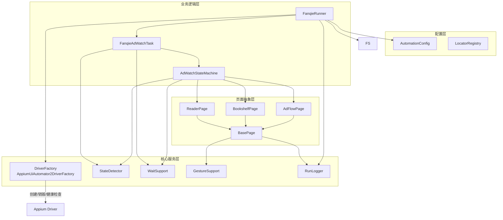
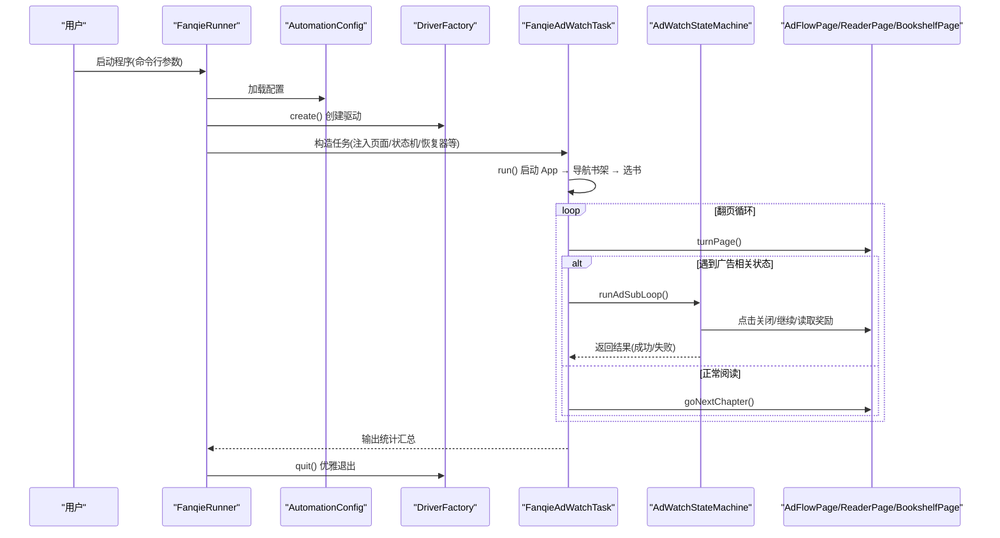
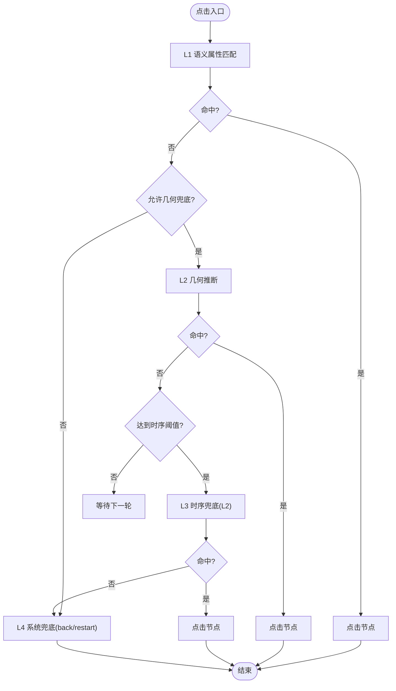
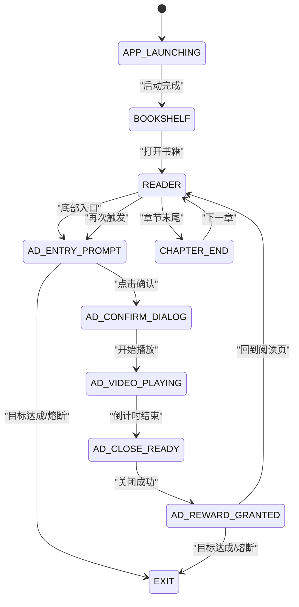
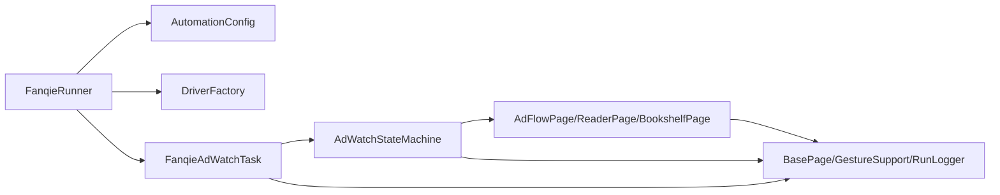

# 架构设计

<cite>
**本文引用的文件**
- [FanqieRunner.java](file://automation/src/main/java/com/fanqie/auto/FanqieRunner.java)
- [AutomationConfig.java](file://automation/src/main/java/com/fanqie/auto/config/AutomationConfig.java)
- [LocatorRegistry.java](file://automation/src/main/java/com/fanqie/auto/config/LocatorRegistry.java)
- [DriverFactory.java](file://automation/src/main/java/com/fanqie/auto/core/DriverFactory.java)
- [AppiumUiAutomator2DriverFactory.java](file://automation/src/main/java/com/fanqie/auto/core/AppiumUiAutomator2DriverFactory.java)
- [BasePage.java](file://automation/src/main/java/com/fanqie/auto/page/BasePage.java)
- [AdFlowPage.java](file://automation/src/main/java/com/fanqie/auto/page/AdFlowPage.java)
- [AdWatchStateMachine.java](file://automation/src/main/java/com/fanqie/auto/task/AdWatchStateMachine.java)
- [FanqieAdWatchTask.java](file://automation/src/main/java/com/fanqie/auto/task/FanqieAdWatchTask.java)
- [pom.xml](file://automation/pom.xml)
</cite>

## 目录
1. [引言](#引言)
2. [项目结构](#项目结构)
3. [核心组件](#核心组件)
4. [架构总览](#架构总览)
5. [详细组件分析](#详细组件分析)
6. [依赖关系分析](#依赖关系分析)
7. [性能考量](#性能考量)
8. [故障排查指南](#故障排查指南)
9. [结论](#结论)
10. [附录](#附录)

## 引言
本系统面向“番茄免费小说”的 UI 自动化：自动进入阅读页，翻页过程中检测并处理广告流程（观看激励视频、关闭弹窗、领取奖励），最终达成目标免广告时长。系统采用分层架构与多种设计模式，强调稳定性、可恢复性与可扩展性，支持断点续跑、多轮熔断保护、策略化定位与兜底机制。

## 项目结构
- 配置层：集中管理 Appium、时序、流程、翻页策略等所有可调参数，提供类型安全的 Getter，避免魔法数字。
- 核心服务层：驱动工厂、状态探测、等待、手势、日志、快照等通用能力。
- 页面抽象层：封装具体页面的交互（书架、阅读器、广告流），实现四级定位降级链与点击安全策略。
- 业务逻辑层：编排任务流程，协调状态机与页面操作，执行外层循环、翻页、广告子循环与轮换策略。

图表来源
- [FanqieRunner.java:120-200](file://automation/src/main/java/com/fanqie/auto/FanqieRunner.java#L120-L200)
- [AutomationConfig.java:110-287](file://automation/src/main/java/com/fanqie/auto/config/AutomationConfig.java#L110-L287)
- [DriverFactory.java:17-54](file://automation/src/main/java/com/fanqie/auto/core/DriverFactory.java#L17-L54)
- [AppiumUiAutomator2DriverFactory.java:44-118](file://automation/src/main/java/com/fanqie/auto/core/AppiumUiAutomator2DriverFactory.java#L44-L118)
- [BasePage.java:18-516](file://automation/src/main/java/com/fanqie/auto/page/BasePage.java#L18-L516)
- [AdFlowPage.java:21-430](file://automation/src/main/java/com/fanqie/auto/page/AdFlowPage.java#L21-L430)
- [AdWatchStateMachine.java:40-803](file://automation/src/main/java/com/fanqie/auto/task/AdWatchStateMachine.java#L40-L803)
- [FanqieAdWatchTask.java:20-625](file://automation/src/main/java/com/fanqie/auto/task/FanqieAdWatchTask.java#L20-L625)

章节来源
- [FanqieRunner.java:25-239](file://automation/src/main/java/com/fanqie/auto/FanqieRunner.java#L25-L239)
- [AutomationConfig.java:10-306](file://automation/src/main/java/com/fanqie/auto/config/AutomationConfig.java#L10-L306)
- [pom.xml:15-83](file://automation/pom.xml#L15-L83)

## 核心组件
- FanqieRunner：唯一入口，解析命令行参数，装配配置、环境自检、驱动、日志、页面与任务，注册 ShutdownHook 保证优雅退出。
- AutomationConfig：全局配置加载器，集中超时、轮次、阈值、翻页策略等，提供类型安全访问。
- LocatorRegistry：统一管理控件定位策略（主选择器、回退选择器、区域提示、是否允许几何兜底）。
- DriverFactory：驱动工厂接口，屏蔽底层驱动差异；AppiumUiAutomator2DriverFactory 为当前实现。
- BasePage：页面对象基类，实现四级定位降级链（语义匹配→几何推断→时序兜底→系统兜底）与安全点击。
- AdFlowPage：广告流程页面对象，高风险区，严格限制误点，提供关闭、继续、等待倒计时、奖励读取等能力。
- AdWatchStateMachine：状态机驱动的广告子循环，转移表驱动，四重熔断，幂等动作与退避重试，进度持久化。
- FanqieAdWatchTask：业务编排，启动 App、选书、翻页循环、广告子循环、书籍轮换与收尾统计。

章节来源
- [FanqieRunner.java:41-239](file://automation/src/main/java/com/fanqie/auto/FanqieRunner.java#L41-L239)
- [AutomationConfig.java:65-287](file://automation/src/main/java/com/fanqie/auto/config/AutomationConfig.java#L65-L287)
- [LocatorRegistry.java:16-300](file://automation/src/main/java/com/fanqie/auto/config/LocatorRegistry.java#L16-L300)
- [DriverFactory.java:17-54](file://automation/src/main/java/com/fanqie/auto/core/DriverFactory.java#L17-L54)
- [AppiumUiAutomator2DriverFactory.java:15-210](file://automation/src/main/java/com/fanqie/auto/core/AppiumUiAutomator2DriverFactory.java#L15-L210)
- [BasePage.java:18-516](file://automation/src/main/java/com/fanqie/auto/page/BasePage.java#L18-L516)
- [AdFlowPage.java:21-430](file://automation/src/main/java/com/fanqie/auto/page/AdFlowPage.java#L21-L430)
- [AdWatchStateMachine.java:40-803](file://automation/src/main/java/com/fanqie/auto/task/AdWatchStateMachine.java#L40-L803)
- [FanqieAdWatchTask.java:20-625](file://automation/src/main/java/com/fanqie/auto/task/FanqieAdWatchTask.java#L20-L625)

## 架构总览
系统采用分层架构与职责分离：
- 配置层：统一参数来源，避免硬编码，支持外部覆盖。
- 核心服务层：提供驱动生命周期管理、UI 探测、等待、手势、日志等通用能力。
- 页面抽象层：将页面交互封装为稳定 API，内置定位降级链与误点防护。
- 业务逻辑层：编排任务流程，使用状态机驱动复杂交互，确保健壮性和可恢复性。

关键设计模式：
- 工厂模式（DriverFactory）：屏蔽驱动实现细节，预留鸿蒙 NEXT 路线扩展点。
- 状态机模式（AdWatchStateMachine）：以转移表驱动状态流转，解耦动作与状态，支持幂等与重试。
- 策略模式（翻页策略）：通过配置切换 tap/swipe 翻页策略，参数化行为。

图表来源
- [FanqieRunner.java:120-239](file://automation/src/main/java/com/fanqie/auto/FanqieRunner.java#L120-L239)
- [FanqieAdWatchTask.java:99-314](file://automation/src/main/java/com/fanqie/auto/task/FanqieAdWatchTask.java#L99-L314)
- [AdWatchStateMachine.java:166-312](file://automation/src/main/java/com/fanqie/auto/task/AdWatchStateMachine.java#L166-L312)
- [AdFlowPage.java:165-262](file://automation/src/main/java/com/fanqie/auto/page/AdFlowPage.java#L165-L262)

## 详细组件分析

### 配置层（AutomationConfig、LocatorRegistry）
- AutomationConfig：集中管理 Appium、时序、流程、翻页策略等配置，提供类型安全 Getter，支持外部配置文件覆盖默认值。
- LocatorRegistry：维护控件的定位策略（主选择器、回退选择器、区域提示、是否允许几何兜底），并提供文案候选集与正则提取规则。

技术要点：
- UTF-8 编码加载 properties，避免中文乱码导致匹配失效。
- 对高风险按钮（观看广告、继续获取时长）禁用几何兜底，防止误点浪费配额；仅关闭按钮允许几何兜底。

章节来源
- [AutomationConfig.java:10-306](file://automation/src/main/java/com/fanqie/auto/config/AutomationConfig.java#L10-L306)
- [LocatorRegistry.java:16-300](file://automation/src/main/java/com/fanqie/auto/config/LocatorRegistry.java#L16-L300)

### 核心服务层（DriverFactory、AppiumUiAutomator2DriverFactory）
- DriverFactory：定义驱动创建、重建、健康检查、退出与获取驱动的接口。
- AppiumUiAutomator2DriverFactory：基于 Appium 2 + UiAutomator2 的实现，设置 capabilities、隐式等待为零、会话超时、华为/鸿蒙特殊能力，提供诊断信息。

设计权衡：
- 不设置 appActivity/app，改用运行时激活包名，避免权限拒绝。
- noReset=true 保留登录态与书架数据，适合长任务。
- implicitlyWait=0，避免阻塞短轮询，全部走显式等待。

章节来源
- [DriverFactory.java:17-54](file://automation/src/main/java/com/fanqie/auto/core/DriverFactory.java#L17-L54)
- [AppiumUiAutomator2DriverFactory.java:15-210](file://automation/src/main/java/com/fanqie/auto/core/AppiumUiAutomator2DriverFactory.java#L15-L210)

### 页面抽象层（BasePage、AdFlowPage）
- BasePage：实现四级定位降级链与点击安全策略，支持 boundsHint 裁决与几何推断，提供系统兜底（back/restart）。
- AdFlowPage：广告流程页面对象，严格限制误点，提供关闭、继续、等待倒计时、奖励读取等方法。

四级定位降级链：
- L1：语义属性匹配（text/content-desc/resource-id），命中多个时按 boundsHint 裁决。
- L2：结构化几何推断（指定区域内 clickable 且面积较小节点），受 allowGeometryFallback 控制。
- L3：时序兜底（达到 adVideoTimeoutMs 后强制 L2）。
- L4：系统兜底（navigate().back()，再失败则 restartApp）。

图表来源
- [BasePage.java:77-250](file://automation/src/main/java/com/fanqie/auto/page/BasePage.java#L77-L250)
- [AdFlowPage.java:165-262](file://automation/src/main/java/com/fanqie/auto/page/AdFlowPage.java#L165-L262)

章节来源
- [BasePage.java:18-516](file://automation/src/main/java/com/fanqie/auto/page/BasePage.java#L18-L516)
- [AdFlowPage.java:21-430](file://automation/src/main/java/com/fanqie/auto/page/AdFlowPage.java#L21-L430)

### 业务逻辑层（AdWatchStateMachine、FanqieAdWatchTask）
- AdWatchStateMachine：状态机驱动的广告子循环，转移表驱动，四重熔断（目标分钟、单入口轮次、全局轮次、墙钟时间预算），幂等动作与退避重试，进度持久化（断点续跑）。
- FanqieAdWatchTask：业务编排，启动 App、导航书架、选书、翻页循环、广告子循环、书籍轮换与收尾统计。

状态机关键点：
- 转移表驱动：每个状态对应处理器，动作前重新 detect，动作后校验状态转移。
- 幂等性：每轮广告计数使用 roundId + lastCountedRoundId，避免重复或漏计。
- 每日配额耗尽识别：去抖连续命中 + 上下文约束，优雅收尾。
- 进度持久化：earnedMinutes、totalAdRounds、usedBooks 集合持久化到 progress.properties。

图表来源
- [AdWatchStateMachine.java:398-653](file://automation/src/main/java/com/fanqie/auto/task/AdWatchStateMachine.java#L398-L653)

章节来源
- [AdWatchStateMachine.java:40-803](file://automation/src/main/java/com/fanqie/auto/task/AdWatchStateMachine.java#L40-L803)
- [FanqieAdWatchTask.java:20-625](file://automation/src/main/java/com/fanqie/auto/task/FanqieAdWatchTask.java#L20-L625)

## 依赖关系分析
- 入口依赖配置与驱动工厂，装配页面与任务。
- 任务依赖状态机与页面对象，状态机依赖页面与核心服务。
- 页面对象依赖核心服务（手势、日志、等待、探测）。
- 配置层被各层广泛引用，提供统一参数来源。

图表来源
- [FanqieRunner.java:120-200](file://automation/src/main/java/com/fanqie/auto/FanqieRunner.java#L120-L200)
- [FanqieAdWatchTask.java:42-81](file://automation/src/main/java/com/fanqie/auto/task/FanqieAdWatchTask.java#L42-L81)
- [AdWatchStateMachine.java:62-157](file://automation/src/main/java/com/fanqie/auto/task/AdWatchStateMachine.java#L62-L157)
- [BasePage.java:55-68](file://automation/src/main/java/com/fanqie/auto/page/BasePage.java#L55-L68)

章节来源
- [FanqieRunner.java:120-200](file://automation/src/main/java/com/fanqie/auto/FanqieRunner.java#L120-L200)
- [FanqieAdWatchTask.java:42-81](file://automation/src/main/java/com/fanqie/auto/task/FanqieAdWatchTask.java#L42-L81)
- [AdWatchStateMachine.java:62-157](file://automation/src/main/java/com/fanqie/auto/task/AdWatchStateMachine.java#L62-L157)
- [BasePage.java:55-68](file://automation/src/main/java/com/fanqie/auto/page/BasePage.java#L55-L68)

## 性能考量
- 短轮询与显式等待：隐式等待设为零，避免阻塞；使用 WebDriverWait 进行精确等待。
- 稀疏心跳：视频等待期间降低轮询频率，减少 CPU 与 RPC 压力。
- 配置化超时：所有超时、轮次、阈值集中在配置层，便于调优。
- 幂等与重试：状态机动作前后检测状态，失败退避重试，避免无效操作。
- 进度持久化：断点续跑减少重复工作，提升长任务效率。

[本节为通用指导，无需特定文件来源]

## 故障排查指南
- 环境自检：启动时打印手机侧设置核对清单，逐项确认开发者选项、USB 调试、ADB 授权等。
- 驱动创建失败：输出定向诊断信息，涵盖 APK 安装弹窗、仅充电模式下 ADB 调试、Appium Server 状态等。
- 状态卡死：单状态滞留熔断检测，触发恢复流程；连续错误上限触发恢复。
- 每日配额耗尽：去抖连续命中 + 上下文约束，优雅收尾退出。
- 奖励高估：奖励语义关键词过滤，避免将“剩余X分钟”误计为奖励。

章节来源
- [FanqieRunner.java:270-307](file://automation/src/main/java/com/fanqie/auto/FanqieRunner.java#L270-L307)
- [AppiumUiAutomator2DriverFactory.java:180-208](file://automation/src/main/java/com/fanqie/auto/core/AppiumUiAutomator2DriverFactory.java#L180-L208)
- [AdWatchStateMachine.java:197-233](file://automation/src/main/java/com/fanqie/auto/task/AdWatchStateMachine.java#L197-L233)
- [AdFlowPage.java:300-363](file://automation/src/main/java/com/fanqie/auto/page/AdFlowPage.java#L300-L363)

## 结论
本系统通过分层架构与设计模式实现了高内聚、低耦合的 UI 自动化方案。配置层集中管理参数，核心服务层提供通用能力，页面抽象层封装交互细节，业务逻辑层编排复杂流程。工厂模式、状态机模式与策略模式的结合，使系统具备强扩展性、高稳定性与良好可维护性。

[本节为总结，无需特定文件来源]

## 附录
- 构建与运行：使用 Maven 构建 fat-jar，支持 exec:java 直接运行入口类。
- 依赖版本锁定：通过 BOM 锁定 Selenium 版本，避免兼容性问题。
- 测试策略：离线单元测试，不连接真机，使用 fixture XML 与手写替身。

章节来源
- [pom.xml:100-176](file://automation/pom.xml#L100-L176)