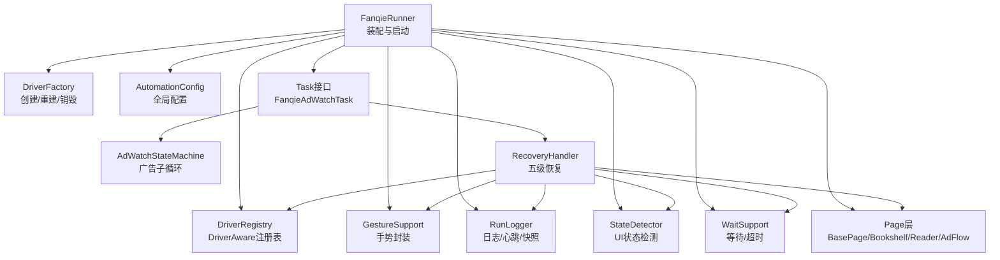
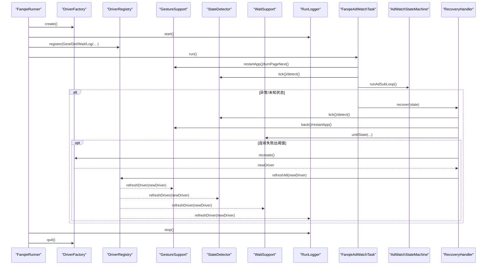
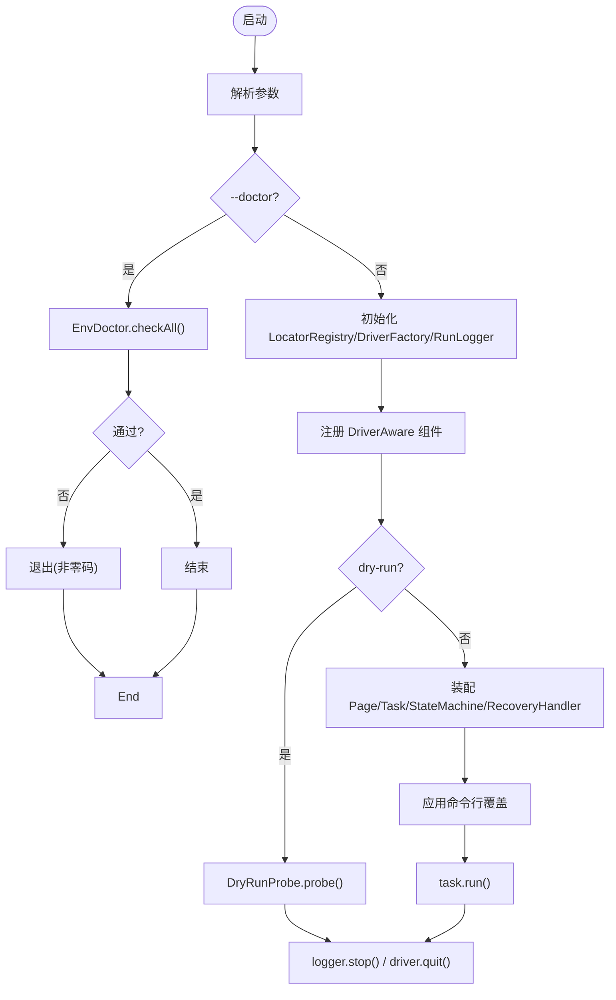
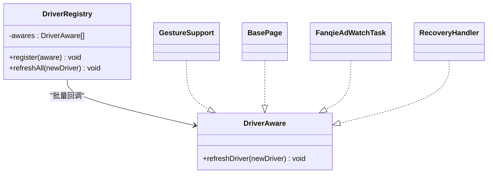
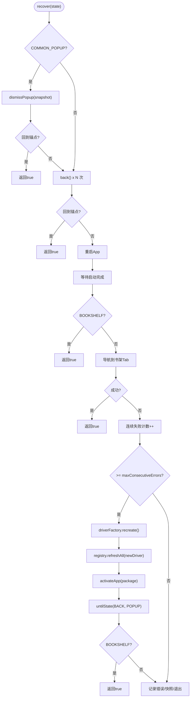
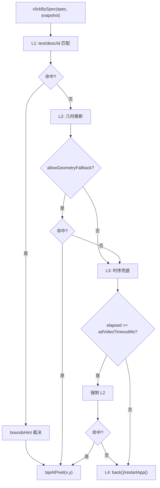
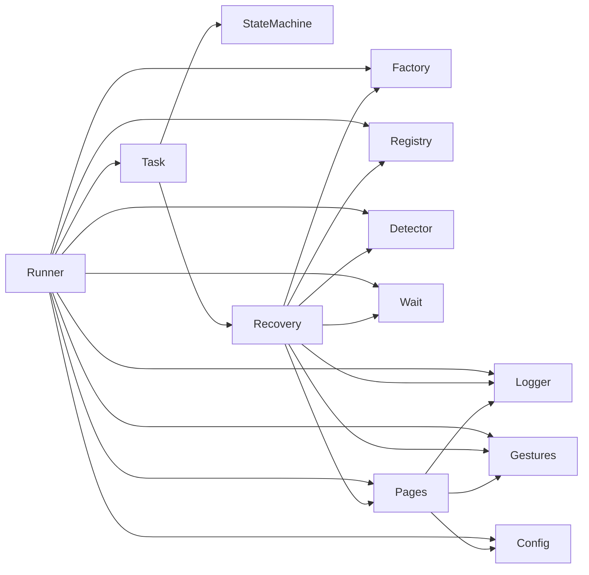

# 组件交互关系

<cite>
**本文引用的文件**
- [FanqieRunner.java](file://automation/src/main/java/com/fanqie/auto/FanqieRunner.java)
- [DriverRegistry.java](file://automation/src/main/java/com/fanqie/auto/core/DriverRegistry.java)
- [RecoveryHandler.java](file://automation/src/main/java/com/fanqie/auto/task/RecoveryHandler.java)
- [DriverAware.java](file://automation/src/main/java/com/fanqie/auto/core/DriverAware.java)
- [Task.java](file://automation/src/main/java/com/fanqie/auto/task/Task.java)
- [FanqieAdWatchTask.java](file://automation/src/main/java/com/fanqie/auto/task/FanqieAdWatchTask.java)
- [BasePage.java](file://automation/src/main/java/com/fanqie/auto/page/BasePage.java)
- [GestureSupport.java](file://automation/src/main/java/com/fanqie/auto/core/GestureSupport.java)
- [AutomationConfig.java](file://automation/src/main/java/com/fanqie/auto/config/AutomationConfig.java)
- [DriverFactory.java](file://automation/src/main/java/com/fanqie/auto/core/DriverFactory.java)
- [DriverRegistryTest.java](file://automation/src/test/java/com/fanqie/auto/core/DriverRegistryTest.java)
</cite>

## 目录
1. [简介](#简介)
2. [项目结构](#项目结构)
3. [核心组件](#核心组件)
4. [架构总览](#架构总览)
5. [详细组件分析](#详细组件分析)
6. [依赖关系分析](#依赖关系分析)
7. [性能与稳定性考量](#性能与稳定性考量)
8. [故障排查指南](#故障排查指南)
9. [结论](#结论)
10. [附录：接口与配置要点](#附录接口与配置要点)

## 简介
本文件聚焦于系统中各组件之间的协作关系，重点说明：
- FanqieRunner 作为“组装中心”如何装配并协调 Driver、Page、Task、StateDetector、WaitSupport、GestureSupport、RunLogger、RecoveryHandler 等组件。
- DriverRegistry 如何通过 DriverAware 接口统一管理 Driver 生命周期（创建、重建、刷新引用），避免 session 重建后旧 driver 引用导致的异常。
- RecoveryHandler 如何实现五级自愈策略，保证任意步骤失败都能回到已知锚点（书架或阅读页）。
- 组件间通过构造注入与接口抽象实现松耦合，便于独立测试与替换。

## 项目结构
该自动化框架采用分层组织：
- 入口与装配：FanqieRunner
- 核心能力：DriverFactory、DriverRegistry、DriverAware、GestureSupport、StateDetector、WaitSupport、RunLogger、LocatorRegistry、AutomationConfig
- 页面层：BasePage 及具体 Page（BookshelfPage、ReaderPage、AdFlowPage）
- 任务编排：Task 接口与 FanqieAdWatchTask
- 恢复机制：RecoveryHandler
- 状态机：AdWatchStateMachine（广告子流程控制）

图表来源
- [FanqieRunner.java:89-221](file://automation/src/main/java/com/fanqie/auto/FanqieRunner.java#L89-L221)
- [DriverFactory.java:17-54](file://automation/src/main/java/com/fanqie/auto/core/DriverFactory.java#L17-L54)
- [DriverRegistry.java:19-56](file://automation/src/main/java/com/fanqie/auto/core/DriverRegistry.java#L19-L56)
- [GestureSupport.java:26-50](file://automation/src/main/java/com/fanqie/auto/core/GestureSupport.java#L26-L50)
- [AutomationConfig.java:18-306](file://automation/src/main/java/com/fanqie/auto/config/AutomationConfig.java#L18-L306)
- [BasePage.java:40-73](file://automation/src/main/java/com/fanqie/auto/page/BasePage.java#L40-L73)
- [Task.java:12-25](file://automation/src/main/java/com/fanqie/auto/task/Task.java#L12-L25)
- [FanqieAdWatchTask.java:42-86](file://automation/src/main/java/com/fanqie/auto/task/FanqieAdWatchTask.java#L42-L86)
- [RecoveryHandler.java:44-81](file://automation/src/main/java/com/fanqie/auto/task/RecoveryHandler.java#L44-L81)

章节来源
- [FanqieRunner.java:89-221](file://automation/src/main/java/com/fanqie/auto/FanqieRunner.java#L89-L221)
- [DriverFactory.java:17-54](file://automation/src/main/java/com/fanqie/auto/core/DriverFactory.java#L17-L54)
- [DriverRegistry.java:19-56](file://automation/src/main/java/com/fanqie/auto/core/DriverRegistry.java#L19-L56)
- [GestureSupport.java:26-50](file://automation/src/main/java/com/fanqie/auto/core/GestureSupport.java#L26-L50)
- [AutomationConfig.java:18-306](file://automation/src/main/java/com/fanqie/auto/config/AutomationConfig.java#L18-L306)
- [BasePage.java:40-73](file://automation/src/main/java/com/fanqie/auto/page/BasePage.java#L40-L73)
- [Task.java:12-25](file://automation/src/main/java/com/fanqie/auto/task/Task.java#L12-L25)
- [FanqieAdWatchTask.java:42-86](file://automation/src/main/java/com/fanqie/auto/task/FanqieAdWatchTask.java#L42-L86)
- [RecoveryHandler.java:44-81](file://automation/src/main/java/com/fanqie/auto/task/RecoveryHandler.java#L44-L81)

## 核心组件
- FanqieRunner：唯一入口，负责参数解析、环境自检、组件装配、运行主任务、优雅退出。
- DriverFactory：抽象驱动工厂，统一创建/重建/健康检查/关闭 Appium session。
- DriverRegistry + DriverAware：集中管理所有持有 driver 的组件，在 session 重建后批量刷新引用。
- GestureSupport：封装点击、滑动、App 生命周期操作，坐标基于屏幕尺寸比例计算。
- BasePage：页面对象基类，提供四级定位降级链（语义匹配→几何推断→时序兜底→系统兜底）。
- AutomationConfig：集中化配置加载与类型化访问，屏蔽魔法数字。
- Task + FanqieAdWatchTask：业务编排，外层翻页循环、广告子循环、书籍轮换、熔断保护。
- RecoveryHandler：五级恢复策略，确保任意失败回到锚点；必要时重建 session 并刷新全部组件。

章节来源
- [FanqieRunner.java:25-38](file://automation/src/main/java/com/fanqie/auto/FanqieRunner.java#L25-L38)
- [DriverFactory.java:17-54](file://automation/src/main/java/com/fanqie/auto/core/DriverFactory.java#L17-L54)
- [DriverRegistry.java:19-56](file://automation/src/main/java/com/fanqie/auto/core/DriverRegistry.java#L19-L56)
- [DriverAware.java:5-20](file://automation/src/main/java/com/fanqie/auto/core/DriverAware.java#L5-L20)
- [GestureSupport.java:12-25](file://automation/src/main/java/com/fanqie/auto/core/GestureSupport.java#L12-L25)
- [BasePage.java:18-39](file://automation/src/main/java/com/fanqie/auto/page/BasePage.java#L18-L39)
- [AutomationConfig.java:10-17](file://automation/src/main/java/com/fanqie/auto/config/AutomationConfig.java#L10-L17)
- [Task.java:3-11](file://automation/src/main/java/com/fanqie/auto/task/Task.java#L3-L11)
- [FanqieAdWatchTask.java:20-41](file://automation/src/main/java/com/fanqie/auto/task/FanqieAdWatchTask.java#L20-L41)
- [RecoveryHandler.java:23-43](file://automation/src/main/java/com/fanqie/auto/task/RecoveryHandler.java#L23-L43)

## 架构总览
下图展示典型场景下的组件调用序列：从启动到执行翻页、遇到广告进入子循环、异常时触发恢复、必要时重建 session 并刷新引用。

图表来源
- [FanqieRunner.java:127-221](file://automation/src/main/java/com/fanqie/auto/FanqieRunner.java#L127-L221)
- [DriverFactory.java:19-53](file://automation/src/main/java/com/fanqie/auto/core/DriverFactory.java#L19-L53)
- [DriverRegistry.java:43-55](file://automation/src/main/java/com/fanqie/auto/core/DriverRegistry.java#L43-L55)
- [GestureSupport.java:189-226](file://automation/src/main/java/com/fanqie/auto/core/GestureSupport.java#L189-L226)
- [FanqieAdWatchTask.java:99-314](file://automation/src/main/java/com/fanqie/auto/task/FanqieAdWatchTask.java#L99-L314)
- [RecoveryHandler.java:100-253](file://automation/src/main/java/com/fanqie/auto/task/RecoveryHandler.java#L100-L253)

## 详细组件分析

### FanqieRunner：组装中心与控制流
- 职责：解析命令行参数、环境自检、装配 LocatorRegistry、DriverFactory、RunLogger、GestureSupport、StateDetector、WaitSupport、Page 层、Task、RecoveryHandler，并注册所有 DriverAware 组件。
- 关键流程：
  - 创建 Driver 并启动 RunLogger 心跳。
  - 注册 GestureSupport、StateDetector、WaitSupport、RunLogger 到 DriverRegistry。
  - 根据 dry-run 模式选择 DryRunProbe 或直接装配 Page 层与 Task。
  - 应用命令行覆盖（cycles/pages），打印进度与合规提示，执行 task.run()。
  - try-finally 中确保 logger.stop() 与 driver.quit() 幂等清理。

图表来源
- [FanqieRunner.java:41-238](file://automation/src/main/java/com/fanqie/auto/FanqieRunner.java#L41-L238)

章节来源
- [FanqieRunner.java:41-238](file://automation/src/main/java/com/fanqie/auto/FanqieRunner.java#L41-L238)

### DriverRegistry + DriverAware：Driver 生命周期管理
- DriverAware 接口定义 refreshDriver(AppiumDriver)，供所有持有 driver 的组件实现。
- DriverRegistry 使用 CopyOnWriteArrayList 维护已注册组件列表，提供 register 与 refreshAll。
- 在 RecoveryHandler 第五级恢复中，当连续失败达到阈值时调用 DriverFactory.recreate()，并通过 registry.refreshAll(newDriver) 将新 driver 传播到所有组件，避免 NoSuchSessionException。

图表来源
- [DriverAware.java:5-20](file://automation/src/main/java/com/fanqie/auto/core/DriverAware.java#L5-L20)
- [DriverRegistry.java:19-56](file://automation/src/main/java/com/fanqie/auto/core/DriverRegistry.java#L19-L56)
- [GestureSupport.java:41-50](file://automation/src/main/java/com/fanqie/auto/core/GestureSupport.java#L41-L50)
- [BasePage.java:70-73](file://automation/src/main/java/com/fanqie/auto/page/BasePage.java#L70-L73)
- [FanqieAdWatchTask.java:83-86](file://automation/src/main/java/com/fanqie/auto/task/FanqieAdWatchTask.java#L83-L86)
- [RecoveryHandler.java:78-81](file://automation/src/main/java/com/fanqie/auto/task/RecoveryHandler.java#L78-L81)

章节来源
- [DriverRegistry.java:19-56](file://automation/src/main/java/com/fanqie/auto/core/DriverRegistry.java#L19-L56)
- [DriverAware.java:5-20](file://automation/src/main/java/com/fanqie/auto/core/DriverAware.java#L5-L20)
- [DriverRegistryTest.java:45-141](file://automation/src/test/java/com/fanqie/auto/core/DriverRegistryTest.java#L45-L141)

### RecoveryHandler：五级恢复策略
- 第1级：COMMON_POPUP 弹窗关闭（按候选文案由弱到强尝试）。
- 第2级：逐级 back()，每次 back 后重新 detect 确认是否回到锚点。
- 第3级：重启 App（terminateApp + activateApp），等待启动完成。
- 第4级：若重启后不在 BOOKSHELF，主动导航到书架 Tab。
- 第5级：连续失败达到阈值时，recreate() 重建 session，并通过 DriverRegistry.refreshAll(newDriver) 刷新所有组件引用。
- 最终：仍失败则记录错误、捕获快照、标记会话死亡并退出。

图表来源
- [RecoveryHandler.java:100-253](file://automation/src/main/java/com/fanqie/auto/task/RecoveryHandler.java#L100-L253)
- [RecoveryHandler.java:269-321](file://automation/src/main/java/com/fanqie/auto/task/RecoveryHandler.java#L269-L321)
- [DriverFactory.java:28-34](file://automation/src/main/java/com/fanqie/auto/core/DriverFactory.java#L28-L34)
- [DriverRegistry.java:43-55](file://automation/src/main/java/com/fanqie/auto/core/DriverRegistry.java#L43-L55)

章节来源
- [RecoveryHandler.java:100-253](file://automation/src/main/java/com/fanqie/auto/task/RecoveryHandler.java#L100-L253)
- [RecoveryHandler.java:269-321](file://automation/src/main/java/com/fanqie/auto/task/RecoveryHandler.java#L269-L321)

### BasePage：四级定位降级链与点击
- L1：语义属性匹配（text → content-desc → resource-id），命中多个时用 boundsHint 裁决。
- L2：结构化几何推断（区域 clickable 节点筛选），受 allowGeometryFallback 标志保护。
- L3：时序兜底（adVideoTimeoutMs 后强制 L2）。
- L4：系统兜底（navigate().back() 或 restartApp）。
- 点击方式：基于 UiNode bounds 中心坐标，经 GestureSupport.tapAtPixel 执行，天然免疫 stale element。

图表来源
- [BasePage.java:77-236](file://automation/src/main/java/com/fanqie/auto/page/BasePage.java#L77-L236)
- [BasePage.java:300-336](file://automation/src/main/java/com/fanqie/auto/page/BasePage.java#L300-L336)
- [BasePage.java:347-406](file://automation/src/main/java/com/fanqie/auto/page/BasePage.java#L347-L406)

章节来源
- [BasePage.java:77-236](file://automation/src/main/java/com/fanqie/auto/page/BasePage.java#L77-L236)
- [BasePage.java:300-336](file://automation/src/main/java/com/fanqie/auto/page/BasePage.java#L300-L336)
- [BasePage.java:347-406](file://automation/src/main/java/com/fanqie/auto/page/BasePage.java#L347-L406)

### GestureSupport：手势与 App 生命周期
- 所有坐标基于运行时屏幕尺寸比例计算，避免硬编码像素。
- 支持 tapAtRatio/tapAtPixel、swipeUp/Down/Left/Right、activateApp/terminateApp/restartApp。
- 刷新 driver 时清除屏幕尺寸缓存，防止横屏/折叠屏旋转导致比例失真。

章节来源
- [GestureSupport.java:12-25](file://automation/src/main/java/com/fanqie/auto/core/GestureSupport.java#L12-L25)
- [GestureSupport.java:41-67](file://automation/src/main/java/com/fanqie/auto/core/GestureSupport.java#L41-L67)
- [GestureSupport.java:77-178](file://automation/src/main/java/com/fanqie/auto/core/GestureSupport.java#L77-L178)
- [GestureSupport.java:189-226](file://automation/src/main/java/com/fanqie/auto/core/GestureSupport.java#L189-L226)

### FanqieAdWatchTask：业务编排与轮转
- 阶段1：启动 App 并导航到书架，处理开屏广告与通用弹窗。
- 阶段2：打开一本书进入阅读页，自动跳过短剧/视频页。
- 阶段3：外层循环翻页，遇广告状态进入 AdWatchStateMachine 子循环；章节末尾跳转下一章；异常状态交由 RecoveryHandler。
- 书籍轮换：单入口广告轮次达上限且全局目标未达成时，回书架换下一本书继续。
- 熔断保护：墙钟时间预算耗尽、每日配额耗尽、目标分钟数达成时优雅收尾。

章节来源
- [FanqieAdWatchTask.java:99-314](file://automation/src/main/java/com/fanqie/auto/task/FanqieAdWatchTask.java#L99-L314)
- [FanqieAdWatchTask.java:322-396](file://automation/src/main/java/com/fanqie/auto/task/FanqieAdWatchTask.java#L322-L396)
- [FanqieAdWatchTask.java:527-623](file://automation/src/main/java/com/fanqie/auto/task/FanqieAdWatchTask.java#L527-L623)

### 依赖注入与消息传递
- 依赖注入：通过构造函数注入 Driver、AutomationConfig、LocatorRegistry、StateDetector、WaitSupport、GestureSupport、RunLogger、Page 实例、Task/StateMachine/RecoveryHandler 等，避免全局单例耦合。
- 消息传递：无显式消息总线，采用方法调用与状态对象（如 PageState、UiSnapshot）进行数据传递；RunLogger 用于状态更新与耗时上报；DriverRegistry 通过接口回调传播新 driver 引用。

章节来源
- [FanqieRunner.java:147-201](file://automation/src/main/java/com/fanqie/auto/FanqieRunner.java#L147-L201)
- [FanqieAdWatchTask.java:64-81](file://automation/src/main/java/com/fanqie/auto/task/FanqieAdWatchTask.java#L64-L81)
- [RecoveryHandler.java:64-76](file://automation/src/main/java/com/fanqie/auto/task/RecoveryHandler.java#L64-L76)
- [DriverRegistry.java:43-55](file://automation/src/main/java/com/fanqie/auto/core/DriverRegistry.java#L43-L55)

## 依赖关系分析
- FanqieRunner 依赖 DriverFactory、AutomationConfig、LocatorRegistry、RunLogger、GestureSupport、StateDetector、WaitSupport、Page 层、Task、RecoveryHandler。
- Task 依赖 Page 层、AdWatchStateMachine、RecoveryHandler。
- RecoveryHandler 依赖 GestureSupport、StateDetector、WaitSupport、RunLogger、DriverFactory、DriverRegistry、Page 层。
- BasePage 依赖 GestureSupport、AutomationConfig、LocatorRegistry、RunLogger。
- DriverRegistry 依赖 DriverAware 接口，不直接依赖具体实现，保持低耦合。

图表来源
- [FanqieRunner.java:147-201](file://automation/src/main/java/com/fanqie/auto/FanqieRunner.java#L147-L201)
- [FanqieAdWatchTask.java:64-81](file://automation/src/main/java/com/fanqie/auto/task/FanqieAdWatchTask.java#L64-L81)
- [RecoveryHandler.java:64-76](file://automation/src/main/java/com/fanqie/auto/task/RecoveryHandler.java#L64-L76)
- [BasePage.java:61-68](file://automation/src/main/java/com/fanqie/auto/page/BasePage.java#L61-L68)
- [DriverRegistry.java:19-56](file://automation/src/main/java/com/fanqie/auto/core/DriverRegistry.java#L19-L56)

章节来源
- [FanqieRunner.java:147-201](file://automation/src/main/java/com/fanqie/auto/FanqieRunner.java#L147-L201)
- [FanqieAdWatchTask.java:64-81](file://automation/src/main/java/com/fanqie/auto/task/FanqieAdWatchTask.java#L64-L81)
- [RecoveryHandler.java:64-76](file://automation/src/main/java/com/fanqie/auto/task/RecoveryHandler.java#L64-L76)
- [BasePage.java:61-68](file://automation/src/main/java/com/fanqie/auto/page/BasePage.java#L61-L68)
- [DriverRegistry.java:19-56](file://automation/src/main/java/com/fanqie/auto/core/DriverRegistry.java#L19-L56)

## 性能与稳定性考量
- 坐标计算缓存：GestureSupport 缓存屏幕尺寸，减少 RPC 开销；driver 刷新时失效缓存，适配横屏/折叠屏。
- 快照复用：BasePage 与 RecoveryHandler 使用 UiSnapshot 进行内存级查找，避免重复抓取 UI 树。
- 超时与重试：AutomationConfig 集中配置 pollInterval、actionTimeout、appLaunchTimeout、adVideoTimeout 等，避免魔法数字。
- 会话健康：DriverFactory.healthCheck 用于探活；RecoveryHandler 在连续失败时重建 session，并通过 DriverRegistry 刷新引用，降低 NoSuchSessionException 风险。
- 熔断保护：墙钟时间预算、每日配额、目标分钟数达成时优雅收尾，防止无限期占用设备。

章节来源
- [GestureSupport.java:52-67](file://automation/src/main/java/com/fanqie/auto/core/GestureSupport.java#L52-L67)
- [AutomationConfig.java:180-260](file://automation/src/main/java/com/fanqie/auto/config/AutomationConfig.java#L180-L260)
- [DriverFactory.java:36-42](file://automation/src/main/java/com/fanqie/auto/core/DriverFactory.java#L36-L42)
- [RecoveryHandler.java:212-244](file://automation/src/main/java/com/fanqie/auto/task/RecoveryHandler.java#L212-L244)
- [FanqieAdWatchTask.java:167-195](file://automation/src/main/java/com/fanqie/auto/task/FanqieAdWatchTask.java#L167-L195)

## 故障排查指南
- 常见异常：NoSuchSessionException、InvalidSessionIdException、StaleElementReferenceException。
- 处理策略：
  - 使用 DriverFactory.healthCheck 定期探活。
  - RecoveryHandler 在连续失败时重建 session，并通过 DriverRegistry.refreshAll 刷新所有组件引用。
  - BasePage 的四级定位降级链减少因控件属性缺失导致的定位失败。
  - 使用 RunLogger 记录错误、捕获快照，辅助定位问题现场。
- 单元测试验证：DriverRegistryTest 验证 refreshAll 的一致性、隔离性、去重与空注册表安全。

章节来源
- [DriverFactory.java:36-42](file://automation/src/main/java/com/fanqie/auto/core/DriverFactory.java#L36-L42)
- [RecoveryHandler.java:212-244](file://automation/src/main/java/com/fanqie/auto/task/RecoveryHandler.java#L212-L244)
- [BasePage.java:77-236](file://automation/src/main/java/com/fanqie/auto/page/BasePage.java#L77-L236)
- [DriverRegistryTest.java:45-141](file://automation/src/test/java/com/fanqie/auto/core/DriverRegistryTest.java#L45-L141)

## 结论
本框架通过 FanqieRunner 作为组装中心，结合 DriverFactory、DriverRegistry、DriverAware 接口实现了驱动生命周期的集中管理与刷新；RecoveryHandler 提供稳健的五级恢复策略，确保任意失败回到已知锚点；BasePage 的四级定位降级链提升了鲁棒性；GestureSupport 与 AutomationConfig 提供了可配置、可测试的手势与配置能力。整体设计遵循松耦合、高内聚原则，便于独立测试与替换。

## 附录：接口与配置要点
- 接口设计：
  - DriverAware：统一刷新 driver 引用。
  - Task：抽象任务执行入口，便于扩展其他 App/任务。
  - DriverFactory：抽象驱动创建/重建/健康检查/关闭。
- 配置要点：
  - 所有超时、轮次、阈值通过 AutomationConfig 获取，避免魔法数字。
  - 支持外部配置文件覆盖默认值，便于灵活调整。
  - 预留 driver.type 扩展点，未来可无缝切换至其他驱动实现。

章节来源
- [DriverAware.java:5-20](file://automation/src/main/java/com/fanqie/auto/core/DriverAware.java#L5-L20)
- [Task.java:12-25](file://automation/src/main/java/com/fanqie/auto/task/Task.java#L12-L25)
- [DriverFactory.java:17-54](file://automation/src/main/java/com/fanqie/auto/core/DriverFactory.java#L17-L54)
- [AutomationConfig.java:10-17](file://automation/src/main/java/com/fanqie/auto/config/AutomationConfig.java#L10-L17)
- [AutomationConfig.java:166-178](file://automation/src/main/java/com/fanqie/auto/config/AutomationConfig.java#L166-L178)