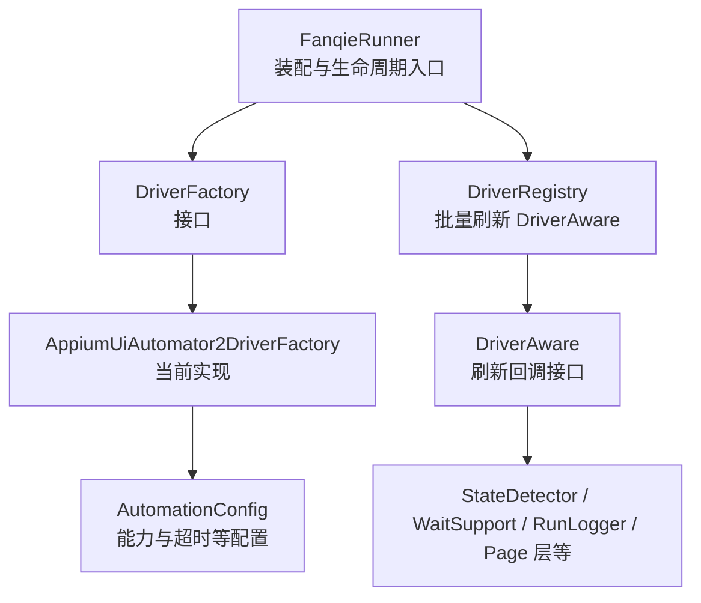
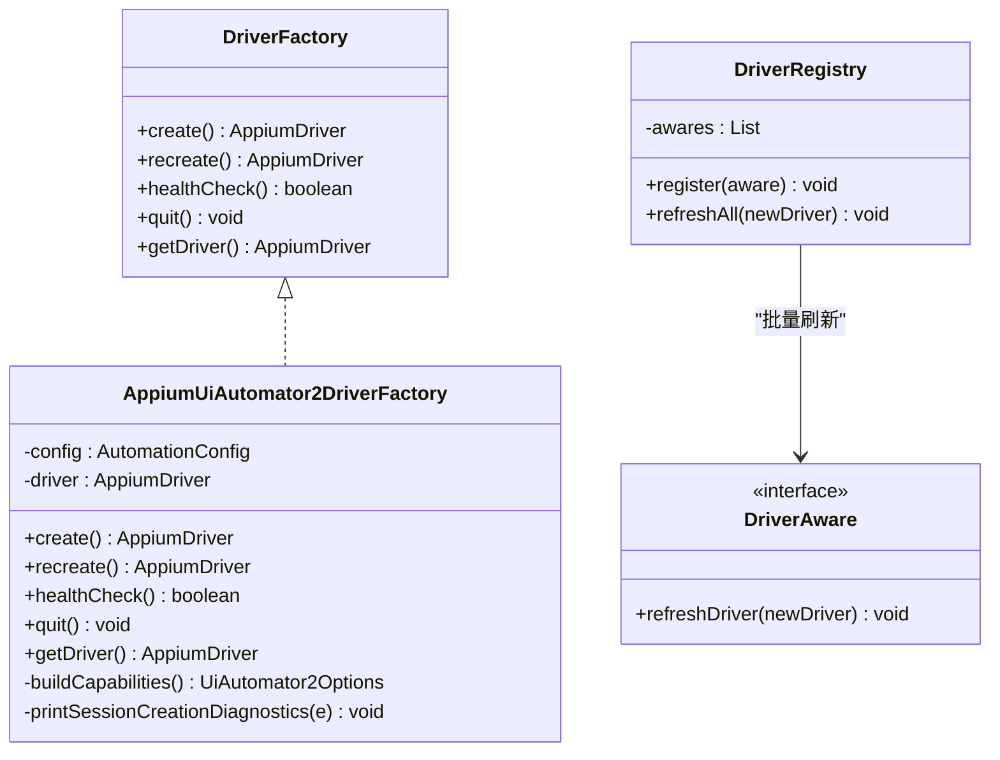
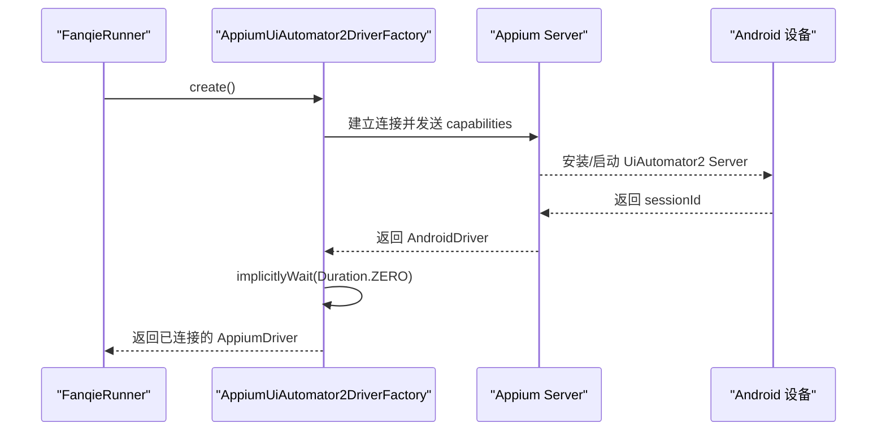
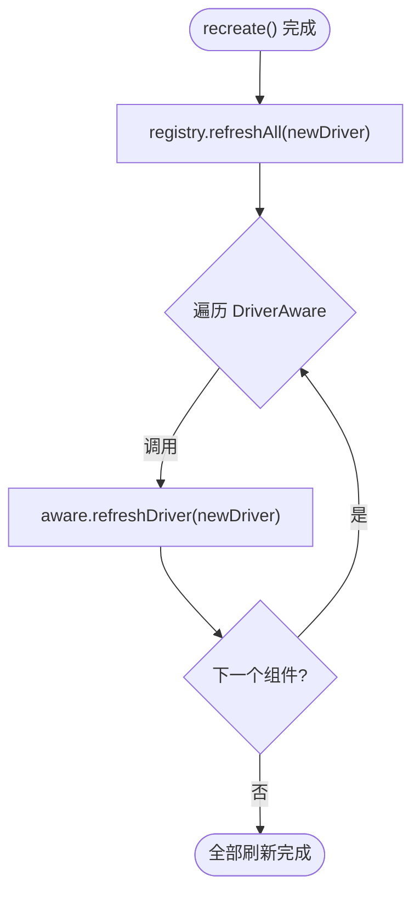
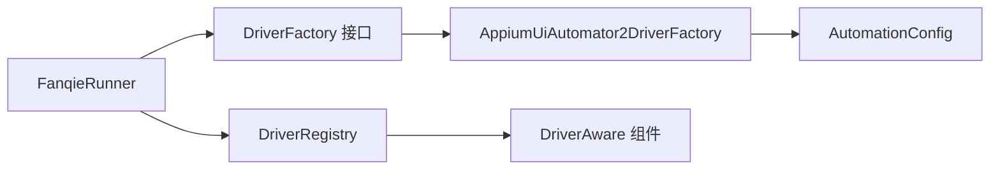

# 工厂模式

<cite>
**本文引用的文件**
- [DriverFactory.java](file://automation/src/main/java/com/fanqie/auto/core/DriverFactory.java)
- [AppiumUiAutomator2DriverFactory.java](file://automation/src/main/java/com/fanqie/auto/core/AppiumUiAutomator2DriverFactory.java)
- [DriverRegistry.java](file://automation/src/main/java/com/fanqie/auto/core/DriverRegistry.java)
- [DriverAware.java](file://automation/src/main/java/com/fanqie/auto/core/DriverAware.java)
- [FanqieRunner.java](file://automation/src/main/java/com/fanqie/auto/FanqieRunner.java)
- [AutomationConfig.java](file://automation/src/main/java/com/fanqie/auto/config/AutomationConfig.java)
- [README.md](file://automation/README.md)
</cite>

## 目录
1. [简介](#简介)
2. [项目结构](#项目结构)
3. [核心组件](#核心组件)
4. [架构总览](#架构总览)
5. [详细组件分析](#详细组件分析)
6. [依赖关系分析](#依赖关系分析)
7. [性能考量](#性能考量)
8. [故障排查指南](#故障排查指南)
9. [结论](#结论)
10. [附录](#附录)

## 简介
本文件围绕“工厂模式”在该自动化工程中的落地进行系统化说明，重点解析 DriverFactory 接口的设计理念与实现方式，解释如何通过工厂模式实现驱动类型的灵活切换（当前为 Appium UiAutomator2，未来可扩展至鸿蒙 NEXT 的 HdcUiTestDriverFactory）。文档将详细说明工厂模式的四个核心方法 create()、recreate()、healthCheck()、quit() 的职责与使用场景，并给出扩展新驱动类型的具体步骤与最佳实践。通过统一的生命周期管理与解耦设计，上层业务代码无需感知底层驱动差异，即可稳定运行。

## 项目结构
该自动化工程采用分层组织：配置层、核心驱动抽象层、页面层、任务层等。工厂模式位于核心驱动抽象层，负责创建、恢复、探活和退出驱动会话，并通过注册表机制在会话重建时统一刷新各组件持有的驱动引用。

图表来源
- [FanqieRunner.java:120-160](file://automation/src/main/java/com/fanqie/auto/FanqieRunner.java#L120-L160)
- [DriverFactory.java:17-53](file://automation/src/main/java/com/fanqie/auto/core/DriverFactory.java#L17-L53)
- [AppiumUiAutomator2DriverFactory.java:33-118](file://automation/src/main/java/com/fanqie/auto/core/AppiumUiAutomator2DriverFactory.java#L33-L118)
- [DriverRegistry.java:19-55](file://automation/src/main/java/com/fanqie/auto/core/DriverRegistry.java#L19-L55)
- [DriverAware.java:12-19](file://automation/src/main/java/com/fanqie/auto/core/DriverAware.java#L12-L19)

章节来源
- [FanqieRunner.java:120-201](file://automation/src/main/java/com/fanqie/auto/FanqieRunner.java#L120-L201)
- [DriverFactory.java:17-53](file://automation/src/main/java/com/fanqie/auto/core/DriverFactory.java#L17-L53)
- [AppiumUiAutomator2DriverFactory.java:33-118](file://automation/src/main/java/com/fanqie/auto/core/AppiumUiAutomator2DriverFactory.java#L33-L118)
- [DriverRegistry.java:19-55](file://automation/src/main/java/com/fanqie/auto/core/DriverRegistry.java#L19-L55)
- [DriverAware.java:12-19](file://automation/src/main/java/com/fanqie/auto/core/DriverAware.java#L12-L19)

## 核心组件
- DriverFactory：定义驱动工厂的统一契约，屏蔽具体驱动实现细节，提供 create/recreate/healthCheck/quit/getDriver 五个方法。
- AppiumUiAutomator2DriverFactory：标准 Appium 2 + UiAutomator2 的实现，封装会话创建、能力构建、隐式等待设置、健康检查与优雅退出。
- DriverRegistry：集中管理实现了 DriverAware 的组件，在会话重建后批量刷新 driver 引用，避免旧引用导致异常。
- DriverAware：组件刷新驱动的回调接口，确保 session 重建后所有持有 driver 的组件同步更新。
- FanqieRunner：应用主入口，按配置选择具体 DriverFactory 实现，组装各组件，管理生命周期与资源释放。
- AutomationConfig：读取 driver.type 等配置项，决定使用哪种驱动工厂。

章节来源
- [DriverFactory.java:17-53](file://automation/src/main/java/com/fanqie/auto/core/DriverFactory.java#L17-L53)
- [AppiumUiAutomator2DriverFactory.java:33-118](file://automation/src/main/java/com/fanqie/auto/core/AppiumUiAutomator2DriverFactory.java#L33-L118)
- [DriverRegistry.java:19-55](file://automation/src/main/java/com/fanqie/auto/core/DriverRegistry.java#L19-L55)
- [DriverAware.java:12-19](file://automation/src/main/java/com/fanqie/auto/core/DriverAware.java#L12-L19)
- [FanqieRunner.java:120-201](file://automation/src/main/java/com/fanqie/auto/FanqieRunner.java#L120-L201)
- [AutomationConfig.java:170-178](file://automation/src/main/java/com/fanqie/auto/config/AutomationConfig.java#L170-L178)

## 架构总览
工厂模式在本工程中承担“驱动类型可插拔”的核心职责。运行时根据配置选择具体工厂实现；上层组件仅依赖 DriverFactory 接口，从而实现对不同驱动（如 Appium UiAutomator2 或未来的鸿蒙 NEXT HdcUiTest）的零感知切换。

图表来源
- [DriverFactory.java:17-53](file://automation/src/main/java/com/fanqie/auto/core/DriverFactory.java#L17-L53)
- [AppiumUiAutomator2DriverFactory.java:33-118](file://automation/src/main/java/com/fanqie/auto/core/AppiumUiAutomator2DriverFactory.java#L33-L118)
- [DriverRegistry.java:19-55](file://automation/src/main/java/com/fanqie/auto/core/DriverRegistry.java#L19-L55)
- [DriverAware.java:12-19](file://automation/src/main/java/com/fanqie/auto/core/DriverAware.java#L12-L19)

## 详细组件分析

### DriverFactory 接口设计理念
- 目标：以接口抽象驱动创建与生命周期管理，使上层对具体驱动实现完全解耦。
- 设计要点：
  - 预留扩展点：注释明确为未来“HdcUiTestDriverFactory（鸿蒙 NEXT 兜底路线）”留出位置，新增实现即可，上层零感知。
  - 统一契约：create/recreate/healthCheck/quit/getDriver 覆盖完整生命周期，便于统一治理。
  - 错误诊断：接口约定 create 失败时内部捕获并输出中文诊断，降低定位成本。

章节来源
- [DriverFactory.java:5-16](file://automation/src/main/java/com/fanqie/auto/core/DriverFactory.java#L5-L16)
- [DriverFactory.java:17-53](file://automation/src/main/java/com/fanqie/auto/core/DriverFactory.java#L17-L53)

### AppiumUiAutomator2DriverFactory 实现要点
- 会话创建：
  - 从配置读取 server URL 与设备信息，构建 UiAutomator2Options 能力集。
  - 立即设置 implicitlyWait=0，避免未命中查找阻塞隐式超时，保障短轮询性能。
  - 不设置 appActivity/app，改用运行时激活应用，规避权限拒绝问题。
  - noReset=true 保护用户数据与登录态。
- 会话恢复：
  - recreate() 先 quit() 再 create()，保证安全退出旧会话并重建新会话。
- 健康检查：
  - healthCheck() 调用轻量命令探测窗口尺寸，捕获 NoSuchSessionException/WebDriverException 判断会话有效性。
- 优雅退出：
  - quit() 幂等，finally 中置空 driver，防止资源泄漏。
- 诊断输出：
  - printSessionCreationDiagnostics() 输出结构化中文排查清单，覆盖华为/鸿蒙特有场景。

图表来源
- [AppiumUiAutomator2DriverFactory.java:44-76](file://automation/src/main/java/com/fanqie/auto/core/AppiumUiAutomator2DriverFactory.java#L44-L76)
- [AppiumUiAutomator2DriverFactory.java:126-178](file://automation/src/main/java/com/fanqie/auto/core/AppiumUiAutomator2DriverFactory.java#L126-L178)

章节来源
- [AppiumUiAutomator2DriverFactory.java:44-118](file://automation/src/main/java/com/fanqie/auto/core/AppiumUiAutomator2DriverFactory.java#L44-L118)
- [AppiumUiAutomator2DriverFactory.java:126-208](file://automation/src/main/java/com/fanqie/auto/core/AppiumUiAutomator2DriverFactory.java#L126-L208)

### DriverRegistry 与 DriverAware 的协作
- 目的：当 DriverFactory.recreate() 成功重建会话后，统一刷新所有持有 driver 的组件引用，避免旧引用引发 NoSuchSessionException。
- 机制：
  - 组件实现 DriverAware 接口，并在构造或初始化时由 Runner 注册到 DriverRegistry。
  - 重建成功后，registry.refreshAll(newDriver) 遍历调用 aware.refreshDriver(newDriver)。
  - 单个组件刷新失败不影响其余组件（try-catch 隔离），提升健壮性。

图表来源
- [DriverRegistry.java:43-55](file://automation/src/main/java/com/fanqie/auto/core/DriverRegistry.java#L43-L55)
- [DriverAware.java:12-19](file://automation/src/main/java/com/fanqie/auto/core/DriverAware.java#L12-L19)

章节来源
- [DriverRegistry.java:19-55](file://automation/src/main/java/com/fanqie/auto/core/DriverRegistry.java#L19-L55)
- [DriverAware.java:12-19](file://automation/src/main/java/com/fanqie/auto/core/DriverAware.java#L12-L19)

### 工厂模式四个核心方法详解
- create()
  - 作用：首次创建会话，执行完整流程（包括安装/启动 UiAutomator2 Server、设置能力、设置隐式等待等）。
  - 使用场景：应用启动时或需要新建会话时调用。
  - 异常处理：捕获异常并输出中文诊断，抛出 RuntimeException 供上层统一处理。
- recreate()
  - 作用：销毁当前会话并重新创建，用于会话断开后的恢复。
  - 使用场景：健康检查失败或检测到会话无效时触发。
  - 行为：先 quit() 再 create()，保证幂等与安全。
- healthCheck()
  - 作用：低成本探活，检测当前会话是否仍然有效。
  - 使用场景：心跳保活、长任务期间周期性检查。
  - 行为：调用轻量命令（如获取窗口尺寸），捕获会话相关异常判定失效。
- quit()
  - 作用：优雅退出当前会话，释放资源。
  - 使用场景：应用关闭、异常退出、ShutdownHook 清理。
  - 行为：幂等，finally 置空 driver，避免重复退出抛异常。

章节来源
- [DriverFactory.java:19-53](file://automation/src/main/java/com/fanqie/auto/core/DriverFactory.java#L19-L53)
- [AppiumUiAutomator2DriverFactory.java:44-118](file://automation/src/main/java/com/fanqie/auto/core/AppiumUiAutomator2DriverFactory.java#L44-L118)

### 如何扩展新的驱动类型（示例：鸿蒙 NEXT 的 HdcUiTestDriverFactory）
- 步骤概览：
  - 新增类 HdcUiTestDriverFactory 实现 DriverFactory 接口的五个方法。
  - 在 FanqieRunner.createDriverFactory() 中增加 case "harmony_hdc" 分支，实例化新工厂。
  - 在配置文件中设置 driver.type=harmony_hdc。
  - 若鸿蒙 NEXT 的 UiTest 通道不是标准 Appium，需在工厂内部做适配，使 getDriver()/create() 返回满足 AppiumDriver 契约的对象（例如桥接实现）。
- 复用优势：
  - StateDetector、PageState、LocatorRegistry、AdWatchStateMachine、RunLogger 以及 page 层均可 100% 复用，上层零感知。

章节来源
- [README.md:622-657](file://automation/README.md#L622-L657)
- [FanqieRunner.java:251-267](file://automation/src/main/java/com/fanqie/auto/FanqieRunner.java#L251-L267)
- [AutomationConfig.java:170-178](file://automation/src/main/java/com/fanqie/auto/config/AutomationConfig.java#L170-L178)

### 集成示例与最佳实践
- 集成示例：
  - 在 FanqieRunner 中按配置选择工厂实现，创建 driver 并注入到各组件。
  - 通过 DriverRegistry 注册所有 DriverAware 组件，确保会话重建后引用一致性。
  - 使用 ShutdownHook 与 finally 块保证 logger.stop() 与 driver.quit() 被调用，避免资源泄漏。
- 最佳实践建议：
  - 始终通过工厂创建/销毁驱动，禁止直接 new AndroidDriver。
  - 会话创建后立即设置隐式等待为零，统一使用显式等待。
  - 使用 noReset=true 保护用户数据与登录态。
  - 健康检查与心跳保活结合，及时恢复断开的会话。
  - 扩展新驱动时，保持接口契约一致，尽量复用现有上层组件。

章节来源
- [FanqieRunner.java:120-238](file://automation/src/main/java/com/fanqie/auto/FanqieRunner.java#L120-L238)
- [AppiumUiAutomator2DriverFactory.java:44-118](file://automation/src/main/java/com/fanqie/auto/core/AppiumUiAutomator2DriverFactory.java#L44-L118)

## 依赖关系分析
工厂模式在本工程中的依赖关系清晰且低耦合：
- FanqieRunner 依赖 DriverFactory 接口，而非具体实现。
- AppiumUiAutomator2DriverFactory 依赖 AutomationConfig 与 Appium 客户端库。
- DriverRegistry 依赖 DriverAware 接口，与具体组件解耦。
- 上层组件（StateDetector、WaitSupport、RunLogger、Page 层）通过 DriverAware 接收驱动刷新，避免直接耦合驱动创建逻辑。

图表来源
- [FanqieRunner.java:120-201](file://automation/src/main/java/com/fanqie/auto/FanqieRunner.java#L120-L201)
- [DriverFactory.java:17-53](file://automation/src/main/java/com/fanqie/auto/core/DriverFactory.java#L17-L53)
- [AppiumUiAutomator2DriverFactory.java:33-118](file://automation/src/main/java/com/fanqie/auto/core/AppiumUiAutomator2DriverFactory.java#L33-L118)
- [DriverRegistry.java:19-55](file://automation/src/main/java/com/fanqie/auto/core/DriverRegistry.java#L19-L55)
- [DriverAware.java:12-19](file://automation/src/main/java/com/fanqie/auto/core/DriverAware.java#L12-L19)

章节来源
- [FanqieRunner.java:120-201](file://automation/src/main/java/com/fanqie/auto/FanqieRunner.java#L120-L201)
- [DriverFactory.java:17-53](file://automation/src/main/java/com/fanqie/auto/core/DriverFactory.java#L17-L53)
- [AppiumUiAutomator2DriverFactory.java:33-118](file://automation/src/main/java/com/fanqie/auto/core/AppiumUiAutomator2DriverFactory.java#L33-L118)
- [DriverRegistry.java:19-55](file://automation/src/main/java/com/fanqie/auto/core/DriverRegistry.java#L19-L55)
- [DriverAware.java:12-19](file://automation/src/main/java/com/fanqie/auto/core/DriverAware.java#L12-L19)

## 性能考量
- 隐式等待为零：避免未命中查找阻塞隐式超时，保障短轮询性能。
- 轻量健康检查：使用最小开销命令探测会话状态，减少网络与设备交互。
- 能力优化：禁用不必要的自动补全、延长服务器安装/启动超时以适应慢设备。
- 会话保活：通过心跳与长时间命令超时，避免广告视频静默期导致的断连。

章节来源
- [AppiumUiAutomator2DriverFactory.java:63-67](file://automation/src/main/java/com/fanqie/auto/core/AppiumUiAutomator2DriverFactory.java#L63-L67)
- [AppiumUiAutomator2DriverFactory.java:86-100](file://automation/src/main/java/com/fanqie/auto/core/AppiumUiAutomator2DriverFactory.java#L86-L100)
- [AppiumUiAutomator2DriverFactory.java:142-158](file://automation/src/main/java/com/fanqie/auto/core/AppiumUiAutomator2DriverFactory.java#L142-L158)

## 故障排查指南
- 会话创建失败：
  - 查看定向中文诊断输出，逐项核对设备安装弹窗、USB 调试、授权、Appium Server 状态等。
- 会话断开：
  - 使用 healthCheck() 定期探测，失败则调用 recreate() 恢复。
- 资源泄漏：
  - 确保 quit() 在 finally 或 ShutdownHook 中被调用，避免进程残留会话。
- 组件引用不一致：
  - 确认所有持有 driver 的组件已实现 DriverAware 并注册到 DriverRegistry，重建后统一刷新。

章节来源
- [AppiumUiAutomator2DriverFactory.java:184-208](file://automation/src/main/java/com/fanqie/auto/core/AppiumUiAutomator2DriverFactory.java#L184-L208)
- [DriverRegistry.java:43-55](file://automation/src/main/java/com/fanqie/auto/core/DriverRegistry.java#L43-L55)
- [FanqieRunner.java:232-238](file://automation/src/main/java/com/fanqie/auto/FanqieRunner.java#L232-L238)

## 结论
通过 DriverFactory 接口与 AppiumUiAutomator2DriverFactory 实现，本工程成功将驱动类型与上层业务解耦，提供了灵活的驱动切换能力与统一的生命周期管理。配合 DriverRegistry 与 DriverAware，确保了会话重建时的引用一致性。未来扩展鸿蒙 NEXT 的 HdcUiTestDriverFactory 只需新增实现与配置分支，上层零改动，体现了分层抽象的价值。

## 附录
- 配置项 driver.type：
  - 当前支持 uiautomator2，预留 harmony_hdc 等未来值。
  - 未知值回退到 uiautomator2，保证兼容性。
- 扩展步骤回顾：
  - 新增 HdcUiTestDriverFactory 实现 DriverFactory。
  - 在 FanqieRunner 中增加 case 分支。
  - 设置配置文件 driver.type=harmony_hdc。
  - 如需适配非标准 Appium，内部封装桥接以满足 AppiumDriver 契约。

章节来源
- [AutomationConfig.java:170-178](file://automation/src/main/java/com/fanqie/auto/config/AutomationConfig.java#L170-L178)
- [FanqieRunner.java:251-267](file://automation/src/main/java/com/fanqie/auto/FanqieRunner.java#L251-L267)
- [README.md:622-657](file://automation/README.md#L622-L657)