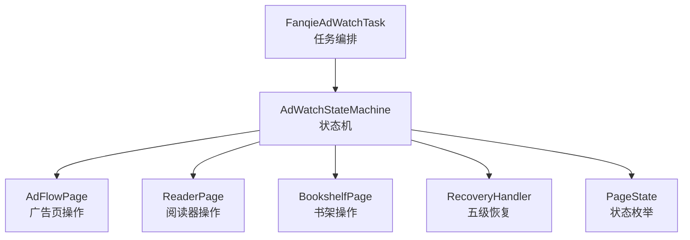
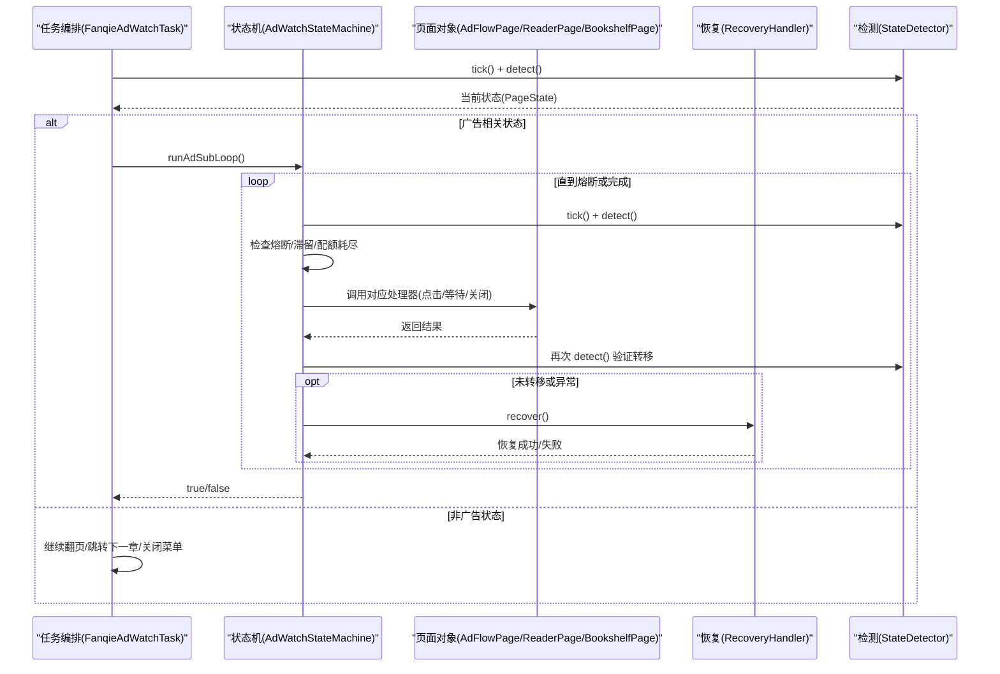
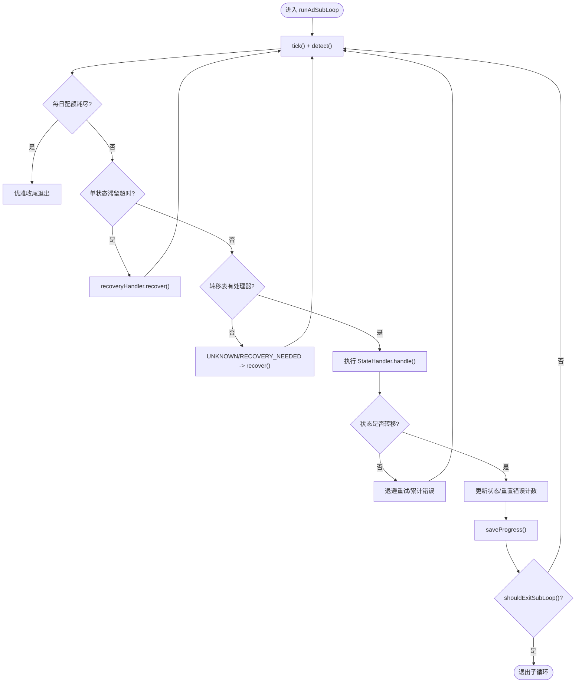
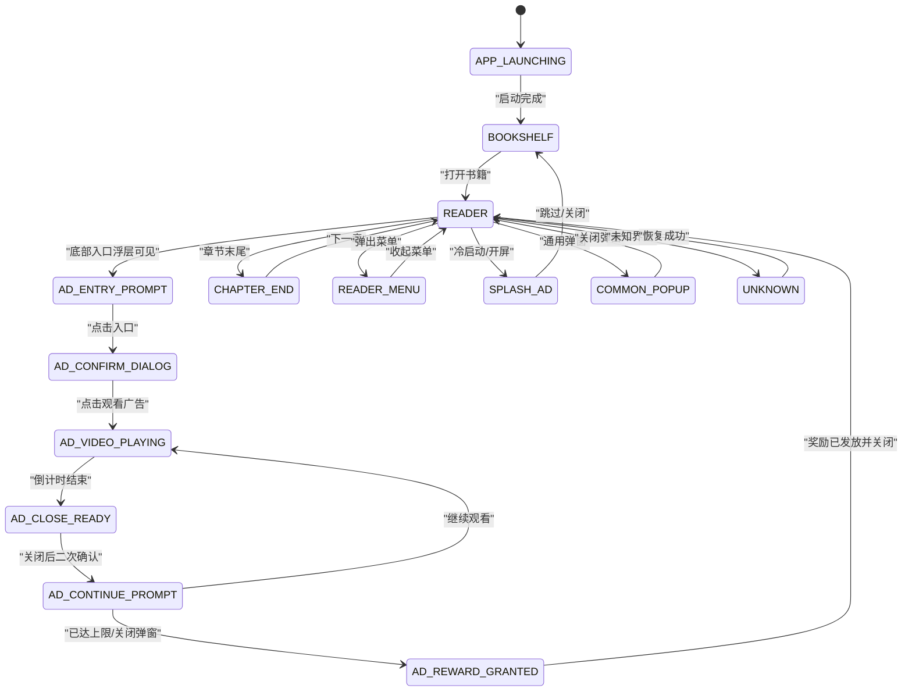
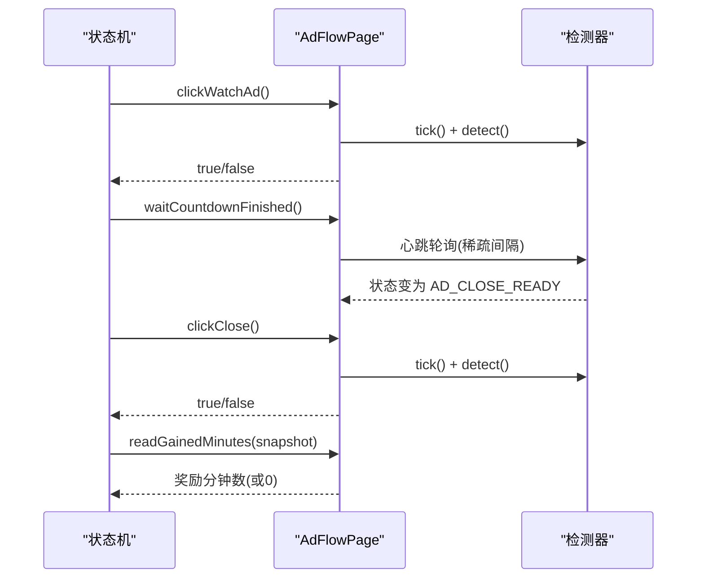
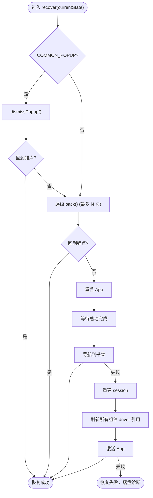
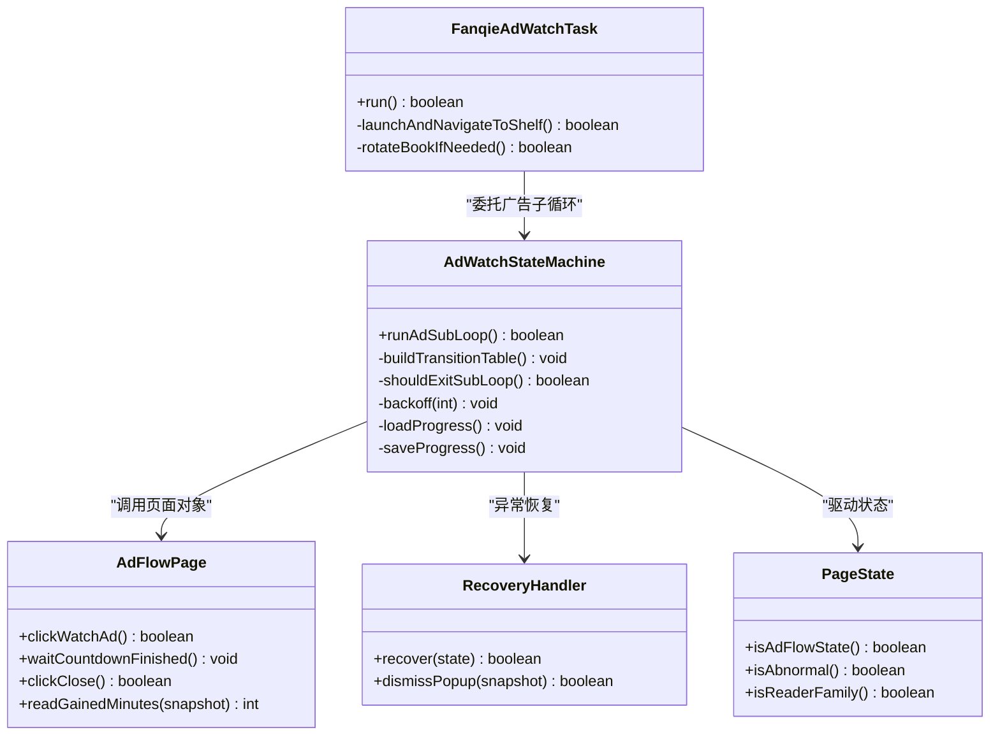

# 状态机模式

<cite>
**本文引用的文件**
- [AdWatchStateMachine.java](file://automation/src/main/java/com/fanqie/auto/task/AdWatchStateMachine.java)
- [FanqieAdWatchTask.java](file://automation/src/main/java/com/fanqie/auto/task/FanqieAdWatchTask.java)
- [AdFlowPage.java](file://automation/src/main/java/com/fanqie/auto/page/AdFlowPage.java)
- [RecoveryHandler.java](file://automation/src/main/java/com/fanqie/auto/task/RecoveryHandler.java)
- [PageState.java](file://automation/src/main/java/com/fanqie/auto/core/PageState.java)
- [AdWatchStateMachineTest.java](file://automation/src/test/java/com/fanqie/auto/task/AdWatchStateMachineTest.java)
</cite>

## 目录
1. [简介](#简介)
2. [项目结构](#项目结构)
3. [核心组件](#核心组件)
4. [架构总览](#架构总览)
5. [详细组件分析](#详细组件分析)
6. [依赖关系分析](#依赖关系分析)
7. [性能与稳定性考量](#性能与稳定性考量)
8. [故障排查指南](#故障排查指南)
9. [结论](#结论)
10. [附录：扩展新状态的实践指南](#附录扩展新状态的实践指南)

## 简介
本文件围绕 AdWatchStateMachine 的状态机模式进行深入剖析，解释其如何通过“转移表驱动”的方式管理复杂的页面状态转换，包括状态定义、转移条件、处理器机制、幂等性保障、熔断策略、进度持久化与恢复。文档同时给出广告观看流程中的典型状态变化图、业务场景示例，并总结状态机模式在可维护性、可读性与可测试性方面的优势，最后提供扩展新状态的最佳实践。

## 项目结构
该自动化任务以“任务编排 + 状态机 + 页面对象 + 自愈恢复”的分层组织为核心：
- 任务编排：FanqieAdWatchTask 负责启动 App、进入阅读页、翻页循环、遇到广告态时委派给状态机处理。
- 状态机：AdWatchStateMachine 通过 PageState 枚举与转移表（Map<PageState, StateHandler>）驱动状态流转，内置四重熔断、退避重试、进度持久化。
- 页面对象：AdFlowPage/ReaderPage/BookshelfPage 封装具体 UI 操作（点击、等待、关闭弹窗等）。
- 自愈恢复：RecoveryHandler 提供五级恢复策略，确保任意异常回到已知锚点。
- 状态定义：PageState 枚举集中描述所有页面状态及语义判断方法。

图表来源
- [FanqieAdWatchTask.java:99-314](file://automation/src/main/java/com/fanqie/auto/task/FanqieAdWatchTask.java#L99-L314)
- [AdWatchStateMachine.java:120-653](file://automation/src/main/java/com/fanqie/auto/task/AdWatchStateMachine.java#L120-L653)
- [AdFlowPage.java:76-428](file://automation/src/main/java/com/fanqie/auto/page/AdFlowPage.java#L76-L428)
- [RecoveryHandler.java:100-253](file://automation/src/main/java/com/fanqie/auto/task/RecoveryHandler.java#L100-L253)
- [PageState.java:11-96](file://automation/src/main/java/com/fanqie/auto/core/PageState.java#L11-L96)

章节来源
- [FanqieAdWatchTask.java:99-314](file://automation/src/main/java/com/fanqie/auto/task/FanqieAdWatchTask.java#L99-L314)
- [AdWatchStateMachine.java:120-653](file://automation/src/main/java/com/fanqie/auto/task/AdWatchStateMachine.java#L120-L653)

## 核心组件
- 状态枚举 PageState：集中定义所有页面状态，并提供 isAdFlowState()、isAbnormal()、isReaderFamily() 等语义判断方法，作为状态机的驱动基础。
- 状态机 AdWatchStateMachine：
  - 转移表驱动：Map<PageState, StateHandler> 将每个状态映射到处理器函数，当前状态决定下一步动作，不假设固定顺序。
  - 幂等性保证：执行动作前重新 detect() 确认状态未漂移；动作后校验是否发生预期转移，否则退避重试或触发恢复。
  - 四重熔断：目标分钟达成、单入口轮次上限、全局轮次上限、墙钟时间预算耗尽；另含单状态滞留超时检测。
  - 奖励计数幂等：使用 roundId + lastCountedRoundId 保证每真实一轮至多计一次且不漏计。
  - 进度持久化：断点续跑，记录 earnedMinutes、totalAdRounds、usedBooks、lastUpdateDate 等。
- 页面对象 AdFlowPage：实现四级兜底关闭按钮（L1→L2→L3→L4），视频等待期间不做任何点击，避免误触落地页。
- 自愈恢复 RecoveryHandler：五级恢复策略（关闭弹窗、逐级 back、重启 App、导航到书架、重建 session），超过阈值落盘诊断并退出。
- 任务编排 FanqieAdWatchTask：外层循环翻页，遇广告态进入状态机子循环，结束后确保回到阅读页家族，必要时轮换书籍。

章节来源
- [PageState.java:11-96](file://automation/src/main/java/com/fanqie/auto/core/PageState.java#L11-L96)
- [AdWatchStateMachine.java:62-312](file://automation/src/main/java/com/fanqie/auto/task/AdWatchStateMachine.java#L62-L312)
- [AdFlowPage.java:76-428](file://automation/src/main/java/com/fanqie/auto/page/AdFlowPage.java#L76-L428)
- [RecoveryHandler.java:100-253](file://automation/src/main/java/com/fanqie/auto/task/RecoveryHandler.java#L100-L253)
- [FanqieAdWatchTask.java:99-314](file://automation/src/main/java/com/fanqie/auto/task/FanqieAdWatchTask.java#L99-L314)

## 架构总览
状态机模式在本项目中体现为“配置化的转移表 + 处理器函数式接口”，将复杂业务流程解耦为“状态 → 动作 → 新状态”的清晰映射。任务编排层只关注高层流程（翻页、进入广告、回到阅读页），状态机专注处理广告相关状态转换与异常恢复。

图表来源
- [FanqieAdWatchTask.java:197-305](file://automation/src/main/java/com/fanqie/auto/task/FanqieAdWatchTask.java#L197-L305)
- [AdWatchStateMachine.java:173-312](file://automation/src/main/java/com/fanqie/auto/task/AdWatchStateMachine.java#L173-L312)
- [AdFlowPage.java:116-262](file://automation/src/main/java/com/fanqie/auto/page/AdFlowPage.java#L116-L262)
- [RecoveryHandler.java:100-253](file://automation/src/main/java/com/fanqie/auto/task/RecoveryHandler.java#L100-L253)

## 详细组件分析

### 状态机设计与转移表驱动
- 状态定义：PageState 枚举集中管理所有页面状态，并提供语义判断方法，便于跨层一致理解。
- 转移表构建：buildTransitionTable() 将每个 PageState 映射到一个 StateHandler 函数，函数内包含动作执行、等待、再检测、返回新状态。
- 幂等性：每次动作前重新 detect() 确认状态未漂移；动作后校验是否发生预期转移，未转移则计入连续错误并退避重试，达到阈值触发恢复。
- 熔断：四重独立熔断（目标分钟、单入口轮次、全局轮次、墙钟预算）+ 单状态滞留超时检测，任一触发即退出子循环。
- 奖励计数幂等：roundId + lastCountedRoundId 保证每真实一轮至多计一次且不漏计，避免分流路径导致的漏计问题。
- 进度持久化：loadProgress/saveProgress 支持断点续跑，记录 earnedMinutes、totalAdRounds、usedBooks、lastUpdateDate 等。

图表来源
- [AdWatchStateMachine.java:173-312](file://automation/src/main/java/com/fanqie/auto/task/AdWatchStateMachine.java#L173-L312)
- [AdWatchStateMachine.java:355-394](file://automation/src/main/java/com/fanqie/auto/task/AdWatchStateMachine.java#L355-L394)
- [AdWatchStateMachine.java:398-653](file://automation/src/main/java/com/fanqie/auto/task/AdWatchStateMachine.java#L398-L653)

章节来源
- [AdWatchStateMachine.java:62-312](file://automation/src/main/java/com/fanqie/auto/task/AdWatchStateMachine.java#L62-L312)
- [AdWatchStateMachine.java:355-394](file://automation/src/main/java/com/fanqie/auto/task/AdWatchStateMachine.java#L355-L394)
- [AdWatchStateMachine.java:398-653](file://automation/src/main/java/com/fanqie/auto/task/AdWatchStateMachine.java#L398-L653)

### 广告观看流程状态转换图
以下状态转换覆盖广告观看的核心路径，包括开屏广告、广告入口、确认弹窗、视频播放、关闭、继续提示、奖励发放等。

图表来源
- [PageState.java:11-96](file://automation/src/main/java/com/fanqie/auto/core/PageState.java#L11-L96)
- [AdWatchStateMachine.java:398-653](file://automation/src/main/java/com/fanqie/auto/task/AdWatchStateMachine.java#L398-L653)

### 关键处理器与页面对交互
- 开屏广告：优先尝试「跳过」文案匹配，否则降级到 clickClose() 全链路兜底。
- 广告入口：点击底部入口后等待进入确认弹窗或直接进入视频播放。
- 确认弹窗：仅 L1 语义匹配，禁用几何兜底以防误点浪费配额。
- 视频播放：不做任何点击，仅心跳轮询等待倒计时结束。
- 关闭按钮：L1→L2→L3→L4 全链路兜底，唯一允许激进兜底的控件。
- 继续提示：根据熔断条件决定是否继续观看，否则关闭弹窗。
- 奖励发放：读取奖励分钟数（带奖励语义关键词过滤），关闭弹窗。

图表来源
- [AdFlowPage.java:76-163](file://automation/src/main/java/com/fanqie/auto/page/AdFlowPage.java#L76-L163)
- [AdFlowPage.java:180-262](file://automation/src/main/java/com/fanqie/auto/page/AdFlowPage.java#L180-L262)
- [AdFlowPage.java:317-363](file://automation/src/main/java/com/fanqie/auto/page/AdFlowPage.java#L317-L363)
- [AdWatchStateMachine.java:467-595](file://automation/src/main/java/com/fanqie/auto/task/AdWatchStateMachine.java#L467-L595)

章节来源
- [AdFlowPage.java:76-428](file://automation/src/main/java/com/fanqie/auto/page/AdFlowPage.java#L76-L428)
- [AdWatchStateMachine.java:416-595](file://automation/src/main/java/com/fanqie/auto/task/AdWatchStateMachine.java#L416-L595)

### 自愈恢复机制
- 五级恢复：关闭弹窗 → 逐级 back() → 重启 App → 导航到书架 → 重建 session。
- 安全底线：超过 maxRecoveryRetry 停止并保留现场，绝不盲目连点。
- 状态机集成：当转移表无处理器或动作后状态未转移时，触发恢复；恢复成功后重置错误计数并继续。

图表来源
- [RecoveryHandler.java:100-253](file://automation/src/main/java/com/fanqie/auto/task/RecoveryHandler.java#L100-L253)

章节来源
- [RecoveryHandler.java:100-253](file://automation/src/main/java/com/fanqie/auto/task/RecoveryHandler.java#L100-L253)

## 依赖关系分析
- 松耦合：状态机通过构造函数注入依赖（DriverAware、LocatorRegistry、StateDetector、WaitSupport、GestureSupport、RunLogger、页面对象、RecoveryHandler），便于单元测试与替换。
- 高内聚：每个页面对象封装特定页面的操作逻辑，状态机仅关注状态转换与流程控制。
- 外部依赖：AppiumDriver 用于设备控制，StateDetector 用于 UI 快照与状态识别，WaitSupport 用于等待状态变化。

图表来源
- [AdWatchStateMachine.java:62-312](file://automation/src/main/java/com/fanqie/auto/task/AdWatchStateMachine.java#L62-L312)
- [FanqieAdWatchTask.java:99-314](file://automation/src/main/java/com/fanqie/auto/task/FanqieAdWatchTask.java#L99-L314)
- [AdFlowPage.java:76-428](file://automation/src/main/java/com/fanqie/auto/page/AdFlowPage.java#L76-L428)
- [RecoveryHandler.java:100-253](file://automation/src/main/java/com/fanqie/auto/task/RecoveryHandler.java#L100-L253)
- [PageState.java:11-96](file://automation/src/main/java/com/fanqie/auto/core/PageState.java#L11-L96)

章节来源
- [AdWatchStateMachine.java:62-312](file://automation/src/main/java/com/fanqie/auto/task/AdWatchStateMachine.java#L62-L312)
- [FanqieAdWatchTask.java:99-314](file://automation/src/main/java/com/fanqie/auto/task/FanqieAdWatchTask.java#L99-L314)

## 性能与稳定性考量
- 视频等待稀疏轮询：waitCountdownFinished() 使用较稀疏的 pollIntervalMs * 4 降低 CPU 与 RPC 压力。
- 退避重试：backoff() 采用指数退避（500ms → 1s → 2s），避免频繁重试导致资源竞争。
- 熔断保护：四重熔断防止死循环空转，单状态滞留超时检测避免卡死。
- 幂等性：动作前后双重检测，确保状态转移正确，减少误操作风险。
- 进度持久化：断点续跑避免重复已完成轮次，提升长任务鲁棒性。

[本节为通用指导，无需特定文件引用]

## 故障排查指南
- 常见错误类型：
  - no_handler_XXX：转移表无处理器，需补充状态或修复检测逻辑。
  - no_transition_XXX：动作后状态未转移，检查点击命中与等待逻辑。
  - handler_exception_XXX：处理器执行异常，查看日志堆栈。
  - recovery_failed：所有恢复手段失败，检查设备连接、App 状态、权限设置。
- 定位步骤：
  - 查看 RunLogger 输出的状态变更与错误分布。
  - 检查 progress.properties 中的 earnedMinutes、totalAdRounds、usedBooks。
  - 使用 UiSnapshot 调试 UI 结构，确认文案/坐标是否正确。
  - 逐步缩小范围：先验证检测层（StateDetector），再验证页面对象（AdFlowPage），最后验证状态机逻辑。

章节来源
- [AdWatchStateMachine.java:235-302](file://automation/src/main/java/com/fanqie/auto/task/AdWatchStateMachine.java#L235-L302)
- [RecoveryHandler.java:246-253](file://automation/src/main/java/com/fanqie/auto/task/RecoveryHandler.java#L246-L253)

## 结论
AdWatchStateMachine 通过“转移表驱动 + 处理器函数式接口”实现了高度可配置、可扩展的状态机模式。其设计充分考虑了实际业务的不确定性（运营波动、UI 变化、网络延迟），通过幂等性、熔断、自愈恢复、进度持久化等机制保障了长期运行的稳定性。相比硬编码脚本，状态机模式显著提升了可维护性、可读性与可测试性，便于后续扩展新状态与新业务场景。

[本节为总结性内容，无需特定文件引用]

## 附录：扩展新状态的实践指南
- 新增状态定义：在 PageState 枚举中添加新状态，并完善 isAdFlowState()/isAbnormal()/isReaderFamily() 等语义判断。
- 注册处理器：在 buildTransitionTable() 中为新状态添加 StateHandler，实现动作执行、等待、再检测、返回新状态。
- 幂等性保障：确保动作前后 detect() 校验，未转移时退避重试或触发恢复。
- 熔断适配：若新状态属于广告流程，需在 shouldExitSubLoop() 中考虑熔断条件。
- 自愈集成：若新状态可能异常，交由 RecoveryHandler 处理，确保回到已知锚点。
- 测试覆盖：编写单元测试验证新状态的转移逻辑、边界条件与持久化行为。

章节来源
- [PageState.java:11-96](file://automation/src/main/java/com/fanqie/auto/core/PageState.java#L11-L96)
- [AdWatchStateMachine.java:398-653](file://automation/src/main/java/com/fanqie/auto/task/AdWatchStateMachine.java#L398-L653)
- [AdWatchStateMachineTest.java:76-242](file://automation/src/test/java/com/fanqie/auto/task/AdWatchStateMachineTest.java#L76-L242)