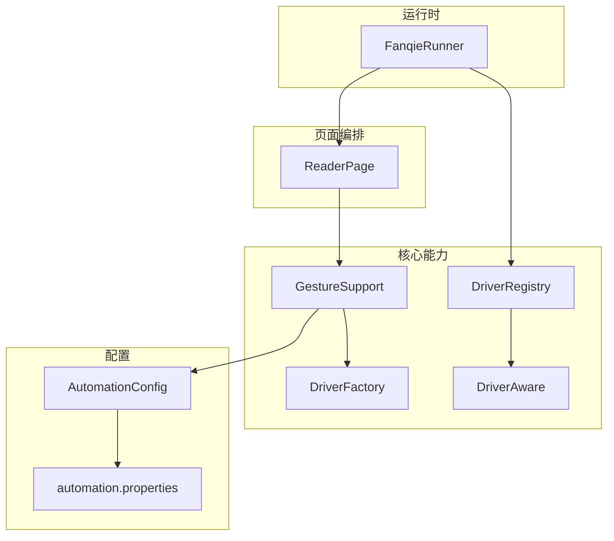
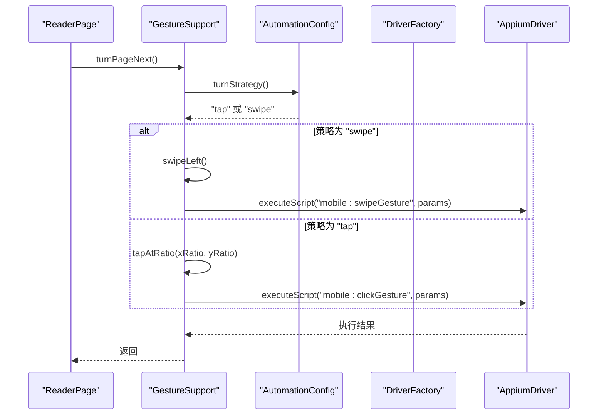
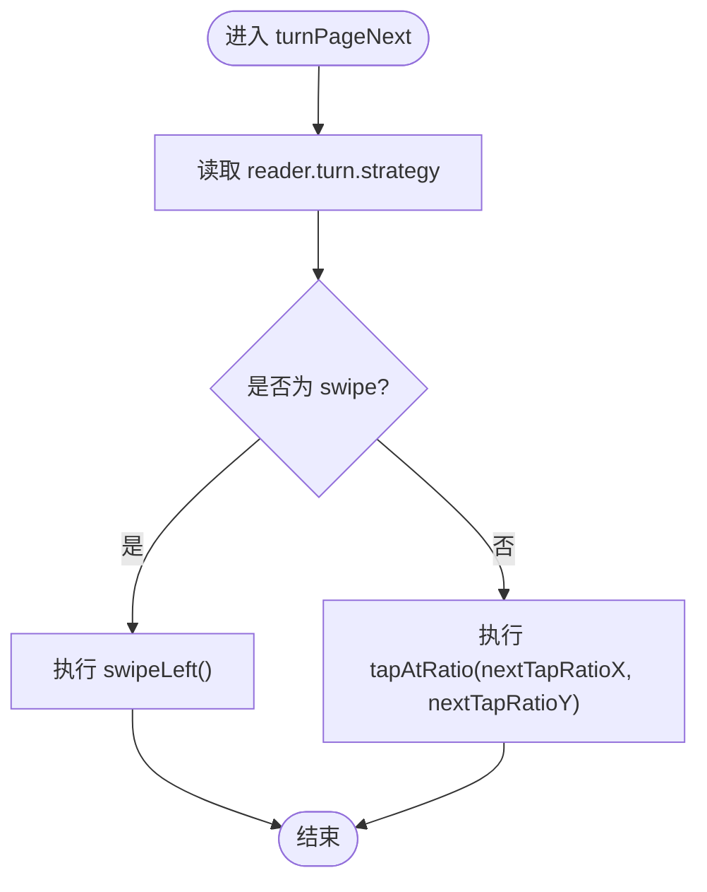
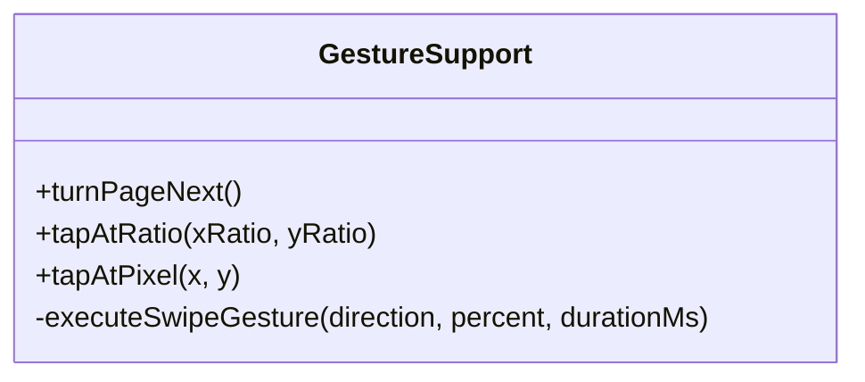
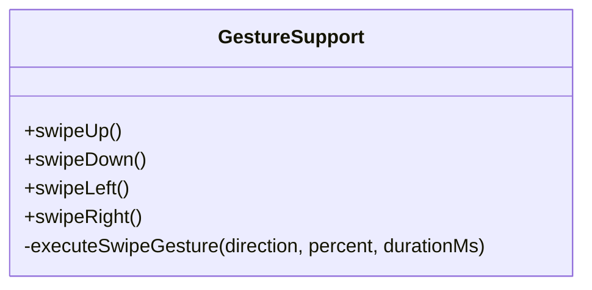
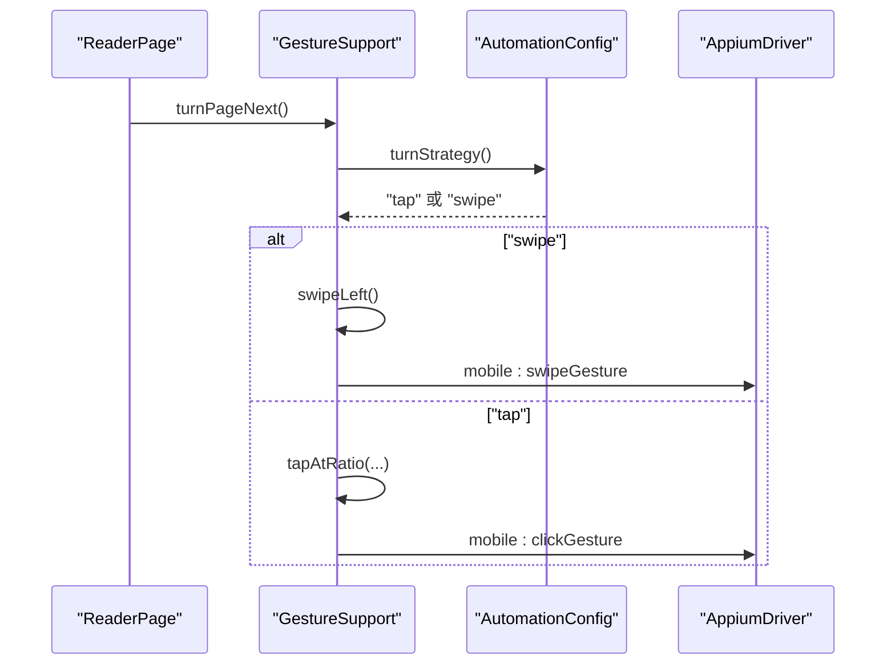
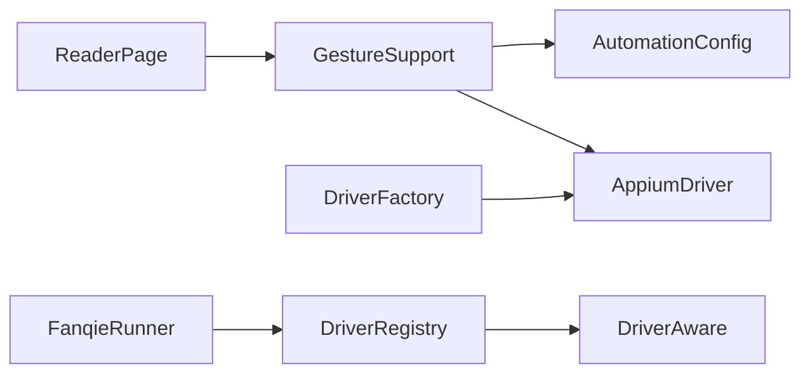

# 策略模式

<cite>
**本文引用的文件**
- [GestureSupport.java](file://automation/src/main/java/com/fanqie/auto/core/GestureSupport.java)
- [AutomationConfig.java](file://automation/src/main/java/com/fanqie/auto/config/AutomationConfig.java)
- [ReaderPage.java](file://automation/src/main/java/com/fanqie/auto/page/ReaderPage.java)
- [DriverFactory.java](file://automation/src/main/java/com/fanqie/auto/core/DriverFactory.java)
- [AppiumUiAutomator2DriverFactory.java](file://automation/src/main/java/com/fanqie/auto/core/AppiumUiAutomator2DriverFactory.java)
- [DriverAware.java](file://automation/src/main/java/com/fanqie/auto/core/DriverAware.java)
- [DriverRegistry.java](file://automation/src/main/java/com/fanqie/auto/core/DriverRegistry.java)
- [FanqieRunner.java](file://automation/src/main/java/com/fanqie/auto/FanqieRunner.java)
- [automation.properties](file://automation/src/main/resources/automation.properties)
</cite>

## 目录
1. [简介](#简介)
2. [项目结构](#项目结构)
3. [核心组件](#核心组件)
4. [架构总览](#架构总览)
5. [详细组件分析](#详细组件分析)
6. [依赖关系分析](#依赖关系分析)
7. [性能考量](#性能考量)
8. [故障排查指南](#故障排查指南)
9. [结论](#结论)
10. [附录：自定义手势策略开发指南](#附录自定义手势策略开发指南)

## 简介
本文件聚焦于 GestureSupport 中的“策略模式”应用，围绕阅读页翻页这一典型场景，解释如何通过配置驱动的策略选择机制，将不同的手势操作算法（点击、滑动等）进行封装与解耦。文档将从接口定义、具体策略实现、策略选择与执行流程、示例用法、优势说明到扩展指南与性能优化建议，提供完整的技术视角与实践指导。

## 项目结构
本项目采用分层与职责分离的组织方式：
- core 层：提供通用能力（如手势、状态检测、驱动工厂、注册表等）
- config 层：集中管理配置项（包括翻页策略参数）
- page 层：页面级编排（如 ReaderPage 调用手势能力）
- task 层：业务流程编排（如广告观看状态机）
- resources：配置文件（如 automation.properties）

图表来源
- [GestureSupport.java:1-228](file://automation/src/main/java/com/fanqie/auto/core/GestureSupport.java#L1-L228)
- [AutomationConfig.java:262-287](file://automation/src/main/java/com/fanqie/auto/config/AutomationConfig.java#L262-L287)
- [ReaderPage.java:58-83](file://automation/src/main/java/com/fanqie/auto/page/ReaderPage.java#L58-L83)
- [DriverFactory.java:1-55](file://automation/src/main/java/com/fanqie/auto/core/DriverFactory.java#L1-L55)
- [DriverAware.java:1-20](file://automation/src/main/java/com/fanqie/auto/core/DriverAware.java#L1-L20)
- [DriverRegistry.java:1-40](file://automation/src/main/java/com/fanqie/auto/core/DriverRegistry.java#L1-L40)
- [FanqieRunner.java:140-166](file://automation/src/main/java/com/fanqie/auto/FanqieRunner.java#L140-L166)
- [automation.properties:84-87](file://automation/src/main/resources/automation.properties#L84-L87)

章节来源
- [GestureSupport.java:1-228](file://automation/src/main/java/com/fanqie/auto/core/GestureSupport.java#L1-L228)
- [AutomationConfig.java:1-306](file://automation/src/main/java/com/fanqie/auto/config/AutomationConfig.java#L1-L306)
- [ReaderPage.java:58-83](file://automation/src/main/java/com/fanqie/auto/page/ReaderPage.java#L58-L83)
- [DriverFactory.java:1-55](file://automation/src/main/java/com/fanqie/auto/core/DriverFactory.java#L1-L55)
- [DriverAware.java:1-20](file://automation/src/main/java/com/fanqie/auto/core/DriverAware.java#L1-L20)
- [DriverRegistry.java:1-40](file://automation/src/main/java/com/fanqie/auto/core/DriverRegistry.java#L1-L40)
- [FanqieRunner.java:140-166](file://automation/src/main/java/com/fanqie/auto/FanqieRunner.java#L140-L166)
- [automation.properties:84-87](file://automation/src/main/resources/automation.properties#L84-L87)

## 核心组件
- GestureSupport：封装所有手势操作，包含翻页策略分派、点击与滑动实现、屏幕尺寸缓存与刷新、App 生命周期操作等。
- AutomationConfig：集中读取并暴露策略相关配置项（如翻页策略类型、点击比例、滑动比例与时长）。
- ReaderPage：页面编排器，调用 GestureSupport 完成翻页动作，并在翻页后等待多种可能状态。
- DriverFactory / AppiumUiAutomator2DriverFactory：驱动创建与管理，为手势执行提供底层设备交互能力。
- DriverAware / DriverRegistry：统一刷新 driver 引用，确保 session 重建后各组件仍可用。

章节来源
- [GestureSupport.java:1-228](file://automation/src/main/java/com/fanqie/auto/core/GestureSupport.java#L1-L228)
- [AutomationConfig.java:262-287](file://automation/src/main/java/com/fanqie/auto/config/AutomationConfig.java#L262-L287)
- [ReaderPage.java:58-83](file://automation/src/main/java/com/fanqie/auto/page/ReaderPage.java#L58-L83)
- [DriverFactory.java:1-55](file://automation/src/main/java/com/fanqie/auto/core/DriverFactory.java#L1-L55)
- [AppiumUiAutomator2DriverFactory.java:1-210](file://automation/src/main/java/com/fanqie/auto/core/AppiumUiAutomator2DriverFactory.java#L1-L210)
- [DriverAware.java:1-20](file://automation/src/main/java/com/fanqie/auto/core/DriverAware.java#L1-L20)
- [DriverRegistry.java:1-40](file://automation/src/main/java/com/fanqie/auto/core/DriverRegistry.java#L1-L40)

## 架构总览
下图展示了“翻页策略”在系统中的位置与数据流：ReaderPage 发起翻页请求，GestureSupport 根据 AutomationConfig 中的策略类型选择具体实现（tap 或 swipe），并通过底层 Driver 执行设备端命令。

图表来源
- [ReaderPage.java:58-83](file://automation/src/main/java/com/fanqie/auto/page/ReaderPage.java#L58-L83)
- [GestureSupport.java:71-86](file://automation/src/main/java/com/fanqie/auto/core/GestureSupport.java#L71-L86)
- [GestureSupport.java:106-123](file://automation/src/main/java/com/fanqie/auto/core/GestureSupport.java#L106-L123)
- [GestureSupport.java:141-178](file://automation/src/main/java/com/fanqie/auto/core/GestureSupport.java#L141-L178)
- [AutomationConfig.java:262-287](file://automation/src/main/java/com/fanqie/auto/config/AutomationConfig.java#L262-L287)

## 详细组件分析

### 策略接口与策略选择机制
- 策略接口：在本项目中，“策略”并非以显式 Java 接口形式存在，而是通过配置驱动的“行为选择”来实现策略模式的核心思想——将算法族封装起来，使它们可以相互替换。
- 策略选择：GestureSupport.turnPageNext() 读取 AutomationConfig.turnStrategy() 的值，若为 "swipe" 则执行滑动策略，否则执行点击策略（默认）。
- 策略参数：点击坐标比例、滑动距离比例、滑动持续时间等均由 AutomationConfig 提供，便于在不修改代码的情况下调整行为。

图表来源
- [GestureSupport.java:71-86](file://automation/src/main/java/com/fanqie/auto/core/GestureSupport.java#L71-L86)
- [AutomationConfig.java:262-287](file://automation/src/main/java/com/fanqie/auto/config/AutomationConfig.java#L262-L287)

章节来源
- [GestureSupport.java:71-86](file://automation/src/main/java/com/fanqie/auto/core/GestureSupport.java#L71-L86)
- [AutomationConfig.java:262-287](file://automation/src/main/java/com/fanqie/auto/config/AutomationConfig.java#L262-L287)

### 具体策略实现

#### 点击策略（tap）
- 作用：在指定比例坐标处执行点击，适合阅读页右侧热区翻页。
- 关键点：
  - 使用 mobile: clickGesture 单次设备端执行，稳定性优于多点注入。
  - 坐标由屏幕尺寸按比例计算，避免硬编码像素值。
  - 支持绝对像素与比例坐标两种调用方式。

图表来源
- [GestureSupport.java:106-123](file://automation/src/main/java/com/fanqie/auto/core/GestureSupport.java#L106-L123)

章节来源
- [GestureSupport.java:106-123](file://automation/src/main/java/com/fanqie/auto/core/GestureSupport.java#L106-L123)

#### 滑动策略（swipe）
- 作用：通过 mobile: swipeGesture 执行方向性滑动，作为翻页备选策略。
- 关键点：
  - 使用 direction、percent、speed 等参数控制滑动范围与速度。
  - 基于屏幕尺寸动态计算区域与速度，适配不同设备。
  - 相比 W3C PointerInput 多点注入更稳定，无注入失败风险。

图表来源
- [GestureSupport.java:125-178](file://automation/src/main/java/com/fanqie/auto/core/GestureSupport.java#L125-L178)

章节来源
- [GestureSupport.java:125-178](file://automation/src/main/java/com/fanqie/auto/core/GestureSupport.java#L125-L178)

#### 翻页策略分派（turnPageNext）
- 作用：根据配置选择点击或滑动策略执行下一页翻页。
- 关键点：
  - 默认策略为点击；当配置为 swipe 时切换为滑动。
  - 日志记录当前使用的策略，便于调试与观测。

图表来源
- [ReaderPage.java:58-83](file://automation/src/main/java/com/fanqie/auto/page/ReaderPage.java#L58-L83)
- [GestureSupport.java:71-86](file://automation/src/main/java/com/fanqie/auto/core/GestureSupport.java#L71-L86)
- [GestureSupport.java:106-123](file://automation/src/main/java/com/fanqie/auto/core/GestureSupport.java#L106-L123)
- [GestureSupport.java:141-178](file://automation/src/main/java/com/fanqie/auto/core/GestureSupport.java#L141-L178)
- [AutomationConfig.java:262-287](file://automation/src/main/java/com/fanqie/auto/config/AutomationConfig.java#L262-L287)

章节来源
- [ReaderPage.java:58-83](file://automation/src/main/java/com/fanqie/auto/page/ReaderPage.java#L58-L83)
- [GestureSupport.java:71-86](file://automation/src/main/java/com/fanqie/auto/core/GestureSupport.java#L71-L86)

### 策略的使用示例
- 阅读页翻页：ReaderPage.turnPage() 委托 GestureSupport.turnPageNext()，按配置自动选择点击或滑动策略，随后等待多种可能状态（阅读器、菜单、广告弹窗、章节末等）。
- 广告态处理：AdWatchStateMachine 中直接调用 gestures.tapAtRatio(0.85, 0.50) 执行点击，体现策略的复用性与可组合性。

章节来源
- [ReaderPage.java:58-83](file://automation/src/main/java/com/fanqie/auto/page/ReaderPage.java#L58-L83)
- [GestureSupport.java:106-123](file://automation/src/main/java/com/fanqie/auto/core/GestureSupport.java#L106-L123)

### 策略模式的好处
- 算法的可替换性：通过配置即可在点击与滑动之间切换，无需改动业务逻辑。
- 代码的复用性：点击与滑动被封装为独立方法，可在多处复用（如翻页、广告关闭等）。
- 开闭原则的实现：新增新策略（如长按、双击）时，只需扩展 GestureSupport 的选择分支与对应实现，不修改现有调用方。

章节来源
- [GestureSupport.java:71-86](file://automation/src/main/java/com/fanqie/auto/core/GestureSupport.java#L71-L86)
- [GestureSupport.java:106-123](file://automation/src/main/java/com/fanqie/auto/core/GestureSupport.java#L106-L123)
- [GestureSupport.java:141-178](file://automation/src/main/java/com/fanqie/auto/core/GestureSupport.java#L141-L178)

## 依赖关系分析
- GestureSupport 依赖 AutomationConfig 获取策略与参数，依赖 Driver 执行底层命令。
- ReaderPage 依赖 GestureSupport 完成翻页动作，并在翻页后等待多种状态。
- DriverFactory 抽象了驱动创建与生命周期管理，AppiumUiAutomator2DriverFactory 提供具体实现。
- DriverAware 与 DriverRegistry 保证 session 重建后各组件持有的 driver 引用得到统一刷新。

图表来源
- [ReaderPage.java:58-83](file://automation/src/main/java/com/fanqie/auto/page/ReaderPage.java#L58-L83)
- [GestureSupport.java:1-228](file://automation/src/main/java/com/fanqie/auto/core/GestureSupport.java#L1-L228)
- [AutomationConfig.java:262-287](file://automation/src/main/java/com/fanqie/auto/config/AutomationConfig.java#L262-L287)
- [DriverFactory.java:1-55](file://automation/src/main/java/com/fanqie/auto/core/DriverFactory.java#L1-L55)
- [DriverAware.java:1-20](file://automation/src/main/java/com/fanqie/auto/core/DriverAware.java#L1-L20)
- [DriverRegistry.java:1-40](file://automation/src/main/java/com/fanqie/auto/core/DriverRegistry.java#L1-L40)
- [FanqieRunner.java:140-166](file://automation/src/main/java/com/fanqie/auto/FanqieRunner.java#L140-L166)

章节来源
- [ReaderPage.java:58-83](file://automation/src/main/java/com/fanqie/auto/page/ReaderPage.java#L58-L83)
- [GestureSupport.java:1-228](file://automation/src/main/java/com/fanqie/auto/core/GestureSupport.java#L1-L228)
- [AutomationConfig.java:262-287](file://automation/src/main/java/com/fanqie/auto/config/AutomationConfig.java#L262-L287)
- [DriverFactory.java:1-55](file://automation/src/main/java/com/fanqie/auto/core/DriverFactory.java#L1-L55)
- [DriverAware.java:1-20](file://automation/src/main/java/com/fanqie/auto/core/DriverAware.java#L1-L20)
- [DriverRegistry.java:1-40](file://automation/src/main/java/com/fanqie/auto/core/DriverRegistry.java#L1-L40)
- [FanqieRunner.java:140-166](file://automation/src/main/java/com/fanqie/auto/FanqieRunner.java#L140-L166)

## 性能考量
- 屏幕尺寸缓存：GestureSupport 缓存屏幕尺寸，避免每次手势都发 RPC，减少网络开销。
- 设备端命令：优先使用 mobile: clickGesture 与 mobile: swipeGesture，单次设备端执行，比多点注入更稳且更快。
- 滑动速度计算：根据屏幕高度与滑动百分比、持续时间动态计算 speed，避免过快导致系统忽略。
- 等待策略：ReaderPage 在翻页后一次等待覆盖多个可能状态，减少多次轮询带来的延迟。

章节来源
- [GestureSupport.java:52-67](file://automation/src/main/java/com/fanqie/auto/core/GestureSupport.java#L52-L67)
- [GestureSupport.java:157-178](file://automation/src/main/java/com/fanqie/auto/core/GestureSupport.java#L157-L178)
- [ReaderPage.java:58-83](file://automation/src/main/java/com/fanqie/auto/page/ReaderPage.java#L58-L83)

## 故障排查指南
- 策略未生效：检查 automation.properties 中 reader.turn.strategy 是否设置正确。
- 点击无效：确认点击比例坐标是否落在有效热区（如右侧三分之一），必要时调整 nextTapRatioX/Y。
- 滑动无效：检查 swipePercent 与 swipeDurationMs，过短可能导致系统忽略；确认方向与区域参数合理。
- 会话异常：DriverRegistry 会统一刷新 driver 引用，若出现 NoSuchSessionException，检查 FanqieRunner 是否正确注册并刷新 DriverAware 组件。

章节来源
- [automation.properties:84-87](file://automation/src/main/resources/automation.properties#L84-L87)
- [GestureSupport.java:71-86](file://automation/src/main/java/com/fanqie/auto/core/GestureSupport.java#L71-L86)
- [GestureSupport.java:106-123](file://automation/src/main/java/com/fanqie/auto/core/GestureSupport.java#L106-L123)
- [GestureSupport.java:141-178](file://automation/src/main/java/com/fanqie/auto/core/GestureSupport.java#L141-L178)
- [DriverRegistry.java:1-40](file://automation/src/main/java/com/fanqie/auto/core/DriverRegistry.java#L1-L40)
- [FanqieRunner.java:140-166](file://automation/src/main/java/com/fanqie/auto/FanqieRunner.java#L140-L166)

## 结论
GestureSupport 通过配置驱动的策略选择机制，将点击与滑动两种翻页算法封装为可替换的行为，体现了策略模式的核心价值：可替换性、复用性与开闭原则。结合自动化配置与设备端命令优化，系统在稳定性与性能上取得了良好平衡。未来可通过扩展新的手势策略（如长按、双击）进一步增强灵活性。

## 附录：自定义手势策略开发指南
- 新增策略步骤：
  1. 在 GestureSupport 中添加新的策略分支（例如长按、双击），依据配置项选择执行路径。
  2. 在 AutomationConfig 中新增对应的配置项（如 reader.longpress.enabled、reader.doubletap.ratio.x/y）。
  3. 在 automation.properties 中设置新策略开关与参数。
  4. 在 ReaderPage 或其他调用方中保持对 GestureSupport 的调用不变，利用策略模式透明切换。
- 最佳实践：
  - 所有坐标必须通过 getScreenSize() 按比例计算，禁止硬编码像素值。
  - 优先使用 mobile: 系列命令，提升稳定性与性能。
  - 对关键操作添加日志，便于问题定位与效果验证。
  - 对长时间任务增加超时保护与重试机制，避免阻塞。
- 性能优化建议：
  - 合理使用屏幕尺寸缓存，避免频繁 RPC。
  - 滑动速度与距离需根据设备特性调优，避免过快或过慢。
  - 在翻页后合并等待多种状态，减少轮询次数。

章节来源
- [GestureSupport.java:71-86](file://automation/src/main/java/com/fanqie/auto/core/GestureSupport.java#L71-L86)
- [GestureSupport.java:106-123](file://automation/src/main/java/com/fanqie/auto/core/GestureSupport.java#L106-L123)
- [GestureSupport.java:141-178](file://automation/src/main/java/com/fanqie/auto/core/GestureSupport.java#L141-L178)
- [AutomationConfig.java:262-287](file://automation/src/main/java/com/fanqie/auto/config/AutomationConfig.java#L262-L287)
- [automation.properties:84-87](file://automation/src/main/resources/automation.properties#L84-L87)