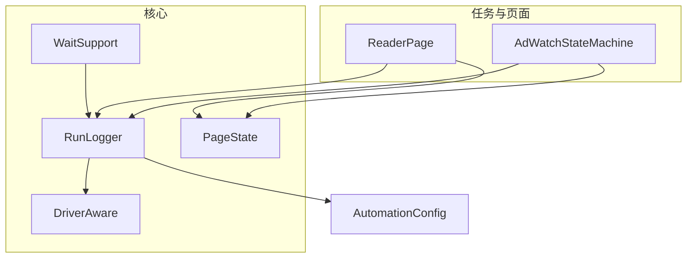
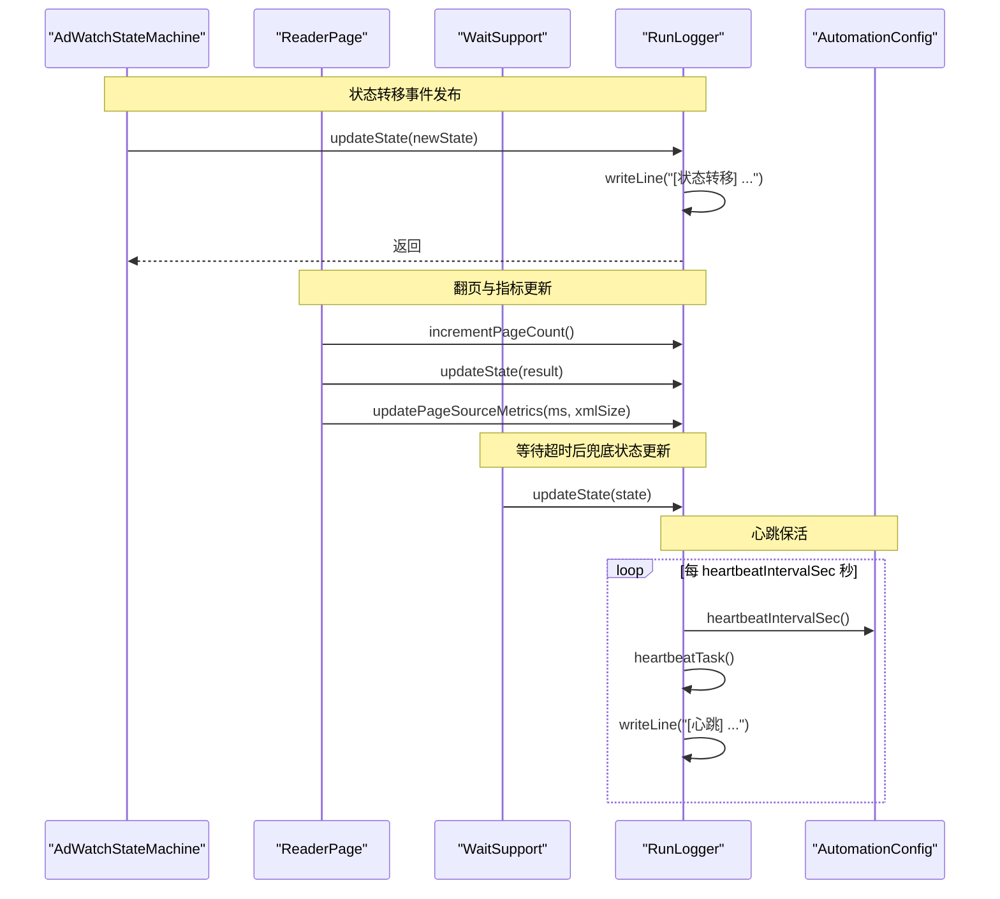
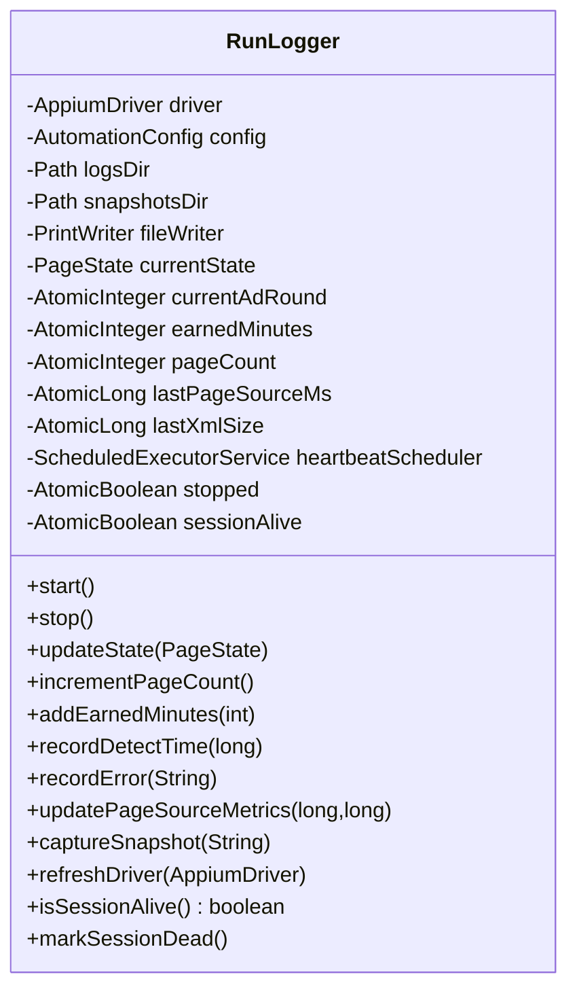
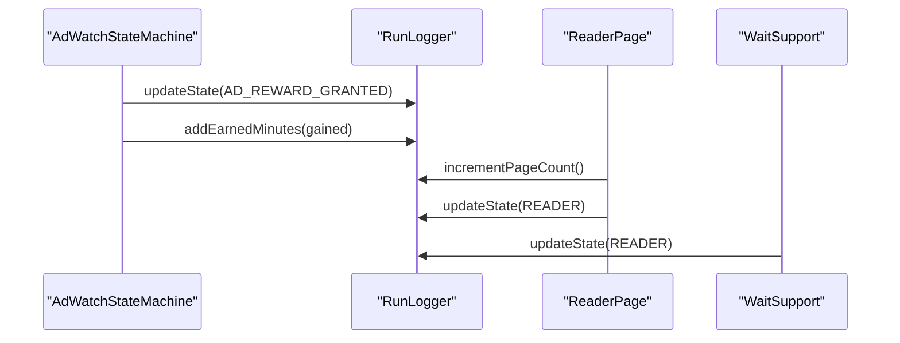
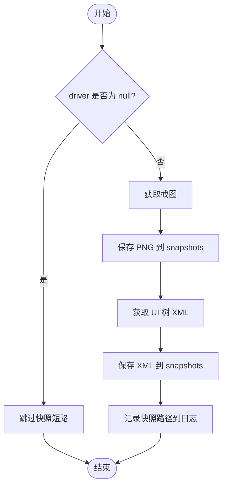
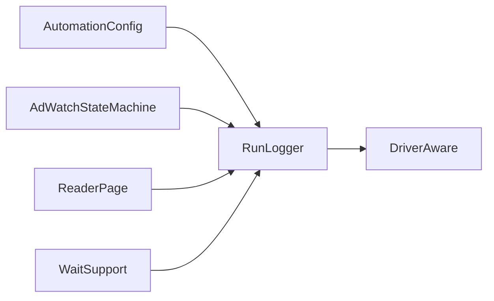

# 观察者模式

<cite>
**本文引用的文件**
- [RunLogger.java](file://automation/src/main/java/com/fanqie/auto/core/RunLogger.java)
- [DriverAware.java](file://automation/src/main/java/com/fanqie/auto/core/DriverAware.java)
- [PageState.java](file://automation/src/main/java/com/fanqie/auto/core/PageState.java)
- [AdWatchStateMachine.java](file://automation/src/main/java/com/fanqie/auto/task/AdWatchStateMachine.java)
- [ReaderPage.java](file://automation/src/main/java/com/fanqie/auto/page/ReaderPage.java)
- [WaitSupport.java](file://automation/src/main/java/com/fanqie/auto/core/WaitSupport.java)
- [AutomationConfig.java](file://automation/src/main/java/com/fanqie/auto/config/AutomationConfig.java)
- [RunLoggerTest.java](file://automation/src/test/java/com/fanqie/auto/core/RunLoggerTest.java)
</cite>

## 目录
1. [简介](#简介)
2. [项目结构](#项目结构)
3. [核心组件](#核心组件)
4. [架构总览](#架构总览)
5. [详细组件分析](#详细组件分析)
6. [依赖关系分析](#依赖关系分析)
7. [性能考量](#性能考量)
8. [故障排查指南](#故障排查指南)
9. [结论](#结论)
10. [附录：自定义观察者开发指南与最佳实践](#附录自定义观察者开发指南与最佳实践)

## 简介
本文件围绕 RunLogger 在自动化运行过程中的“日志记录与通知”职责，系统阐述其如何以“事件驱动 + 松耦合”的方式实现运行日志的自动记录与状态变更通知。虽然代码未采用传统 Java 观察者接口（Observer/Observable），但通过“发布-订阅式”的回调更新方法（如 updateState、updatePageSourceMetrics 等）实现了等价的事件分发机制：状态机与页面层作为“发布者”，RunLogger 作为“订阅者”，在关键业务节点被调用时完成日志落盘、截图快照、统计汇总与心跳保活提示。

该设计具备以下优势：
- 松耦合：状态机与页面逻辑无需感知日志实现细节，仅调用统一接口。
- 事件驱动：关键状态转移、指标变化即触发日志与快照动作，便于可观测性增强。
- 易于扩展：新增观察行为（如上报监控指标、发送告警）只需新增订阅点或扩展 RunLogger 的更新方法。

## 项目结构
与观察者模式相关的核心位置集中在 core 与 task/page 模块：
- core：RunLogger（日志与快照）、DriverAware（驱动刷新契约）、PageState（状态枚举）、WaitSupport（等待与状态检测封装）。
- task：AdWatchStateMachine（广告流程状态机，发布状态转移事件）。
- page：ReaderPage（阅读页操作，发布翻页与状态变化事件）。
- config：AutomationConfig（心跳间隔、阈值等配置项）。

图表来源
- [RunLogger.java:46-229](file://automation/src/main/java/com/fanqie/auto/core/RunLogger.java#L46-L229)
- [AdWatchStateMachine.java:132-157](file://automation/src/main/java/com/fanqie/auto/task/AdWatchStateMachine.java#L132-L157)
- [ReaderPage.java:49-55](file://automation/src/main/java/com/fanqie/auto/page/ReaderPage.java#L49-L55)
- [WaitSupport.java:66-86](file://automation/src/main/java/com/fanqie/auto/core/WaitSupport.java#L66-L86)
- [AutomationConfig.java:210-212](file://automation/src/main/java/com/fanqie/auto/config/AutomationConfig.java#L210-L212)

章节来源
- [RunLogger.java:46-229](file://automation/src/main/java/com/fanqie/auto/core/RunLogger.java#L46-L229)
- [AdWatchStateMachine.java:132-157](file://automation/src/main/java/com/fanqie/auto/task/AdWatchStateMachine.java#L132-L157)
- [ReaderPage.java:49-55](file://automation/src/main/java/com/fanqie/auto/page/ReaderPage.java#L49-L55)
- [WaitSupport.java:66-86](file://automation/src/main/java/com/fanqie/auto/core/WaitSupport.java#L66-L86)
- [AutomationConfig.java:210-212](file://automation/src/main/java/com/fanqie/auto/config/AutomationConfig.java#L210-L212)

## 核心组件
- RunLogger：负责运行期日志落盘、截图/XML 快照、心跳保活、会话存活标记、最终统计输出。提供一组“更新方法”供状态机与页面层调用，构成事件订阅端。
- DriverAware：定义 driver 重建后的刷新契约，RunLogger 实现该接口以在 session 重建后恢复保活标志。
- PageState：状态枚举，承载状态名称与中文描述，是状态转移事件的载体。
- AdWatchStateMachine：广告流程的状态机，负责在各状态处理器中调用 RunLogger 的更新方法，发布状态转移与指标事件。
- ReaderPage：阅读页操作类，在执行翻页等操作后调用 RunLogger 更新计数与状态。
- WaitSupport：封装等待与状态检测，并在超时等分支中调用 RunLogger 更新状态。
- AutomationConfig：提供心跳间隔、XML 体积阈值等运行时参数。

章节来源
- [RunLogger.java:46-229](file://automation/src/main/java/com/fanqie/auto/core/RunLogger.java#L46-L229)
- [DriverAware.java:5-20](file://automation/src/main/java/com/fanqie/auto/core/DriverAware.java#L5-L20)
- [PageState.java:11-97](file://automation/src/main/java/com/fanqie/auto/core/PageState.java#L11-L97)
- [AdWatchStateMachine.java:132-157](file://automation/src/main/java/com/fanqie/auto/task/AdWatchStateMachine.java#L132-L157)
- [ReaderPage.java:49-55](file://automation/src/main/java/com/fanqie/auto/page/ReaderPage.java#L49-L55)
- [WaitSupport.java:66-86](file://automation/src/main/java/com/fanqie/auto/core/WaitSupport.java#L66-L86)
- [AutomationConfig.java:210-212](file://automation/src/main/java/com/fanqie/auto/config/AutomationConfig.java#L210-L212)

## 架构总览
下图展示了“事件发布者（状态机/页面/等待器）—事件订阅者（RunLogger）”的交互关系，以及心跳调度与快照落盘的时序。

图表来源
- [AdWatchStateMachine.java:236-257](file://automation/src/main/java/com/fanqie/auto/task/AdWatchStateMachine.java#L236-L257)
- [ReaderPage.java:82-116](file://automation/src/main/java/com/fanqie/auto/page/ReaderPage.java#L82-L116)
- [WaitSupport.java:66-86](file://automation/src/main/java/com/fanqie/auto/core/WaitSupport.java#L66-L86)
- [RunLogger.java:150-197](file://automation/src/main/java/com/fanqie/auto/core/RunLogger.java#L150-L197)
- [AutomationConfig.java:210-212](file://automation/src/main/java/com/fanqie/auto/config/AutomationConfig.java#L210-L212)

## 详细组件分析

### RunLogger：事件订阅者与日志中心
- 角色定位：作为“订阅者”，接收来自状态机、页面、等待器的状态与指标事件；同时承担心跳保活、会话存活标记、截图/XML 快照、最终统计输出等职责。
- 关键能力
  - 状态转移日志：updateState 在状态变化时写入“旧状态 -> 新状态”及描述。
  - 指标更新：incrementPageCount、addEarnedMinutes、recordDetectTime、recordError 等用于累计统计。
  - 快照落盘：captureSnapshot 在异常/恢复时保存 PNG 与 XML，并记录路径。
  - 心跳保活：start 启动定时任务，周期性执行轻量保活命令并输出摘要。
  - 会话管理：refreshDriver 在 session 重建后复位保活标志；markSessionDead 标记断开。
  - 生命周期：stop 幂等停止心跳、输出统计、关闭文件。

图表来源
- [RunLogger.java:46-229](file://automation/src/main/java/com/fanqie/auto/core/RunLogger.java#L46-L229)

章节来源
- [RunLogger.java:46-229](file://automation/src/main/java/com/fanqie/auto/core/RunLogger.java#L46-L229)
- [RunLoggerTest.java:55-89](file://automation/src/test/java/com/fanqie/auto/core/RunLoggerTest.java#L55-L89)

### 事件发布者：状态机与页面层
- AdWatchStateMachine：在状态处理函数中调用 logger.updateState(...) 与指标更新方法，发布状态转移事件。
- ReaderPage：在执行翻页等操作后调用 logger.incrementPageCount() 与 logger.updateState(...)，发布翻页与状态变化事件。
- WaitSupport：在等待超时等分支中调用 logger.updateState(...)，确保异常路径也能更新状态。

图表来源
- [AdWatchStateMachine.java:561-571](file://automation/src/main/java/com/fanqie/auto/task/AdWatchStateMachine.java#L561-L571)
- [ReaderPage.java:82-116](file://automation/src/main/java/com/fanqie/auto/page/ReaderPage.java#L82-L116)
- [WaitSupport.java:66-86](file://automation/src/main/java/com/fanqie/auto/core/WaitSupport.java#L66-L86)

章节来源
- [AdWatchStateMachine.java:561-571](file://automation/src/main/java/com/fanqie/auto/task/AdWatchStateMachine.java#L561-L571)
- [ReaderPage.java:82-116](file://automation/src/main/java/com/fanqie/auto/page/ReaderPage.java#L82-L116)
- [WaitSupport.java:66-86](file://automation/src/main/java/com/fanqie/auto/core/WaitSupport.java#L66-L86)

### 心跳与快照流程
- 心跳流程：按配置的间隔周期执行，进行轻量保活并输出摘要；若检测到异常则标记 session 不存活。
- 快照流程：在异常/恢复时捕获屏幕与 UI 树，保存到 snapshots 目录，并记录到日志。

图表来源
- [RunLogger.java:239-261](file://automation/src/main/java/com/fanqie/auto/core/RunLogger.java#L239-L261)

章节来源
- [RunLogger.java:239-261](file://automation/src/main/java/com/fanqie/auto/core/RunLogger.java#L239-L261)

## 依赖关系分析
- RunLogger 依赖 AutomationConfig 获取心跳间隔等配置。
- RunLogger 实现 DriverAware，以便在 session 重建后由 DriverRegistry 统一刷新 driver 引用。
- AdWatchStateMachine 与 ReaderPage 均依赖 RunLogger 进行状态与指标更新。
- WaitSupport 在等待与检测过程中也依赖 RunLogger 更新状态。

图表来源
- [AutomationConfig.java:210-212](file://automation/src/main/java/com/fanqie/auto/config/AutomationConfig.java#L210-L212)
- [DriverAware.java:5-20](file://automation/src/main/java/com/fanqie/auto/core/DriverAware.java#L5-L20)
- [AdWatchStateMachine.java:132-157](file://automation/src/main/java/com/fanqie/auto/task/AdWatchStateMachine.java#L132-L157)
- [ReaderPage.java:49-55](file://automation/src/main/java/com/fanqie/auto/page/ReaderPage.java#L49-L55)
- [WaitSupport.java:66-86](file://automation/src/main/java/com/fanqie/auto/core/WaitSupport.java#L66-L86)

章节来源
- [AutomationConfig.java:210-212](file://automation/src/main/java/com/fanqie/auto/config/AutomationConfig.java#L210-L212)
- [DriverAware.java:5-20](file://automation/src/main/java/com/fanqie/auto/core/DriverAware.java#L5-L20)
- [AdWatchStateMachine.java:132-157](file://automation/src/main/java/com/fanqie/auto/task/AdWatchStateMachine.java#L132-L157)
- [ReaderPage.java:49-55](file://automation/src/main/java/com/fanqie/auto/page/ReaderPage.java#L49-L55)
- [WaitSupport.java:66-86](file://automation/src/main/java/com/fanqie/auto/core/WaitSupport.java#L66-L86)

## 性能考量
- 心跳任务为单线程调度，内部捕获所有异常，避免影响主流程。
- 保活使用轻量命令（窗口尺寸查询），降低对 Appium 的压力。
- 日志写入采用 UTF-8 追加写，避免频繁 IO 开销；XML 体积超过阈值时输出预警，防止 UI 树泄漏导致日志膨胀。
- 快照仅在异常/恢复时触发，减少常规路径上的额外开销。

[本节为通用性能讨论，不直接分析具体文件]

## 故障排查指南
- 会话断开：当心跳保活失败时，RunLogger 会标记 session 不存活并输出警告；上层可通过 isSessionAlive 感知并触发恢复。
- 快照失败：captureSnapshot 内部捕获异常并记录失败信息，确保取证过程不影响主流程。
- 测试覆盖：RunLoggerTest 验证了初始 sessionAlive 为真、markSessionDead 置假、refreshDriver(null) 不误复位、driver==null 时 captureSnapshot 安全短路等场景。

章节来源
- [RunLogger.java:162-197](file://automation/src/main/java/com/fanqie/auto/core/RunLogger.java#L162-L197)
- [RunLogger.java:239-261](file://automation/src/main/java/com/fanqie/auto/core/RunLogger.java#L239-L261)
- [RunLoggerTest.java:55-89](file://automation/src/test/java/com/fanqie/auto/core/RunLoggerTest.java#L55-L89)

## 结论
RunLogger 通过“发布-订阅式”的更新方法实现了运行日志的自动记录与状态变更通知，虽未采用传统观察者接口，但在设计上达到了松耦合、事件驱动与易扩展的目标。状态机与页面层仅需调用统一接口即可完成日志与快照动作，便于后续扩展监控、告警等观察行为。

[本节为总结性内容，不直接分析具体文件]

## 附录：自定义观察者开发指南与最佳实践
- 目标：在不侵入状态机与页面逻辑的前提下，增加新的观察行为（如上报监控指标、发送告警、审计日志）。
- 推荐方式
  - 扩展 RunLogger 的更新方法：例如新增 recordMetric(key, value)、recordAlert(type, payload) 等方法，在状态机与页面层调用，集中处理观察逻辑。
  - 引入真正的观察者集合：在 RunLogger 中维护一个观察者列表，并提供 addObserver/removeObserver/notifyObservers(event) 方法；各观察者实现统一接口，在事件发生时执行各自逻辑。
  - 事件模型：定义轻量事件对象（如 StateChangedEvent、PageTurnedEvent），包含必要上下文（时间戳、状态、指标等），便于多观察者复用。
- 最佳实践
  - 异步化：通知逻辑应异步执行，避免阻塞主流程。
  - 容错：观察者内部捕获异常，保证单个观察者失败不影响其他观察者。
  - 幂等：重复事件不会造成副作用（如重复计数）。
  - 可配置：通过 AutomationConfig 控制是否启用某类观察行为。
  - 可测试：为观察者编写单元测试，模拟事件并断言行为。

[本节为概念性指导，不直接分析具体文件]