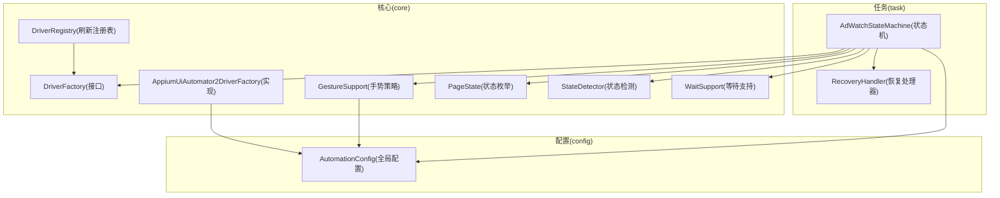
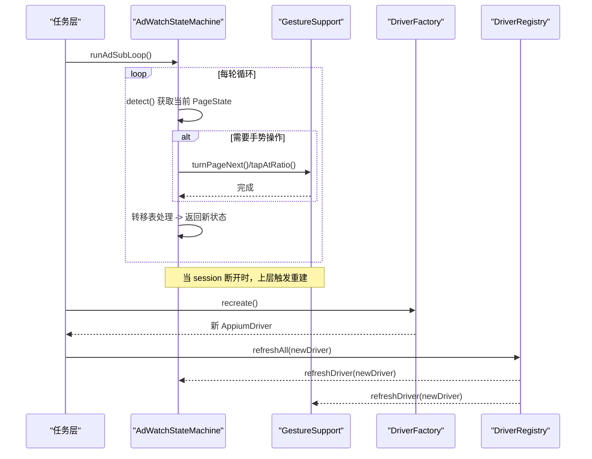
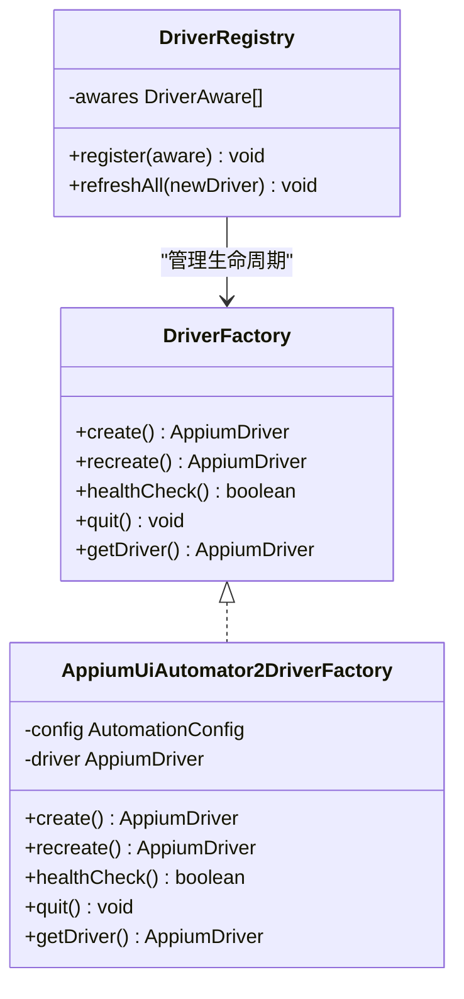
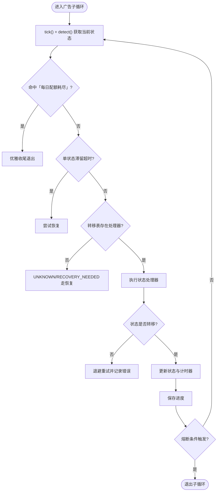
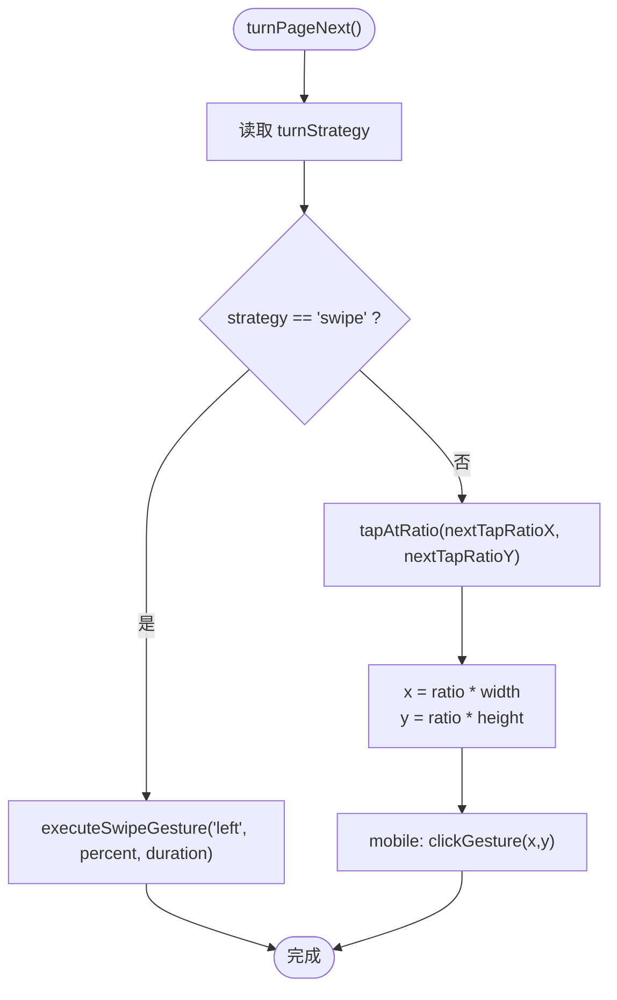
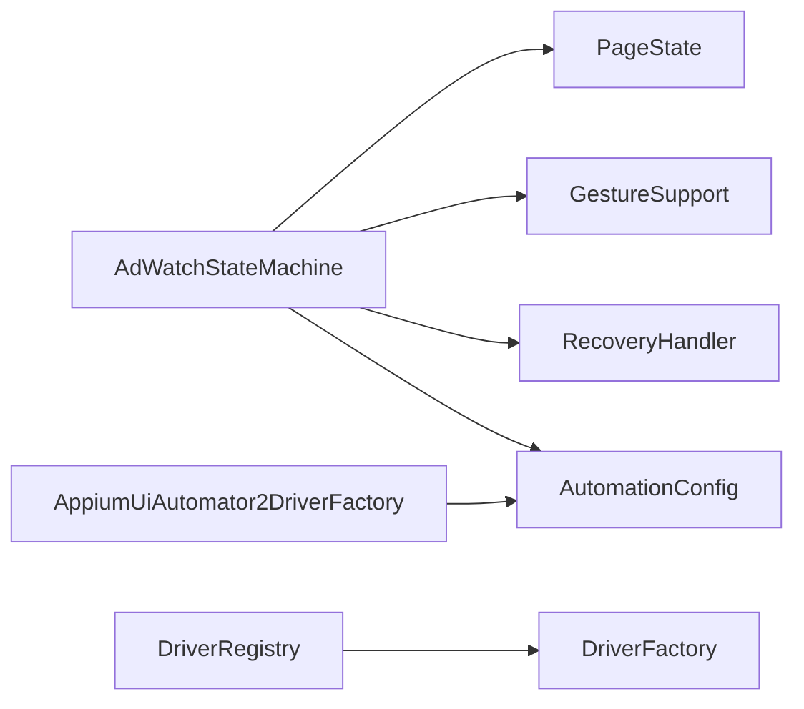

# 设计模式应用

<cite>
**本文引用的文件**
- [DriverFactory.java](file://automation/src/main/java/com/fanqie/auto/core/DriverFactory.java)
- [AppiumUiAutomator2DriverFactory.java](file://automation/src/main/java/com/fanqie/auto/core/AppiumUiAutomator2DriverFactory.java)
- [DriverRegistry.java](file://automation/src/main/java/com/fanqie/auto/core/DriverRegistry.java)
- [AutomationConfig.java](file://automation/src/main/java/com/fanqie/auto/config/AutomationConfig.java)
- [AdWatchStateMachine.java](file://automation/src/main/java/com/fanqie/auto/task/AdWatchStateMachine.java)
- [PageState.java](file://automation/src/main/java/com/fanqie/auto/core/PageState.java)
- [GestureSupport.java](file://automation/src/main/java/com/fanqie/auto/core/GestureSupport.java)
- [RecoveryHandler.java](file://automation/src/main/java/com/fanqie/auto/task/RecoveryHandler.java)
</cite>

## 目录
1. [简介](#简介)
2. [项目结构](#项目结构)
3. [核心组件](#核心组件)
4. [架构总览](#架构总览)
5. [详细组件分析](#详细组件分析)
6. [依赖关系分析](#依赖关系分析)
7. [性能考量](#性能考量)
8. [故障排查指南](#故障排查指南)
9. [结论](#结论)
10. [附录](#附录)

## 简介
本文件聚焦于自动化系统中三大关键设计模式的工程化落地：工厂模式（DriverFactory）、状态机模式（AdWatchStateMachine）与策略模式（GestureSupport）。通过接口抽象、转移表驱动与可插拔策略，系统实现了驱动类型灵活切换、复杂页面状态稳定流转以及手势操作的可配置化执行。文档包含适用场景、实现方式、UML 图与代码级引用路径，帮助读者在实际项目中复用这些模式。

## 项目结构
- 核心层 core：定义 DriverFactory 接口与默认实现、手势策略封装、状态枚举与检测、等待支持等。
- 任务层 task：以 AdWatchStateMachine 为核心编排广告观看流程，结合 RecoveryHandler 提供多级恢复。
- 配置层 config：集中管理超时、轮次、翻页策略等参数，支撑运行时行为调整。
- 页面层 page：对书架、阅读页、广告流等页面进行高层交互封装。

图表来源
- [DriverFactory.java:17-54](file://automation/src/main/java/com/fanqie/auto/core/DriverFactory.java#L17-L54)
- [AppiumUiAutomator2DriverFactory.java:33-178](file://automation/src/main/java/com/fanqie/auto/core/AppiumUiAutomator2DriverFactory.java#L33-L178)
- [DriverRegistry.java:19-56](file://automation/src/main/java/com/fanqie/auto/core/DriverRegistry.java#L19-L56)
- [GestureSupport.java:26-227](file://automation/src/main/java/com/fanqie/auto/core/GestureSupport.java#L26-L227)
- [PageState.java:11-96](file://automation/src/main/java/com/fanqie/auto/core/PageState.java#L11-L96)
- [AdWatchStateMachine.java:62-157](file://automation/src/main/java/com/fanqie/auto/task/AdWatchStateMachine.java#L62-L157)
- [AutomationConfig.java:166-287](file://automation/src/main/java/com/fanqie/auto/config/AutomationConfig.java#L166-L287)

章节来源
- [DriverFactory.java:17-54](file://automation/src/main/java/com/fanqie/auto/core/DriverFactory.java#L17-L54)
- [AppiumUiAutomator2DriverFactory.java:33-178](file://automation/src/main/java/com/fanqie/auto/core/AppiumUiAutomator2DriverFactory.java#L33-L178)
- [DriverRegistry.java:19-56](file://automation/src/main/java/com/fanqie/auto/core/DriverRegistry.java#L19-L56)
- [GestureSupport.java:26-227](file://automation/src/main/java/com/fanqie/auto/core/GestureSupport.java#L26-L227)
- [PageState.java:11-96](file://automation/src/main/java/com/fanqie/auto/core/PageState.java#L11-L96)
- [AdWatchStateMachine.java:62-157](file://automation/src/main/java/com/fanqie/auto/task/AdWatchStateMachine.java#L62-L157)
- [AutomationConfig.java:166-287](file://automation/src/main/java/com/fanqie/auto/config/AutomationConfig.java#L166-L287)

## 核心组件
- 工厂模式：DriverFactory 抽象驱动创建/重建/健康检查/退出；AppiumUiAutomator2DriverFactory 提供标准实现；DriverRegistry 在 session 重建后统一刷新各组件的 driver 引用。
- 状态机模式：AdWatchStateMachine 使用转移表 Map<PageState, StateHandler> 驱动状态流转，内置四重熔断、幂等校验、退避重试与持久化断点续跑。
- 策略模式：GestureSupport 根据配置选择 tap 或 swipe 翻页策略，所有坐标按屏幕比例计算，避免硬编码像素。

章节来源
- [DriverFactory.java:17-54](file://automation/src/main/java/com/fanqie/auto/core/DriverFactory.java#L17-L54)
- [AppiumUiAutomator2DriverFactory.java:33-178](file://automation/src/main/java/com/fanqie/auto/core/AppiumUiAutomator2DriverFactory.java#L33-L178)
- [DriverRegistry.java:19-56](file://automation/src/main/java/com/fanqie/auto/core/DriverRegistry.java#L19-L56)
- [AdWatchStateMachine.java:120-157](file://automation/src/main/java/com/fanqie/auto/task/AdWatchStateMachine.java#L120-L157)
- [GestureSupport.java:71-86](file://automation/src/main/java/com/fanqie/auto/core/GestureSupport.java#L71-L86)

## 架构总览
下图展示了工厂、状态机与策略在运行时的协作关系：上层任务通过状态机驱动页面流转，状态机调用手势策略执行具体动作；驱动由工厂创建并统一管理生命周期。

图表来源
- [AdWatchStateMachine.java:173-312](file://automation/src/main/java/com/fanqie/auto/task/AdWatchStateMachine.java#L173-L312)
- [GestureSupport.java:71-86](file://automation/src/main/java/com/fanqie/auto/core/GestureSupport.java#L71-L86)
- [DriverFactory.java:17-54](file://automation/src/main/java/com/fanqie/auto/core/DriverFactory.java#L17-L54)
- [DriverRegistry.java:19-56](file://automation/src/main/java/com/fanqie/auto/core/DriverRegistry.java#L19-L56)

## 详细组件分析

### 工厂模式：DriverFactory 与 AppiumUiAutomator2DriverFactory
- 适用场景
  - 需要屏蔽底层驱动差异（如未来鸿蒙 Hdc 路线），上层零感知替换。
  - 统一创建、重建、健康检查与退出，保证资源管理与错误诊断一致。
- 实现要点
  - 接口 DriverFactory 定义 create/recreate/healthCheck/quit/getDriver。
  - 默认实现 AppiumUiAutomator2DriverFactory 构建 UiAutomator2Options，设置 noReset、超时、华为/鸿蒙兼容能力，并在创建后立即将隐式等待置零以避免阻塞短轮询。
  - DriverRegistry 维护 DriverAware 组件列表，session 重建后批量刷新 driver 引用，避免 NoSuchSessionException。
- 收益
  - 扩展性：新增驱动只需实现接口，上层无需改动。
  - 健壮性：统一的健康检查与优雅退出，减少资源泄漏。
  - 可观测性：集中输出中文诊断信息，快速定位环境问题。

图表来源
- [DriverFactory.java:17-54](file://automation/src/main/java/com/fanqie/auto/core/DriverFactory.java#L17-L54)
- [AppiumUiAutomator2DriverFactory.java:33-178](file://automation/src/main/java/com/fanqie/auto/core/AppiumUiAutomator2DriverFactory.java#L33-L178)
- [DriverRegistry.java:19-56](file://automation/src/main/java/com/fanqie/auto/core/DriverRegistry.java#L19-L56)

章节来源
- [DriverFactory.java:17-54](file://automation/src/main/java/com/fanqie/auto/core/DriverFactory.java#L17-L54)
- [AppiumUiAutomator2DriverFactory.java:33-178](file://automation/src/main/java/com/fanqie/auto/core/AppiumUiAutomator2DriverFactory.java#L33-L178)
- [DriverRegistry.java:19-56](file://automation/src/main/java/com/fanqie/auto/core/DriverRegistry.java#L19-L56)

### 状态机模式：AdWatchStateMachine
- 适用场景
  - 复杂页面跳转与弹窗分支多、易漂移的场景，需以“当前状态”驱动决策，而非线性脚本。
  - 需要强鲁棒性：幂等执行、连续错误退避、单状态滞留熔断、墙钟预算熔断、每日配额耗尽识别等。
- 实现要点
  - 转移表：Map<PageState, StateHandler>，每个状态对应一个函数式处理器，返回处理后状态供主循环重新决策。
  - 幂等性：每次动作前重新 detect()，动作后校验是否发生预期转移，未转移则记录失败并退避重试。
  - 熔断机制：目标分钟达成、单入口轮次上限、全局轮次上限、墙钟时间预算、单状态滞留超时。
  - 进度持久化：断点续跑，跨进程/重启不丢进度；per-book 维度已用书籍集合持久化与时效控制。
  - 奖励计数幂等：基于 roundId + lastCountedRoundId 确保每真实一轮至多计一次且不漏计。
- 收益
  - 可维护性：新增状态仅需添加处理器，不影响既有逻辑。
  - 稳定性：多重熔断与自愈恢复，避免死循环与误判。
  - 可观测性：详细日志与指标上报，便于问题定位与调优。

图表来源
- [AdWatchStateMachine.java:173-312](file://automation/src/main/java/com/fanqie/auto/task/AdWatchStateMachine.java#L173-L312)
- [AdWatchStateMachine.java:355-394](file://automation/src/main/java/com/fanqie/auto/task/AdWatchStateMachine.java#L355-L394)
- [AdWatchStateMachine.java:398-653](file://automation/src/main/java/com/fanqie/auto/task/AdWatchStateMachine.java#L398-L653)
- [AdWatchStateMachine.java:655-669](file://automation/src/main/java/com/fanqie/auto/task/AdWatchStateMachine.java#L655-L669)
- [AdWatchStateMachine.java:679-734](file://automation/src/main/java/com/fanqie/auto/task/AdWatchStateMachine.java#L679-L734)

章节来源
- [AdWatchStateMachine.java:62-157](file://automation/src/main/java/com/fanqie/auto/task/AdWatchStateMachine.java#L62-L157)
- [AdWatchStateMachine.java:173-312](file://automation/src/main/java/com/fanqie/auto/task/AdWatchStateMachine.java#L173-L312)
- [AdWatchStateMachine.java:355-394](file://automation/src/main/java/com/fanqie/auto/task/AdWatchStateMachine.java#L355-L394)
- [AdWatchStateMachine.java:398-653](file://automation/src/main/java/com/fanqie/auto/task/AdWatchStateMachine.java#L398-L653)
- [AdWatchStateMachine.java:655-669](file://automation/src/main/java/com/fanqie/auto/task/AdWatchStateMachine.java#L655-L669)
- [AdWatchStateMachine.java:679-734](file://automation/src/main/java/com/fanqie/auto/task/AdWatchStateMachine.java#L679-L734)

### 策略模式：GestureSupport
- 适用场景
  - 不同设备/版本下翻页行为不一致，需要可配置的翻页策略（点击热区 vs 滑动）。
  - 所有坐标必须按屏幕比例计算，避免硬编码像素导致在不同分辨率设备上失效。
- 实现要点
  - 策略选择：turnStrategy 为 "swipe" 时执行 mobile: swipeGesture，否则执行 tapAtRatio。
  - 比例坐标：tapAtRatio 将 xRatio/yRatio 乘以屏幕尺寸得到绝对像素，再调用 mobile: clickGesture。
  - 滑动实现：executeSwipeGesture 使用 mobile: swipeGesture，方向、百分比、速度由配置决定。
  - 缓存优化：屏幕尺寸首次获取后缓存，driver 刷新时失效，避免频繁 RPC。
- 收益
  - 灵活性：通过配置即可切换翻页策略，无需修改业务代码。
  - 稳定性：设备端单次执行命令更稳健，降低多点注入失败风险。
  - 可移植性：适配不同屏幕尺寸与横竖屏旋转。

图表来源
- [GestureSupport.java:71-86](file://automation/src/main/java/com/fanqie/auto/core/GestureSupport.java#L71-L86)
- [GestureSupport.java:106-123](file://automation/src/main/java/com/fanqie/auto/core/GestureSupport.java#L106-L123)
- [GestureSupport.java:167-178](file://automation/src/main/java/com/fanqie/auto/core/GestureSupport.java#L167-L178)
- [AutomationConfig.java:264-287](file://automation/src/main/java/com/fanqie/auto/config/AutomationConfig.java#L264-L287)

章节来源
- [GestureSupport.java:26-227](file://automation/src/main/java/com/fanqie/auto/core/GestureSupport.java#L26-L227)
- [AutomationConfig.java:264-287](file://automation/src/main/java/com/fanqie/auto/config/AutomationConfig.java#L264-L287)

## 依赖关系分析
- 松耦合：DriverFactory 与上层解耦，可通过 DriverRegistry 统一刷新；状态机通过接口与配置驱动行为，不直接依赖具体驱动细节。
- 内聚性：GestureSupport 专注手势与坐标计算；AdWatchStateMachine 专注状态流转与业务规则；RecoveryHandler 专注异常恢复。
- 外部依赖：AppiumDriver 作为底层驱动；AutomationConfig 提供运行时参数；PageState 作为状态机核心枚举。

图表来源
- [AdWatchStateMachine.java:62-157](file://automation/src/main/java/com/fanqie/auto/task/AdWatchStateMachine.java#L62-L157)
- [AppiumUiAutomator2DriverFactory.java:33-178](file://automation/src/main/java/com/fanqie/auto/core/AppiumUiAutomator2DriverFactory.java#L33-L178)
- [DriverRegistry.java:19-56](file://automation/src/main/java/com/fanqie/auto/core/DriverRegistry.java#L19-L56)
- [PageState.java:11-96](file://automation/src/main/java/com/fanqie/auto/core/PageState.java#L11-L96)
- [AutomationConfig.java:166-287](file://automation/src/main/java/com/fanqie/auto/config/AutomationConfig.java#L166-L287)

章节来源
- [AdWatchStateMachine.java:62-157](file://automation/src/main/java/com/fanqie/auto/task/AdWatchStateMachine.java#L62-L157)
- [AppiumUiAutomator2DriverFactory.java:33-178](file://automation/src/main/java/com/fanqie/auto/core/AppiumUiAutomator2DriverFactory.java#L33-L178)
- [DriverRegistry.java:19-56](file://automation/src/main/java/com/fanqie/auto/core/DriverRegistry.java#L19-L56)
- [PageState.java:11-96](file://automation/src/main/java/com/fanqie/auto/core/PageState.java#L11-L96)
- [AutomationConfig.java:166-287](file://automation/src/main/java/com/fanqie/auto/config/AutomationConfig.java#L166-L287)

## 性能考量
- 短轮询与隐式等待：驱动创建后立即设置 implicitlyWait=0，避免长轮询阻塞，保障 250ms 短轮询效率。
- 屏幕尺寸缓存：GestureSupport 与 StateDetector 缓存屏幕尺寸，减少 RPC 开销；driver 刷新时自动失效。
- 移动端命令：优先使用 mobile: clickGesture/swipeGesture，设备端执行更稳定，降低注入失败概率。
- 熔断与退避：状态机引入多种熔断与指数退避，防止无效循环与资源浪费。

章节来源
- [AppiumUiAutomator2DriverFactory.java:63-69](file://automation/src/main/java/com/fanqie/auto/core/AppiumUiAutomator2DriverFactory.java#L63-L69)
- [GestureSupport.java:52-67](file://automation/src/main/java/com/fanqie/auto/core/GestureSupport.java#L52-L67)
- [AdWatchStateMachine.java:655-669](file://automation/src/main/java/com/fanqie/auto/task/AdWatchStateMachine.java#L655-L669)

## 故障排查指南
- 常见启动失败：Appium session 创建失败会输出定向中文诊断，包括 APK 安装弹窗、仅充电模式 ADB 调试、USB 调试授权、Appium Server 状态等。
- 会话断开：通过 healthCheck 探测，必要时 recreate 并通过 DriverRegistry.refreshAll 刷新所有组件 driver 引用。
- 状态卡住：单状态滞留熔断触发后尝试恢复；若连续错误达上限，进入 RecoveryHandler 五级恢复流程，最终落盘快照并退出。
- 翻页异常：确认 turnStrategy 配置与屏幕尺寸缓存是否有效；必要时 invalidateScreenSizeCache 重置。

章节来源
- [AppiumUiAutomator2DriverFactory.java:180-208](file://automation/src/main/java/com/fanqie/auto/core/AppiumUiAutomator2DriverFactory.java#L180-L208)
- [DriverRegistry.java:37-56](file://automation/src/main/java/com/fanqie/auto/core/DriverRegistry.java#L37-L56)
- [AdWatchStateMachine.java:217-233](file://automation/src/main/java/com/fanqie/auto/task/AdWatchStateMachine.java#L217-L233)
- [RecoveryHandler.java:228-253](file://automation/src/main/java/com/fanqie/auto/task/RecoveryHandler.java#L228-L253)
- [GestureSupport.java:64-67](file://automation/src/main/java/com/fanqie/auto/core/GestureSupport.java#L64-L67)

## 结论
通过工厂模式、状态机模式与策略模式的组合应用，系统在驱动切换、状态流转与手势执行三个关键维度实现了高内聚、低耦合与强鲁棒性。工厂模式屏蔽底层差异，状态机模式以转移表驱动复杂流程，策略模式提供可配置的执行路径。配合熔断、退避与恢复机制，系统能够在多变的应用界面与设备环境下保持稳定运行。

## 附录
- 状态枚举：PageState 定义了广告流程中的各类页面状态，并提供 isAdFlowState/isAbnormal/isReaderFamily 等便捷判定方法。
- 配置项：AutomationConfig 集中管理时序、流程、翻页策略等参数，支持外部覆盖与默认值兜底。
- 恢复流程：RecoveryHandler 提供从弱到强的五级恢复手段，超过阈值即停止并保留现场，避免盲目连点。

章节来源
- [PageState.java:11-96](file://automation/src/main/java/com/fanqie/auto/core/PageState.java#L11-L96)
- [AutomationConfig.java:166-287](file://automation/src/main/java/com/fanqie/auto/config/AutomationConfig.java#L166-L287)
- [RecoveryHandler.java:228-253](file://automation/src/main/java/com/fanqie/auto/task/RecoveryHandler.java#L228-L253)