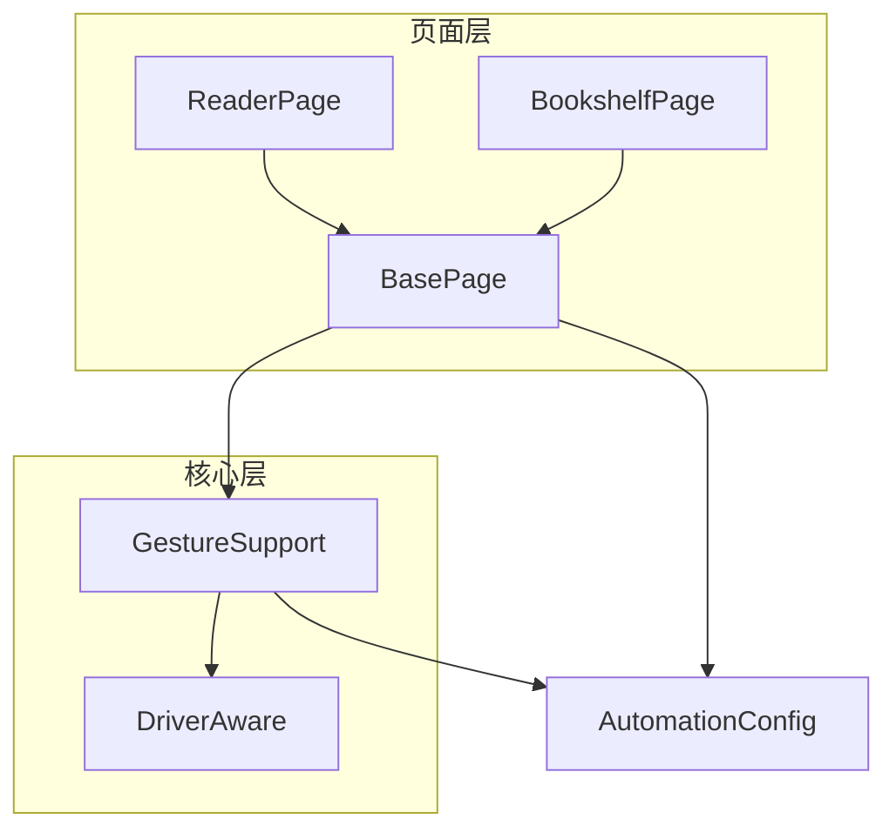
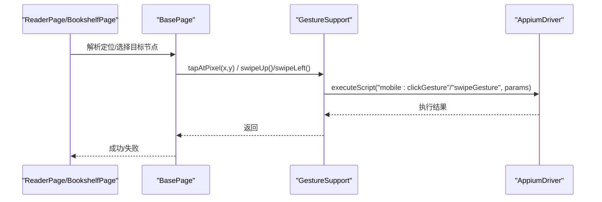
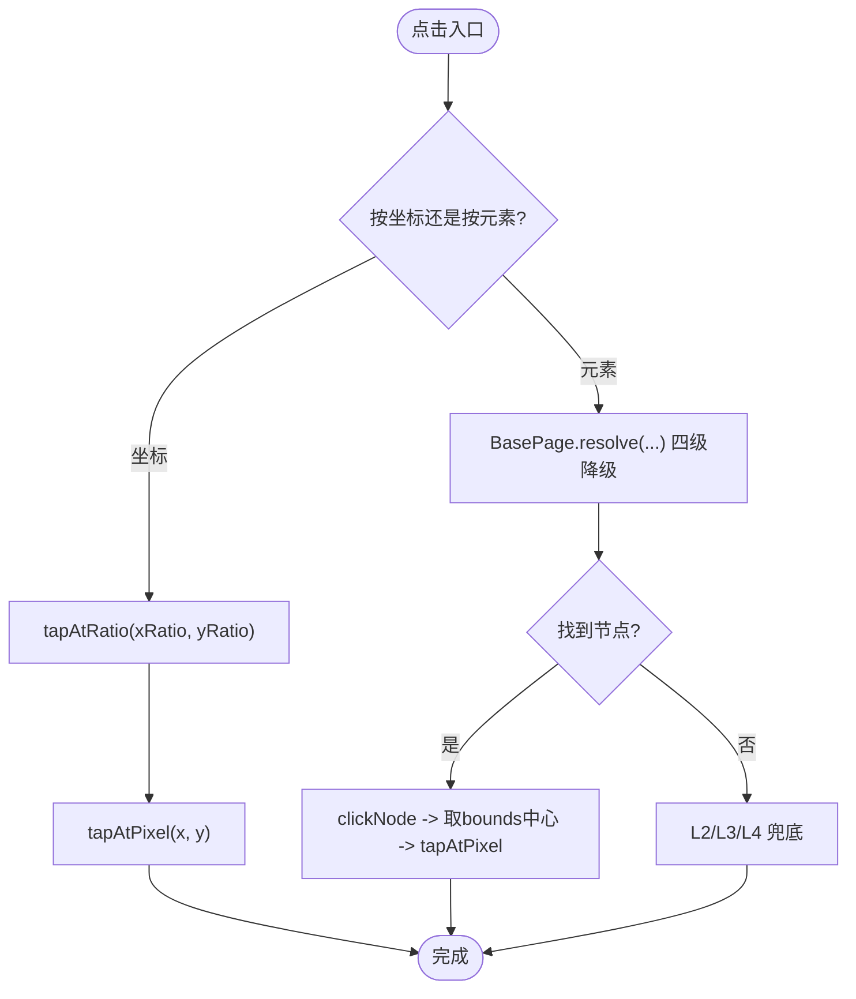
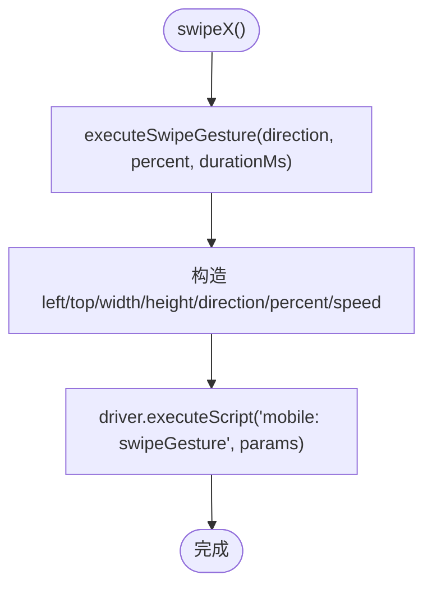
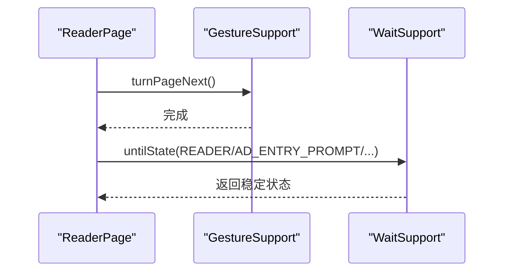
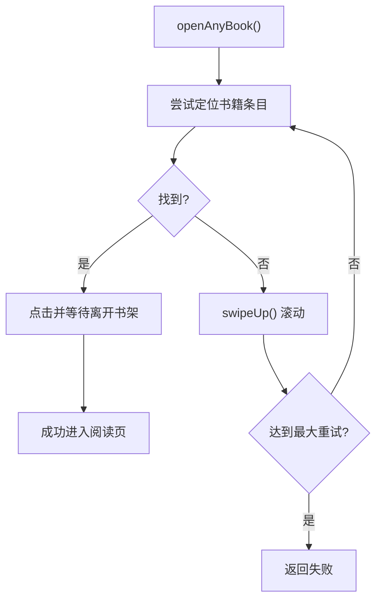
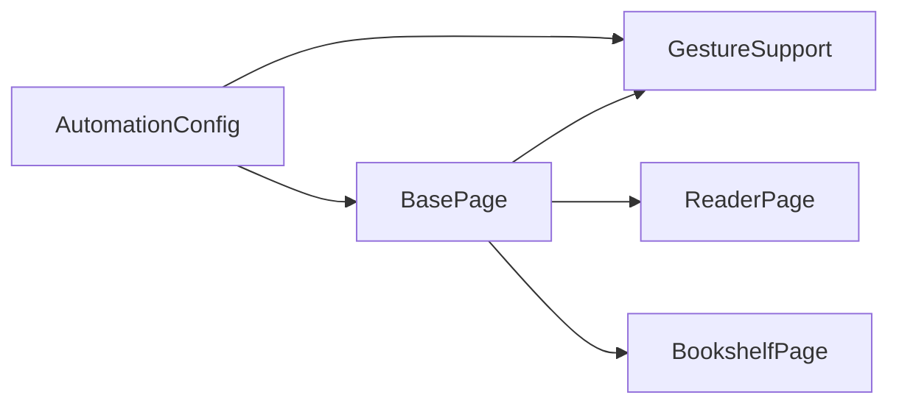

# 手势操作

<cite>
**本文引用的文件**
- [GestureSupport.java](file://automation/src/main/java/com/fanqie/auto/core/GestureSupport.java)
- [BasePage.java](file://automation/src/main/java/com/fanqie/auto/page/BasePage.java)
- [ReaderPage.java](file://automation/src/main/java/com/fanqie/auto/page/ReaderPage.java)
- [BookshelfPage.java](file://automation/src/main/java/com/fanqie/auto/page/BookshelfPage.java)
- [AutomationConfig.java](file://automation/src/main/java/com/fanqie/auto/config/AutomationConfig.java)
- [DriverAware.java](file://automation/src/main/java/com/fanqie/auto/core/DriverAware.java)
</cite>

## 目录
1. [简介](#简介)
2. [项目结构](#项目结构)
3. [核心组件](#核心组件)
4. [架构总览](#架构总览)
5. [详细组件分析](#详细组件分析)
6. [依赖关系分析](#依赖关系分析)
7. [性能考虑](#性能考虑)
8. [故障排查指南](#故障排查指南)
9. [结论](#结论)
10. [附录](#附录)

## 简介
本章节聚焦“手势操作模块”的自动化实现，围绕点击、滑动、长按等基础动作的封装与组合，解释如何构建稳定、可配置、可重试的用户交互流程。文档覆盖：
- 坐标点击、元素点击、多点触控（含能力边界说明）
- 上下左右滑动、距离计算与速度控制
- 长按操作的持续时间与位置指定
- 手势原子性与组合性，复杂流程编排
- 重试机制与错误恢复策略
- 调试方法与性能优化技巧

## 项目结构
手势相关代码主要分布在 core 层与 page 层：
- core.GestureSupport：提供屏幕级手势原语（点击、滑动、App 生命周期）
- page.BasePage：基于 UI 快照的元素定位与点击封装，结合降级链与几何推断
- page.ReaderPage / BookshelfPage：业务页面中组合手势完成翻页、滚动、打开书籍等流程
- config.AutomationConfig：集中管理所有超时、阈值、比例、策略等参数

图表来源
- [GestureSupport.java:26-227](file://automation/src/main/java/com/fanqie/auto/core/GestureSupport.java#L26-L227)
- [BasePage.java:40-516](file://automation/src/main/java/com/fanqie/auto/page/BasePage.java#L40-L516)
- [ReaderPage.java:42-271](file://automation/src/main/java/com/fanqie/auto/page/ReaderPage.java#L42-L271)
- [BookshelfPage.java:36-513](file://automation/src/main/java/com/fanqie/auto/page/BookshelfPage.java#L36-L513)
- [AutomationConfig.java:18-306](file://automation/src/main/java/com/fanqie/auto/config/AutomationConfig.java#L18-L306)
- [DriverAware.java:12-20](file://automation/src/main/java/com/fanqie/auto/core/DriverAware.java#L12-L20)

章节来源
- [GestureSupport.java:26-227](file://automation/src/main/java/com/fanqie/auto/core/GestureSupport.java#L26-L227)
- [BasePage.java:40-516](file://automation/src/main/java/com/fanqie/auto/page/BasePage.java#L40-L516)
- [ReaderPage.java:42-271](file://automation/src/main/java/com/fanqie/auto/page/ReaderPage.java#L42-L271)
- [BookshelfPage.java:36-513](file://automation/src/main/java/com/fanqie/auto/page/BookshelfPage.java#L36-L513)
- [AutomationConfig.java:18-306](file://automation/src/main/java/com/fanqie/auto/config/AutomationConfig.java#L18-L306)
- [DriverAware.java:12-20](file://automation/src/main/java/com/fanqie/auto/core/DriverAware.java#L12-L20)

## 核心组件
- GestureSupport：封装设备端手势原语（点击、滑动、激活/终止/重启 App），使用 mobile: clickGesture/swipeGesture 提升稳定性；内置屏幕尺寸缓存避免重复 RPC。
- BasePage：四级定位降级链（语义属性→结构化几何→时序兜底→系统兜底），将 UI 树节点中心坐标转化为点击动作，并支持 boundsHint 裁决。
- ReaderPage/BookshelfPage：在业务场景中组合手势与等待，完成翻页、滚动、打开书籍、跳转下一章等操作。
- AutomationConfig：集中化配置（翻页策略、滑动比例/时长、超时、重试次数等）。

章节来源
- [GestureSupport.java:26-227](file://automation/src/main/java/com/fanqie/auto/core/GestureSupport.java#L26-L227)
- [BasePage.java:75-250](file://automation/src/main/java/com/fanqie/auto/page/BasePage.java#L75-L250)
- [ReaderPage.java:69-160](file://automation/src/main/java/com/fanqie/auto/page/ReaderPage.java#L69-L160)
- [BookshelfPage.java:169-275](file://automation/src/main/java/com/fanqie/auto/page/BookshelfPage.java#L169-L275)
- [AutomationConfig.java:262-287](file://automation/src/main/java/com/fanqie/auto/config/AutomationConfig.java#L262-L287)

## 架构总览
手势操作由“页面层调用 → 核心手势原语 → 设备端执行”构成。页面层负责“在哪里点/滑”，核心层负责“如何安全地执行”。

图表来源
- [BasePage.java:312-336](file://automation/src/main/java/com/fanqie/auto/page/BasePage.java#L312-L336)
- [GestureSupport.java:106-178](file://automation/src/main/java/com/fanqie/auto/core/GestureSupport.java#L106-L178)

## 详细组件分析

### 点击操作封装
- 坐标点击
  - 比例坐标转像素：tapAtRatio 根据屏幕尺寸按比例换算 x/y，再调用 tapAtPixel。
  - 绝对像素点击：tapAtPixel 通过 mobile: clickGesture 执行，避免 W3C Actions 注入不稳定问题。
- 元素点击
  - BasePage.clickNode 从 UiNode 的 bounds 取中心坐标，若节点不可点击则回溯最近可点击祖先，最终调用 gestures.tapAtPixel。
  - 四级定位降级链确保在不同 UI 形态下仍能命中目标控件。
- 多点触控
  - 当前实现未包含多点触控 API；如需多点触控，可在 GestureSupport 中扩展 mobile: multiTouch 或 PointerInput 序列，但需评估设备兼容性与稳定性。

图表来源
- [GestureSupport.java:106-123](file://automation/src/main/java/com/fanqie/auto/core/GestureSupport.java#L106-L123)
- [BasePage.java:84-250](file://automation/src/main/java/com/fanqie/auto/page/BasePage.java#L84-L250)
- [BasePage.java:312-336](file://automation/src/main/java/com/fanqie/auto/page/BasePage.java#L312-L336)

章节来源
- [GestureSupport.java:106-123](file://automation/src/main/java/com/fanqie/auto/core/GestureSupport.java#L106-L123)
- [BasePage.java:84-250](file://automation/src/main/java/com/fanqie/auto/page/BasePage.java#L84-L250)
- [BasePage.java:312-336](file://automation/src/main/java/com/fanqie/auto/page/BasePage.java#L312-L336)

### 滑动操作实现
- 方向与距离
  - swipeUp/swipeDown/swipeLeft/swipeRight 统一委托 executeSwipeGesture，传入 direction、percent、durationMs。
  - percent 为滑动距离占屏幕的比例；direction 决定滑动方向。
- 速度控制
  - speed 由 height * percent / (durationMs/1000) 推导，保证不同 duration 下的相对速度一致。
- 使用场景
  - ReaderPage/BookshelfPage 中用于翻页备选策略与书架滚动查找条目。

图表来源
- [GestureSupport.java:128-178](file://automation/src/main/java/com/fanqie/auto/core/GestureSupport.java#L128-L178)

章节来源
- [GestureSupport.java:128-178](file://automation/src/main/java/com/fanqie/auto/core/GestureSupport.java#L128-L178)
- [ReaderPage.java:69-118](file://automation/src/main/java/com/fanqie/auto/page/ReaderPage.java#L69-L118)
- [BookshelfPage.java:199-215](file://automation/src/main/java/com/fanqie/auto/page/BookshelfPage.java#L199-L215)

### 长按操作实现
- 当前实现未提供长按 API。若需长按，建议在 GestureSupport 中新增 longPressAtPixel/longPressAtRatio，基于 mobile: longPressGesture 或 W3C PointerInput 序列实现，并暴露 durationMs 配置项。
- 建议设计要点
  - 支持按坐标与按元素两种模式
  - 支持自定义持续时间与位置偏移
  - 与现有 DriverAware 刷新机制对齐

[本节为概念性补充，不直接分析具体文件]

### 手势的原子性与组合性
- 原子性
  - GestureSupport 提供最小可用原语：点击、滑动、App 生命周期操作。
  - BasePage 将“定位 + 点击”封装为原子操作，屏蔽 UI 树变化带来的不稳定性。
- 组合性
  - ReaderPage.turnPage 组合 turnPageNext + untilState 多状态等待，形成“翻页+状态确认”的组合动作。
  - BookshelfPage.openAnyBook 组合“滚动 + 定位 + 点击 + 状态确认”，实现“找书并打开”的复合流程。

图表来源
- [ReaderPage.java:69-96](file://automation/src/main/java/com/fanqie/auto/page/ReaderPage.java#L69-L96)
- [GestureSupport.java:77-86](file://automation/src/main/java/com/fanqie/auto/core/GestureSupport.java#L77-L86)

章节来源
- [ReaderPage.java:69-96](file://automation/src/main/java/com/fanqie/auto/page/ReaderPage.java#L69-L96)
- [BookshelfPage.java:169-215](file://automation/src/main/java/com/fanqie/auto/page/BookshelfPage.java#L169-L215)

### 重试机制与错误处理
- 重试策略
  - 书架页 openAnyBook/openNextBook 在找不到可点条目时，循环滚动并重试，次数来自 config.maxRecoveryRetry()。
  - ReaderPage 翻页后一次等待覆盖多个可能状态，减少误判导致的重试开销。
- 错误恢复
  - BasePage 提供 systemBack/systemRestartApp 作为 L4 兜底，必要时重启 App 回到锚点。
  - DriverAware 接口确保 session 重建后各组件刷新 driver 引用，避免 NoSuchSessionException。

图表来源
- [BookshelfPage.java:169-215](file://automation/src/main/java/com/fanqie/auto/page/BookshelfPage.java#L169-L215)
- [BasePage.java:221-250](file://automation/src/main/java/com/fanqie/auto/page/BasePage.java#L221-L250)
- [DriverAware.java:12-20](file://automation/src/main/java/com/fanqie/auto/core/DriverAware.java#L12-L20)

章节来源
- [BookshelfPage.java:169-215](file://automation/src/main/java/com/fanqie/auto/page/BookshelfPage.java#L169-L215)
- [BasePage.java:221-250](file://automation/src/main/java/com/fanqie/auto/page/BasePage.java#L221-L250)
- [DriverAware.java:12-20](file://automation/src/main/java/com/fanqie/auto/core/DriverAware.java#L12-L20)

### 调试方法与性能优化
- 调试方法
  - 日志：GestureSupport/BasePage/ReaderPage/BookshelfPage 均输出关键步骤日志（如点击坐标、滑动方向、状态检测）。
  - 截图验证：config.verifyPageTurnedByScreenshot() 可开启截图前后帧差异对比以辅助验证翻页效果（默认关闭以减少开销）。
  - 状态追踪：RunLogger.updateState 记录每次动作后的页面状态，便于回放与定位问题。
- 性能优化
  - 屏幕尺寸缓存：GestureSupport.getScreenSize 缓存屏幕尺寸，避免每次手势都发 RPC。
  - 单次设备端执行：优先使用 mobile: clickGesture/swipeGesture，减少多点注入失败风险。
  - 合理超时与轮询间隔：timing.* 配置项集中管理，避免过长等待影响吞吐。

章节来源
- [GestureSupport.java:56-67](file://automation/src/main/java/com/fanqie/auto/core/GestureSupport.java#L56-L67)
- [AutomationConfig.java:291-297](file://automation/src/main/java/com/fanqie/auto/config/AutomationConfig.java#L291-L297)
- [ReaderPage.java:76-96](file://automation/src/main/java/com/fanqie/auto/page/ReaderPage.java#L76-L96)

## 依赖关系分析
- GestureSupport 依赖 AutomationConfig 获取翻页策略、滑动比例/时长等参数。
- BasePage 依赖 GestureSupport 执行底层点击，同时依赖 LocatorRegistry 进行定位规格定义。
- ReaderPage/BookshelfPage 组合 BasePage 与 GestureSupport，并通过 WaitSupport 进行状态等待。

图表来源
- [AutomationConfig.java:262-287](file://automation/src/main/java/com/fanqie/auto/config/AutomationConfig.java#L262-L287)
- [GestureSupport.java:36-39](file://automation/src/main/java/com/fanqie/auto/core/GestureSupport.java#L36-L39)
- [BasePage.java:61-68](file://automation/src/main/java/com/fanqie/auto/page/BasePage.java#L61-L68)

章节来源
- [AutomationConfig.java:262-287](file://automation/src/main/java/com/fanqie/auto/config/AutomationConfig.java#L262-L287)
- [GestureSupport.java:36-39](file://automation/src/main/java/com/fanqie/auto/core/GestureSupport.java#L36-L39)
- [BasePage.java:61-68](file://automation/src/main/java/com/fanqie/auto/page/BasePage.java#L61-L68)

## 性能考虑
- 减少 RPC 调用：屏幕尺寸缓存、单次设备端执行的手势命令。
- 合理超时：actionTimeoutMs、adVideoTimeoutMs 等配置项避免长时间阻塞。
- 批量等待：ReaderPage 翻页后一次等待覆盖多种状态，降低多次轮询成本。
- 滚动策略：BookshelfPage 滚动次数受 maxRecoveryRetry 限制，避免无限滚动。

[本节提供通用指导，不直接分析具体文件]

## 故障排查指南
- 常见问题
  - 点击无效：检查是否命中有效 bounds，BasePage.clickNode 会回溯可点击祖先；若无 bounds 将无法点击。
  - 滑动无响应：检查 percent 与 durationMs 配置，过小可能导致被系统忽略。
  - 状态未切换：确认 untilState 等待的状态集合是否覆盖实际可能出现的状态。
- 恢复手段
  - 系统兜底：systemBack/systemRestartApp 回到稳定状态。
  - 会话重建：DriverAware.refreshDriver 确保 driver 引用更新，避免 NoSuchSessionException。
- 定位方法
  - 查看日志中的点击坐标、滑动方向、状态检测结果。
  - 开启 verifyPageTurnedByScreenshot 辅助验证翻页效果。

章节来源
- [BasePage.java:312-336](file://automation/src/main/java/com/fanqie/auto/page/BasePage.java#L312-L336)
- [BasePage.java:221-250](file://automation/src/main/java/com/fanqie/auto/page/BasePage.java#L221-L250)
- [DriverAware.java:12-20](file://automation/src/main/java/com/fanqie/auto/core/DriverAware.java#L12-L20)
- [AutomationConfig.java:291-297](file://automation/src/main/java/com/fanqie/auto/config/AutomationConfig.java#L291-L297)

## 结论
该手势操作模块通过“页面层组合 + 核心层原语”的分层设计，实现了稳定、可配置、可重试的自动化交互。点击与滑动均已具备完善的封装与调优空间；长按与多点触控可按需扩展。配合合理的超时、重试与兜底策略，能够在复杂应用状态下保持较高的鲁棒性与可维护性。

[本节总结性内容，不直接分析具体文件]

## 附录
- 关键配置项参考
  - 翻页策略：reader.turn.strategy、reader.next.tap.ratio.x/y、reader.prev.tap.ratio.x
  - 滑动参数：reader.swipe.percent、reader.swipe.duration.ms
  - 超时与重试：timing.action.timeout.ms、timing.ad.video.timeout.ms、flow.max.recovery.retry
- 常用方法路径
  - 坐标点击：GestureSupport.tapAtRatio/tapAtPixel
  - 元素点击：BasePage.clickBySpec/clickNode
  - 滑动：GestureSupport.swipeUp/Down/Left/Right
  - 翻页：ReaderPage.turnPage/turnPagePrev
  - 滚动与打开书籍：BookshelfPage.openAnyBook/openNextBook

章节来源
- [AutomationConfig.java:262-287](file://automation/src/main/java/com/fanqie/auto/config/AutomationConfig.java#L262-L287)
- [GestureSupport.java:106-178](file://automation/src/main/java/com/fanqie/auto/core/GestureSupport.java#L106-L178)
- [BasePage.java:84-250](file://automation/src/main/java/com/fanqie/auto/page/BasePage.java#L84-L250)
- [ReaderPage.java:69-160](file://automation/src/main/java/com/fanqie/auto/page/ReaderPage.java#L69-L160)
- [BookshelfPage.java:169-275](file://automation/src/main/java/com/fanqie/auto/page/BookshelfPage.java#L169-L275)