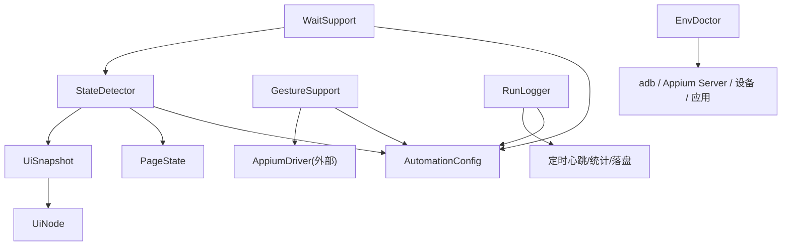
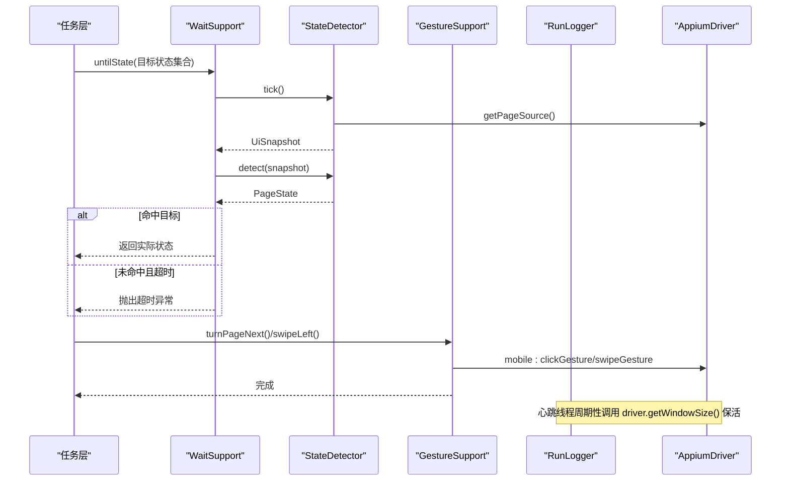
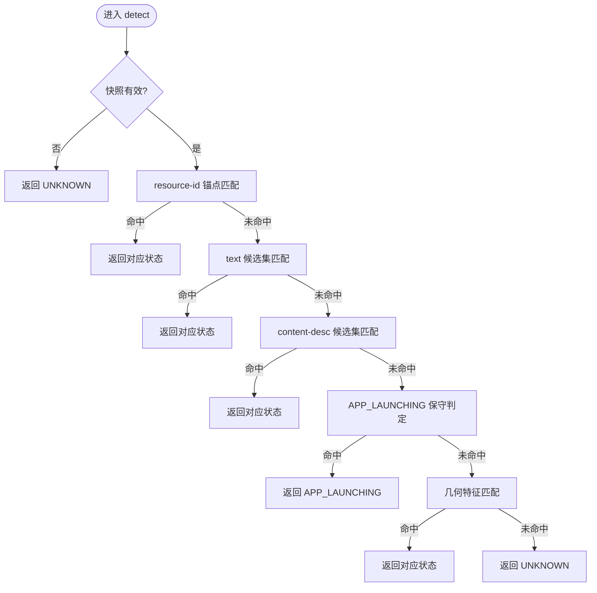
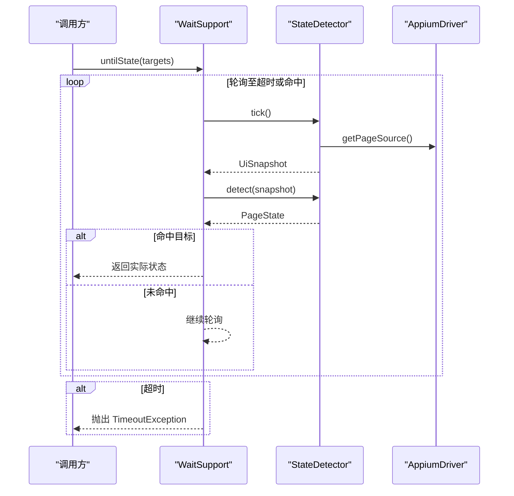
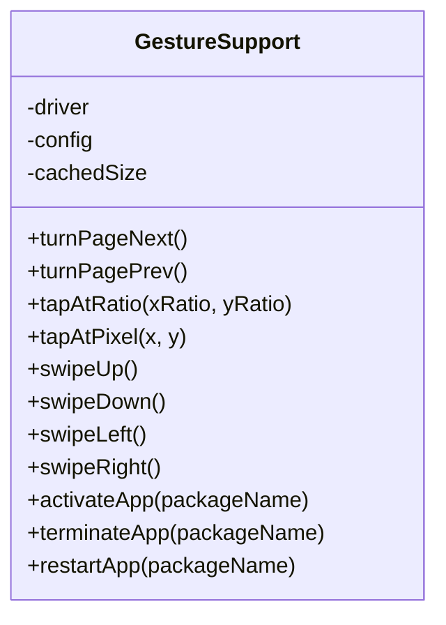
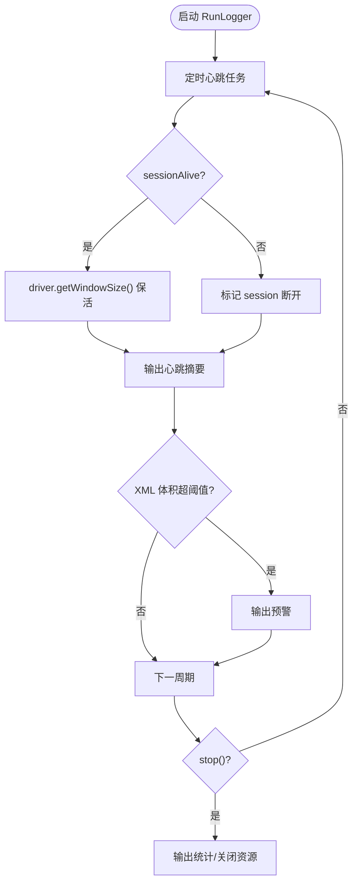
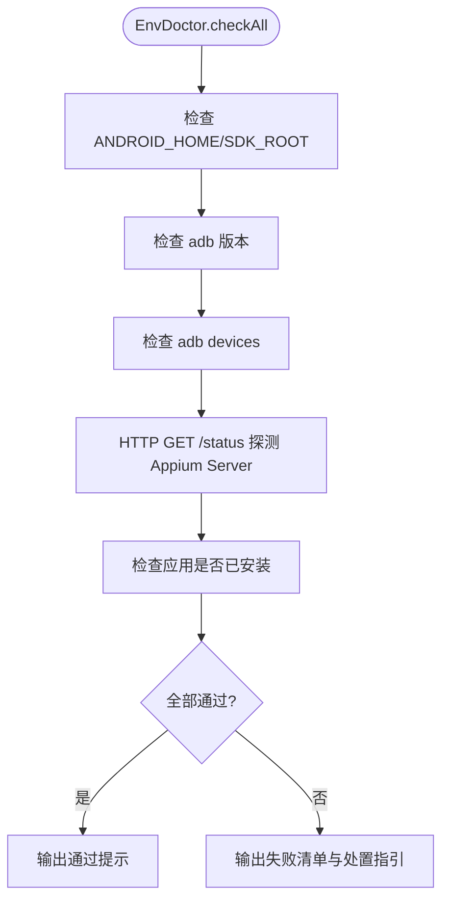
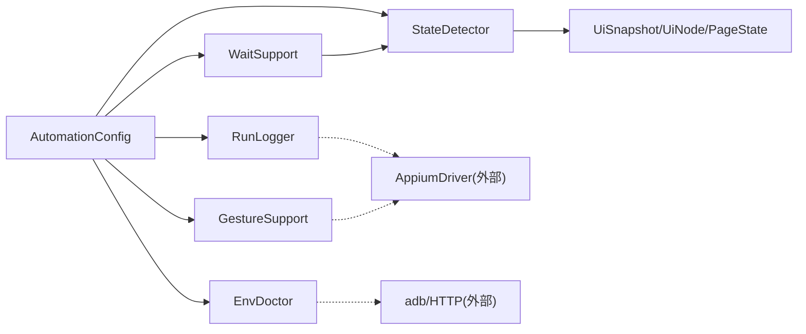

# 核心服务

<cite>
**本文引用的文件**
- [StateDetector.java](file://automation/src/main/java/com/fanqie/auto/core/StateDetector.java)
- [WaitSupport.java](file://automation/src/main/java/com/fanqie/auto/core/WaitSupport.java)
- [GestureSupport.java](file://automation/src/main/java/com/fanqie/auto/core/GestureSupport.java)
- [RunLogger.java](file://automation/src/main/java/com/fanqie/auto/core/RunLogger.java)
- [EnvDoctor.java](file://automation/src/main/java/com/fanqie/auto/core/EnvDoctor.java)
- [UiSnapshot.java](file://automation/src/main/java/com/fanqie/auto/core/UiSnapshot.java)
- [UiNode.java](file://automation/src/main/java/com/fanqie/auto/core/UiNode.java)
- [PageState.java](file://automation/src/main/java/com/fanqie/auto/core/PageState.java)
- [AutomationConfig.java](file://automation/src/main/java/com/fanqie/auto/config/AutomationConfig.java)
</cite>

## 目录
1. [简介](#简介)
2. [项目结构](#项目结构)
3. [核心组件](#核心组件)
4. [架构总览](#架构总览)
5. [详细组件分析](#详细组件分析)
6. [依赖关系分析](#依赖关系分析)
7. [性能考量](#性能考量)
8. [故障排查指南](#故障排查指南)
9. [结论](#结论)
10. [附录](#附录)

## 简介
本文件聚焦自动化测试项目的“核心服务模块”，围绕以下基础服务展开：
- StateDetector：UI 快照分析与状态识别算法，提供高性能、可观测的状态检测。
- WaitSupport：智能等待策略，统一显式等待与条件等待，支撑稳定流程控制。
- GestureSupport：手势操作封装，屏蔽设备差异，实现点击、滑动等交互自动化。
- RunLogger：运行日志与监控，负责心跳保活、指标收集与异常取证。
- EnvDoctor：环境自检与故障诊断，确保 Appium 会话创建前环境就绪。

## 项目结构
核心服务位于 automation/src/main/java/com/fanqie/auto/core 包下，配合配置 AutomationConfig 与数据模型 UiSnapshot/UiNode/PageState 共同构成稳定的自动化基座。整体职责清晰：
- 状态识别：StateDetector + UiSnapshot + UiNode + PageState
- 等待协调：WaitSupport（依赖 StateDetector）
- 交互执行：GestureSupport（基于驱动命令）
- 可观测性：RunLogger（心跳、统计、截图/XML 快照）
- 前置检查：EnvDoctor（adb/Appium/设备/应用）

图表来源
- [StateDetector.java:97-170](file://automation/src/main/java/com/fanqie/auto/core/StateDetector.java#L97-L170)
- [WaitSupport.java:56-183](file://automation/src/main/java/com/fanqie/auto/core/WaitSupport.java#L56-L183)
- [GestureSupport.java:77-178](file://automation/src/main/java/com/fanqie/auto/core/GestureSupport.java#L77-L178)
- [RunLogger.java:144-197](file://automation/src/main/java/com/fanqie/auto/core/RunLogger.java#L144-L197)
- [EnvDoctor.java:48-71](file://automation/src/main/java/com/fanqie/auto/core/EnvDoctor.java#L48-L71)
- [AutomationConfig.java:180-212](file://automation/src/main/java/com/fanqie/auto/config/AutomationConfig.java#L180-L212)

章节来源
- [StateDetector.java:1-461](file://automation/src/main/java/com/fanqie/auto/core/StateDetector.java#L1-L461)
- [WaitSupport.java:1-234](file://automation/src/main/java/com/fanqie/auto/core/WaitSupport.java#L1-L234)
- [GestureSupport.java:1-228](file://automation/src/main/java/com/fanqie/auto/core/GestureSupport.java#L1-L228)
- [RunLogger.java:1-374](file://automation/src/main/java/com/fanqie/auto/core/RunLogger.java#L1-L374)
- [EnvDoctor.java:1-313](file://automation/src/main/java/com/fanqie/auto/core/EnvDoctor.java#L1-L313)
- [UiSnapshot.java:1-284](file://automation/src/main/java/com/fanqie/auto/core/UiSnapshot.java#L1-L284)
- [UiNode.java:1-218](file://automation/src/main/java/com/fanqie/auto/core/UiNode.java#L1-L218)
- [PageState.java:1-97](file://automation/src/main/java/com/fanqie/auto/core/PageState.java#L1-L97)
- [AutomationConfig.java:1-306](file://automation/src/main/java/com/fanqie/auto/config/AutomationConfig.java#L1-L306)

## 核心组件
- StateDetector：以一次 getPageSource() 构造内存快照，按优先级进行纯内存匹配，返回首个命中状态；内置屏幕尺寸缓存与自愈机制，避免横屏/折叠屏导致的比例失真。
- WaitSupport：基于 WebDriverWait 的显式等待，支持多目标状态等待、状态消失等待、文案出现等待与自定义快照条件等待；提供指数退避重试。
- GestureSupport：所有坐标基于运行时屏幕尺寸按比例计算，使用 mobile: clickGesture/swipeGesture 等命令执行，封装翻页、滑动、App 生命周期操作。
- RunLogger：独立心跳线程定期轻量保活并输出摘要；记录状态转移、错误分布、识别耗时、XML 体积等指标；异常时保存截图与 XML 快照。
- EnvDoctor：启动前通过 adb 与 HTTP 探测环境，逐项给出中文处置指引，任一硬性失败即阻止后续流程。

章节来源
- [StateDetector.java:12-28](file://automation/src/main/java/com/fanqie/auto/core/StateDetector.java#L12-L28)
- [WaitSupport.java:16-25](file://automation/src/main/java/com/fanqie/auto/core/WaitSupport.java#L16-L25)
- [GestureSupport.java:12-25](file://automation/src/main/java/com/fanqie/auto/core/GestureSupport.java#L12-L25)
- [RunLogger.java:31-45](file://automation/src/main/java/com/fanqie/auto/core/RunLogger.java#L31-L45)
- [EnvDoctor.java:19-28](file://automation/src/main/java/com/fanqie/auto/core/EnvDoctor.java#L19-L28)

## 架构总览
核心服务围绕“状态机驱动”的组织方式协作：
- StateDetector 产出 PageState，作为决策依据。
- WaitSupport 将状态变化转化为可等待的原语，保证时序稳定性。
- GestureSupport 在正确时机执行动作，驱动状态迁移。
- RunLogger 贯穿全程，提供可观测性与恢复证据。
- EnvDoctor 在会话创建前完成环境校验，降低失败成本。

图表来源
- [WaitSupport.java:56-183](file://automation/src/main/java/com/fanqie/auto/core/WaitSupport.java#L56-L183)
- [StateDetector.java:97-170](file://automation/src/main/java/com/fanqie/auto/core/StateDetector.java#L97-L170)
- [GestureSupport.java:77-178](file://automation/src/main/java/com/fanqie/auto/core/GestureSupport.java#L77-L178)
- [RunLogger.java:144-197](file://automation/src/main/java/com/fanqie/auto/core/RunLogger.java#L144-L197)

## 详细组件分析

### StateDetector：状态检测机制
- UI 快照分析：tick() 仅调用一次 getPageSource()，构造 UiSnapshot，并在同一 tick 内复用；同时首次获取并缓存屏幕尺寸，若检测到节点越界则自动重取尺寸，避免横屏/折叠屏导致比例判定失真。
- 状态识别算法：doDetect() 按优先级顺序匹配：
  1) resource-id 锚点（书架/阅读页容器，含 READER_MENU 判定）
  2) text 候选集（开屏广告跳过文案优先于关闭按钮几何误判）
  3) content-desc 候选集（穿山甲 SDK 常用）
  4) APP_LAUNCHING 保守判定（节点极少 + 无大面积视频特征）
  5) 几何特征（右上角小 clickable → AD_CLOSE_READY；大面积视频 → AD_VIDEO_PLAYING）
  6) 兜底 UNKNOWN
- 性能优化：
  - 零 RPC 匹配：全部基于内存节点表，避免逐状态 RPC 查询。
  - 屏幕尺寸缓存与自愈：减少 getSize() 调用，并在旋转/横屏激励视频后自动刷新。
  - 可观测性：可选注入 RunLogger 上报 detect 耗时。

图表来源
- [StateDetector.java:152-208](file://automation/src/main/java/com/fanqie/auto/core/StateDetector.java#L152-L208)
- [StateDetector.java:218-418](file://automation/src/main/java/com/fanqie/auto/core/StateDetector.java#L218-L418)

章节来源
- [StateDetector.java:97-170](file://automation/src/main/java/com/fanqie/auto/core/StateDetector.java#L97-L170)
- [StateDetector.java:183-208](file://automation/src/main/java/com/fanqie/auto/core/StateDetector.java#L183-L208)
- [StateDetector.java:218-418](file://automation/src/main/java/com/fanqie/auto/core/StateDetector.java#L218-L418)
- [UiSnapshot.java:21-35](file://automation/src/main/java/com/fanqie/auto/core/UiSnapshot.java#L21-L35)

### WaitSupport：智能等待策略
- 显式等待：untilState(...) 基于 WebDriverWait(driver, timeout, pollInterval)，轮询调用 stateDetector.tick() 与 detect()，直到命中目标之一。
- 隐式等待：不依赖隐式等待（由驱动工厂设为 0），统一使用显式等待，避免不可控的全局等待行为。
- 条件等待：
  - untilStateGone(...)：等待指定状态消失（如广告播放结束、启动完成）。
  - untilAnyTextPresent(...)：等待特定文案出现。
  - untilSnapshotMatches(...)：通用快照条件等待，供上层复杂逻辑使用。
- 幂等重试：runWithRetry(...) 提供指数退避重试，缓解时序竞争导致的偶发失败。

图表来源
- [WaitSupport.java:56-183](file://automation/src/main/java/com/fanqie/auto/core/WaitSupport.java#L56-L183)
- [StateDetector.java:97-170](file://automation/src/main/java/com/fanqie/auto/core/StateDetector.java#L97-L170)

章节来源
- [WaitSupport.java:56-183](file://automation/src/main/java/com/fanqie/auto/core/WaitSupport.java#L56-L183)
- [WaitSupport.java:199-232](file://automation/src/main/java/com/fanqie/auto/core/WaitSupport.java#L199-L232)
- [AutomationConfig.java:180-212](file://automation/src/main/java/com/fanqie/auto/config/AutomationConfig.java#L180-L212)

### GestureSupport：手势操作封装
- 比例坐标：所有坐标基于运行时屏幕尺寸按比例计算，避免硬编码像素值，适配不同分辨率与横竖屏切换。
- 翻页策略：支持 tap 与 swipe 两种策略，默认 tap 点击右侧热区（右三分之一区域），备选 swipe 使用 mobile: swipeGesture。
- 通用手势：tapAtRatio/tapAtPixel、swipeUp/Down/Left/Right，均通过 mobile 命令执行，更稳定。
- 应用生命周期：activateApp/terminateApp/restartApp，避免硬编码 Activity 名导致的权限问题。

图表来源
- [GestureSupport.java:77-178](file://automation/src/main/java/com/fanqie/auto/core/GestureSupport.java#L77-L178)
- [GestureSupport.java:189-226](file://automation/src/main/java/com/fanqie/auto/core/GestureSupport.java#L189-L226)

章节来源
- [GestureSupport.java:12-25](file://automation/src/main/java/com/fanqie/auto/core/GestureSupport.java#L12-L25)
- [GestureSupport.java:77-178](file://automation/src/main/java/com/fanqie/auto/core/GestureSupport.java#L77-L178)
- [GestureSupport.java:189-226](file://automation/src/main/java/com/fanqie/auto/core/GestureSupport.java#L189-L226)

### RunLogger：日志记录与监控
- 心跳保活：独立 daemon 线程每 heartbeat.interval.sec 秒执行轻量 driver.getWindowSize()，防止 newCommandTimeout 断开。
- 指标收集：记录当前状态、广告轮次、累计时长、翻页数、连续错误、getPageSource 耗时、XML 体积、状态识别耗时等。
- 异常取证：在异常/恢复时保存截图与 XML 快照到 snapshots 目录，便于回溯。
- 幂等停止：stop() 确保调度器关闭、统计输出与文件写入器关闭，支持 finally 与 ShutdownHook 多次调用。

图表来源
- [RunLogger.java:144-197](file://automation/src/main/java/com/fanqie/auto/core/RunLogger.java#L144-L197)
- [RunLogger.java:204-229](file://automation/src/main/java/com/fanqie/auto/core/RunLogger.java#L204-L229)
- [RunLogger.java:239-261](file://automation/src/main/java/com/fanqie/auto/core/RunLogger.java#L239-L261)
- [RunLogger.java:284-345](file://automation/src/main/java/com/fanqie/auto/core/RunLogger.java#L284-L345)

章节来源
- [RunLogger.java:31-45](file://automation/src/main/java/com/fanqie/auto/core/RunLogger.java#L31-L45)
- [RunLogger.java:144-197](file://automation/src/main/java/com/fanqie/auto/core/RunLogger.java#L144-L197)
- [RunLogger.java:239-261](file://automation/src/main/java/com/fanqie/auto/core/RunLogger.java#L239-L261)
- [RunLogger.java:284-345](file://automation/src/main/java/com/fanqie/auto/core/RunLogger.java#L284-L345)

### EnvDoctor：环境自检与故障诊断
- 检查项：ANDROID_HOME/ANDROID_SDK_ROOT、adb 版本、设备列表与应用安装情况、Appium Server 在线状态。
- 处置指引：每项失败均输出具体中文处置步骤（如开启 USB 调试、授权弹窗、安装 Appium 等）。
- 健壮执行：ProcessBuilder 调用设置超时并分别消费 stdout/stderr，避免 Windows 缓冲区满死锁。

图表来源
- [EnvDoctor.java:48-71](file://automation/src/main/java/com/fanqie/auto/core/EnvDoctor.java#L48-L71)
- [EnvDoctor.java:75-194](file://automation/src/main/java/com/fanqie/auto/core/EnvDoctor.java#L75-L194)
- [EnvDoctor.java:218-265](file://automation/src/main/java/com/fanqie/auto/core/EnvDoctor.java#L218-L265)

章节来源
- [EnvDoctor.java:19-28](file://automation/src/main/java/com/fanqie/auto/core/EnvDoctor.java#L19-L28)
- [EnvDoctor.java:48-71](file://automation/src/main/java/com/fanqie/auto/core/EnvDoctor.java#L48-L71)
- [EnvDoctor.java:75-194](file://automation/src/main/java/com/fanqie/auto/core/EnvDoctor.java#L75-L194)
- [EnvDoctor.java:218-265](file://automation/src/main/java/com/fanqie/auto/core/EnvDoctor.java#L218-L265)

## 依赖关系分析
- StateDetector 依赖 UiSnapshot/UiNode/PageState 与 AutomationConfig；可选注入 RunLogger 用于耗时上报。
- WaitSupport 依赖 StateDetector 与 AutomationConfig，统一等待原语。
- GestureSupport 依赖 AutomationConfig 与 AppiumDriver（外部），执行 mobile 命令。
- RunLogger 依赖 AutomationConfig 与 AppiumDriver（外部），负责心跳与统计。
- EnvDoctor 依赖 AutomationConfig，通过 adb 与 HTTP 探测环境。

图表来源
- [StateDetector.java:33-54](file://automation/src/main/java/com/fanqie/auto/core/StateDetector.java#L33-L54)
- [WaitSupport.java:30-38](file://automation/src/main/java/com/fanqie/auto/core/WaitSupport.java#L30-L38)
- [GestureSupport.java:30-39](file://automation/src/main/java/com/fanqie/auto/core/GestureSupport.java#L30-L39)
- [RunLogger.java:54-86](file://automation/src/main/java/com/fanqie/auto/core/RunLogger.java#L54-L86)
- [EnvDoctor.java:35-41](file://automation/src/main/java/com/fanqie/auto/core/EnvDoctor.java#L35-L41)
- [AutomationConfig.java:180-212](file://automation/src/main/java/com/fanqie/auto/config/AutomationConfig.java#L180-L212)

章节来源
- [StateDetector.java:33-54](file://automation/src/main/java/com/fanqie/auto/core/StateDetector.java#L33-L54)
- [WaitSupport.java:30-38](file://automation/src/main/java/com/fanqie/auto/core/WaitSupport.java#L30-L38)
- [GestureSupport.java:30-39](file://automation/src/main/java/com/fanqie/auto/core/GestureSupport.java#L30-L39)
- [RunLogger.java:54-86](file://automation/src/main/java/com/fanqie/auto/core/RunLogger.java#L54-L86)
- [EnvDoctor.java:35-41](file://automation/src/main/java/com/fanqie/auto/core/EnvDoctor.java#L35-L41)

## 性能考量
- 状态识别性能：StateDetector 采用一次 getPageSource() + 内存匹配，避免逐状态 RPC；屏幕尺寸缓存与自愈减少额外 getSize() 调用。
- 等待策略性能：WaitSupport 使用显式等待与可配置的 pollInterval，避免 Thread.sleep 散落；指数退避重试提升鲁棒性。
- 手势执行性能：GestureSupport 使用 mobile: clickGesture/swipeGesture 单次设备端执行，比多点注入更稳更快。
- 可观测性开销：RunLogger 心跳为轻量命令，异常取证仅在必要时触发；XML 体积异常预警帮助定位 UI 树泄漏。

[本节为通用性能讨论，无需具体文件分析]

## 故障排查指南
- 环境准备：使用 EnvDoctor 逐项检查 adb、设备、Appium Server 与应用安装情况，按输出指引处理。
- 会话保活：关注 RunLogger 心跳摘要与 sessionAlive 标志；若连接断开，需重建会话并复位标志。
- 状态识别异常：检查 StateDetector 的优先级匹配路径与 UiSnapshot 解析结果；畸形 XML 会返回空快照并走 UNKNOWN 分支。
- 等待超时：确认 WaitSupport 的目标状态集合是否覆盖可能跳转（如翻页后直接触发广告弹窗）；调整超时与轮询间隔。
- 手势失效：核对比例坐标与屏幕尺寸缓存；横屏/旋转后需使缓存失效并重新获取。

章节来源
- [EnvDoctor.java:48-71](file://automation/src/main/java/com/fanqie/auto/core/EnvDoctor.java#L48-L71)
- [RunLogger.java:144-197](file://automation/src/main/java/com/fanqie/auto/core/RunLogger.java#L144-L197)
- [UiSnapshot.java:21-35](file://automation/src/main/java/com/fanqie/auto/core/UiSnapshot.java#L21-L35)
- [WaitSupport.java:56-183](file://automation/src/main/java/com/fanqie/auto/core/WaitSupport.java#L56-L183)
- [GestureSupport.java:56-67](file://automation/src/main/java/com/fanqie/auto/core/GestureSupport.java#L56-L67)

## 结论
核心服务模块以“状态机驱动”的方式组织，StateDetector 提供高性能状态识别，WaitSupport 提供稳定等待原语，GestureSupport 屏蔽设备差异执行交互，RunLogger 提供全链路可观测性与恢复证据，EnvDoctor 保障前置环境就绪。该设计在保证稳定性的同时兼顾性能与可维护性，适合长时运行的自动化场景。

[本节为总结，无需具体文件分析]

## 附录
- 关键配置项参考：
  - 轮询间隔：timing.poll.interval.ms
  - 状态识别超时：timing.state.detect.timeout.ms
  - 动作超时：timing.action.timeout.ms
  - 心跳间隔：timing.heartbeat.interval.sec
  - 翻页策略：reader.turn.strategy、reader.next.tap.ratio.x/y、reader.prev.tap.ratio.x、reader.swipe.percent/duration.ms

章节来源
- [AutomationConfig.java:180-212](file://automation/src/main/java/com/fanqie/auto/config/AutomationConfig.java#L180-L212)
- [AutomationConfig.java:262-287](file://automation/src/main/java/com/fanqie/auto/config/AutomationConfig.java#L262-L287)