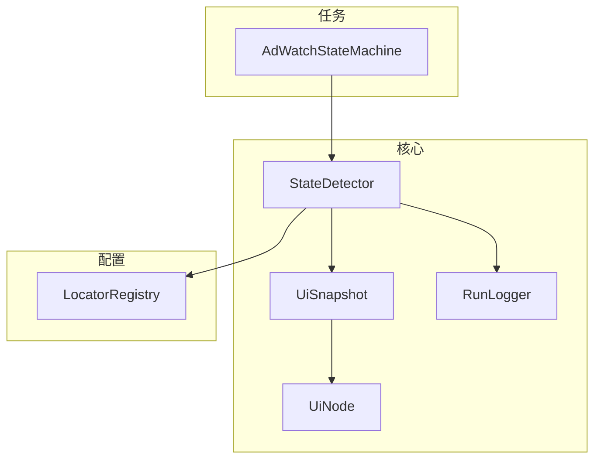
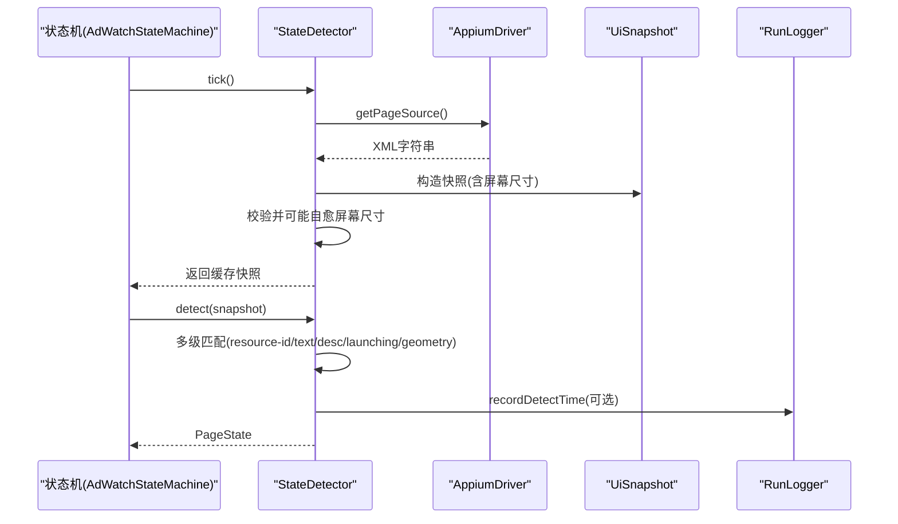
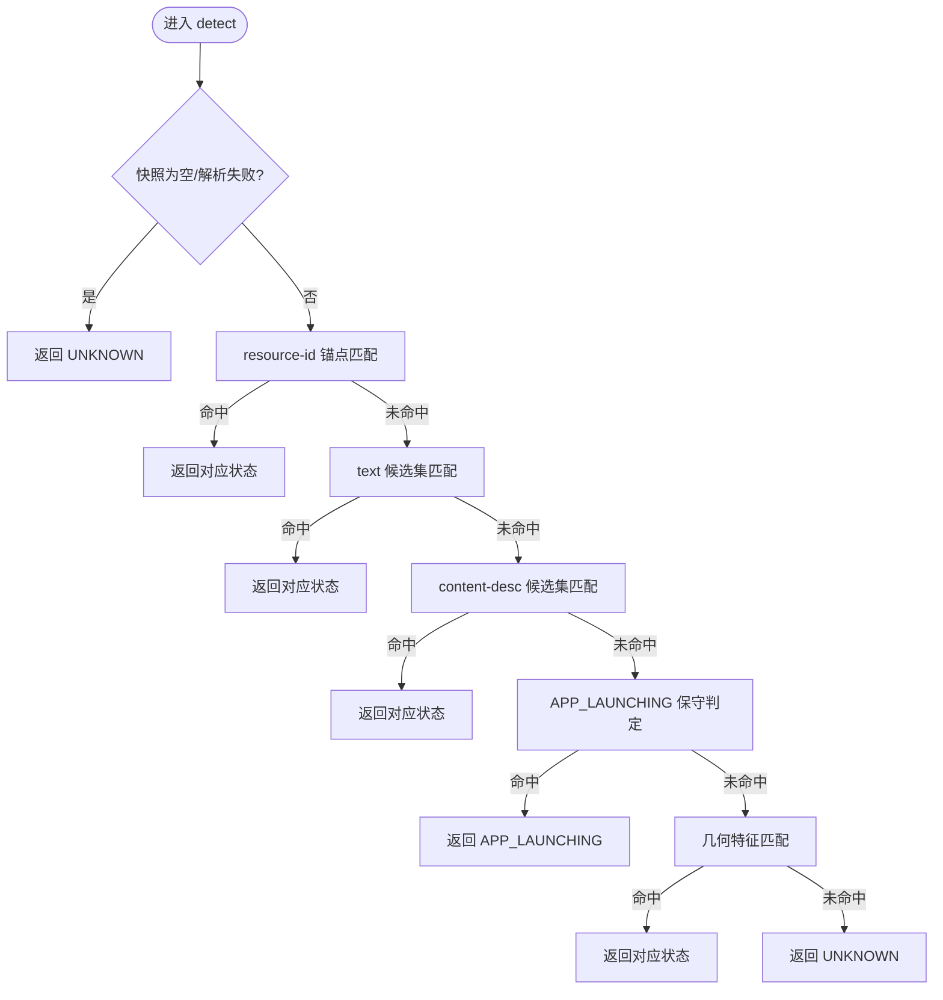
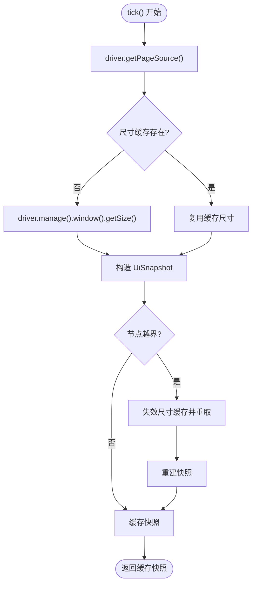
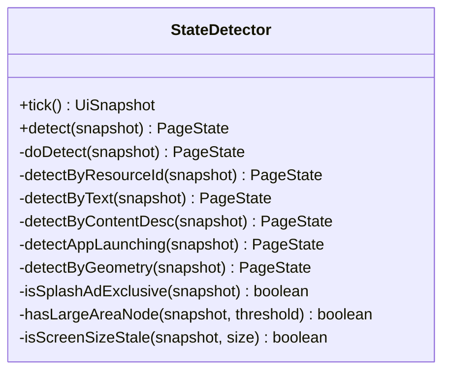
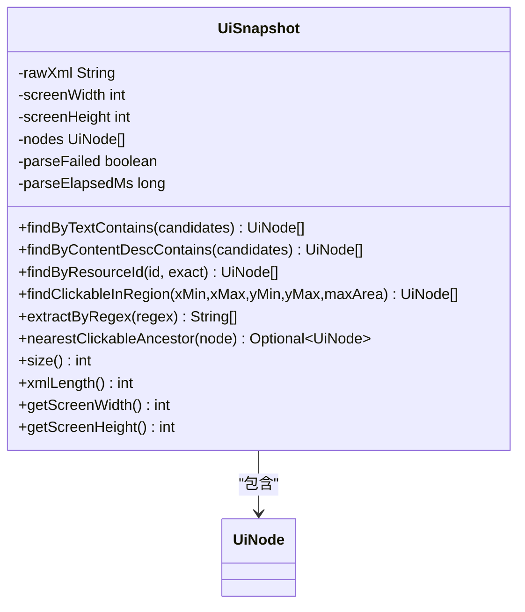
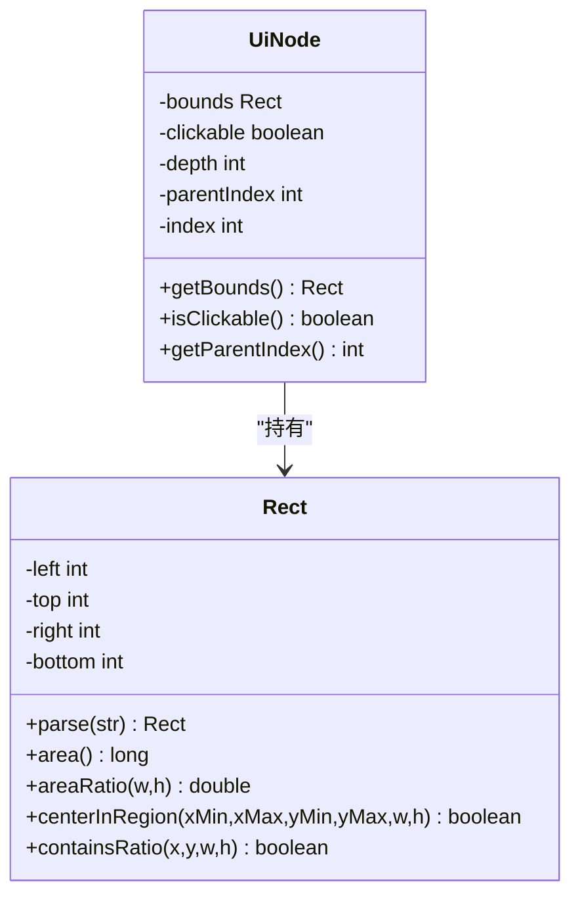
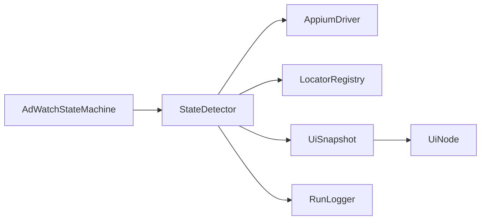

# 状态检测器

<cite>
**本文引用的文件**
- [StateDetector.java](file://automation/src/main/java/com/fanqie/auto/core/StateDetector.java)
- [UiSnapshot.java](file://automation/src/main/java/com/fanqie/auto/core/UiSnapshot.java)
- [UiNode.java](file://automation/src/main/java/com/fanqie/auto/core/UiNode.java)
- [LocatorRegistry.java](file://automation/src/main/java/com/fanqie/auto/config/LocatorRegistry.java)
- [RunLogger.java](file://automation/src/main/java/com/fanqie/auto/core/RunLogger.java)
- [AdWatchStateMachine.java](file://automation/src/main/java/com/fanqie/auto/task/AdWatchStateMachine.java)
- [PageStateTest.java](file://automation/src/test/java/com/fanqie/auto/core/PageStateTest.java)
- [StateDetectorTest.java](file://automation/src/test/java/com/fanqie/auto/core/StateDetectorTest.java)
</cite>

## 目录
1. [简介](#简介)
2. [项目结构](#项目结构)
3. [核心组件](#核心组件)
4. [架构总览](#架构总览)
5. [详细组件分析](#详细组件分析)
6. [依赖关系分析](#依赖关系分析)
7. [性能考量](#性能考量)
8. [故障排除指南](#故障排除指南)
9. [结论](#结论)
10. [附录](#附录)

## 简介
本文件面向“状态检测器”的完整技术文档，聚焦 UI 快照分析与状态识别算法。内容涵盖：
- tick() 方法的 UI 树获取策略、getPageSource() 的性能优化与快照缓存机制
- detect() 的多级匹配优先级：resource-id 锚点、text 候选集、content-desc 候选集、APP_LAUNCHING 保守判定、几何特征匹配等
- 屏幕尺寸缓存与自愈机制（横屏检测、折叠屏适配）
- 页面状态识别逻辑（BOOKSHELF、READER、AD_CLOSE_READY、AD_VIDEO_PLAYING 等）
- 性能优化策略与故障排除指南

## 项目结构
状态检测相关代码集中在 automation 模块的 core、config、task 包中：
- core：StateDetector、UiSnapshot、UiNode、RunLogger 等核心实现
- config：LocatorRegistry 管理文案/正则/资源定位策略
- task：AdWatchStateMachine 使用 StateDetector 驱动状态流转

图表来源
- [StateDetector.java:1-461](file://automation/src/main/java/com/fanqie/auto/core/StateDetector.java#L1-L461)
- [UiSnapshot.java:1-284](file://automation/src/main/java/com/fanqie/auto/core/UiSnapshot.java#L1-L284)
- [UiNode.java:1-218](file://automation/src/main/java/com/fanqie/auto/core/UiNode.java#L1-L218)
- [LocatorRegistry.java:1-300](file://automation/src/main/java/com/fanqie/auto/config/LocatorRegistry.java#L1-L300)
- [AdWatchStateMachine.java:429-454](file://automation/src/main/java/com/fanqie/auto/task/AdWatchStateMachine.java#L429-L454)
- [RunLogger.java:1-374](file://automation/src/main/java/com/fanqie/auto/core/RunLogger.java#L1-L374)

章节来源
- [StateDetector.java:1-461](file://automation/src/main/java/com/fanqie/auto/core/StateDetector.java#L1-L461)
- [UiSnapshot.java:1-284](file://automation/src/main/java/com/fanqie/auto/core/UiSnapshot.java#L1-L284)
- [LocatorRegistry.java:1-300](file://automation/src/main/java/com/fanqie/auto/config/LocatorRegistry.java#L1-L300)
- [AdWatchStateMachine.java:429-454](file://automation/src/main/java/com/fanqie/auto/task/AdWatchStateMachine.java#L429-L454)

## 核心组件
- StateDetector：状态识别核心，负责 UI 快照获取、缓存、多级匹配与性能上报
- UiSnapshot：一次 getPageSource() 的内存快照，提供纯内存查询 API
- UiNode/Rect：UI 节点与矩形区域模型，支持面积比例、区域中心判断等几何计算
- LocatorRegistry：集中管理 text/content-desc/resource-id 候选集与正则
- RunLogger：运行期可观测性（心跳保活、耗时统计、异常快照落盘）
- AdWatchStateMachine：基于 StateDetector 的状态机，驱动广告观看流程

章节来源
- [StateDetector.java:12-28](file://automation/src/main/java/com/fanqie/auto/core/StateDetector.java#L12-L28)
- [UiSnapshot.java:21-35](file://automation/src/main/java/com/fanqie/auto/core/UiSnapshot.java#L21-L35)
- [UiNode.java:1-12](file://automation/src/main/java/com/fanqie/auto/core/UiNode.java#L1-L12)
- [LocatorRegistry.java:16-25](file://automation/src/main/java/com/fanqie/auto/config/LocatorRegistry.java#L16-L25)
- [RunLogger.java:31-45](file://automation/src/main/java/com/fanqie/auto/core/RunLogger.java#L31-L45)
- [AdWatchStateMachine.java:429-454](file://automation/src/main/java/com/fanqie/auto/task/AdWatchStateMachine.java#L429-L454)

## 架构总览
状态检测器采用“单次抓取 + 纯内存匹配”的架构：tick() 仅调用一次 driver.getPageSource()，构造 UiSnapshot；detect() 在内存中对 UiSnapshot 按优先级顺序进行多级匹配，避免多次 RPC 阻塞。

图表来源
- [StateDetector.java:87-170](file://automation/src/main/java/com/fanqie/auto/core/StateDetector.java#L87-L170)
- [UiSnapshot.java:52-72](file://automation/src/main/java/com/fanqie/auto/core/UiSnapshot.java#L52-L72)
- [RunLogger.java:223-226](file://automation/src/main/java/com/fanqie/auto/core/RunLogger.java#L223-L226)
- [AdWatchStateMachine.java:429-454](file://automation/src/main/java/com/fanqie/auto/task/AdWatchStateMachine.java#L429-L454)

## 详细组件分析

### StateDetector：多级匹配与自愈机制
- 设计要点
  - tick() 只做一次 getPageSource()，同一 tick 内复用快照，杜绝重复抓取
  - detect() 纯内存匹配，按确定性由高到低的优先级顺序返回首个命中状态
  - 屏幕尺寸缓存 + 自愈：若节点 bounds 超出缓存尺寸，自动重取尺寸并重建快照
- 匹配优先级
  1) resource-id 锚点（最高确定性、最低成本，含 READER_MENU 判定）
  2) text 候选集（含 SPLASH_AD 优先于 AD_CLOSE_READY）
  3) content-desc 候选集
  4) APP_LAUNCHING 保守判定（节点极少 + 无锚点 + 无视频大面积特征）
  5) 几何特征（如右上角小 clickable → AD_CLOSE_READY；大面积视频 → AD_VIDEO_PLAYING）
  6) 兜底 UNKNOWN

图表来源
- [StateDetector.java:143-208](file://automation/src/main/java/com/fanqie/auto/core/StateDetector.java#L143-L208)

章节来源
- [StateDetector.java:12-28](file://automation/src/main/java/com/fanqie/auto/core/StateDetector.java#L12-L28)
- [StateDetector.java:143-208](file://automation/src/main/java/com/fanqie/auto/core/StateDetector.java#L143-L208)

#### tick()：UI 树获取策略与快照缓存
- 策略
  - 仅调用一次 driver.getPageSource()，记录耗时 lastPageSourceMs
  - 首次获取并缓存屏幕尺寸 cachedScreenSize，后续复用
  - 构造 UiSnapshot 后检查是否越界（isScreenSizeStale），若越界则失效并重取尺寸，重建快照
  - 将快照写入缓存，供同一 tick 内多次 detect() 复用
- 性能优化
  - 相比 uiautomator dump，getPageSource() 走设备端 instrumentation server，开销更低
  - 屏幕尺寸缓存减少 getSize() 调用
  - 自愈机制避免横屏/折叠屏旋转导致比例判定失真

图表来源
- [StateDetector.java:87-127](file://automation/src/main/java/com/fanqie/auto/core/StateDetector.java#L87-L127)
- [StateDetector.java:450-459](file://automation/src/main/java/com/fanqie/auto/core/StateDetector.java#L450-L459)

章节来源
- [StateDetector.java:87-127](file://automation/src/main/java/com/fanqie/auto/core/StateDetector.java#L87-L127)
- [StateDetector.java:450-459](file://automation/src/main/java/com/fanqie/auto/core/StateDetector.java#L450-L459)

#### detect()：多级匹配优先级详解
- resource-id 锚点
  - BOOKSHELF：书架 Tab 资源 id + recycler 列表可见
  - READER/READER_MENU：阅读页容器 id + 菜单文案命中时判为 READER_MENU，否则 READER
  - 真机兼容：当 reader 资源 id 被混淆时，回退到 readerContainerIds 候选集
- text 候选集
  - 广告相关：AD_CONTINUE_PROMPT、AD_CONFIRM_DIALOG、AD_ENTRY_PROMPT
  - SPLASH_AD：开屏专有跳过文案 + 全屏大面积 + 无右上角关闭 clickable
  - AD_CLOSE_READY：存在“关闭”文案
  - CHAPTER_END：下一章文案
  - COMMON_POPUP：通用弹窗文案
  - BOOKSHEEF：书架 Tab 文案兜底
  - READER_MENU 文案兜底：需同时满足大面积正文（areaRatio>0.6）
  - READER 兜底：章节进度正则 + 大面积正文
- content-desc 候选集
  - 穿山甲 SDK 常以 content-desc 标注关闭按钮，命中即 AD_CLOSE_READY
- APP_LAUNCHING 保守判定
  - 节点数极少（<=15）且无大面积节点（排除视频 SurfaceView），且无任何已知锚点命中
- 几何特征
  - AD_CLOSE_READY：右上角小 clickable 节点（x>0.8W, y<0.2H, areaRatio<0.15）
  - AD_VIDEO_PLAYING：节点较少（<=30）且存在大面积节点（areaRatio>0.6）

图表来源
- [StateDetector.java:143-459](file://automation/src/main/java/com/fanqie/auto/core/StateDetector.java#L143-L459)

章节来源
- [StateDetector.java:183-459](file://automation/src/main/java/com/fanqie/auto/core/StateDetector.java#L183-L459)

### UiSnapshot：内存快照与查询 API
- 解析与健壮性
  - 防御 XXE：禁用 doctype、外部实体、XInclude 等
  - 非线程安全 DocumentBuilderFactory 每次新建实例
  - 畸形/截断 XML 不抛异常，返回空快照并标记 parseFailed
- 查询 API（纯内存，零 RPC）
  - findByTextContains / findByContentDescContains / findByResourceId
  - findClickableInRegion：按屏幕比例区域筛选 clickable 节点
  - extractByRegex：从 text/content-desc 提取正则匹配结果
  - nearestClickableAncestor：向上回溯最近的可点击祖先

图表来源
- [UiSnapshot.java:21-284](file://automation/src/main/java/com/fanqie/auto/core/UiSnapshot.java#L21-L284)

章节来源
- [UiSnapshot.java:21-284](file://automation/src/main/java/com/fanqie/auto/core/UiSnapshot.java#L21-L284)

### UiNode/Rect：几何特征与区域判定
- Rect.parse：健壮解析 "[x1,y1][x2,y2]"，非法数据返回 EMPTY
- areaRatio：计算节点面积占屏幕比例，用于大面积视频/开屏广告判定
- centerInRegion：判断节点中心是否落在指定比例区域（如右上角关闭热区）
- containsRatio：判断比例坐标点是否落在矩形内

图表来源
- [UiNode.java:1-218](file://automation/src/main/java/com/fanqie/auto/core/UiNode.java#L1-L218)

章节来源
- [UiNode.java:1-218](file://automation/src/main/java/com/fanqie/auto/core/UiNode.java#L1-L218)

### LocatorRegistry：候选集与定位策略
- 统一管理 text/content-desc/resource-id 候选集与正则
- 关键特性
  - UTF-8 加载 properties，避免中文乱码
  - 每个控件定义 primaryBy + fallbackBys + boundsHint + allowGeometryFallback
  - ad.watch/ad.continue 禁止几何兜底（误点浪费配额），ad.close 允许几何兜底（漏点代价更高）
- 常用接口
  - adCloseTexts()/adCloseDescs()、adEntryTexts()、adWatchTexts()、adContinueTexts()
  - chapterNextTexts()、commonDismissTexts()、readerMenuTexts()、splashSkipTexts()
  - readerProgressRegex()、bookShortDramaRegex()、bookNovelRegex()

章节来源
- [LocatorRegistry.java:16-137](file://automation/src/main/java/com/fanqie/auto/config/LocatorRegistry.java#L16-L137)
- [LocatorRegistry.java:150-256](file://automation/src/main/java/com/fanqie/auto/config/LocatorRegistry.java#L150-L256)

### 页面状态识别逻辑汇总
- BOOKSHELF：书架 Tab 资源 id + recycler 列表可见；或书架 Tab 文案兜底
- READER：阅读页容器资源 id 命中；或章节进度正则 + 大面积正文
- READER_MENU：阅读页容器资源 id + 菜单文案命中；或菜单文案 + 大面积正文（纯文案兜底收窄）
- AD_CLOSE_READY：存在“关闭”文案或 content-desc 命中；或右上角小 clickable 几何特征
- AD_VIDEO_PLAYING：节点较少且存在大面积节点（无关闭特征）
- SPLASH_AD：开屏专有跳过文案 + 全屏大面积 + 无右上角关闭 clickable
- APP_LAUNCHING：节点极少 + 无大面积 + 无锚点命中（保守判定）
- COMMON_POPUP：通用弹窗文案命中
- CHAPTER_END：下一章文案命中
- UNKNOWN：无法确定时的兜底

章节来源
- [StateDetector.java:218-459](file://automation/src/main/java/com/fanqie/auto/core/StateDetector.java#L218-L459)
- [PageStateTest.java:17-59](file://automation/src/test/java/com/fanqie/auto/core/PageStateTest.java#L17-L59)

### 屏幕尺寸缓存与自愈机制
- 缓存策略：首次获取屏幕尺寸并缓存，后续复用，减少 getSize() 调用
- 自愈触发：若任一节点 bounds 超出缓存尺寸（横屏激励视频/折叠屏旋转），立即失效并重取尺寸，重建快照
- 适用场景：横屏检测、折叠屏旋转、不同分辨率设备

章节来源
- [StateDetector.java:102-118](file://automation/src/main/java/com/fanqie/auto/core/StateDetector.java#L102-L118)
- [StateDetector.java:450-459](file://automation/src/main/java/com/fanqie/auto/core/StateDetector.java#L450-L459)

### 与状态机的集成
- AdWatchStateMachine 通过 detector.tick() 获取快照，再调用 detect() 识别状态，驱动动作（如打开书籍、点击广告入口等）
- 状态转移过程中持续刷新状态并记录日志

章节来源
- [AdWatchStateMachine.java:429-454](file://automation/src/main/java/com/fanqie/auto/task/AdWatchStateMachine.java#L429-L454)

## 依赖关系分析
- StateDetector 依赖
  - AppiumDriver：获取 UI 树与屏幕尺寸
  - LocatorRegistry：文本/描述/资源 id 候选集与正则
  - UiSnapshot/UiNode：内存快照与节点模型
  - RunLogger：可选注入以记录状态识别耗时
- UiSnapshot 依赖
  - UiNode：节点模型
  - 标准库：JDK XML 解析（带 XXE 防护）
- LocatorRegistry 依赖
  - Properties：配置文件加载（UTF-8）
- 测试覆盖
  - PageStateTest：验证 isReaderFamily/isAbnormal/isAdFlowState 等便捷方法
  - StateDetectorTest：验证各状态 fixture 的识别结果

图表来源
- [StateDetector.java:1-461](file://automation/src/main/java/com/fanqie/auto/core/StateDetector.java#L1-L461)
- [UiSnapshot.java:1-284](file://automation/src/main/java/com/fanqie/auto/core/UiSnapshot.java#L1-L284)
- [LocatorRegistry.java:1-300](file://automation/src/main/java/com/fanqie/auto/config/LocatorRegistry.java#L1-L300)
- [AdWatchStateMachine.java:429-454](file://automation/src/main/java/com/fanqie/auto/task/AdWatchStateMachine.java#L429-L454)

章节来源
- [StateDetector.java:1-461](file://automation/src/main/java/com/fanqie/auto/core/StateDetector.java#L1-L461)
- [UiSnapshot.java:1-284](file://automation/src/main/java/com/fanqie/auto/core/UiSnapshot.java#L1-L284)
- [LocatorRegistry.java:1-300](file://automation/src/main/java/com/fanqie/auto/config/LocatorRegistry.java#L1-L300)
- [AdWatchStateMachine.java:429-454](file://automation/src/main/java/com/fanqie/auto/task/AdWatchStateMachine.java#L429-L454)

## 性能考量
- 单次抓取 + 纯内存匹配：tick() 仅一次 getPageSource()，detect() 全内存操作，避免 O(状态数) 次 RPC
- 屏幕尺寸缓存：减少 getSize() 调用，自愈机制保证横屏/折叠屏场景准确性
- 解析安全与效率：XXE 防护、非线程安全工厂每次新建、畸形 XML 不抛异常
- 可观测性：RunLogger 记录 detect 耗时、getPageSource 耗时、XML 大小，便于监控与调优
- 建议
  - 保持候选集精简，避免过多 text 匹配造成扫描开销
  - 合理设置阈值（如 areaRatio、节点数量上限），平衡准确率与性能
  - 定期校验 locator.properties 编码与内容，防止中文乱码影响匹配

[本节为通用指导，无需特定文件引用]

## 故障排除指南
- 症状：状态识别缓慢或卡顿
  - 排查：查看 RunLogger 输出的 getPageSource 耗时与 XML 大小，确认是否存在 XML 膨胀
  - 处理：检查设备端 UI 树泄漏，必要时重启 session
- 症状：横屏/折叠屏后比例判定错误
  - 排查：确认 isScreenSizeStale 是否触发，尺寸缓存是否失效并重取
  - 处理：确保 refreshDriver 时清除尺寸缓存，tick() 自愈逻辑生效
- 症状：误判 SPLASH_AD 或 AD_CLOSE_READY
  - 排查：检查 splashSkipTexts 与 ad.close.text 的候选集是否冲突；确认右上角关闭 clickable 检测
  - 处理：调整候选集与排他条件（全屏大面积 + 无右上角关闭）
- 症状：READER_MENU 误判或漏判
  - 排查：确认菜单文案命中与大面积正文（areaRatio>0.6）同时满足
  - 处理：校准 readerMenuTexts 与阈值，避免书架顶栏文案误命中
- 症状：UNKNOWN 频繁出现
  - 排查：检查 snapshot.size() 与锚点命中情况，确认是否处于启动期或 UI 树不完整
  - 处理：适当放宽 APP_LAUNCHING 条件或增加候选集

章节来源
- [RunLogger.java:162-197](file://automation/src/main/java/com/fanqie/auto/core/RunLogger.java#L162-L197)
- [StateDetector.java:102-118](file://automation/src/main/java/com/fanqie/auto/core/StateDetector.java#L102-L118)
- [StateDetector.java:281-331](file://automation/src/main/java/com/fanqie/auto/core/StateDetector.java#L281-L331)
- [StateDetector.java:359-418](file://automation/src/main/java/com/fanqie/auto/core/StateDetector.java#L359-L418)

## 结论
状态检测器通过“单次抓取 + 纯内存匹配 + 屏幕尺寸自愈”的设计，实现了高效、稳定的 UI 状态识别。多级匹配优先级确保了高确定性状态的快速命中，同时兼顾了复杂场景（横屏、折叠屏、广告流）的鲁棒性。配合 RunLogger 的可观测性与 LocatorRegistry 的配置化管理，系统具备良好的可维护性与扩展性。

[本节为总结，无需特定文件引用]

## 附录
- 关键类与方法路径参考
  - tick()：[StateDetector.java:87-127](file://automation/src/main/java/com/fanqie/auto/core/StateDetector.java#L87-L127)
  - detect/doDetect：[StateDetector.java:143-208](file://automation/src/main/java/com/fanqie/auto/core/StateDetector.java#L143-L208)
  - 几何特征匹配：[StateDetector.java:394-418](file://automation/src/main/java/com/fanqie/auto/core/StateDetector.java#L394-L418)
  - 屏幕尺寸自愈：[StateDetector.java:450-459](file://automation/src/main/java/com/fanqie/auto/core/StateDetector.java#L450-L459)
  - 快照解析与查询 API：[UiSnapshot.java:52-228](file://automation/src/main/java/com/fanqie/auto/core/UiSnapshot.java#L52-L228)
  - 矩形与区域判定：[UiNode.java:113-197](file://automation/src/main/java/com/fanqie/auto/core/UiNode.java#L113-L197)
  - 候选集与定位策略：[LocatorRegistry.java:95-137](file://automation/src/main/java/com/fanqie/auto/config/LocatorRegistry.java#L95-L137)

[本节为附录，无需特定文件引用]