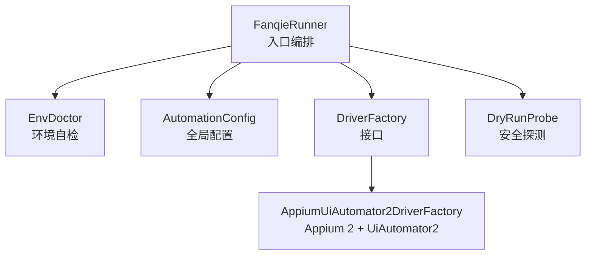
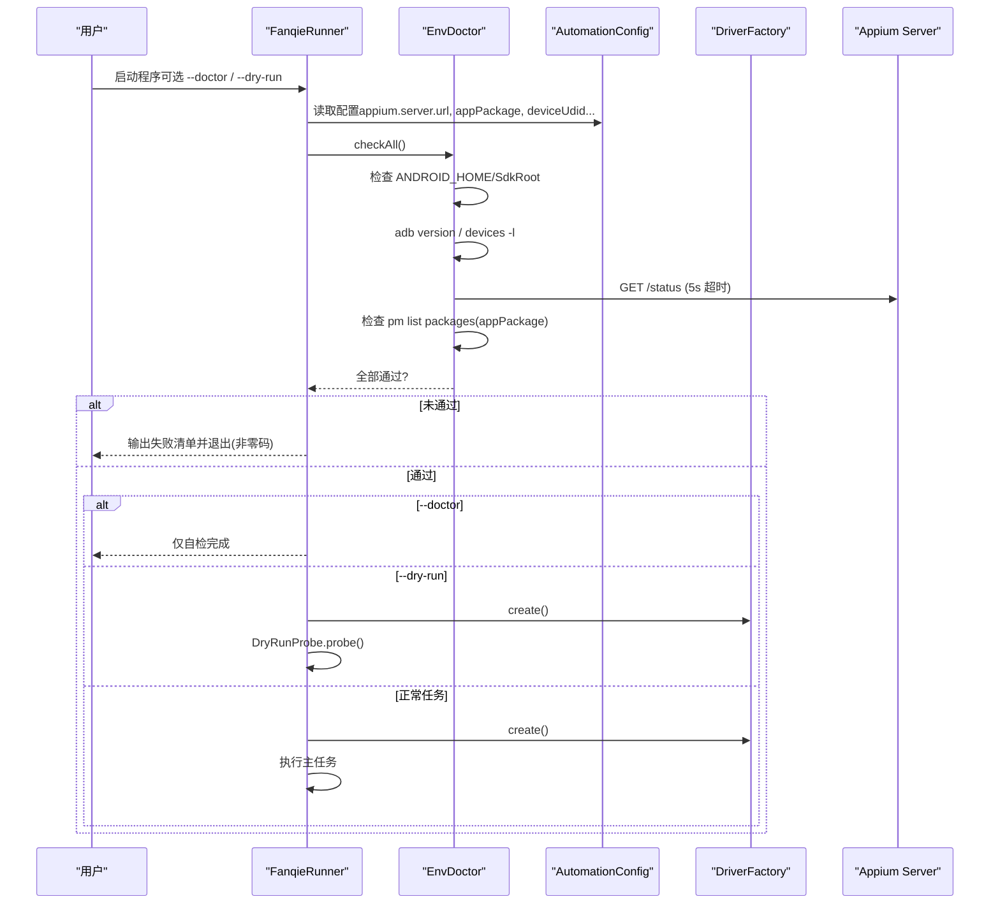
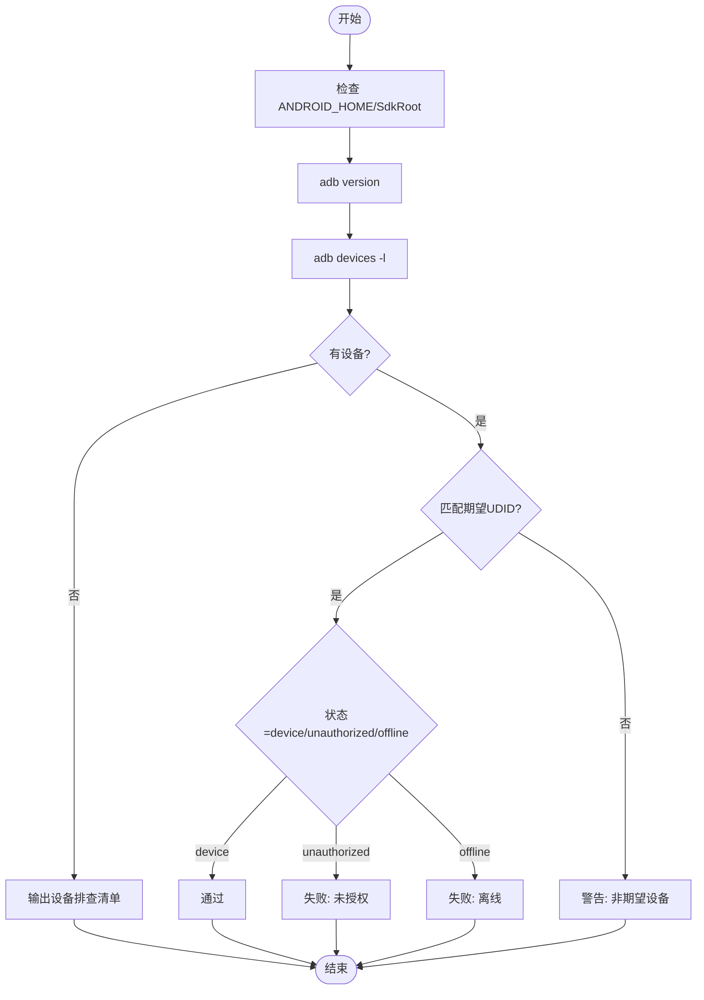
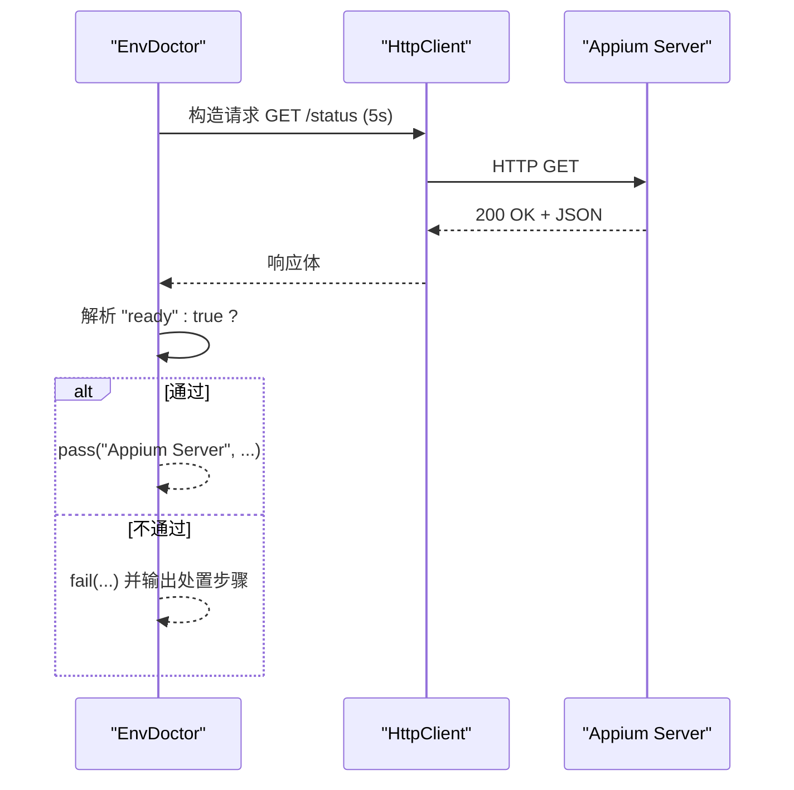
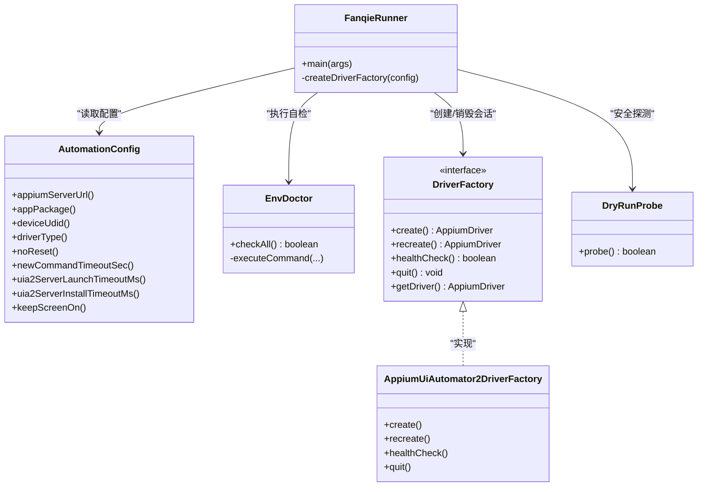

# 环境检测

<cite>
**本文引用的文件**
- [EnvDoctor.java](file://automation/src/main/java/com/fanqie/auto/core/EnvDoctor.java)
- [AutomationConfig.java](file://automation/src/main/java/com/fanqie/auto/config/AutomationConfig.java)
- [FanqieRunner.java](file://automation/src/main/java/com/fanqie/auto/FanqieRunner.java)
- [AppiumUiAutomator2DriverFactory.java](file://automation/src/main/java/com/fanqie/auto/core/AppiumUiAutomator2DriverFactory.java)
- [DriverFactory.java](file://automation/src/main/java/com/fanqie/auto/core/DriverFactory.java)
- [DryRunProbe.java](file://automation/src/main/java/com/fanqie/auto/DryRunProbe.java)
- [README.md](file://automation/README.md)
</cite>

## 目录
1. [简介](#简介)
2. [项目结构](#项目结构)
3. [核心组件](#核心组件)
4. [架构总览](#架构总览)
5. [详细组件分析](#详细组件分析)
6. [依赖关系分析](#依赖关系分析)
7. [性能考量](#性能考量)
8. [故障排除指南](#故障排除指南)
9. [结论](#结论)
10. [附录](#附录)

## 简介
本模块聚焦“环境检测”能力，围绕启动前自检、设备连接检查、Appium 服务检测、应用安装状态检查、自动诊断与修复建议、可配置性（适配不同设备与环境）以及最佳实践与排障进行系统化说明。通过 EnvDoctor 在创建 Appium session 之前执行一系列硬性检查，确保 ADB 可用、设备在线、Appium Server 就绪、目标包已安装；结合 FanqieRunner 的入口编排与 DriverFactory 的会话管理，形成从“环境自检 → 驱动装配 → 运行/探测”的闭环。

## 项目结构
环境检测相关代码集中在 core 与 config 层：
- 入口编排：FanqieRunner 负责参数解析、组件装配、调用 EnvDoctor 自检、按需进入 dry-run 或主任务。
- 环境自检：EnvDoctor 实现 adb 版本/设备列表、Appium Server 连通性与 ready 状态、Android SDK 环境变量、应用包安装检查。
- 配置中心：AutomationConfig 集中加载 properties，提供 appium.server.url、appPackage、deviceUdid 等关键键值。
- 驱动工厂：DriverFactory 抽象 + AppiumUiAutomator2DriverFactory 实现，封装 session 创建、健康检查、退出与重建。
- 安全探针：DryRunProbe 用于只读探测 UI 树，辅助定位问题与验证环境连通性。

图表来源
- [FanqieRunner.java:41-119](file://automation/src/main/java/com/fanqie/auto/FanqieRunner.java#L41-L119)
- [EnvDoctor.java:48-71](file://automation/src/main/java/com/fanqie/auto/core/EnvDoctor.java#L48-L71)
- [AutomationConfig.java:112-131](file://automation/src/main/java/com/fanqie/auto/config/AutomationConfig.java#L112-L131)
- [DriverFactory.java:17-54](file://automation/src/main/java/com/fanqie/auto/core/DriverFactory.java#L17-L54)
- [AppiumUiAutomator2DriverFactory.java:44-76](file://automation/src/main/java/com/fanqie/auto/core/AppiumUiAutomator2DriverFactory.java#L44-L76)
- [DryRunProbe.java:91-197](file://automation/src/main/java/com/fanqie/auto/DryRunProbe.java#L91-L197)

章节来源
- [FanqieRunner.java:41-119](file://automation/src/main/java/com/fanqie/auto/FanqieRunner.java#L41-L119)
- [EnvDoctor.java:48-71](file://automation/src/main/java/com/fanqie/auto/core/EnvDoctor.java#L48-L71)
- [AutomationConfig.java:112-131](file://automation/src/main/java/com/fanqie/auto/config/AutomationConfig.java#L112-L131)

## 核心组件
- 环境自检器（EnvDoctor）
  - 职责：ADB 版本/设备列表检查、Appium Server 连通性与 ready 校验、ANDROID_HOME/SdkRoot 提示、应用包安装检查；输出中文处置指引并汇总诊断结果。
  - 关键点：外部命令执行带超时与流消费，避免 Windows 下缓冲区死锁；任一硬性失败则返回 false，由 Runner 以非零码退出。
- 配置中心（AutomationConfig）
  - 职责：统一加载 automation.properties，提供类型化 getter；支持外部覆盖（--config），缺项使用默认值不抛异常。
  - 关键键：appium.server.url、appPackage、deviceUdid、driver.type、noReset、newCommandTimeoutSec、uia2ServerLaunchTimeoutMs、uia2ServerInstallTimeoutMs、keepScreenOn 等。
- 驱动工厂（DriverFactory + AppiumUiAutomator2DriverFactory）
  - 职责：创建/重建/健康检查/退出 Appium session；构建 UiAutomator2Options 能力集；捕获并输出定向中文诊断。
  - 关键点：隐式等待置零以避免短轮询被阻塞；华为/鸿蒙特殊能力；noReset 保护用户数据。
- 安全探针（DryRunProbe）
  - 职责：仅连接 Appium、激活 App、抓取书架页/阅读页 UI 快照并落盘；打印节点统计与关键词命中，辅助定位环境问题与 UI 变化。
- 入口编排（FanqieRunner）
  - 职责：解析命令行参数（--doctor/--dry-run/--config 等）、装配组件、执行 EnvDoctor 自检、按模式进入 dry-run 或主任务；注册 ShutdownHook 优雅退出。

章节来源
- [EnvDoctor.java:75-194](file://automation/src/main/java/com/fanqie/auto/core/EnvDoctor.java#L75-L194)
- [AutomationConfig.java:112-178](file://automation/src/main/java/com/fanqie/auto/config/AutomationConfig.java#L112-L178)
- [AppiumUiAutomator2DriverFactory.java:120-178](file://automation/src/main/java/com/fanqie/auto/core/AppiumUiAutomator2DriverFactory.java#L120-L178)
- [DryRunProbe.java:91-197](file://automation/src/main/java/com/fanqie/auto/DryRunProbe.java#L91-L197)
- [FanqieRunner.java:41-119](file://automation/src/main/java/com/fanqie/auto/FanqieRunner.java#L41-L119)

## 架构总览
下图展示环境检测在整体流程中的位置与交互：Runner 先执行 EnvDoctor 自检，通过后根据模式选择 DryRunProbe 或直接创建 Driver；DriverFactory 负责与 Appium Server 建立会话并进行健康检查。

图表来源
- [FanqieRunner.java:41-119](file://automation/src/main/java/com/fanqie/auto/FanqieRunner.java#L41-L119)
- [EnvDoctor.java:48-71](file://automation/src/main/java/com/fanqie/auto/core/EnvDoctor.java#L48-L71)
- [AppiumUiAutomator2DriverFactory.java:44-76](file://automation/src/main/java/com/fanqie/auto/core/AppiumUiAutomator2DriverFactory.java#L44-L76)

## 详细组件分析

### 设备连接检查（ADB）
- 环境变量检查：ANDROID_HOME 或 ANDROID_SDK_ROOT 存在即视为可用；缺失时给出设置建议。
- adb 版本检查：执行 adb version，成功且包含标准标识即通过；否则给出安装与 PATH 刷新指引。
- 设备列表检查：执行 adb devices -l，依据期望 UDID 判断是否在线、授权、离线或检测到其他设备；为空或未识别时输出逐项排查清单（开发者选项、USB 调试、仅充电允许 ADB、传输文件模式、首次授权弹窗、监控安装应用、原装数据线）。

图表来源
- [EnvDoctor.java:75-140](file://automation/src/main/java/com/fanqie/auto/core/EnvDoctor.java#L75-L140)

章节来源
- [EnvDoctor.java:75-140](file://automation/src/main/java/com/fanqie/auto/core/EnvDoctor.java#L75-L140)

### Appium 服务检测
- 端口监听与服务就绪：通过 HttpClient 向 appium.server.url/status 发起 GET，超时 5 秒；响应 200 且 body 包含 ready=true 视为通过。
- 失败处理：HTTP 非 200 或连接异常时，输出 Node.js/Appium/uiautomator2 driver 安装与启动指引。

图表来源
- [EnvDoctor.java:142-176](file://automation/src/main/java/com/fanqie/auto/core/EnvDoctor.java#L142-L176)

章节来源
- [EnvDoctor.java:142-176](file://automation/src/main/java/com/fanqie/auto/core/EnvDoctor.java#L142-L176)

### 应用安装状态检查
- 包名验证：读取 AutomationConfig.appPackage()，执行 adb shell pm list packages 并在输出中查找包名。
- 结果处理：找到则通过；未找到则失败并提示安装目标 App 或核对包名。

章节来源
- [EnvDoctor.java:178-194](file://automation/src/main/java/com/fanqie/auto/core/EnvDoctor.java#L178-L194)
- [AutomationConfig.java:129-131](file://automation/src/main/java/com/fanqie/auto/config/AutomationConfig.java#L129-L131)

### 环境问题的自动诊断与修复建议
- 诊断输出：EnvDoctor 对每项检查输出通过/警告/失败，并收集 diagnostics 列表供上层使用。
- 修复建议：针对 adb 不可用、设备未授权/离线、Appium 无法连接、应用未安装等场景，直接打印具体处置步骤（含华为/鸿蒙特有设置项）。
- 会话创建失败诊断：AppiumUiAutomator2DriverFactory 在创建 session 失败时输出定向中文诊断，覆盖常见华为设备问题（安装弹窗、仅充电允许 ADB、USB 调试、授权、Server 启动、adb 识别）。

章节来源
- [EnvDoctor.java:269-292](file://automation/src/main/java/com/fanqie/auto/core/EnvDoctor.java#L269-L292)
- [EnvDoctor.java:196-210](file://automation/src/main/java/com/fanqie/auto/core/EnvDoctor.java#L196-L210)
- [AppiumUiAutomator2DriverFactory.java:180-208](file://automation/src/main/java/com/fanqie/auto/core/AppiumUiAutomator2DriverFactory.java#L180-L208)

### 环境检测的可配置性
- 配置来源：AutomationConfig 从 classpath 的 automation.properties 加载，并支持外部路径覆盖（--config）。
- 关键可配项（与环境检测/运行相关）：
  - appium.server.url：Appium Server 地址（EnvDoctor 探测 /status）
  - appPackage：目标应用包名（pm list packages 校验）
  - deviceUdid：设备序列号（adb devices 匹配）
  - driver.type：驱动类型（当前 uiautomator2，预留 harmony_hdc）
  - noReset/newCommandTimeoutSec：会话保持与心跳保活
  - uia2ServerLaunchTimeoutMs/uia2ServerInstallTimeoutMs：UiAutomator2 Server 启动/安装超时（华为/鸿蒙放宽）
  - keepScreenOn/skipServerInstallation/skipDeviceInitialization：屏幕常亮与跳过安装/初始化
- 默认值兜底：缺项或非法值均回退到内置默认，不抛异常，保证健壮性。

章节来源
- [AutomationConfig.java:25-63](file://automation/src/main/java/com/fanqie/auto/config/AutomationConfig.java#L25-L63)
- [AutomationConfig.java:112-178](file://automation/src/main/java/com/fanqie/auto/config/AutomationConfig.java#L112-L178)
- [ConfigTest.java:35-81](file://automation/src/test/java/com/fanqie/auto/config/ConfigTest.java#L35-L81)

### 安全探测（DryRunProbe）与环境验证
- 作用：在不点击广告/不消耗配额的前提下，连接 Appium、激活 App、抓取书架页与阅读页 UI 快照并落盘，输出节点统计与关键词命中，辅助验证环境与 UI 可观测性。
- 适用场景：环境搭建后快速验证 Appium 连通、设备可达、UI 树可读；为后续定位与校准提供依据。

章节来源
- [DryRunProbe.java:26-40](file://automation/src/main/java/com/fanqie/auto/DryRunProbe.java#L26-L40)
- [DryRunProbe.java:91-197](file://automation/src/main/java/com/fanqie/auto/DryRunProbe.java#L91-L197)

## 依赖关系分析
- FanqieRunner 依赖 AutomationConfig、EnvDoctor、DriverFactory、DryRunProbe 等组件，负责编排与生命周期管理。
- EnvDoctor 依赖 AutomationConfig 获取 appium.server.url、appPackage、deviceUdid；通过 ProcessBuilder 执行 adb 命令；通过 JDK HttpClient 访问 Appium /status。
- DriverFactory 抽象了 session 创建/重建/健康检查/退出；AppiumUiAutomator2DriverFactory 实现具体能力集构建与错误诊断。
- DryRunProbe 依赖 DriverFactory 创建的 AppiumDriver 及 WaitSupport/GestureSupport/StateDetector 等运行时组件。

图表来源
- [FanqieRunner.java:41-119](file://automation/src/main/java/com/fanqie/auto/FanqieRunner.java#L41-L119)
- [AutomationConfig.java:112-178](file://automation/src/main/java/com/fanqie/auto/config/AutomationConfig.java#L112-L178)
- [EnvDoctor.java:48-71](file://automation/src/main/java/com/fanqie/auto/core/EnvDoctor.java#L48-L71)
- [DriverFactory.java:17-54](file://automation/src/main/java/com/fanqie/auto/core/DriverFactory.java#L17-L54)
- [AppiumUiAutomator2DriverFactory.java:44-76](file://automation/src/main/java/com/fanqie/auto/core/AppiumUiAutomator2DriverFactory.java#L44-L76)
- [DryRunProbe.java:91-197](file://automation/src/main/java/com/fanqie/auto/DryRunProbe.java#L91-L197)

章节来源
- [FanqieRunner.java:41-119](file://automation/src/main/java/com/fanqie/auto/FanqieRunner.java#L41-L119)
- [DriverFactory.java:17-54](file://automation/src/main/java/com/fanqie/auto/core/DriverFactory.java#L17-L54)

## 性能考量
- 外部命令超时：EnvDoctor 执行 adb 命令设置 15 秒超时，避免长时间阻塞；同时分别消费 stdout/stderr 线程，防止 Windows 下缓冲区满导致死锁。
- 网络超时：Appium /status 探测使用 5 秒连接与请求超时，快速失败。
- 会话隐式等待：DriverFactory 创建后立即将隐式等待设为 0，确保短轮询（如 250ms）不被隐式等待破坏。
- 长任务保活：newCommandTimeoutSec 配合心跳机制，避免广告视频静默期触发断连。

章节来源
- [EnvDoctor.java:218-265](file://automation/src/main/java/com/fanqie/auto/core/EnvDoctor.java#L218-L265)
- [EnvDoctor.java:142-176](file://automation/src/main/java/com/fanqie/auto/core/EnvDoctor.java#L142-L176)
- [AppiumUiAutomator2DriverFactory.java:61-67](file://automation/src/main/java/com/fanqie/auto/core/AppiumUiAutomator2DriverFactory.java#L61-L67)
- [AppiumUiAutomator2DriverFactory.java:142-144](file://automation/src/main/java/com/fanqie/auto/core/AppiumUiAutomator2DriverFactory.java#L142-L144)

## 故障排除指南
- 常见问题与处置
  - adb 不可用：安装 platform-tools 并将 bin 加入 PATH；必要时 winget 安装 Google.PlatformTools。
  - 设备未授权/离线：在手机上确认 USB 调试授权弹窗；重新插拔 USB；执行 adb kill-server; adb start-server。
  - 华为/鸿蒙特有项：开启「仅充电模式下允许 ADB 调试」；USB 连接方式选「传输文件」；关闭「监控 ADB 安装应用」或人在旁逐个确认。
  - Appium 无法连接：确认 Node.js 与 Appium 已安装；启动 appium --base-path /；检查 http://127.0.0.1:4723/status 返回 ready。
  - 应用未安装：在设备上安装目标 App 或核对包名。
- 会话创建失败诊断：参考 DriverFactory 输出的定向诊断清单，逐项核对安装弹窗、USB 调试、授权、Server 状态与 adb 识别。
- 参考文档：README 中提供了环境搭建清单与验证步骤（platform-tools 安装、环境变量设置、Appium Server 启动与验证）。

章节来源
- [EnvDoctor.java:90-140](file://automation/src/main/java/com/fanqie/auto/core/EnvDoctor.java#L90-L140)
- [EnvDoctor.java:196-210](file://automation/src/main/java/com/fanqie/auto/core/EnvDoctor.java#L196-L210)
- [AppiumUiAutomator2DriverFactory.java:180-208](file://automation/src/main/java/com/fanqie/auto/core/AppiumUiAutomator2DriverFactory.java#L180-L208)
- [README.md:154-213](file://automation/README.md#L154-L213)

## 结论
环境检测模块通过 EnvDoctor 在 session 创建前完成关键前置条件校验，并以中文指引输出问题定位与修复建议；配合 AutomationConfig 的可配置性与 DriverFactory 的健壮会话管理，实现了跨设备/环境的稳定接入。建议在每次环境变更后优先执行 --doctor 自检，再使用 --dry-run 进行安全探测，最后进入主任务。

## 附录
- 常用命令
  - 环境自检：java ... FanqieRunner --doctor
  - 安全探测：java ... FanqieRunner --dry-run
  - 指定配置：java ... FanqieRunner --config <path>
  - 覆盖循环/页面数：--cycles N / --pages N
- 配置键速查（与环境检测/运行相关）
  - appium.server.url：Appium Server 地址
  - appPackage：目标包名
  - deviceUdid：设备序列号
  - driver.type：驱动类型（uiautomator2/harmony_hdc）
  - noReset：保留登录态与数据
  - newCommandTimeoutSec：新命令超时（秒）
  - uia2ServerLaunchTimeoutMs：UiAutomator2 Server 启动超时
  - uia2ServerInstallTimeoutMs：UiAutomator2 Server 安装超时
  - keepScreenOn：保持屏幕常亮

章节来源
- [FanqieRunner.java:241-249](file://automation/src/main/java/com/fanqie/auto/FanqieRunner.java#L241-L249)
- [AutomationConfig.java:112-178](file://automation/src/main/java/com/fanqie/auto/config/AutomationConfig.java#L112-L178)