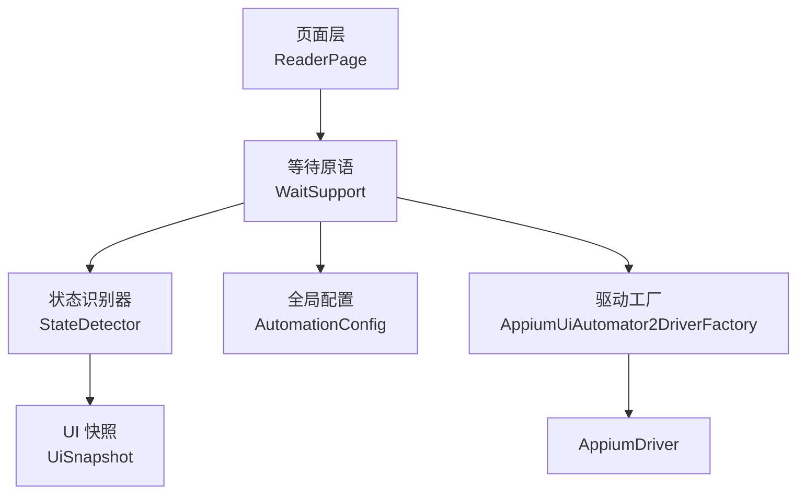
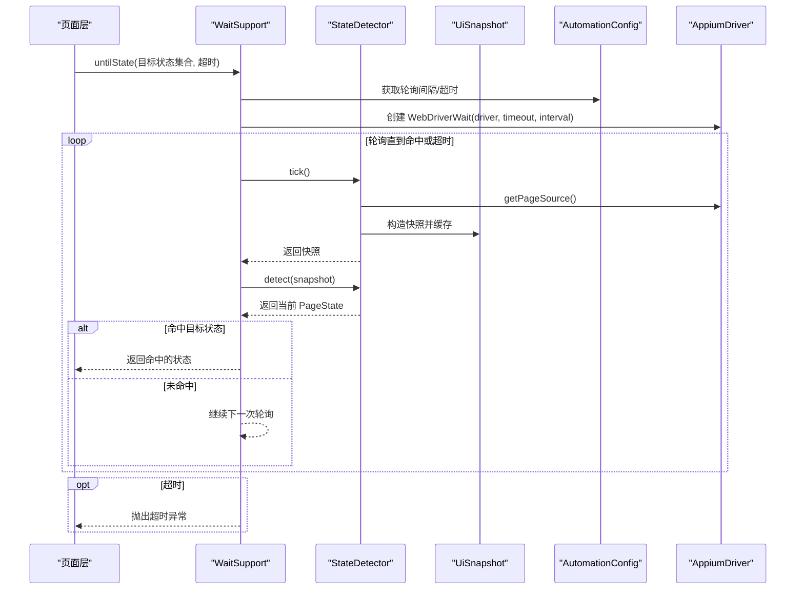
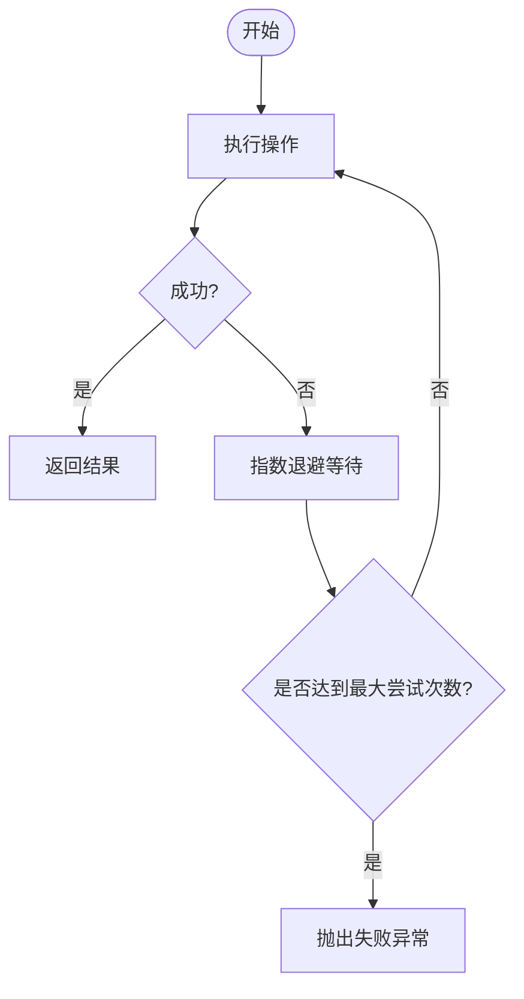
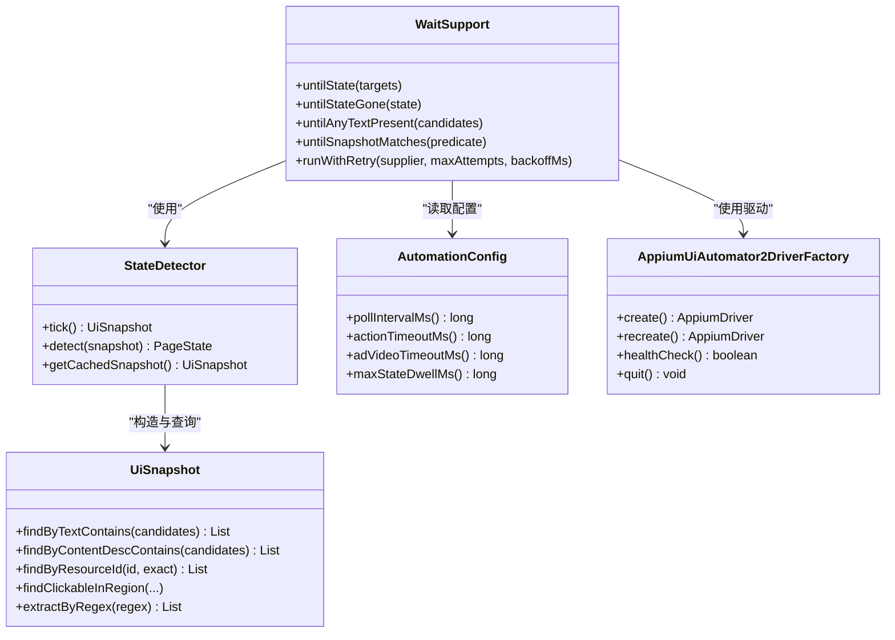

# 等待支持

<cite>
**本文引用的文件**
- [WaitSupport.java](file://automation/src/main/java/com/fanqie/auto/core/WaitSupport.java)
- [AutomationConfig.java](file://automation/src/main/java/com/fanqie/auto/config/AutomationConfig.java)
- [AppiumUiAutomator2DriverFactory.java](file://automation/src/main/java/com/fanqie/auto/core/AppiumUiAutomator2DriverFactory.java)
- [DriverAware.java](file://automation/src/main/java/com/fanqie/auto/core/DriverAware.java)
- [StateDetector.java](file://automation/src/main/java/com/fanqie/auto/core/StateDetector.java)
- [UiSnapshot.java](file://automation/src/main/java/com/fanqie/auto/core/UiSnapshot.java)
- [ReaderPage.java](file://automation/src/main/java/com/fanqie/auto/page/ReaderPage.java)
</cite>

## 目录
1. [简介](#简介)
2. [项目结构](#项目结构)
3. [核心组件](#核心组件)
4. [架构总览](#架构总览)
5. [详细组件分析](#详细组件分析)
6. [依赖关系分析](#依赖关系分析)
7. [性能考量](#性能考量)
8. [故障排查指南](#故障排查指南)
9. [结论](#结论)
10. [附录](#附录)

## 简介
本模块提供统一的“等待支持”，围绕显式等待、条件等待与幂等重试构建稳定可靠的自动化流程。系统不依赖隐式等待，所有等待均基于 WebDriverWait 的轮询机制；通过 StateDetector 对 UI 快照进行纯内存状态识别，结合 AutomationConfig 提供的超时与轮询参数，实现可配置、可扩展且高性能的等待策略。

## 项目结构
等待能力由以下关键部分协作完成：
- 等待原语封装：WaitSupport，统一对外暴露 untilState、untilStateGone、untilAnyTextPresent、untilSnapshotMatches、runWithRetry 等方法。
- 状态识别：StateDetector，负责抓取并缓存 UI 快照（UiSnapshot），按优先级判定当前 PageState。
- 配置中心：AutomationConfig，集中管理轮询间隔、动作超时、广告相关超时、最大停留时间等时序参数。
- 驱动集成：AppiumUiAutomator2DriverFactory，创建 AppiumDriver 并强制关闭隐式等待，确保全部等待走显式等待路径。
- 页面层使用：ReaderPage 等页面在翻页、跳转等操作后调用 WaitSupport 等待目标状态集合或特定文案出现。

图表来源
- [WaitSupport.java:56-183](file://automation/src/main/java/com/fanqie/auto/core/WaitSupport.java#L56-L183)
- [StateDetector.java:97-170](file://automation/src/main/java/com/fanqie/auto/core/StateDetector.java#L97-L170)
- [UiSnapshot.java:21-72](file://automation/src/main/java/com/fanqie/auto/core/UiSnapshot.java#L21-L72)
- [AutomationConfig.java:180-208](file://automation/src/main/java/com/fanqie/auto/config/AutomationConfig.java#L180-L208)
- [AppiumUiAutomator2DriverFactory.java:44-76](file://automation/src/main/java/com/fanqie/auto/core/AppiumUiAutomator2DriverFactory.java#L44-L76)

章节来源
- [WaitSupport.java:16-25](file://automation/src/main/java/com/fanqie/auto/core/WaitSupport.java#L16-L25)
- [AppiumUiAutomator2DriverFactory.java:15-32](file://automation/src/main/java/com/fanqie/auto/core/AppiumUiAutomator2DriverFactory.java#L15-L32)

## 核心组件
- WaitSupport：统一等待原语，封装 WebDriverWait 轮询，提供多目标状态等待、状态消失等待、文案出现等待、自定义快照条件等待以及带指数退避的重试。
- StateDetector：每次 tick 仅一次 getPageSource()，构造 UiSnapshot 并缓存；detect() 纯内存按优先级匹配状态，避免多次 RPC 与阻塞。
- UiSnapshot：解析 XML 为内存节点表，提供文本、描述、resource-id、区域点击等多维查询能力，零 RPC 快速判断。
- AutomationConfig：集中定义 pollIntervalMs、actionTimeoutMs、adVideoTimeoutMs、maxStateDwellMs 等关键时序参数，供等待与状态机使用。
- DriverAware：刷新 driver 引用接口，确保 session 重建后各组件持有最新驱动实例。
- AppiumUiAutomator2DriverFactory：创建驱动后立即设置 implicitlyWait=0，保证全部等待走显式等待路径。

章节来源
- [WaitSupport.java:26-38](file://automation/src/main/java/com/fanqie/auto/core/WaitSupport.java#L26-L38)
- [StateDetector.java:12-28](file://automation/src/main/java/com/fanqie/auto/core/StateDetector.java#L12-L28)
- [UiSnapshot.java:21-35](file://automation/src/main/java/com/fanqie/auto/core/UiSnapshot.java#L21-L35)
- [AutomationConfig.java:180-208](file://automation/src/main/java/com/fanqie/auto/config/AutomationConfig.java#L180-L208)
- [DriverAware.java:5-20](file://automation/src/main/java/com/fanqie/auto/core/DriverAware.java#L5-L20)
- [AppiumUiAutomator2DriverFactory.java:63-66](file://automation/src/main/java/com/fanqie/auto/core/AppiumUiAutomator2DriverFactory.java#L63-L66)

## 架构总览
等待流程以 WebDriverWait 为核心，配合 StateDetector 的快照与状态识别，形成“轮询—检测—命中”的稳定闭环。页面操作后，调用方指定一组目标状态或具体条件，等待直到任一目标满足或条件成立；若超时则抛出异常并记录日志。

图表来源
- [WaitSupport.java:56-86](file://automation/src/main/java/com/fanqie/auto/core/WaitSupport.java#L56-L86)
- [StateDetector.java:97-127](file://automation/src/main/java/com/fanqie/auto/core/StateDetector.java#L97-L127)
- [UiSnapshot.java:52-72](file://automation/src/main/java/com/fanqie/auto/core/UiSnapshot.java#L52-L72)
- [AutomationConfig.java:180-208](file://automation/src/main/java/com/fanqie/auto/config/AutomationConfig.java#L180-L208)

## 详细组件分析

### 显式等待 vs 隐式等待 vs 条件等待
- 显式等待：WaitSupport 全部基于 WebDriverWait，针对具体条件（如状态命中、文案出现、自定义快照条件）进行轮询，具备细粒度控制与良好可观测性。
- 隐式等待：驱动创建时已强制设置为 0，避免未命中查找阻塞整段隐式超时，从而破坏短轮询设计。
- 条件等待：untilSnapshotMatches 允许传入任意 Predicate<UiSnapshot>，用于复杂业务条件的等待（例如同时满足多个特征）。

章节来源
- [WaitSupport.java:16-25](file://automation/src/main/java/com/fanqie/auto/core/WaitSupport.java#L16-L25)
- [AppiumUiAutomator2DriverFactory.java:63-66](file://automation/src/main/java/com/fanqie/auto/core/AppiumUiAutomator2DriverFactory.java#L63-L66)
- [WaitSupport.java:153-183](file://automation/src/main/java/com/fanqie/auto/core/WaitSupport.java#L153-L183)

### 超时配置与重试机制
- 超时来源：actionTimeoutMs、adVideoTimeoutMs、adCloseReadyTimeoutMs、maxStateDwellMs 等均由 AutomationConfig 提供，避免硬编码。
- 轮询间隔：pollIntervalMs 决定 WebDriverWait 的轮询频率，默认短间隔提升响应速度。
- 重试机制：runWithRetry 提供幂等重试与指数退避（backoffMs → backoffMs*2 → …），适用于偶发失败的操作（如动画未完成、节点尚未挂载）。

图表来源
- [WaitSupport.java:185-222](file://automation/src/main/java/com/fanqie/auto/core/WaitSupport.java#L185-L222)

章节来源
- [AutomationConfig.java:180-208](file://automation/src/main/java/com/fanqie/auto/config/AutomationConfig.java#L180-L208)
- [WaitSupport.java:185-222](file://automation/src/main/java/com/fanqie/auto/core/WaitSupport.java#L185-L222)

### 与 Appium 驱动的集成方式
- 驱动创建：AppiumUiAutomator2DriverFactory 创建 AndroidDriver 后立即设置 implicitlyWait=0，确保所有等待走显式等待。
- WebDriverWait 使用：WaitSupport 内部直接构造 WebDriverWait(driver, Duration.ofMillis(timeout), Duration.ofMillis(pollIntervalMs))，并通过 stateDetector.tick() + detect() 完成状态轮询。
- 自定义等待条件：untilSnapshotMatches 接受任意 Predicate<UiSnapshot>，可在上层组合复杂条件（例如同时检查文案、区域点击节点、正则提取等）。

章节来源
- [AppiumUiAutomator2DriverFactory.java:44-76](file://automation/src/main/java/com/fanqie/auto/core/AppiumUiAutomator2DriverFactory.java#L44-L76)
- [WaitSupport.java:67-86](file://automation/src/main/java/com/fanqie/auto/core/WaitSupport.java#L67-L86)
- [WaitSupport.java:153-183](file://automation/src/main/java/com/fanqie/auto/core/WaitSupport.java#L153-L183)

### 等待策略的扩展性
- 新增等待类型：可通过 untilSnapshotMatches 组合新的条件逻辑，无需修改底层轮询框架。
- 新增状态识别：在 StateDetector 中增加新的匹配分支（如新的 resource-id、text 候选集、content-desc 或几何特征），并在 WaitSupport 的目标状态集合中使用。
- 配置扩展：AutomationConfig 新增时序或流程参数，便于调整不同场景下的等待行为。

章节来源
- [StateDetector.java:172-208](file://automation/src/main/java/com/fanqie/auto/core/StateDetector.java#L172-L208)
- [WaitSupport.java:153-183](file://automation/src/main/java/com/fanqie/auto/core/WaitSupport.java#L153-L183)
- [AutomationConfig.java:180-208](file://automation/src/main/java/com/fanqie/auto/config/AutomationConfig.java#L180-L208)

### 常见等待场景的最佳实践
- 翻页后多目标等待：翻页可能直接触发广告弹窗，应一次性覆盖 READER、READER_MENU、AD_ENTRY_PROMPT、AD_CONFIRM_DIALOG、CHAPTER_END、COMMON_POPUP 等目标状态，避免遗漏导致超时。
- 等待状态消失：对于视频播放或启动阶段，使用 untilStateGone 等待目标状态离开，适合 AD_VIDEO_PLAYING 结束或 APP_LAUNCHING 完成。
- 文案出现等待：untilAnyTextPresent 用于等待特定按钮或文案出现，适合广告关闭按钮或确认弹窗。
- 幂等重试：对易受时序竞争影响的操作（如点击、滑动）使用 runWithRetry，配合指数退避提高成功率。

章节来源
- [WaitSupport.java:45-86](file://automation/src/main/java/com/fanqie/auto/core/WaitSupport.java#L45-L86)
- [WaitSupport.java:88-119](file://automation/src/main/java/com/fanqie/auto/core/WaitSupport.java#L88-L119)
- [WaitSupport.java:121-151](file://automation/src/main/java/com/fanqie/auto/core/WaitSupport.java#L121-L151)
- [ReaderPage.java:82-118](file://automation/src/main/java/com/fanqie/auto/page/ReaderPage.java#L82-L118)

## 依赖关系分析
- WaitSupport 依赖 AutomationConfig 获取超时与轮询参数，依赖 StateDetector 进行状态识别，依赖 AppiumDriver 进行 WebDriverWait 轮询。
- StateDetector 依赖 UiSnapshot 进行内存查询，依赖 LocatorRegistry 获取定位器（文案、ID、正则等），依赖 RunLogger 上报耗时（可选）。
- AppiumUiAutomator2DriverFactory 依赖 AutomationConfig 构建 capabilities，并强制关闭隐式等待。

图表来源
- [WaitSupport.java:26-38](file://automation/src/main/java/com/fanqie/auto/core/WaitSupport.java#L26-L38)
- [StateDetector.java:30-54](file://automation/src/main/java/com/fanqie/auto/core/StateDetector.java#L30-L54)
- [UiSnapshot.java:131-228](file://automation/src/main/java/com/fanqie/auto/core/UiSnapshot.java#L131-L228)
- [AutomationConfig.java:180-208](file://automation/src/main/java/com/fanqie/auto/config/AutomationConfig.java#L180-L208)
- [AppiumUiAutomator2DriverFactory.java:44-76](file://automation/src/main/java/com/fanqie/auto/core/AppiumUiAutomator2DriverFactory.java#L44-L76)

章节来源
- [WaitSupport.java:26-38](file://automation/src/main/java/com/fanqie/auto/core/WaitSupport.java#L26-L38)
- [StateDetector.java:30-54](file://automation/src/main/java/com/fanqie/auto/core/StateDetector.java#L30-L54)
- [UiSnapshot.java:131-228](file://automation/src/main/java/com/fanqie/auto/core/UiSnapshot.java#L131-L228)
- [AutomationConfig.java:180-208](file://automation/src/main/java/com/fanqie/auto/config/AutomationConfig.java#L180-L208)
- [AppiumUiAutomator2DriverFactory.java:44-76](file://automation/src/main/java/com/fanqie/auto/core/AppiumUiAutomator2DriverFactory.java#L44-L76)

## 性能考量
- 零 RPC 状态识别：StateDetector 每次 tick 仅一次 getPageSource()，同一 tick 内快照复用，避免重复抓取。
- 短轮询间隔：pollIntervalMs 默认较短，提升响应速度；结合 actionTimeoutMs 控制整体等待时长。
- 屏幕尺寸缓存：首次获取后缓存，横屏/折叠屏旋转时自动自愈重取，避免比例判定失真。
- 安全解析：UiSnapshot 防御 XXE，解析失败返回空快照，防止异常传播影响稳定性。
- 隐式等待关闭：驱动创建后立即设置 implicitlyWait=0，避免未命中查找阻塞。

章节来源
- [StateDetector.java:12-28](file://automation/src/main/java/com/fanqie/auto/core/StateDetector.java#L12-L28)
- [StateDetector.java:97-127](file://automation/src/main/java/com/fanqie/auto/core/StateDetector.java#L97-L127)
- [UiSnapshot.java:21-35](file://automation/src/main/java/com/fanqie/auto/core/UiSnapshot.java#L21-L35)
- [AppiumUiAutomator2DriverFactory.java:63-66](file://automation/src/main/java/com/fanqie/auto/core/AppiumUiAutomator2DriverFactory.java#L63-L66)

## 故障排查指南
- 等待超时：检查目标状态集合是否覆盖完整（翻页后需包含可能的广告弹窗状态），确认 actionTimeoutMs 与 pollIntervalMs 配置合理。
- 状态误判：查看 StateDetector 的匹配优先级，必要时增加 resource-id 锚点或 text 候选集；关注 SPLASH_AD 与 AD_CLOSE_READY 的排他条件。
- 驱动会话问题：若出现 NoSuchSessionException，确认 DriverAware.refreshDriver 已被调用以刷新驱动引用。
- 设备端弹窗：Appium session 创建失败时，参考诊断信息逐项排查（安装弹窗、ADB 调试、USB 授权等）。

章节来源
- [WaitSupport.java:81-86](file://automation/src/main/java/com/fanqie/auto/core/WaitSupport.java#L81-L86)
- [StateDetector.java:172-208](file://automation/src/main/java/com/fanqie/auto/core/StateDetector.java#L172-L208)
- [DriverAware.java:5-20](file://automation/src/main/java/com/fanqie/auto/core/DriverAware.java#L5-L20)
- [AppiumUiAutomator2DriverFactory.java:180-208](file://automation/src/main/java/com/fanqie/auto/core/AppiumUiAutomator2DriverFactory.java#L180-L208)

## 结论
本等待支持模块通过显式等待、条件等待与幂等重试构建了高稳定性的自动化流程。借助 StateDetector 的纯内存状态识别与 AutomationConfig 的可配置超时，系统在保持高性能的同时具备良好的扩展性与可维护性。推荐在页面操作中优先使用多目标状态等待与文案出现等待，并结合 runWithRetry 处理偶发失败。

## 附录
- 常用方法路径：
  - 多目标状态等待：[untilState:56-86](file://automation/src/main/java/com/fanqie/auto/core/WaitSupport.java#L56-L86)
  - 状态消失等待：[untilStateGone:88-119](file://automation/src/main/java/com/fanqie/auto/core/WaitSupport.java#L88-L119)
  - 文案出现等待：[untilAnyTextPresent:121-151](file://automation/src/main/java/com/fanqie/auto/core/WaitSupport.java#L121-L151)
  - 自定义快照条件等待：[untilSnapshotMatches:153-183](file://automation/src/main/java/com/fanqie/auto/core/WaitSupport.java#L153-L183)
  - 幂等重试：[runWithRetry:185-222](file://automation/src/main/java/com/fanqie/auto/core/WaitSupport.java#L185-L222)
- 配置项路径：
  - 轮询间隔：[pollIntervalMs:180-184](file://automation/src/main/java/com/fanqie/auto/config/AutomationConfig.java#L180-L184)
  - 动作超时：[actionTimeoutMs:190-192](file://automation/src/main/java/com/fanqie/auto/config/AutomationConfig.java#L190-L192)
  - 广告视频超时：[adVideoTimeoutMs:198-200](file://automation/src/main/java/com/fanqie/auto/config/AutomationConfig.java#L198-L200)
  - 最大状态停留：[maxStateDwellMs:206-208](file://automation/src/main/java/com/fanqie/auto/config/AutomationConfig.java#L206-L208)