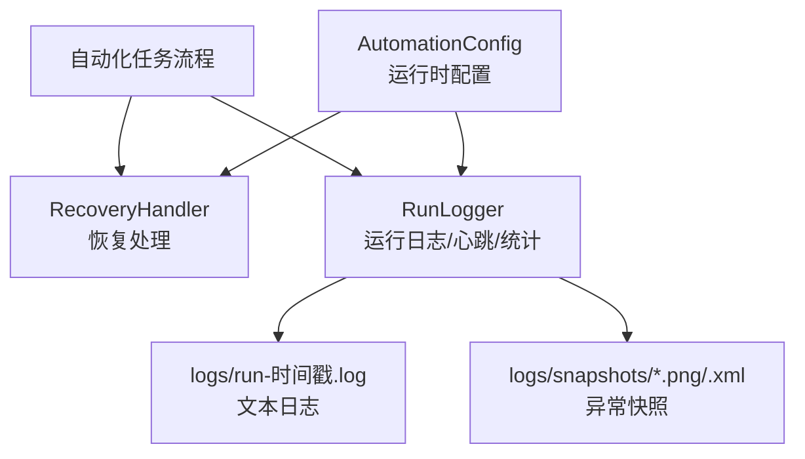
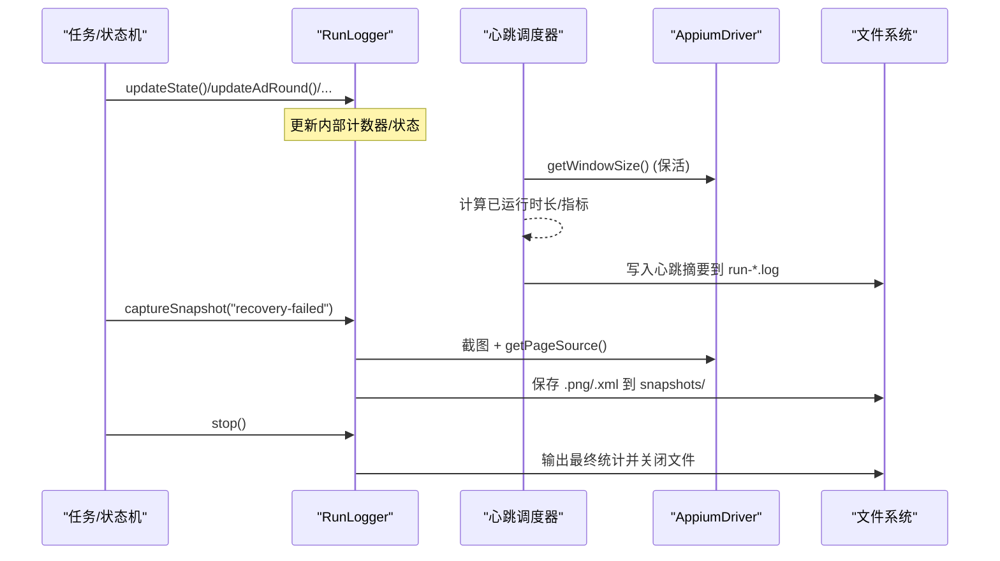
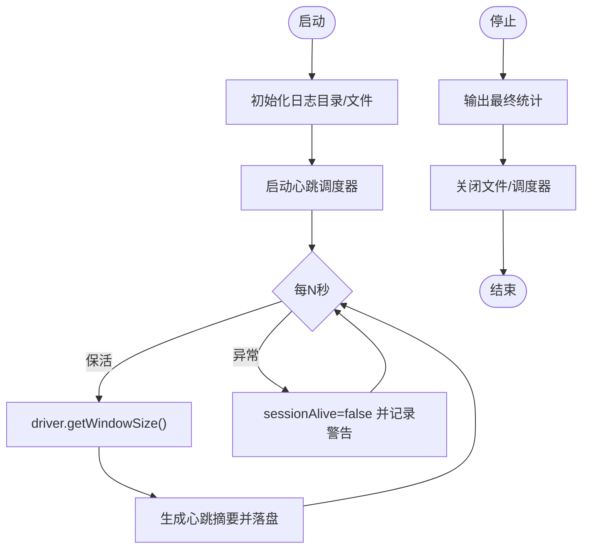
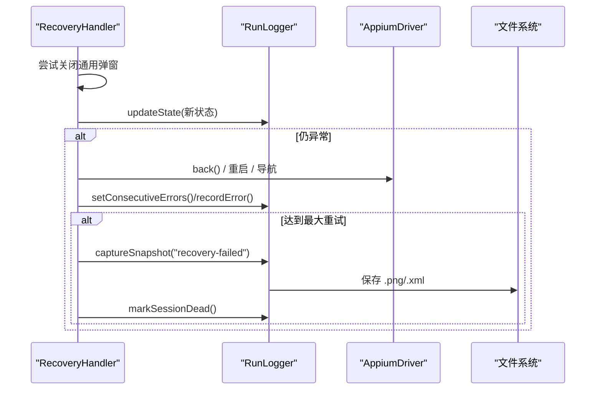
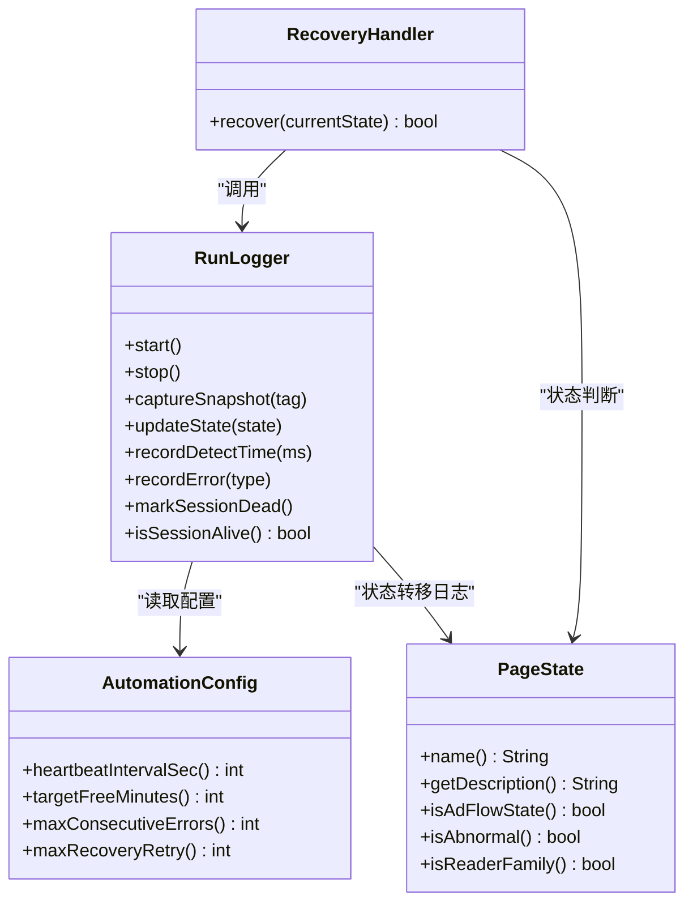

# 运行日志

<cite>
**本文引用的文件**
- [RunLogger.java](file://automation/src/main/java/com/fanqie/auto/core/RunLogger.java)
- [AutomationConfig.java](file://automation/src/main/java/com/fanqie/auto/config/AutomationConfig.java)
- [PageState.java](file://automation/src/main/java/com/fanqie/auto/core/PageState.java)
- [RecoveryHandler.java](file://automation/src/main/java/com/fanqie/auto/task/RecoveryHandler.java)
- [RunLoggerTest.java](file://automation/src/test/java/com/fanqie/auto/core/RunLoggerTest.java)
</cite>

## 目录
1. [简介](#简介)
2. [项目结构](#项目结构)
3. [核心组件](#核心组件)
4. [架构总览](#架构总览)
5. [详细组件分析](#详细组件分析)
6. [依赖关系分析](#依赖关系分析)
7. [性能与异步写入](#性能与异步写入)
8. [故障诊断与可观测性](#故障诊断与可观测性)
9. [结论](#结论)
10. [附录：配置项与最佳实践](#附录配置项与最佳实践)

## 简介
本模块提供自动化任务运行期的“可观测性”能力，围绕以下目标实现：
- 统一的运行日志记录与结构化统计输出
- 运行状态跟踪（页面状态转移、广告轮次、累计时长、翻页数等）
- 关键指标采集（状态识别耗时、XML体积、连续错误计数等）
- 异常现场取证（截图 + XML快照落盘）
- 会话保活心跳机制，避免长静默导致连接断开
- 日志文件组织与命名规范，便于归档与分析

## 项目结构
日志相关代码集中在 automation 模块的 core 包中，并通过 config 包提供运行时参数；task 包中的恢复处理器在异常路径下调用日志器进行取证与状态更新。

图表来源
- [RunLogger.java:94-130](file://automation/src/main/java/com/fanqie/auto/core/RunLogger.java#L94-L130)
- [RecoveryHandler.java:246-252](file://automation/src/main/java/com/fanqie/auto/task/RecoveryHandler.java#L246-L252)

章节来源
- [RunLogger.java:94-130](file://automation/src/main/java/com/fanqie/auto/core/RunLogger.java#L94-L130)
- [AutomationConfig.java:210-212](file://automation/src/main/java/com/fanqie/auto/config/AutomationConfig.java#L210-L212)

## 核心组件
- RunLogger：负责日志落盘、心跳保活、状态统计、快照取证、最终统计汇总
- AutomationConfig：集中管理所有超时、阈值、轮次、心跳间隔等配置
- PageState：页面状态枚举，驱动状态机并用于日志可读性
- RecoveryHandler：异常恢复流程，调用 RunLogger 进行状态更新与取证

章节来源
- [RunLogger.java:31-86](file://automation/src/main/java/com/fanqie/auto/core/RunLogger.java#L31-L86)
- [AutomationConfig.java:18-17](file://automation/src/main/java/com/fanqie/auto/config/AutomationConfig.java#L18-L17)
- [PageState.java:11-96](file://automation/src/main/java/com/fanqie/auto/core/PageState.java#L11-L96)
- [RecoveryHandler.java:23-43](file://automation/src/main/java/com/fanqie/auto/task/RecoveryHandler.java#L23-L43)

## 架构总览
运行期通过 RunLogger 维护一个独立的心跳调度线程，周期性执行轻量 Appium 命令以维持会话活跃，同时输出当前运行摘要。业务逻辑或状态机通过 RunLogger 提供的 API 更新状态与指标；当出现异常或需要恢复时，RecoveryHandler 会调用 RunLogger 进行截图与 XML 快照落盘，并在极端失败时标记会话断开。

图表来源
- [RunLogger.java:150-197](file://automation/src/main/java/com/fanqie/auto/core/RunLogger.java#L150-L197)
- [RunLogger.java:239-261](file://automation/src/main/java/com/fanqie/auto/core/RunLogger.java#L239-L261)
- [RunLogger.java:284-345](file://automation/src/main/java/com/fanqie/auto/core/RunLogger.java#L284-L345)

## 详细组件分析

### RunLogger：运行日志与心跳保活
- 职责
  - 创建并管理日志目录与日志文件（UTF-8），文件名包含时间戳
  - 启动独立 daemon 线程的心跳调度器，按配置周期执行保活与摘要输出
  - 暴露状态与指标更新接口（状态转移、广告轮次、累计时长、翻页数、错误计数、检测耗时等）
  - 异常/恢复时截取屏幕与 UI 树（XML）并保存到 snapshots 目录
  - 停止时输出结构化统计并安全关闭资源
- 关键设计
  - 心跳任务内捕获所有异常，确保调度线程不被杀死
  - sessionAlive 标志用于标识会话是否存活，刷新 driver 时复位
  - XML 体积超过阈值时输出预警，提示可能的 UI 树泄漏
  - stop() 幂等，防止重复关闭造成异常

图表来源
- [RunLogger.java:94-130](file://automation/src/main/java/com/fanqie/auto/core/RunLogger.java#L94-L130)
- [RunLogger.java:150-197](file://automation/src/main/java/com/fanqie/auto/core/RunLogger.java#L150-L197)
- [RunLogger.java:284-345](file://automation/src/main/java/com/fanqie/auto/core/RunLogger.java#L284-L345)

章节来源
- [RunLogger.java:31-86](file://automation/src/main/java/com/fanqie/auto/core/RunLogger.java#L31-L86)
- [RunLogger.java:150-197](file://automation/src/main/java/com/fanqie/auto/core/RunLogger.java#L150-L197)
- [RunLogger.java:239-261](file://automation/src/main/java/com/fanqie/auto/core/RunLogger.java#L239-L261)
- [RunLogger.java:284-345](file://automation/src/main/java/com/fanqie/auto/core/RunLogger.java#L284-L345)

### RecoveryHandler：异常恢复与日志联动
- 五级恢复策略：弹窗关闭 → back 逐级返回 → 重启应用 → 导航书架 → 重建 session
- 每次恢复步骤均调用 RunLogger 更新状态、记录错误分布、必要时拍摄快照
- 当所有恢复手段失败时，记录错误类型、保存现场并标记会话断开

图表来源
- [RecoveryHandler.java:100-253](file://automation/src/main/java/com/fanqie/auto/task/RecoveryHandler.java#L100-L253)
- [RunLogger.java:239-261](file://automation/src/main/java/com/fanqie/auto/core/RunLogger.java#L239-L261)

章节来源
- [RecoveryHandler.java:23-43](file://automation/src/main/java/com/fanqie/auto/task/RecoveryHandler.java#L23-L43)
- [RecoveryHandler.java:100-253](file://automation/src/main/java/com/fanqie/auto/task/RecoveryHandler.java#L100-L253)

### PageState：状态机与日志可读性
- 定义页面状态及中文描述，便于日志可读
- 提供 isAdFlowState/isAbnormal/isReaderFamily 等方法，统一语义判断
- RunLogger 在状态转移时输出“旧状态 -> 新状态（描述）”，便于追踪

章节来源
- [PageState.java:11-96](file://automation/src/main/java/com/fanqie/auto/core/PageState.java#L11-L96)
- [RunLogger.java:204-211](file://automation/src/main/java/com/fanqie/auto/core/RunLogger.java#L204-L211)

### 配置项：心跳间隔与流程阈值
- heartbeatIntervalSec：心跳间隔（秒），默认 30
- maxAdRoundsPerEntry/targetFreeMinutes/maxTotalAdRounds：广告轮次与目标时长
- maxWallClockMs：墙钟熔断保护
- maxConsecutiveErrors/maxRecoveryRetry：恢复重试上限
- 其他时序与阅读页翻页策略参数

章节来源
- [AutomationConfig.java:180-260](file://automation/src/main/java/com/fanqie/auto/config/AutomationConfig.java#L180-L260)

## 依赖关系分析
- RunLogger 依赖 AutomationConfig 获取心跳间隔、目标时长等参数
- RecoveryHandler 依赖 RunLogger 进行状态更新、错误统计与快照落盘
- PageState 被 RunLogger 与 RecoveryHandler 共同使用，保证状态语义一致
- 测试用例验证 RunLogger 的关键行为（会话存活标志、快照短路逻辑）

图表来源
- [RunLogger.java:150-197](file://automation/src/main/java/com/fanqie/auto/core/RunLogger.java#L150-L197)
- [RecoveryHandler.java:100-253](file://automation/src/main/java/com/fanqie/auto/task/RecoveryHandler.java#L100-L253)
- [PageState.java:11-96](file://automation/src/main/java/com/fanqie/auto/core/PageState.java#L11-L96)
- [AutomationConfig.java:210-260](file://automation/src/main/java/com/fanqie/auto/config/AutomationConfig.java#L210-L260)

章节来源
- [RunLogger.java:150-197](file://automation/src/main/java/com/fanqie/auto/core/RunLogger.java#L150-L197)
- [RecoveryHandler.java:100-253](file://automation/src/main/java/com/fanqie/auto/task/RecoveryHandler.java#L100-L253)
- [PageState.java:11-96](file://automation/src/main/java/com/fanqie/auto/core/PageState.java#L11-L96)
- [AutomationConfig.java:210-260](file://automation/src/main/java/com/fanqie/auto/config/AutomationConfig.java#L210-L260)

## 性能与异步写入
- 心跳调度：使用单线程 ScheduledExecutorService 定期执行轻量命令，避免阻塞主流程
- 日志写入：当前 writeLine 同步写入控制台与文件；如需更高吞吐，可在上层引入缓冲队列与后台写线程（例如基于 BlockingQueue 的异步生产者-消费者模型），但需权衡数据丢失风险与一致性要求
- 快照落盘：仅在异常/恢复路径触发，避免高频 I/O 影响性能
- 指标采集：原子变量与并发容器（AtomicInteger/AtomicLong/ConcurrentHashMap）保证高并发下的正确性与低开销

优化建议
- 若日志量极大，可考虑将 writeLine 改为异步写入（带背压与丢弃策略）
- 对 snapshot 写入增加大小限制与清理策略，避免磁盘占用过高
- 心跳间隔可根据设备性能与网络状况动态调整

[本节为通用性能讨论，不直接分析具体文件]

## 故障诊断与可观测性
- 关键指标
  - 已运行时长、当前状态、本轮视频进度、累计免广告时长、翻页数、连续错误数、getPageSource 耗时、XML 体积
  - 状态识别次数与平均耗时
  - 异常分布统计（按错误类型聚合）
- 告警与预警
  - XML 体积超过阈值时输出预警，提示可能存在 UI 树泄漏
  - 心跳保活失败时记录警告并标记会话断开
- 现场取证
  - 异常/恢复时自动保存截图与 XML 快照到 snapshots 目录，便于回溯
- 诊断流程
  - 查看 run-*.log 的心跳摘要与状态转移
  - 检查 snapshots 目录下的最新快照定位问题
  - 根据异常分布统计定位高频错误类型

章节来源
- [RunLogger.java:174-192](file://automation/src/main/java/com/fanqie/auto/core/RunLogger.java#L174-L192)
- [RunLogger.java:239-261](file://automation/src/main/java/com/fanqie/auto/core/RunLogger.java#L239-L261)
- [RunLogger.java:312-345](file://automation/src/main/java/com/fanqie/auto/core/RunLogger.java#L312-L345)
- [RecoveryHandler.java:246-252](file://automation/src/main/java/com/fanqie/auto/task/RecoveryHandler.java#L246-L252)

## 结论
该运行日志模块通过 RunLogger 实现了“心跳保活 + 状态跟踪 + 指标采集 + 异常取证”的一体化能力，结合 RecoveryHandler 的五级恢复策略，显著提升了自动化任务的鲁棒性与可观测性。日志文件组织清晰、命名规范，便于归档与分析。后续可按需引入异步写入与更丰富的监控指标，进一步提升性能与可观测性。

[本节为总结性内容，不直接分析具体文件]

## 附录：配置项与最佳实践

### 配置项速览
- timing.heartbeat.interval.sec：心跳间隔（秒），默认 30
- flow.max.ad.rounds.per.entry：单次进入的最大广告轮次
- flow.target.free.minutes：目标免广告时长（分钟）
- flow.max.total.ad.rounds：总广告轮次上限
- flow.max.wall.clock.ms：墙钟熔断保护（毫秒）
- flow.max.consecutive.errors：最大连续错误数
- flow.max.recovery.retry：最大恢复重试次数
- reader.turn.strategy：翻页策略（tap/swipe）
- verify.page.turned.by.screenshot：是否通过截图验证翻页

章节来源
- [AutomationConfig.java:180-260](file://automation/src/main/java/com/fanqie/auto/config/AutomationConfig.java#L180-L260)

### 日志级别管理与输出控制
- 当前实现未提供 DEBUG/INFO/WARN/ERROR 分级开关；日志主要通过结构化摘要与预警信息表达
- 建议在日志行前缀区分阶段（如 [心跳]、[状态转移]、[快照]、[预警]），便于过滤与分析
- 可通过外部日志框架（如 SLF4J）集成不同级别，但需注意与现有 writeLine 的协调

[本节为通用指导，不直接分析具体文件]

### 日志文件组织结构与命名规范
- 文本日志：automation/logs/run-YYYYMMDD-HHMMSS.log
- 快照目录：automation/logs/snapshots/，文件命名格式：YYYYMMDD-HHMMSS_tag.png/.xml
- 目录自动创建，写入编码 UTF-8

章节来源
- [RunLogger.java:94-130](file://automation/src/main/java/com/fanqie/auto/core/RunLogger.java#L94-L130)
- [RunLogger.java:239-261](file://automation/src/main/java/com/fanqie/auto/core/RunLogger.java#L239-L261)

### 异步写入与缓冲策略（建议）
- 引入生产者-消费者模型：业务线程将日志消息入队，后台写线程批量落盘
- 设置队列容量与拒绝策略（丢弃最旧/最新或阻塞等待）
- 定期 flush 与压缩归档，避免磁盘压力
- 注意异常路径仍需立即落盘关键快照

[本节为通用指导，不直接分析具体文件]

### 日志分析与故障诊断最佳实践
- 优先查看心跳摘要，确认运行时长、状态、指标趋势
- 关注 XML 体积预警，排查 UI 树泄漏
- 结合 snapshots 目录的最新快照定位界面异常
- 根据异常分布统计定位高频错误类型，针对性修复

章节来源
- [RunLogger.java:174-192](file://automation/src/main/java/com/fanqie/auto/core/RunLogger.java#L174-L192)
- [RunLogger.java:312-345](file://automation/src/main/java/com/fanqie/auto/core/RunLogger.java#L312-L345)