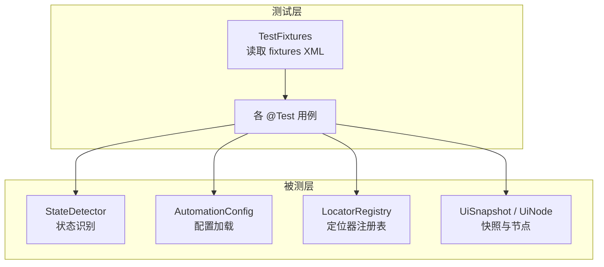
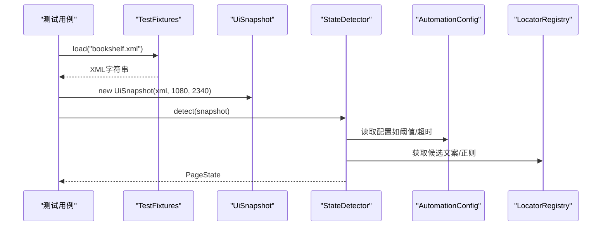
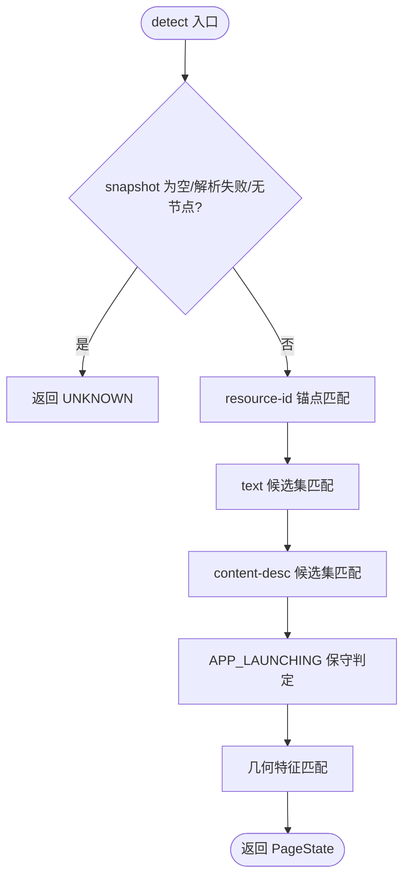
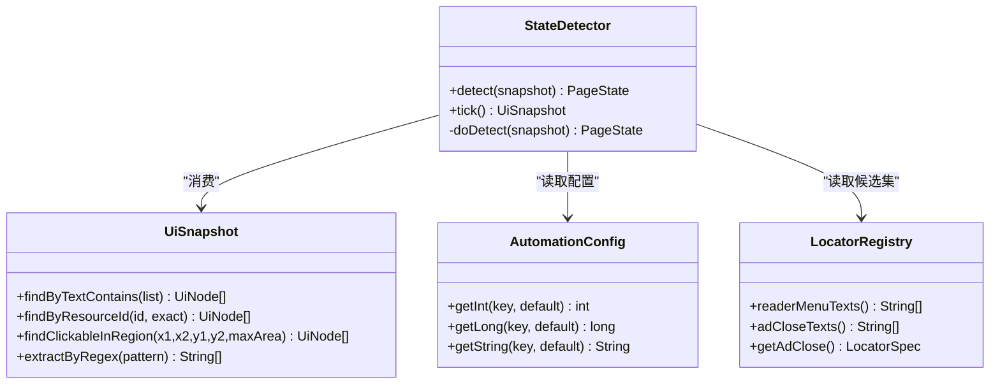

# 单元测试设计

<cite>
**本文引用的文件**
- [pom.xml](file://automation/pom.xml)
- [TestFixtures.java](file://automation/src/test/java/com/fanqie/auto/TestFixtures.java)
- [StateDetector.java](file://automation/src/main/java/com/fanqie/auto/core/StateDetector.java)
- [StateDetectorTest.java](file://automation/src/test/java/com/fanqie/auto/core/StateDetectorTest.java)
- [AutomationConfig.java](file://automation/src/main/java/com/fanqie/auto/config/AutomationConfig.java)
- [LocatorRegistry.java](file://automation/src/main/java/com/fanqie/auto/config/LocatorRegistry.java)
- [ConfigTest.java](file://automation/src/test/java/com/fanqie/auto/config/ConfigTest.java)
- [DriverRegistryTest.java](file://automation/src/test/java/com/fanqie/auto/core/DriverRegistryTest.java)
- [BasePageTest.java](file://automation/src/test/java/com/fanqie/auto/page/BasePageTest.java)
- [AdFlowPageTest.java](file://automation/src/test/java/com/fanqie/auto/page/AdFlowPageTest.java)
- [UiSnapshotTest.java](file://automation/src/test/java/com/fanqie/auto/core/UiSnapshotTest.java)
- [AdWatchStateMachineTest.java](file://automation/src/test/java/com/fanqie/auto/task/AdWatchStateMachineTest.java)
</cite>

## 目录
1. [简介](#简介)
2. [项目结构](#项目结构)
3. [核心组件](#核心组件)
4. [架构总览](#架构总览)
5. [详细组件分析](#详细组件分析)
6. [依赖关系分析](#依赖关系分析)
7. [性能考量](#性能考量)
8. [故障排查指南](#故障排查指南)
9. [结论](#结论)
10. [附录：新组件单元测试编写指南](#附录新组件单元测试编写指南)

## 简介
本设计文档面向自动化测试工程，系统化阐述单元测试的架构与实现方式。重点覆盖：
- 测试类的设计原则与组织结构
- 如何对 StateDetector、Config 等核心组件进行高质量离线测试
- Mock 策略与外部依赖模拟（设备交互）
- 具体测试用例示例与断言最佳实践
- 覆盖率要求与持续集成建议
- 为新组件编写单元测试的指导

本项目采用 JUnit 5 + Maven Surefire 运行纯离线测试：通过 fixtures XML 回放 UI 树，避免连接真机或启动 Appium session，确保测试稳定、快速、可重复。

## 项目结构
测试代码位于 automation 模块下：
- 源码：src/main/java 包含核心业务逻辑（StateDetector、Config、LocatorRegistry、页面与任务类等）
- 测试：src/test/java 对应包路径组织测试类
- 夹具：src/test/resources/fixtures 存放录制的 UI 树 XML，作为离线回放数据源
- 构建：pom.xml 配置 JUnit 5、Surefire、UTF-8 编码与依赖版本矩阵

图表来源
- [TestFixtures.java:18-51](file://automation/src/test/java/com/fanqie/auto/TestFixtures.java#L18-L51)
- [StateDetectorTest.java:35-50](file://automation/src/test/java/com/fanqie/auto/core/StateDetectorTest.java#L35-L50)
- [ConfigTest.java:35-81](file://automation/src/test/java/com/fanqie/auto/config/ConfigTest.java#L35-L81)
- [UiSnapshotTest.java:30-48](file://automation/src/test/java/com/fanqie/auto/core/UiSnapshotTest.java#L30-L48)

章节来源
- [pom.xml:15-83](file://automation/pom.xml#L15-L83)
- [pom.xml:100-125](file://automation/pom.xml#L100-L125)

## 核心组件
- TestFixtures：统一从 classpath 的 fixtures 目录以 UTF-8 读取 XML，提供屏幕尺寸常量，保证中文匹配正确性
- StateDetector：基于 UiSnapshot 的纯内存状态识别，按优先级匹配 resource-id、text、content-desc、几何特征等
- AutomationConfig：集中管理所有配置键与默认值，支持外部配置文件覆盖
- LocatorRegistry：维护各逻辑控件的定位策略与候选文案集，控制是否允许几何兜底
- UiSnapshot/UiNode：解析并封装 UI 树，提供文本、ID、描述、区域点击等查询 API

章节来源
- [TestFixtures.java:18-51](file://automation/src/test/java/com/fanqie/auto/TestFixtures.java#L18-L51)
- [StateDetector.java:12-28](file://automation/src/main/java/com/fanqie/auto/core/StateDetector.java#L12-L28)
- [AutomationConfig.java:10-17](file://automation/src/main/java/com/fanqie/auto/config/AutomationConfig.java#L10-L17)
- [LocatorRegistry.java:16-25](file://automation/src/main/java/com/fanqie/auto/config/LocatorRegistry.java#L16-L25)
- [UiSnapshotTest.java:18-27](file://automation/src/test/java/com/fanqie/auto/core/UiSnapshotTest.java#L18-L27)

## 架构总览
测试围绕“离线回放”展开：测试类构造被测对象时注入 null 依赖（driver/logger/gestures），仅使用纯内存能力；通过 TestFixtures 加载 fixture XML 构造 UiSnapshot，再调用被测方法验证结果。

图表来源
- [StateDetectorTest.java:35-50](file://automation/src/test/java/com/fanqie/auto/core/StateDetectorTest.java#L35-L50)
- [StateDetector.java:152-170](file://automation/src/main/java/com/fanqie/auto/core/StateDetector.java#L152-L170)
- [AutomationConfig.java:176-248](file://automation/src/main/java/com/fanqie/auto/config/AutomationConfig.java#L176-L248)
- [LocatorRegistry.java:95-137](file://automation/src/main/java/com/fanqie/auto/config/LocatorRegistry.java#L95-L137)

## 详细组件分析

### StateDetector 测试
- 设计要点
  - 构造 StateDetector 时 driver 传 null，因为 detect() 是纯内存判定，不引用 driver
  - 使用 fixtures XML 构造 UiSnapshot，断言 detect() 返回正确的 PageState
  - 覆盖多分支：书架/阅读页/菜单/开屏广告/视频播放/关闭按钮/启动中/畸形快照等
- 关键断言
  - 资源 ID 锚点优先（书架/阅读页）
  - text 候选集命中（含 SPLASH_AD 排他条件）
  - content-desc 语义优先于几何
  - APP_LAUNCHING 保守判定
  - 几何兜底（右上角小 clickable）
  - 异常输入（null/空/畸形）返回 UNKNOWN

图表来源
- [StateDetector.java:152-208](file://automation/src/main/java/com/fanqie/auto/core/StateDetector.java#L152-L208)

章节来源
- [StateDetectorTest.java:35-152](file://automation/src/test/java/com/fanqie/auto/core/StateDetectorTest.java#L35-L152)
- [StateDetector.java:183-418](file://automation/src/main/java/com/fanqie/auto/core/StateDetector.java#L183-L418)

### Config 测试
- 设计要点
  - 验证 AutomationConfig 从 classpath 加载默认值（driverType/rewardFallbackMinutes/maxWallClockMs 等）
  - 缺失键使用内置默认值，不抛异常
  - 外部路径覆盖 classpath 默认值，非法值回退默认
  - LocatorRegistry 候选集加载且中文无乱码（UTF-8 Reader）
  - LocatorSpec 的 allowGeometryFallback 约束（adWatch/adContinue=false，adClose=true）
- 关键断言
  - 新增键的正确默认值
  - 外部覆盖与非法值回退
  - 未知键返回空列表
  - boundsHint 与几何兜底标志符合预期

章节来源
- [ConfigTest.java:35-131](file://automation/src/test/java/com/fanqie/auto/config/ConfigTest.java#L35-L131)
- [AutomationConfig.java:25-63](file://automation/src/main/java/com/fanqie/auto/config/AutomationConfig.java#L25-L63)
- [LocatorRegistry.java:52-81](file://automation/src/main/java/com/fanqie/auto/config/LocatorRegistry.java#L52-L81)

### DriverRegistry 测试
- 设计要点
  - 使用内部实现的 DriverAware 替身记录 refreshDriver 调用次数与入参
  - 验证 refreshAll 后每个已注册组件恰好收到一次刷新回调
  - 单个组件抛异常不影响其余组件（隔离）
  - register(null) 安全忽略，重复注册去重
- 关键断言
  - 一致性：每个组件被通知一次
  - 透传：传入的 driver 引用被正确传递
  - 健壮性：空注册表、异常隔离、重复注册

章节来源
- [DriverRegistryTest.java:25-141](file://automation/src/test/java/com/fanqie/auto/core/DriverRegistryTest.java#L25-L141)

### BasePage 测试
- 设计要点
  - 验证 L1 语义匹配 + boundsHint 裁决（resolve）
  - 验证 L2 结构化几何推断（resolveByGeometry）
  - 误点防护：allowGeometryFallback=false 的控件即使存在右上角 clickable 也绝不返回命中
- 关键断言
  - adWatch 禁用几何兜底
  - adClose 允许几何兜底并命中右上角关闭按钮
  - 多个命中时按 boundsHint 裁决（右上角/底部）
  - 未命中或 null/畸形快照返回 empty

章节来源
- [BasePageTest.java:36-125](file://automation/src/test/java/com/fanqie/auto/page/BasePageTest.java#L36-L125)

### AdFlowPage 测试
- 设计要点
  - readGainedMinutes 只依赖 snapshot + locators.getRewardRegex()，可离线测试
  - 验证奖励弹窗提取分钟数、无奖励语义返回 0、null/畸形快照返回 0
- 关键断言
  - 奖励语义命中（“获得30分钟”）
  - 非奖励语义（“剩余90分钟”）不高估
  - 无数字或畸形 XML 返回 0

章节来源
- [AdFlowPageTest.java:30-79](file://automation/src/test/java/com/fanqie/auto/page/AdFlowPageTest.java#L30-L79)

### UiSnapshot 测试
- 设计要点
  - 用 fixtures XML 回放，验证纯内存查询 API
  - 覆盖 findByTextContains、findByResourceId、findByContentDescContains、findClickableInRegion、nearestClickableAncestor、extractByRegex
  - 畸形 XML 不抛异常，isParseFailed=true，size=0
- 关键断言
  - 正常解析成功、不可变 nodes 列表
  - 区域点击过滤（右上角小面积 clickable）
  - 正则提取奖励模式

章节来源
- [UiSnapshotTest.java:30-197](file://automation/src/test/java/com/fanqie/auto/core/UiSnapshotTest.java#L30-L197)

### AdWatchStateMachine 测试
- 设计要点
  - 构造函数不解引用依赖，可用全 null 依赖离线构造
  - 验证进度计数 setter/getter、usedBooks 集合、配额耗尽识别上下文约束
  - 持久化时效与编码：当天 usedBooks 恢复、跨天清空、旧文件兼容
- 关键断言
  - 初始状态干净
  - resetProgress 清空所有状态
  - 配额耗尽文案命中且上下文满足时才判为耗尽
  - usedBooks 持久化解码与日期校验

章节来源
- [AdWatchStateMachineTest.java:55-241](file://automation/src/test/java/com/fanqie/auto/task/AdWatchStateMachineTest.java#L55-L241)

## 依赖关系分析
- 测试与生产代码解耦：测试通过 TestFixtures 提供固定输入，避免真实设备依赖
- 配置与定位器分离：AutomationConfig 提供运行时参数，LocatorRegistry 提供匹配规则，便于独立验证
- 状态识别与页面操作分离：StateDetector 负责识别，BasePage/AdFlowPage 负责定位与操作，测试分别覆盖各自职责

图表来源
- [StateDetector.java:152-208](file://automation/src/main/java/com/fanqie/auto/core/StateDetector.java#L152-L208)
- [UiSnapshotTest.java:80-197](file://automation/src/test/java/com/fanqie/auto/core/UiSnapshotTest.java#L80-L197)
- [AutomationConfig.java:67-108](file://automation/src/main/java/com/fanqie/auto/config/AutomationConfig.java#L67-L108)
- [LocatorRegistry.java:95-148](file://automation/src/main/java/com/fanqie/auto/config/LocatorRegistry.java#L95-L148)

章节来源
- [pom.xml:50-83](file://automation/pom.xml#L50-L83)

## 性能考量
- 离线测试零 I/O 阻塞：fixture XML 在内存中解析，避免网络/设备延迟
- 状态识别 O(1) 级缓存：StateDetector 同一 tick 内复用快照，减少重复抓取
- 屏幕尺寸缓存：避免每 tick 都发 getSize() RPC（测试中通过固定分辨率规避）
- 推荐指标
  - 单用例执行时间 < 50ms
  - 全量测试 < 10s
  - 覆盖率目标：核心类行覆盖率 ≥ 80%，分支覆盖率 ≥ 70%

[本节为通用指导，无需特定文件来源]

## 故障排查指南
- 中文乱码问题
  - 现象：text 匹配全部失效
  - 原因：Properties.load(InputStream) 默认 ISO-88-9-1 解码
  - 解决：使用 InputStreamReader(inputStream, StandardCharsets.UTF_8) 配合 Properties.load(Reader)
  - 参考：LocatorRegistry 与 TestFixtures 均显式使用 UTF-8
- 畸形 XML 处理
  - 现象：解析失败导致后续查询异常
  - 解决：UiSnapshot.isParseFailed=true，size=0，上层应返回 UNKNOWN 或 empty
  - 参考：UiSnapshotTest 覆盖畸形 XML 场景
- 几何兜底误点
  - 现象：误点浪费每日配额
  - 解决：adWatch/adContinue 的 allowGeometryFallback=false，禁止几何兜底
  - 参考：LocatorRegistry 构建 adWatch/adContinue 时设置 false

章节来源
- [LocatorRegistry.java:67-81](file://automation/src/main/java/com/fanqie/auto/config/LocatorRegistry.java#L67-L81)
- [UiSnapshotTest.java:50-57](file://automation/src/test/java/com/fanqie/auto/core/UiSnapshotTest.java#L50-L57)
- [BasePageTest.java:51-60](file://automation/src/test/java/com/fanqie/auto/page/BasePageTest.java#L51-L60)

## 结论
本项目采用“离线回放 + 纯内存判定”的测试策略，通过 fixtures XML 与 TestFixtures 工具，实现对 StateDetector、Config、LocatorRegistry、页面与状态机等核心组件的高质量单元测试。测试设计遵循以下原则：
- 零外部依赖：driver/logger/gestures 传 null，避免设备与网络影响
- 确定性输入：fixtures 固定 UI 树，保证用例可重复
- 分层验证：状态识别、定位策略、页面操作分别测试
- 健壮性覆盖：null/空/畸形输入、非法配置值、几何兜底误点防护

[本节为总结，无需特定文件来源]

## 附录：新组件单元测试编写指南
- 设计原则
  - 可测性：将易变依赖抽象为接口或可注入字段，便于测试时替换为 null 或替身
  - 纯函数优先：尽量将计算逻辑与 I/O 分离，便于离线验证
  - 夹具驱动：使用 fixtures XML 提供稳定输入，避免随机性
- 组织结构
  - 测试类与被测类同包路径，便于访问包私有成员（如需）
  - 每个测试方法一个 @DisplayName，清晰描述断言意图
  - 使用 @BeforeAll/@BeforeEach 初始化共享对象，@AfterEach 清理临时资源
- Mock 策略
  - 轻量替身：内部实现简单接口记录调用事实（如 DriverRegistryTest 中的 RecordingAware）
  - 避免重型框架：本项目无需 Mockito，通过 null 与替身即可覆盖大部分场景
- 断言最佳实践
  - 明确前置条件：在断言前验证快照确实存在期望特征（如右上角 clickable）
  - 精确断言：使用 assertEquals/assertNotEquals 断言具体值，避免模糊判断
  - 边界覆盖：null、空、畸形、非法值、极端比例等
- 覆盖率要求
  - 行覆盖率 ≥ 80%，分支覆盖率 ≥ 70%
  - 关键路径必须覆盖：状态识别优先级、配置默认值与覆盖、几何兜底开关
- 示例步骤
  - 准备 fixtures XML 到 src/test/resources/fixtures
  - 使用 TestFixtures.load(name) 读取 XML
  - 构造 UiSnapshot 并调用被测方法
  - 断言返回值与副作用（如日志、计数器）

[本节为通用指导，无需特定文件来源]