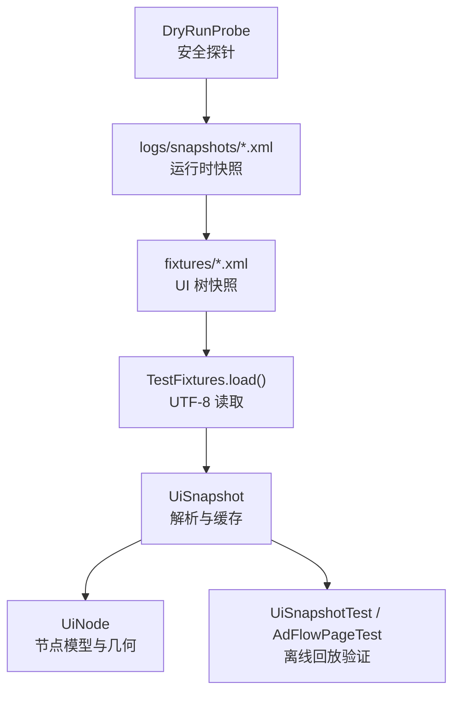
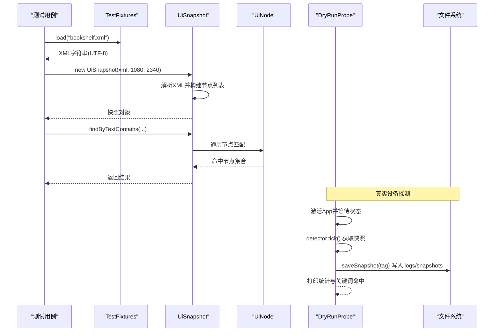
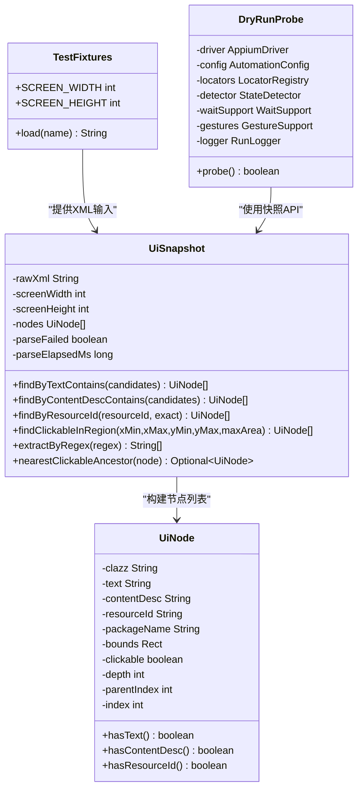

# 测试数据管理

<cite>
**本文引用的文件**
- [pom.xml](file://automation/pom.xml)
- [TestFixtures.java](file://automation/src/test/java/com/fanqie/auto/TestFixtures.java)
- [UiSnapshot.java](file://automation/src/main/java/com/fanqie/auto/core/UiSnapshot.java)
- [UiNode.java](file://automation/src/main/java/com/fanqie/auto/core/UiNode.java)
- [DryRunProbe.java](file://automation/src/main/java/com/fanqie/auto/DryRunProbe.java)
- [UiSnapshotTest.java](file://automation/src/test/java/com/fanqie/auto/core/UiSnapshotTest.java)
- [AdFlowPageTest.java](file://automation/src/test/java/com/fanqie/auto/page/AdFlowPageTest.java)
- [bookshelf.xml](file://automation/src/test/resources/fixtures/bookshelf.xml)
- [reader.xml](file://automation/src/test/resources/fixtures/reader.xml)
- [ad_close_by_desc.xml](file://automation/src/test/resources/fixtures/ad_close_by_desc.xml)
- [splash_ad.xml](file://automation/src/test/resources/fixtures/splash_ad.xml)
</cite>

## 目录
1. [简介](#简介)
2. [项目结构](#项目结构)
3. [核心组件](#核心组件)
4. [架构总览](#架构总览)
5. [详细组件分析](#详细组件分析)
6. [依赖关系分析](#依赖关系分析)
7. [性能考量](#性能考量)
8. [故障排查指南](#故障排查指南)
9. [结论](#结论)
10. [附录](#附录)

## 简介
本文件面向“番茄免费小说 UI 自动化”项目的测试数据管理，聚焦 fixtures 目录下的 XML 测试数据与配套工具链。文档说明：
- fixtures 下 XML 的命名规范、分类方式与组织策略
- 不同类型测试场景的数据准备方法（书架页、阅读页、广告流程等）
- 测试数据的版本管理与维护策略（如何更新与同步）
- 测试数据的复用与组合使用方式
- 测试数据生成工具与自动化脚本使用方法（DryRunProbe）
- 测试数据质量检查与验证的最佳实践

## 项目结构
测试数据位于 test 资源目录的 fixtures 子目录中，由统一的夹具加载器读取，供离线单元测试回放。核心路径与职责如下：
- automation/src/test/resources/fixtures：存放录制的 UI 树 XML，作为各用例的输入数据
- automation/src/test/java/com/fanqie/auto/TestFixtures.java：统一从 classpath 的 fixtures/ 读取 XML，强制 UTF-8 编码，提供屏幕尺寸常量
- automation/src/main/java/com/fanqie/auto/core/UiSnapshot.java：解析 XML 为内存快照，提供文本、描述、resource-id、区域几何等查询 API
- automation/src/main/java/com/fanqie/auto/core/UiNode.java：节点不可变模型，包含 bounds 解析与几何计算
- automation/src/main/java/com/fanqie/auto/DryRunProbe.java：安全探针，连接 Appium 抓取真实 UI 快照并落盘，用于校准定位策略与补充 fixture
- automation/src/test/java/**：基于 fixtures 的离线单元测试，覆盖解析、匹配、几何筛选、正则提取等能力

图表来源
- [TestFixtures.java:27-51](file://automation/src/test/java/com/fanqie/auto/TestFixtures.java#L27-L51)
- [UiSnapshot.java:21-35](file://automation/src/main/java/com/fanqie/auto/core/UiSnapshot.java#L21-L35)
- [UiNode.java:3-12](file://automation/src/main/java/com/fanqie/auto/core/UiNode.java#L3-L12)
- [DryRunProbe.java:26-40](file://automation/src/main/java/com/fanqie/auto/DryRunProbe.java#L26-L40)

章节来源
- [pom.xml:15-28](file://automation/pom.xml#L15-L28)
- [TestFixtures.java:18-52](file://automation/src/test/java/com/fanqie/auto/TestFixtures.java#L18-L52)

## 核心组件
- 夹具加载器 TestFixtures：集中管理 fixtures 目录的读取，确保 UTF-8 编码与统一屏幕分辨率常量，避免平台默认编码导致的中文匹配失败
- 快照解析 UiSnapshot：将一次 getPageSource() 的 XML 解析为内存快照，提供多种查询 API（文本包含、content-desc 包含、resource-id 精确/包含、区域可点击节点查找、正则提取、最近可点击祖先回溯）
- 节点模型 UiNode：封装节点属性与 Rect 几何计算，支持 areaRatio、centerInRegion、containsRatio 等，支撑 L2/L3 几何兜底策略
- 安全探针 DryRunProbe：在真实设备上执行无害操作，抓取书架页、阅读页及翻页后快照，输出统计与关键词命中，辅助定位策略校准与 fixture 补充

章节来源
- [TestFixtures.java:20-51](file://automation/src/test/java/com/fanqie/auto/TestFixtures.java#L20-L51)
- [UiSnapshot.java:21-35](file://automation/src/main/java/com/fanqie/auto/core/UiSnapshot.java#L21-L35)
- [UiNode.java:3-12](file://automation/src/main/java/com/fanqie/auto/core/UiNode.java#L3-L12)
- [DryRunProbe.java:26-40](file://automation/src/main/java/com/fanqie/auto/DryRunProbe.java#L26-L40)

## 架构总览
测试数据在离线回放与真实设备探测两条路径中协同工作：
- 离线回放：TestFixtures 读取 fixtures XML → UiSnapshot 解析 → 测试用例断言行为正确性
- 真实探测：DryRunProbe 启动 App → 抓取 UI 快照 → 保存至 logs/snapshots → 产出统计与关键词命中 → 指导 locators 配置与 fixture 补充

图表来源
- [TestFixtures.java:27-51](file://automation/src/test/java/com/fanqie/auto/TestFixtures.java#L27-L51)
- [UiSnapshot.java:52-98](file://automation/src/main/java/com/fanqie/auto/core/UiSnapshot.java#L52-L98)
- [UiNode.java:109-152](file://automation/src/main/java/com/fanqie/auto/core/UiNode.java#L109-L152)
- [DryRunProbe.java:91-197](file://automation/src/main/java/com/fanqie/auto/DryRunProbe.java#L91-L197)

## 详细组件分析

### 测试数据组织与命名规范
- 目录位置：automation/src/test/resources/fixtures
- 命名约定：以业务场景或控件特征为中心，采用小写下划线分隔，如 bookshelf.xml、reader.xml、ad_close_by_desc.xml、splash_ad.xml 等
- 分类方式：
  - 页面级：bookshelf.xml（书架）、reader.xml（阅读页）
  - 广告流程：ad_close_by_desc.xml（按 content-desc 关闭）、ad_video_playing.xml（视频播放）、splash_ad.xml（开屏广告）
  - 奖励与配额：reward_granted.xml、reward_remaining_only.xml、daily_quota.xml、daily_quota_no_button.xml
  - 菜单与交互：reader_menu.xml、reader_menu_text_only.xml、nested_clickable.xml、two_shelf_tabs.xml
  - 边界与异常：malformed.xml（畸形 XML）、menu_text_no_large_area.xml、skip_text_no_large_area.xml

章节来源
- [bookshelf.xml:1-11](file://automation/src/test/resources/fixtures/bookshelf.xml#L1-L11)
- [reader.xml:1-7](file://automation/src/test/resources/fixtures/reader.xml#L1-L7)
- [ad_close_by_desc.xml:1-6](file://automation/src/test/resources/fixtures/ad_close_by_desc.xml#L1-L6)
- [splash_ad.xml:1-8](file://automation/src/test/resources/fixtures/splash_ad.xml#L1-L8)

### 数据准备方法与场景覆盖
- 书架页场景：通过 bookshelf.xml 模拟书架 Tab、书籍条目与 recycler，验证 text/resource-id 匹配与区域选择逻辑
- 阅读页场景：通过 reader.xml 模拟正文与章节标题，验证无 clickable 时的 nearestClickableAncestor 回溯
- 广告关闭场景：通过 ad_close_by_desc.xml 与 ad_close_ready.xml 验证右上角小面积 clickable 节点的几何筛选
- 开屏广告场景：通过 splash_ad.xml 验证全屏大面积节点与右下角跳过按钮的定位差异
- 奖励提取场景：通过 reward_granted.xml、reward_gained_direct.xml、reward_remaining_only.xml 验证正则提取与语义判断

章节来源
- [UiSnapshotTest.java:80-151](file://automation/src/test/java/com/fanqie/auto/core/UiSnapshotTest.java#L80-L151)
- [AdFlowPageTest.java:43-79](file://automation/src/test/java/com/fanqie/auto/page/AdFlowPageTest.java#L43-L79)

### 版本管理与维护策略
- 基线化：每个 fixture 代表一个稳定的 UI 快照，应纳入版本控制；新增或变更需提交 commit 并附带用例覆盖
- 同步机制：当 App 界面变化导致定位失效时，优先使用 DryRunProbe 抓取最新快照，替换或新增对应 fixture
- 回滚策略：若某次更新引入回归，可通过 git 回退到上一个稳定版本的 fixture，并修复相关用例
- 环境一致性：所有 fixture 基于统一屏幕分辨率（1080x2340），避免跨设备坐标差异导致误判

章节来源
- [TestFixtures.java:20-22](file://automation/src/test/java/com/fanqie/auto/TestFixtures.java#L20-L22)
- [DryRunProbe.java:269-277](file://automation/src/main/java/com/fanqie/auto/DryRunProbe.java#L269-L277)

### 复用与组合使用方式
- 单 fixture 复用：多个测试用例可共享同一 fixture，例如 reader.xml 同时用于解析与正则提取测试
- 组合校验：结合多个 fixture 覆盖不同分支，如 reward_granted.xml 与 reward_remaining_only.xml 分别验证奖励语义与非奖励语义
- 几何与语义组合：先用 text/content-desc/resource-id 进行 L1 匹配，再使用 findClickableInRegion 进行 L2 几何兜底，最后结合时序与状态机进行 L3 恢复

章节来源
- [UiSnapshotTest.java:80-197](file://automation/src/test/java/com/fanqie/auto/core/UiSnapshotTest.java#L80-L197)
- [AdFlowPageTest.java:43-79](file://automation/src/test/java/com/fanqie/auto/page/AdFlowPageTest.java#L43-L79)

### 测试数据生成工具与自动化脚本
- DryRunProbe 安全探针：
  - 功能：连接 Appium，启动 App，在书架页与阅读页抓取 UI 快照，输出节点统计与关键词命中，并将快照保存至 logs/snapshots
  - 约束：仅执行无害操作（切 Tab、点开书籍），绝不点击广告/观看视频/领取时长按钮
  - 输出：控制台统计、关键词节点详情、结论建议，以及时间戳命名的 XML 快照文件
- 运行方式：通过 Maven exec 插件或直接运行主类入口，触发 probe() 流程

章节来源
- [DryRunProbe.java:26-40](file://automation/src/main/java/com/fanqie/auto/DryRunProbe.java#L26-L40)
- [DryRunProbe.java:91-197](file://automation/src/main/java/com/fanqie/auto/DryRunProbe.java#L91-L197)
- [pom.xml:127-135](file://automation/pom.xml#L127-L135)

### 质量检查与验证最佳实践
- 编码一致性：确保 fixtures 与读取端均使用 UTF-8，避免中文乱码导致匹配失败
- 健壮性验证：对 malformed.xml 等畸形输入，UiSnapshot 应不抛异常，标记 parseFailed 并返回空节点表
- 不可变性保障：nodes() 返回不可变列表，防止外部修改破坏快照一致性
- 几何筛选验证：使用 findClickableInRegion 验证右上角小面积 clickable 节点，排除全屏容器与大块区域
- 正则提取验证：使用 extractByRegex 验证“N分钟”等模式匹配，确保奖励语义正确识别
- 祖先回溯验证：nearestClickableAncestor 应能沿 parentIndex 回溯至最近可点击祖先，处理嵌套不可点击节点

章节来源
- [UiSnapshotTest.java:37-78](file://automation/src/test/java/com/fanqie/auto/core/UiSnapshotTest.java#L37-L78)
- [UiSnapshotTest.java:135-183](file://automation/src/test/java/com/fanqie/auto/core/UiSnapshotTest.java#L135-L183)
- [UiSnapshot.java:61-72](file://automation/src/main/java/com/fanqie/auto/core/UiSnapshot.java#L61-L72)
- [UiNode.java:109-152](file://automation/src/main/java/com/fanqie/auto/core/UiNode.java#L109-L152)

## 依赖关系分析
- TestFixtures 依赖 Java I/O 与 StandardCharsets，负责 fixtures 目录的 UTF-8 读取
- UiSnapshot 依赖 JDK DOM 解析器，解析 XML 并构建 UiNode 列表，提供查询 API
- UiNode 提供 Rect 几何计算，被 UiSnapshot 与上层状态检测/手势操作使用
- DryRunProbe 依赖 AutomationConfig、LocatorRegistry、StateDetector、WaitSupport、GestureSupport、RunLogger，协调真实设备探测流程
- 测试用例依赖 TestFixtures 与 UiSnapshot，进行离线回放验证

图表来源
- [TestFixtures.java:18-52](file://automation/src/test/java/com/fanqie/auto/TestFixtures.java#L18-L52)
- [UiSnapshot.java:36-284](file://automation/src/main/java/com/fanqie/auto/core/UiSnapshot.java#L36-L284)
- [UiNode.java:13-218](file://automation/src/main/java/com/fanqie/auto/core/UiNode.java#L13-L218)
- [DryRunProbe.java:41-79](file://automation/src/main/java/com/fanqie/auto/DryRunProbe.java#L41-L79)

章节来源
- [UiSnapshot.java:21-35](file://automation/src/main/java/com/fanqie/auto/core/UiSnapshot.java#L21-L35)
- [UiNode.java:3-12](file://automation/src/main/java/com/fanqie/auto/core/UiNode.java#L3-L12)
- [DryRunProbe.java:26-40](file://automation/src/main/java/com/fanqie/auto/DryRunProbe.java#L26-L40)

## 性能考量
- 解析性能：UiSnapshot 使用 JDK 内置 DocumentBuilderFactory 解析一次 XML，深度优先遍历构建节点列表，后续查询均为纯内存操作，零 RPC
- 缓存复用：同一 tick 内快照缓存复用，杜绝重复抓取，提升状态识别速度
- 健壮性：XML 可能畸形/截断，解析失败时返回空快照并标记 parseFailed，避免中断流程
- 几何计算：Rect.areaRatio 与 centerInRegion 提供高效比例判定，减少浮点误差与越界风险

章节来源
- [UiSnapshot.java:21-35](file://automation/src/main/java/com/fanqie/auto/core/UiSnapshot.java#L21-L35)
- [UiSnapshot.java:61-72](file://automation/src/main/java/com/fanqie/auto/core/UiSnapshot.java#L61-L72)
- [UiNode.java:165-197](file://automation/src/main/java/com/fanqie/auto/core/UiNode.java#L165-L197)

## 故障排查指南
- 中文乱码：确保 TestFixtures 使用 UTF-8 读取 fixtures，避免平台默认编码（如 Windows GBK）导致 text 匹配失败
- 解析失败：若 XML 畸形/截断，UiSnapshot 会标记 parseFailed 并返回空节点表，需检查 fixture 完整性或使用 DryRunProbe 重新抓取
- 定位失效：使用 DryRunProbe 输出关键词节点与统计信息，校准 locators.properties 中的 resource-id 与文案候选集
- 几何误判：检查 bounds 格式与 areaRatio 阈值，确保右上角关闭按钮等小面积节点被正确筛选

章节来源
- [TestFixtures.java:27-51](file://automation/src/test/java/com/fanqie/auto/TestFixtures.java#L27-L51)
- [UiSnapshot.java:61-72](file://automation/src/main/java/com/fanqie/auto/core/UiSnapshot.java#L61-L72)
- [DryRunProbe.java:283-372](file://automation/src/main/java/com/fanqie/auto/DryRunProbe.java#L283-L372)

## 结论
本项目通过 fixtures XML 与配套工具链实现了稳定、可复用的测试数据管理。TestFixtures 保证数据读取一致性与编码安全，UiSnapshot 提供高性能内存查询 API，DryRunProbe 支持真实设备探测与数据补充。结合严格的命名规范、版本管理与质量验证实践，可有效提升 UI 自动化的鲁棒性与可维护性。

## 附录
- 推荐实践：
  - 每次 App 界面变更后，优先运行 DryRunProbe 并更新对应 fixture
  - 为新场景新增 fixture 时，同步补充离线用例覆盖
  - 定期清理过期 fixture，保持目录整洁
  - 使用 Git 提交记录关联 fixture 变更与用例改进
- 参考路径：
  - fixtures 目录：automation/src/test/resources/fixtures
  - 夹具加载器：TestFixtures.java
  - 快照解析：UiSnapshot.java
  - 节点模型：UiNode.java
  - 安全探针：DryRunProbe.java