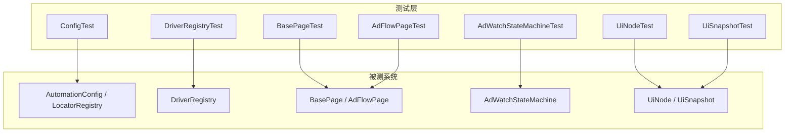
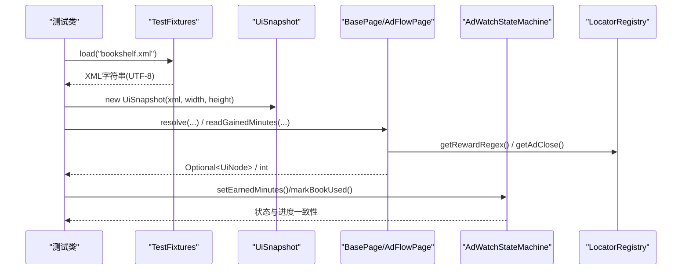
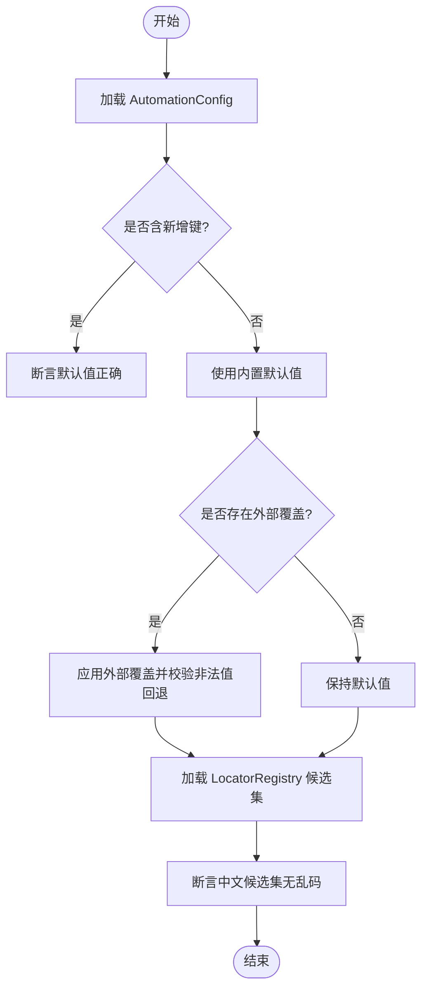
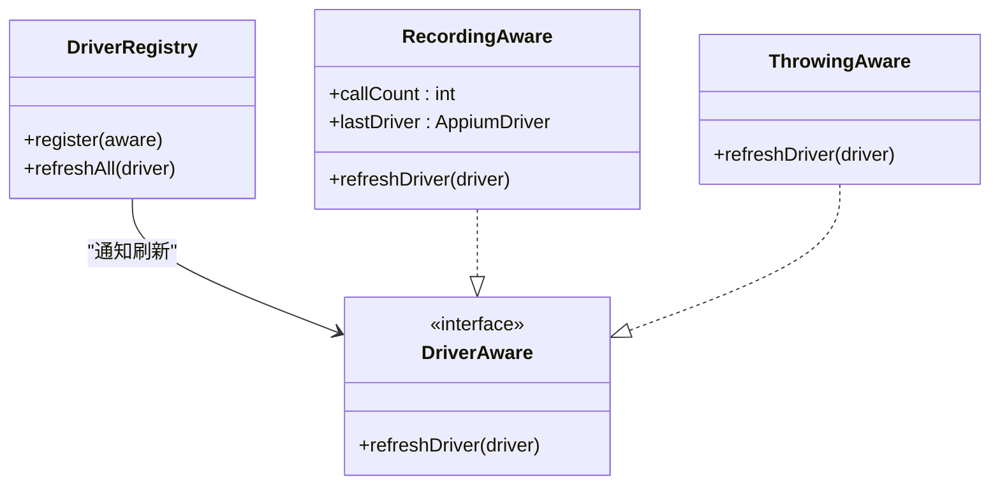
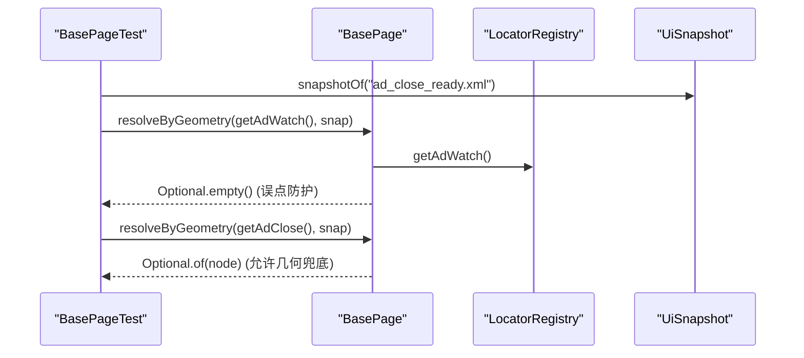
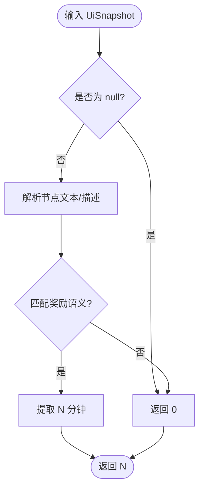
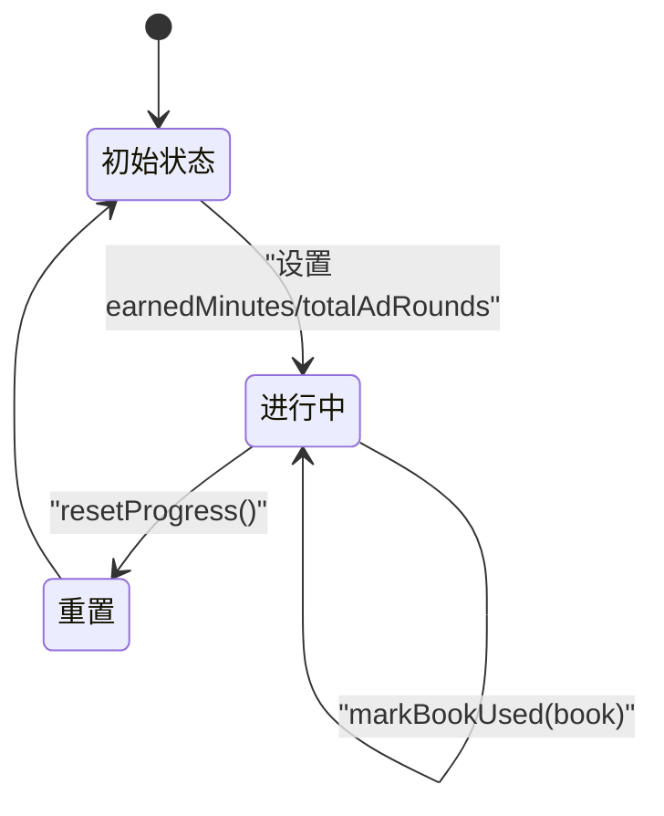
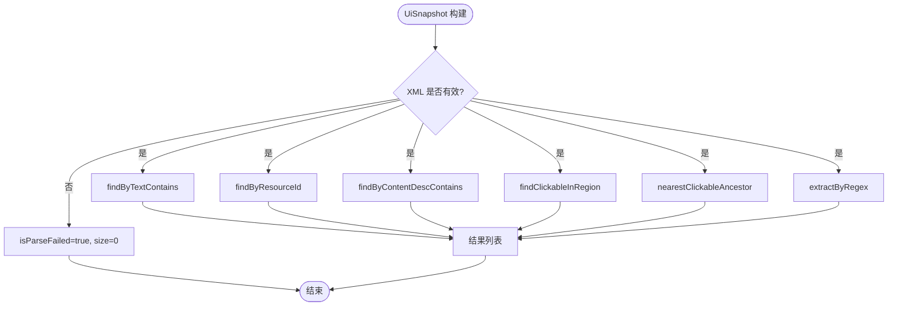
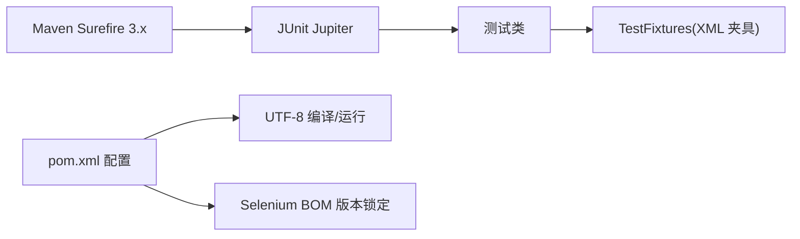

# 测试最佳实践

<cite>
**本文引用的文件**
- [automation/src/test/java/com/fanqie/auto/TestFixtures.java](file://automation/src/test/java/com/fanqie/auto/TestFixtures.java)
- [automation/src/test/java/com/fanqie/auto/config/ConfigTest.java](file://automation/src/test/java/com/fanqie/auto/config/ConfigTest.java)
- [automation/src/test/java/com/fanqie/auto/core/DriverRegistryTest.java](file://automation/src/test/java/com/fanqie/auto/core/DriverRegistryTest.java)
- [automation/src/test/java/com/fanqie/auto/page/BasePageTest.java](file://automation/src/test/java/com/fanqie/auto/page/BasePageTest.java)
- [automation/src/test/java/com/fanqie/auto/page/AdFlowPageTest.java](file://automation/src/test/java/com/fanqie/auto/page/AdFlowPageTest.java)
- [automation/src/test/java/com/fanqie/auto/task/AdWatchStateMachineTest.java](file://automation/src/test/java/com/fanqie/auto/task/AdWatchStateMachineTest.java)
- [automation/src/test/java/com/fanqie/auto/core/UiNodeTest.java](file://automation/src/test/java/com/fanqie/auto/core/UiNodeTest.java)
- [automation/src/test/java/com/fanqie/auto/core/UiSnapshotTest.java](file://automation/src/test/java/com/fanqie/auto/core/UiSnapshotTest.java)
- [automation/pom.xml](file://automation/pom.xml)
</cite>

## 目录
1. [简介](#简介)
2. [项目结构](#项目结构)
3. [核心组件](#核心组件)
4. [架构总览](#架构总览)
5. [详细组件分析](#详细组件分析)
6. [依赖关系分析](#依赖关系分析)
7. [性能与并发注意事项](#性能与并发注意事项)
8. [故障排查指南](#故障排查指南)
9. [结论](#结论)
10. [附录：命名约定与代码风格清单](#附录：命名约定与代码风格清单)

## 简介
本文件基于自动化工程中的单元测试实践，总结可复用的测试规范与最佳实践。重点覆盖：
- 测试用例命名与断言风格
- 高可读性测试的编写方法
- 测试隔离与数据清理策略
- 性能测试与并发测试的注意事项
- 测试调试与问题定位
- 测试重构与优化原则
- 常见陷阱与解决方案

本项目采用 JUnit 5（Jupiter）进行离线回放测试，通过固定 XML 快照与轻量替身对象验证 UI 自动化核心逻辑，不连接真机、不启动 Appium session，确保测试稳定、快速、可重复。

## 项目结构
测试位于 automation 模块的 src/test 下，按功能域组织：
- config：配置加载与定位候选集校验
- core：UI 节点、快照解析与几何计算等纯内存逻辑
- page：页面级定位与解析流程（L1/L2 降级链）
- task：状态机与进度持久化等复杂业务逻辑
- fixtures：XML 快照资源，供各测试复用

图表来源
- [automation/src/test/java/com/fanqie/auto/config/ConfigTest.java:1-133](file://automation/src/test/java/com/fanqie/auto/config/ConfigTest.java#L1-L133)
- [automation/src/test/java/com/fanqie/auto/core/DriverRegistryTest.java:1-143](file://automation/src/test/java/com/fanqie/auto/core/DriverRegistryTest.java#L1-L143)
- [automation/src/test/java/com/fanqie/auto/page/BasePageTest.java:1-127](file://automation/src/test/java/com/fanqie/auto/page/BasePageTest.java#L1-L127)
- [automation/src/test/java/com/fanqie/auto/page/AdFlowPageTest.java:1-81](file://automation/src/test/java/com/fanqie/auto/page/AdFlowPageTest.java#L1-L81)
- [automation/src/test/java/com/fanqie/auto/task/AdWatchStateMachineTest.java:1-242](file://automation/src/test/java/com/fanqie/auto/task/AdWatchStateMachineTest.java#L1-L242)
- [automation/src/test/java/com/fanqie/auto/core/UiNodeTest.java:1-165](file://automation/src/test/java/com/fanqie/auto/core/UiNodeTest.java#L1-L165)
- [automation/src/test/java/com/fanqie/auto/core/UiSnapshotTest.java:1-199](file://automation/src/test/java/com/fanqie/auto/core/UiSnapshotTest.java#L1-L199)

章节来源
- [automation/pom.xml:15-28](file://automation/pom.xml#L15-L28)
- [automation/pom.xml:70-83](file://automation/pom.xml#L70-L83)

## 核心组件
- 测试夹具与资源加载：统一从 classpath 读取 UTF-8 编码的 XML 快照，避免平台默认编码导致的乱码问题。
- 配置与定位器测试：验证默认值、外部覆盖、非法值回退以及中文候选集加载正确性。
- 驱动注册表测试：验证批量刷新回调的一致性、异常隔离、去重与空注册表安全。
- 页面定位测试：覆盖语义匹配与几何兜底的两级降级链，强调误点防护与区域裁决。
- 奖励提取测试：基于正则与语义约束，避免对“剩余”文案的高估。
- 状态机测试：覆盖进度计数、配额耗尽判定、usedBooks 持久化时效与编码恢复。
- 节点与快照测试：覆盖边界输入、畸形数据、不可变集合、区域查询与祖先回溯。

章节来源
- [automation/src/test/java/com/fanqie/auto/TestFixtures.java:9-51](file://automation/src/test/java/com/fanqie/auto/TestFixtures.java#L9-L51)
- [automation/src/test/java/com/fanqie/auto/config/ConfigTest.java:18-131](file://automation/src/test/java/com/fanqie/auto/config/ConfigTest.java#L18-L131)
- [automation/src/test/java/com/fanqie/auto/core/DriverRegistryTest.java:14-141](file://automation/src/test/java/com/fanqie/auto/core/DriverRegistryTest.java#L14-L141)
- [automation/src/test/java/com/fanqie/auto/page/BasePageTest.java:18-125](file://automation/src/test/java/com/fanqie/auto/page/BasePageTest.java#L18-L125)
- [automation/src/test/java/com/fanqie/auto/page/AdFlowPageTest.java:13-79](file://automation/src/test/java/com/fanqie/auto/page/AdFlowPageTest.java#L13-L79)
- [automation/src/test/java/com/fanqie/auto/task/AdWatchStateMachineTest.java:27-241](file://automation/src/test/java/com/fanqie/auto/task/AdWatchStateMachineTest.java#L27-L241)
- [automation/src/test/java/com/fanqie/auto/core/UiNodeTest.java:12-163](file://automation/src/test/java/com/fanqie/auto/core/UiNodeTest.java#L12-L163)
- [automation/src/test/java/com/fanqie/auto/core/UiSnapshotTest.java:18-197](file://automation/src/test/java/com/fanqie/auto/core/UiSnapshotTest.java#L18-L197)

## 架构总览
测试以“离线回放 + 轻量替身”的方式解耦真实设备与运行时环境，形成稳定的回归保障。

图表来源
- [automation/src/test/java/com/fanqie/auto/TestFixtures.java:27-51](file://automation/src/test/java/com/fanqie/auto/TestFixtures.java#L27-L51)
- [automation/src/test/java/com/fanqie/auto/page/BasePageTest.java:44-125](file://automation/src/test/java/com/fanqie/auto/page/BasePageTest.java#L44-L125)
- [automation/src/test/java/com/fanqie/auto/page/AdFlowPageTest.java:38-79](file://automation/src/test/java/com/fanqie/auto/page/AdFlowPageTest.java#L38-L79)
- [automation/src/test/java/com/fanqie/auto/task/AdWatchStateMachineTest.java:55-241](file://automation/src/test/java/com/fanqie/auto/task/AdWatchStateMachineTest.java#L55-L241)

## 详细组件分析

### 配置与定位器测试（ConfigTest）
- 验证 classpath 默认值、外部覆盖、非法值回退与缺失文件安全。
- 校验中文候选集加载无乱码，且关键键位（如 adClose/adWatch/adContinue）的 allowGeometryFallback 标志符合预期。
- 使用 @TempDir 管理临时配置文件，避免污染全局环境。

图表来源
- [automation/src/test/java/com/fanqie/auto/config/ConfigTest.java:35-131](file://automation/src/test/java/com/fanqie/auto/config/ConfigTest.java#L35-L131)

章节来源
- [automation/src/test/java/com/fanqie/auto/config/ConfigTest.java:35-131](file://automation/src/test/java/com/fanqie/auto/config/ConfigTest.java#L35-L131)

### 驱动注册表测试（DriverRegistryTest）
- 验证 refreshAll 对每个已注册组件恰好调用一次回调，传递新 driver 引用。
- 支持 register(null) 安全忽略、重复实例去重、单个组件异常不影响其余组件。
- 通过手写替身 RecordingAware/ThrowingAware 记录调用事实，无需真实设备。

图表来源
- [automation/src/test/java/com/fanqie/auto/core/DriverRegistryTest.java:25-141](file://automation/src/test/java/com/fanqie/auto/core/DriverRegistryTest.java#L25-L141)

章节来源
- [automation/src/test/java/com/fanqie/auto/core/DriverRegistryTest.java:45-141](file://automation/src/test/java/com/fanqie/auto/core/DriverRegistryTest.java#L45-L141)

### 页面定位测试（BasePageTest）
- 覆盖 L1 语义匹配与 boundsHint 裁决，以及 L2 结构化几何推断。
- 强调误点防护：adWatch 禁用几何兜底，即使右上角存在 clickable 也不命中。
- 通过 null 依赖构造 BasePage，仅做内存计算，保证离线可测。

图表来源
- [automation/src/test/java/com/fanqie/auto/page/BasePageTest.java:51-78](file://automation/src/test/java/com/fanqie/auto/page/BasePageTest.java#L51-L78)
- [automation/src/test/java/com/fanqie/auto/page/BasePageTest.java:82-125](file://automation/src/test/java/com/fanqie/auto/page/BasePageTest.java#L82-L125)

章节来源
- [automation/src/test/java/com/fanqie/auto/page/BasePageTest.java:36-125](file://automation/src/test/java/com/fanqie/auto/page/BasePageTest.java#L36-L125)

### 奖励提取测试（AdFlowPageTest）
- 基于正则与语义约束提取奖励分钟数，避免将“剩余N分钟”误判为奖励。
- 对 null 与畸形快照返回 0，不抛异常。

图表来源
- [automation/src/test/java/com/fanqie/auto/page/AdFlowPageTest.java:43-79](file://automation/src/test/java/com/fanqie/auto/page/AdFlowPageTest.java#L43-L79)

章节来源
- [automation/src/test/java/com/fanqie/auto/page/AdFlowPageTest.java:30-79](file://automation/src/test/java/com/fanqie/auto/page/AdFlowPageTest.java#L30-L79)

### 状态机测试（AdWatchStateMachineTest）
- 覆盖进度计数器一致性、usedBooks 持久化时效与编码恢复、配额耗尽上下文约束。
- 通过 @TempDir 隔离日志目录，避免跨测试污染；@BeforeEach/@AfterEach 管理系统属性。

图表来源
- [automation/src/test/java/com/fanqie/auto/task/AdWatchStateMachineTest.java:83-128](file://automation/src/test/java/com/fanqie/auto/task/AdWatchStateMachineTest.java#L83-L128)

章节来源
- [automation/src/test/java/com/fanqie/auto/task/AdWatchStateMachineTest.java:55-241](file://automation/src/test/java/com/fanqie/auto/task/AdWatchStateMachineTest.java#L55-L241)

### 节点与快照测试（UiNodeTest、UiSnapshotTest）
- 覆盖 Rect.parse 合法/畸形输入、几何计算、区域判定、equals/hashCode。
- 覆盖 UiSnapshot 解析失败、不可变列表、多种查询 API（文本/资源ID/content-desc/区域点击/正则提取）。

图表来源
- [automation/src/test/java/com/fanqie/auto/core/UiNodeTest.java:25-163](file://automation/src/test/java/com/fanqie/auto/core/UiNodeTest.java#L25-L163)
- [automation/src/test/java/com/fanqie/auto/core/UiSnapshotTest.java:37-197](file://automation/src/test/java/com/fanqie/auto/core/UiSnapshotTest.java#L37-L197)

章节来源
- [automation/src/test/java/com/fanqie/auto/core/UiNodeTest.java:25-163](file://automation/src/test/java/com/fanqie/auto/core/UiNodeTest.java#L25-L163)
- [automation/src/test/java/com/fanqie/auto/core/UiSnapshotTest.java:37-197](file://automation/src/test/java/com/fanqie/auto/core/UiSnapshotTest.java#L37-L197)

## 依赖关系分析
- 测试框架：JUnit 5（Jupiter），由 Maven Surefire 3.x 执行。
- 运行环境：Java 11，UTF-8 编码强制，避免 Windows GBK 导致的中文字符串乱码。
- 依赖锁定：通过 Selenium BOM 锁定版本，避免传递依赖升级引发兼容性问题。
- 测试范围：所有测试均为 test scope，不进入 fat-jar 或主程序运行时。

图表来源
- [automation/pom.xml:15-28](file://automation/pom.xml#L15-L28)
- [automation/pom.xml:30-48](file://automation/pom.xml#L30-L48)
- [automation/pom.xml:70-83](file://automation/pom.xml#L70-L83)
- [automation/pom.xml:100-125](file://automation/pom.xml#L100-L125)

章节来源
- [automation/pom.xml:15-28](file://automation/pom.xml#L15-L28)
- [automation/pom.xml:30-48](file://automation/pom.xml#L30-L48)
- [automation/pom.xml:70-83](file://automation/pom.xml#L70-L83)
- [automation/pom.xml:100-125](file://automation/pom.xml#L100-L125)

## 性能与并发注意事项
- 测试性能
  - 优先选择离线回放测试（fixture XML + 内存计算），避免启动 Appium 或连接设备带来的开销。
  - 使用小粒度测试方法，每个方法只验证一个行为，便于并行执行与快速失败。
  - 控制 fixture 大小与复杂度，必要时拆分快照，减少解析与遍历成本。
- 并发测试
  - 当前测试未显式并发执行；若引入并发，需确保共享状态隔离（如使用 @TempDir 隔离文件、避免静态可变状态）。
  - 对于线程安全的组件（如注册表刷新），应补充并发场景下的断言（例如多任务同时刷新时的回调次数与异常隔离）。
- 资源占用
  - 避免在测试中创建大对象或长时间运行的 I/O；如需文件操作，限定在临时目录并在 @AfterEach 清理。
  - 注意字符编码与资源加载路径，避免因平台差异导致额外重试或失败。

[本节为通用指导，不直接分析具体文件]

## 故障排查指南
- 中文乱码
  - 确认测试夹具以 UTF-8 读取；若出现 text 匹配全部失效，检查读取编码与编译器/运行期编码设置。
  - 参考：统一使用 UTF-8 Reader 加载 fixtures。
- 配置加载异常
  - 外部配置文件缺失时不应抛异常，应保留 classpath 默认值；非法值应回退到内置默认。
  - 参考：外部覆盖与非法值回退的断言。
- 定位失败
  - 检查 allowGeometryFallback 标志是否正确；误点防护关闭时应避免几何兜底。
  - 检查 boundsHint 区域与截图坐标是否一致。
- 状态机进度不一致
  - 检查 usedBooks 持久化文件的日期字段与编码；非当天或旧格式应保守清空。
  - 参考：loadProgress 与 markBookUsed 的行为断言。
- 快照解析失败
  - 畸形 XML 应标记 parseFailed 且 nodes 为空；查询 API 应对 null/空输入安全返回。
  - 参考：UiSnapshot 的解析失败与空输入处理。

章节来源
- [automation/src/test/java/com/fanqie/auto/TestFixtures.java:27-51](file://automation/src/test/java/com/fanqie/auto/TestFixtures.java#L27-L51)
- [automation/src/test/java/com/fanqie/auto/config/ConfigTest.java:59-81](file://automation/src/test/java/com/fanqie/auto/config/ConfigTest.java#L59-L81)
- [automation/src/test/java/com/fanqie/auto/page/BasePageTest.java:51-78](file://automation/src/test/java/com/fanqie/auto/page/BasePageTest.java#L51-L78)
- [automation/src/test/java/com/fanqie/auto/task/AdWatchStateMachineTest.java:201-232](file://automation/src/test/java/com/fanqie/auto/task/AdWatchStateMachineTest.java#L201-L232)
- [automation/src/test/java/com/fanqie/auto/core/UiSnapshotTest.java:50-69](file://automation/src/test/java/com/fanqie/auto/core/UiSnapshotTest.java#L50-L69)

## 结论
本项目通过离线回放与轻量替身实现了高稳定性、高可维护性的测试体系。其核心经验包括：
- 以夹具与纯内存计算为主，避免对外部环境的强依赖
- 严格的数据隔离与清理策略，确保测试间互不影响
- 明确的命名与断言风格，提升可读性与可诊断性
- 针对误点防护、编码、版本锁定等关键风险点的专项覆盖
- 通过分层测试（单元/页面/状态机）逐步逼近真实业务逻辑

这些实践可作为同类 UI 自动化项目的参考模板。

[本节为总结性内容，不直接分析具体文件]

## 附录：命名约定与代码风格清单
- 测试类与方法命名
  - 类名以被测组件名结尾（如 ConfigTest、DriverRegistryTest）
  - 方法名采用动词短语描述行为（如 loadsClasspathValues、refreshAll_notifiesEveryRegisteredAware）
  - 使用 @DisplayName 提供人类可读的描述，便于报告阅读
- 断言风格
  - 使用 JUnit 5 提供的 assert* 方法，配合有意义的消息
  - 对边界与异常路径明确断言（如 isEmpty、notPresent、doesNotThrow）
- 测试数据与夹具
  - 统一通过 TestFixtures 加载 UTF-8 编码的 XML 快照
  - 使用 @TempDir 管理临时文件，避免污染全局环境
- 隔离与清理
  - 使用 @BeforeEach/@AfterEach 初始化与清理系统属性、临时目录
  - 避免静态可变状态；必要时在每个测试内重建被测对象
- 可读性
  - 每个测试只验证一个职责；必要时拆分为多个方法
  - 通过组合公开 API 间接覆盖私有逻辑，避免脆弱反射
- 性能与并发
  - 优先离线测试；如需并发，确保共享状态隔离与幂等性
  - 控制 fixture 规模，避免过大 XML 影响解析速度
- 常见问题与解决
  - 中文乱码：统一 UTF-8 编码（编译与运行）
  - 配置缺失/非法：断言回退默认值与不抛异常
  - 误点防护：校验 allowGeometryFallback 与 boundsHint 区域
  - 进度持久化：校验日期与编码，确保跨天与旧格式安全

章节来源
- [automation/src/test/java/com/fanqie/auto/config/ConfigTest.java:35-131](file://automation/src/test/java/com/fanqie/auto/config/ConfigTest.java#L35-L131)
- [automation/src/test/java/com/fanqie/auto/core/DriverRegistryTest.java:45-141](file://automation/src/test/java/com/fanqie/auto/core/DriverRegistryTest.java#L45-L141)
- [automation/src/test/java/com/fanqie/auto/page/BasePageTest.java:36-125](file://automation/src/test/java/com/fanqie/auto/page/BasePageTest.java#L36-L125)
- [automation/src/test/java/com/fanqie/auto/page/AdFlowPageTest.java:30-79](file://automation/src/test/java/com/fanqie/auto/page/AdFlowPageTest.java#L30-L79)
- [automation/src/test/java/com/fanqie/auto/task/AdWatchStateMachineTest.java:55-241](file://automation/src/test/java/com/fanqie/auto/task/AdWatchStateMachineTest.java#L55-L241)
- [automation/src/test/java/com/fanqie/auto/core/UiNodeTest.java:25-163](file://automation/src/test/java/com/fanqie/auto/core/UiNodeTest.java#L25-L163)
- [automation/src/test/java/com/fanqie/auto/core/UiSnapshotTest.java:37-197](file://automation/src/test/java/com/fanqie/auto/core/UiSnapshotTest.java#L37-L197)
- [automation/pom.xml:15-28](file://automation/pom.xml#L15-L28)
- [automation/pom.xml:100-125](file://automation/pom.xml#L100-L125)