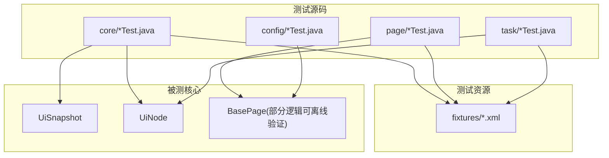
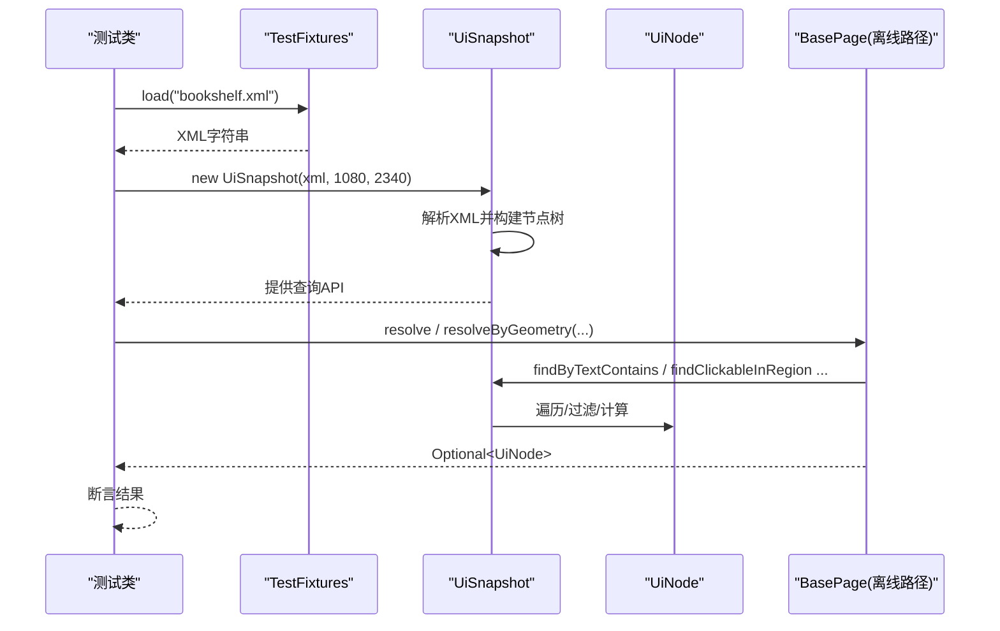
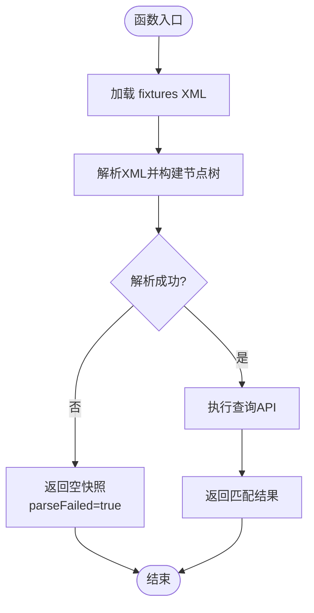
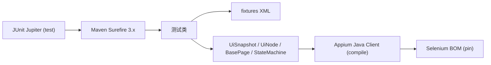

# 测试策略

<cite>
**本文引用的文件**
- [pom.xml](file://automation/pom.xml)
- [TestFixtures.java](file://automation/src/test/java/com/fanqie/auto/TestFixtures.java)
- [UiSnapshot.java](file://automation/src/main/java/com/fanqie/auto/core/UiSnapshot.java)
- [UiNode.java](file://automation/src/main/java/com/fanqie/auto/core/UiNode.java)
- [BasePageTest.java](file://automation/src/test/java/com/fanqie/auto/page/BasePageTest.java)
- [UiSnapshotTest.java](file://automation/src/test/java/com/fanqie/auto/core/UiSnapshotTest.java)
- [AdWatchStateMachineTest.java](file://automation/src/test/java/com/fanqie/auto/task/AdWatchStateMachineTest.java)
- [DriverRegistryTest.java](file://automation/src/test/java/com/fanqie/auto/core/DriverRegistryTest.java)
- [ConfigTest.java](file://automation/src/test/java/com/fanqie/auto/config/ConfigTest.java)
- [DryRunProbe.java](file://automation/src/main/java/com/fanqie/auto/DryRunProbe.java)
- [bookshelf.xml](file://automation/src/test/resources/fixtures/bookshelf.xml)
</cite>

## 目录
1. [简介](#简介)
2. [项目结构](#项目结构)
3. [核心组件](#核心组件)
4. [架构总览](#架构总览)
5. [详细组件分析](#详细组件分析)
6. [依赖关系分析](#依赖关系分析)
7. [性能考虑](#性能考虑)
8. [故障排查指南](#故障排查指南)
9. [结论](#结论)
10. [附录](#附录)

## 简介
本测试策略文档面向“番茄免费小说 UI 自动化”项目的测试体系，覆盖单元测试、离线回放、集成与端到端测试策略、测试数据组织与管理、覆盖率要求与持续集成配置，以及编写新测试用例的最佳实践。项目采用 JUnit 5 + Maven Surefire 的纯离线测试模式：通过 fixtures XML 快照进行无设备回放，避免连接真机或启动 Appium session，从而保证测试快速、稳定、可重复。

## 项目结构
测试相关的关键目录与职责如下：
- src/test/java：JUnit 5 测试类，按模块划分（core、page、task、config）
- src/test/resources/fixtures：UI 树 XML 快照夹具，用于离线回放
- automation/logs/snapshots：运行期生成的 UI 快照（来自 DryRunProbe），可用于回归对比与问题定位
- pom.xml：定义测试框架（JUnit 5）、构建插件（Surefire）、编码与依赖版本

图表来源
- [pom.xml:113-125](file://automation/pom.xml#L113-L125)
- [TestFixtures.java:27-51](file://automation/src/test/java/com/fanqie/auto/TestFixtures.java#L27-L51)
- [UiSnapshot.java:21-35](file://automation/src/main/java/com/fanqie/auto/core/UiSnapshot.java#L21-L35)
- [UiNode.java:1-12](file://automation/src/main/java/com/fanqie/auto/core/UiNode.java#L1-L12)

章节来源
- [pom.xml:15-28](file://automation/pom.xml#L15-L28)
- [pom.xml:113-125](file://automation/pom.xml#L113-L125)
- [TestFixtures.java:27-51](file://automation/src/test/java/com/fanqie/auto/TestFixtures.java#L27-L51)

## 核心组件
- 测试夹具加载器 TestFixtures：从 classpath 的 fixtures 目录读取 XML，统一使用 UTF-8 解码，提供屏幕尺寸常量，供所有离线测试复用。
- 快照解析 UiSnapshot：将一次 getPageSource() 的原始 XML 解析为内存中的节点列表，提供多种查询 API（文本包含、resource-id、content-desc、区域几何匹配、正则提取、祖先回溯等）。
- 节点模型 UiNode：不可变节点表示，封装 bounds、clickable、层级关系等；内嵌 Rect 提供坐标计算与区域判断。
- 页面定位 BasePage（部分逻辑可离线验证）：实现 L1 语义匹配 + boundsHint 裁决与 L2 结构化几何推断，并通过 LocatorRegistry 控制是否允许几何兜底，防止误点浪费配额。
- 状态机 AdWatchStateMachine（部分逻辑可离线验证）：维护进度计数、已用书籍集合、配额耗尽判定上下文等纯状态逻辑。
- 驱动注册 DriverRegistry：刷新 driver 引用的一致性保障，测试通过手写替身验证回调一致性与异常隔离。

章节来源
- [TestFixtures.java:27-51](file://automation/src/test/java/com/fanqie/auto/TestFixtures.java#L27-L51)
- [UiSnapshot.java:21-35](file://automation/src/main/java/com/fanqie/auto/core/UiSnapshot.java#L21-L35)
- [UiNode.java:1-12](file://automation/src/main/java/com/fanqie/auto/core/UiNode.java#L1-L12)
- [BasePageTest.java:18-30](file://automation/src/test/java/com/fanqie/auto/page/BasePageTest.java#L18-L30)
- [AdWatchStateMachineTest.java:27-44](file://automation/src/test/java/com/fanqie/auto/task/AdWatchStateMachineTest.java#L27-L44)
- [DriverRegistryTest.java:14-22](file://automation/src/test/java/com/fanqie/auto/core/DriverRegistryTest.java#L14-L22)

## 架构总览
测试架构围绕“离线回放”展开：测试类通过 TestFixtures 加载 fixtures XML，构造 UiSnapshot，再调用其查询 API 或结合 BasePage/State 逻辑进行断言。该模式不依赖设备、Appium 会话或网络，具备高稳定性与可重复性。

图表来源
- [TestFixtures.java:27-51](file://automation/src/test/java/com/fanqie/auto/TestFixtures.java#L27-L51)
- [UiSnapshot.java:74-98](file://automation/src/main/java/com/fanqie/auto/core/UiSnapshot.java#L74-L98)
- [UiSnapshot.java:131-228](file://automation/src/main/java/com/fanqie/auto/core/UiSnapshot.java#L131-L228)
- [BasePageTest.java:44-70](file://automation/src/test/java/com/fanqie/auto/page/BasePageTest.java#L44-L70)

## 详细组件分析

### 离线测试方法：XML 快照回放
- 设计原则
  - 零外部依赖：不连接真机、不启动 Appium session，仅读取 fixtures XML。
  - 安全解析：启用 XXE 防御，解析失败返回空快照并标记 parseFailed，确保上层状态机走 UNKNOWN 分支。
  - 内存优先：解析后全部查询在内存中进行，零 RPC，单 tick 状态识别目标约 0.5s。
- 实现要点
  - 使用 JDK DocumentBuilderFactory 解析 XML，深度优先遍历生成 UiNode 列表。
  - 提供多种查询 API：文本包含、resource-id、content-desc、区域几何匹配、正则提取、最近可点击祖先回溯。
  - 对畸形/截断 XML 的健壮性：不抛异常，size=0，isParseFailed=true。
- 测试覆盖
  - 正常解析、边界输入（null/空串）、不可变列表、多通道命中、区域筛选、正则提取、错误恢复等。

图表来源
- [UiSnapshot.java:74-98](file://automation/src/main/java/com/fanqie/auto/core/UiSnapshot.java#L74-L98)
- [UiSnapshot.java:131-228](file://automation/src/main/java/com/fanqie/auto/core/UiSnapshot.java#L131-L228)
- [UiSnapshotTest.java:37-78](file://automation/src/test/java/com/fanqie/auto/core/UiSnapshotTest.java#L37-L78)

章节来源
- [UiSnapshot.java:21-35](file://automation/src/main/java/com/fanqie/auto/core/UiSnapshot.java#L21-L35)
- [UiSnapshot.java:74-98](file://automation/src/main/java/com/fanqie/auto/core/UiSnapshot.java#L74-L98)
- [UiSnapshotTest.java:37-78](file://automation/src/test/java/com/fanqie/auto/core/UiSnapshotTest.java#L37-L78)

### Mock 策略与测试替身
- 策略
  - 不使用 Mockito 等重型 mock 框架；通过手写轻量替身与 fixtures XML 完成隔离。
  - 对需要外部依赖的组件（如 DriverAware），以记录型替身验证回调一致性与异常隔离。
- 示例
  - DriverRegistryTest：使用 RecordingAware/ThrowingAware 验证 refreshAll 的广播与异常隔离。
  - BasePageTest：传入 null 依赖，仅验证 resolve/resolveByGeometry 的内存计算路径。
  - AdWatchStateMachineTest：全 null 依赖构造，验证纯状态逻辑（进度计数、usedBooks 持久化时效等）。

章节来源
- [DriverRegistryTest.java:25-43](file://automation/src/test/java/com/fanqie/auto/core/DriverRegistryTest.java#L25-L43)
- [DriverRegistryTest.java:45-118](file://automation/src/test/java/com/fanqie/auto/core/DriverRegistryTest.java#L45-L118)
- [BasePageTest.java:36-47](file://automation/src/test/java/com/fanqie/auto/page/BasePageTest.java#L36-L47)
- [AdWatchStateMachineTest.java:55-81](file://automation/src/test/java/com/fanqie/auto/task/AdWatchStateMachineTest.java#L55-L81)

### 测试夹具的组织与管理
- 位置与命名
  - 位于 src/test/resources/fixtures，文件名描述场景（如 bookshelf.xml、ad_close_ready.xml）。
- 加载方式
  - 通过 TestFixtures.load(name) 以 UTF-8 读取，避免 Windows GBK 导致中文乱码。
  - 统一屏幕分辨率常量（1080x2340），所有 fixture 基于此坐标系。
- 管理建议
  - 新增场景时，先通过 DryRunProbe 抓取真实 UI 快照，保存至 automation/logs/snapshots，再裁剪为最小可用 fixture。
  - 保持 fixture 精简且具代表性，便于回归与对比。

章节来源
- [TestFixtures.java:20-51](file://automation/src/test/java/com/fanqie/auto/TestFixtures.java#L20-L51)
- [DryRunProbe.java:266-278](file://automation/src/main/java/com/fanqie/auto/DryRunProbe.java#L266-L278)
- [bookshelf.xml:1-11](file://automation/src/test/resources/fixtures/bookshelf.xml#L1-L11)

### 四级定位降级链的离线验证
- L1 语义匹配 + boundsHint 裁决：通过 BasePage.resolve 验证 text/content-desc/resource-id 通道与右上角/底部裁决。
- L2 结构化几何推断：通过 BasePage.resolveByGeometry 验证区域筛选与面积限制，同时校验 allowGeometryFallback 约束，防止误点浪费配额。
- 测试覆盖
  - adClose 允许几何兜底并命中右上角关闭按钮。
  - adWatch/adContinue 禁用几何兜底，即使存在候选也返回 empty。
  - 多命中时的 boundsHint 裁决（右上角/底部 Tab）。

章节来源
- [BasePageTest.java:49-78](file://automation/src/test/java/com/fanqie/auto/page/BasePageTest.java#L49-L78)
- [BasePageTest.java:82-125](file://automation/src/test/java/com/fanqie/auto/page/BasePageTest.java#L82-L125)
- [ConfigTest.java:117-131](file://automation/src/test/java/com/fanqie/auto/config/ConfigTest.java#L117-L131)

### 状态机与业务规则的离线验证
- 进度计数与幂等：earnedMinutes、totalAdRounds、currentEntryRound 的 setter/getter 一致性。
- usedBooks 持久化时效：当天 URL 编码 usedBooks 正确解码恢复；跨天或旧格式保守清空。
- 配额耗尽判定：通过 locators.dailyQuotaExhaustedTexts 与 snapshot.findByTextContains 组合验证上下文约束（弹窗关闭按钮存在与否）。

章节来源
- [AdWatchStateMachineTest.java:83-128](file://automation/src/test/java/com/fanqie/auto/task/AdWatchStateMachineTest.java#L83-L128)
- [AdWatchStateMachineTest.java:130-178](file://automation/src/test/java/com/fanqie/auto/task/AdWatchStateMachineTest.java#L130-L178)
- [AdWatchStateMachineTest.java:180-240](file://automation/src/test/java/com/fanqie/auto/task/AdWatchStateMachineTest.java#L180-L240)

### 集成测试与端到端测试策略
- 集成测试
  - 通过 DryRunProbe 连接 Appium，激活 App，在书架页与阅读页抓取 UI 快照并落盘，输出节点统计与关键词节点，辅助校准定位策略。
  - 该探针遵循安全约束：只进行无害操作（切 Tab、点开书籍），绝不点击广告/观看视频/领取按钮。
- 端到端测试
  - 当前仓库未包含端到端测试用例；建议在 CI 中引入设备池，运行完整流程脚本，并结合 snapshots 进行回归比对。
  - 可将 DryRunProbe 的输出作为 E2E 前置检查，确保环境就绪后再执行长任务。

章节来源
- [DryRunProbe.java:26-40](file://automation/src/main/java/com/fanqie/auto/DryRunProbe.java#L26-L40)
- [DryRunProbe.java:91-197](file://automation/src/main/java/com/fanqie/auto/DryRunProbe.java#L91-L197)

## 依赖关系分析
- 测试框架与构建
  - JUnit 5（Jupiter）+ Maven Surefire 3.x 运行测试；UTF-8 编码强制，避免中文乱码。
  - 依赖范围：test scope 的 JUnit 不进入 fat-jar 运行时 classpath。
- 被测依赖
  - Appium Java Client 与 Selenium BOM 通过 dependencyManagement pin 版本，确保兼容性。
  - SLF4J simple 实现日志输出。

图表来源
- [pom.xml:70-83](file://automation/pom.xml#L70-L83)
- [pom.xml:113-125](file://automation/pom.xml#L113-L125)
- [pom.xml:30-48](file://automation/pom.xml#L30-L48)

章节来源
- [pom.xml:70-83](file://automation/pom.xml#L70-L83)
- [pom.xml:113-125](file://automation/pom.xml#L113-L125)
- [pom.xml:30-48](file://automation/pom.xml#L30-L48)

## 性能考虑
- 快照解析性能
  - 单次解析后缓存节点列表，后续查询均为内存操作，零 RPC。
  - 单 tick 状态识别目标约 0.5s，显著快于每步 uiautomator dump。
- 测试执行性能
  - 离线测试无需设备/会话初始化，启动开销低，适合频繁回归。
  - 使用 fixtures 小样本，减少解析与扫描成本。
- 优化建议
  - 合理拆分 fixture，避免超大 XML。
  - 批量测试时利用 JUnit 并行执行（如需），注意线程安全（UiSnapshot 解析新建实例，节点列表不可变）。

[本节为通用指导，不直接分析具体文件]

## 故障排查指南
- 常见错误与处理
  - XML 解析失败：UiSnapshot 捕获异常并返回空快照，isParseFailed=true；上层状态机走 UNKNOWN 分支，避免崩溃。
  - 中文乱码：确保 TestFixtures 使用 UTF-8 读取；Maven Surefire 设置 -Dfile.encoding=UTF-8。
  - 定位失败：通过 DryRunProbe 输出节点统计与关键词节点，确认 text/content-desc/resource-id/bounds 可用性。
- 调试手段
  - 使用 DryRunProbe 抓取真实 UI 快照并落盘，对比 fixtures 差异。
  - 在 BasePageTest 中逐步缩小命中范围，验证 boundsHint 与几何筛选参数。

章节来源
- [UiSnapshot.java:61-72](file://automation/src/main/java/com/fanqie/auto/core/UiSnapshot.java#L61-L72)
- [pom.xml:117-125](file://automation/pom.xml#L117-L125)
- [DryRunProbe.java:280-345](file://automation/src/main/java/com/fanqie/auto/DryRunProbe.java#L280-L345)

## 结论
本项目采用“离线回放 + 轻量替身”的测试策略，以 fixtures XML 为核心，配合 UiSnapshot 的内存查询 API，实现了稳定、快速、可重复的单元测试。通过 BasePage 的 L1/L2 定位与 LocatorRegistry 的误点防护，有效降低误操作风险。集成测试可通过 DryRunProbe 作为前置检查，端到端测试可在 CI 中引入设备池执行。整体架构兼顾性能与可靠性，适合长期演进与维护。

[本节为总结，不直接分析具体文件]

## 附录

### 测试覆盖率要求
- 建议指标
  - 核心类（UiSnapshot、UiNode、BasePage 关键路径、AdWatchStateMachine 纯状态逻辑）行覆盖率 ≥ 90%。
  - 关键分支（解析失败、boundsHint 裁决、allowGeometryFallback 约束、配额耗尽上下文）必须覆盖。
- 工具与报告
  - 可使用 JaCoCo 插件生成覆盖率报告（需在 pom.xml 添加插件与配置）。
  - 在 CI 中收集并归档报告，设置质量门禁。

[本节为通用指导，不直接分析具体文件]

### 持续集成配置
- 构建与测试
  - mvn clean test：编译并运行 JUnit 5 测试，Surefire 负责发现与执行。
  - 强制 UTF-8 编码，避免中文乱码。
- 打包与发布
  - mvn package：使用 shade 插件产出 fat-jar，便于脱离 IDE 运行长任务。
- 建议步骤
  - 安装 JDK 11，配置 Maven，拉取阿里云镜像加速。
  - 在 CI 中执行 mvn clean test && mvn package，并上传测试报告与产物。

章节来源
- [pom.xml:113-125](file://automation/pom.xml#L113-L125)
- [pom.xml:137-172](file://automation/pom.xml#L137-L172)

### 编写新测试用例的指导原则与最佳实践
- 设计原则
  - 优先离线：尽量通过 fixtures XML 与内存 API 完成验证，避免设备依赖。
  - 单一职责：每个测试聚焦一个行为或边界条件，命名清晰。
  - 数据驱动：使用 fixtures 表达不同场景，必要时结合 JUnit 参数化。
- 实现要点
  - 使用 TestFixtures.load 加载 fixture，统一屏幕尺寸。
  - 对需要外部依赖的组件，使用手写替身隔离，仅验证关键路径。
  - 断言明确：不仅断言结果存在，还断言关键属性（bounds、text、desc、clickable）。
- 最佳实践
  - 新增 fixture 前先用 DryRunProbe 抓取真实快照，裁剪为最小可用集。
  - 对误点高风险控件（adWatch/adContinue），确保 allowGeometryFallback=false 的测试覆盖。
  - 对解析异常与边界输入（null/空串/畸形 XML）进行健壮性测试。

章节来源
- [TestFixtures.java:27-51](file://automation/src/test/java/com/fanqie/auto/TestFixtures.java#L27-L51)
- [UiSnapshotTest.java:80-198](file://automation/src/test/java/com/fanqie/auto/core/UiSnapshotTest.java#L80-L198)
- [BasePageTest.java:49-125](file://automation/src/test/java/com/fanqie/auto/page/BasePageTest.java#L49-L125)
- [AdWatchStateMachineTest.java:130-240](file://automation/src/test/java/com/fanqie/auto/task/AdWatchStateMachineTest.java#L130-L240)