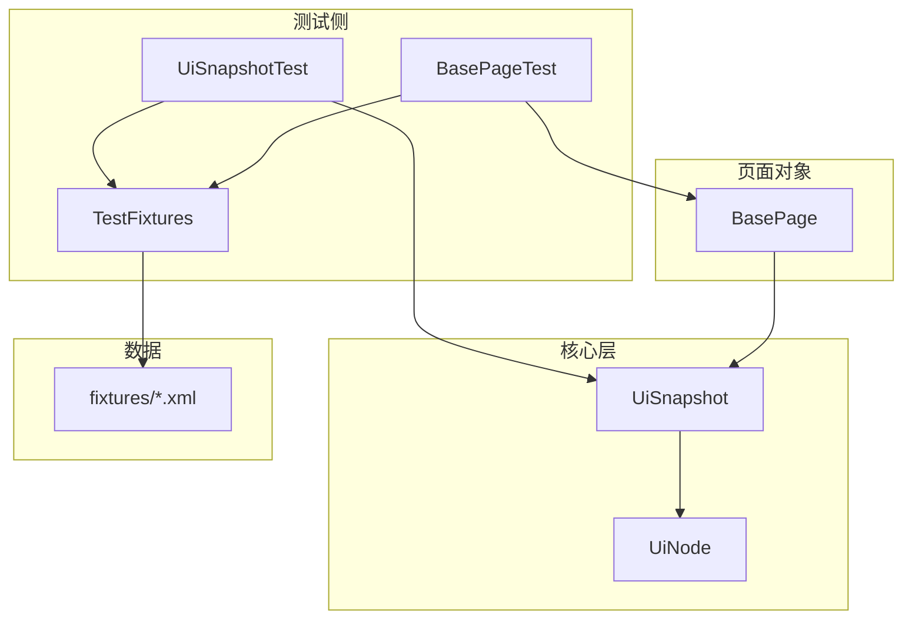
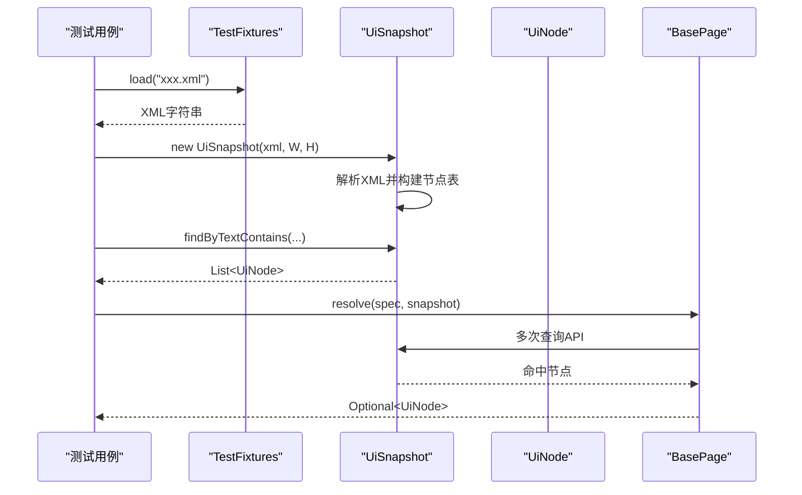
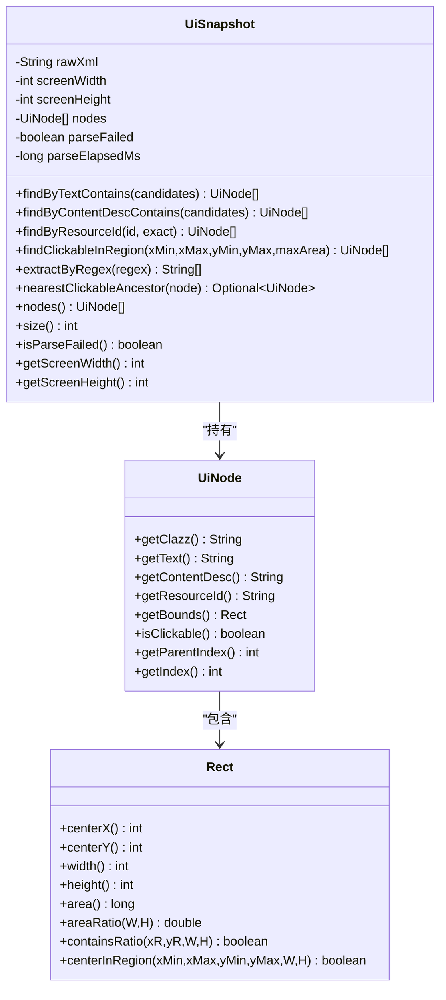
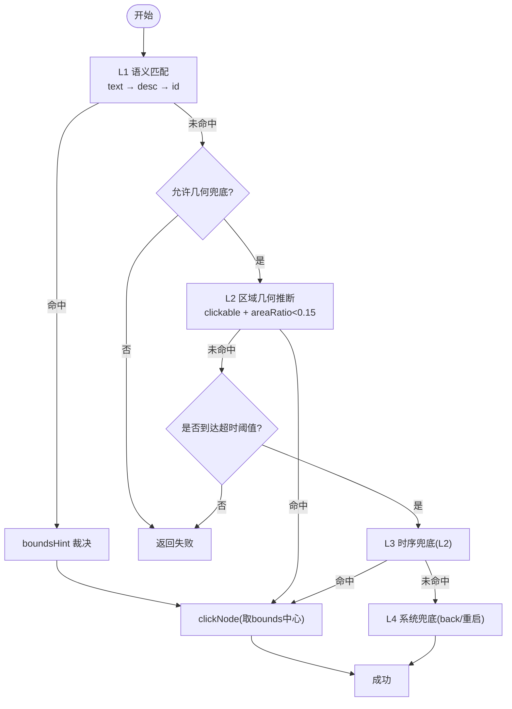
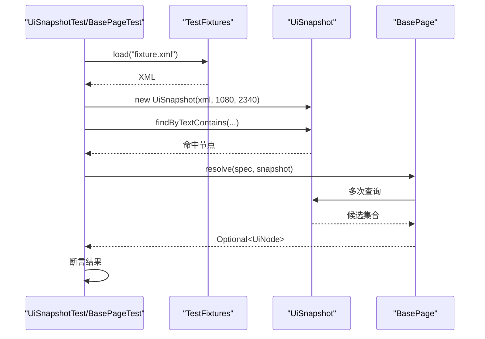
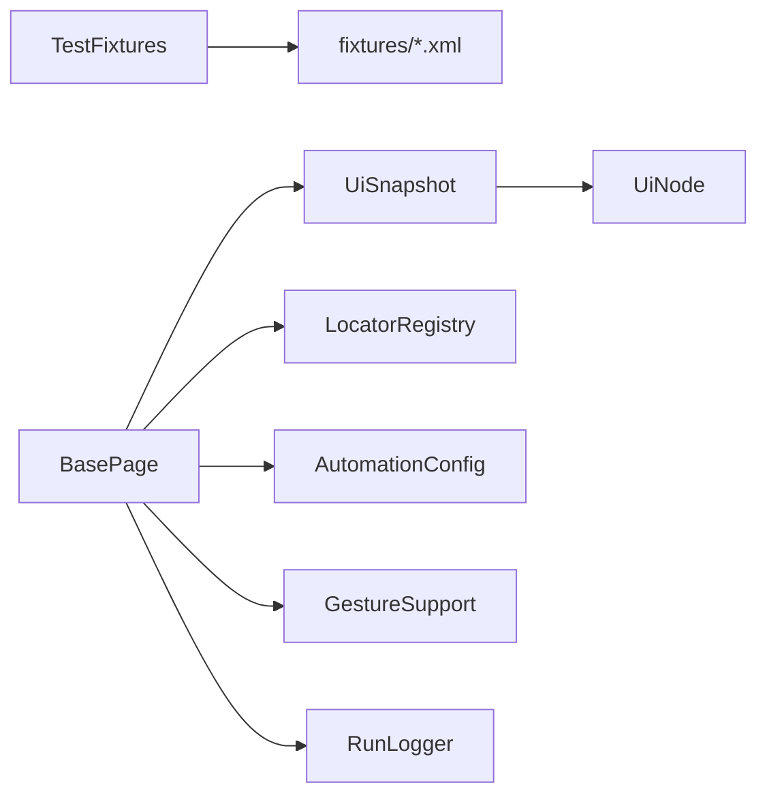

# 离线测试方法

<cite>
**本文引用的文件**
- [TestFixtures.java](file://automation/src/test/java/com/fanqie/auto/TestFixtures.java)
- [UiSnapshot.java](file://automation/src/main/java/com/fanqie/auto/core/UiSnapshot.java)
- [UiNode.java](file://automation/src/main/java/com/fanqie/auto/core/UiNode.java)
- [BasePage.java](file://automation/src/main/java/com/fanqie/auto/page/BasePage.java)
- [UiSnapshotTest.java](file://automation/src/test/java/com/fanqie/auto/core/UiSnapshotTest.java)
- [BasePageTest.java](file://automation/src/test/java/com/fanqie/auto/page/BasePageTest.java)
- [bookshelf.xml](file://automation/src/test/resources/fixtures/bookshelf.xml)
- [reader.xml](file://automation/src/test/resources/fixtures/reader.xml)
- [ad_close_by_desc.xml](file://automation/src/test/resources/fixtures/ad_close_by_desc.xml)
- [ad_close_ready.xml](file://automation/src/test/resources/fixtures/ad_close_ready.xml)
- [reward_granted.xml](file://automation/src/test/resources/fixtures/reward_granted.xml)
- [nested_clickable.xml](file://automation/src/test/resources/fixtures/nested_clickable.xml)
- [malformed.xml](file://automation/src/test/resources/fixtures/malformed.xml)
</cite>

## 目录
1. [简介](#简介)
2. [项目结构](#项目结构)
3. [核心组件](#核心组件)
4. [架构总览](#架构总览)
5. [详细组件分析](#详细组件分析)
6. [依赖关系分析](#依赖关系分析)
7. [性能考量](#性能考量)
8. [故障排查指南](#故障排查指南)
9. [结论](#结论)
10. [附录：创建新测试夹具的规范](#附录：创建新测试夹具的规范)

## 简介
本文件面向“无设备、纯离线”的 UI 自动化测试，说明如何基于已录制的 UI 快照 XML（fixtures）进行页面状态验证与用户操作模拟。文档重点包括：
- TestFixtures 工具类的工作原理与使用方式
- 如何加载与管理测试夹具文件
- UI 快照数据结构与格式（节点信息、坐标系统、文本内容）
- 如何进行页面状态验证与用户操作模拟
- 完整的离线测试示例流程
- 创建新测试夹具的指导原则

## 项目结构
本项目将“离线回放”的核心能力集中在 core 层（UiSnapshot、UiNode），并通过 page 层的 BasePage 提供四级定位降级链；测试侧通过 TestFixtures 从 fixtures 目录读取 XML，配合 JUnit 用例完成离线断言。

图表来源
- [TestFixtures.java:1-53](file://automation/src/test/java/com/fanqie/auto/TestFixtures.java#L1-L53)
- [UiSnapshot.java:1-284](file://automation/src/main/java/com/fanqie/auto/core/UiSnapshot.java#L1-L284)
- [UiNode.java:1-218](file://automation/src/main/java/com/fanqie/auto/core/UiNode.java#L1-L218)
- [BasePage.java:1-516](file://automation/src/main/java/com/fanqie/auto/page/BasePage.java#L1-L516)
- [UiSnapshotTest.java:1-199](file://automation/src/test/java/com/fanqie/auto/core/UiSnapshotTest.java#L1-L199)
- [BasePageTest.java:1-127](file://automation/src/test/java/com/fanqie/auto/page/BasePageTest.java#L1-L127)

章节来源
- [TestFixtures.java:1-53](file://automation/src/test/java/com/fanqie/auto/TestFixtures.java#L1-L53)
- [UiSnapshot.java:1-284](file://automation/src/main/java/com/fanqie/auto/core/UiSnapshot.java#L1-L284)
- [UiNode.java:1-218](file://automation/src/main/java/com/fanqie/auto/core/UiNode.java#L1-L218)
- [BasePage.java:1-516](file://automation/src/main/java/com/fanqie/auto/page/BasePage.java#L1-L516)
- [UiSnapshotTest.java:1-199](file://automation/src/test/java/com/fanqie/auto/core/UiSnapshotTest.java#L1-L199)
- [BasePageTest.java:1-127](file://automation/src/test/java/com/fanqie/auto/page/BasePageTest.java#L1-L127)

## 核心组件
- TestFixtures：从 test classpath 的 fixtures 目录以 UTF-8 读取 XML 字符串，提供统一屏幕尺寸常量，不连接真机。
- UiSnapshot：解析一次 UI 树 XML，构建不可变节点列表，提供多种内存查询 API（按 text、content-desc、resource-id、区域几何、正则提取等）。
- UiNode：表示单个 UI 节点的不可变数据，包含 bounds 矩形及几何计算能力。
- BasePage：实现四级定位降级链（语义匹配→几何推断→时序兜底→系统兜底），并提供点击封装。

章节来源
- [TestFixtures.java:1-53](file://automation/src/test/java/com/fanqie/auto/TestFixtures.java#L1-L53)
- [UiSnapshot.java:1-284](file://automation/src/main/java/com/fanqie/auto/core/UiSnapshot.java#L1-L284)
- [UiNode.java:1-218](file://automation/src/main/java/com/fanqie/auto/core/UiNode.java#L1-L218)
- [BasePage.java:1-516](file://automation/src/main/java/com/fanqie/auto/page/BasePage.java#L1-L516)

## 架构总览
离线测试的数据流如下：
- 测试用例通过 TestFixtures 加载 fixtures/*.xml
- 将 XML 与屏幕尺寸传入 UiSnapshot 构造器，解析为内存中的节点表
- 通过 UiSnapshot 提供的查询 API 进行状态验证或定位目标控件
- 在需要时通过 BasePage 的 resolve / resolveByGeometry 执行四级定位并点击（离线场景下仅做逻辑验证，不实际驱动设备）

图表来源
- [TestFixtures.java:27-51](file://automation/src/test/java/com/fanqie/auto/TestFixtures.java#L27-L51)
- [UiSnapshot.java:52-98](file://automation/src/main/java/com/fanqie/auto/core/UiSnapshot.java#L52-L98)
- [BasePage.java:84-137](file://automation/src/main/java/com/fanqie/auto/page/BasePage.java#L84-L137)

## 详细组件分析

### TestFixtures：夹具加载器
- 职责：从 fixtures 目录读取 XML 并以 UTF-8 解码返回字符串；定义统一屏幕分辨率常量。
- 关键点：
  - 资源路径固定为 "fixtures/" + name
  - 使用 InputStreamReader(UTF-8) 避免中文乱码
  - 不存在或 IO 异常抛出 IllegalStateException
  - 提供 SCREEN_WIDTH=1080、SCREEN_HEIGHT=2340 作为所有 fixture 的坐标系基准

章节来源
- [TestFixtures.java:1-53](file://automation/src/test/java/com/fanqie/auto/TestFixtures.java#L1-L53)

### UiSnapshot：快照解析与查询
- 职责：解析 UI 树 XML，构建不可变节点列表，提供多种查询 API。
- 关键设计：
  - 安全解析：禁用 DTD/外部实体/XInclude，防御 XXE
  - 健壮性：解析失败不抛异常，设置 parseFailed=true，返回空节点表
  - 深度优先遍历 DOM，维护 depth、parentIndex、index
  - 查询 API：
    - findByTextContains：text 包含匹配
    - findByContentDescContains：content-desc 包含匹配
    - findByResourceId：精确/包含匹配
    - findClickableInRegion：按比例区域筛选 clickable 且面积占比小的节点
    - extractByRegex：从 text/content-desc 中用正则提取
    - nearestClickableAncestor：向上回溯最近可点击祖先
- 坐标系统：
  - 屏幕尺寸由构造参数传入（W/H）
  - Rect.centerInRegion/areaRatio 等用于几何判定

图表来源
- [UiSnapshot.java:36-284](file://automation/src/main/java/com/fanqie/auto/core/UiSnapshot.java#L36-L284)
- [UiNode.java:13-218](file://automation/src/main/java/com/fanqie/auto/core/UiNode.java#L13-L218)

章节来源
- [UiSnapshot.java:1-284](file://automation/src/main/java/com/fanqie/auto/core/UiSnapshot.java#L1-L284)
- [UiNode.java:1-218](file://automation/src/main/java/com/fanqie/auto/core/UiNode.java#L1-L218)

### BasePage：四级定位与点击封装
- 职责：实现定位降级链与点击封装，支持离线场景下的逻辑验证。
- 四级策略：
  - L1 语义匹配：text → content-desc → resource-id，命中多个时用 boundsHint 裁决
  - L2 结构化几何推断：在 boundsHint 区域内查找 clickable 且 areaRatio < 0.15 的节点
  - L3 时序兜底：达到超时阈值后强制执行 L2
  - L4 系统兜底：back 或重启 App（在线场景）
- 误点防护：对 allowGeometryFallback=false 的控件（如 adWatch）禁止 L2/L3，避免误点浪费配额
- 点击实现：取命中节点 bounds 中心；若节点不可点击则回溯至最近可点击祖先

图表来源
- [BasePage.java:75-236](file://automation/src/main/java/com/fanqie/auto/page/BasePage.java#L75-L236)
- [BasePage.java:312-336](file://automation/src/main/java/com/fanqie/auto/page/BasePage.java#L312-L336)
- [BasePage.java:347-434](file://automation/src/main/java/com/fanqie/auto/page/BasePage.java#L347-L434)

章节来源
- [BasePage.java:1-516](file://automation/src/main/java/com/fanqie/auto/page/BasePage.java#L1-L516)

### 测试用例：离线验证流程
- UiSnapshotTest：覆盖正常/畸形 XML 解析、不可变列表、text/desc/id 匹配、区域几何、正则提取、祖先回溯等
- BasePageTest：覆盖 L1 多通道与 boundsHint 裁决、L2 几何兜底与误点防护、null/畸形快照处理

图表来源
- [UiSnapshotTest.java:30-199](file://automation/src/test/java/com/fanqie/auto/core/UiSnapshotTest.java#L30-L199)
- [BasePageTest.java:36-127](file://automation/src/test/java/com/fanqie/auto/page/BasePageTest.java#L36-L127)

章节来源
- [UiSnapshotTest.java:1-199](file://automation/src/test/java/com/fanqie/auto/core/UiSnapshotTest.java#L1-L199)
- [BasePageTest.java:1-127](file://automation/src/test/java/com/fanqie/auto/page/BasePageTest.java#L1-L127)

## 依赖关系分析
- TestFixtures 无外部依赖，仅读取 classpath 资源
- UiSnapshot 依赖 JDK XML 解析库，严格启用 XXE 防护
- UiNode 内嵌 Rect 用于坐标与几何计算
- BasePage 依赖 LocatorRegistry/AutomationConfig/GestureSupport/RunLogger（在线场景），但在离线测试中可通过 null 依赖调用 resolve/resolveByGeometry 进行纯内存验证

图表来源
- [TestFixtures.java:27-51](file://automation/src/test/java/com/fanqie/auto/TestFixtures.java#L27-L51)
- [UiSnapshot.java:78-98](file://automation/src/main/java/com/fanqie/auto/core/UiSnapshot.java#L78-L98)
- [BasePage.java:55-68](file://automation/src/main/java/com/fanqie/auto/page/BasePage.java#L55-L68)

章节来源
- [TestFixtures.java:1-53](file://automation/src/test/java/com/fanqie/auto/TestFixtures.java#L1-L53)
- [UiSnapshot.java:1-284](file://automation/src/main/java/com/fanqie/auto/core/UiSnapshot.java#L1-L284)
- [BasePage.java:1-516](file://automation/src/main/java/com/fanqie/auto/page/BasePage.java#L1-L516)

## 性能考量
- 单次解析：UiSnapshot 构造时一次性解析 XML，后续查询均为内存操作，零 RPC
- 缓存复用：同一 tick 内快照可复用，避免重复抓取
- 解析耗时：单 tick 状态识别约 0.5s，显著快于逐步骤 dump
- 几何过滤：areaRatio 限制减少大面积容器干扰，提升命中率与稳定性

[本节为通用性能讨论，无需特定文件引用]

## 故障排查指南
- 解析失败：当 XML 畸形/截断时，UiSnapshot 会标记 parseFailed=true 并返回空节点表，上层应走 UNKNOWN 分支
- 编码问题：必须使用 UTF-8 读取 fixtures，否则中文文案匹配全部失效
- 坐标系统：确保 fixture 的 bounds 基于统一屏幕尺寸（1080x2340），否则区域几何判断可能偏差
- 误点防护：对 allowGeometryFallback=false 的控件，即使存在右上角 clickable 节点也不允许几何兜底，避免误点

章节来源
- [UiSnapshot.java:61-72](file://automation/src/main/java/com/fanqie/auto/core/UiSnapshot.java#L61-L72)
- [TestFixtures.java:34-51](file://automation/src/test/java/com/fanqie/auto/TestFixtures.java#L34-L51)
- [BasePage.java:150-189](file://automation/src/main/java/com/fanqie/auto/page/BasePage.java#L150-L189)

## 结论
通过 TestFixtures + UiSnapshot + BasePage 的组合，可以在无设备环境下高效完成 UI 状态验证与操作模拟。该方案具备：
- 高鲁棒性：XXE 防护、畸形 XML 容错、健壮 bounds 解析
- 高性能：一次解析、内存查询、几何快速过滤
- 高可维护性：四级定位降级链、boundsHint 裁决、误点防护
- 易扩展：新增 fixture 即可覆盖新场景，无需改动核心逻辑

[本节为总结性内容，无需特定文件引用]

## 附录：创建新测试夹具的规范
- 文件位置：放在 automation/src/test/resources/fixtures/ 目录下，命名清晰（如 feature_state.xml）
- 编码：必须使用 UTF-8，确保中文文案正确显示与匹配
- 屏幕尺寸：所有 bounds 基于 1080x2340 坐标系
- 节点属性：
  - class：UI 控件类型
  - text：可见文案
  - content-desc：无障碍描述
  - resource-id：控件唯一标识
  - package：应用包名
  - bounds：矩形 "[x1,y1][x2,y2]"，需合法且非全零
  - clickable：是否可点击
- 典型场景建议：
  - 广告关闭：包含右上角 clickable ImageView，bounds 位于 x>0.8W, y<0.2H
  - 书架页：包含 RecyclerView 与底部 Tab
  - 阅读页：包含正文 TextView 与章节标题
  - 奖励弹窗：包含文案与确认按钮
  - 嵌套可点击：外层容器 clickable=true，内层 TextView 不可点击
- 校验建议：
  - 使用 UiSnapshot.findByTextContains / findByContentDescContains / findByResourceId 验证命中
  - 使用 findClickableInRegion 验证几何命中
  - 使用 nearestClickableAncestor 验证点击回溯
  - 使用 extractByRegex 验证文案提取

章节来源
- [bookshelf.xml:1-11](file://automation/src/test/resources/fixtures/bookshelf.xml#L1-L11)
- [reader.xml:1-7](file://automation/src/test/resources/fixtures/reader.xml#L1-L7)
- [ad_close_by_desc.xml:1-6](file://automation/src/test/resources/fixtures/ad_close_by_desc.xml#L1-L6)
- [ad_close_ready.xml:1-7](file://automation/src/test/resources/fixtures/ad_close_ready.xml#L1-L7)
- [reward_granted.xml:1-10](file://automation/src/test/resources/fixtures/reward_granted.xml#L1-L10)
- [nested_clickable.xml:1-8](file://automation/src/test/resources/fixtures/nested_clickable.xml#L1-L8)
- [malformed.xml:1-2](file://automation/src/test/resources/fixtures/malformed.xml#L1-L2)