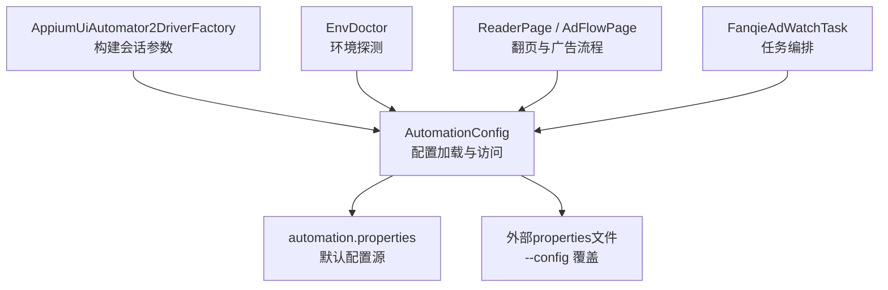
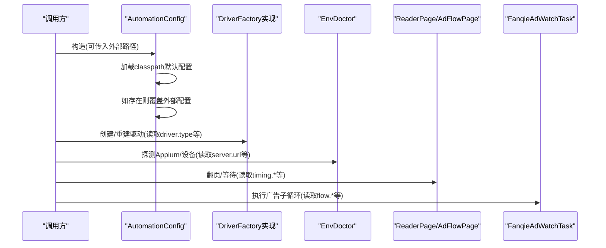
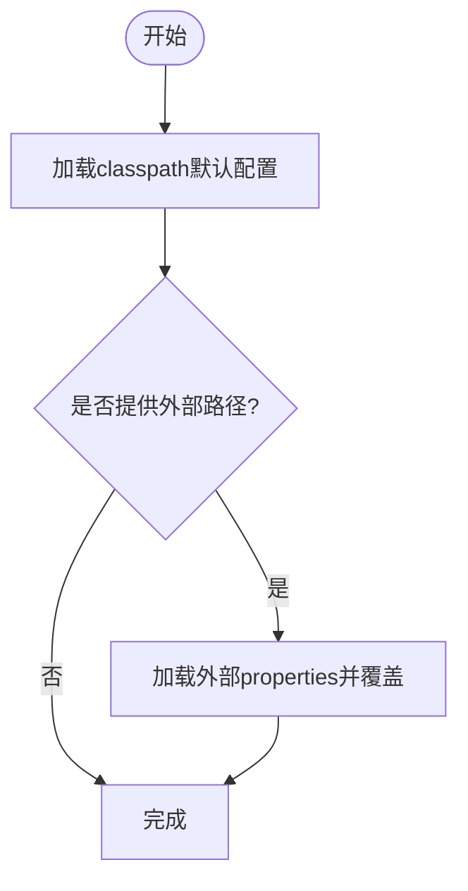
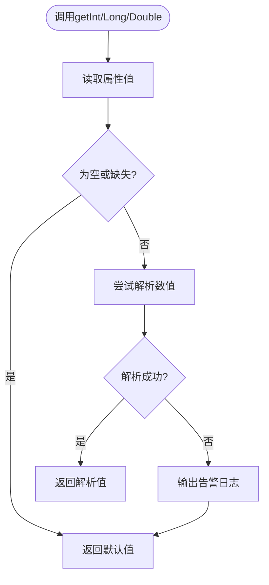
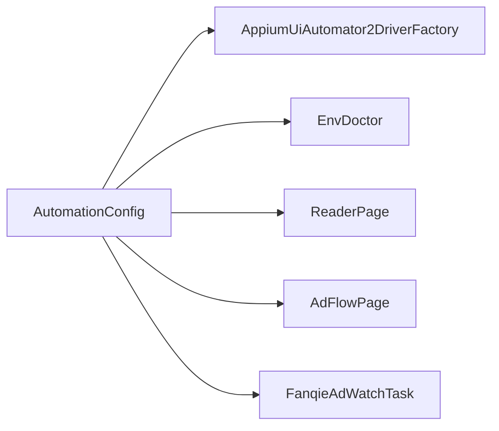

# AutomationConfig类详解

<cite>
**本文引用的文件**
- [AutomationConfig.java](file://automation/src/main/java/com/fanqie/auto/config/AutomationConfig.java)
- [automation.properties](file://automation/src/main/resources/automation.properties)
- [ConfigTest.java](file://automation/src/test/java/com/fanqie/auto/config/ConfigTest.java)
- [AppiumUiAutomator2DriverFactory.java](file://automation/src/main/java/com/fanqie/auto/core/AppiumUiAutomator2DriverFactory.java)
- [EnvDoctor.java](file://automation/src/main/java/com/fanqie/auto/core/EnvDoctor.java)
- [ReaderPage.java](file://automation/src/main/java/com/fanqie/auto/page/ReaderPage.java)
- [AdFlowPage.java](file://automation/src/main/java/com/fanqie/auto/page/AdFlowPage.java)
- [FanqieAdWatchTask.java](file://automation/src/main/java/com/fanqie/auto/task/FanqieAdWatchTask.java)
- [README.md](file://automation/README.md)
</cite>

## 目录
1. [简介](#简介)
2. [项目结构](#项目结构)
3. [核心组件](#核心组件)
4. [架构总览](#架构总览)
5. [详细组件分析](#详细组件分析)
6. [依赖关系分析](#依赖关系分析)
7. [性能与稳定性优化建议](#性能与稳定性优化建议)
8. [故障排查指南](#故障排查指南)
9. [结论](#结论)
10. [附录：配置项清单与调优建议](#附录配置项清单与调优建议)

## 简介
AutomationConfig 是自动化流程的“全局配置中心”，负责从 classpath 加载默认配置文件，并支持通过外部 properties 文件覆盖。它提供类型安全的配置获取方法（字符串、整数、长整型、浮点、布尔），将超时、轮次、阈值等“魔法数字”集中管理，确保代码中不出现硬编码常量，便于在不同环境（开发/测试/生产）和不同设备（Android/鸿蒙）下灵活调整行为。

## 项目结构
本模块围绕配置加载与使用展开：
- 配置定义与加载：AutomationConfig 与 automation.properties
- 配置使用方：驱动工厂、环境诊断、页面操作、任务编排等
- 单元测试：验证加载顺序、缺省值、非法值回退、外部覆盖等行为

图表来源
- [AutomationConfig.java:25-42](file://automation/src/main/java/com/fanqie/auto/config/AutomationConfig.java#L25-L42)
- [AppiumUiAutomator2DriverFactory.java:130-155](file://automation/src/main/java/com/fanqie/auto/core/AppiumUiAutomator2DriverFactory.java#L130-L155)
- [EnvDoctor.java:142-158](file://automation/src/main/java/com/fanqie/auto/core/EnvDoctor.java#L142-L158)
- [ReaderPage.java:69-96](file://automation/src/main/java/com/fanqie/auto/page/ReaderPage.java#L69-L96)
- [AdFlowPage.java:112-139](file://automation/src/main/java/com/fanqie/auto/page/AdFlowPage.java#L112-L139)
- [FanqieAdWatchTask.java:210-230](file://automation/src/main/java/com/fanqie/auto/task/FanqieAdWatchTask.java#L210-L230)

章节来源
- [AutomationConfig.java:10-17](file://automation/src/main/java/com/fanqie/auto/config/AutomationConfig.java#L10-L17)
- [automation.properties:1-4](file://automation/src/main/resources/automation.properties#L1-L4)

## 核心组件
- 配置加载器：支持 classpath 默认加载与外部文件覆盖，统一 UTF-8 解码，异常安全（失败时降级为内置默认值）。
- 类型安全访问器：getString/getInt/getLong/getDouble/getBoolean，对缺失键与非法值进行兜底处理，避免运行时崩溃。
- 配置域分组：
  - Appium 连接与会话参数
  - 时序控制（轮询间隔、各类超时、心跳）
  - 业务流程（翻页数量、广告轮次、熔断保护）
  - 阅读页翻页策略（点击/滑动、坐标比例、滑动时长）
  - 运行期开关（截图校验、dry-run）

章节来源
- [AutomationConfig.java:67-108](file://automation/src/main/java/com/fanqie/auto/config/AutomationConfig.java#L67-L108)
- [AutomationConfig.java:112-178](file://automation/src/main/java/com/fanqie/auto/config/AutomationConfig.java#L112-L178)
- [AutomationConfig.java:182-212](file://automation/src/main/java/com/fanqie/auto/config/AutomationConfig.java#L182-L212)
- [AutomationConfig.java:216-260](file://automation/src/main/java/com/fanqie/auto/config/AutomationConfig.java#L216-L260)
- [AutomationConfig.java:264-287](file://automation/src/main/java/com/fanqie/auto/config/AutomationConfig.java#L264-L287)
- [AutomationConfig.java:291-303](file://automation/src/main/java/com/fanqie/auto/config/AutomationConfig.java#L291-L303)

## 架构总览
AutomationConfig 作为单一事实源，被多个子系统消费：
- 驱动装配：根据 driver.type 选择具体 DriverFactory；Appium 会话参数由配置决定。
- 环境诊断：检查 Appium Server 是否就绪、设备是否在线。
- 页面交互：翻页策略、等待超时、状态检测均受配置影响。
- 任务编排：广告观看子循环、外层循环次数、熔断阈值均由配置驱动。

图表来源
- [AutomationConfig.java:25-42](file://automation/src/main/java/com/fanqie/auto/config/AutomationConfig.java#L25-L42)
- [AppiumUiAutomator2DriverFactory.java:130-155](file://automation/src/main/java/com/fanqie/auto/core/AppiumUiAutomator2DriverFactory.java#L130-L155)
- [EnvDoctor.java:142-158](file://automation/src/main/java/com/fanqie/auto/core/EnvDoctor.java#L142-L158)
- [ReaderPage.java:69-96](file://automation/src/main/java/com/fanqie/auto/page/ReaderPage.java#L69-L96)
- [AdFlowPage.java:112-139](file://automation/src/main/java/com/fanqie/auto/page/AdFlowPage.java#L112-L139)
- [FanqieAdWatchTask.java:210-230](file://automation/src/main/java/com/fanqie/auto/task/FanqieAdWatchTask.java#L210-L230)

## 详细组件分析

### 配置加载机制
- 默认加载：构造函数从 classpath 加载 automation.properties，使用 UTF-8 Reader 防止中文乱码。
- 外部覆盖：带路径的构造函数先加载默认配置，再以外部 properties 覆盖，允许运行时调整而不重新编译。
- 容错设计：任一加载失败仅输出警告，不会中断程序；缺失键一律返回内置默认值。

图表来源
- [AutomationConfig.java:25-42](file://automation/src/main/java/com/fanqie/auto/config/AutomationConfig.java#L25-L42)
- [AutomationConfig.java:44-63](file://automation/src/main/java/com/fanqie/auto/config/AutomationConfig.java#L44-L63)

章节来源
- [AutomationConfig.java:25-63](file://automation/src/main/java/com/fanqie/auto/config/AutomationConfig.java#L25-L63)
- [ConfigTest.java:35-81](file://automation/src/test/java/com/fanqie/auto/config/ConfigTest.java#L35-L81)

### 类型安全的配置获取与错误处理
- getString：直接返回 trimmed 值，空串或不存在时使用默认值。
- getInt/getLong/getDouble：若键不存在或值为空白，返回默认值；若解析失败，记录告警并回退到默认值，保证健壮性。
- getBoolean：按标准布尔解析，空值回退默认值。

图表来源
- [AutomationConfig.java:71-108](file://automation/src/main/java/com/fanqie/auto/config/AutomationConfig.java#L71-L108)

章节来源
- [AutomationConfig.java:67-108](file://automation/src/main/java/com/fanqie/auto/config/AutomationConfig.java#L67-L108)
- [ConfigTest.java:48-81](file://automation/src/test/java/com/fanqie/auto/config/ConfigTest.java#L48-L81)

### Appium 配置（服务器地址、平台名称、设备UDID等）
- 关键项：appium.server.url、platformName、automationName、deviceUdid、appPackage、noReset、newCommandTimeoutSec、uia2ServerLaunchTimeoutMs、uia2ServerInstallTimeoutMs、skipServerInstallation、skipDeviceInitialization、keepScreenOn。
- 作用：决定 Appium 会话建立、设备选择、权限与安装行为、屏幕常亮等。
- 使用位置：驱动工厂装配选项、环境诊断探测 server 状态。

章节来源
- [AutomationConfig.java:112-164](file://automation/src/main/java/com/fanqie/auto/config/AutomationConfig.java#L112-L164)
- [AppiumUiAutomator2DriverFactory.java:130-155](file://automation/src/main/java/com/fanqie/auto/core/AppiumUiAutomator2DriverFactory.java#L130-L155)
- [EnvDoctor.java:142-158](file://automation/src/main/java/com/fanqie/auto/core/EnvDoctor.java#L142-L158)
- [automation.properties:6-35](file://automation/src/main/resources/automation.properties#L6-L35)

### 时序配置（轮询间隔、超时时间、心跳）
- 关键项：pollIntervalMs、stateDetectTimeoutMs、actionTimeoutMs、appLaunchTimeoutMs、adVideoTimeoutMs、adCloseReadyTimeoutMs、maxStateDwellMs、heartbeatIntervalSec。
- 作用：控制 UI 状态轮询频率、各阶段超时上限、单状态滞留保护、心跳保活周期。
- 使用位置：广告视频等待、翻页等待、状态检测等。

章节来源
- [AutomationConfig.java:182-212](file://automation/src/main/java/com/fanqie/auto/config/AutomationConfig.java#L182-L212)
- [AdFlowPage.java:112-139](file://automation/src/main/java/com/fanqie/auto/page/AdFlowPage.java#L112-L139)
- [ReaderPage.java:69-96](file://automation/src/main/java/com/fanqie/auto/page/ReaderPage.java#L69-L96)
- [automation.properties:44-60](file://automation/src/main/resources/automation.properties#L44-L60)
- [README.md:501-512](file://automation/README.md#L501-L512)

### 流程配置（页面数量、广告轮次、熔断保护）
- 关键项：pagesPerCycle、maxAdRoundsPerEntry、maxTotalAdRounds、targetFreeMinutes、rewardFallbackMinutes、maxWallClockMs、outerCycles、maxConsecutiveErrors、maxRecoveryRetry。
- 作用：控制每轮翻页数、广告入口轮次上限、全局广告轮次上限、目标免广告分钟数、奖励兜底估值、墙钟熔断、外层循环次数、错误恢复策略。
- 使用位置：任务编排、广告状态机、外层循环控制。

章节来源
- [AutomationConfig.java:216-260](file://automation/src/main/java/com/fanqie/auto/config/AutomationConfig.java#L216-L260)
- [FanqieAdWatchTask.java:210-230](file://automation/src/main/java/com/fanqie/auto/task/FanqieAdWatchTask.java#L210-L230)
- [automation.properties:62-82](file://automation/src/main/resources/automation.properties#L62-L82)

### 阅读页翻页策略配置
- 关键项：turnStrategy（tap/swipe）、nextTapRatioX/Y、prevTapRatioX、swipePercent、swipeDurationMs。
- 作用：选择翻页方式与手势参数，适配不同版本或设备的交互差异。
- 使用位置：ReaderPage 委托 GestureSupport 执行翻页动作。

章节来源
- [AutomationConfig.java:264-287](file://automation/src/main/java/com/fanqie/auto/config/AutomationConfig.java#L264-L287)
- [ReaderPage.java:57-96](file://automation/src/main/java/com/fanqie/auto/page/ReaderPage.java#L57-L96)
- [automation.properties:84-87](file://automation/src/main/resources/automation.properties#L84-L87)

### 运行期开关与调试
- verifyPageTurnedByScreenshot：可选开启截图前后帧对比以验证翻页成功（默认关闭，因有开销）。
- dryRun：运行期干跑模式开关。
- rawProperties：暴露原始 Properties 供内部组件使用。

章节来源
- [AutomationConfig.java:291-303](file://automation/src/main/java/com/fanqie/auto/config/AutomationConfig.java#L291-L303)

## 依赖关系分析
- 配置提供方：AutomationConfig
- 配置消费方：
  - 驱动装配：AppiumUiAutomator2DriverFactory 读取 Appium 相关配置构建 SessionOptions
  - 环境诊断：EnvDoctor 读取 server.url 探测服务状态
  - 页面交互：ReaderPage/AdFlowPage 读取 timing.* 与 reader.* 控制等待与手势
  - 任务编排：FanqieAdWatchTask 读取 flow.* 控制循环与熔断

图表来源
- [AppiumUiAutomator2DriverFactory.java:130-155](file://automation/src/main/java/com/fanqie/auto/core/AppiumUiAutomator2DriverFactory.java#L130-L155)
- [EnvDoctor.java:142-158](file://automation/src/main/java/com/fanqie/auto/core/EnvDoctor.java#L142-L158)
- [ReaderPage.java:69-96](file://automation/src/main/java/com/fanqie/auto/page/ReaderPage.java#L69-L96)
- [AdFlowPage.java:112-139](file://automation/src/main/java/com/fanqie/auto/page/AdFlowPage.java#L112-L139)
- [FanqieAdWatchTask.java:210-230](file://automation/src/main/java/com/fanqie/auto/task/FanqieAdWatchTask.java#L210-L230)

章节来源
- [AutomationConfig.java:112-303](file://automation/src/main/java/com/fanqie/auto/config/AutomationConfig.java#L112-L303)

## 性能与稳定性优化建议
- 轮询与超时
  - pollIntervalMs：在响应速度与 RPC 压力之间平衡，默认 250ms 适合多数场景；高并发或多设备时可适当增大。
  - adVideoTimeoutMs：激励视频含正片与缓冲，默认 45s；网络差或设备慢可适当提高。
  - actionTimeoutMs：点击/滑动操作的超时上限，需结合页面渲染速度设置。
- 心跳与断连
  - newCommandTimeoutSec：配合心跳保活，避免广告静默期触发断连；默认 1800s 较稳妥。
  - heartbeatIntervalSec：心跳周期默认 30s，可根据任务长度微调。
- 安装与初始化
  - uia2ServerInstallTimeoutMs：首装较慢的设备（华为/鸿蒙）建议放宽至 120s。
  - skipServerInstallation/skipDeviceInitialization：首次成功后可跳过重复安装，缩短初始化时间。
- 翻页策略
  - turnStrategy=tap 通常更快更稳；若特定版本只响应滑动，改为 swipe 并调整 swipePercent 与 swipeDurationMs。
- 熔断与恢复
  - maxWallClockMs：长跑任务建议启用墙钟熔断，避免无限占用设备。
  - maxConsecutiveErrors/maxRecoveryRetry：合理设置连续错误阈值与恢复重试次数，提升鲁棒性。

[本节为通用指导，不直接分析具体文件]

## 故障排查指南
- 配置加载问题
  - 现象：未找到 automation.properties 或外部文件路径无效
  - 处理：系统会输出警告并回退到内置默认值；检查资源路径与外部文件是否存在且可读
- 类型解析失败
  - 现象：非合法整数/长整型/浮点数导致解析异常
  - 处理：查看告警日志定位键名与非法值，修正后重启；或使用外部覆盖文件仅覆盖必要项
- Appium 连接失败
  - 现象：EnvDoctor 无法访问 /status
  - 处理：确认 appium.server.url 正确、Appium Server 已启动并监听端口
- 设备识别问题
  - 现象：adb devices 未检测到期望 UDID
  - 处理：检查 deviceUdid 是否正确、设备是否在线、ANDROID_HOME 与 PATH 配置

章节来源
- [AutomationConfig.java:44-63](file://automation/src/main/java/com/fanqie/auto/config/AutomationConfig.java#L44-L63)
- [AutomationConfig.java:71-108](file://automation/src/main/java/com/fanqie/auto/config/AutomationConfig.java#L71-L108)
- [EnvDoctor.java:142-158](file://automation/src/main/java/com/fanqie/auto/core/EnvDoctor.java#L142-L158)
- [README.md:170-213](file://automation/README.md#L170-L213)

## 结论
AutomationConfig 通过“默认配置 + 外部覆盖 + 类型安全访问”的设计，实现了配置的可维护性与强韧性。它将 Appium 连接、时序控制、业务流程与翻页策略等关键参数集中管理，使上层组件无需关心魔法数字，从而提升跨环境、跨设备的一致性与可观测性。配合合理的超时、心跳与熔断策略，可在复杂运营波动与设备差异下保持稳定的自动化执行。

[本节为总结性内容，不直接分析具体文件]

## 附录：配置项清单与调优建议

- Appium 配置
  - appium.server.url：Appium Server HTTP 端点，默认 http://127.0.0.1:4723
  - appium.platform.name：目标平台，默认 Android
  - appium.automation.name：自动化引擎，默认 UiAutomator2
  - appium.device.udid：设备序列号，留空自动取第一个在线设备
  - appium.app.package：目标应用包名，默认 com.dragon.read
  - appium.no.reset：保留登录态与书架数据，默认 true
  - appium.new.command.timeout.sec：会话无命令超时秒数，默认 1800
  - appium.uia2.server.launch.timeout.ms：UiAutomator2 Server 启动超时毫秒，默认 60000
  - appium.uia2.server.install.timeout.ms：APK 推送安装超时毫秒，默认 120000
  - appium.skip.server.installation：跳过重复安装，默认 false（可按环境设为 true）
  - appium.skip.device.initialization：跳过设备初始化，默认 false（可按环境设为 true）
  - appium.keep.screen.on：保持屏幕常亮，默认 true

- 驱动类型
  - driver.type：驱动类型，默认 uiautomator2；预留 harmony_hdc 等未来值

- 时序配置
  - timing.poll.interval.ms：状态轮询最小间隔，默认 250ms
  - timing.state.detect.timeout.ms：单次状态识别超时，默认 3000ms
  - timing.action.timeout.ms：单次 UI 操作超时，默认 8000ms
  - timing.app.launch.timeout.ms：App 冷启动超时，默认 30000ms
  - timing.ad.video.timeout.ms：广告视频播放超时，默认 45000ms
  - timing.ad.close.ready.timeout.ms：等待关闭按钮出现超时，默认 15000ms
  - timing.max.state.dwell.ms：单状态最大滞留，默认 90000ms
  - timing.heartbeat.interval.sec：心跳保活间隔，默认 30s

- 流程配置
  - flow.pages.per.cycle：每轮翻页数，默认 5
  - flow.max.ad.rounds.per.entry：单入口视频上限，默认 4
  - flow.max.total.ad.rounds：全局视频上限，默认 40
  - flow.target.free.minutes：目标免广告分钟数，默认 120
  - flow.reward.fallback.minutes：奖励兜底估值分钟数，默认 30
  - flow.max.wall.clock.ms：墙钟熔断阈值毫秒，默认 10800000（3小时）
  - flow.outer.cycles：外层循环次数，默认 2
  - flow.max.consecutive.errors：连续错误阈值，默认 3
  - flow.max.recovery.retry：恢复重试次数，默认 3

- 阅读页翻页策略
  - reader.turn.strategy：翻页策略 tap 或 swipe，默认 tap
  - reader.next.tap.ratio.x/y：下一页点击比例，默认 x=0.85, y=0.50
  - reader.prev.tap.ratio.x：上一页点击比例，默认 x=0.15
  - reader.swipe.percent：滑动百分比，默认 0.6
  - reader.swipe.duration.ms：滑动时长毫秒，默认 300

- 运行期开关
  - verify.page.turned.by.screenshot：截图校验翻页，默认 false
  - runtime.dry.run：干跑模式，默认 false

章节来源
- [automation.properties:6-87](file://automation/src/main/resources/automation.properties#L6-L87)
- [AutomationConfig.java:112-303](file://automation/src/main/java/com/fanqie/auto/config/AutomationConfig.java#L112-L303)
- [README.md:501-512](file://automation/README.md#L501-L512)