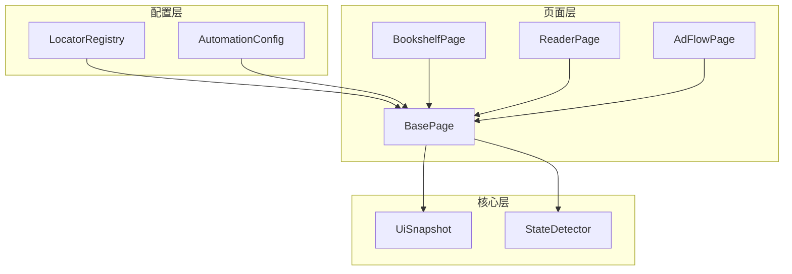
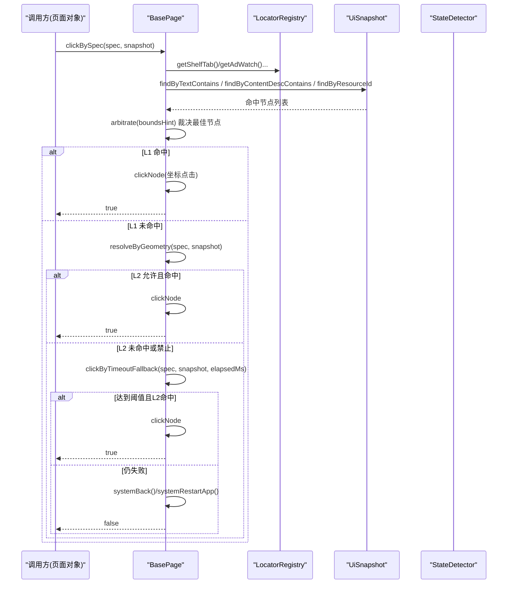
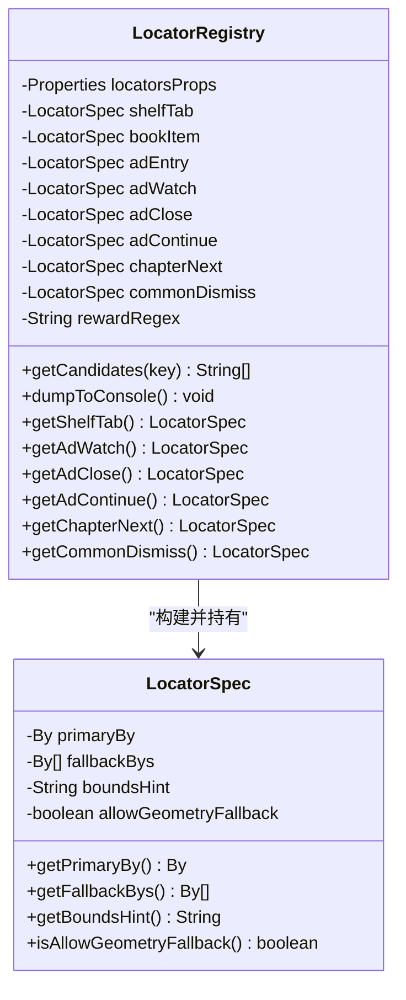
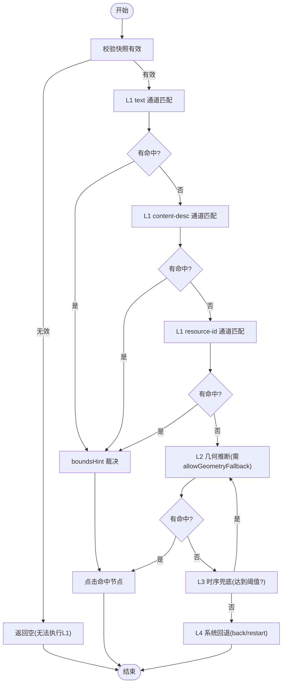
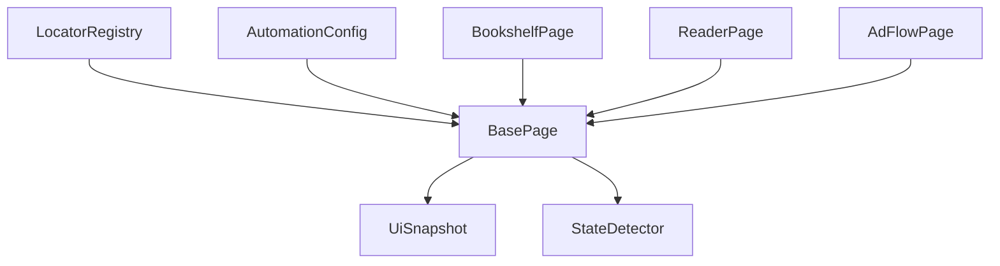

# LocatorRegistry定位器管理

<cite>
**本文引用的文件**
- [LocatorRegistry.java](file://automation/src/main/java/com/fanqie/auto/config/LocatorRegistry.java)
- [BasePage.java](file://automation/src/main/java/com/fanqie/auto/page/BasePage.java)
- [AutomationConfig.java](file://automation/src/main/java/com/fanqie/auto/config/AutomationConfig.java)
- [UiSnapshot.java](file://automation/src/main/java/com/fanqie/auto/core/UiSnapshot.java)
- [StateDetector.java](file://automation/src/main/java/com/fanqie/auto/core/StateDetector.java)
- [BookshelfPage.java](file://automation/src/main/java/com/fanqie/auto/page/BookshelfPage.java)
- [ReaderPage.java](file://automation/src/main/java/com/fanqie/auto/page/ReaderPage.java)
- [AdFlowPage.java](file://automation/src/main/java/com/fanqie/auto/page/AdFlowPage.java)
- [UiSnapshotTest.java](file://automation/src/test/java/com/fanqie/auto/core/UiSnapshotTest.java)
- [BasePageTest.java](file://automation/src/test/java/com/fanqie/auto/page/BasePageTest.java)
</cite>

## 目录
1. [简介](#简介)
2. [项目结构](#项目结构)
3. [核心组件](#核心组件)
4. [架构总览](#架构总览)
5. [详细组件分析](#详细组件分析)
6. [依赖关系分析](#依赖关系分析)
7. [性能考量](#性能考量)
8. [故障排除指南](#故障排除指南)
9. [结论](#结论)
10. [附录](#附录)

## 简介
本文件围绕 LocatorRegistry 类，系统性说明 UI 元素定位器的注册与管理机制。内容涵盖：
- 定位器规范设计：resource-id、text、className 等定位方式的支持与组合策略
- 定位器注册流程、查找算法与缓存机制
- 如何通过 locators.properties 定义和管理 UI 元素定位规则（含复杂选择器编写方法与命名约定）
- 定位器调试与故障排除方法（验证有效性、处理定位失败）
- 实际使用示例与最佳实践
- 针对不同 Android 版本与设备厂商的兼容性处理方法

## 项目结构
本项目采用分层组织：配置层（LocatorRegistry、AutomationConfig）、页面层（BasePage 与各 Page 实现）、核心层（UiSnapshot、StateDetector）。LocatorRegistry 负责从配置文件加载并构建各逻辑控件的定位规格（LocatorSpec），由 BasePage 在运行时执行四级降级定位链，结合 UiSnapshot 提供的内存节点表进行高效匹配。

图表来源
- [LocatorRegistry.java:1-300](file://automation/src/main/java/com/fanqie/auto/config/LocatorRegistry.java#L1-L300)
- [BasePage.java:1-516](file://automation/src/main/java/com/fanqie/auto/page/BasePage.java#L1-L516)
- [UiSnapshot.java:34-70](file://automation/src/main/java/com/fanqie/auto/core/UiSnapshot.java#L34-L70)
- [StateDetector.java:98-134](file://automation/src/main/java/com/fanqie/auto/core/StateDetector.java#L98-L134)

章节来源
- [LocatorRegistry.java:1-300](file://automation/src/main/java/com/fanqie/auto/config/LocatorRegistry.java#L1-L300)
- [BasePage.java:1-516](file://automation/src/main/java/com/fanqie/auto/page/BasePage.java#L1-L516)

## 核心组件
- LocatorRegistry：从 classpath 的 locators.properties 加载候选文案与正则，构建每个逻辑控件的 LocatorSpec（主定位器 + 备选定位器列表 + boundsHint + allowGeometryFallback），并提供便捷 getter。
- BasePage：实现四级定位降级链（L1 语义属性匹配 → L2 结构化几何推断 → L3 时序兜底 → L4 系统兜底），并通过 UiSnapshot 在内存中完成查找与裁决。
- UiSnapshot：解析 Appium UI XML，提供 text/content-desc/resource-id 查找、区域点击节点筛选、可点击祖先回溯等方法。
- StateDetector：负责获取并缓存 UI 快照、屏幕尺寸缓存与自愈，为上层提供稳定快照源。
- AutomationConfig：集中管理超时、阈值、行为开关等运行期配置，供 BasePage 的时序兜底等策略使用。

章节来源
- [LocatorRegistry.java:1-300](file://automation/src/main/java/com/fanqie/auto/config/LocatorRegistry.java#L1-L300)
- [BasePage.java:1-516](file://automation/src/main/java/com/fanqie/auto/page/BasePage.java#L1-L516)
- [UiSnapshot.java:34-70](file://automation/src/main/java/com/fanqie/auto/core/UiSnapshot.java#L34-L70)
- [StateDetector.java:98-134](file://automation/src/main/java/com/fanqie/auto/core/StateDetector.java#L98-L134)
- [AutomationConfig.java:1-306](file://automation/src/main/java/com/fanqie/auto/config/AutomationConfig.java#L1-L306)

## 架构总览
定位器体系以“配置驱动 + 内存快照 + 多级降级”为核心思想：
- 配置驱动：通过 locators.properties 维护文案候选集与正则，避免硬编码；
- 内存快照：BasePage 基于 UiSnapshot 的内存节点表执行查找，零额外 RPC；
- 多级降级：L1 语义匹配优先，L2 几何推断作为补充，L3 时序兜底应对延迟出现，L4 系统级恢复保障鲁棒性。

图表来源
- [BasePage.java:84-236](file://automation/src/main/java/com/fanqie/auto/page/BasePage.java#L84-L236)
- [LocatorRegistry.java:152-256](file://automation/src/main/java/com/fanqie/auto/config/LocatorRegistry.java#L152-L256)
- [UiSnapshot.java:34-70](file://automation/src/main/java/com/fanqie/auto/core/UiSnapshot.java#L34-L70)
- [StateDetector.java:98-134](file://automation/src/main/java/com/fanqie/auto/core/StateDetector.java#L98-L134)

## 详细组件分析

### LocatorRegistry：定位器注册与规格构建
- 配置文件加载：使用 UTF-8 Reader 加载 locators.properties，避免中文乱码导致 text 匹配失效；提供 dumpToConsole 用于启动时核验候选集。
- 候选集读取：getCandidates(key) 支持用 | 分隔的多值候选；提供 shelfTabTexts、adEntryTexts、adCloseTexts 等便捷方法。
- 正则提取：rewardRegex、readerProgressRegex、bookShortDramaRegex、bookNovelRegex 等用于状态识别与过滤。
- 规格构建：buildXxx() 方法为每个逻辑控件构造 LocatorSpec，包含 primaryBy（主 XPath）、fallbackBys（备选 XPath 列表）、boundsHint（区域比例描述）、allowGeometryFallback（是否允许几何兜底）。
- 安全策略：ad.watch 与 ad.continue 的 allowGeometryFallback 必须为 false，防止误点浪费配额；仅 ad.close 允许为 true，因为关闭按钮误点后果小于漏点卡死。

图表来源
- [LocatorRegistry.java:16-298](file://automation/src/main/java/com/fanqie/auto/config/LocatorRegistry.java#L16-L298)

章节来源
- [LocatorRegistry.java:16-298](file://automation/src/main/java/com/fanqie/auto/config/LocatorRegistry.java#L16-L298)

### BasePage：四级定位降级链与裁决
- L1 语义属性匹配：按 text 候选集 → content-desc 候选集 → resource-id（先精确后包含）三通道依次查找；命中多个时用 boundsHint 裁决。
- L2 结构化几何推断：当 L1 完全无命中时，筛选 clickable=true、areaRatio < 0.15、中心落在 boundsHint 目标区域的节点；必须先检查 allowGeometryFallback。
- L3 时序兜底：等待达到 adVideoTimeoutMs 后，即使 L1 找不到按钮也执行 L2 几何点击（同样受 allowGeometryFallback 约束）。
- L4 系统兜底：navigate().back() 强制退出；再失败则重启 App。
- 点击实现：clickNode 取命中节点的 bounds 中心坐标，若节点不可点击则回溯至最近可点击祖先；最终通过 GestureSupport.tapAtPixel 点击。

图表来源
- [BasePage.java:103-236](file://automation/src/main/java/com/fanqie/auto/page/BasePage.java#L103-L236)
- [BasePage.java:347-434](file://automation/src/main/java/com/fanqie/auto/page/BasePage.java#L347-L434)

章节来源
- [BasePage.java:103-236](file://automation/src/main/java/com/fanqie/auto/page/BasePage.java#L103-L236)
- [BasePage.java:347-434](file://automation/src/main/java/com/fanqie/auto/page/BasePage.java#L347-L434)

### 页面对象中的定位器使用示例
- BookshelfPage：切换书架 Tab 时，优先走 LocatorSpec 降级链；若未命中，再用 shelfTabTexts() 直接文案匹配；最后尝试底部区域几何查找带「书架」文案的节点。
- ReaderPage：打开广告入口时，优先走 LocatorSpec；未命中则用 adEntryTexts() 在底部区域查找最靠下的文案节点；点击下一章按钮时使用 chapterNext 的 LocatorSpec。
- AdFlowPage：点击「观看广告」按钮仅使用 L1 语义属性匹配（allowGeometryFallback=false），避免误点浪费每日配额。

章节来源
- [BookshelfPage.java:67-92](file://automation/src/main/java/com/fanqie/auto/page/BookshelfPage.java#L67-L92)
- [ReaderPage.java:203-225](file://automation/src/main/java/com/fanqie/auto/page/ReaderPage.java#L203-L225)
- [AdFlowPage.java:67-89](file://automation/src/main/java/com/fanqie/auto/page/AdFlowPage.java#L67-L89)

### 定位器规范与配置约定
- 资源标识与文本：
  - resource-id：优先使用稳定 id（如 RecyclerView 容器、书架锚点），可通过 UiSnapshot.findByResourceId 精确或包含匹配；
  - text：通过 locators.properties 的候选集（| 分隔）注入到 XPath 的 contains(@text,'...')；
  - className：XPath 中限定具体类名（如 android.widget.TextView/Button），提高匹配稳定性。
- 复杂选择器编写：
  - 使用 XPath 组合条件，例如同时限定 class 与 text/content-desc；
  - 通过 boundsHint 指定区域比例（如 y>0.8、x>0.8,y<0.2），辅助裁决与几何推断。
- 命名约定：
  - locators.properties 键名建议按功能域分组（如 shelf.tab.text、ad.close.text、common.dismiss.text）；
  - 正则键名清晰表达用途（如 ad.reward.regex、reader.progress.regex）。

章节来源
- [LocatorRegistry.java:97-137](file://automation/src/main/java/com/fanqie/auto/config/LocatorRegistry.java#L97-L137)
- [BasePage.java:441-514](file://automation/src/main/java/com/fanqie/auto/page/BasePage.java#L441-L514)
- [UiSnapshotTest.java:95-133](file://automation/src/test/java/com/fanqie/auto/core/UiSnapshotTest.java#L95-L133)

### 查找算法与缓存机制
- 查找算法：
  - L1 三通道优先级：text → content-desc → resource-id；
  - 多命中裁决：根据 boundsHint 选择最佳节点（底部、右上角、居中、面积最小等）；
  - L2 几何推断：在 boundsHint 区域内筛选 clickable、小面积节点。
- 缓存机制：
  - StateDetector 缓存屏幕尺寸，并在检测到节点越界时自动重取，避免横屏/旋转导致的比例失真；
  - UiSnapshot 将 XML 解析为内存节点表，后续查找均为内存操作，零额外 RPC。

章节来源
- [StateDetector.java:98-134](file://automation/src/main/java/com/fanqie/auto/core/StateDetector.java#L98-L134)
- [UiSnapshot.java:34-70](file://automation/src/main/java/com/fanqie/auto/core/UiSnapshot.java#L34-L70)
- [BasePage.java:347-434](file://automation/src/main/java/com/fanqie/auto/page/BasePage.java#L347-L434)

## 依赖关系分析
- LocatorRegistry 依赖 Selenium By 构建 XPath，依赖 Properties 加载配置；
- BasePage 依赖 LocatorRegistry 提供的 LocatorSpec，依赖 UiSnapshot 进行内存查找，依赖 AutomationConfig 获取超时阈值；
- 页面对象（BookshelfPage、ReaderPage、AdFlowPage）依赖 BasePage 的统一定位能力；
- StateDetector 提供稳定的 UiSnapshot 源，并缓存屏幕尺寸以提升性能与准确性。

图表来源
- [LocatorRegistry.java:1-300](file://automation/src/main/java/com/fanqie/auto/config/LocatorRegistry.java#L1-L300)
- [BasePage.java:1-516](file://automation/src/main/java/com/fanqie/auto/page/BasePage.java#L1-L516)
- [AutomationConfig.java:1-306](file://automation/src/main/java/com/fanqie/auto/config/AutomationConfig.java#L1-L306)
- [UiSnapshot.java:34-70](file://automation/src/main/java/com/fanqie/auto/core/UiSnapshot.java#L34-L70)
- [StateDetector.java:98-134](file://automation/src/main/java/com/fanqie/auto/core/StateDetector.java#L98-L134)

章节来源
- [LocatorRegistry.java:1-300](file://automation/src/main/java/com/fanqie/auto/config/LocatorRegistry.java#L1-L300)
- [BasePage.java:1-516](file://automation/src/main/java/com/fanqie/auto/page/BasePage.java#L1-L516)

## 性能考量
- 内存快照：BasePage 基于 UiSnapshot 的内存节点表执行查找，避免重复 RPC；
- 屏幕尺寸缓存：StateDetector 缓存屏幕尺寸并在必要时自愈，减少窗口查询开销；
- 几何推断限制：L2 仅在 allowGeometryFallback=true 时启用，降低误点风险的同时控制计算范围；
- 超时阈值：L3 时序兜底依据 AutomationConfig 的 adVideoTimeoutMs，避免长时间阻塞。

[本节为通用性能讨论，不直接分析具体文件]

## 故障排除指南
- 中文乱码问题：确保 locators.properties 使用 UTF-8 编码，并使用 InputStreamReader(UTF-8) 加载；
- 定位失败排查：
  - 使用 dumpToConsole 输出候选集，确认中文显示正常；
  - 通过 UiSnapshotTest 的 findByTextContains/findByResourceId/findByContentDescContains 验证匹配行为；
  - 检查 boundsHint 是否正确设置（如 y>0.8、x>0.8,y<0.2）；
- 误点防护：ad.watch/ad.continue 的 allowGeometryFallback 必须为 false，测试用例已覆盖该场景；
- 状态检测异常：核对 StateDetector 的 resource-id 占位值是否与真机一致，必要时校准；
- 截图差异验证：如需严格验证翻页成功，可开启 verifyPageTurnedByScreenshot（默认关闭以避免开销）。

章节来源
- [LocatorRegistry.java:71-93](file://automation/src/main/java/com/fanqie/auto/config/LocatorRegistry.java#L71-L93)
- [UiSnapshotTest.java:95-199](file://automation/src/test/java/com/fanqie/auto/core/UiSnapshotTest.java#L95-L199)
- [BasePageTest.java:49-61](file://automation/src/test/java/com/fanqie/auto/page/BasePageTest.java#L49-L61)
- [AutomationConfig.java:291-306](file://automation/src/main/java/com/fanqie/auto/config/AutomationConfig.java#L291-L306)

## 结论
LocatorRegistry 通过配置驱动的候选集与正则，结合 BasePage 的四级定位降级链，实现了高鲁棒性的 UI 元素定位。其设计强调：
- 配置与代码解耦：文案与阈值集中在 properties，便于维护；
- 内存快照与多级降级：提升性能与容错；
- 误点防护与时序兜底：保障关键路径的稳定性；
- 可调试性与可测试性：提供控制台输出与丰富测试用例。

[本节为总结性内容，不直接分析具体文件]

## 附录
- 实际使用示例：
  - 书架 Tab 切换：通过 LocatorSpec 降级链 + 文案候选集 + 底部几何查找；
  - 广告入口点击：优先 LocatorSpec，其次底部文案匹配；
  - 观看广告按钮：仅 L1 语义匹配，禁用几何兜底；
- 最佳实践：
  - 优先使用稳定 resource-id；
  - 文案候选集用 | 分隔，保持简洁明确；
  - boundsHint 使用比例而非绝对像素，适配不同分辨率；
  - 对高风险操作（如观看广告）禁用几何兜底；
- 兼容性处理：
  - 针对 Android 版本差异，通过多候选集与 XPath 泛化匹配；
  - 针对设备厂商定制 UI，利用几何推断与区域限制增强鲁棒性；
  - 屏幕尺寸缓存与自愈机制，适应横屏/折叠屏变化。

[本节为概念性内容，不直接分析具体文件]