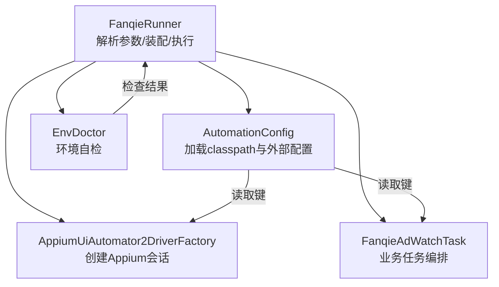
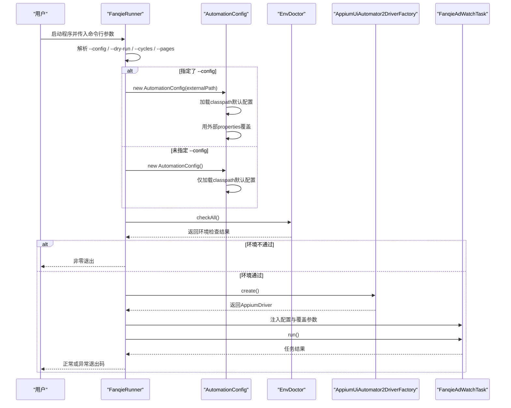
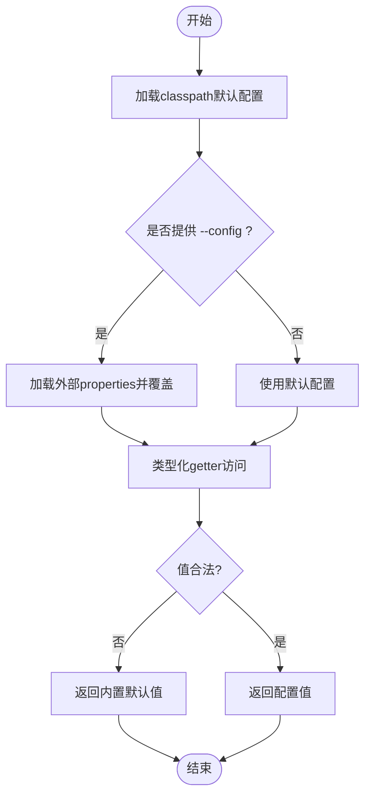
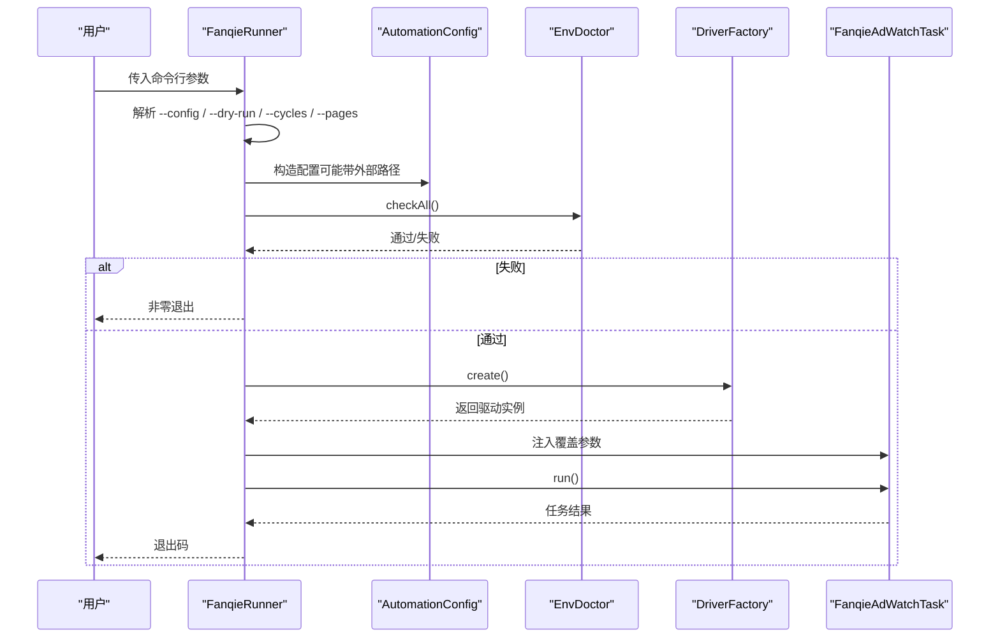
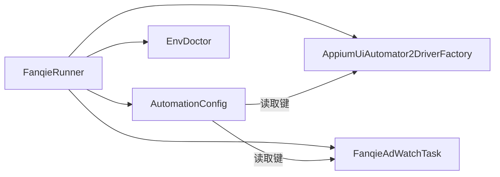

# 动态配置覆盖

<cite>
**本文引用的文件**
- [FanqieRunner.java](file://automation/src/main/java/com/fanqie/auto/FanqieRunner.java)
- [AutomationConfig.java](file://automation/src/main/java/com/fanqie/auto/config/AutomationConfig.java)
- [EnvDoctor.java](file://automation/src/main/java/com/fanqie/auto/core/EnvDoctor.java)
- [AppiumUiAutomator2DriverFactory.java](file://automation/src/main/java/com/fanqie/auto/core/AppiumUiAutomator2DriverFactory.java)
- [FanqieAdWatchTask.java](file://automation/src/main/java/com/fanqie/auto/task/FanqieAdWatchTask.java)
- [ConfigTest.java](file://automation/src/test/java/com/fanqie/auto/config/ConfigTest.java)
- [pom.xml](file://automation/pom.xml)
</cite>

## 目录
1. [简介](#简介)
2. [项目结构](#项目结构)
3. [核心组件](#核心组件)
4. [架构总览](#架构总览)
5. [详细组件分析](#详细组件分析)
6. [依赖关系分析](#依赖关系分析)
7. [性能与稳定性考量](#性能与稳定性考量)
8. [故障排查指南](#故障排查指南)
9. [结论](#结论)
10. [附录：使用示例与最佳实践](#附录使用示例与最佳实践)

## 简介
本文件面向“动态配置覆盖”机制，说明如何通过命令行参数与环境变量（以配置文件为主）在运行时调整系统行为。重点包括：
- --config 参数的使用方法、外部配置文件路径与格式要求
- 配置项优先级规则：命令行参数 > 外部配置文件 > classpath 配置文件 > 内置默认值
- 配置验证与错误处理：非法值的检测与回退策略
- CI/CD 集成建议、配置管理与版本控制
- 配置迁移与向后兼容性考虑

该机制通过统一的配置加载器与启动入口装配流程实现，确保在不重新编译的前提下灵活调整运行参数。

## 项目结构
本项目采用按功能域划分的模块化结构：
- 启动与装配：FanqieRunner 负责解析命令行参数、装配各组件并执行主任务
- 配置中心：AutomationConfig 统一从 classpath 与外部 properties 加载配置，提供类型化访问器
- 环境自检：EnvDoctor 在执行前检查运行环境是否满足要求
- 驱动工厂：AppiumUiAutomator2DriverFactory 根据配置创建 Appium 会话
- 任务编排：FanqieAdWatchTask 等任务类消费配置并执行业务流程
- 测试：ConfigTest 对配置加载、覆盖与兜底行为进行断言

图表来源
- [FanqieRunner.java:41-239](file://automation/src/main/java/com/fanqie/auto/FanqieRunner.java#L41-L239)
- [AutomationConfig.java:25-63](file://automation/src/main/java/com/fanqie/auto/config/AutomationConfig.java#L25-L63)
- [EnvDoctor.java:48-61](file://automation/src/main/java/com/fanqie/auto/core/EnvDoctor.java#L48-L61)
- [AppiumUiAutomator2DriverFactory.java:130-155](file://automation/src/main/java/com/fanqie/auto/core/AppiumUiAutomator2DriverFactory.java#L130-L155)
- [FanqieAdWatchTask.java:61-90](file://automation/src/main/java/com/fanqie/auto/task/FanqieAdWatchTask.java#L61-L90)

章节来源
- [FanqieRunner.java:41-239](file://automation/src/main/java/com/fanqie/auto/FanqieRunner.java#L41-L239)
- [AutomationConfig.java:25-63](file://automation/src/main/java/com/fanqie/auto/config/AutomationConfig.java#L25-L63)

## 核心组件
- 配置加载器 AutomationConfig
  - 从 classpath 的 automation.properties 加载默认配置
  - 支持通过外部路径覆盖（--config），先加载默认再覆盖
  - 提供类型化 getter（字符串、整数、长整型、浮点、布尔），非法值安全回退到默认值
  - 暴露 rawProperties() 供内部模块直接读取原始属性
- 启动器 FanqieRunner
  - 解析命令行参数：--doctor、--dry-run、--config <path>、--cycles N、--pages N、--reset-progress
  - 根据 --config 决定构造 AutomationConfig 的方式
  - 应用 --cycles/--pages 覆盖到任务对象
  - 执行环境自检、创建驱动、注册组件、启动心跳、执行任务
- 环境自检 EnvDoctor
  - 检查 Android SDK、adb、设备连接、Appium Server、目标应用安装状态
  - 任一硬性检查失败则非零退出
- 驱动工厂 AppiumUiAutomator2DriverFactory
  - 依据配置设置平台名、自动化名称、设备 UDID、noReset、超时等能力
  - 针对华为/鸿蒙设备启用特定能力以提升稳定性
- 任务 FanqieAdWatchTask
  - 接收命令行覆盖的外层循环次数与每轮翻页次数
  - 基于配置驱动业务流程（如广告观看、阅读翻页、熔断保护等）

章节来源
- [AutomationConfig.java:25-108](file://automation/src/main/java/com/fanqie/auto/config/AutomationConfig.java#L25-L108)
- [FanqieRunner.java:41-239](file://automation/src/main/java/com/fanqie/auto/FanqieRunner.java#L41-L239)
- [EnvDoctor.java:48-61](file://automation/src/main/java/com/fanqie/auto/core/EnvDoctor.java#L48-L61)
- [AppiumUiAutomator2DriverFactory.java:130-155](file://automation/src/main/java/com/fanqie/auto/core/AppiumUiAutomator2DriverFactory.java#L130-L155)
- [FanqieAdWatchTask.java:61-90](file://automation/src/main/java/com/fanqie/auto/task/FanqieAdWatchTask.java#L61-L90)

## 架构总览
下图展示动态配置覆盖在启动时的调用链路与数据流：

图表来源
- [FanqieRunner.java:41-239](file://automation/src/main/java/com/fanqie/auto/FanqieRunner.java#L41-L239)
- [AutomationConfig.java:25-63](file://automation/src/main/java/com/fanqie/auto/config/AutomationConfig.java#L25-L63)
- [EnvDoctor.java:48-61](file://automation/src/main/java/com/fanqie/auto/core/EnvDoctor.java#L48-L61)
- [AppiumUiAutomator2DriverFactory.java:130-155](file://automation/src/main/java/com/fanqie/auto/core/AppiumUiAutomator2DriverFactory.java#L130-L155)
- [FanqieAdWatchTask.java:61-90](file://automation/src/main/java/com/fanqie/auto/task/FanqieAdWatchTask.java#L61-L90)

## 详细组件分析

### 配置加载与覆盖机制（AutomationConfig）
- 加载顺序
  - 首先从 classpath 加载 automation.properties 作为基础配置
  - 若提供外部路径，则以该 properties 文件覆盖已加载的配置
  - 任何缺失键均回退到内置默认值，不会抛出异常
- 类型化访问与安全回退
  - 整数、长整型、浮点数解析失败时记录警告并回退默认值
  - 布尔与字符串直接取用，空值回退默认值
- 关键配置项（示例）
  - appium.*：服务器地址、平台名、自动化名称、设备 UDID、noReset、超时等
  - timing.*：轮询间隔、状态检测超时、动作超时、应用启动超时、广告视频超时等
  - flow.*：每轮页数、最大广告轮次、目标免广告时长、墙钟熔断等
  - reader.*：翻页策略、点击比例、滑动百分比与时长按
  - runtime.dry.run：干跑模式开关
- 对外暴露
  - 提供 rawProperties() 供内部组件直接读取原始属性

图表来源
- [AutomationConfig.java:25-108](file://automation/src/main/java/com/fanqie/auto/config/AutomationConfig.java#L25-L108)

章节来源
- [AutomationConfig.java:25-108](file://automation/src/main/java/com/fanqie/auto/config/AutomationConfig.java#L25-L108)
- [ConfigTest.java:35-81](file://automation/src/test/java/com/fanqie/auto/config/ConfigTest.java#L35-L81)

### 启动装配与参数覆盖（FanqieRunner）
- 支持的命令行参数
  - --doctor：仅环境自检，不创建 session
  - --dry-run：只连接并 dump UI 树，不执行点击
  - --config <path>：使用外部配置文件覆盖默认值
  - --cycles <N>：覆盖外层循环次数
  - --pages <N>：覆盖每轮翻页次数
  - --reset-progress：清除累计进度从零开始
- 装配流程
  - 解析参数后，根据 --config 选择构造 AutomationConfig 的方式
  - 执行环境自检，失败则非零退出
  - 创建 DriverFactory 并初始化日志、手势、状态检测、等待等组件
  - 将 --cycles/--pages 覆盖应用到任务对象
  - 启动心跳保活，执行任务，finally 中保证资源释放

图表来源
- [FanqieRunner.java:41-239](file://automation/src/main/java/com/fanqie/auto/FanqieRunner.java#L41-L239)
- [FanqieAdWatchTask.java:61-90](file://automation/src/main/java/com/fanqie/auto/task/FanqieAdWatchTask.java#L61-L90)

章节来源
- [FanqieRunner.java:41-239](file://automation/src/main/java/com/fanqie/auto/FanqieRunner.java#L41-L239)
- [FanqieAdWatchTask.java:61-90](file://automation/src/main/java/com/fanqie/auto/task/FanqieAdWatchTask.java#L61-L90)

### 环境自检（EnvDoctor）
- 检查项包括 Android SDK、adb 版本、设备连接、Appium Server 就绪、目标应用安装
- 任一硬性检查失败即终止运行，避免后续步骤因环境问题失败
- 与配置联动：Appium 相关检查依赖配置中的服务器地址、平台名等

章节来源
- [EnvDoctor.java:48-61](file://automation/src/main/java/com/fanqie/auto/core/EnvDoctor.java#L48-L61)

### 驱动工厂（AppiumUiAutomator2DriverFactory）
- 依据配置设置 Appium 能力：平台名、自动化名称、设备 UDID、noReset、命令超时
- 针对华为/鸿蒙设备启用特定能力，提升稳定性
- 性能优化：禁用 resource-id 自动补全、忽略隐藏 API 策略、抑制杀死 adb server

章节来源
- [AppiumUiAutomator2DriverFactory.java:130-155](file://automation/src/main/java/com/fanqie/auto/core/AppiumUiAutomator2DriverFactory.java#L130-L155)

## 依赖关系分析
- 低耦合高内聚
  - FanqieRunner 仅负责装配与流程控制，具体逻辑下沉至各组件
  - AutomationConfig 集中管理配置，所有组件通过 getter 获取，避免魔法数字
- 外部依赖
  - Appium Java Client 用于驱动创建与会话管理
  - SLF4J 简单实现用于日志输出
  - JUnit 5 用于离线单元测试（不影响生产运行）

图表来源
- [FanqieRunner.java:41-239](file://automation/src/main/java/com/fanqie/auto/FanqieRunner.java#L41-L239)
- [AutomationConfig.java:25-108](file://automation/src/main/java/com/fanqie/auto/config/AutomationConfig.java#L25-L108)
- [AppiumUiAutomator2DriverFactory.java:130-155](file://automation/src/main/java/com/fanqie/auto/core/AppiumUiAutomator2DriverFactory.java#L130-L155)
- [FanqieAdWatchTask.java:61-90](file://automation/src/main/java/com/fanqie/auto/task/FanqieAdWatchTask.java#L61-L90)

章节来源
- [pom.xml:50-83](file://automation/pom.xml#L50-L83)

## 性能与稳定性考量
- 超时与重试
  - 通过 timing.* 配置精细控制轮询间隔、状态检测与动作超时，避免长时间阻塞
  - 墙钟熔断 flow.max.wall.clock.ms 防止无限期占用设备
- 设备与驱动稳定性
  - noReset=true 保留登录态与书架数据，适合长任务
  - 华为/鸿蒙设备启用 ignoreHiddenApiPolicyError、suppressKillServer 等能力
  - 禁用 resource-id 自动补全提升定位速度
- 资源释放
  - finally 块与 ShutdownHook 双重保障 logger.stop() 与 driver.quit()，避免 session 泄漏

[本节为通用指导，不直接分析具体文件]

## 故障排查指南
- 常见错误与提示
  - 未知命令行参数：打印用法并退出
  - 非法数值：记录警告并回退默认值（例如整数/浮点解析失败）
  - 外部配置文件缺失：记录警告并保留 classpath 默认值
  - 环境自检失败：非零退出，需修复后再运行
- 调试技巧
  - 使用 --dry-run 仅连接并 dump UI 树，不执行点击，便于快速验证环境与定位
  - 使用 --doctor 仅做环境自检，不创建 session
  - 使用 --reset-progress 清除累计进度，从零开始复现问题
- 日志与快照
  - 运行异常时会捕获快照，便于回溯问题现场

章节来源
- [FanqieRunner.java:41-239](file://automation/src/main/java/com/fanqie/auto/FanqieRunner.java#L41-L239)
- [AutomationConfig.java:67-108](file://automation/src/main/java/com/fanqie/auto/config/AutomationConfig.java#L67-L108)

## 结论
本项目通过统一的配置加载器与启动装配流程实现了灵活的动态配置覆盖机制。借助 --config 外部配置文件与少量关键命令行参数，可在不重新编译的情况下快速调整运行行为；同时通过严格的类型化访问与安全回退策略，确保配置错误不会导致崩溃。结合环境自检与健壮的资源释放，系统在开发、测试与生产环境中均具备良好可维护性与稳定性。

[本节为总结性内容，不直接分析具体文件]

## 附录：使用示例与最佳实践

### 配置项优先级规则
- 优先级从高到低：命令行参数 > 外部配置文件（--config） > classpath 配置文件（automation.properties） > 内置默认值
- 示例
  - 命令行覆盖：--cycles 10 会覆盖 flow.outer.cycles
  - 外部配置覆盖：在外部 properties 中设置 driver.type=harmony_hdc，将覆盖 classpath 默认值
  - 缺失键：任意缺失键均回退到内置默认值，不会抛异常

章节来源
- [FanqieRunner.java:41-239](file://automation/src/main/java/com/fanqie/auto/FanqieRunner.java#L41-L239)
- [AutomationConfig.java:25-108](file://automation/src/main/java/com/fanqie/auto/config/AutomationConfig.java#L25-L108)
- [ConfigTest.java:59-81](file://automation/src/test/java/com/fanqie/auto/config/ConfigTest.java#L59-L81)

### --config 参数使用指南
- 作用：指定外部 properties 文件路径，覆盖 classpath 默认配置
- 格式：标准 Java Properties 格式，UTF-8 编码
- 路径：支持绝对路径与相对路径
- 行为：先加载 classpath 默认配置，再用外部文件覆盖；外部文件不存在时保留默认值并记录警告

章节来源
- [FanqieRunner.java:41-239](file://automation/src/main/java/com/fanqie/auto/FanqieRunner.java#L41-L239)
- [AutomationConfig.java:25-63](file://automation/src/main/java/com/fanqie/auto/config/AutomationConfig.java#L25-L63)

### 典型使用场景
- 开发环境快速调试
  - 使用 --dry-run 仅连接并 dump UI 树，不执行点击，快速验证环境与定位
  - 使用 --config dev.properties 覆盖超时与页面策略，缩短反馈周期
- 测试环境批量配置
  - 准备 test.properties，集中设置设备 UDID、超时、轮次等
  - 通过 --config test.properties 一键切换，配合 --cycles/--pages 控制规模
- 生产环境参数调优
  - 使用 prod.properties 调整 wall clock 熔断、noReset、超时等关键指标
  - 结合 --reset-progress 在必要时重置累计进度，避免历史状态影响

章节来源
- [FanqieRunner.java:41-239](file://automation/src/main/java/com/fanqie/auto/FanqieRunner.java#L41-L239)
- [AutomationConfig.java:180-248](file://automation/src/main/java/com/fanqie/auto/config/AutomationConfig.java#L180-L248)

### 配置验证与错误处理
- 类型安全
  - 整数、长整型、浮点解析失败时记录警告并回退默认值
  - 布尔与字符串直接取用，空值回退默认值
- 外部文件缺失
  - 记录警告并保留 classpath 默认值，不中断运行
- 环境自检失败
  - 非零退出，提示修复后再运行

章节来源
- [AutomationConfig.java:67-108](file://automation/src/main/java/com/fanqie/auto/config/AutomationConfig.java#L67-L108)
- [EnvDoctor.java:48-61](file://automation/src/main/java/com/fanqie/auto/core/EnvDoctor.java#L48-L61)

### CI/CD 流水线集成
- 构建阶段
  - 使用 Maven 构建 fat-jar，便于脱离 IDE 运行
  - 固定依赖版本（Selenium BOM、Appium Java Client）确保重建一致性
- 运行阶段
  - 通过环境变量或 CI 密钥注入外部配置文件路径
  - 使用 --config 指定不同环境的 properties 文件
  - 使用 --doctor 预检环境，失败即中止流水线
- 产物与日志
  - 收集运行日志与快照，便于问题回溯
  - 将外部配置文件纳入版本控制，按环境分支管理

章节来源
- [pom.xml:100-175](file://automation/pom.xml#L100-L175)
- [FanqieRunner.java:41-239](file://automation/src/main/java/com/fanqie/auto/FanqieRunner.java#L41-L239)

### 配置管理与版本控制
- 建议将 automation.properties 与外部 properties 文件纳入版本控制
- 使用分支或标签区分不同环境配置（dev/test/prod）
- 变更审计：每次修改配置应附带变更说明与影响评估
- 敏感信息：避免在仓库中存放敏感凭据，改用 CI 密钥或外部配置服务

[本节为通用指导，不直接分析具体文件]

### 配置迁移与向后兼容
- 新增键
  - 新增配置项需提供合理默认值，确保旧配置仍可正常运行
  - 通过测试用例验证新增键的默认行为与覆盖行为
- 废弃键
  - 保留旧键的兼容读取，记录弃用警告，逐步引导迁移
- 迁移策略
  - 提供迁移脚本或文档，帮助从旧版配置迁移到新版
  - 在 CI 中增加配置校验步骤，提前发现不兼容变更

章节来源
- [ConfigTest.java:35-81](file://automation/src/test/java/com/fanqie/auto/config/ConfigTest.java#L35-L81)