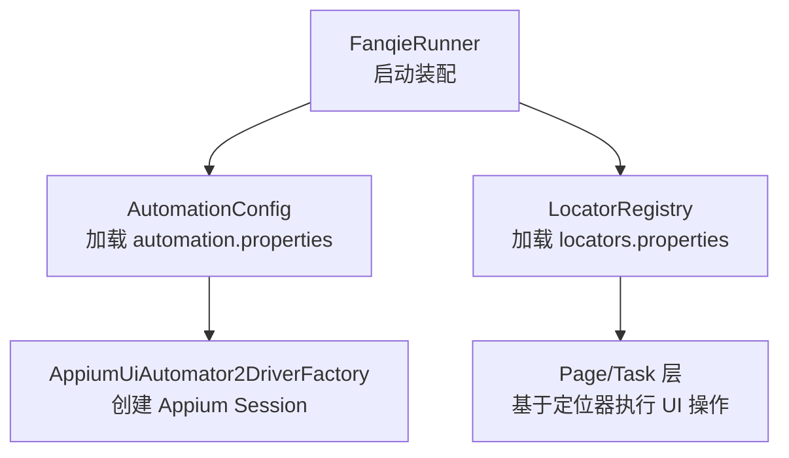
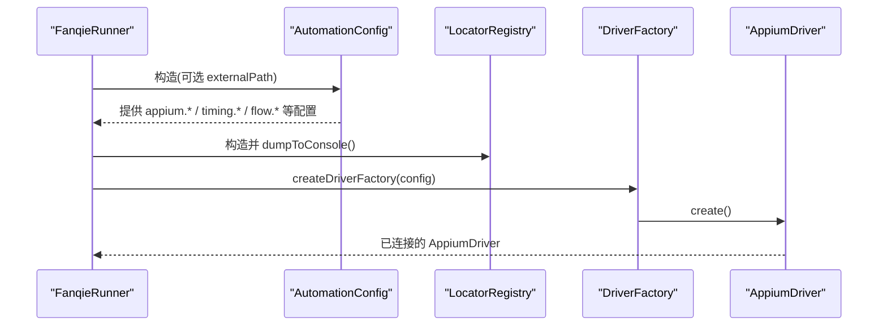
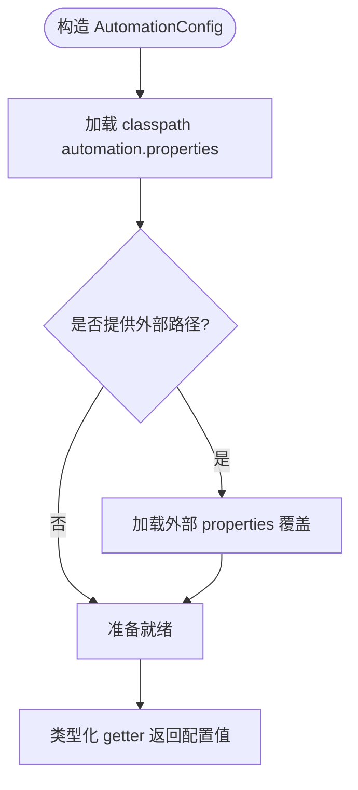
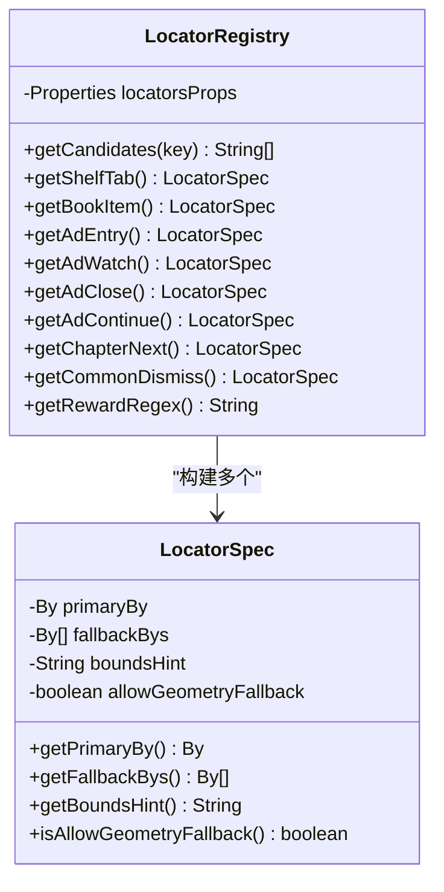
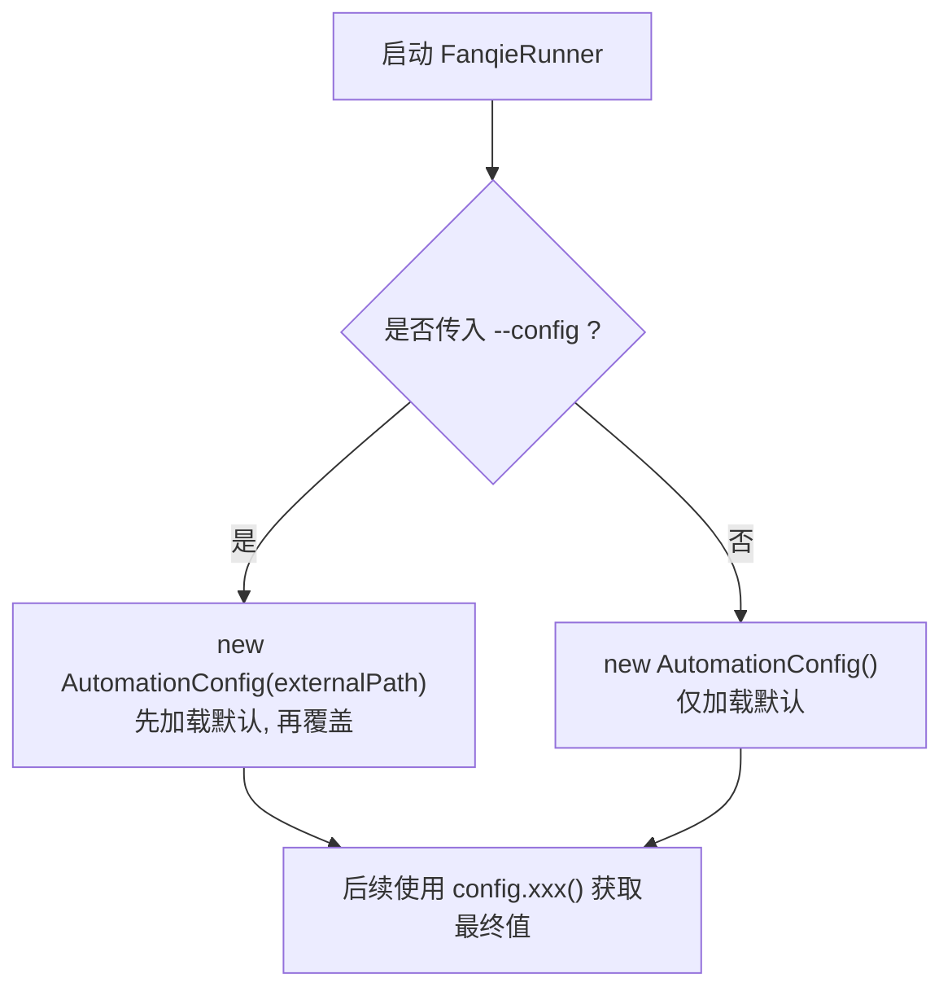
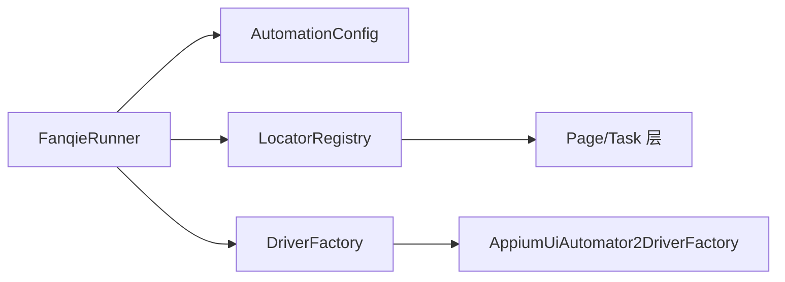

# 配置文件结构

<cite>
**本文引用的文件**
- [AutomationConfig.java](file://automation/src/main/java/com/fanqie/auto/config/AutomationConfig.java)
- [LocatorRegistry.java](file://automation/src/main/java/com/fanqie/auto/config/LocatorRegistry.java)
- [FanqieRunner.java](file://automation/src/main/java/com/fanqie/auto/FanqieRunner.java)
- [AppiumUiAutomator2DriverFactory.java](file://automation/src/main/java/com/fanqie/auto/core/AppiumUiAutomator2DriverFactory.java)
- [DriverFactory.java](file://automation/src/main/java/com/fanqie/auto/core/DriverFactory.java)
- [ConfigTest.java](file://automation/src/test/java/com/fanqie/auto/config/ConfigTest.java)
</cite>

## 目录
1. [简介](#简介)
2. [项目结构与配置位置](#项目结构与配置位置)
3. [核心组件与职责分工](#核心组件与职责分工)
4. [架构总览](#架构总览)
5. [详细组件分析](#详细组件分析)
6. [依赖关系分析](#依赖关系分析)
7. [性能与稳定性考量](#性能与稳定性考量)
8. [故障排查指南](#故障排查指南)
9. [结论](#结论)
10. [附录：配置项清单与模板](#附录配置项清单与模板)

## 简介
本文件面向自动化测试工程中的两类核心配置文件：
- automation.properties：应用运行参数、设备连接、超时设置等系统级配置。
- locators.properties：UI 元素的定位规则定义（文案候选集、正则表达式、区域提示等）。

通过 AutomationConfig 与 LocatorRegistry 两个类，工程实现了“配置即代码”的集中式管理：所有运行时阈值、流程控制、设备参数均从统一入口读取；UI 控件的定位策略以可维护的候选列表形式组织，避免硬编码 XPath 或文本。

## 项目结构与配置位置
- 配置文件位于 resources 目录下，由类加载器在运行时加载：
  - automation.properties：被 AutomationConfig 加载，提供 Appium、时序、流程、阅读页翻页、验证与调试等配置。
  - locators.properties：被 LocatorRegistry 加载，提供书架、书籍条目、广告相关、阅读菜单、开屏跳过、每日配额耗尽等 UI 元素候选集与正则。
- 启动时 FanqieRunner 会装配配置并初始化 LocatorRegistry，打印候选集以校验中文编码是否正确。

图表来源
- [FanqieRunner.java:89-121](file://automation/src/main/java/com/fanqie/auto/FanqieRunner.java#L89-L121)
- [AutomationConfig.java:25-42](file://automation/src/main/java/com/fanqie/auto/config/AutomationConfig.java#L25-L42)
- [LocatorRegistry.java:52-65](file://automation/src/main/java/com/fanqie/auto/config/LocatorRegistry.java#L52-L65)
- [AppiumUiAutomator2DriverFactory.java:44-62](file://automation/src/main/java/com/fanqie/auto/core/AppiumUiAutomator2DriverFactory.java#L44-L62)

章节来源
- [FanqieRunner.java:89-121](file://automation/src/main/java/com/fanqie/auto/FanqieRunner.java#L89-L121)
- [AutomationConfig.java:25-42](file://automation/src/main/java/com/fanqie/auto/config/AutomationConfig.java#L25-L42)
- [LocatorRegistry.java:52-65](file://automation/src/main/java/com/fanqie/auto/config/LocatorRegistry.java#L52-L65)

## 核心组件与职责分工
- AutomationConfig
  - 负责从 classpath 的 automation.properties 加载默认配置，支持外部 properties 覆盖。
  - 提供类型安全的 getter（字符串、整数、长整型、浮点、布尔），缺失键或非法值时回退到内置默认值，不抛异常。
  - 涵盖 Appium 连接、驱动类型、时序、流程控制、阅读页翻页策略、验证与调试开关等。
- LocatorRegistry
  - 负责从 locators.properties 加载 UI 控件的候选文案、正则表达式与区域提示。
  - 为每个逻辑控件构建 LocatorSpec（主定位器 + 备选定位器 + boundsHint + 是否允许几何兜底）。
  - 对 ad.watch/ad.continue 禁用几何兜底以避免误点浪费配额；ad.close 允许几何兜底以降低漏点风险。

章节来源
- [AutomationConfig.java:67-108](file://automation/src/main/java/com/fanqie/auto/config/AutomationConfig.java#L67-L108)
- [AutomationConfig.java:112-304](file://automation/src/main/java/com/fanqie/auto/config/AutomationConfig.java#L112-L304)
- [LocatorRegistry.java:16-25](file://automation/src/main/java/com/fanqie/auto/config/LocatorRegistry.java#L16-L25)
- [LocatorRegistry.java:52-65](file://automation/src/main/java/com/fanqie/auto/config/LocatorRegistry.java#L52-L65)
- [LocatorRegistry.java:95-148](file://automation/src/main/java/com/fanqie/auto/config/LocatorRegistry.java#L95-L148)
- [LocatorRegistry.java:152-256](file://automation/src/main/java/com/fanqie/auto/config/LocatorRegistry.java#L152-L256)

## 架构总览
下图展示了配置加载与使用的主路径：启动器解析命令行参数后装配配置，随后根据 driver.type 选择驱动工厂创建 Appium session，同时初始化 LocatorRegistry 并输出候选集用于校验。

图表来源
- [FanqieRunner.java:89-121](file://automation/src/main/java/com/fanqie/auto/FanqieRunner.java#L89-L121)
- [AutomationConfig.java:25-42](file://automation/src/main/java/com/fanqie/auto/config/AutomationConfig.java#L25-L42)
- [LocatorRegistry.java:52-65](file://automation/src/main/java/com/fanqie/auto/config/LocatorRegistry.java#L52-L65)
- [AppiumUiAutomator2DriverFactory.java:44-62](file://automation/src/main/java/com/fanqie/auto/core/AppiumUiAutomator2DriverFactory.java#L44-L62)

## 详细组件分析

### AutomationConfig：系统级配置加载与覆盖机制
- 加载优先级
  - 首先从 classpath 加载 automation.properties 作为默认值。
  - 若提供外部路径（如 --config），则再加载该外部文件进行覆盖。
  - 缺失键或非法值将回退到内置默认值，保证健壮性。
- 关键能力
  - 类型化 getter：getString/getInt/getLong/getDouble/getBoolean，带默认值与异常保护。
  - rawProperties：暴露原始 Properties，供内部模块（如 LocatorRegistry）直接访问。
- 典型用途
  - Appium 连接：server URL、平台名、自动化名称、设备 UDID、包名、noReset、命令超时、UiAutomator2 Server 安装/启动超时、是否跳过安装/初始化、保持屏幕常亮。
  - 驱动类型：driver.type（当前 uiautomator2，预留 harmony_hdc 扩展）。
  - 时序：轮询间隔、状态检测超时、动作超时、应用启动超时、广告视频/关闭就绪超时、最大停留时间、心跳间隔。
  - 流程：每轮页面数、每进入广告的最大轮次、总广告轮次上限、目标免费分钟数、奖励兜底估值、墙钟熔断、外层循环次数、连续错误上限、恢复重试上限。
  - 阅读页翻页：翻页策略（tap/swipe）、点击比例、滑动百分比与时长。
  - 验证与调试：截图验证翻页、dry-run 模式。

图表来源
- [AutomationConfig.java:25-42](file://automation/src/main/java/com/fanqie/auto/config/AutomationConfig.java#L25-L42)
- [AutomationConfig.java:67-108](file://automation/src/main/java/com/fanqie/auto/config/AutomationConfig.java#L67-L108)

章节来源
- [AutomationConfig.java:25-42](file://automation/src/main/java/com/fanqie/auto/config/AutomationConfig.java#L25-L42)
- [AutomationConfig.java:67-108](file://automation/src/main/java/com/fanqie/auto/config/AutomationConfig.java#L67-L108)
- [AutomationConfig.java:112-304](file://automation/src/main/java/com/fanqie/auto/config/AutomationConfig.java#L112-L304)
- [ConfigTest.java:60-81](file://automation/src/test/java/com/fanqie/auto/config/ConfigTest.java#L60-L81)

### LocatorRegistry：UI 元素定位规则注册表
- 加载与编码
  - 使用 UTF-8 Reader 加载 locators.properties，避免 ISO-8859-1 导致的中文乱码。
  - 启动时 dumpToConsole 输出候选集，便于人工核验。
- 候选集与正则
  - 书架 Tab、书籍条目 ID、阅读进度正则、阅读容器 ID、短剧/小说识别正则。
  - 广告入口、观看广告、关闭按钮（含 content-desc）、继续获取免费时长、下一章、通用关闭弹窗、阅读菜单、开屏跳过、每日配额耗尽提示。
  - 奖励提取正则（用于从快照中抽取奖励分钟数）。
- LocatorSpec 设计
  - primaryBy：主定位器（最高优先级）。
  - fallbackBys：备选定位器列表（逐级尝试）。
  - boundsHint：目标区域比例描述（如右上角 x>0.8,y<0.2）。
  - allowGeometryFallback：是否允许 L2 几何兜底（ad.watch/ad.continue 必须 false；ad.close 允许 true）。

图表来源
- [LocatorRegistry.java:16-25](file://automation/src/main/java/com/fanqie/auto/config/LocatorRegistry.java#L16-L25)
- [LocatorRegistry.java:52-65](file://automation/src/main/java/com/fanqie/auto/config/LocatorRegistry.java#L52-L65)
- [LocatorRegistry.java:95-148](file://automation/src/main/java/com/fanqie/auto/config/LocatorRegistry.java#L95-L148)
- [LocatorRegistry.java:152-256](file://automation/src/main/java/com/fanqie/auto/config/LocatorRegistry.java#L152-L256)
- [LocatorRegistry.java:271-298](file://automation/src/main/java/com/fanqie/auto/config/LocatorRegistry.java#L271-L298)

章节来源
- [LocatorRegistry.java:52-65](file://automation/src/main/java/com/fanqie/auto/config/LocatorRegistry.java#L52-L65)
- [LocatorRegistry.java:95-148](file://automation/src/main/java/com/fanqie/auto/config/LocatorRegistry.java#L95-L148)
- [LocatorRegistry.java:152-256](file://automation/src/main/java/com/fanqie/auto/config/LocatorRegistry.java#L152-L256)
- [ConfigTest.java:85-131](file://automation/src/test/java/com/fanqie/auto/config/ConfigTest.java#L85-L131)

### 配置加载优先级与覆盖机制
- 优先级顺序
  1) classpath 默认 automation.properties
  2) 外部 properties（--config 指定）覆盖默认值
  3) 缺失键或非法值回退到内置默认值
- 覆盖范围
  - 仅 automation.properties 支持外部覆盖；locators.properties 目前仅从 classpath 加载。
- 命令行覆盖
  - --dry-run 可在运行时切换 dry-run 模式（不影响配置文件内容）。
  - --config 指定外部 properties 路径实现动态覆盖。

图表来源
- [FanqieRunner.java:89-94](file://automation/src/main/java/com/fanqie/auto/FanqieRunner.java#L89-L94)
- [AutomationConfig.java:25-42](file://automation/src/main/java/com/fanqie/auto/config/AutomationConfig.java#L25-L42)
- [ConfigTest.java:60-81](file://automation/src/test/java/com/fanqie/auto/config/ConfigTest.java#L60-L81)

章节来源
- [FanqieRunner.java:89-94](file://automation/src/main/java/com/fanqie/auto/FanqieRunner.java#L89-L94)
- [AutomationConfig.java:25-42](file://automation/src/main/java/com/fanqie/auto/config/AutomationConfig.java#L25-L42)
- [ConfigTest.java:60-81](file://automation/src/test/java/com/fanqie/auto/config/ConfigTest.java#L60-L81)

## 依赖关系分析
- FanqieRunner 依赖 AutomationConfig 与 LocatorRegistry 完成装配。
- AppiumUiAutomator2DriverFactory 依赖 AutomationConfig 提供的 Appium 能力参数创建会话。
- Page/Task 层依赖 LocatorRegistry 提供的 LocatorSpec 执行 UI 交互。

图表来源
- [FanqieRunner.java:89-121](file://automation/src/main/java/com/fanqie/auto/FanqieRunner.java#L89-L121)
- [AppiumUiAutomator2DriverFactory.java:44-62](file://automation/src/main/java/com/fanqie/auto/core/AppiumUiAutomator2DriverFactory.java#L44-L62)
- [DriverFactory.java:17-36](file://automation/src/main/java/com/fanqie/auto/core/DriverFactory.java#L17-L36)

章节来源
- [FanqieRunner.java:89-121](file://automation/src/main/java/com/fanqie/auto/FanqieRunner.java#L89-L121)
- [AppiumUiAutomator2DriverFactory.java:44-62](file://automation/src/main/java/com/fanqie/auto/core/AppiumUiAutomator2DriverFactory.java#L44-L62)
- [DriverFactory.java:17-36](file://automation/src/main/java/com/fanqie/auto/core/DriverFactory.java#L17-L36)

## 性能与稳定性考量
- 超时与轮询
  - 合理设置 timing.poll.interval.ms、timing.state.detect.timeout.ms、timing.action.timeout.ms 等，平衡响应速度与资源占用。
  - 针对 UiAutomator2 Server 安装/启动耗时较长的设备（如华为/鸿蒙），调整 uia2ServerInstallTimeoutMs/uia2ServerLaunchTimeoutMs。
- 流程熔断
  - 使用 flow.max.wall.clock.ms 限制任务累计运行时长，防止无限期占用设备。
  - flow.max.consecutive.errors 与 flow.max.recovery.retry 控制错误恢复策略，避免死循环。
- 广告与阅读页
  - 合理设置 maxAdRoundsPerEntry、maxTotalAdRounds 与 targetFreeMinutes，避免过度消耗配额。
  - reader.turn.strategy 与 swipePercent/duration 影响翻页效率与成功率。
- Dry-run 模式
  - 使用 runtime.dry.run 或 --dry-run 进行安全探测，减少误操作风险。

[本节为通用指导，不直接分析具体文件]

## 故障排查指南
- 中文乱码
  - 确认 locators.properties 使用 UTF-8 编码；LocatorRegistry 使用 UTF-8 Reader 加载。
  - 启动时调用 dumpToConsole 检查候选集显示是否正常。
- 配置缺失或非法值
  - AutomationConfig 会在日志中提示非法值并回退默认值；检查对应 key 的值格式。
- 外部覆盖未生效
  - 确认 --config 路径正确且文件可读；缺失外部文件时保留 classpath 默认值。
- 设备连接失败
  - 检查 appium.server.url、platformName、automationName、deviceUdid、appPackage 等。
  - 关注 noReset、skipServerInstallation、skipDeviceInitialization 等开关是否符合环境。
- 广告误点导致配额浪费
  - 确保 ad.watch/ad.continue 的 allowGeometryFallback=false；ad.close 允许几何兜底以减少漏点。

章节来源
- [LocatorRegistry.java:67-81](file://automation/src/main/java/com/fanqie/auto/config/LocatorRegistry.java#L67-L81)
- [AutomationConfig.java:67-108](file://automation/src/main/java/com/fanqie/auto/config/AutomationConfig.java#L67-L108)
- [ConfigTest.java:60-81](file://automation/src/test/java/com/fanqie/auto/config/ConfigTest.java#L60-L81)
- [ConfigTest.java:85-131](file://automation/src/test/java/com/fanqie/auto/config/ConfigTest.java#L85-L131)

## 结论
本项目通过 AutomationConfig 与 LocatorRegistry 将系统级配置与 UI 定位规则解耦，形成清晰的分层与职责边界：
- automation.properties 聚焦运行参数与环境配置，支持外部覆盖与默认值兜底。
- locators.properties 聚焦 UI 元素定位策略，以候选集与正则增强鲁棒性。
配合 FanqieRunner 的装配流程与 DriverFactory 抽象，使得不同环境与设备差异可通过配置与少量实现替换来适配，降低维护成本并提升稳定性。

[本节为总结，不直接分析具体文件]

## 附录：配置项清单与模板

说明
- 以下清单来源于 AutomationConfig 与 LocatorRegistry 的 getter 与属性读取逻辑，按类别列出 key、默认值、含义与使用场景。
- 实际配置文件请置于 resources 目录，或通过 --config 指定外部 properties 进行覆盖。

### automation.properties（系统级配置）
- Appium 连接
  - appium.server.url：Appium 服务器地址（默认 http://127.0.0.1:4723）
  - appium.platform.name：平台名（默认 Android）
  - appium.automation.name：自动化名称（默认 UiAutomator2）
  - appium.device.udid：设备序列号（空表示自动选择）
  - appium.app.package：应用包名（默认 com.dragon.read）
  - appium.no.reset：是否不清除应用数据（默认 true）
  - appium.new.command.timeout.sec：新命令超时秒数（默认 1800）
  - appium.uia2.server.launch.timeout.ms：UiAutomator2 Server 启动超时毫秒（默认 60000）
  - appium.uia2.server.install.timeout.ms：UiAutomator2 Server 安装超时毫秒（默认 120000）
  - appium.skip.server.installation：是否跳过服务器安装（默认 false）
  - appium.skip.device.initialization：是否跳过设备初始化（默认 false）
  - appium.keep.screen.on：是否保持屏幕常亮（默认 true）
- 驱动类型
  - driver.type：驱动类型（默认 uiautomator2，预留 harmony_hdc）
- 时序
  - timing.poll.interval.ms：轮询间隔毫秒（默认 250）
  - timing.state.detect.timeout.ms：状态检测超时毫秒（默认 3000）
  - timing.action.timeout.ms：动作超时毫秒（默认 8000）
  - timing.app.launch.timeout.ms：应用启动超时毫秒（默认 30000）
  - timing.ad.video.timeout.ms：广告视频超时毫秒（默认 45000）
  - timing.ad.close.ready.timeout.ms：广告关闭就绪超时毫秒（默认 15000）
  - timing.max.state.dwell.ms：最大状态停留毫秒（默认 90000）
  - timing.heartbeat.interval.sec：心跳间隔秒数（默认 30）
- 流程
  - flow.pages.per.cycle：每轮页面数（默认 5）
  - flow.max.ad.rounds.per.entry：每次进入广告的最大轮次（默认 4）
  - flow.max.total.ad.rounds：总广告轮次上限（默认 40）
  - flow.target.free.minutes：目标免费分钟数（默认 120）
  - flow.reward.fallback.minutes：奖励兜底估值分钟（默认 30）
  - flow.max.wall.clock.ms：墙钟熔断毫秒（默认 10800000，设为 0 或负值禁用）
  - flow.outer.cycles：外层循环次数（默认 2）
  - flow.max.consecutive.errors：连续错误上限（默认 3）
  - flow.max.recovery.retry：恢复重试上限（默认 3）
- 阅读页翻页
  - reader.turn.strategy：翻页策略（默认 tap）
  - reader.next.tap.ratio.x/y：下一页点击比例（默认 x=0.85, y=0.50）
  - reader.prev.tap.ratio.x：上一页点击比例（默认 x=0.15）
  - reader.swipe.percent：滑动百分比（默认 0.6）
  - reader.swipe.duration.ms：滑动时长毫秒（默认 300）
- 验证与调试
  - verify.page.turned.by.screenshot：截图验证翻页（默认 false）
  - runtime.dry.run：干跑模式（默认 false）

章节来源
- [AutomationConfig.java:112-304](file://automation/src/main/java/com/fanqie/auto/config/AutomationConfig.java#L112-L304)

### locators.properties（UI 元素定位规则）
- 书架与书籍
  - shelf.tab.text：书架 Tab 文案候选（用 | 分隔）
  - book.item.id：书籍条目 resource-id 候选（真机 dump 校准）
  - reader.progress.regex：阅读页章节进度正则（如 1/21388）
  - reader.container.id：阅读页根容器 resource-id 候选
  - book.shortdrama.regex：短剧/视频内容识别正则（命中则跳过）
  - book.novel.regex：文字小说内容识别正则（命中则优先）
- 广告相关
  - ad.entry.text：广告入口文案候选
  - ad.watch.text：观看广告按钮文案候选
  - ad.close.text：关闭按钮文案候选
  - ad.close.desc：关闭按钮 content-desc 候选
  - ad.continue.text：继续获取免费时长按钮文案候选
- 阅读与通用
  - chapter.next.text：下一章按钮文案候选
  - common.dismiss.text：通用关闭弹窗按钮文案候选
  - reader.menu.text：阅读菜单文案候选
  - splash.skip.text：开屏跳过文案候选（专有词，如“跳过广告”）
  - daily.quota.exhausted.text：每日配额耗尽提示文案候选
- 奖励提取
  - ad.reward.regex：奖励提取正则（默认匹配 N 分钟）

章节来源
- [LocatorRegistry.java:95-148](file://automation/src/main/java/com/fanqie/auto/config/LocatorRegistry.java#L95-L148)
- [LocatorRegistry.java:152-256](file://automation/src/main/java/com/fanqie/auto/config/LocatorRegistry.java#L152-L256)

### 配置模板示例（占位）
以下为可直接复制到 automation.properties 与 locators.properties 的模板键集合（不含具体值），请根据实际环境填写：

- automation.properties 模板键
  - appium.server.url
  - appium.platform.name
  - appium.automation.name
  - appium.device.udid
  - appium.app.package
  - appium.no.reset
  - appium.new.command.timeout.sec
  - appium.uia2.server.launch.timeout.ms
  - appium.uia2.server.install.timeout.ms
  - appium.skip.server.installation
  - appium.skip.device.initialization
  - appium.keep.screen.on
  - driver.type
  - timing.poll.interval.ms
  - timing.state.detect.timeout.ms
  - timing.action.timeout.ms
  - timing.app.launch.timeout.ms
  - timing.ad.video.timeout.ms
  - timing.ad.close.ready.timeout.ms
  - timing.max.state.dwell.ms
  - timing.heartbeat.interval.sec
  - flow.pages.per.cycle
  - flow.max.ad.rounds.per.entry
  - flow.max.total.ad.rounds
  - flow.target.free.minutes
  - flow.reward.fallback.minutes
  - flow.max.wall.clock.ms
  - flow.outer.cycles
  - flow.max.consecutive.errors
  - flow.max.recovery.retry
  - reader.turn.strategy
  - reader.next.tap.ratio.x
  - reader.next.tap.ratio.y
  - reader.prev.tap.ratio.x
  - reader.swipe.percent
  - reader.swipe.duration.ms
  - verify.page.turned.by.screenshot
  - runtime.dry.run

- locators.properties 模板键
  - shelf.tab.text
  - book.item.id
  - reader.progress.regex
  - reader.container.id
  - book.shortdrama.regex
  - book.novel.regex
  - ad.entry.text
  - ad.watch.text
  - ad.close.text
  - ad.close.desc
  - ad.continue.text
  - chapter.next.text
  - common.dismiss.text
  - reader.menu.text
  - splash.skip.text
  - daily.quota.exhausted.text
  - ad.reward.regex

[本节为模板展示，不直接分析具体文件]