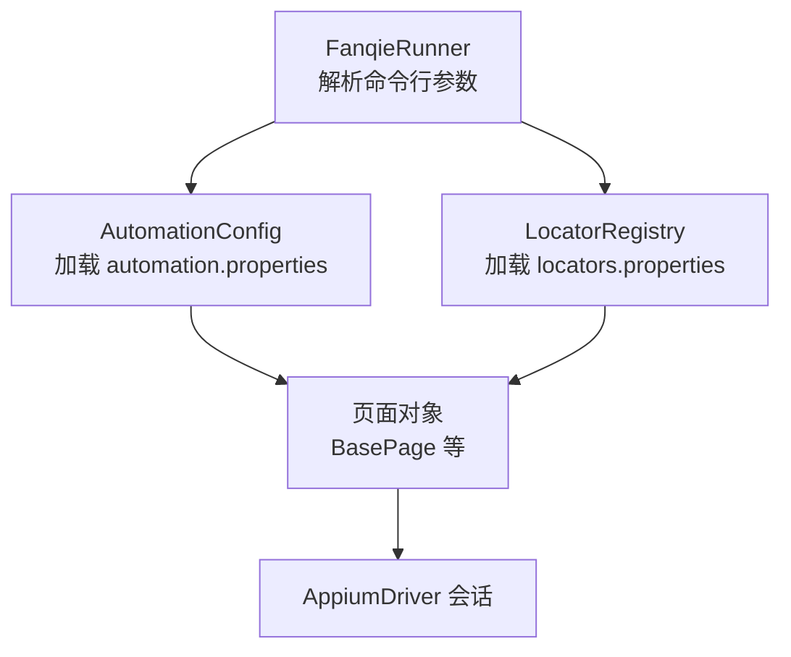
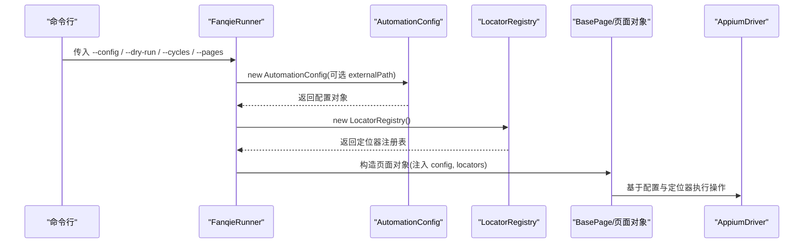
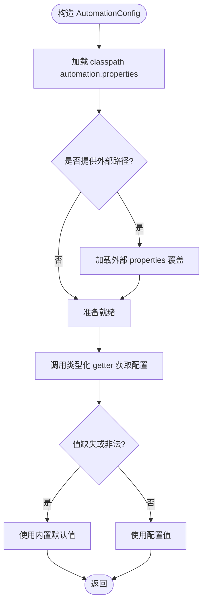
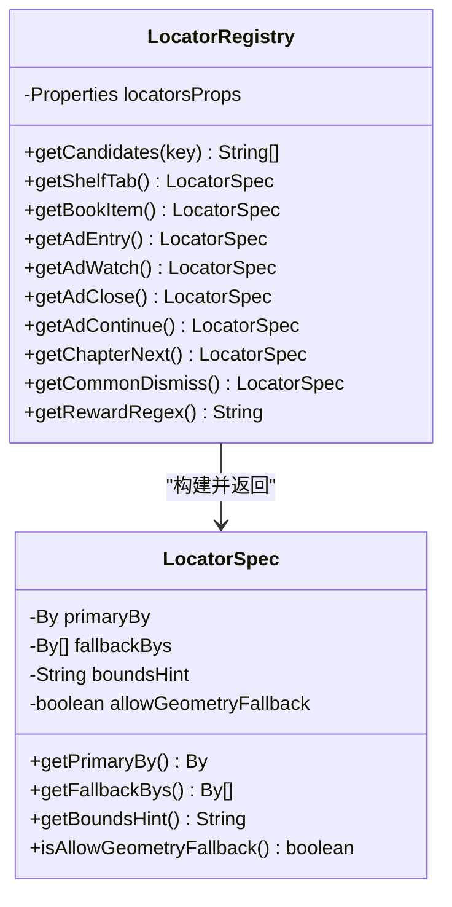
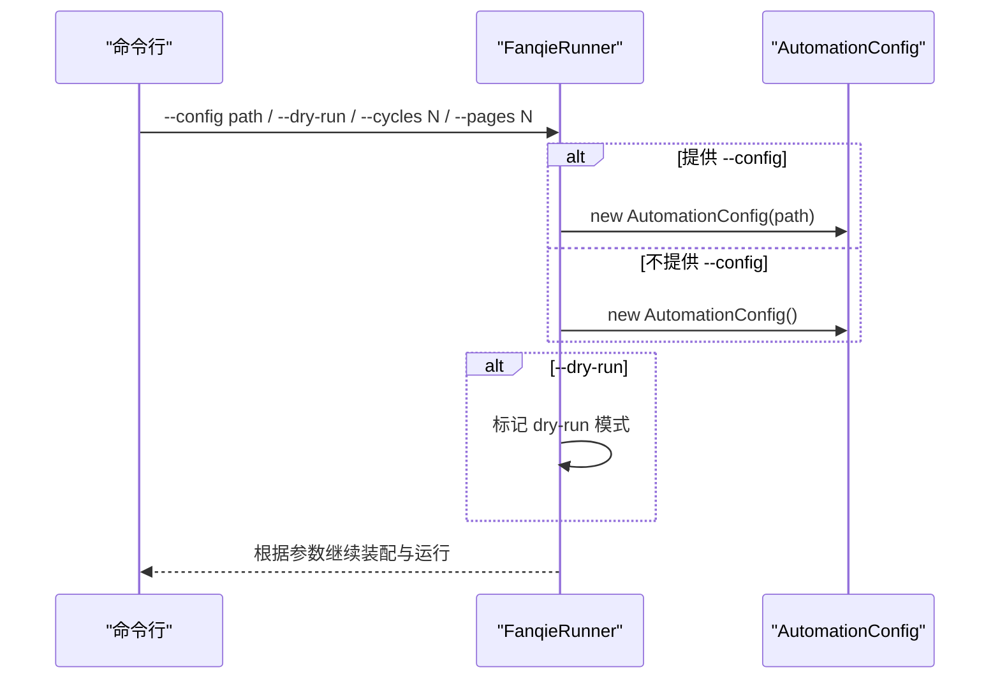
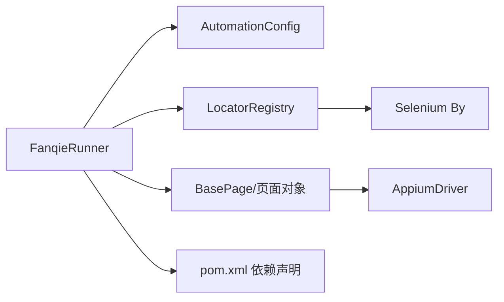

# 配置管理

<cite>
**本文引用的文件**
- [AutomationConfig.java](file://automation/src/main/java/com/fanqie/auto/config/AutomationConfig.java)
- [LocatorRegistry.java](file://automation/src/main/java/com/fanqie/auto/config/LocatorRegistry.java)
- [FanqieRunner.java](file://automation/src/main/java/com/fanqie/auto/FanqieRunner.java)
- [BasePage.java](file://automation/src/main/java/com/fanqie/auto/page/BasePage.java)
- [ConfigTest.java](file://automation/src/test/java/com/fanqie/auto/config/ConfigTest.java)
- [pom.xml](file://automation/pom.xml)
</cite>

## 目录
1. [简介](#简介)
2. [项目结构](#项目结构)
3. [核心组件](#核心组件)
4. [架构总览](#架构总览)
5. [详细组件分析](#详细组件分析)
6. [依赖关系分析](#依赖关系分析)
7. [性能考量](#性能考量)
8. [故障排查指南](#故障排查指南)
9. [结论](#结论)
10. [附录：配置项参考与环境示例](#附录配置项参考与环境示例)

## 简介
本文件面向配置管理系统，聚焦以下目标：
- 说明配置文件的层级结构与优先级规则（classpath 默认值与外部覆盖）。
- 详解 AutomationConfig 类的设计实现：配置加载、类型化读取、默认值兜底与覆盖机制。
- 介绍 LocatorRegistry 的作用与 UI 元素定位器的配置方法。
- 提供完整的配置项参考（设备连接、超时、重试、流程控制、阅读翻页策略等）。
- 给出配置最佳实践与环境特定示例。
- 解释如何通过命令行参数动态覆盖配置文件值。

## 项目结构
配置系统由两个核心类组成：
- AutomationConfig：统一从 classpath 的 automation.properties 加载全局配置，支持通过外部 properties 文件覆盖；提供类型安全的 getter 与业务域分组访问器。
- LocatorRegistry：从 locators.properties 加载 UI 控件文案候选集与正则，构建每个逻辑控件的定位规格（主定位器、备选定位器、区域提示、是否允许几何兜底）。

图表来源
- [FanqieRunner.java:41-90](file://automation/src/main/java/com/fanqie/auto/FanqieRunner.java#L41-L90)
- [AutomationConfig.java:25-42](file://automation/src/main/java/com/fanqie/auto/config/AutomationConfig.java#L25-L42)
- [LocatorRegistry.java:52-65](file://automation/src/main/java/com/fanqie/auto/config/LocatorRegistry.java#L52-L65)

章节来源
- [FanqieRunner.java:41-90](file://automation/src/main/java/com/fanqie/auto/FanqieRunner.java#L41-L90)
- [AutomationConfig.java:25-42](file://automation/src/main/java/com/fanqie/auto/config/AutomationConfig.java#L25-L42)
- [LocatorRegistry.java:52-65](file://automation/src/main/java/com/fanqie/auto/config/LocatorRegistry.java#L52-L65)

## 核心组件
- AutomationConfig
  - 职责：集中管理所有运行时配置，提供类型安全访问器；保证缺失或非法值时回退到内置默认值，不抛异常。
  - 关键能力：
    - 从 classpath 加载 automation.properties。
    - 支持外部路径覆盖（供 --config 使用）。
    - 类型化 getter：字符串、整数、长整型、浮点、布尔。
    - 按业务域分组访问器：Appium、时序、流程、阅读翻页、验证调试等。
- LocatorRegistry
  - 职责：管理 UI 控件的定位策略，将文案候选集、resource-id、content-desc、正则等组合为可执行的定位规格。
  - 关键能力：
    - 以 UTF-8 编码加载 locators.properties，避免中文乱码。
    - 为每个逻辑控件生成 LocatorSpec：primaryBy + fallbackBys + boundsHint + allowGeometryFallback。
    - 暴露各控件候选文案列表与正则（如奖励提取、每日配额耗尽提示等）。

章节来源
- [AutomationConfig.java:67-108](file://automation/src/main/java/com/fanqie/auto/config/AutomationConfig.java#L67-L108)
- [AutomationConfig.java:112-287](file://automation/src/main/java/com/fanqie/auto/config/AutomationConfig.java#L112-L287)
- [LocatorRegistry.java:16-25](file://automation/src/main/java/com/fanqie/auto/config/LocatorRegistry.java#L16-L25)
- [LocatorRegistry.java:52-65](file://automation/src/main/java/com/fanqie/auto/config/LocatorRegistry.java#L52-L65)
- [LocatorRegistry.java:95-148](file://automation/src/main/java/com/fanqie/auto/config/LocatorRegistry.java#L95-L148)

## 架构总览
配置系统的装配顺序与数据流如下：
- FanqieRunner 解析命令行参数，决定是否使用外部配置文件。
- 创建 AutomationConfig：先加载 classpath 默认配置，再按需加载外部覆盖。
- 创建 LocatorRegistry：加载 locators.properties，构建各控件定位规格。
- 页面对象与任务层通过 BasePage 等组件使用配置与定位器进行 UI 交互。

图表来源
- [FanqieRunner.java:41-90](file://automation/src/main/java/com/fanqie/auto/FanqieRunner.java#L41-L90)
- [AutomationConfig.java:25-42](file://automation/src/main/java/com/fanqie/auto/config/AutomationConfig.java#L25-L42)
- [LocatorRegistry.java:52-65](file://automation/src/main/java/com/fanqie/auto/config/LocatorRegistry.java#L52-L65)
- [BasePage.java:18-29](file://automation/src/main/java/com/fanqie/auto/page/BasePage.java#L18-L29)

## 详细组件分析

### AutomationConfig：配置加载、验证与覆盖机制
- 加载顺序与优先级
  - 首次从 classpath 加载 automation.properties 作为默认配置。
  - 若提供外部路径，则用该文件覆盖默认值；外部文件缺失或加载失败不影响默认值。
- 类型化读取与校验
  - getString/getInt/getLong/getDouble/getBoolean：当键缺失或值为空时返回默认值；数值转换失败时记录警告并回退默认值。
- 业务域访问器
  - Appium：服务器地址、平台名、自动化引擎、设备 UDID、包名、重置策略、命令超时、UiAutomator2 安装/启动超时、跳过安装/初始化、保持屏幕常亮等。
  - 驱动类型：driver.type，用于选择 DriverFactory 实现（当前 uiautomator2，预留 harmony_hdc）。
  - 时序：轮询间隔、状态检测超时、动作超时、应用启动超时、广告视频/关闭就绪超时、最大停留时间、心跳间隔。
  - 流程：每轮页面数、单入口最大广告轮次、总广告轮次上限、目标免费分钟、奖励兜底估值、墙钟熔断、外层循环次数、连续错误上限、恢复重试上限。
  - 阅读翻页：翻页策略（tap/swipe）、点击比例、滑动百分比与时长。
  - 验证与调试：截图验证翻页开关、dry-run 模式。
- 原始属性暴露
  - rawProperties() 供内部模块（如 LocatorRegistry）直接读取底层 Properties。

图表来源
- [AutomationConfig.java:25-42](file://automation/src/main/java/com/fanqie/auto/config/AutomationConfig.java#L25-L42)
- [AutomationConfig.java:67-108](file://automation/src/main/java/com/fanqie/auto/config/AutomationConfig.java#L67-L108)

章节来源
- [AutomationConfig.java:25-42](file://automation/src/main/java/com/fanqie/auto/config/AutomationConfig.java#L25-L42)
- [AutomationConfig.java:67-108](file://automation/src/main/java/com/fanqie/auto/config/AutomationConfig.java#L67-L108)
- [AutomationConfig.java:112-287](file://automation/src/main/java/com/fanqie/auto/config/AutomationConfig.java#L112-L287)

### LocatorRegistry：UI 元素定位器配置与管理
- 配置文件与编码
  - 从 locators.properties 加载，强制使用 UTF-8 Reader，避免中文乱码导致 text/content-desc 匹配失效。
- 定位规格（LocatorSpec）
  - primaryBy：主定位器（最高优先级）。
  - fallbackBys：备选定位器列表（主定位器无命中时逐级尝试）。
  - boundsHint：目标区域比例描述（例如“x>0.8,y<0.2”表示右上角），用于在多个候选中裁决。
  - allowGeometryFallback：是否允许 L2 几何兜底。对误点代价高的控件（观看广告、继续按钮）必须禁用；仅关闭按钮允许启用。
- 控件与候选集
  - 书架 Tab、书籍条目、广告入口、观看广告、关闭按钮、继续按钮、下一章、通用关闭弹窗、开屏跳过、阅读菜单、每日配额耗尽提示等。
  - 奖励提取正则、阅读进度正则、短剧/小说内容识别正则等。
- 四级定位降级链（与 BasePage 协作）
  - L1 语义属性匹配：text → content-desc → resource-id（精确/包含）。
  - L2 结构化几何推断：clickable=true、面积比阈值、中心落在 boundsHint 区域。
  - 误点防护：仅在 allowGeometryFallback=true 时允许 L2。

图表来源
- [LocatorRegistry.java:26-65](file://automation/src/main/java/com/fanqie/auto/config/LocatorRegistry.java#L26-L65)
- [LocatorRegistry.java:258-298](file://automation/src/main/java/com/fanqie/auto/config/LocatorRegistry.java#L258-L298)

章节来源
- [LocatorRegistry.java:16-25](file://automation/src/main/java/com/fanqie/auto/config/LocatorRegistry.java#L16-L25)
- [LocatorRegistry.java:52-65](file://automation/src/main/java/com/fanqie/auto/config/LocatorRegistry.java#L52-L65)
- [LocatorRegistry.java:95-148](file://automation/src/main/java/com/fanqie/auto/config/LocatorRegistry.java#L95-L148)
- [LocatorRegistry.java:152-256](file://automation/src/main/java/com/fanqie/auto/config/LocatorRegistry.java#L152-L256)
- [LocatorRegistry.java:258-298](file://automation/src/main/java/com/fanqie/auto/config/LocatorRegistry.java#L258-L298)
- [BasePage.java:18-29](file://automation/src/main/java/com/fanqie/auto/page/BasePage.java#L18-L29)

### 命令行参数与动态覆盖
- 支持的参数
  - --doctor：仅环境自检，不创建 session。
  - --dry-run：只连接并 dump UI 树，不执行任何点击。
  - --reset-progress：重置进度（由 Runner 处理）。
  - --config <path>：指定外部 properties 文件路径，覆盖 classpath 默认值。
  - --cycles N：覆盖外层循环次数。
  - --pages N：覆盖每轮页面数。
- 覆盖机制
  - 若提供 --config，则构造 AutomationConfig(externalPath)，先加载默认值再用外部文件覆盖。
  - --dry-run 会覆盖 dryRun 行为（即使配置文件未设置）。
  - 其他参数由 Runner 解析后影响后续流程（如 cycles/pages 覆盖）。

图表来源
- [FanqieRunner.java:41-90](file://automation/src/main/java/com/fanqie/auto/FanqieRunner.java#L41-L90)
- [AutomationConfig.java:25-42](file://automation/src/main/java/com/fanqie/auto/config/AutomationConfig.java#L25-L42)

章节来源
- [FanqieRunner.java:41-90](file://automation/src/main/java/com/fanqie/auto/FanqieRunner.java#L41-L90)
- [AutomationConfig.java:25-42](file://automation/src/main/java/com/fanqie/auto/config/AutomationConfig.java#L25-L42)

## 依赖关系分析
- 组件耦合
  - FanqieRunner 依赖 AutomationConfig 与 LocatorRegistry 完成装配。
  - 页面对象（BasePage 及其子类）依赖配置与定位器进行 UI 交互。
  - LocatorRegistry 依赖 Selenium By 表达式与 Properties 资源。
- 外部依赖
  - Appium Java Client 与 Selenium BOM（版本锁定，确保兼容性）。
  - SLF4J Simple 日志实现。
  - JUnit 5（测试期依赖）。

图表来源
- [pom.xml:50-83](file://automation/pom.xml#L50-L83)
- [FanqieRunner.java:1-20](file://automation/src/main/java/com/fanqie/auto/FanqieRunner.java#L1-L20)

章节来源
- [pom.xml:50-83](file://automation/pom.xml#L50-L83)
- [FanqieRunner.java:1-20](file://automation/src/main/java/com/fanqie/auto/FanqieRunner.java#L1-L20)

## 性能考量
- 配置加载开销极低（Properties 内存读取），建议启动时一次性加载。
- 类型化 getter 的数值转换失败会打印警告并回退默认值，避免阻塞流程。
- LocatorRegistry 的候选集解析与正则匹配在 UI 探测阶段使用，应确保候选集精简以减少匹配成本。
- 通过 wall clock 熔断（maxWallClockMs）防止长时间占用设备。

[本节为通用指导，无需具体文件引用]

## 故障排查指南
- 中文乱码问题
  - 现象：text/content-desc 匹配全部失效。
  - 原因：Properties 默认 ISO-8859-1 解码。
  - 解决：使用 UTF-8 Reader 加载（已在 AutomationConfig 与 LocatorRegistry 中实现）。
  - 验证：启动时调用 LocatorRegistry.dumpToConsole() 输出候选集，确认中文显示正常。
- 外部配置文件缺失或非法值
  - 现象：外部文件不存在或某键值非法。
  - 行为：保留 classpath 默认值；非法数值回退默认值并打印警告。
- 误点风险
  - 现象：误点观看广告或继续按钮导致浪费每日配额。
  - 约束：ad.watch/ad.continue 的 allowGeometryFallback=false；仅 ad.close 允许几何兜底。
- 单元测试辅助
  - ConfigTest 覆盖了默认值、外部覆盖、非法值回退、候选集加载与编码、LocatorSpec 约束等场景。

章节来源
- [LocatorRegistry.java:67-81](file://automation/src/main/java/com/fanqie/auto/config/LocatorRegistry.java#L67-L81)
- [LocatorRegistry.java:186-233](file://automation/src/main/java/com/fanqie/auto/config/LocatorRegistry.java#L186-L233)
- [ConfigTest.java:48-81](file://automation/src/test/java/com/fanqie/auto/config/ConfigTest.java#L48-L81)
- [ConfigTest.java:85-131](file://automation/src/test/java/com/fanqie/auto/config/ConfigTest.java#L85-L131)

## 结论
本配置管理系统通过 AutomationConfig 与 LocatorRegistry 实现了：
- 统一的配置加载与覆盖机制，支持 classpath 默认与外部覆盖。
- 类型安全与健壮性保障（缺项/非法值回退默认值）。
- 灵活的 UI 定位策略（主定位器+多路备选+区域提示+几何兜底开关）。
- 通过命令行参数动态调整运行行为，便于不同环境与场景切换。
建议在工程实践中遵循本文的最佳实践与环境示例，确保稳定与可维护性。

[本节为总结，无需具体文件引用]

## 附录：配置项参考与环境示例

### 配置项参考（按域分组）
- Appium 设备与连接
  - appium.server.url：Appium 服务器地址（默认 http://127.0.0.1:4723）。
  - appium.platform.name：平台名称（默认 Android）。
  - appium.automation.name：自动化引擎（默认 UiAutomator2）。
  - appium.device.udid：设备序列号（留空自动取第一个在线设备）。
  - appium.app.package：应用包名（默认 com.dragon.read）。
  - appium.no.reset：是否不重置应用状态（默认 true）。
  - appium.new.command.timeout.sec：新命令超时秒数（默认 1800）。
  - appium.uia2.server.launch.timeout.ms：UiAutomator2 Server 启动超时（默认 60000）。
  - appium.uia2.server.install.timeout.ms：UiAutomator2 Server 安装超时（默认 120000）。
  - appium.skip.server.installation：跳过服务器安装（默认 false）。
  - appium.skip.device.initialization：跳过设备初始化（默认 false）。
  - appium.keep.screen.on：保持屏幕常亮（默认 true）。
- 驱动类型
  - driver.type：驱动类型（默认 uiautomator2，预留 harmony_hdc）。
- 时序配置
  - timing.poll.interval.ms：轮询间隔毫秒（默认 250）。
  - timing.state.detect.timeout.ms：状态检测超时毫秒（默认 3000）。
  - timing.action.timeout.ms：动作超时毫秒（默认 8000）。
  - timing.app.launch.timeout.ms：应用启动超时毫秒（默认 30000）。
  - timing.ad.video.timeout.ms：广告视频超时毫秒（默认 45000）。
  - timing.ad.close.ready.timeout.ms：广告关闭就绪超时毫秒（默认 15000）。
  - timing.max.state.dwell.ms：最大状态停留毫秒（默认 90000）。
  - timing.heartbeat.interval.sec：心跳间隔秒（默认 30）。
- 流程配置
  - flow.pages.per.cycle：每轮页面数（默认 5）。
  - flow.max.ad.rounds.per.entry：单入口最大广告轮次（默认 4）。
  - flow.max.total.ad.rounds：总广告轮次上限（默认 40）。
  - flow.target.free.minutes：目标免费分钟（默认 120）。
  - flow.reward.fallback.minutes：奖励兜底估值分钟（默认 30）。
  - flow.max.wall.clock.ms：墙钟熔断毫秒（默认 10800000，即 3 小时；<=0 表示不启用）。
  - flow.outer.cycles：外层循环次数（默认 2）。
  - flow.max.consecutive.errors：最大连续错误次数（默认 3）。
  - flow.max.recovery.retry：最大恢复重试次数（默认 3）。
- 阅读翻页策略
  - reader.turn.strategy：翻页策略（tap 或 swipe，默认 tap）。
  - reader.next.tap.ratio.x/y：下一页点击比例（默认 x=0.85, y=0.50）。
  - reader.prev.tap.ratio.x：上一页点击比例（默认 x=0.15）。
  - reader.swipe.percent：滑动百分比（默认 0.6）。
  - reader.swipe.duration.ms：滑动时长毫秒（默认 300）。
- 验证与调试
  - verify.page.turned.by.screenshot：截图验证翻页（默认 false）。
  - runtime.dry.run：dry-run 模式（默认 false）。

章节来源
- [AutomationConfig.java:112-287](file://automation/src/main/java/com/fanqie/auto/config/AutomationConfig.java#L112-L287)

### 环境变量与配置文件示例（概念性）
- 开发环境
  - 使用默认配置，开启 dry-run 进行安全探测。
  - 可通过 --config dev.properties 覆盖少量参数（如 appium.server.url）。
- 测试环境
  - 指定设备 UDID，缩短超时以提升反馈速度。
  - 限制 outer.cycles 与 maxTotalAdRounds，控制运行时长。
- 生产环境
  - 启用 wall clock 熔断，设置合理的 maxWallClockMs。
  - 关闭 dry-run，开启截图验证翻页以便审计。
  - 使用稳定的 Appium 服务器地址与设备 UDID。

[本节为概念性示例，无需具体文件引用]

### 命令行参数速查
- --doctor：仅环境自检。
- --dry-run：只连接并 dump UI 树，不执行点击。
- --reset-progress：重置进度。
- --config <path>：外部配置文件路径，覆盖默认值。
- --cycles N：覆盖外层循环次数。
- --pages N：覆盖每轮页面数。

章节来源
- [FanqieRunner.java:41-90](file://automation/src/main/java/com/fanqie/auto/FanqieRunner.java#L41-L90)