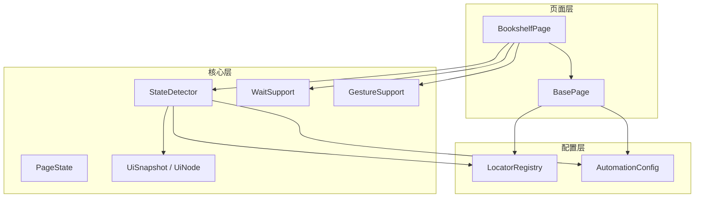
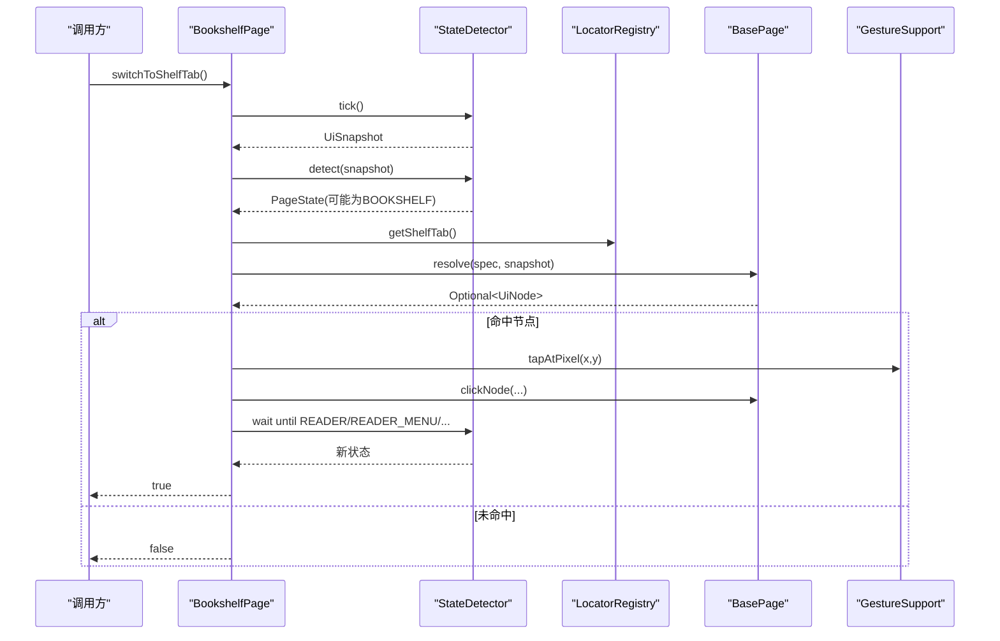
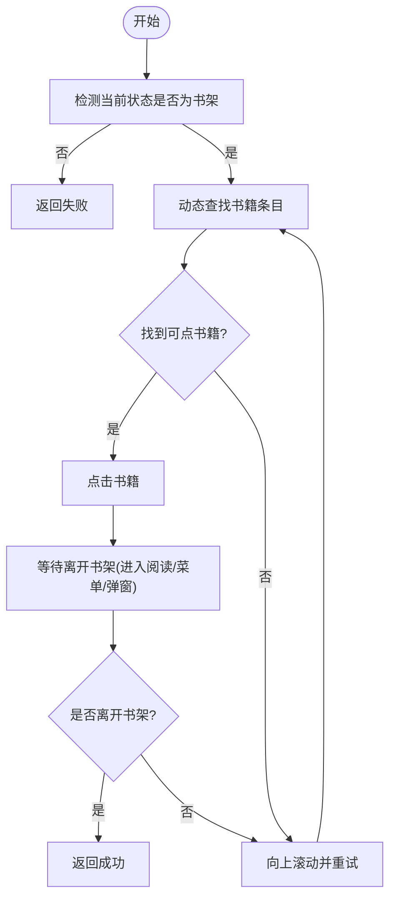
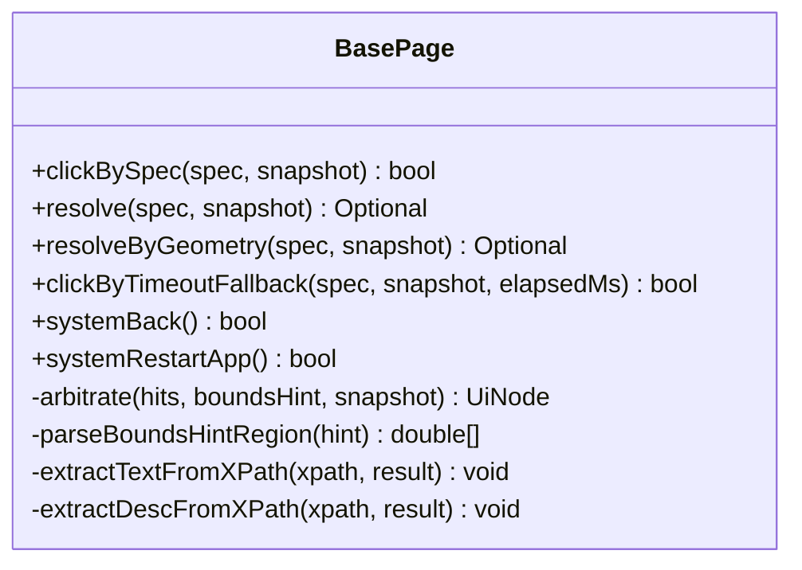
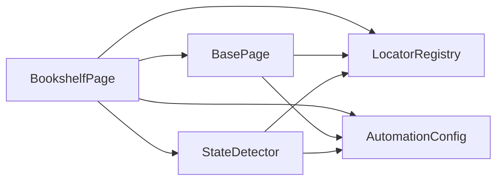

# 书架页面操作

<cite>
**本文引用的文件**
- [BookshelfPage.java](file://automation/src/main/java/com/fanqie/auto/page/BookshelfPage.java)
- [BasePage.java](file://automation/src/main/java/com/fanqie/auto/page/BasePage.java)
- [LocatorRegistry.java](file://automation/src/main/java/com/fanqie/auto/config/LocatorRegistry.java)
- [AutomationConfig.java](file://automation/src/main/java/com/fanqie/auto/config/AutomationConfig.java)
- [StateDetector.java](file://automation/src/main/java/com/fanqie/auto/core/StateDetector.java)
- [PageState.java](file://automation/src/main/java/com/fanqie/auto/core/PageState.java)
- [bookshelf.xml](file://automation/src/test/resources/fixtures/bookshelf.xml)
- [two_shelf_tabs.xml](file://automation/src/test/resources/fixtures/two_shelf_tabs.xml)
- [BasePageTest.java](file://automation/src/test/java/com/fanqie/auto/page/BasePageTest.java)
</cite>

## 目录
1. [简介](#简介)
2. [项目结构](#项目结构)
3. [核心组件](#核心组件)
4. [架构总览](#架构总览)
5. [详细组件分析](#详细组件分析)
6. [依赖关系分析](#依赖关系分析)
7. [性能考量](#性能考量)
8. [故障排查指南](#故障排查指南)
9. [结论](#结论)
10. [附录：使用示例与最佳实践](#附录使用示例与最佳实践)

## 简介
本文件面向自动化测试工程师与集成开发者，系统性说明“书架页面”的自动化操作实现。重点覆盖：
- BookshelfPage 如何继承 BasePage 并提供书架相关能力（切换书架 Tab、打开任意书籍、打开下一本未用书籍）
- 书籍选择、翻页导航、标签页切换的核心实现与策略
- 状态检测与元素定位策略（含多布局兼容与界面变化处理）
- 与状态机的集成方式及异常处理流程
- 具体使用示例（浏览、搜索、选择）与最佳实践

## 项目结构
本项目采用分层组织：
- page：页面对象封装（BasePage、BookshelfPage 等）
- core：通用能力（状态检测、UI 快照、手势、等待支持等）
- config：配置与定位器注册表（AutomationConfig、LocatorRegistry）
- task：任务编排与状态机（不在本文展开）
- test：用例与 fixtures（用于离线验证定位与状态识别）

图表来源
- [BookshelfPage.java:36-55](file://automation/src/main/java/com/fanqie/auto/page/BookshelfPage.java#L36-L55)
- [BasePage.java:40-68](file://automation/src/main/java/com/fanqie/auto/page/BasePage.java#L40-L68)
- [StateDetector.java:29-54](file://automation/src/main/java/com/fanqie/auto/core/StateDetector.java#L29-L54)
- [LocatorRegistry.java:26-65](file://automation/src/main/java/com/fanqie/auto/config/LocatorRegistry.java#L26-L65)
- [AutomationConfig.java:18-42](file://automation/src/main/java/com/fanqie/auto/config/AutomationConfig.java#L18-L42)

章节来源
- [BookshelfPage.java:23-55](file://automation/src/main/java/com/fanqie/auto/page/BookshelfPage.java#L23-L55)
- [BasePage.java:18-68](file://automation/src/main/java/com/fanqie/auto/page/BasePage.java#L18-L68)

## 核心组件
- BookshelfPage：书架页操作入口，提供 switchToShelfTab()、openAnyBook()、openNextBook(Set<String>) 等方法；维护最近打开书籍标识 lastOpenedBookId，支撑 per-book 进度与轮换去重。
- BasePage：四级定位降级链（L1 语义匹配 + boundsHint 裁决、L2 几何推断、L3 时序兜底、L4 系统兜底），统一点击与回溯可点击祖先逻辑。
- StateDetector：基于 UI 快照进行纯内存状态识别，返回 PageState（如 BOOKSHELF、READER、READER_MENU 等）。
- LocatorRegistry：集中管理控件定位规格（primaryBy、fallbackBys、boundsHint、allowGeometryFallback）与文案/正则候选集。
- AutomationConfig：全局超时、轮次、阈值等配置，避免魔法数字。
- PageState：状态枚举，定义各页面状态与家族关系（如 isReaderFamily）。

章节来源
- [BookshelfPage.java:36-55](file://automation/src/main/java/com/fanqie/auto/page/BookshelfPage.java#L36-L55)
- [BasePage.java:18-91](file://automation/src/main/java/com/fanqie/auto/page/BasePage.java#L18-L91)
- [StateDetector.java:12-28](file://automation/src/main/java/com/fanqie/auto/core/StateDetector.java#L12-L28)
- [LocatorRegistry.java:16-65](file://automation/src/main/java/com/fanqie/auto/config/LocatorRegistry.java#L16-L65)
- [AutomationConfig.java:18-42](file://automation/src/main/java/com/fanqie/auto/config/AutomationConfig.java#L18-L42)
- [PageState.java:11-97](file://automation/src/main/java/com/fanqie/auto/core/PageState.java#L11-L97)

## 架构总览
书架页面的自动化由“状态驱动 + 定位降级 + 手势交互”构成闭环：
- 通过 StateDetector 获取当前 PageState，确保在 BOOKSHELF 后再执行书架操作
- 使用 LocatorRegistry 提供的定位规格，结合 BasePage 的四级降级链精准定位并点击
- 通过 GestureSupport 执行像素级点击/滑动，规避全面屏手势区误触
- 使用 WaitSupport 等待目标状态（如进入阅读页或菜单），完成动作确认

图表来源
- [BookshelfPage.java:65-128](file://automation/src/main/java/com/fanqie/auto/page/BookshelfPage.java#L65-L128)
- [BasePage.java:84-91](file://automation/src/main/java/com/fanqie/auto/page/BasePage.java#L84-L91)
- [StateDetector.java:97-127](file://automation/src/main/java/com/fanqie/auto/core/StateDetector.java#L97-L127)

## 详细组件分析

### BookshelfPage：书架页操作
职责与方法
- switchToShelfTab()：切换到书架 Tab，兼容底部 Tab 文案共享问题，主动点击一次以确保落在书架页；避开华为全面屏手势区点击；等待并确认进入 BOOKSHELF。
- openAnyBook()：动态选取首个可点击书籍条目并打开；若首屏无可用条目则滚动重试，次数来自配置。
- openNextBook(Set<String>)：在多本书轮换场景下，排除已使用过的书籍再选择；滚动次数略多于普通打开。
- confirmLeftBookshelf()：点击后等待离开书架（进入阅读页家族或弹窗等），超时后二次检测确认。
- findBookItem(UiSnapshot[, Set<String>])：三套策略组合筛选书籍条目（resource-id 优先、content-desc、text），并结合区域、面积、短剧过滤与去重。
- chooseNovelCell()/isShortDramaText()：区分文字小说与短剧/视频卡片，避免误开短剧。

关键设计要点
- 不写死索引，遍历内存节点表按规则筛选，适配不同书架布局与内容变化
- 真机校准：书封容器 clickable 但 text/content-desc 为空时，靠稳定 resource-id 命中；短剧/视频特征正则过滤
- 底部 Tab 点击避开手势区：取节点顶部偏上位置点击，避免被系统手势吞掉

图表来源
- [BookshelfPage.java:169-216](file://automation/src/main/java/com/fanqie/auto/page/BookshelfPage.java#L169-L216)
- [BookshelfPage.java:229-275](file://automation/src/main/java/com/fanqie/auto/page/BookshelfPage.java#L229-L275)
- [BookshelfPage.java:290-315](file://automation/src/main/java/com/fanqie/auto/page/BookshelfPage.java#L290-L315)

章节来源
- [BookshelfPage.java:36-55](file://automation/src/main/java/com/fanqie/auto/page/BookshelfPage.java#L36-L55)
- [BookshelfPage.java:65-128](file://automation/src/main/java/com/fanqie/auto/page/BookshelfPage.java#L65-L128)
- [BookshelfPage.java:169-216](file://automation/src/main/java/com/fanqie/auto/page/BookshelfPage.java#L169-L216)
- [BookshelfPage.java:229-275](file://automation/src/main/java/com/fanqie/auto/page/BookshelfPage.java#L229-L275)
- [BookshelfPage.java:339-431](file://automation/src/main/java/com/fanqie/auto/page/BookshelfPage.java#L339-L431)
- [BookshelfPage.java:442-506](file://automation/src/main/java/com/fanqie/auto/page/BookshelfPage.java#L442-L506)

### BasePage：四级定位降级链与点击
- L1 语义属性匹配：text → content-desc → resource-id（精确/包含），命中多个时用 boundsHint 裁决（底部、右上角、居中、默认最小面积）
- L2 结构化几何推断：在指定比例区域内查找 clickable=true 且 areaRatio < 0.15 的节点；受 allowGeometryFallback 保护，防止误点浪费配额
- L3 时序兜底：达到 adVideoTimeoutMs 后强制尝试 L2 几何点击（同样受 allowGeometryFallback 约束）
- L4 系统兜底：navigate().back() 或重启 App

点击实现
- 若命中节点不可点击，回溯至最近可点击祖先；取 bounds 中心坐标执行像素点击，天然免疫 stale element

图表来源
- [BasePage.java:84-91](file://automation/src/main/java/com/fanqie/auto/page/BasePage.java#L84-L91)
- [BasePage.java:103-137](file://automation/src/main/java/com/fanqie/auto/page/BasePage.java#L103-L137)
- [BasePage.java:150-189](file://automation/src/main/java/com/fanqie/auto/page/BasePage.java#L150-L189)
- [BasePage.java:203-219](file://automation/src/main/java/com/fanqie/auto/page/BasePage.java#L203-L219)
- [BasePage.java:227-250](file://automation/src/main/java/com/fanqie/auto/page/BasePage.java#L227-L250)
- [BasePage.java:312-336](file://automation/src/main/java/com/fanqie/auto/page/BasePage.java#L312-L336)
- [BasePage.java:347-406](file://automation/src/main/java/com/fanqie/auto/page/BasePage.java#L347-L406)
- [BasePage.java:412-434](file://automation/src/main/java/com/fanqie/auto/page/BasePage.java#L412-L434)
- [BasePage.java:441-514](file://automation/src/main/java/com/fanqie/auto/page/BasePage.java#L441-L514)

章节来源
- [BasePage.java:18-91](file://automation/src/main/java/com/fanqie/auto/page/BasePage.java#L18-L91)
- [BasePage.java:103-137](file://automation/src/main/java/com/fanqie/auto/page/BasePage.java#L103-L137)
- [BasePage.java:150-189](file://automation/src/main/java/com/fanqie/auto/page/BasePage.java#L150-L189)
- [BasePage.java:203-219](file://automation/src/main/java/com/fanqie/auto/page/BasePage.java#L203-L219)
- [BasePage.java:227-250](file://automation/src/main/java/com/fanqie/auto/page/BasePage.java#L227-L250)
- [BasePage.java:312-336](file://automation/src/main/java/com/fanqie/auto/page/BasePage.java#L312-L336)
- [BasePage.java:347-406](file://automation/src/main/java/com/fanqie/auto/page/BasePage.java#L347-L406)
- [BasePage.java:412-434](file://automation/src/main/java/com/fanqie/auto/page/BasePage.java#L412-L434)
- [BasePage.java:441-514](file://automation/src/main/java/com/fanqie/auto/page/BasePage.java#L441-L514)

### LocatorRegistry：定位规格与候选集
- 每个逻辑控件对应一个 LocatorSpec：primaryBy、fallbackBys、boundsHint、allowGeometryFallback
- 书架 Tab：y>0.9 底部区域，禁止几何兜底（防误点）
- 广告关闭按钮：允许几何兜底（右上角小区域 clickable）
- 书籍条目：RecyclerView 内 clickable 子节点，id 回退
- 文案/正则：shelf.tab.text、book.item.id、book.shortdrama.regex、book.novel.regex 等

章节来源
- [LocatorRegistry.java:16-65](file://automation/src/main/java/com/fanqie/auto/config/LocatorRegistry.java#L16-L65)
- [LocatorRegistry.java:109-148](file://automation/src/main/java/com/fanqie/auto/config/LocatorRegistry.java#L109-L148)
- [LocatorRegistry.java:152-256](file://automation/src/main/java/com/fanqie/auto/config/LocatorRegistry.java#L152-L256)
- [LocatorRegistry.java:271-298](file://automation/src/main/java/com/fanqie/auto/config/LocatorRegistry.java#L271-L298)

### StateDetector 与 PageState：状态机驱动
- StateDetector.tick() 仅一次抓取 UI 树并缓存，同一 tick 内多次 detect 复用
- detect() 按优先级匹配：resource-id 锚点 → text 候选集 → content-desc 候选集 → APP_LAUNCHING 保守判定 → 几何特征 → UNKNOWN
- PageState 定义书架、阅读页、阅读页菜单、广告流程等状态，并提供 isReaderFamily() 等判断

章节来源
- [StateDetector.java:12-28](file://automation/src/main/java/com/fanqie/auto/core/StateDetector.java#L12-L28)
- [StateDetector.java:97-127](file://automation/src/main/java/com/fanqie/auto/core/StateDetector.java#L97-L127)
- [StateDetector.java:152-208](file://automation/src/main/java/com/fanqie/auto/core/StateDetector.java#L152-L208)
- [StateDetector.java:218-334](file://automation/src/main/java/com/fanqie/auto/core/StateDetector.java#L218-L334)
- [StateDetector.java:359-418](file://automation/src/main/java/com/fanqie/auto/core/StateDetector.java#L359-L418)
- [PageState.java:11-97](file://automation/src/main/java/com/fanqie/auto/core/PageState.java#L11-L97)

### 元素定位策略与布局兼容
- 多通道匹配：text → content-desc → resource-id，命中多个用 boundsHint 裁决（底部、右上角、居中、默认最小面积）
- 几何兜底：在指定比例区域查找 clickable 且 areaRatio < 0.15 的节点，受 allowGeometryFallback 保护
- 真机校准：
  - 书封容器 clickable 但 text/content-desc 为空，靠稳定 resource-id 命中
  - 短剧/视频卡片通过正则过滤，避免误开
  - 底部 Tab 点击避开全面屏手势区（取节点顶部偏上位置）
- 多布局兼容：通过区域比例与面积占比过滤，适应不同屏幕尺寸与布局变化

章节来源
- [BasePage.java:103-137](file://automation/src/main/java/com/fanqie/auto/page/BasePage.java#L103-L137)
- [BasePage.java:150-189](file://automation/src/main/java/com/fanqie/auto/page/BasePage.java#L150-L189)
- [BasePage.java:347-406](file://automation/src/main/java/com/fanqie/auto/page/BasePage.java#L347-L406)
- [BookshelfPage.java:339-431](file://automation/src/main/java/com/fanqie/auto/page/BookshelfPage.java#L339-L431)
- [BookshelfPage.java:442-506](file://automation/src/main/java/com/fanqie/auto/page/BookshelfPage.java#L442-L506)

## 依赖关系分析
- BookshelfPage 依赖 BasePage 的定位与点击能力，依赖 StateDetector 做状态检测，依赖 LocatorRegistry 提供定位规格与候选集，依赖 AutomationConfig 提供超时与重试次数
- BasePage 依赖 LocatorRegistry 解析定位规格与 boundsHint，依赖 GestureSupport 执行像素点击
- StateDetector 依赖 LocatorRegistry 的文案/正则候选集，依赖 UiSnapshot 进行内存匹配

图表来源
- [BookshelfPage.java:36-55](file://automation/src/main/java/com/fanqie/auto/page/BookshelfPage.java#L36-L55)
- [BasePage.java:40-68](file://automation/src/main/java/com/fanqie/auto/page/BasePage.java#L40-L68)
- [StateDetector.java:29-54](file://automation/src/main/java/com/fanqie/auto/core/StateDetector.java#L29-L54)
- [LocatorRegistry.java:26-65](file://automation/src/main/java/com/fanqie/auto/config/LocatorRegistry.java#L26-L65)
- [AutomationConfig.java:18-42](file://automation/src/main/java/com/fanqie/auto/config/AutomationConfig.java#L18-L42)

章节来源
- [BookshelfPage.java:36-55](file://automation/src/main/java/com/fanqie/auto/page/BookshelfPage.java#L36-L55)
- [BasePage.java:40-68](file://automation/src/main/java/com/fanqie/auto/page/BasePage.java#L40-L68)
- [StateDetector.java:29-54](file://automation/src/main/java/com/fanqie/auto/core/StateDetector.java#L29-L54)
- [LocatorRegistry.java:26-65](file://automation/src/main/java/com/fanqie/auto/config/LocatorRegistry.java#L26-L65)
- [AutomationConfig.java:18-42](file://automation/src/main/java/com/fanqie/auto/config/AutomationConfig.java#L18-L42)

## 性能考量
- StateDetector.tick() 只做一次 getPageSource() 并缓存快照，减少 RPC 开销
- 状态识别全部基于内存节点表，避免逐个状态触发 driver.findElement
- 屏幕尺寸缓存与自愈：横屏/折叠屏旋转后自动重取尺寸，保证比例判定准确
- 几何兜底仅在允许时启用，避免误点导致额外视频轮次

章节来源
- [StateDetector.java:97-127](file://automation/src/main/java/com/fanqie/auto/core/StateDetector.java#L97-L127)
- [StateDetector.java:152-208](file://automation/src/main/java/com/fanqie/auto/core/StateDetector.java#L152-L208)
- [BasePage.java:150-189](file://automation/src/main/java/com/fanqie/auto/page/BasePage.java#L150-L189)

## 故障排查指南
常见问题与处理
- 无法定位书架 Tab：检查 LocatorRegistry 中 shelf.tab.text 是否正确；确认底部区域几何查找是否生效；查看日志中的 L1/L2 命中情况
- 打开书籍失败：确认 findBookItem 策略是否命中（resource-id、content-desc、text）；检查短剧过滤是否误杀；确认滚动重试次数配置
- 点击无效或被手势吞掉：确认 tapTabAvoidingGesture 是否生效；检查节点 bounds 与点击坐标
- 状态未切换：确认 confirmLeftBookshelf 等待的目标状态集合是否覆盖实际跳转；必要时增加二次检测

调试建议
- 使用 fixtures 与 BasePageTest 离线验证定位与裁决逻辑
- 打印 UiSnapshot 节点数、XML 大小、lastPageSourceMs 等指标，评估性能与稳定性
- 针对异常状态，结合 RecoveryHandler 的恢复流程（非本文展开）

章节来源
- [BasePageTest.java:51-127](file://automation/src/test/java/com/fanqie/auto/page/BasePageTest.java#L51-L127)
- [BookshelfPage.java:65-128](file://automation/src/main/java/com/fanqie/auto/page/BookshelfPage.java#L65-L128)
- [BookshelfPage.java:169-216](file://automation/src/main/java/com/fanqie/auto/page/BookshelfPage.java#L169-L216)
- [StateDetector.java:97-127](file://automation/src/main/java/com/fanqie/auto/core/StateDetector.java#L97-L127)

## 结论
书架页面自动化通过“状态驱动 + 多级定位 + 手势交互”实现了高鲁棒性与可维护性：
- 以 StateDetector 与 PageState 为核心，确保操作在正确状态下执行
- 以 BasePage 的四级降级链与 LocatorRegistry 的候选集，兼容多布局与界面变化
- 以 BookshelfPage 的具体策略（资源 id 优先、短剧过滤、区域与面积过滤、滚动重试）实现稳定的书籍选择与打开
- 通过配置化参数（超时、重试次数）与日志输出，便于调优与排障

## 附录：使用示例与最佳实践

### 基本用法
- 切换到书架 Tab：调用 switchToShelfTab()，成功后再进行书籍操作
- 打开任意书籍：调用 openAnyBook()，内部会动态选择首个可点书籍并等待进入阅读页家族
- 打开下一本未用书籍：调用 openNextBook(excludeIds)，适合多本书轮换场景

章节来源
- [BookshelfPage.java:65-128](file://automation/src/main/java/com/fanqie/auto/page/BookshelfPage.java#L65-L128)
- [BookshelfPage.java:169-216](file://automation/src/main/java/com/fanqie/auto/page/BookshelfPage.java#L169-L216)
- [BookshelfPage.java:229-275](file://automation/src/main/java/com/fanqie/auto/page/BookshelfPage.java#L229-L275)

### 书籍浏览与选择
- 动态选择：findBookItem 优先 resource-id，其次 content-desc，最后 text；结合区域与面积过滤，避免误选
- 短剧过滤：chooseNovelCell 与 isShortDramaText 使用正则过滤短剧/视频卡片，优先文字小说
- 去重：bookIdOf 提取稳定标识（content-desc > text > bounds），配合 excludeIds 实现轮换去重

章节来源
- [BookshelfPage.java:339-431](file://automation/src/main/java/com/fanqie/auto/page/BookshelfPage.java#L339-L431)
- [BookshelfPage.java:442-506](file://automation/src/main/java/com/fanqie/auto/page/BookshelfPage.java#L442-L506)
- [BookshelfPage.java:321-328](file://automation/src/main/java/com/fanqie/auto/page/BookshelfPage.java#L321-L328)

### 翻页导航与标签页切换
- 翻页：openAnyBook/openNextBook 在未找到可点书籍时执行 swipeUp 滚动，次数来自 maxRecoveryRetry（轮换场景额外 +2）
- 标签页切换：switchToShelfTab 使用 LocatorRegistry 的 shelfTabTexts 与几何查找，点击时避开全面屏手势区

章节来源
- [BookshelfPage.java:65-128](file://automation/src/main/java/com/fanqie/auto/page/BookshelfPage.java#L65-L128)
- [BookshelfPage.java:169-216](file://automation/src/main/java/com/fanqie/auto/page/BookshelfPage.java#L169-L216)
- [BookshelfPage.java:229-275](file://automation/src/main/java/com/fanqie/auto/page/BookshelfPage.java#L229-L275)

### 与状态机的集成
- 操作前：通过 StateDetector.detect 确认当前状态（如 BOOKSHELF）
- 操作后：通过 WaitSupport.untilState 等待目标状态（READER、READER_MENU、COMMON_POPUP、AD_CONFIRM_DIALOG、APP_LAUNCHING）
- 异常：confirmLeftBookshelf 超时后二次检测，若已离开书架则视为成功；否则记录警告并返回失败

章节来源
- [BookshelfPage.java:65-128](file://automation/src/main/java/com/fanqie/auto/page/BookshelfPage.java#L65-L128)
- [BookshelfPage.java:290-315](file://automation/src/main/java/com/fanqie/auto/page/BookshelfPage.java#L290-L315)
- [PageState.java:11-97](file://automation/src/main/java/com/fanqie/auto/core/PageState.java#L11-L97)

### 异常情况处理
- 无法定位书架 Tab：检查 LocatorRegistry 文案与几何查找；必要时调整 shelfTabTexts
- 书籍选择失败：检查短剧过滤正则、resource-id 候选集、区域与面积过滤条件
- 点击无效：确认 tapTabAvoidingGesture 生效；检查节点 bounds 与点击坐标
- 状态未切换：确认等待目标状态集合；必要时增加二次检测或调整超时

章节来源
- [BasePage.java:150-189](file://automation/src/main/java/com/fanqie/auto/page/BasePage.java#L150-L189)
- [BookshelfPage.java:65-128](file://automation/src/main/java/com/fanqie/auto/page/BookshelfPage.java#L65-L128)
- [BookshelfPage.java:290-315](file://automation/src/main/java/com/fanqie/auto/page/BookshelfPage.java#L290-L315)

### 测试与验证
- 使用 fixtures 与 BasePageTest 离线验证定位与裁决逻辑（如 two_shelf_tabs.xml 的底部裁决）
- 通过 StateDetectorTest 验证书架、阅读页、阅读页菜单等状态识别

章节来源
- [BasePageTest.java:102-110](file://automation/src/test/java/com/fanqie/auto/page/BasePageTest.java#L102-L110)
- [two_shelf_tabs.xml:1-7](file://automation/src/test/resources/fixtures/two_shelf_tabs.xml#L1-L7)
- [bookshelf.xml:1-11](file://automation/src/test/resources/fixtures/bookshelf.xml#L1-L11)