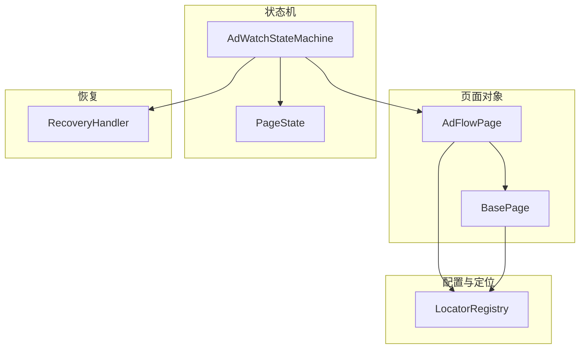
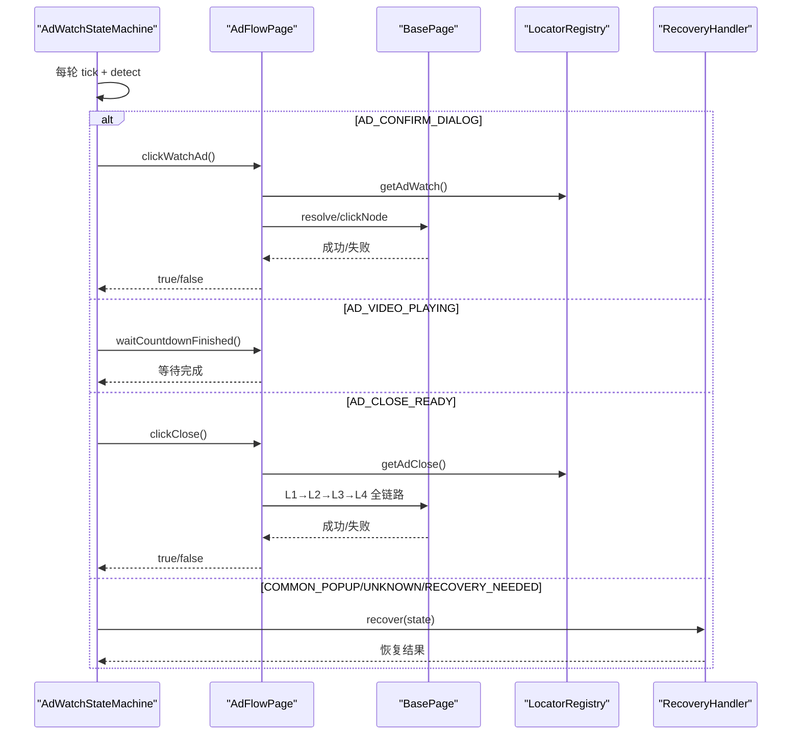
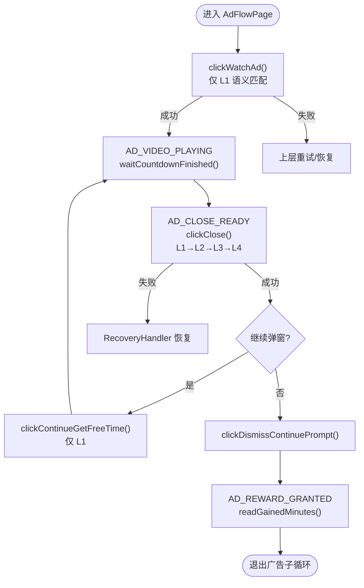
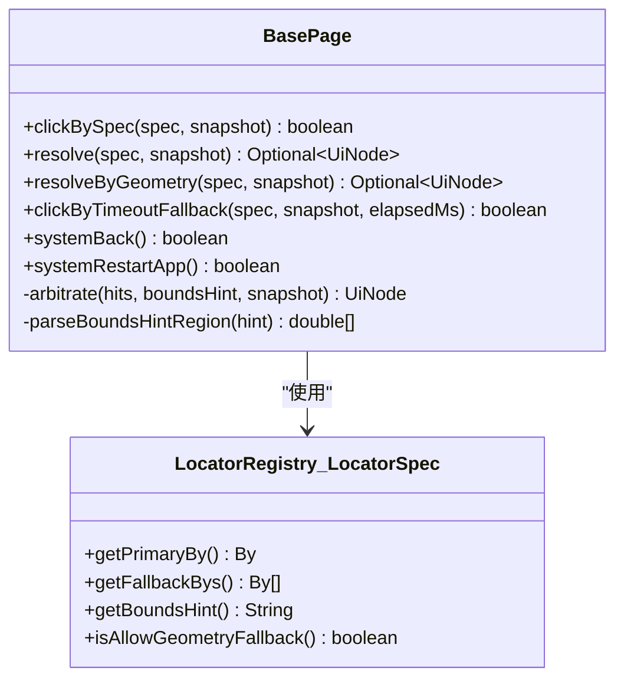
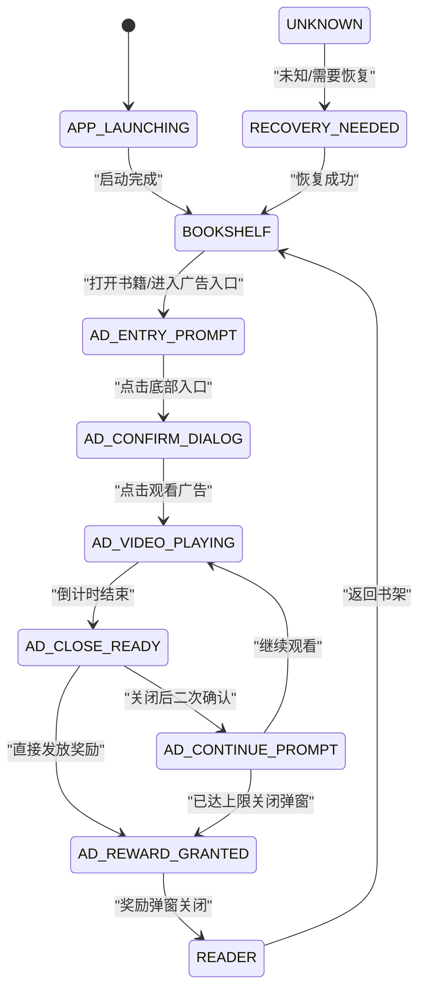
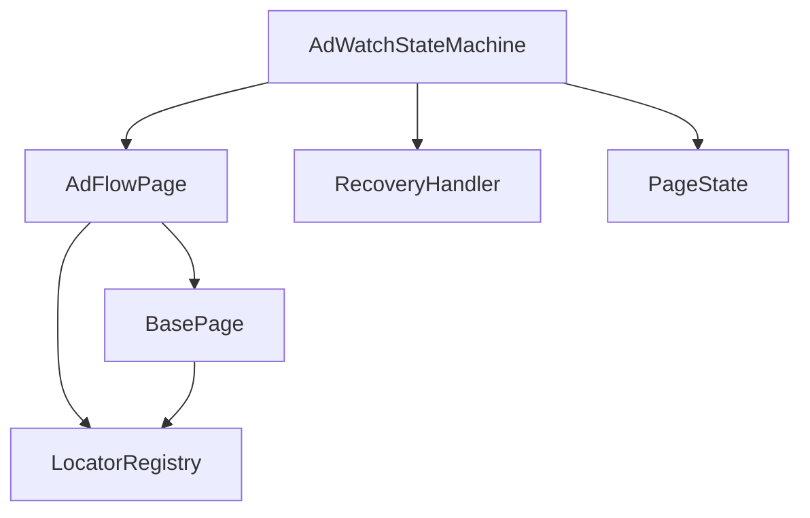

# 广告流程页面

<cite>
**本文引用的文件**
- [AdFlowPage.java](file://automation/src/main/java/com/fanqie/auto/page/AdFlowPage.java)
- [BasePage.java](file://automation/src/main/java/com/fanqie/auto/page/BasePage.java)
- [LocatorRegistry.java](file://automation/src/main/java/com/fanqie/auto/config/LocatorRegistry.java)
- [PageState.java](file://automation/src/main/java/com/fanqie/auto/core/PageState.java)
- [AdWatchStateMachine.java](file://automation/src/main/java/com/fanqie/auto/task/AdWatchStateMachine.java)
- [RecoveryHandler.java](file://automation/src/main/java/com/fanqie/auto/task/RecoveryHandler.java)
- [AdFlowPageTest.java](file://automation/src/test/java/com/fanqie/auto/page/AdFlowPageTest.java)
</cite>

## 目录
1. [简介](#简介)
2. [项目结构](#项目结构)
3. [核心组件](#核心组件)
4. [架构总览](#架构总览)
5. [详细组件分析](#详细组件分析)
6. [依赖关系分析](#依赖关系分析)
7. [性能与稳定性](#性能与稳定性)
8. [故障排查指南](#故障排查指南)
9. [结论](#结论)
10. [附录：使用示例与集成方式](#附录使用示例与集成方式)

## 简介
本文件面向“广告流程页面”的自动化实现，聚焦 AdFlowPage 类如何识别并处理多种广告类型（激励视频、插屏/开屏等），以及状态检测、关闭按钮识别、跳过功能、异常恢复策略和与状态机的集成方式。文档以代码为依据，提供可追溯的章节来源与图示，帮助读者从高层到细节逐步理解整个广告流程。

## 项目结构
围绕广告流程的核心文件组织如下：
- 页面对象层：AdFlowPage 负责广告页面的具体操作；BasePage 提供四级定位降级链与点击能力。
- 配置与定位：LocatorRegistry 集中管理控件的定位策略与候选文案。
- 状态机：AdWatchStateMachine 驱动广告子循环，按当前状态决定下一步动作。
- 恢复机制：RecoveryHandler 提供五级自愈策略，保证任意失败回到已知锚点。
- 状态枚举：PageState 定义所有页面状态，作为状态机输入。
- 测试：AdFlowPageTest 对奖励分钟数提取进行离线验证。

图表来源
- [AdFlowPage.java:21-65](file://automation/src/main/java/com/fanqie/auto/page/AdFlowPage.java#L21-L65)
- [BasePage.java:18-39](file://automation/src/main/java/com/fanqie/auto/page/BasePage.java#L18-L39)
- [LocatorRegistry.java:16-25](file://automation/src/main/java/com/fanqie/auto/config/LocatorRegistry.java#L16-L25)
- [AdWatchStateMachine.java:40-61](file://automation/src/main/java/com/fanqie/auto/task/AdWatchStateMachine.java#L40-L61)
- [PageState.java:11-56](file://automation/src/main/java/com/fanqie/auto/core/PageState.java#L11-L56)
- [RecoveryHandler.java:23-43](file://automation/src/main/java/com/fanqie/auto/task/RecoveryHandler.java#L23-L43)

章节来源
- [AdFlowPage.java:21-65](file://automation/src/main/java/com/fanqie/auto/page/AdFlowPage.java#L21-L65)
- [BasePage.java:18-39](file://automation/src/main/java/com/fanqie/auto/page/BasePage.java#L18-L39)
- [LocatorRegistry.java:16-25](file://automation/src/main/java/com/fanqie/auto/config/LocatorRegistry.java#L16-L25)
- [AdWatchStateMachine.java:40-61](file://automation/src/main/java/com/fanqie/auto/task/AdWatchStateMachine.java#L40-L61)
- [PageState.java:11-56](file://automation/src/main/java/com/fanqie/auto/core/PageState.java#L11-L56)
- [RecoveryHandler.java:23-43](file://automation/src/main/java/com/fanqie/auto/task/RecoveryHandler.java#L23-L43)

## 核心组件
- AdFlowPage：封装广告流程中的关键操作，包括点击观看广告、等待倒计时结束、点击关闭、继续获取时长、读取奖励分钟数、关闭继续弹窗等。
- BasePage：提供四级定位降级链（语义匹配→几何推断→时序兜底→系统兜底）与通用点击方法。
- LocatorRegistry：维护各逻辑控件的定位规格（主定位器、回退定位器、区域提示、是否允许几何兜底）。
- AdWatchStateMachine：基于转移表的状态机，驱动广告子循环，包含熔断、幂等、退避重试、进度持久化等。
- RecoveryHandler：五级恢复策略，确保异常状态下回到书架或阅读页。
- PageState：定义所有页面状态，供状态机与检测层统一使用。

章节来源
- [AdFlowPage.java:21-65](file://automation/src/main/java/com/fanqie/auto/page/AdFlowPage.java#L21-L65)
- [BasePage.java:18-39](file://automation/src/main/java/com/fanqie/auto/page/BasePage.java#L18-L39)
- [LocatorRegistry.java:16-25](file://automation/src/main/java/com/fanqie/auto/config/LocatorRegistry.java#L16-L25)
- [AdWatchStateMachine.java:40-61](file://automation/src/main/java/com/fanqie/auto/task/AdWatchStateMachine.java#L40-L61)
- [RecoveryHandler.java:23-43](file://automation/src/main/java/com/fanqie/auto/task/RecoveryHandler.java#L23-L43)
- [PageState.java:11-56](file://automation/src/main/java/com/fanqie/auto/core/PageState.java#L11-L56)

## 架构总览
广告流程由状态机驱动，AdFlowPage 作为页面对象执行具体动作，BasePage 提供统一的定位与点击能力，LocatorRegistry 提供控件定位策略，RecoveryHandler 在异常时介入恢复。

图表来源
- [AdWatchStateMachine.java:450-522](file://automation/src/main/java/com/fanqie/auto/task/AdWatchStateMachine.java#L450-L522)
- [AdFlowPage.java:76-101](file://automation/src/main/java/com/fanqie/auto/page/AdFlowPage.java#L76-L101)
- [AdFlowPage.java:116-163](file://automation/src/main/java/com/fanqie/auto/page/AdFlowPage.java#L116-L163)
- [AdFlowPage.java:180-262](file://automation/src/main/java/com/fanqie/auto/page/AdFlowPage.java#L180-L262)
- [BasePage.java:84-219](file://automation/src/main/java/com/fanqie/auto/page/BasePage.java#L84-L219)
- [LocatorRegistry.java:186-218](file://automation/src/main/java/com/fanqie/auto/config/LocatorRegistry.java#L186-L218)
- [RecoveryHandler.java:100-253](file://automation/src/main/java/com/fanqie/auto/task/RecoveryHandler.java#L100-L253)

## 详细组件分析

### AdFlowPage：广告流程页面对象
职责与关键点：
- 点击「观看广告」：仅使用 L1 语义属性匹配，禁用几何兜底，避免误点浪费配额。
- 等待倒计时结束：不做任何点击，仅心跳轮询等待状态变化，降低 CPU/RPC 压力。
- 点击「关闭」：L1→L2（右上角几何）→L3（时序）→L4（back/重启）全链路，唯一允许激进兜底的控件。
- 点击「继续获取免费时长」：仅 L1，理由同「观看广告」。
- 读取奖励分钟数：M4 修复，只认带奖励语义的文案，避免将「剩余 N 分钟」误计为奖励。
- 关闭「继续获取时长」弹窗：优先文案匹配，其次几何兜底。

图表来源
- [AdFlowPage.java:76-101](file://automation/src/main/java/com/fanqie/auto/page/AdFlowPage.java#L76-L101)
- [AdFlowPage.java:116-163](file://automation/src/main/java/com/fanqie/auto/page/AdFlowPage.java#L116-L163)
- [AdFlowPage.java:180-262](file://automation/src/main/java/com/fanqie/auto/page/AdFlowPage.java#L180-L262)
- [AdFlowPage.java:272-297](file://automation/src/main/java/com/fanqie/auto/page/AdFlowPage.java#L272-L297)
- [AdFlowPage.java:317-363](file://automation/src/main/java/com/fanqie/auto/page/AdFlowPage.java#L317-L363)
- [AdFlowPage.java:398-428](file://automation/src/main/java/com/fanqie/auto/page/AdFlowPage.java#L398-L428)

章节来源
- [AdFlowPage.java:21-65](file://automation/src/main/java/com/fanqie/auto/page/AdFlowPage.java#L21-L65)
- [AdFlowPage.java:76-101](file://automation/src/main/java/com/fanqie/auto/page/AdFlowPage.java#L76-L101)
- [AdFlowPage.java:116-163](file://automation/src/main/java/com/fanqie/auto/page/AdFlowPage.java#L116-L163)
- [AdFlowPage.java:180-262](file://automation/src/main/java/com/fanqie/auto/page/AdFlowPage.java#L180-L262)
- [AdFlowPage.java:272-297](file://automation/src/main/java/com/fanqie/auto/page/AdFlowPage.java#L272-L297)
- [AdFlowPage.java:317-363](file://automation/src/main/java/com/fanqie/auto/page/AdFlowPage.java#L317-L363)
- [AdFlowPage.java:398-428](file://automation/src/main/java/com/fanqie/auto/page/AdFlowPage.java#L398-L428)

### BasePage：四级定位降级链与点击
- L1 语义属性匹配：text → content-desc → resource-id，命中多个时用 boundsHint 裁决。
- L2 结构化几何推断：在指定区域内查找 clickable=true 且面积较小的节点，受 allowGeometryFallback 控制。
- L3 时序兜底：达到 adVideoTimeoutMs 后强制执行 L2。
- L4 系统兜底：navigate().back() 或 restartApp。
- 点击实现：取目标节点 bounds 中心坐标点击，若不可点击则回溯至最近可点击祖先。

图表来源
- [BasePage.java:84-219](file://automation/src/main/java/com/fanqie/auto/page/BasePage.java#L84-L219)
- [LocatorRegistry.java:271-298](file://automation/src/main/java/com/fanqie/auto/config/LocatorRegistry.java#L271-L298)

章节来源
- [BasePage.java:18-39](file://automation/src/main/java/com/fanqie/auto/page/BasePage.java#L18-L39)
- [BasePage.java:84-219](file://automation/src/main/java/com/fanqie/auto/page/BasePage.java#L84-L219)
- [BasePage.java:312-336](file://automation/src/main/java/com/fanqie/auto/page/BasePage.java#L312-L336)
- [BasePage.java:347-406](file://automation/src/main/java/com/fanqie/auto/page/BasePage.java#L347-L406)
- [BasePage.java:412-434](file://automation/src/main/java/com/fanqie/auto/page/BasePage.java#L412-L434)
- [LocatorRegistry.java:271-298](file://automation/src/main/java/com/fanqie/auto/config/LocatorRegistry.java#L271-L298)

### LocatorRegistry：定位策略与候选文案
- 每个逻辑控件对应一个 LocatorSpec：primaryBy + fallbackBys + boundsHint + allowGeometryFallback。
- ad.watch 与 ad.continue 的 allowGeometryFallback=false（误点会多看一轮视频、浪费每日配额）。
- ad.close 的 allowGeometryFallback=true（关闭按钮允许几何兜底，右上角小区域 clickable 节点）。
- 提供各类候选文案列表（adWatchTexts、adCloseTexts、adContinueTexts、commonDismissTexts、splashSkipTexts 等）。

章节来源
- [LocatorRegistry.java:16-25](file://automation/src/main/java/com/fanqie/auto/config/LocatorRegistry.java#L16-L25)
- [LocatorRegistry.java:123-137](file://automation/src/main/java/com/fanqie/auto/config/LocatorRegistry.java#L123-L137)
- [LocatorRegistry.java:186-218](file://automation/src/main/java/com/fanqie/auto/config/LocatorRegistry.java#L186-L218)
- [LocatorRegistry.java:220-233](file://automation/src/main/java/com/fanqie/auto/config/LocatorRegistry.java#L220-L233)
- [LocatorRegistry.java:271-298](file://automation/src/main/java/com/fanqie/auto/config/LocatorRegistry.java#L271-L298)

### AdWatchStateMachine：状态机与广告子循环
- 转移表驱动：Map<PageState, StateHandler>，当前状态决定下一步动作。
- 四重独立熔断：单入口轮次上限、全局轮次上限、目标分钟、单状态滞留超时。
- 幂等性：动作前重新 detect()，动作后校验状态转移，未转移则退避重试。
- 奖励计数幂等：roundId + lastCountedRoundId 保证每真实一轮至多计一次且不漏计。
- 每日配额耗尽识别：去抖 + 上下文约束，优雅收尾退出。
- 进度持久化：断点续跑，跨天清空 usedBooks。

图表来源
- [AdWatchStateMachine.java:398-653](file://automation/src/main/java/com/fanqie/auto/task/AdWatchStateMachine.java#L398-L653)
- [PageState.java:11-56](file://automation/src/main/java/com/fanqie/auto/core/PageState.java#L11-L56)

章节来源
- [AdWatchStateMachine.java:40-61](file://automation/src/main/java/com/fanqie/auto/task/AdWatchStateMachine.java#L40-L61)
- [AdWatchStateMachine.java:173-312](file://automation/src/main/java/com/fanqie/auto/task/AdWatchStateMachine.java#L173-L312)
- [AdWatchStateMachine.java:355-394](file://automation/src/main/java/com/fanqie/auto/task/AdWatchStateMachine.java#L355-L394)
- [AdWatchStateMachine.java:398-653](file://automation/src/main/java/com/fanqie/auto/task/AdWatchStateMachine.java#L398-L653)
- [AdWatchStateMachine.java:679-734](file://automation/src/main/java/com/fanqie/auto/task/AdWatchStateMachine.java#L679-L734)

### RecoveryHandler：五级恢复策略
- 第1级：COMMON_POPUP 尝试关闭弹窗（由弱到强）。
- 第2级：逐级 back()，每次 back 后重新 detect() 确认是否回到锚点。
- 第3级：重启 App，等待启动完成。
- 第4级：重启后主动导航到书架 Tab。
- 第5级：重建 session，刷新所有组件 driver 引用。
- 第6级：落盘诊断快照后退出。

章节来源
- [RecoveryHandler.java:23-43](file://automation/src/main/java/com/fanqie/auto/task/RecoveryHandler.java#L23-L43)
- [RecoveryHandler.java:100-253](file://automation/src/main/java/com/fanqie/auto/task/RecoveryHandler.java#L100-L253)
- [RecoveryHandler.java:269-321](file://automation/src/main/java/com/fanqie/auto/task/RecoveryHandler.java#L269-L321)

## 依赖关系分析
- AdFlowPage 依赖 BasePage 的四级定位与点击能力，依赖 LocatorRegistry 的控件定位策略。
- AdWatchStateMachine 依赖 AdFlowPage 执行广告相关动作，依赖 RecoveryHandler 处理异常恢复。
- BasePage 依赖 LocatorRegistry 的 LocatorSpec 与候选文案。
- PageState 被状态机与检测层共同使用，作为状态驱动的基础。

图表来源
- [AdFlowPage.java:21-65](file://automation/src/main/java/com/fanqie/auto/page/AdFlowPage.java#L21-L65)
- [BasePage.java:18-39](file://automation/src/main/java/com/fanqie/auto/page/BasePage.java#L18-L39)
- [LocatorRegistry.java:16-25](file://automation/src/main/java/com/fanqie/auto/config/LocatorRegistry.java#L16-L25)
- [AdWatchStateMachine.java:40-61](file://automation/src/main/java/com/fanqie/auto/task/AdWatchStateMachine.java#L40-L61)
- [PageState.java:11-56](file://automation/src/main/java/com/fanqie/auto/core/PageState.java#L11-L56)
- [RecoveryHandler.java:23-43](file://automation/src/main/java/com/fanqie/auto/task/RecoveryHandler.java#L23-L43)

章节来源
- [AdFlowPage.java:21-65](file://automation/src/main/java/com/fanqie/auto/page/AdFlowPage.java#L21-L65)
- [BasePage.java:18-39](file://automation/src/main/java/com/fanqie/auto/page/BasePage.java#L18-L39)
- [LocatorRegistry.java:16-25](file://automation/src/main/java/com/fanqie/auto/config/LocatorRegistry.java#L16-L25)
- [AdWatchStateMachine.java:40-61](file://automation/src/main/java/com/fanqie/auto/task/AdWatchStateMachine.java#L40-L61)
- [PageState.java:11-56](file://automation/src/main/java/com/fanqie/auto/core/PageState.java#L11-L56)
- [RecoveryHandler.java:23-43](file://automation/src/main/java/com/fanqie/auto/task/RecoveryHandler.java#L23-L43)

## 性能与稳定性
- 视频播放期间不点击：避免误触落地页导致流程偏离与恢复代价大。
- 稀疏轮询间隔：视频等待阶段使用较稀疏的 pollIntervalMs * 4，降低 CPU 与 RPC 压力。
- 心跳日志：按上次心跳时间戳判定，消除取模近似的漏打/重复打问题。
- 幂等性与退避重试：动作前后状态校验，连续错误触发指数退避与恢复。
- 熔断保护：四重独立熔断防止死循环空转。
- 进度持久化：断点续跑，跨天清空 usedBooks，避免重复轮转。

章节来源
- [AdFlowPage.java:116-163](file://automation/src/main/java/com/fanqie/auto/page/AdFlowPage.java#L116-L163)
- [AdWatchStateMachine.java:173-312](file://automation/src/main/java/com/fanqie/auto/task/AdWatchStateMachine.java#L173-L312)
- [AdWatchStateMachine.java:355-394](file://automation/src/main/java/com/fanqie/auto/task/AdWatchStateMachine.java#L355-L394)
- [AdWatchStateMachine.java:679-734](file://automation/src/main/java/com/fanqie/auto/task/AdWatchStateMachine.java#L679-L734)

## 故障排查指南
- 常见异常状态：UNKNOWN、COMMON_POPUP、RECOVERY_NEEDED。
- 恢复流程：优先关闭弹窗，再逐级 back，最后重启 App、导航书架、重建 session。
- 日志与诊断：记录错误类型、连续错误计数、保存现场快照。
- 每日配额耗尽：去抖 + 上下文约束，优雅收尾退出，避免落入 UNKNOWN 反复重试。

章节来源
- [RecoveryHandler.java:100-253](file://automation/src/main/java/com/fanqie/auto/task/RecoveryHandler.java#L100-L253)
- [AdWatchStateMachine.java:197-215](file://automation/src/main/java/com/fanqie/auto/task/AdWatchStateMachine.java#L197-L215)
- [AdWatchStateMachine.java:217-233](file://automation/src/main/java/com/fanqie/auto/task/AdWatchStateMachine.java#L217-L233)

## 结论
AdFlowPage 通过严格的四级定位降级链与谨慎的点击策略，确保了广告流程的稳定性和安全性。状态机驱动的广告子循环具备幂等性、熔断保护和恢复机制，能够有效应对各种广告形式与异常情况。结合 LocatorRegistry 的配置化管理与 RecoveryHandler 的五级恢复策略，整个广告流程具备高鲁棒性与可维护性。

## 附录：使用示例与集成方式
- 配置广告流程：
  - 在 LocatorRegistry 中配置各控件的候选文案与定位策略，确保 ad.watch 与 ad.continue 的 allowGeometryFallback=false，ad.close 的 allowGeometryFallback=true。
  - 设置状态机参数：目标分钟、轮次上限、超时阈值、心跳间隔等。
- 集成状态机：
  - 在任务入口处调用 runAdSubLoop()，传入当前状态，状态机会自动处理广告相关状态。
  - 监听状态变化，记录进度与错误信息。
- 处理不同类型广告：
  - 激励视频：AD_ENTRY_PROMPT → AD_CONFIRM_DIALOG → AD_VIDEO_PLAYING → AD_CLOSE_READY → AD_REWARD_GRANTED。
  - 开屏广告：SPLASH_AD，优先点击「跳过」，否则复用 clickClose() 降级链。
  - 插屏/弹窗：COMMON_POPUP，交由 RecoveryHandler 关闭。
- 奖励分钟数提取：
  - 使用 readGainedMinutes() 从快照中提取带奖励语义的分钟数，无命中时返回 0，由状态机兜底估值。
- 测试验证：
  - 使用 AdFlowPageTest 对奖励分钟数提取进行离线验证，确保 M4 修复正确。

章节来源
- [LocatorRegistry.java:186-218](file://automation/src/main/java/com/fanqie/auto/config/LocatorRegistry.java#L186-L218)
- [AdWatchStateMachine.java:416-430](file://automation/src/main/java/com/fanqie/auto/task/AdWatchStateMachine.java#L416-L430)
- [AdFlowPage.java:317-363](file://automation/src/main/java/com/fanqie/auto/page/AdFlowPage.java#L317-L363)
- [AdFlowPageTest.java:43-79](file://automation/src/test/java/com/fanqie/auto/page/AdFlowPageTest.java#L43-L79)