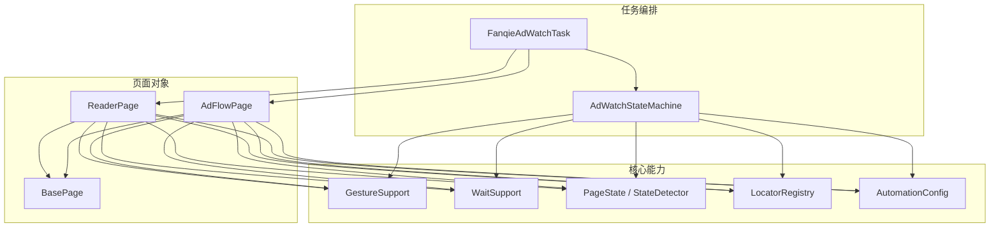
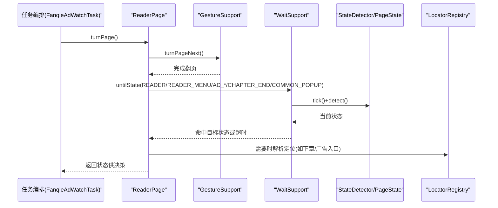
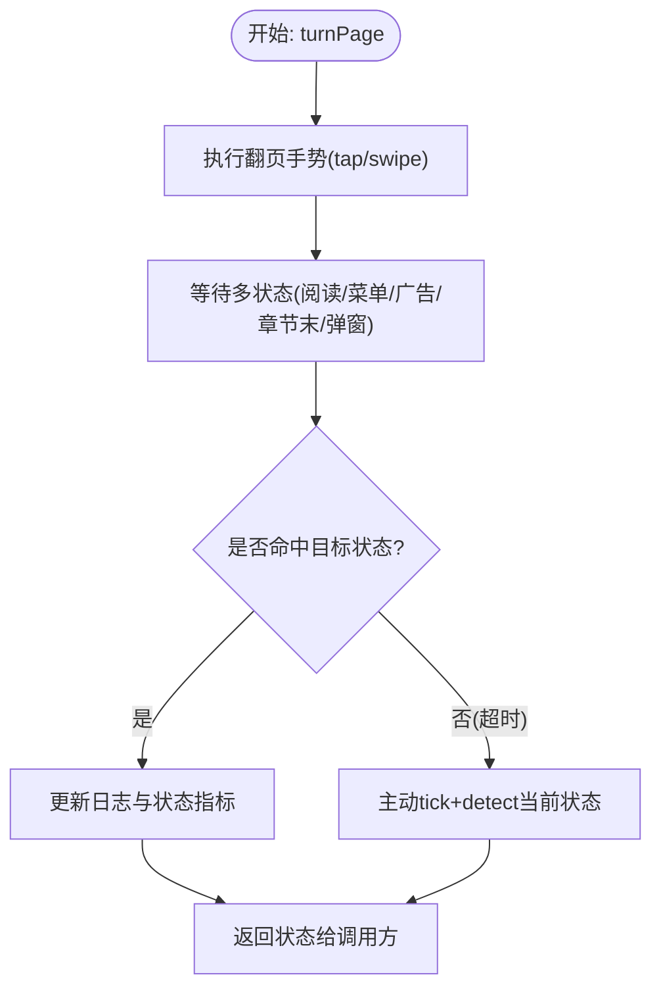
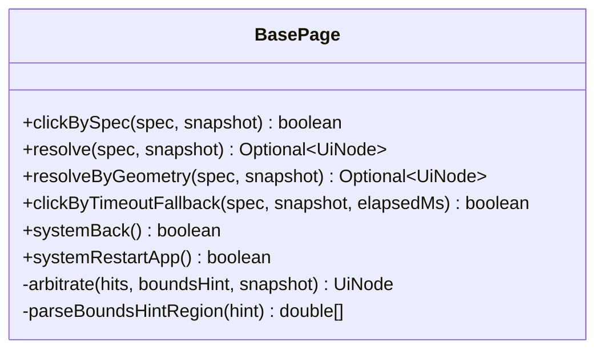
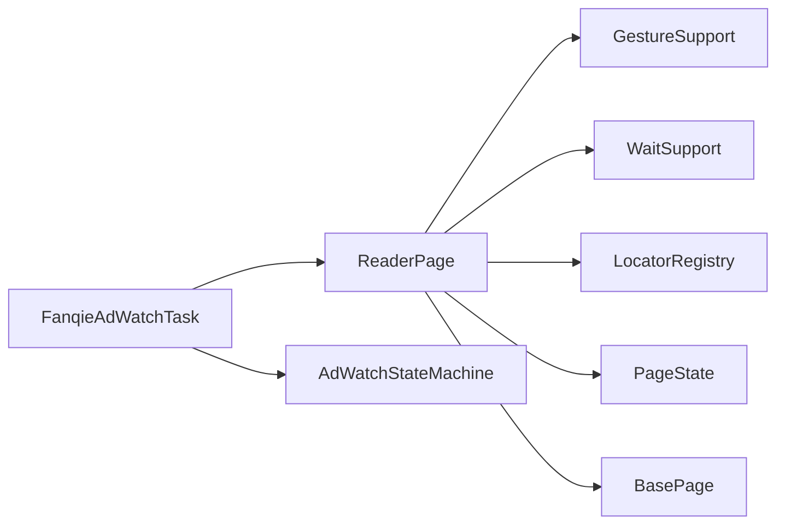
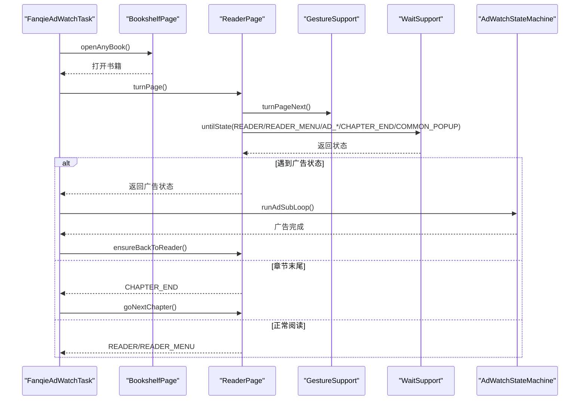

# 阅读器页面操作

<cite>
**本文引用的文件**
- [ReaderPage.java](file://automation/src/main/java/com/fanqie/auto/page/ReaderPage.java)
- [BasePage.java](file://automation/src/main/java/com/fanqie/auto/page/BasePage.java)
- [GestureSupport.java](file://automation/src/main/java/com/fanqie/auto/core/GestureSupport.java)
- [WaitSupport.java](file://automation/src/main/java/com/fanqie/auto/core/WaitSupport.java)
- [PageState.java](file://automation/src/main/java/com/fanqie/auto/core/PageState.java)
- [LocatorRegistry.java](file://automation/src/main/java/com/fanqie/auto/config/LocatorRegistry.java)
- [AutomationConfig.java](file://automation/src/main/java/com/fanqie/auto/config/AutomationConfig.java)
- [FanqieAdWatchTask.java](file://automation/src/main/java/com/fanqie/auto/task/FanqieAdWatchTask.java)
- [AdWatchStateMachine.java](file://automation/src/main/java/com/fanqie/auto/task/AdWatchStateMachine.java)
</cite>

## 目录
1. [简介](#简介)
2. [项目结构](#项目结构)
3. [核心组件](#核心组件)
4. [架构总览](#架构总览)
5. [详细组件分析](#详细组件分析)
6. [依赖关系分析](#依赖关系分析)
7. [性能与稳定性考量](#性能与稳定性考量)
8. [故障排查指南](#故障排查指南)
9. [结论](#结论)
10. [附录：自动化控制示例流程](#附录：自动化控制示例流程)

## 简介
本文件聚焦“阅读器页面”的自动化控制，围绕 ReaderPage 类展开，系统说明翻页、菜单弹出与收起、设置调整（通过阅读页菜单）、广告入口点击与处理、章节跳转等关键能力。文档同时解释手势识别与处理（滑动/点击热区）、不同界面状态（全屏阅读、菜单态、广告态、章节末）的处理策略，并给出与广告观看流程协同的端到端自动化控制示例。

## 项目结构
本项目采用分层+职责分离的组织方式：
- page：页面对象封装具体业务动作（如 ReaderPage、BookshelfPage、AdFlowPage）
- core：通用能力（手势、等待、快照、状态检测、日志）
- config：配置与定位器注册表
- task：任务编排（启动 App、进入书架、打开书、主循环、广告子循环、恢复）

图表来源
- [FanqieAdWatchTask.java:99-314](file://automation/src/main/java/com/fanqie/auto/task/FanqieAdWatchTask.java#L99-L314)
- [ReaderPage.java:42-271](file://automation/src/main/java/com/fanqie/auto/page/ReaderPage.java#L42-L271)
- [BasePage.java:40-516](file://automation/src/main/java/com/fanqie/auto/page/BasePage.java#L40-L516)
- [GestureSupport.java:26-228](file://automation/src/main/java/com/fanqie/auto/core/GestureSupport.java#L26-L228)
- [WaitSupport.java:26-234](file://automation/src/main/java/com/fanqie/auto/core/WaitSupport.java#L26-L234)
- [PageState.java:11-97](file://automation/src/main/java/com/fanqie/auto/core/PageState.java#L11-L97)
- [LocatorRegistry.java:26-300](file://automation/src/main/java/com/fanqie/auto/config/LocatorRegistry.java#L26-L300)
- [AutomationConfig.java:18-306](file://automation/src/main/java/com/fanqie/auto/config/AutomationConfig.java#L18-L306)

章节来源
- [FanqieAdWatchTask.java:99-314](file://automation/src/main/java/com/fanqie/auto/task/FanqieAdWatchTask.java#L99-L314)
- [ReaderPage.java:42-271](file://automation/src/main/java/com/fanqie/auto/page/ReaderPage.java#L42-L271)

## 核心组件
- ReaderPage：阅读页动作封装，提供翻页、下一章、底部广告入口检测与点击等能力；负责翻页后多状态等待与状态上报。
- BasePage：四级定位降级链（语义匹配→几何推断→时序兜底→系统兜底），统一点击实现与区域裁决。
- GestureSupport：手势抽象，tap/swipe/activate/terminate/restart 等，坐标按屏幕比例计算，避免硬编码像素。
- WaitSupport：统一等待原语，untilState/untilAnyTextPresent/untilSnapshotMatches/runWithRetry。
- PageState：页面状态枚举，定义阅读家族、广告家族、异常状态等分类方法。
- LocatorRegistry：控件定位规格（primaryBy + fallbackBys + boundsHint + allowGeometryFallback）。
- AutomationConfig：全局配置（超时、轮次、阈值、翻页策略等）。
- FanqieAdWatchTask：任务编排，串联书架→阅读→广告子循环→恢复→轮换书籍。
- AdWatchStateMachine：广告流程状态机，处理广告各阶段及阅读页菜单态处理。

章节来源
- [ReaderPage.java:42-271](file://automation/src/main/java/com/fanqie/auto/page/ReaderPage.java#L42-L271)
- [BasePage.java:40-516](file://automation/src/main/java/com/fanqie/auto/page/BasePage.java#L40-L516)
- [GestureSupport.java:26-228](file://automation/src/main/java/com/fanqie/auto/core/GestureSupport.java#L26-L228)
- [WaitSupport.java:26-234](file://automation/src/main/java/com/fanqie/auto/core/WaitSupport.java#L26-L234)
- [PageState.java:11-97](file://automation/src/main/java/com/fanqie/auto/core/PageState.java#L11-L97)
- [LocatorRegistry.java:26-300](file://automation/src/main/java/com/fanqie/auto/config/LocatorRegistry.java#L26-L300)
- [AutomationConfig.java:18-306](file://automation/src/main/java/com/fanqie/auto/config/AutomationConfig.java#L18-L306)
- [FanqieAdWatchTask.java:99-314](file://automation/src/main/java/com/fanqie/auto/task/FanqieAdWatchTask.java#L99-L314)
- [AdWatchStateMachine.java:619-639](file://automation/src/main/java/com/fanqie/auto/task/AdWatchStateMachine.java#L619-L639)

## 架构总览
阅读器自动化由“任务编排层”驱动，“页面对象层”执行具体动作，“核心能力层”提供稳定可靠的等待、手势、定位与状态检测。ReaderPage 作为阅读页的核心控制器，协调手势、等待与状态机，确保在复杂 UI（自绘正文、广告弹窗、菜单态）下仍保持稳定。

图表来源
- [ReaderPage.java:69-96](file://automation/src/main/java/com/fanqie/auto/page/ReaderPage.java#L69-L96)
- [GestureSupport.java:77-95](file://automation/src/main/java/com/fanqie/auto/core/GestureSupport.java#L77-L95)
- [WaitSupport.java:56-86](file://automation/src/main/java/com/fanqie/auto/core/WaitSupport.java#L56-L86)
- [LocatorRegistry.java:174-244](file://automation/src/main/java/com/fanqie/auto/config/LocatorRegistry.java#L174-L244)

## 详细组件分析

### ReaderPage：阅读页自动化控制中枢
- 翻页（下一页/上一页）
  - 委托 GestureSupport.turnPageNext()/turnPagePrev()，支持 tap 或 swipe 两种策略（由配置决定）。
  - 翻页后使用 WaitSupport.untilState 一次等待多个可能状态（阅读、菜单、广告入口/确认/播放/可关闭、章节末、通用弹窗），避免因直接触发广告导致白等超时。
  - 成功判据：动作后 detect() 仍为阅读家族（含菜单态）且未出现异常态；可选截图差异校验（默认关闭以降低开销）。
- 跳转到下一章
  - 优先尝试 LocatorRegistry.getChapterNext() 定位并点击；若当前已在章节末则直接点击。
  - 否则循环翻页直到 CHAPTER_END 或达到每轮上限；遇到非阅读家族状态（广告/弹窗）暂停跳章交由上层处理。
  - 点击成功后等待回到阅读家族；失败时回退到文案匹配或返回 false。
- 底部广告入口
  - hasBottomRewardEntry：在屏幕底部区域（y>0.7H）查找匹配 adEntryTexts 的节点。
  - clickBottomRewardEntry：先走 LocatorSpec 降级链（带 boundsHint 裁决），再回退到文案直接匹配并取最底部节点点击。
- 内部点击实现
  - 基于 BasePage.clickNode：从 UiSnapshot 中取命中节点 bounds 中心点击；若不可点击则回溯最近可点击祖先；无有效 bounds 则跳过。

图表来源
- [ReaderPage.java:69-96](file://automation/src/main/java/com/fanqie/auto/page/ReaderPage.java#L69-L96)
- [WaitSupport.java:56-86](file://automation/src/main/java/com/fanqie/auto/core/WaitSupport.java#L56-L86)

章节来源
- [ReaderPage.java:69-160](file://automation/src/main/java/com/fanqie/auto/page/ReaderPage.java#L69-L160)
- [ReaderPage.java:170-225](file://automation/src/main/java/com/fanqie/auto/page/ReaderPage.java#L170-L225)
- [ReaderPage.java:232-269](file://automation/src/main/java/com/fanqie/auto/page/ReaderPage.java#L232-L269)

### BasePage：四级定位与点击
- L1 语义属性匹配：text → content-desc → resource-id（精确/包含），命中多个时用 boundsHint 裁决（底部、居中、右上角等）。
- L2 结构化几何推断：在指定区域内筛选 clickable=true 且面积较小的节点；受 allowGeometryFallback 标志保护，防止误点浪费配额。
- L3 时序兜底：当等待达到 adVideoTimeoutMs 后，即使 L1 未命中也执行 L2 几何点击（同样受 allowGeometryFallback 约束）。
- L4 系统兜底：navigate().back() 强制退出；再失败则重启 App。
- 点击实现：clickNode 取 bounds 中心，必要时回溯可点击祖先；规避 stale element 与自绘控件无法获取 WebElement 的问题。

图表来源
- [BasePage.java:84-250](file://automation/src/main/java/com/fanqie/auto/page/BasePage.java#L84-L250)
- [BasePage.java:312-434](file://automation/src/main/java/com/fanqie/auto/page/BasePage.java#L312-L434)

章节来源
- [BasePage.java:84-250](file://automation/src/main/java/com/fanqie/auto/page/BasePage.java#L84-L250)
- [BasePage.java:312-434](file://automation/src/main/java/com/fanqie/auto/page/BasePage.java#L312-L434)

### GestureSupport：手势与屏幕比例
- 翻页策略：tap（默认，右侧热区）或 swipe（设备端 mobile: swipeGesture）。
- 通用手势：tapAtRatio/tapAtPixel、swipeUp/Down/Left/Right。
- App 生命周期：activateApp/terminateApp/restartApp，避免硬编码 Activity 导致的权限问题。
- 屏幕尺寸缓存：减少 RPC 开销，driver 刷新时失效。

章节来源
- [GestureSupport.java:77-178](file://automation/src/main/java/com/fanqie/auto/core/GestureSupport.java#L77-L178)
- [GestureSupport.java:189-226](file://automation/src/main/java/com/fanqie/auto/core/GestureSupport.java#L189-L226)

### WaitSupport：统一等待原语
- untilState：一次等待多个目标状态，避免翻页后直接进入广告导致白等。
- untilStateGone：等待某状态消失（如视频播放结束）。
- untilAnyTextPresent/untilSnapshotMatches：文本/自定义条件等待。
- runWithRetry：指数退避重试，提升鲁棒性。

章节来源
- [WaitSupport.java:56-119](file://automation/src/main/java/com/fanqie/auto/core/WaitSupport.java#L56-L119)
- [WaitSupport.java:121-234](file://automation/src/main/java/com/fanqie/auto/core/WaitSupport.java#L121-L234)

### PageState：状态分类与家族判定
- 阅读家族：READER、READER_MENU（菜单态视为可自愈子态）。
- 广告家族：AD_ENTRY_PROMPT、AD_CONFIRM_DIALOG、AD_VIDEO_PLAYING、AD_CLOSE_READY、AD_CONTINUE_PROMPT、AD_REWARD_GRANTED。
- 异常状态：UNKNOWN、RECOVERY_NEEDED、COMMON_POPUP。

章节来源
- [PageState.java:11-97](file://automation/src/main/java/com/fanqie/auto/core/PageState.java#L11-L97)

### LocatorRegistry：定位规格与候选集
- 每个逻辑控件对应 LocatorSpec：primaryBy + fallbackBys + boundsHint + allowGeometryFallback。
- 关键控件：书架 Tab、书籍条目、底部广告入口、观看广告、关闭按钮、继续获取时长、下一章、通用关闭。
- 允许几何兜底的只有关闭按钮（误点后果小于漏点卡死），观看/继续按钮禁止几何兜底以防浪费配额。

章节来源
- [LocatorRegistry.java:174-244](file://automation/src/main/java/com/fanqie/auto/config/LocatorRegistry.java#L174-L244)
- [LocatorRegistry.java:271-298](file://automation/src/main/java/com/fanqie/auto/config/LocatorRegistry.java#L271-L298)

### AutomationConfig：关键配置项
- 翻页策略：reader.turn.strategy（tap/swipe）、点击比例、滑动参数。
- 超时与轮次：actionTimeoutMs、adVideoTimeoutMs、pagesPerCycle、maxTotalAdRounds、targetFreeMinutes 等。
- 验证开关：verifyPageTurnedByScreenshot（默认关闭以节省开销）。

章节来源
- [AutomationConfig.java:180-287](file://automation/src/main/java/com/fanqie/auto/config/AutomationConfig.java#L180-L287)

## 依赖关系分析
- ReaderPage 依赖 GestureSupport（执行翻页）、WaitSupport（多状态等待）、LocatorRegistry（定位下一章/广告入口）、PageState（状态判断）。
- BasePage 提供统一的四级定位与点击，被 ReaderPage/AdFlowPage 复用。
- FanqieAdWatchTask 编排整体流程，调用 ReaderPage 翻页与下一章，结合 AdWatchStateMachine 处理广告子循环，并在异常时调用 RecoveryHandler。

图表来源
- [FanqieAdWatchTask.java:99-314](file://automation/src/main/java/com/fanqie/auto/task/FanqieAdWatchTask.java#L99-L314)
- [ReaderPage.java:42-271](file://automation/src/main/java/com/fanqie/auto/page/ReaderPage.java#L42-L271)

章节来源
- [FanqieAdWatchTask.java:99-314](file://automation/src/main/java/com/fanqie/auto/task/FanqieAdWatchTask.java#L99-L314)
- [ReaderPage.java:42-271](file://automation/src/main/java/com/fanqie/auto/page/ReaderPage.java#L42-L271)

## 性能与稳定性考量
- 翻页后多状态等待：避免只等 READER 导致白等超时，将广告态纳入同一次等待，显著提升稳定性。
- 截图差异校验默认关闭：降低长任务累积开销（每次截图 200-500ms）。
- 手势使用 mobile: 命令：比 W3C PointerInput 多点注入更稳，减少注入失败风险。
- 四级定位降级链：语义优先、几何兜底受严格保护，避免误点浪费每日配额。
- 指数退避重试：对偶发 UI 竞争失败提供自愈能力。

[本节为通用指导，不直接分析具体文件]

## 故障排查指南
- 翻页无效或状态异常
  - 检查翻页策略配置（tap/swipe）与点击比例是否正确。
  - 查看 WaitSupport 等待的目标状态集合是否覆盖实际出现的广告/弹窗。
  - 使用 RunLogger 与 StateDetector 输出当前状态与快照，确认是否进入 UNKNOWN/COMMON_POPUP。
- 广告入口未点击
  - 确认 LocatorRegistry 中 adEntryTexts 与 boundsHint（y>0.8）配置正确。
  - 若 L1 未命中，检查是否允许几何兜底（adEntry 不允许），必要时回退到文案直接匹配。
- 菜单态反复弹收
  - 避免在正中央 (0.5,0.5) 重复点击；优先使用右侧热区 (0.85,0.50) 或 systemBack() 收起。
- 章节跳转失败
  - 检查 chapterNextTexts 与定位规则；若失败，确认是否已到达 CHAPTER_END 或翻页次数已达上限。

章节来源
- [ReaderPage.java:69-160](file://automation/src/main/java/com/fanqie/auto/page/ReaderPage.java#L69-L160)
- [BasePage.java:150-219](file://automation/src/main/java/com/fanqie/auto/page/BasePage.java#L150-L219)
- [AdWatchStateMachine.java:619-639](file://automation/src/main/java/com/fanqie/auto/task/AdWatchStateMachine.java#L619-L639)

## 结论
ReaderPage 通过“手势+等待+定位+状态机”的组合，实现了阅读页的稳定自动化控制。其关键设计在于：
- 翻页后一次性等待多状态，兼容广告直出场景；
- 四级定位降级链保障在不同 UI 形态下的鲁棒性；
- 严格保护误点路径，避免浪费用户每日配额；
- 与任务编排和广告状态机紧密协作，形成完整的阅读-广告闭环。

[本节为总结，不直接分析具体文件]

## 附录：自动化控制示例流程
以下示例展示如何从书架进入阅读页，执行若干次翻页，并在遇到广告时进入广告子循环，最终回到阅读页继续流程。

图表来源
- [FanqieAdWatchTask.java:197-305](file://automation/src/main/java/com/fanqie/auto/task/FanqieAdWatchTask.java#L197-L305)
- [ReaderPage.java:69-160](file://automation/src/main/java/com/fanqie/auto/page/ReaderPage.java#L69-L160)
- [AdWatchStateMachine.java:619-639](file://automation/src/main/java/com/fanqie/auto/task/AdWatchStateMachine.java#L619-L639)

章节来源
- [FanqieAdWatchTask.java:197-305](file://automation/src/main/java/com/fanqie/auto/task/FanqieAdWatchTask.java#L197-L305)
- [ReaderPage.java:69-160](file://automation/src/main/java/com/fanqie/auto/page/ReaderPage.java#L69-L160)