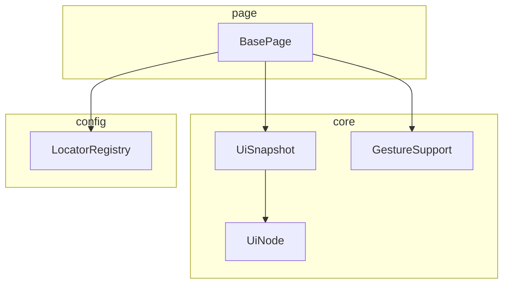
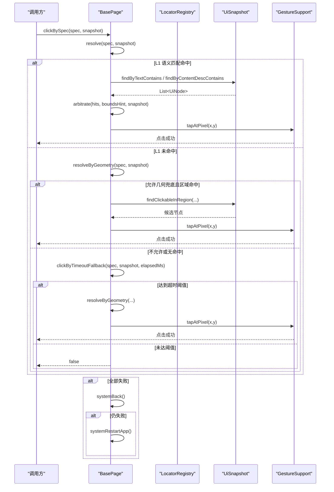
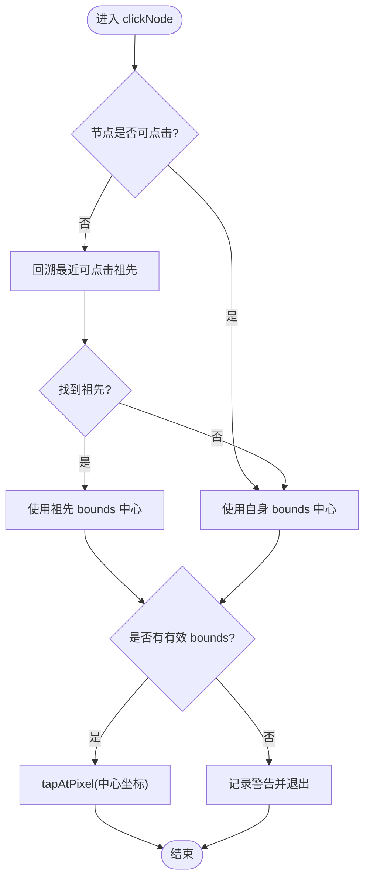
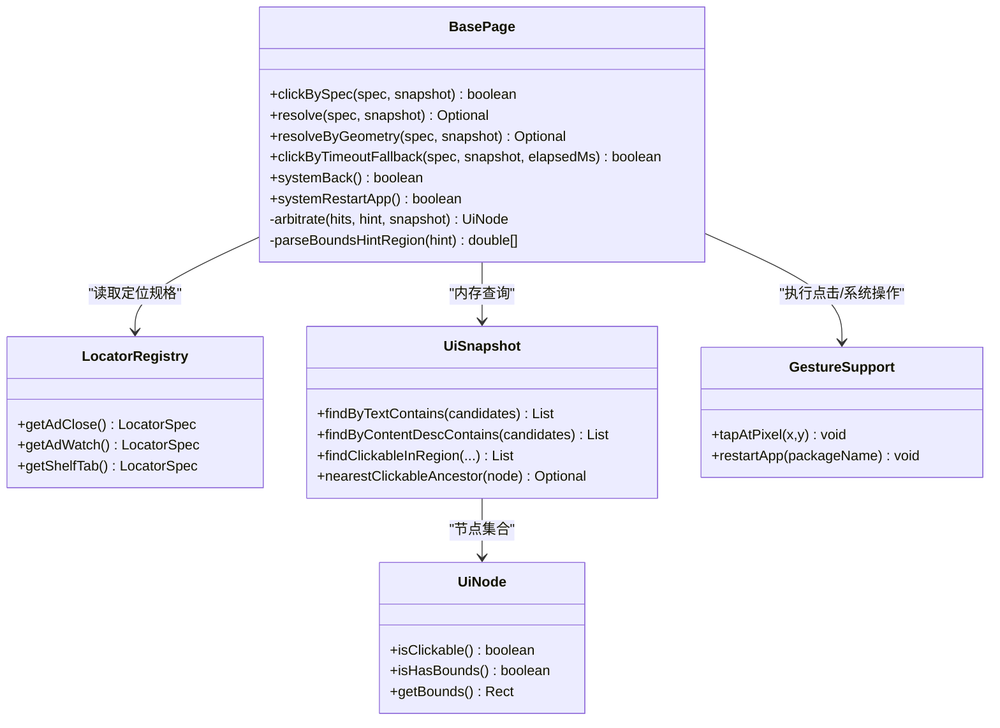

# 页面基类设计

<cite>
**本文引用的文件**
- [BasePage.java](file://automation/src/main/java/com/fanqie/auto/page/BasePage.java)
- [LocatorRegistry.java](file://automation/src/main/java/com/fanqie/auto/config/LocatorRegistry.java)
- [UiSnapshot.java](file://automation/src/main/java/com/fanqie/auto/core/UiSnapshot.java)
- [UiNode.java](file://automation/src/main/java/com/fanqie/auto/core/UiNode.java)
- [GestureSupport.java](file://automation/src/main/java/com/fanqie/auto/core/GestureSupport.java)
- [BasePageTest.java](file://automation/src/test/java/com/fanqie/auto/page/BasePageTest.java)
</cite>

## 目录
1. [引言](#引言)
2. [项目结构](#项目结构)
3. [核心组件](#核心组件)
4. [架构总览](#架构总览)
5. [详细组件分析](#详细组件分析)
6. [依赖关系分析](#依赖关系分析)
7. [性能考量](#性能考量)
8. [故障排查指南](#故障排查指南)
9. [结论](#结论)
10. [附录：使用示例与最佳实践](#附录使用示例与最佳实践)

## 引言
本文聚焦于自动化测试中的“页面基类”设计，深入解析 BasePage 的四级定位器降级链与 boundsHint 区域裁决策略，并说明 clickNode 的智能点击逻辑与误点防护机制。目标是帮助读者在不熟悉底层实现的情况下，也能理解并正确使用该框架进行稳定、可维护的 UI 自动化操作。

## 项目结构
本项目采用分层组织方式：
- page 层：页面对象基类与具体页面（如书架、阅读器、广告流程）
- core 层：UI 快照、节点模型、手势封装等通用能力
- config 层：定位器注册表与配置
- task 层：任务编排与状态机
- test 层：用例与 fixtures

图表来源
- [BasePage.java:18-40](file://automation/src/main/java/com/fanqie/auto/page/BasePage.java#L18-L40)
- [UiSnapshot.java:21-35](file://automation/src/main/java/com/fanqie/auto/core/UiSnapshot.java#L21-L35)
- [UiNode.java:1-12](file://automation/src/main/java/com/fanqie/auto/core/UiNode.java#L1-L12)
- [GestureSupport.java:12-25](file://automation/src/main/java/com/fanqie/auto/core/GestureSupport.java#L12-L25)
- [LocatorRegistry.java:16-25](file://automation/src/main/java/com/fanqie/auto/config/LocatorRegistry.java#L16-L25)

章节来源
- [BasePage.java:18-40](file://automation/src/main/java/com/fanqie/auto/page/BasePage.java#L18-L40)
- [UiSnapshot.java:21-35](file://automation/src/main/java/com/fanqie/auto/core/UiSnapshot.java#L21-L35)
- [UiNode.java:1-12](file://automation/src/main/java/com/fanqie/auto/core/UiNode.java#L1-L12)
- [GestureSupport.java:12-25](file://automation/src/main/java/com/fanqie/auto/core/GestureSupport.java#L12-L25)
- [LocatorRegistry.java:16-25](file://automation/src/main/java/com/fanqie/auto/config/LocatorRegistry.java#L16-L25)

## 核心组件
- BasePage：承载四级定位器降级链与点击执行，提供统一入口 clickBySpec 以及 L1~L4 各阶段方法。
- LocatorRegistry：集中管理所有逻辑控件的定位规格（primaryBy、fallbackBys、boundsHint、allowGeometryFallback）。
- UiSnapshot：一次 getPageSource 的内存快照，提供纯内存查询 API（text、content-desc、resource-id、区域筛选、祖先回溯）。
- UiNode：不可变节点模型，包含文本、描述、资源ID、bounds、可点击性、层级信息等。
- GestureSupport：基于屏幕比例的手势封装，避免硬编码像素坐标。

章节来源
- [BasePage.java:75-250](file://automation/src/main/java/com/fanqie/auto/page/BasePage.java#L75-L250)
- [LocatorRegistry.java:150-256](file://automation/src/main/java/com/fanqie/auto/config/LocatorRegistry.java#L150-L256)
- [UiSnapshot.java:131-254](file://automation/src/main/java/com/fanqie/auto/core/UiSnapshot.java#L131-L254)
- [UiNode.java:13-83](file://automation/src/main/java/com/fanqie/auto/core/UiNode.java#L13-L83)
- [GestureSupport.java:99-123](file://automation/src/main/java/com/fanqie/auto/core/GestureSupport.java#L99-L123)

## 架构总览
BasePage 通过 LocatorSpec 描述目标控件，结合 UiSnapshot 在内存中完成多级定位与裁决，最终通过 GestureSupport 执行点击。整体流程如下：

图表来源
- [BasePage.java:84-250](file://automation/src/main/java/com/fanqie/auto/page/BasePage.java#L84-L250)
- [UiSnapshot.java:137-200](file://automation/src/main/java/com/fanqie/auto/core/UiSnapshot.java#L137-L200)
- [GestureSupport.java:106-123](file://automation/src/main/java/com/fanqie/auto/core/GestureSupport.java#L106-L123)

## 详细组件分析

### BasePage：四级定位器降级链
- L1 语义属性匹配（主路径）
  - 三通道依次尝试：text → content-desc → resource-id（从 primaryBy/fallbackBys 提取关键词）
  - 多命中时通过 boundsHint 裁决选择最佳节点
- L2 结构化几何推断
  - 当 L1 完全无命中时，按 boundsHint 指定的区域查找 clickable=true 且 areaRatio < 0.15 的小节点
  - 误点防护：仅当 spec.isAllowGeometryFallback() 为 true 时才允许 L2
- L3 时序兜底
  - 等待达到 adVideoTimeoutMs 后，即使 L1 未命中也强制尝试 L2（同样受 allowGeometryFallback 约束）
- L4 系统兜底
  - driver.navigate().back() 回退；再失败则重启 App

章节来源
- [BasePage.java:18-39](file://automation/src/main/java/com/fanqie/auto/page/BasePage.java#L18-L39)
- [BasePage.java:103-137](file://automation/src/main/java/com/fanqie/auto/page/BasePage.java#L103-L137)
- [BasePage.java:150-189](file://automation/src/main/java/com/fanqie/auto/page/BasePage.java#L150-L189)
- [BasePage.java:203-219](file://automation/src/main/java/com/fanqie/auto/page/BasePage.java#L203-L219)
- [BasePage.java:227-250](file://automation/src/main/java/com/fanqie/auto/page/BasePage.java#L227-L250)

### boundsHint 区域常量与裁决策略
- 常量定义
  - HINT_BOTTOM：y > 0.8H，用于底部广告入口
  - HINT_BOTTOM_TAB：y > 0.9H，用于底部导航栏 Tab
  - HINT_TOP_RIGHT：x > 0.8W 且 y < 0.2H，用于右上角关闭按钮
  - HINT_CENTER：center，用于弹窗居中按钮
- 裁决规则
  - 无区域限制：优先取面积最小的可点击节点（更具体的叶子控件）
  - 底部：取 y 最大者（最靠下）
  - 右上角：优先取中心落在 x>0.8W 且 y<0.2H 的节点，否则回退到面积最小可点击
  - 居中：取距离屏幕中心欧氏距离最近的节点

章节来源
- [BasePage.java:44-53](file://automation/src/main/java/com/fanqie/auto/page/BasePage.java#L44-L53)
- [BasePage.java:347-406](file://automation/src/main/java/com/fanqie/auto/page/BasePage.java#L347-L406)

### clickNode 智能点击逻辑
- 若命中节点自身不可点击，则通过 UiSnapshot.nearestClickableAncestor 回溯至最近的可点击祖先
- 若无有效 bounds，记录警告并放弃点击
- 计算目标节点 bounds 的中心坐标，调用 GestureSupport.tapAtPixel 执行点击
- 三个设计理由：动态坐标、规避自绘控件无法获取 WebElement、天然免疫 stale element

图表来源
- [BasePage.java:312-336](file://automation/src/main/java/com/fanqie/auto/page/BasePage.java#L312-L336)
- [UiSnapshot.java:230-254](file://automation/src/main/java/com/fanqie/auto/core/UiSnapshot.java#L230-L254)
- [GestureSupport.java:117-123](file://automation/src/main/java/com/fanqie/auto/core/GestureSupport.java#L117-L123)

章节来源
- [BasePage.java:312-336](file://automation/src/main/java/com/fanqie/auto/page/BasePage.java#L312-L336)

### LocatorRegistry：定位规格与误点防护
- 每个逻辑控件对应一个 LocatorSpec，包含：
  - primaryBy：主定位器（最高优先级）
  - fallbackBys：备选定位器列表
  - boundsHint：目标区域比例描述
  - allowGeometryFallback：是否允许 L2 几何兜底
- 关键安全策略：
  - ad.watch 与 ad.continue 的 allowGeometryFallback 必须为 false，防止误点导致浪费用户每日时长配额
  - ad.close 允许为 true，因为关闭按钮误点后果远小于漏点导致卡死

章节来源
- [LocatorRegistry.java:16-25](file://automation/src/main/java/com/fanqie/auto/config/LocatorRegistry.java#L16-L25)
- [LocatorRegistry.java:186-218](file://automation/src/main/java/com/fanqie/auto/config/LocatorRegistry.java#L186-L218)
- [LocatorRegistry.java:260-298](file://automation/src/main/java/com/fanqie/auto/config/LocatorRegistry.java#L260-L298)

### UiSnapshot：内存快照与查询
- 一次性解析 XML 构建不可变节点列表，后续查询均为纯内存操作，零 RPC
- 提供 text、content-desc、resource-id 包含匹配，区域筛选与祖先回溯
- 健壮性：XML 解析失败不抛异常，返回空快照并标记 parseFailed

章节来源
- [UiSnapshot.java:21-35](file://automation/src/main/java/com/fanqie/auto/core/UiSnapshot.java#L21-L35)
- [UiSnapshot.java:137-200](file://automation/src/main/java/com/fanqie/auto/core/UiSnapshot.java#L137-L200)
- [UiSnapshot.java:230-254](file://automation/src/main/java/com/fanqie/auto/core/UiSnapshot.java#L230-L254)

### UiNode：节点模型与几何计算
- 不可变数据表示，包含 clazz、text、content-desc、resourceId、packageName、bounds、clickable、depth、parentIndex、index
- Rect 内嵌类提供 centerX/centerY/area/areaRatio/containsRatio/centerInRegion 等方法，支撑几何特征匹配

章节来源
- [UiNode.java:13-83](file://automation/src/main/java/com/fanqie/auto/core/UiNode.java#L13-L83)
- [UiNode.java:85-216](file://automation/src/main/java/com/fanqie/auto/core/UiNode.java#L85-L216)

### GestureSupport：手势与坐标
- 所有坐标由运行时屏幕尺寸按比例计算，禁止硬编码绝对像素
- 提供 tapAtRatio、tapAtPixel、swipe 系列、activateApp/terminateApp/restartApp 等能力

章节来源
- [GestureSupport.java:12-25](file://automation/src/main/java/com/fanqie/auto/core/GestureSupport.java#L12-L25)
- [GestureSupport.java:52-67](file://automation/src/main/java/com/fanqie/auto/core/GestureSupport.java#L52-L67)
- [GestureSupport.java:106-123](file://automation/src/main/java/com/fanqie/auto/core/GestureSupport.java#L106-L123)
- [GestureSupport.java:189-226](file://automation/src/main/java/com/fanqie/auto/core/GestureSupport.java#L189-L226)

## 依赖关系分析
- BasePage 依赖 LocatorRegistry 获取控件定位规格，依赖 UiSnapshot 进行内存查询，依赖 GestureSupport 执行点击与系统操作
- UiSnapshot 依赖 UiNode 表示节点，并提供 nearestClickableAncestor 支持祖先回溯
- LocatorRegistry 内部维护多个 LocatorSpec，控制不同控件的定位策略与误点防护开关

图表来源
- [BasePage.java:84-250](file://automation/src/main/java/com/fanqie/auto/page/BasePage.java#L84-L250)
- [LocatorRegistry.java:141-148](file://automation/src/main/java/com/fanqie/auto/config/LocatorRegistry.java#L141-L148)
- [UiSnapshot.java:137-254](file://automation/src/main/java/com/fanqie/auto/core/UiSnapshot.java#L137-L254)
- [UiNode.java:50-83](file://automation/src/main/java/com/fanqie/auto/core/UiNode.java#L50-L83)
- [GestureSupport.java:117-123](file://automation/src/main/java/com/fanqie/auto/core/GestureSupport.java#L117-L123)

章节来源
- [BasePage.java:84-250](file://automation/src/main/java/com/fanqie/auto/page/BasePage.java#L84-L250)
- [LocatorRegistry.java:141-148](file://automation/src/main/java/com/fanqie/auto/config/LocatorRegistry.java#L141-L148)
- [UiSnapshot.java:137-254](file://automation/src/main/java/com/fanqie/auto/core/UiSnapshot.java#L137-L254)
- [UiNode.java:50-83](file://automation/src/main/java/com/fanqie/auto/core/UiNode.java#L50-L83)
- [GestureSupport.java:117-123](file://automation/src/main/java/com/fanqie/auto/core/GestureSupport.java#L117-L123)

## 性能考量
- 快照复用：同一 tick 内复用 UiSnapshot，避免重复抓取，显著降低 RPC 开销
- 纯内存查询：text、content-desc、resource-id、区域筛选均在内存中完成，零额外网络请求
- 几何筛选优化：areaRatio 过滤大面积容器，减少候选集规模
- 坐标缓存：GestureSupport 缓存屏幕尺寸，避免频繁获取窗口大小

[本节为通用性能讨论，不直接分析具体文件]

## 故障排查指南
- 快照为空或解析失败：检查 UiSnapshot.parseFailed 标志与原始 XML 完整性
- L1 未命中：确认 LocatorSpec 的 primaryBy/fallbackBys 是否正确，验证 text/content-desc/resource-id 是否存在
- L2 被禁止：检查 LocatorSpec.allowGeometryFallback 是否为 true；ad.watch/ad.continue 默认禁止几何兜底
- 误点风险：对可能触发视频播放的控件（观看/继续）务必禁用几何兜底，避免浪费用户配额
- 点击无效：确认目标节点有有效 bounds；必要时启用祖先回溯；检查 GestureSupport 的坐标计算

章节来源
- [BasePage.java:103-137](file://automation/src/main/java/com/fanqie/auto/page/BasePage.java#L103-L137)
- [BasePage.java:150-189](file://automation/src/main/java/com/fanqie/auto/page/BasePage.java#L150-L189)
- [UiSnapshot.java:61-72](file://automation/src/main/java/com/fanqie/auto/core/UiSnapshot.java#L61-L72)
- [LocatorRegistry.java:186-218](file://automation/src/main/java/com/fanqie/auto/config/LocatorRegistry.java#L186-L218)

## 结论
BasePage 通过四级定位器降级链实现了高鲁棒性的 UI 元素定位与点击：以语义匹配为主、几何推断为辅、时序兜底保障、系统级回退兜底。配合 boundsHint 区域裁决与误点防护机制，既保证了稳定性，又避免了误触带来的业务损失。结合 UiSnapshot 的内存快照与 GestureSupport 的比例坐标，整个方案满足“动态解析 UI 树、不写死坐标”的核心约束。

[本节为总结性内容，不直接分析具体文件]

## 附录：使用示例与最佳实践
- 使用四级定位器点击
  - 通过 LocatorRegistry 获取目标控件的 LocatorSpec
  - 调用 BasePage.clickBySpec(spec, snapshot) 执行定位与点击
  - 若失败，上层可调用 systemBack 或 systemRestartApp 进行恢复
- 使用 boundsHint 精确裁决
  - 为需要区域选择的控件设置合适的 boundsHint（如 HINT_TOP_RIGHT、HINT_BOTTOM、HINT_CENTER）
  - 在多命中场景下，裁决策略将自动选择最符合预期的节点
- 误点防护
  - 对可能触发视频播放的控件（观看/继续），确保 allowGeometryFallback=false
  - 仅在关闭按钮等低风险场景开启几何兜底
- 点击逻辑
  - 若命中节点不可点击，BasePage 会自动回溯至可点击祖先
  - 点击坐标由实时 bounds 中心计算，避免 stale element 问题

章节来源
- [BasePage.java:84-91](file://automation/src/main/java/com/fanqie/auto/page/BasePage.java#L84-L91)
- [BasePage.java:312-336](file://automation/src/main/java/com/fanqie/auto/page/BasePage.java#L312-L336)
- [LocatorRegistry.java:186-218](file://automation/src/main/java/com/fanqie/auto/config/LocatorRegistry.java#L186-L218)
- [BasePageTest.java:51-78](file://automation/src/test/java/com/fanqie/auto/page/BasePageTest.java#L51-L78)