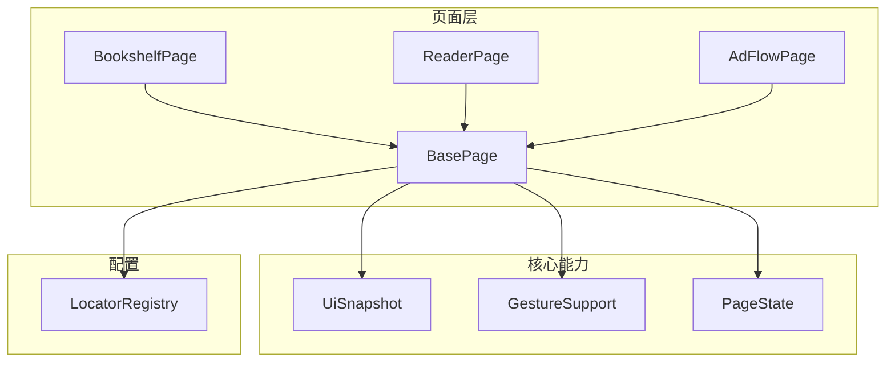
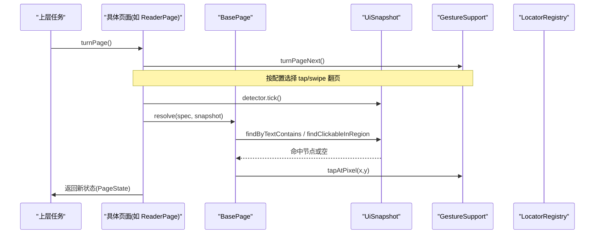
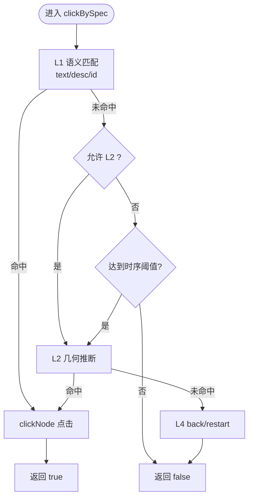
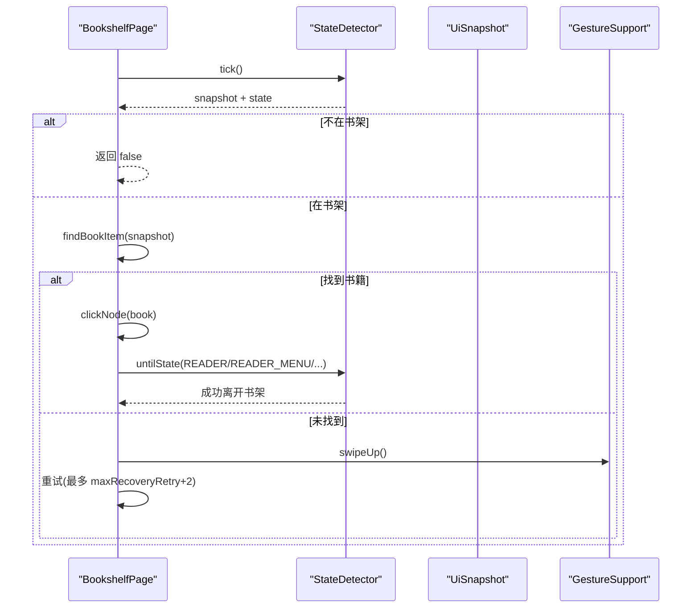
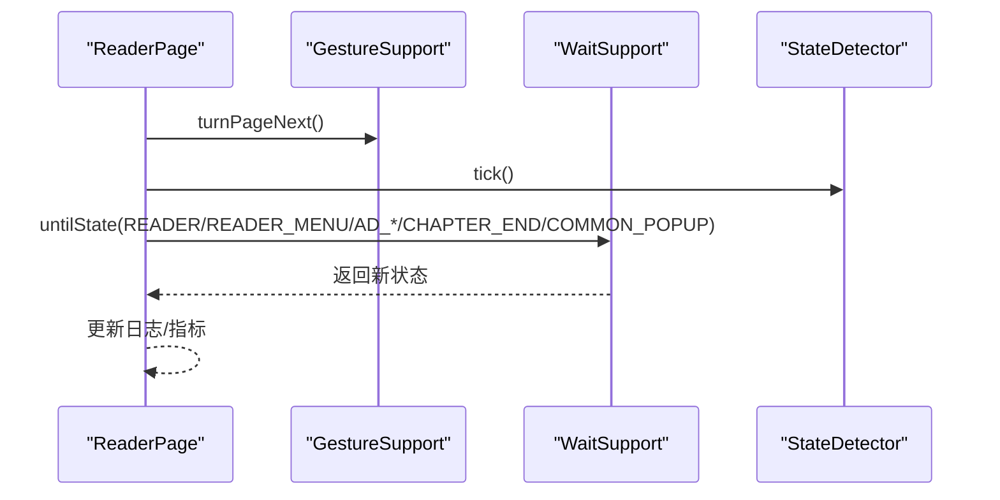
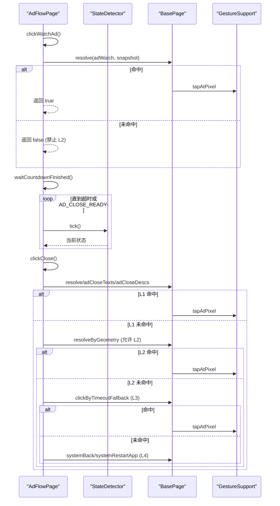
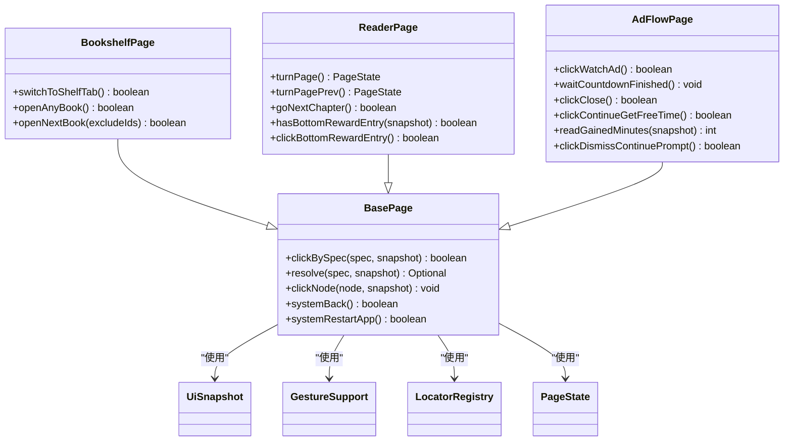

# 页面抽象层

<cite>
**本文引用的文件**
- [BasePage.java](file://automation/src/main/java/com/fanqie/auto/page/BasePage.java)
- [BookshelfPage.java](file://automation/src/main/java/com/fanqie/auto/page/BookshelfPage.java)
- [ReaderPage.java](file://automation/src/main/java/com/fanqie/auto/page/ReaderPage.java)
- [AdFlowPage.java](file://automation/src/main/java/com/fanqie/auto/page/AdFlowPage.java)
- [UiSnapshot.java](file://automation/src/main/java/com/fanqie/auto/core/UiSnapshot.java)
- [GestureSupport.java](file://automation/src/main/java/com/fanqie/auto/core/GestureSupport.java)
- [LocatorRegistry.java](file://automation/src/main/java/com/fanqie/auto/config/LocatorRegistry.java)
- [PageState.java](file://automation/src/main/java/com/fanqie/auto/core/PageState.java)
</cite>

## 目录
1. [简介](#简介)
2. [项目结构](#项目结构)
3. [核心组件](#核心组件)
4. [架构总览](#架构总览)
5. [详细组件分析](#详细组件分析)
6. [依赖关系分析](#依赖关系分析)
7. [性能考量](#性能考量)
8. [故障排查指南](#故障排查指南)
9. [结论](#结论)
10. [附录：最佳实践与示例路径](#附录最佳实践与示例路径)

## 简介
本页面抽象层基于页面对象模式，将复杂的 UI 操作封装为简单、可复用的方法调用。其核心是 BasePage 基类提供的“四级定位器降级链”（L1 语义属性匹配 → L2 结构化几何推断 → L3 时序兜底 → L4 系统兜底），配合 UiSnapshot 内存快照、GestureSupport 手势封装、LocatorRegistry 定位策略配置以及 PageState 状态机，实现稳定、可自愈的自动化流程。

三大页面类职责清晰：
- BookshelfPage：书架页的 Tab 切换、书籍动态选择与翻页打开。
- ReaderPage：阅读页的翻页、跳转下一章、底部广告入口检测与点击。
- AdFlowPage：广告流程识别与处理，包括观看广告、等待倒计时、关闭广告、奖励分钟数提取等。

## 项目结构
页面抽象层位于 page 包下，依赖 core 与 config 包提供底层能力：
- page：页面对象（BasePage 及具体页面）
- core：UI 快照、手势、状态检测、日志等通用能力
- config：定位器注册表与自动化配置

图表来源
- [BasePage.java:18-68](file://automation/src/main/java/com/fanqie/auto/page/BasePage.java#L18-L68)
- [BookshelfPage.java:23-55](file://automation/src/main/java/com/fanqie/auto/page/BookshelfPage.java#L23-L55)
- [ReaderPage.java:19-55](file://automation/src/main/java/com/fanqie/auto/page/ReaderPage.java#L19-L55)
- [AdFlowPage.java:21-65](file://automation/src/main/java/com/fanqie/auto/page/AdFlowPage.java#L21-L65)
- [UiSnapshot.java:21-72](file://automation/src/main/java/com/fanqie/auto/core/UiSnapshot.java#L21-L72)
- [GestureSupport.java:12-39](file://automation/src/main/java/com/fanqie/auto/core/GestureSupport.java#L12-L39)
- [LocatorRegistry.java:16-65](file://automation/src/main/java/com/fanqie/auto/config/LocatorRegistry.java#L16-L65)
- [PageState.java:3-10](file://automation/src/main/java/com/fanqie/auto/core/PageState.java#L3-L10)

章节来源
- [BasePage.java:18-68](file://automation/src/main/java/com/fanqie/auto/page/BasePage.java#L18-L68)
- [LocatorRegistry.java:16-65](file://automation/src/main/java/com/fanqie/auto/config/LocatorRegistry.java#L16-L65)

## 核心组件
- BasePage：统一入口 clickBySpec、resolve、clickNode、systemBack/systemRestartApp；实现四级降级链与 boundsHint 裁决。
- UiSnapshot：一次抓取 XML 后纯内存查询，提供 findByTextContains/findContentDescContains/findClickableInRegion 等高效 API。
- GestureSupport：比例坐标点击、滑动、翻页、App 生命周期管理，避免硬编码像素。
- LocatorRegistry：集中维护各控件的定位策略（primaryBy + fallbackBys + boundsHint + allowGeometryFallback）。
- PageState：状态枚举驱动流程决策，区分广告态、阅读家族态、异常态等。

章节来源
- [BasePage.java:75-250](file://automation/src/main/java/com/fanqie/auto/page/BasePage.java#L75-L250)
- [UiSnapshot.java:131-200](file://automation/src/main/java/com/fanqie/auto/core/UiSnapshot.java#L131-L200)
- [GestureSupport.java:69-178](file://automation/src/main/java/com/fanqie/auto/core/GestureSupport.java#L69-L178)
- [LocatorRegistry.java:150-256](file://automation/src/main/java/com/fanqie/auto/config/LocatorRegistry.java#L150-L256)
- [PageState.java:11-90](file://automation/src/main/java/com/fanqie/auto/core/PageState.java#L11-L90)

## 架构总览
页面层通过 BasePage 暴露稳定的操作方法，内部组合 UiSnapshot、GestureSupport、LocatorRegistry 完成元素定位与交互；上层任务通过 PageState 进行状态驱动的流程控制。

图表来源
- [ReaderPage.java:69-96](file://automation/src/main/java/com/fanqie/auto/page/ReaderPage.java#L69-L96)
- [BasePage.java:84-137](file://automation/src/main/java/com/fanqie/auto/page/BasePage.java#L84-L137)
- [UiSnapshot.java:137-200](file://automation/src/main/java/com/fanqie/auto/core/UiSnapshot.java#L137-L200)
- [GestureSupport.java:77-123](file://automation/src/main/java/com/fanqie/auto/core/GestureSupport.java#L77-L123)
- [LocatorRegistry.java:150-256](file://automation/src/main/java/com/fanqie/auto/config/LocatorRegistry.java#L150-L256)

## 详细组件分析

### BasePage：四级定位器降级链与通用点击
- 设计理念
  - L1 语义属性匹配：text → content-desc → resource-id，命中多个时用 boundsHint 裁决。
  - L2 结构化几何推断：在 boundsHint 区域内查找 clickable=true 且 areaRatio < 0.15 的节点，受 allowGeometryFallback 保护。
  - L3 时序兜底：达到 adVideoTimeoutMs 后强制执行 L2，仍受 allowGeometryFallback 约束。
  - L4 系统兜底：navigate().back() 失败则 restartApp。
- 关键方法
  - clickBySpec/resolve/clickNode：统一入口与点击实现。
  - systemBack/systemRestartApp：最终恢复手段。
  - 便捷方法：clickByTextCandidates/clickByContentDescCandidates/clickByResourceId。
- 错误处理
  - 解析失败、无命中、不可点击节点回溯到最近可点击祖先。
  - 超时与异常分支中二次 tick 确认状态。

图表来源
- [BasePage.java:84-250](file://automation/src/main/java/com/fanqie/auto/page/BasePage.java#L84-L250)
- [BasePage.java:312-336](file://automation/src/main/java/com/fanqie/auto/page/BasePage.java#L312-L336)
- [BasePage.java:347-406](file://automation/src/main/java/com/fanqie/auto/page/BasePage.java#L347-L406)

章节来源
- [BasePage.java:18-68](file://automation/src/main/java/com/fanqie/auto/page/BasePage.java#L18-L68)
- [BasePage.java:84-250](file://automation/src/main/java/com/fanqie/auto/page/BasePage.java#L84-L250)
- [BasePage.java:312-406](file://automation/src/main/java/com/fanqie/auto/page/BasePage.java#L312-L406)

### BookshelfPage：书架页操作
- 职责
  - switchToShelfTab：确保在书架 Tab，兼容多页共享文案，主动点击以幂等确认。
  - openAnyBook/openNextBook：动态选取首个可点书籍条目，支持排除已用书籍集合，滚动重试。
- 设计要点
  - 不写死索引，遍历内存节点表筛选 clickable、带文案、合理面积占比、主体区域。
  - 真机校准：避开华为全面屏底部手势区点击 Tab；短剧/视频卡片过滤。
  - 离开书架确认：等待 READER/READER_MENU/AD_* 等状态，避免误判。

图表来源
- [BookshelfPage.java:65-128](file://automation/src/main/java/com/fanqie/auto/page/BookshelfPage.java#L65-L128)
- [BookshelfPage.java:169-216](file://automation/src/main/java/com/fanqie/auto/page/BookshelfPage.java#L169-L216)
- [BookshelfPage.java:229-275](file://automation/src/main/java/com/fanqie/auto/page/BookshelfPage.java#L229-L275)
- [BookshelfPage.java:290-315](file://automation/src/main/java/com/fanqie/auto/page/BookshelfPage.java#L290-L315)
- [BookshelfPage.java:339-431](file://automation/src/main/java/com/fanqie/auto/page/BookshelfPage.java#L339-L431)

章节来源
- [BookshelfPage.java:23-55](file://automation/src/main/java/com/fanqie/auto/page/BookshelfPage.java#L23-L55)
- [BookshelfPage.java:65-128](file://automation/src/main/java/com/fanqie/auto/page/BookshelfPage.java#L65-L128)
- [BookshelfPage.java:169-275](file://automation/src/main/java/com/fanqie/auto/page/BookshelfPage.java#L169-L275)
- [BookshelfPage.java:339-431](file://automation/src/main/java/com/fanqie/auto/page/BookshelfPage.java#L339-L431)

### ReaderPage：阅读器页操作
- 职责
  - turnPage/turnPagePrev：翻页并等待多种可能状态（含广告弹窗、章节末、通用弹窗）。
  - goNextChapter：优先点击「下一章」，否则翻至 CHAPTER_END 再跳转。
  - hasBottomRewardEntry/clickBottomRewardEntry：检测并点击底部「观看视频获取免广告时长」。
- 关键设计
  - 翻页后等待覆盖多状态，避免只等 READER 导致超时浪费。
  - 翻页成功判据：detect 仍为阅读家族态且未出现异常态；可选截图帧差验证。

图表来源
- [ReaderPage.java:69-96](file://automation/src/main/java/com/fanqie/auto/page/ReaderPage.java#L69-L96)
- [ReaderPage.java:101-118](file://automation/src/main/java/com/fanqie/auto/page/ReaderPage.java#L101-L118)
- [ReaderPage.java:130-160](file://automation/src/main/java/com/fanqie/auto/page/ReaderPage.java#L130-L160)
- [ReaderPage.java:170-225](file://automation/src/main/java/com/fanqie/auto/page/ReaderPage.java#L170-L225)

章节来源
- [ReaderPage.java:19-55](file://automation/src/main/java/com/fanqie/auto/page/ReaderPage.java#L19-L55)
- [ReaderPage.java:69-160](file://automation/src/main/java/com/fanqie/auto/page/ReaderPage.java#L69-L160)
- [ReaderPage.java:170-225](file://automation/src/main/java/com/fanqie/auto/page/ReaderPage.java#L170-L225)

### AdFlowPage：广告流程处理
- 职责
  - clickWatchAd：仅 L1 语义匹配，禁用几何兜底防误点浪费配额。
  - waitCountdownFinished：不做任何点击，稀疏轮询等待 AD_CLOSE_READY。
  - clickClose：全链路 L1→L2→L3→L4，唯一允许激进兜底的控件。
  - clickContinueGetFreeTime：仅 L1，防误点。
  - readGainedMinutes：从快照提取本次奖励分钟数，带奖励语义校验。
  - clickDismissContinuePrompt：关闭继续获取时长弹窗。
- 安全与稳定性
  - 视频播放期间禁止点击，避免跳转到落地页造成流程偏离。
  - 奖励分钟数提取采用关键词白名单与排除词，避免高估。

图表来源
- [AdFlowPage.java:76-101](file://automation/src/main/java/com/fanqie/auto/page/AdFlowPage.java#L76-L101)
- [AdFlowPage.java:116-163](file://automation/src/main/java/com/fanqie/auto/page/AdFlowPage.java#L116-L163)
- [AdFlowPage.java:180-262](file://automation/src/main/java/com/fanqie/auto/page/AdFlowPage.java#L180-L262)
- [AdFlowPage.java:272-297](file://automation/src/main/java/com/fanqie/auto/page/AdFlowPage.java#L272-L297)
- [AdFlowPage.java:317-363](file://automation/src/main/java/com/fanqie/auto/page/AdFlowPage.java#L317-L363)
- [AdFlowPage.java:398-428](file://automation/src/main/java/com/fanqie/auto/page/AdFlowPage.java#L398-L428)

章节来源
- [AdFlowPage.java:21-65](file://automation/src/main/java/com/fanqie/auto/page/AdFlowPage.java#L21-L65)
- [AdFlowPage.java:76-101](file://automation/src/main/java/com/fanqie/auto/page/AdFlowPage.java#L76-L101)
- [AdFlowPage.java:116-163](file://automation/src/main/java/com/fanqie/auto/page/AdFlowPage.java#L116-L163)
- [AdFlowPage.java:180-262](file://automation/src/main/java/com/fanqie/auto/page/AdFlowPage.java#L180-L262)
- [AdFlowPage.java:272-297](file://automation/src/main/java/com/fanqie/auto/page/AdFlowPage.java#L272-L297)
- [AdFlowPage.java:317-363](file://automation/src/main/java/com/fanqie/auto/page/AdFlowPage.java#L317-L363)
- [AdFlowPage.java:398-428](file://automation/src/main/java/com/fanqie/auto/page/AdFlowPage.java#L398-L428)

## 依赖关系分析
- 页面类均继承 BasePage，复用四级降级链与通用点击逻辑。
- 依赖 LocatorRegistry 获取各控件的定位策略（primaryBy/fallbackBys/boundsHint/allowGeometryFallback）。
- 依赖 UiSnapshot 进行内存级元素检索，避免频繁 RPC。
- 依赖 GestureSupport 执行比例化手势，适配不同屏幕尺寸。
- 依赖 PageState 进行状态驱动的流程控制。

图表来源
- [BasePage.java:40-68](file://automation/src/main/java/com/fanqie/auto/page/BasePage.java#L40-L68)
- [BookshelfPage.java:36-55](file://automation/src/main/java/com/fanqie/auto/page/BookshelfPage.java#L36-L55)
- [ReaderPage.java:42-55](file://automation/src/main/java/com/fanqie/auto/page/ReaderPage.java#L42-L55)
- [AdFlowPage.java:38-65](file://automation/src/main/java/com/fanqie/auto/page/AdFlowPage.java#L38-L65)
- [UiSnapshot.java:36-72](file://automation/src/main/java/com/fanqie/auto/core/UiSnapshot.java#L36-L72)
- [GestureSupport.java:26-39](file://automation/src/main/java/com/fanqie/auto/core/GestureSupport.java#L26-L39)
- [LocatorRegistry.java:26-65](file://automation/src/main/java/com/fanqie/auto/config/LocatorRegistry.java#L26-L65)
- [PageState.java:11-90](file://automation/src/main/java/com/fanqie/auto/core/PageState.java#L11-L90)

章节来源
- [BasePage.java:40-68](file://automation/src/main/java/com/fanqie/auto/page/BasePage.java#L40-L68)
- [BookshelfPage.java:36-55](file://automation/src/main/java/com/fanqie/auto/page/BookshelfPage.java#L36-L55)
- [ReaderPage.java:42-55](file://automation/src/main/java/com/fanqie/auto/page/ReaderPage.java#L42-L55)
- [AdFlowPage.java:38-65](file://automation/src/main/java/com/fanqie/auto/page/AdFlowPage.java#L38-L65)

## 性能考量
- 快照缓存与内存查询：UiSnapshot 一次抓取 XML，后续全部内存操作，零额外 RPC，单 tick 约 0.5s。
- 手势优化：GestureSupport 使用 mobile: clickGesture/swipeGesture，设备端单次执行更稳。
- 轮询间隔：广告视频等待阶段使用稀疏轮询（pollIntervalMs * 4），降低 CPU/RPC 压力。
- 截图对比：可选开启 verifyPageTurnedByScreenshot，默认关闭以避免长任务累积开销。

章节来源
- [UiSnapshot.java:21-72](file://automation/src/main/java/com/fanqie/auto/core/UiSnapshot.java#L21-L72)
- [GestureSupport.java:157-178](file://automation/src/main/java/com/fanqie/auto/core/GestureSupport.java#L157-L178)
- [AdFlowPage.java:116-163](file://automation/src/main/java/com/fanqie/auto/page/AdFlowPage.java#L116-L163)
- [ReaderPage.java:29-41](file://automation/src/main/java/com/fanqie/auto/page/ReaderPage.java#L29-L41)

## 故障排查指南
- 无法定位元素
  - 检查 LocatorRegistry 中对应控件的 primaryBy/fallbackBys 是否包含有效候选。
  - 确认 allowGeometryFallback 设置是否符合风险容忍度（ad.watch/ad.continue 必须为 false）。
- 误点风险
  - 广告相关按钮（观看/继续）禁用几何兜底，若失败应走重试/恢复，不要绕过标志位。
- 状态卡死
  - 使用 systemBack/systemRestartApp 作为 L4 兜底；重启后由状态机回到 BOOKSHELF 重新进入。
- 奖励分钟数高估
  - readGainedMinutes 仅接受带奖励语义的文案，若无明确命中返回 0，交由兜底估值。

章节来源
- [BasePage.java:227-250](file://automation/src/main/java/com/fanqie/auto/page/BasePage.java#L227-L250)
- [AdFlowPage.java:76-101](file://automation/src/main/java/com/fanqie/auto/page/AdFlowPage.java#L76-L101)
- [AdFlowPage.java:180-262](file://automation/src/main/java/com/fanqie/auto/page/AdFlowPage.java#L180-L262)
- [AdFlowPage.java:317-363](file://automation/src/main/java/com/fanqie/auto/page/AdFlowPage.java#L317-L363)

## 结论
该页面抽象层通过 BasePage 的四级降级链与通用点击能力，结合 UiSnapshot 的高性能内存查询、GestureSupport 的比例化手势、LocatorRegistry 的可配置定位策略以及 PageState 的状态驱动，实现了稳定、可自愈的自动化流程。三个页面类职责清晰、边界明确，既能应对复杂 UI 变化，又能有效控制误点风险与性能开销。

## 附录：最佳实践与示例路径
- 元素定位策略
  - 优先使用 LocatorRegistry 配置的 primaryBy/fallbackBys；必要时补充文案直接匹配。
  - 仅在高风险控件（如关闭按钮）启用几何兜底，其他场景保持保守。
- 用户交互模拟
  - 翻页优先 tap 策略，必要时回退 swipe；所有坐标通过比例计算，避免硬编码。
- 页面状态检测
  - 翻页后等待覆盖多状态（含广告/弹窗/章节末），避免只等 READER 导致超时。
  - 使用 untilState 与二次 tick 确认，提升鲁棒性。
- 代码示例路径（不含具体代码内容）
  - 四级降级链入口与点击实现：[BasePage.java:84-137](file://automation/src/main/java/com/fanqie/auto/page/BasePage.java#L84-L137)、[BasePage.java:312-336](file://automation/src/main/java/com/fanqie/auto/page/BasePage.java#L312-L336)
  - 书架 Tab 切换与书籍选择：[BookshelfPage.java:65-128](file://automation/src/main/java/com/fanqie/auto/page/BookshelfPage.java#L65-L128)、[BookshelfPage.java:169-216](file://automation/src/main/java/com/fanqie/auto/page/BookshelfPage.java#L169-L216)
  - 阅读页翻页与下一章跳转：[ReaderPage.java:69-96](file://automation/src/main/java/com/fanqie/auto/page/ReaderPage.java#L69-L96)、[ReaderPage.java:130-160](file://automation/src/main/java/com/fanqie/auto/page/ReaderPage.java#L130-L160)
  - 广告流程关闭全链路：[AdFlowPage.java:180-262](file://automation/src/main/java/com/fanqie/auto/page/AdFlowPage.java#L180-L262)
  - 奖励分钟数提取：[AdFlowPage.java:317-363](file://automation/src/main/java/com/fanqie/auto/page/AdFlowPage.java#L317-L363)