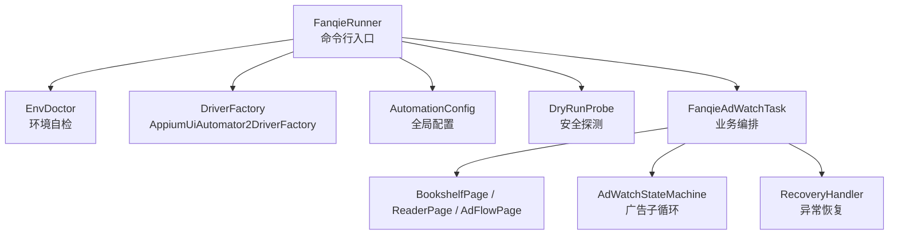
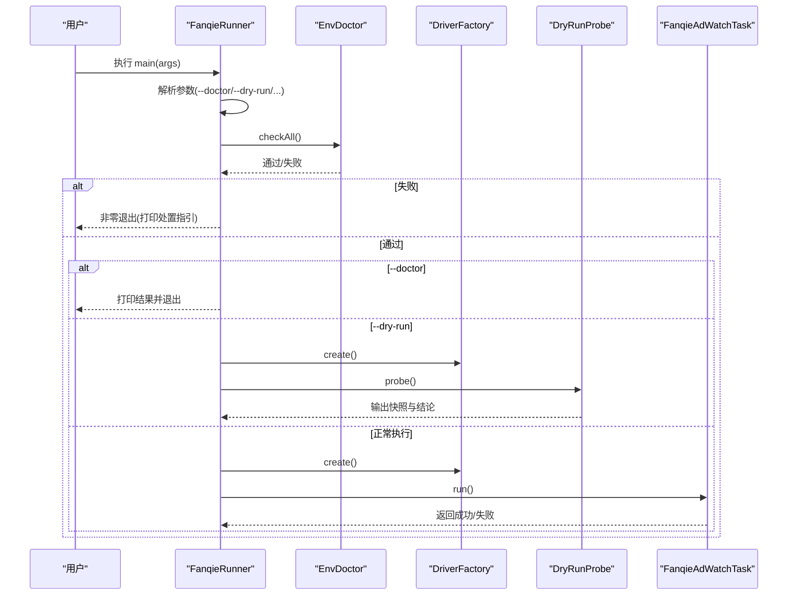
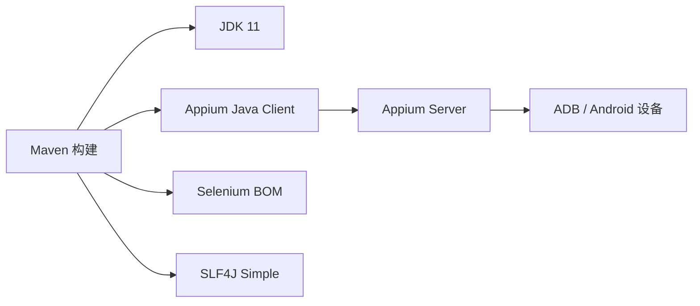

# 快速开始

<cite>
**本文引用的文件**
- [pom.xml](file://automation/pom.xml)
- [FanqieRunner.java](file://automation/src/main/java/com/fanqie/auto/FanqieRunner.java)
- [DryRunProbe.java](file://automation/src/main/java/com/fanqie/auto/DryRunProbe.java)
- [EnvDoctor.java](file://automation/src/main/java/com/fanqie/auto/core/EnvDoctor.java)
- [AutomationConfig.java](file://automation/src/main/java/com/fanqie/auto/config/AutomationConfig.java)
- [AppiumUiAutomator2DriverFactory.java](file://automation/src/main/java/com/fanqie/auto/core/AppiumUiAutomator2DriverFactory.java)
- [FanqieAdWatchTask.java](file://automation/src/main/java/com/fanqie/auto/task/FanqieAdWatchTask.java)
</cite>

## 目录
1. [简介](#简介)
2. [项目结构](#项目结构)
3. [核心组件](#核心组件)
4. [架构总览](#架构总览)
5. [详细组件分析](#详细组件分析)
6. [依赖分析](#依赖分析)
7. [性能注意事项](#性能注意事项)
8. [故障排除指南](#故障排除指南)
9. [结论](#结论)
10. [附录：命令与输出示例](#附录命令与输出示例)

## 简介
本指南面向首次使用“番茄免费小说 UI 自动化”项目的用户，目标是帮助你快速完成环境准备、安装依赖、构建项目并运行三种模式（--doctor 环境自检、--dry-run 干运行、正常执行）。文档基于代码实现进行说明，所有步骤均可在本地复现。

## 项目结构
本项目采用 Maven 工程组织，核心入口为 FanqieRunner，负责参数解析、环境自检、驱动创建、页面与任务装配以及主流程编排；EnvDoctor 提供可执行的设备与环境诊断；DryRunProbe 提供安全的只读探测能力；配置集中在 AutomationConfig 中，支持默认值与外部覆盖。

图表来源
- [FanqieRunner.java:41-239](file://automation/src/main/java/com/fanqie/auto/FanqieRunner.java#L41-L239)
- [AppiumUiAutomator2DriverFactory.java:44-76](file://automation/src/main/java/com/fanqie/auto/core/AppiumUiAutomator2DriverFactory.java#L44-L76)
- [FanqieAdWatchTask.java:99-314](file://automation/src/main/java/com/fanqie/auto/task/FanqieAdWatchTask.java#L99-L314)

章节来源
- [pom.xml:1-176](file://automation/pom.xml#L1-L176)
- [FanqieRunner.java:41-239](file://automation/src/main/java/com/fanqie/auto/FanqieRunner.java#L41-L239)

## 核心组件
- 命令行入口与参数解析：FanqieRunner.main()
  - 支持的参数：--doctor、--dry-run、--config <path>、--cycles <N>、--pages <N>、--reset-progress
  - 职责：装配配置、执行环境自检、创建 Driver、注册组件、启动 Dry-run 或主任务
- 环境自检：EnvDoctor.checkAll()
  - 检查项：ANDROID_HOME/SDK_ROOT、adb 版本与设备在线状态、Appium Server 就绪、目标 App 是否已安装
  - 失败时给出中文处置指引，并以非零码退出
- 安全探测：DryRunProbe.probe()
  - 仅连接 Appium、激活 App、抓取书架页与阅读页快照并落盘，不点击任何广告或领取按钮
  - 输出节点统计与关键词命中，辅助定位策略选择
- 驱动工厂：AppiumUiAutomator2DriverFactory
  - 基于 UiAutomator2Options 构建 capabilities，设置 noReset、超时、华为/鸿蒙兼容选项等
  - 创建后立即设置 implicitlyWait=0，避免隐式等待破坏短轮询设计
- 配置中心：AutomationConfig
  - 从 classpath 的 automation.properties 加载默认值，支持 --config 外部覆盖
  - 暴露 Appium、时序、流程、翻页策略等全部可调参数
- 业务编排：FanqieAdWatchTask.run()
  - 启动 App → 导航到书架 → 打开一本书进入阅读页 → 外层循环翻页 → 遇广告进入子循环 → 章节结束跳转下一章 → 异常恢复 → 收尾统计

章节来源
- [FanqieRunner.java:41-239](file://automation/src/main/java/com/fanqie/auto/FanqieRunner.java#L41-L239)
- [EnvDoctor.java:48-71](file://automation/src/main/java/com/fanqie/auto/core/EnvDoctor.java#L48-L71)
- [DryRunProbe.java:91-197](file://automation/src/main/java/com/fanqie/auto/DryRunProbe.java#L91-L197)
- [AppiumUiAutomator2DriverFactory.java:44-76](file://automation/src/main/java/com/fanqie/auto/core/AppiumUiAutomator2DriverFactory.java#L44-L76)
- [AutomationConfig.java:112-178](file://automation/src/main/java/com/fanqie/auto/config/AutomationConfig.java#L112-L178)
- [FanqieAdWatchTask.java:99-314](file://automation/src/main/java/com/fanqie/auto/task/FanqieAdWatchTask.java#L99-L314)

## 架构总览
下图展示了从命令行到具体执行的关键调用链，包括环境自检、驱动创建、Dry-run 与主任务分支。

图表来源
- [FanqieRunner.java:41-239](file://automation/src/main/java/com/fanqie/auto/FanqieRunner.java#L41-L239)
- [EnvDoctor.java:48-71](file://automation/src/main/java/com/fanqie/auto/core/EnvDoctor.java#L48-L71)
- [DryRunProbe.java:91-197](file://automation/src/main/java/com/fanqie/auto/DryRunProbe.java#L91-L197)
- [FanqieAdWatchTask.java:99-314](file://automation/src/main/java/com/fanqie/auto/task/FanqieAdWatchTask.java#L99-L314)

## 详细组件分析

### 命令行参数与运行模式
- --doctor：仅执行 EnvDoctor.checkAll()，不创建 session，用于环境自检
- --dry-run：创建 session 后仅连接 App、抓取书架与阅读页快照，不点击任何广告或领取按钮
- --config <path>：使用外部 properties 文件覆盖默认配置
- --cycles <N>：覆盖外层循环次数
- --pages <N>：覆盖每轮翻页次数
- --reset-progress：清除累计进度并从零开始

章节来源
- [FanqieRunner.java:49-87](file://automation/src/main/java/com/fanqie/auto/FanqieRunner.java#L49-L87)
- [FanqieRunner.java:241-249](file://automation/src/main/java/com/fanqie/auto/FanqieRunner.java#L241-L249)

### 环境自检（--doctor）
EnvDoctor 会逐项检查：
- ANDROID_HOME/ANDROID_SDK_ROOT
- adb 可用性与版本
- 设备在线状态（含 unauthorized/offline 提示）
- Appium Server 是否 ready
- 目标 App 包名是否已安装

任一硬性检查失败将打印完整清单并返回 false，Runner 以非零码退出。

章节来源
- [EnvDoctor.java:48-71](file://automation/src/main/java/com/fanqie/auto/core/EnvDoctor.java#L48-L71)
- [EnvDoctor.java:75-194](file://automation/src/main/java/com/fanqie/auto/core/EnvDoctor.java#L75-L194)

### 干运行（--dry-run）
DryRunProbe 的安全约束：
- 仅激活 App、抓取书架与阅读页快照
- 绝不点击广告/观看视频/领取时长按钮
- 绝不执行 uninstall/clearApp/reset 等破坏性操作

输出内容：
- 节点属性统计（text/resource-id/content-desc/clickable/bounds 占比）
- 关键词命中节点及完整属性
- 结论建议（L1/L2/L3 定位策略选择）

章节来源
- [DryRunProbe.java:26-40](file://automation/src/main/java/com/fanqie/auto/DryRunProbe.java#L26-L40)
- [DryRunProbe.java:91-197](file://automation/src/main/java/com/fanqie/auto/DryRunProbe.java#L91-L197)
- [DryRunProbe.java:283-372](file://automation/src/main/java/com/fanqie/auto/DryRunProbe.java#L283-L372)

### 驱动创建与 Session 管理
AppiumUiAutomator2DriverFactory：
- 基于 UiAutomator2Options 构建 capabilities
- 关键设置：noReset=true、newCommandTimeout、华为/鸿蒙兼容选项、禁用 id 自动补全、延长 uia2 server 启动/安装超时
- 创建后立即 implicitlyWait(Duration.ZERO)，避免隐式等待破坏短轮询
- 健康检查与优雅 quit

章节来源
- [AppiumUiAutomator2DriverFactory.java:120-178](file://automation/src/main/java/com/fanqie/auto/core/AppiumUiAutomator2DriverFactory.java#L120-L178)
- [AppiumUiAutomator2DriverFactory.java:44-76](file://automation/src/main/java/com/fanqie/auto/core/AppiumUiAutomator2DriverFactory.java#L44-L76)

### 主任务流程（正常执行）
FanqieAdWatchTask.run() 的核心流程：
- 启动 App 并导航到书架
- 打开一本书进入阅读页（自动跳过短剧/视频页）
- 外层循环翻页，遇到广告进入 AdWatchStateMachine 子循环
- 章节结束跳转下一章
- 异常状态交由 RecoveryHandler 恢复
- 收尾输出统计汇总

章节来源
- [FanqieAdWatchTask.java:99-314](file://automation/src/main/java/com/fanqie/auto/task/FanqieAdWatchTask.java#L99-L314)

## 依赖分析
- 运行时依赖：Appium Java Client、Selenium（通过 BOM 锁定版本）、SLF4J Simple
- 构建工具：Maven Compiler 3.x、Surefire 3.x（JUnit 5）、Exec Plugin、Shade Plugin（fat-jar）
- 平台要求：JDK 11、Android 设备、ADB、Node.js + Appium Server

图表来源
- [pom.xml:15-28](file://automation/pom.xml#L15-L28)
- [pom.xml:50-83](file://automation/pom.xml#L50-L83)
- [pom.xml:100-174](file://automation/pom.xml#L100-L174)

章节来源
- [pom.xml:15-28](file://automation/pom.xml#L15-L28)
- [pom.xml:50-83](file://automation/pom.xml#L50-L83)
- [pom.xml:100-174](file://automation/pom.xml#L100-L174)

## 性能注意事项
- 短轮询设计：implicitlyWait=0，配合 WaitSupport 显式等待，避免阻塞
- 心跳保活：newCommandTimeout 较大，防止长任务断连
- 华为/鸿蒙优化：ignoreHiddenApiPolicyError、suppressKillServer、延长 uia2 启动/安装超时
- 屏幕常亮：keepScreenOn 减少锁屏影响
- 日志与快照：RunLogger 与 DryRunProbe 输出有助于定位卡顿与不稳定点

[本节为通用指导，不直接分析具体文件]

## 故障排除指南
常见环境与设备问题及处置要点：
- 未检测到设备或设备离线：重新插拔 USB、确认 USB 调试与授权弹窗、确保传输文件模式
- Appium Server 不可达：确认 Node.js 与 Appium 已安装，启动 appium --base-path /，检查 /status 响应
- 目标 App 未安装：在设备上安装「番茄免费小说」或核对包名
- 华为/鸿蒙特有项：开启「仅充电模式下允许 ADB 调试」，处理「监控 ADB 安装应用」弹窗
- Session 创建失败：逐项排查 APK 安装弹窗、USB 调试、授权、Appium 服务、adb 识别

章节来源
- [EnvDoctor.java:104-194](file://automation/src/main/java/com/fanqie/auto/core/EnvDoctor.java#L104-L194)
- [AppiumUiAutomator2DriverFactory.java:180-208](file://automation/src/main/java/com/fanqie/auto/core/AppiumUiAutomator2DriverFactory.java#L180-L208)

## 结论
通过 --doctor 快速验证环境，--dry-run 安全探测 UI 结构，再进入正常执行模式完成自动化流程。项目提供了完善的配置覆盖、健壮的错误恢复与详细的诊断输出，适合在真实设备上稳定运行长任务。

[本节为总结，不直接分析具体文件]

## 附录：命令与输出示例

### 环境准备
- 设备要求
  - Android 设备（HarmonyOS/Android 均可）
  - 开启开发者选项与 USB 调试
  - 勾选「仅充电模式下允许 ADB 调试」（华为/鸿蒙特有）
  - USB 连接方式选「传输文件」
  - 首次插线授权「始终允许来自这台计算机的调试」
  - 建议关闭自动锁屏、接通电源、加入电池优化白名单
- 软件安装
  - JDK 11
  - Node.js（用于 Appium Server）
  - Appium Server（npm 安装）
  - ADB 工具（platform-tools），并确保 PATH 可访问
- 项目构建
  - 进入 automation 目录
  - 使用 Maven 编译与打包：mvn clean package
  - 或直接运行入口类：mvn exec:java

### 运行模式与参数
- 环境自检（--doctor）
  - 命令：mvn exec:java -Dexec.args="--doctor"
  - 预期：打印各项检查结果，全部通过后以 0 退出；存在失败项以非零退出并给出处置指引
- 干运行（--dry-run）
  - 命令：mvn exec:java -Dexec.args="--dry-run"
  - 预期：连接 Appium、激活 App、抓取书架与阅读页快照并落盘，输出节点统计与关键词命中，不点击任何广告或领取按钮
- 正常执行
  - 命令：mvn exec:java -Dexec.args="--config path/to/automation.properties --cycles N --pages M"
  - 说明：--config 指定外部配置文件覆盖默认值；--cycles 覆盖外层循环次数；--pages 覆盖每轮翻页次数；--reset-progress 可重置累计进度

### 输出示例（文字描述）
- --doctor 输出
  - 显示每项检查结果（如 adb version、adb devices、Appium Server、App 安装）
  - 全部通过：打印“可以创建 Appium session”
  - 失败：打印对应处置指引（如安装 ADB、启动 Appium、设备授权等）
- --dry-run 输出
  - 打印“安全探测模式（不点击任何广告/领时长按钮）”
  - 书架页与阅读页节点属性统计（总节点数、text/resource-id/content-desc/clickable/bounds 占比）
  - 关键词命中节点列表（含 text/content-desc/resource-id/clickable/bounds 等）
  - 结论建议（L1/L2/L3 定位策略选择）
- 正常执行输出
  - 启动阶段：打印设备核对清单与合规提示
  - 任务阶段：打印各阶段状态（启动、导航、翻页、广告子循环、章节跳转、恢复）
  - 收尾阶段：输出累计免广告时长、总广告轮次等统计

章节来源
- [FanqieRunner.java:96-114](file://automation/src/main/java/com/fanqie/auto/FanqieRunner.java#L96-L114)
- [FanqieRunner.java:270-307](file://automation/src/main/java/com/fanqie/auto/FanqieRunner.java#L270-L307)
- [DryRunProbe.java:91-197](file://automation/src/main/java/com/fanqie/auto/DryRunProbe.java#L91-L197)
- [EnvDoctor.java:48-71](file://automation/src/main/java/com/fanqie/auto/core/EnvDoctor.java#L48-L71)