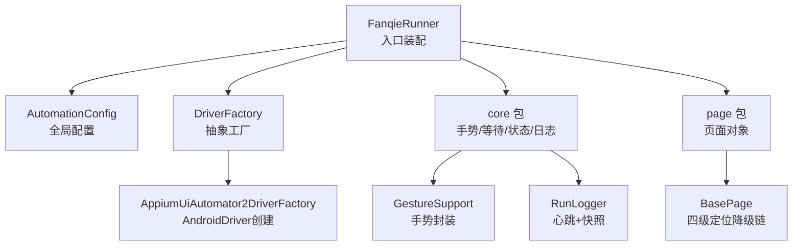
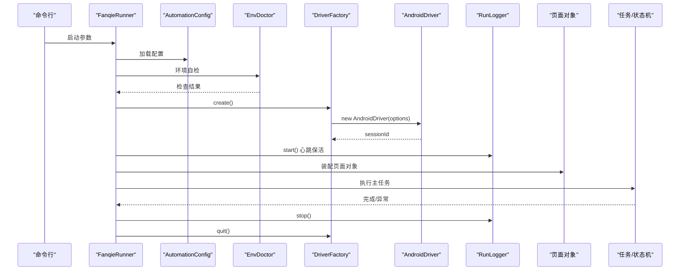
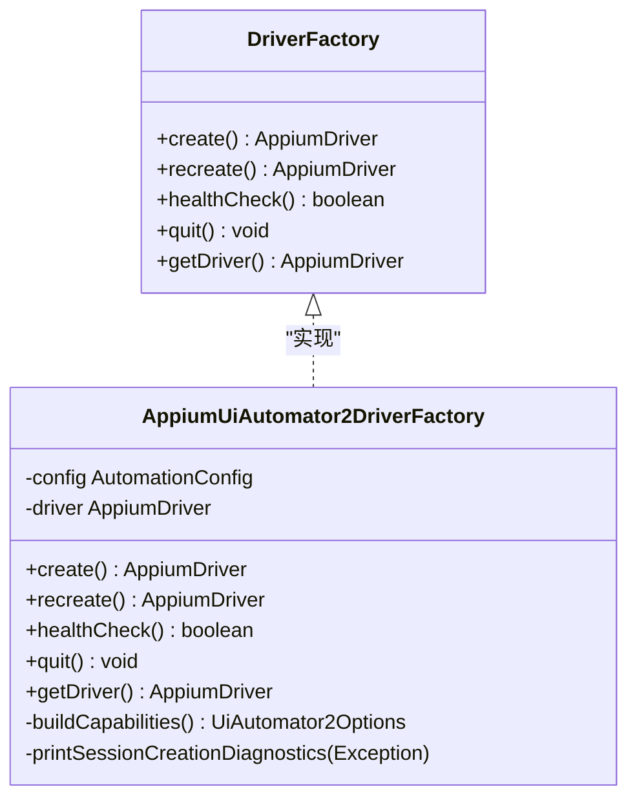
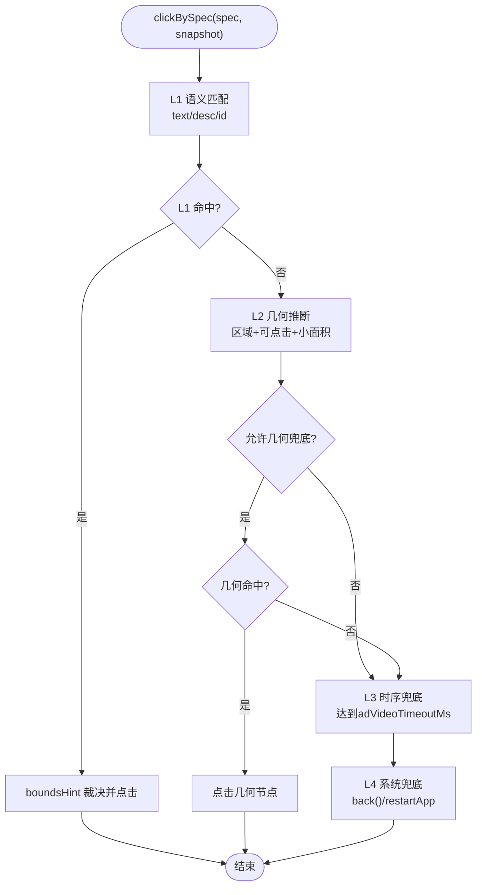
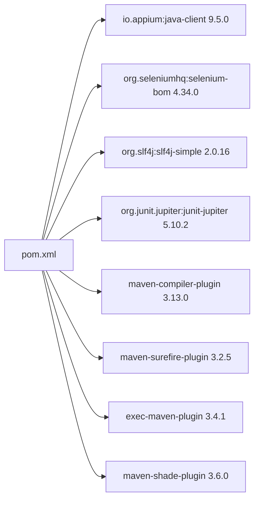

# 技术栈概览

<cite>
**本文引用的文件**
- [pom.xml](file://automation/pom.xml)
- [FanqieRunner.java](file://automation/src/main/java/com/fanqie/auto/FanqieRunner.java)
- [AutomationConfig.java](file://automation/src/main/java/com/fanqie/auto/config/AutomationConfig.java)
- [DriverFactory.java](file://automation/src/main/java/com/fanqie/auto/core/DriverFactory.java)
- [AppiumUiAutomator2DriverFactory.java](file://automation/src/main/java/com/fanqie/auto/core/AppiumUiAutomator2DriverFactory.java)
- [RunLogger.java](file://automation/src/main/java/com/fanqie/auto/core/RunLogger.java)
- [GestureSupport.java](file://automation/src/main/java/com/fanqie/auto/core/GestureSupport.java)
- [BasePage.java](file://automation/src/main/java/com/fanqie/auto/page/BasePage.java)
</cite>

## 目录
1. [简介](#简介)
2. [项目结构](#项目结构)
3. [核心组件](#核心组件)
4. [架构总览](#架构总览)
5. [详细组件分析](#详细组件分析)
6. [依赖关系分析](#依赖关系分析)
7. [性能考量](#性能考量)
8. [故障排查指南](#故障排查指南)
9. [结论](#结论)
10. [附录](#附录)

## 简介
本技术栈概览面向“番茄免费小说 UI 自动化”项目，聚焦以下核心技术选型及其在项目中的具体作用与优势：
- Java 11：统一编译与运行环境，保证长任务稳定性与可移植性。
- Appium 2 + Java Client 9.5.0：移动端自动化核心框架，基于 UiAutomator2 驱动 Android 设备。
- Selenium 4.34.0：Web 自动化基础库（通过 BOM 强制版本锁定），为 Appium 提供底层兼容层。
- JUnit 5.10.2：单元测试框架，配合 Surefire 3.x 支持离线回放测试。
- SLF4J 2.0.16：日志门面接口，结合 slf4j-simple 实现控制台与文件输出。

本项目采用分层设计：入口装配 → 驱动工厂 → 页面对象 → 手势与等待 → 状态检测 → 日志与保活。所有超时、轮次、阈值等参数集中由配置类管理，避免魔法数字，便于扩展与维护。

## 项目结构
- 模块根目录 automation 下包含 Maven 工程 pom.xml、源码 src/main/java、测试 src/test/java、运行产物 target 以及运行日志 logs。
- 入口类 FanqieRunner 负责命令行解析、环境自检、组件装配与生命周期管理。
- core 包提供驱动工厂、手势封装、状态检测、等待支持、日志与快照、环境诊断等基础设施。
- page 包以 BasePage 为基类，承载四级定位降级链与点击策略。
- config 包集中管理运行时配置与定位器候选集。

图表来源
- [FanqieRunner.java:41-238](file://automation/src/main/java/com/fanqie/auto/FanqieRunner.java#L41-L238)
- [DriverFactory.java:17-54](file://automation/src/main/java/com/fanqie/auto/core/DriverFactory.java#L17-L54)
- [AppiumUiAutomator2DriverFactory.java:44-118](file://automation/src/main/java/com/fanqie/auto/core/AppiumUiAutomator2DriverFactory.java#L44-L118)
- [BasePage.java:18-516](file://automation/src/main/java/com/fanqie/auto/page/BasePage.java#L18-L516)
- [GestureSupport.java:12-228](file://automation/src/main/java/com/fanqie/auto/core/GestureSupport.java#L12-L228)
- [RunLogger.java:31-374](file://automation/src/main/java/com/fanqie/auto/core/RunLogger.java#L31-L374)

章节来源
- [pom.xml:1-176](file://automation/pom.xml#L1-L176)
- [FanqieRunner.java:25-309](file://automation/src/main/java/com/fanqie/auto/FanqieRunner.java#L25-L309)

## 核心组件
- Java 11：通过 maven.compiler.release=11 统一编译目标，确保跨平台一致性与长任务稳定性。
- Appium 2 + Java Client 9.5.0：使用 UiAutomator2Options 构建 capabilities，创建 AndroidDriver；通过 mobile: 命令进行激活、终止、点击、滑动等操作，避免硬编码 Activity。
- Selenium 4.34.0：通过 selenium-bom 强制 pin 版本，避免传递依赖引入不兼容 patch 导致 NoSuchMethodError。
- JUnit 5.10.2 + Surefire 3.2.5：在 test scope 内引入 Jupiter 聚合依赖，支持 mvn test 运行离线用例；测试全部基于 fixture XML 回放，无需连接真机。
- SLF4J 2.0.16：引入 slf4j-simple 作为简单实现，使 java-client 内部日志正常输出；同时用于 RunLogger 的日志落盘与心跳摘要。

章节来源
- [pom.xml:15-28](file://automation/pom.xml#L15-L28)
- [pom.xml:38-83](file://automation/pom.xml#L38-L83)
- [pom.xml:100-175](file://automation/pom.xml#L100-L175)
- [AppiumUiAutomator2DriverFactory.java:120-178](file://automation/src/main/java/com/fanqie/auto/core/AppiumUiAutomator2DriverFactory.java#L120-L178)
- [RunLogger.java:46-130](file://automation/src/main/java/com/fanqie/auto/core/RunLogger.java#L46-L130)

## 架构总览
系统启动流程：
- FanqieRunner 解析命令行参数并装配 AutomationConfig、LocatorRegistry、EnvDoctor、DriverFactory、RunLogger。
- 通过 DriverFactory.create() 创建 Appium session，设置隐式等待为零，避免短轮询被阻塞。
- 注册 DriverAware 组件（手势、状态检测、等待、日志）到 DriverRegistry，以便 session 重建时统一刷新引用。
- 根据 dry-run 模式选择 DryRunProbe 或进入主任务流程，装配 page 层与 task 层，执行广告观看状态机与翻页逻辑。
- 通过 ShutdownHook 与 finally 块保证 logger.stop() 与 driver.quit() 幂等执行，防止 session 泄漏。

图表来源
- [FanqieRunner.java:41-238](file://automation/src/main/java/com/fanqie/auto/FanqieRunner.java#L41-L238)
- [AppiumUiAutomator2DriverFactory.java:44-118](file://automation/src/main/java/com/fanqie/auto/core/AppiumUiAutomator2DriverFactory.java#L44-L118)
- [RunLogger.java:144-197](file://automation/src/main/java/com/fanqie/auto/core/RunLogger.java#L144-L197)

## 详细组件分析

### 驱动工厂与会话管理
- DriverFactory 定义 create/recreate/healthCheck/quit/getDriver 接口，屏蔽底层驱动差异，预留未来鸿蒙 NEXT 路线替换点。
- AppiumUiAutomator2DriverFactory 使用 UiAutomator2Options 构建 capabilities，设置 noReset、newCommandTimeout、华为/鸿蒙特有能力项，并立即设置 implicitlyWait(Duration.ZERO)。
- healthCheck 使用轻量 getWindowSize() 探测 session 存活；quit 幂等关闭并清理引用。

图表来源
- [DriverFactory.java:17-54](file://automation/src/main/java/com/fanqie/auto/core/DriverFactory.java#L17-L54)
- [AppiumUiAutomator2DriverFactory.java:33-210](file://automation/src/main/java/com/fanqie/auto/core/AppiumUiAutomator2DriverFactory.java#L33-L210)

章节来源
- [DriverFactory.java:1-55](file://automation/src/main/java/com/fanqie/auto/core/DriverFactory.java#L1-L55)
- [AppiumUiAutomator2DriverFactory.java:1-210](file://automation/src/main/java/com/fanqie/auto/core/AppiumUiAutomator2DriverFactory.java#L1-L210)

### 页面对象与四级定位降级链
- BasePage 实现四级定位策略：
  - L1 语义属性匹配：text 候选集 → content-desc 候选集 → resource-id，命中多个时用 boundsHint 裁决。
  - L2 结构化几何推断：在指定区域查找 clickable=true 且面积较小的节点，受 allowGeometryFallback 约束。
  - L3 时序兜底：达到 adVideoTimeoutMs 后强制执行 L2。
  - L4 系统兜底：navigate().back() 或重启 App。
- 点击通过 GestureSupport.tapAtPixel 执行，坐标来自实时 UI 树 bounds，避免 stale element 问题。

图表来源
- [BasePage.java:75-250](file://automation/src/main/java/com/fanqie/auto/page/BasePage.java#L75-L250)
- [BasePage.java:300-434](file://automation/src/main/java/com/fanqie/auto/page/BasePage.java#L300-L434)

章节来源
- [BasePage.java:18-516](file://automation/src/main/java/com/fanqie/auto/page/BasePage.java#L18-L516)

### 手势封装与屏幕比例计算
- GestureSupport 将所有坐标按屏幕尺寸比例计算，避免写死绝对像素。
- 翻页优先 tap 策略（右侧热区），备选 swipe 策略使用 mobile: swipeGesture。
- 通过 mobile: clickGesture、activateApp、terminateApp 执行操作，规避权限拒绝与 Activity 硬编码问题。

章节来源
- [GestureSupport.java:12-228](file://automation/src/main/java/com/fanqie/auto/core/GestureSupport.java#L12-L228)

### 运行日志与心跳保活
- RunLogger 维护独立调度线程，每 heartbeat.interval.sec 执行一次轻量保活（getWindowSize），并输出心跳摘要。
- 异常或恢复时捕获截图与 XML 快照至 automation/logs/snapshots/，供后续分析。
- stop() 幂等停止心跳、输出统计、关闭文件写入器。

章节来源
- [RunLogger.java:31-374](file://automation/src/main/java/com/fanqie/auto/core/RunLogger.java#L31-L374)

### 配置管理与可扩展性
- AutomationConfig 从 classpath 与外部路径加载 properties，提供类型化 getter 与默认值兜底。
- 暴露 driver.type 以决定 FanqieRunner 装配哪个 DriverFactory 实现，当前仅 uiautomator2，预留 harmony_hdc。
- 集中管理时序、流程、阅读页翻页策略、验证与调试开关，避免代码中散落魔法数字。

章节来源
- [AutomationConfig.java:10-306](file://automation/src/main/java/com/fanqie/auto/config/AutomationConfig.java#L10-L306)

## 依赖关系分析
- Maven 依赖：
  - io.appium:java-client 9.5.0：移动端自动化核心。
  - org.seleniumhq:selenium-bom 4.34.0：通过 import scope 强制 pin 版本，避免传递依赖冲突。
  - org.slf4j:slf4j-simple 2.0.16：日志实现，确保 java-client 内部日志输出。
  - org.junit.jupiter:junit-jupiter 5.10.2：测试期依赖，scope=test，不影响 fat-jar。
- 插件：
  - maven-compiler-plugin 3.13.0：release=11，UTF-8 编码。
  - maven-surefire-plugin 3.2.5：运行 JUnit Platform 测试，显式 UTF-8。
  - exec-maven-plugin 3.4.1：mvn exec:java 直接运行入口类。
  - maven-shade-plugin 3.6.0：打包 fat-jar，合并 META-INF/services，排除签名文件。

图表来源
- [pom.xml:15-83](file://automation/pom.xml#L15-L83)
- [pom.xml:100-175](file://automation/pom.xml#L100-L175)

章节来源
- [pom.xml:1-176](file://automation/pom.xml#L1-L176)

## 性能考量
- 隐式等待清零：DriverFactory 创建后立即设置 implicitlyWait(Duration.ZERO)，避免未命中查找阻塞短轮询。
- 心跳保活：RunLogger 每 30 秒执行轻量命令保持 session 活跃，规避广告视频静默期断连。
- 内存快照复用：StateDetector 同一 tick 内复用 UiSnapshot，减少 getPageSource RPC 次数。
- 手势优化：使用 mobile: swipeGesture/clickGesture，单次设备端执行，比 W3C PointerInput 更稳定。
- 配置可调：pollInterval、stateDetectTimeout、actionTimeout、adVideoTimeout 等均可通过配置文件调整，平衡速度与稳定性。

[本节为通用性能讨论，不直接分析具体文件]

## 故障排查指南
- 环境自检：EnvDoctor 检查 adb、Appium Server 状态、ANDROID_HOME、应用安装情况，失败时输出中文指引。
- Session 创建失败：AppiumUiAutomator2DriverFactory 捕获异常并打印定向诊断，覆盖华为/鸿蒙常见场景（APK 安装弹窗、USB 调试、授权等）。
- 日志与快照：RunLogger 在异常/恢复时保存截图与 XML 快照至 automation/logs/snapshots/，便于回溯。
- 进度与熔断：AutomationConfig 提供 maxWallClockMs 墙钟时间预算，防止无限期占用设备；支持 --reset-progress 重置累计进度。

章节来源
- [FanqieRunner.java:96-114](file://automation/src/main/java/com/fanqie/auto/FanqieRunner.java#L96-L114)
- [AppiumUiAutomator2DriverFactory.java:180-209](file://automation/src/main/java/com/fanqie/auto/core/AppiumUiAutomator2DriverFactory.java#L180-L209)
- [RunLogger.java:231-261](file://automation/src/main/java/com/fanqie/auto/core/RunLogger.java#L231-L261)
- [AutomationConfig.java:241-248](file://automation/src/main/java/com/fanqie/auto/config/AutomationConfig.java#L241-L248)

## 结论
本项目以 Java 11 为基础，结合 Appium 2 + Java Client 9.5.0 与 Selenium 4.34.0 构建稳定的移动端自动化框架，使用 JUnit 5.10.2 进行离线测试，SLF4J 2.0.16 提供统一的日志能力。通过分层设计与配置集中管理，项目在可读性、可维护性与可扩展性方面具备良好基础，能够支撑长任务运行与复杂页面交互。

[本节为总结性内容，不直接分析具体文件]

## 附录
- 构建与运行：
  - 编译：mvn compile（Java 11，UTF-8）
  - 测试：mvn test（JUnit Platform，离线回放）
  - 运行：mvn exec:java -Dexec.mainClass=com.fanqie.auto.FanqieRunner
  - 打包：mvn package（生成 fat-jar，含 Manifest mainClass）
- 关键配置键示例：
  - appium.server.url、appium.platform.name、appium.automation.name
  - timing.poll.interval.ms、timing.state.detect.timeout.ms、timing.action.timeout.ms
  - flow.pages.per.cycle、flow.max.total.ad.rounds、flow.target.free.minutes
  - reader.turn.strategy、reader.next.tap.ratio.x/y、reader.swipe.percent

章节来源
- [pom.xml:100-175](file://automation/pom.xml#L100-L175)
- [AutomationConfig.java:110-287](file://automation/src/main/java/com/fanqie/auto/config/AutomationConfig.java#L110-L287)