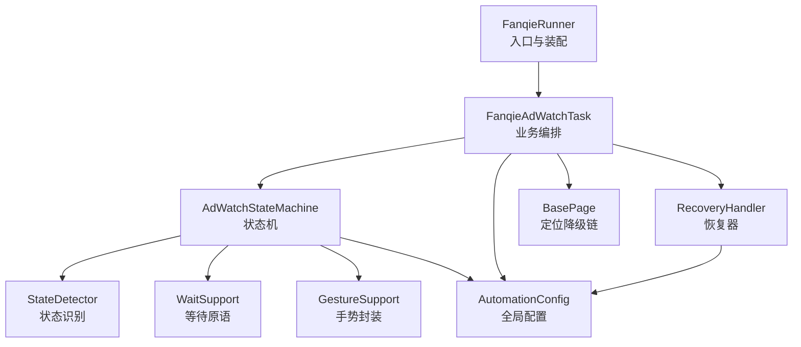
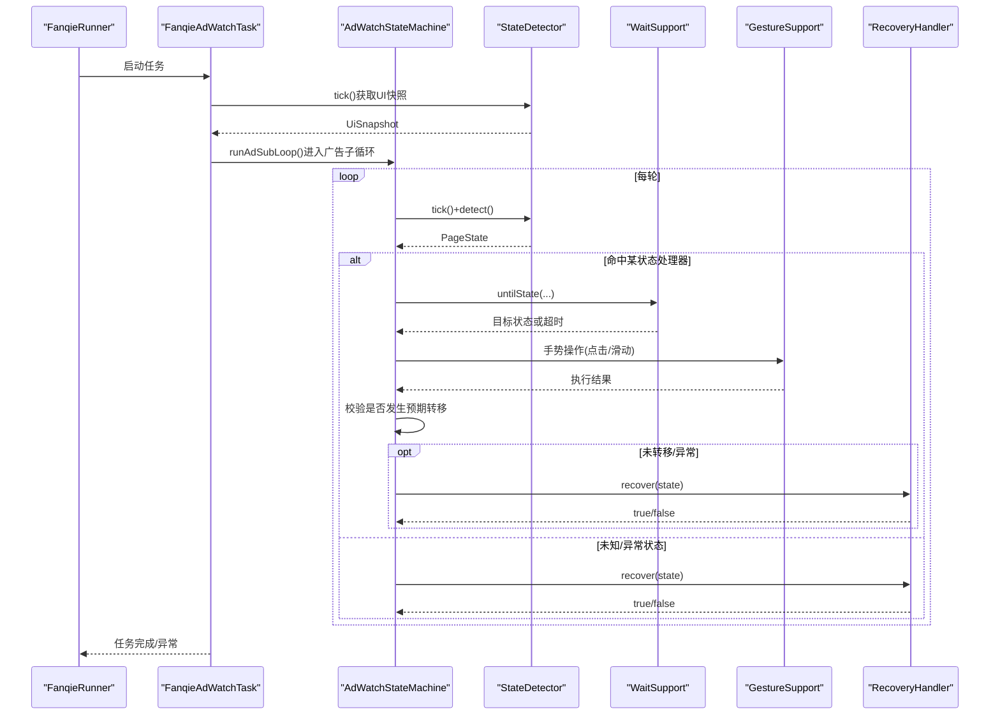
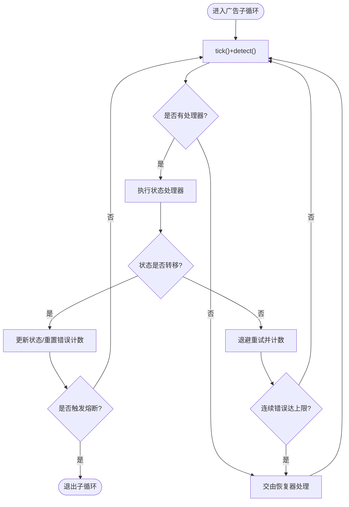
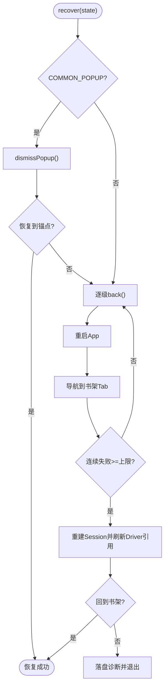
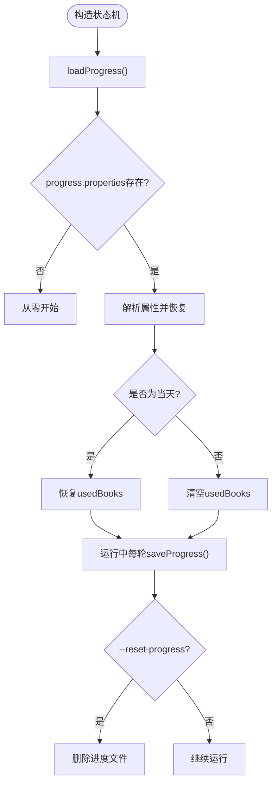
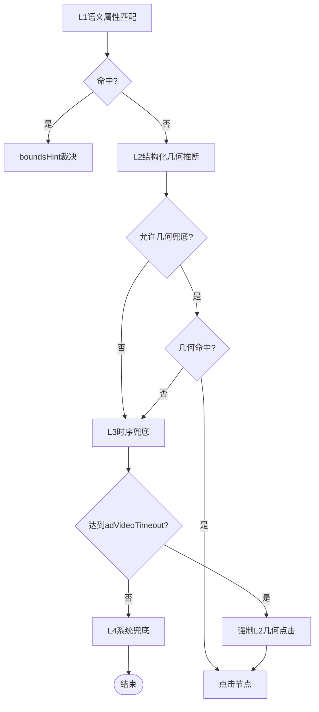
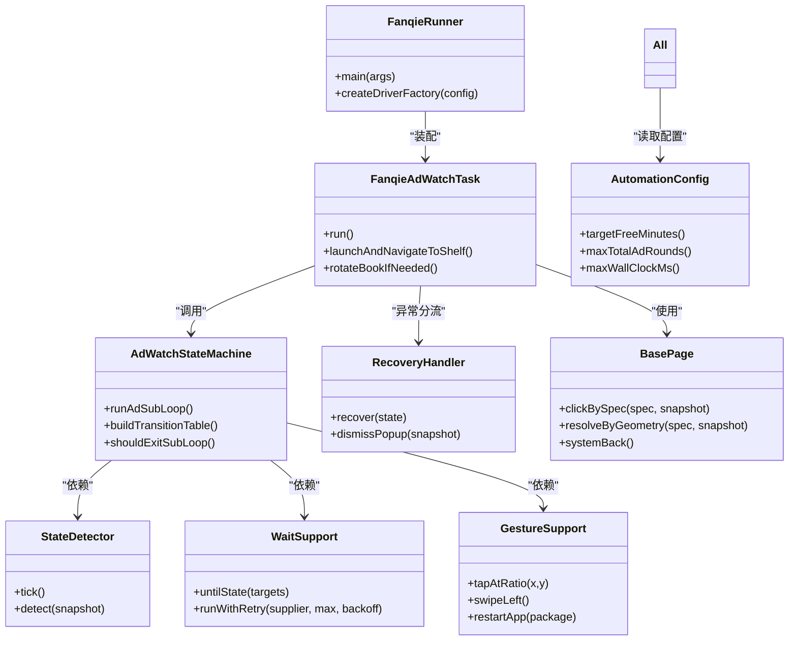

# 核心特性

<cite>
**本文引用的文件**
- [FanqieRunner.java](file://automation/src/main/java/com/fanqie/auto/FanqieRunner.java)
- [AdWatchStateMachine.java](file://automation/src/main/java/com/fanqie/auto/task/AdWatchStateMachine.java)
- [RecoveryHandler.java](file://automation/src/main/java/com/fanqie/auto/task/RecoveryHandler.java)
- [FanqieAdWatchTask.java](file://automation/src/main/java/com/fanqie/auto/task/FanqieAdWatchTask.java)
- [StateDetector.java](file://automation/src/main/java/com/fanqie/auto/core/StateDetector.java)
- [WaitSupport.java](file://automation/src/main/java/com/fanqie/auto/core/WaitSupport.java)
- [GestureSupport.java](file://automation/src/main/java/com/fanqie/auto/core/GestureSupport.java)
- [BasePage.java](file://automation/src/main/java/com/fanqie/auto/page/BasePage.java)
- [AutomationConfig.java](file://automation/src/main/java/com/fanqie/auto/config/AutomationConfig.java)
</cite>

## 目录
1. [简介](#简介)
2. [项目结构](#项目结构)
3. [核心组件](#核心组件)
4. [架构总览](#架构总览)
5. [详细组件分析](#详细组件分析)
6. [依赖关系分析](#依赖关系分析)
7. [性能考量](#性能考量)
8. [故障排查指南](#故障排查指南)
9. [结论](#结论)
10. [附录](#附录)

## 简介
本文件面向番茄免费小说UI自动化项目的“核心特性”，聚焦以下能力：
- 智能状态管理：基于状态机模式处理复杂页面跳转与状态转换，具备幂等、熔断与自愈。
- 错误恢复机制：多级恢复策略（弹窗关闭→逐级返回→重启App→导航书架→重建Session），配合异常统计与落盘诊断。
- 断点续跑：持久化累计进度（已获免广告分钟数、总轮次、已用书籍集合），支持进程重启后继续执行。
- UI元素智能识别：多通道定位（resource-id/text/content-desc）+ 几何推断 + 语义裁决，稳定适配不同设备与版本。
- 手势操作模拟：比例坐标点击、滑动、翻页、激活/终止App，避免硬编码像素。
- 等待支持：统一显式等待原语，覆盖多目标状态等待、条件等待与指数退避重试。

这些特性共同提升自动化测试的稳定性与可靠性，降低误判、误点与死循环风险。

## 项目结构
项目采用分层组织：
- 入口与装配：FanqieRunner 负责参数解析、环境自检、组件装配与生命周期管理。
- 任务编排：FanqieAdWatchTask 定义外层循环、翻页流程与异常分流。
- 状态机：AdWatchStateMachine 以转移表驱动各状态处理器，实现幂等与熔断。
- 恢复器：RecoveryHandler 提供五级恢复策略，保障任意步失败回到锚点。
- 核心能力：
  - StateDetector：高性能状态识别（内存快照匹配）。
  - WaitSupport：统一等待原语与重试。
  - GestureSupport：手势封装（点击/滑动/翻页/App控制）。
  - BasePage：四级定位降级链（L1语义→L2几何→L3时序→L4系统）。
- 配置：AutomationConfig 集中管理超时、轮次、阈值等。

**图表来源**
- [FanqieRunner.java:147-201](file://automation/src/main/java/com/fanqie/auto/FanqieRunner.java#L147-L201)
- [FanqieAdWatchTask.java:99-165](file://automation/src/main/java/com/fanqie/auto/task/FanqieAdWatchTask.java#L99-L165)
- [AdWatchStateMachine.java:132-157](file://automation/src/main/java/com/fanqie/auto/task/AdWatchStateMachine.java#L132-L157)
- [RecoveryHandler.java:64-76](file://automation/src/main/java/com/fanqie/auto/task/RecoveryHandler.java#L64-L76)
- [StateDetector.java:50-68](file://automation/src/main/java/com/fanqie/auto/core/StateDetector.java#L50-L68)
- [WaitSupport.java:34-38](file://automation/src/main/java/com/fanqie/auto/core/WaitSupport.java#L34-L38)
- [GestureSupport.java:36-49](file://automation/src/main/java/com/fanqie/auto/core/GestureSupport.java#L36-L49)
- [BasePage.java:61-68](file://automation/src/main/java/com/fanqie/auto/page/BasePage.java#L61-L68)
- [AutomationConfig.java:18-42](file://automation/src/main/java/com/fanqie/auto/config/AutomationConfig.java#L18-L42)

**章节来源**
- [FanqieRunner.java:41-239](file://automation/src/main/java/com/fanqie/auto/FanqieRunner.java#L41-L239)
- [FanqieAdWatchTask.java:99-314](file://automation/src/main/java/com/fanqie/auto/task/FanqieAdWatchTask.java#L99-L314)

## 核心组件
- 状态机 AdWatchStateMachine：以 Map<PageState, StateHandler> 构建转移表，每个状态对应一个处理器；每轮 tick→detect→handle→校验转移，未转移则退避重试并计数连续错误；四重熔断保护（目标分钟、单入口轮次、全局轮次、墙钟时间预算）；每日配额耗尽去抖识别；奖励计数幂等（roundId + lastCountedRoundId）。
- 恢复器 RecoveryHandler：五级恢复（弹窗关闭→逐级back→重启App→导航书架→重建session），超过最大重试停止并落盘诊断快照。
- 状态识别 StateDetector：tick()仅一次getPageSource并缓存快照；detect()按优先级匹配（resource-id→text→content-desc→APP_LAUNCHING保守判定→几何特征→UNKNOWN）；屏幕尺寸缓存与自愈。
- 等待支持 WaitSupport：untilState/ untilStateGone/ untilAnyTextPresent/ untilSnapshotMatches；runWithRetry指数退避重试。
- 手势支持 GestureSupport：tapAtRatio/tapAtPixel/swipe系列/activateApp/terminateApp/restartApp；所有坐标由运行时屏幕尺寸按比例计算。
- 页面对象基类 BasePage：四级定位降级链（L1语义属性→L2结构化几何→L3时序兜底→L4系统兜底），boundsHint裁决与误点防护（allowGeometryFallback标志）。
- 配置 AutomationConfig：集中管理超时、轮次、阈值、翻页策略等，外部配置文件可覆盖默认值。

**章节来源**
- [AdWatchStateMachine.java:40-121](file://automation/src/main/java/com/fanqie/auto/task/AdWatchStateMachine.java#L40-L121)
- [RecoveryHandler.java:23-43](file://automation/src/main/java/com/fanqie/auto/task/RecoveryHandler.java#L23-L43)
- [StateDetector.java:12-28](file://automation/src/main/java/com/fanqie/auto/core/StateDetector.java#L12-L28)
- [WaitSupport.java:16-25](file://automation/src/main/java/com/fanqie/auto/core/WaitSupport.java#L16-L25)
- [GestureSupport.java:12-25](file://automation/src/main/java/com/fanqie/auto/core/GestureSupport.java#L12-L25)
- [BasePage.java:18-39](file://automation/src/main/java/com/fanqie/auto/page/BasePage.java#L18-L39)
- [AutomationConfig.java:10-17](file://automation/src/main/java/com/fanqie/auto/config/AutomationConfig.java#L10-L17)

## 架构总览
整体流程由 FanqieRunner 装配组件，FanqieAdWatchTask 编排任务，AdWatchStateMachine 驱动状态流转，RecoveryHandler 兜底恢复，StateDetector/WaitSupport/GestureSupport/BasePage 提供底层能力。

**图表来源**
- [FanqieRunner.java:147-201](file://automation/src/main/java/com/fanqie/auto/FanqieRunner.java#L147-L201)
- [FanqieAdWatchTask.java:197-305](file://automation/src/main/java/com/fanqie/auto/task/FanqieAdWatchTask.java#L197-L305)
- [AdWatchStateMachine.java:173-312](file://automation/src/main/java/com/fanqie/auto/task/AdWatchStateMachine.java#L173-L312)
- [StateDetector.java:97-127](file://automation/src/main/java/com/fanqie/auto/core/StateDetector.java#L97-L127)
- [WaitSupport.java:56-86](file://automation/src/main/java/com/fanqie/auto/core/WaitSupport.java#L56-L86)
- [GestureSupport.java:106-123](file://automation/src/main/java/com/fanqie/auto/core/GestureSupport.java#L106-L123)
- [RecoveryHandler.java:100-253](file://automation/src/main/java/com/fanqie/auto/task/RecoveryHandler.java#L100-L253)

## 详细组件分析

### 智能状态管理机制（状态机模式）
- 转移表驱动：Map<PageState, StateHandler> 注册各状态处理器，当前状态决定下一步动作，不假设固定顺序。
- 幂等性保证：执行前重新 detect() 确认状态未漂移；执行后校验是否发生预期转移，未转移则退避重试并记录连续错误。
- 四重熔断：目标分钟达成、单入口轮次上限、全局轮次上限、墙钟时间预算耗尽任一触发即退出子循环。
- 每日配额耗尽识别：去抖计数连续命中文案+弹窗上下文约束，优雅收尾退出。
- 奖励计数幂等：roundId自增 + lastCountedRoundId确保每真实一轮至多计一次且不漏计。

**图表来源**
- [AdWatchStateMachine.java:173-312](file://automation/src/main/java/com/fanqie/auto/task/AdWatchStateMachine.java#L173-L312)
- [AdWatchStateMachine.java:355-394](file://automation/src/main/java/com/fanqie/auto/task/AdWatchStateMachine.java#L355-L394)
- [AdWatchStateMachine.java:655-669](file://automation/src/main/java/com/fanqie/auto/task/AdWatchStateMachine.java#L655-L669)

**章节来源**
- [AdWatchStateMachine.java:40-121](file://automation/src/main/java/com/fanqie/auto/task/AdWatchStateMachine.java#L40-L121)
- [AdWatchStateMachine.java:173-312](file://automation/src/main/java/com/fanqie/auto/task/AdWatchStateMachine.java#L173-L312)
- [AdWatchStateMachine.java:355-394](file://automation/src/main/java/com/fanqie/auto/task/AdWatchStateMachine.java#L355-L394)
- [AdWatchStateMachine.java:561-595](file://automation/src/main/java/com/fanqie/auto/task/AdWatchStateMachine.java#L561-L595)

### 错误恢复机制（多级恢复策略与熔断保护）
- 五级恢复：弹窗关闭→逐级back→重启App→导航书架→重建Session；超过maxRecoveryRetry停止并保留现场。
- 异常统计：连续错误计数与RunLogger联动，达到上限触发恢复；每次恢复成功重置计数。
- 熔断保护：状态机内单状态滞留熔断（maxStateDwellMs），任务层墙钟时间预算熔断（maxWallClockMs）。
- 落盘诊断：恢复失败时捕获快照并标记会话死亡，便于问题定位。

**图表来源**
- [RecoveryHandler.java:100-253](file://automation/src/main/java/com/fanqie/auto/task/RecoveryHandler.java#L100-L253)
- [AdWatchStateMachine.java:217-233](file://automation/src/main/java/com/fanqie/auto/task/AdWatchStateMachine.java#L217-L233)
- [FanqieAdWatchTask.java:183-195](file://automation/src/main/java/com/fanqie/auto/task/FanqieAdWatchTask.java#L183-L195)

**章节来源**
- [RecoveryHandler.java:23-43](file://automation/src/main/java/com/fanqie/auto/task/RecoveryHandler.java#L23-L43)
- [RecoveryHandler.java:100-253](file://automation/src/main/java/com/fanqie/auto/task/RecoveryHandler.java#L100-L253)
- [AdWatchStateMachine.java:217-233](file://automation/src/main/java/com/fanqie/auto/task/AdWatchStateMachine.java#L217-L233)

### 断点续跑功能（进度持久化）
- 持久化内容：累计免广告分钟数、总广告轮次、已用书籍标识集合、持久化日期与时间戳。
- 加载逻辑：构造时从 progress.properties 恢复；跨天清空 usedBooks 避免残留影响。
- 保存时机：每轮结束后保存；重置进度时删除文件。
- 编码兼容：usedBooks使用URL编码+“|”分隔，向后兼容旧“,”分隔格式。

**图表来源**
- [AdWatchStateMachine.java:679-734](file://automation/src/main/java/com/fanqie/auto/task/AdWatchStateMachine.java#L679-L734)
- [AdWatchStateMachine.java:741-778](file://automation/src/main/java/com/fanqie/auto/task/AdWatchStateMachine.java#L741-L778)
- [FanqieRunner.java:207-214](file://automation/src/main/java/com/fanqie/auto/FanqieRunner.java#L207-L214)

**章节来源**
- [AdWatchStateMachine.java:679-734](file://automation/src/main/java/com/fanqie/auto/task/AdWatchStateMachine.java#L679-L734)
- [AdWatchStateMachine.java:741-778](file://automation/src/main/java/com/fanqie/auto/task/AdWatchStateMachine.java#L741-L778)
- [FanqieRunner.java:207-214](file://automation/src/main/java/com/fanqie/auto/FanqieRunner.java#L207-L214)

### UI元素智能识别（多通道定位与几何推断）
- 多通道匹配：resource-id→text→content-desc，命中多个时用boundsHint裁决（底部/居中/右上角）。
- 几何推断：当L1无命中时，在指定区域查找clickable且面积较小的节点（需allowGeometryFallback=true）。
- 时序兜底：激励视频等待超时后强制执行L2几何点击（受allowGeometryFallback约束）。
- 系统兜底：navigate().back()或重启App作为最后手段。

**图表来源**
- [BasePage.java:84-91](file://automation/src/main/java/com/fanqie/auto/page/BasePage.java#L84-L91)
- [BasePage.java:103-137](file://automation/src/main/java/com/fanqie/auto/page/BasePage.java#L103-L137)
- [BasePage.java:150-189](file://automation/src/main/java/com/fanqie/auto/page/BasePage.java#L150-L189)
- [BasePage.java:203-219](file://automation/src/main/java/com/fanqie/auto/page/BasePage.java#L203-L219)
- [BasePage.java:227-250](file://automation/src/main/java/com/fanqie/auto/page/BasePage.java#L227-L250)

**章节来源**
- [BasePage.java:18-39](file://automation/src/main/java/com/fanqie/auto/page/BasePage.java#L18-L39)
- [BasePage.java:84-91](file://automation/src/main/java/com/fanqie/auto/page/BasePage.java#L84-L91)
- [BasePage.java:103-137](file://automation/src/main/java/com/fanqie/auto/page/BasePage.java#L103-L137)
- [BasePage.java:150-189](file://automation/src/main/java/com/fanqie/auto/page/BasePage.java#L150-L189)
- [BasePage.java:203-219](file://automation/src/main/java/com/fanqie/auto/page/BasePage.java#L203-L219)
- [BasePage.java:227-250](file://automation/src/main/java/com/fanqie/auto/page/BasePage.java#L227-L250)

### 手势操作模拟（比例坐标与设备端命令）
- 比例点击：tapAtRatio(xRatio, yRatio)将比例转换为绝对像素，经mobile: clickGesture执行。
- 滑动操作：swipeUp/Down/Left/Right使用mobile: swipeGesture，方向与距离由配置控制。
- App控制：activateApp/terminateApp/restartApp，避免硬编码Activity导致权限拒绝。
- 屏幕尺寸缓存：首次获取后缓存，driver刷新时失效，防止横屏/折叠屏旋转后比例失真。

**章节来源**
- [GestureSupport.java:12-25](file://automation/src/main/java/com/fanqie/auto/core/GestureSupport.java#L12-L25)
- [GestureSupport.java:56-67](file://automation/src/main/java/com/fanqie/auto/core/GestureSupport.java#L56-L67)
- [GestureSupport.java:77-95](file://automation/src/main/java/com/fanqie/auto/core/GestureSupport.java#L77-L95)
- [GestureSupport.java:106-123](file://automation/src/main/java/com/fanqie/auto/core/GestureSupport.java#L106-L123)
- [GestureSupport.java:167-178](file://automation/src/main/java/com/fanqie/auto/core/GestureSupport.java#L167-L178)
- [GestureSupport.java:189-226](file://automation/src/main/java/com/fanqie/auto/core/GestureSupport.java#L189-L226)

### 等待支持（显式等待与指数退避重试）
- 多目标等待：untilState(targets...)一次覆盖多个可能状态，避免翻页后直接触发广告弹窗的漏检。
- 条件等待：untilAnyTextPresent/untilSnapshotMatches支持自定义条件。
- 指数退避：runWithRetry(maxAttempts, backoffMs)实现500ms→1s→2s退避，提高偶发失败成功率。

**章节来源**
- [WaitSupport.java:16-25](file://automation/src/main/java/com/fanqie/auto/core/WaitSupport.java#L16-L25)
- [WaitSupport.java:56-86](file://automation/src/main/java/com/fanqie/auto/core/WaitSupport.java#L56-L86)
- [WaitSupport.java:128-151](file://automation/src/main/java/com/fanqie/auto/core/WaitSupport.java#L128-L151)
- [WaitSupport.java:160-183](file://automation/src/main/java/com/fanqie/auto/core/WaitSupport.java#L160-L183)
- [WaitSupport.java:199-232](file://automation/src/main/java/com/fanqie/auto/core/WaitSupport.java#L199-L232)

## 依赖关系分析
- 松耦合设计：各组件通过接口与构造函数注入依赖，避免循环依赖（如RecoveryHandler延迟注入BookshelfPage）。
- DriverAware统一刷新：所有组件实现refreshDriver，RecoveryHandler重建Session后通过DriverRegistry统一刷新引用。
- 配置集中化：AutomationConfig提供类型化Getter，所有超时、轮次、阈值从此处获取，代码零魔法数字。

**图表来源**
- [FanqieRunner.java:147-201](file://automation/src/main/java/com/fanqie/auto/FanqieRunner.java#L147-L201)
- [FanqieAdWatchTask.java:64-81](file://automation/src/main/java/com/fanqie/auto/task/FanqieAdWatchTask.java#L64-L81)
- [AdWatchStateMachine.java:66-77](file://automation/src/main/java/com/fanqie/auto/task/AdWatchStateMachine.java#L66-L77)
- [RecoveryHandler.java:48-62](file://automation/src/main/java/com/fanqie/auto/task/RecoveryHandler.java#L48-L62)
- [StateDetector.java:33-48](file://automation/src/main/java/com/fanqie/auto/core/StateDetector.java#L33-L48)
- [WaitSupport.java:30-38](file://automation/src/main/java/com/fanqie/auto/core/WaitSupport.java#L30-L38)
- [GestureSupport.java:30-39](file://automation/src/main/java/com/fanqie/auto/core/GestureSupport.java#L30-L39)
- [BasePage.java:55-68](file://automation/src/main/java/com/fanqie/auto/page/BasePage.java#L55-L68)
- [AutomationConfig.java:112-306](file://automation/src/main/java/com/fanqie/auto/config/AutomationConfig.java#L112-L306)

**章节来源**
- [FanqieRunner.java:147-201](file://automation/src/main/java/com/fanqie/auto/FanqieRunner.java#L147-L201)
- [FanqieAdWatchTask.java:64-81](file://automation/src/main/java/com/fanqie/auto/task/FanqieAdWatchTask.java#L64-L81)
- [AdWatchStateMachine.java:66-77](file://automation/src/main/java/com/fanqie/auto/task/AdWatchStateMachine.java#L66-L77)
- [RecoveryHandler.java:48-62](file://automation/src/main/java/com/fanqie/auto/task/RecoveryHandler.java#L48-L62)
- [StateDetector.java:33-48](file://automation/src/main/java/com/fanqie/auto/core/StateDetector.java#L33-L48)
- [WaitSupport.java:30-38](file://automation/src/main/java/com/fanqie/auto/core/WaitSupport.java#L30-L38)
- [GestureSupport.java:30-39](file://automation/src/main/java/com/fanqie/auto/core/GestureSupport.java#L30-L39)
- [BasePage.java:55-68](file://automation/src/main/java/com/fanqie/auto/page/BasePage.java#L55-L68)
- [AutomationConfig.java:112-306](file://automation/src/main/java/com/fanqie/auto/config/AutomationConfig.java#L112-L306)

## 性能考量
- 状态识别性能：StateDetector.tick()仅一次getPageSource并缓存快照，同一tick内多次detect复用，避免重复RPC。
- 屏幕尺寸缓存：首次获取后缓存，driver刷新时失效，防止横屏/折叠屏旋转后比例判定失真。
- 等待优化：WaitSupport使用WebDriverWait显式等待，pollInterval可配置，避免Thread.sleep散落。
- 手势优化：GestureSupport使用mobile: clickGesture/swipeGesture设备端命令，比W3C Actions更稳定。
- 配置调优：所有超时、轮次、阈值集中在AutomationConfig，便于根据设备性能调整。

[本节为通用性能讨论，无需特定文件分析]

## 故障排查指南
- 常见异常：
  - 状态未转移：状态机记录连续错误并退避重试，达到上限触发恢复。
  - 弹窗无法关闭：RecoveryHandler按候选文案由弱到强尝试关闭，失败则逐级back。
  - 会话失效：RecoveryHandler重建Session并通过DriverRegistry刷新所有组件引用。
  - 进度丢失：检查progress.properties是否存在及可读，跨天usedBooks会被清空。
- 诊断手段：
  - 落盘快照：恢复失败时自动捕获快照，文件名包含“recovery-failed”。
  - 心跳日志：RunLogger输出状态识别耗时、XML大小、状态变更等信息。
  - 命令行参数：--dry-run只探测不点击，--doctor只环境自检，--reset-progress清除进度。

**章节来源**
- [RecoveryHandler.java:246-253](file://automation/src/main/java/com/fanqie/auto/task/RecoveryHandler.java#L246-L253)
- [AdWatchStateMachine.java:254-302](file://automation/src/main/java/com/fanqie/auto/task/AdWatchStateMachine.java#L254-L302)
- [FanqieRunner.java:241-249](file://automation/src/main/java/com/fanqie/auto/FanqieRunner.java#L241-L249)

## 结论
本项目通过状态机模式、多级恢复机制、断点续跑、智能UI识别、手势封装与统一等待原语，构建了高稳定性的番茄免费小说UI自动化框架。其设计充分考虑了运营波动、设备差异、版本升级等不确定性因素，通过幂等性、熔断保护与自愈能力，显著提升了自动化测试的可靠性与可维护性。建议在实际使用中结合AutomationConfig调优参数，并利用--dry-run/--doctor进行安全验证。

[本节为总结性内容，无需特定文件分析]

## 附录
- 关键配置项示例（来自AutomationConfig）：
  - flow.target.free.minutes: 目标免广告分钟数
  - flow.max.total.ad.rounds: 全局广告轮次上限
  - timing.max.state.dwell.ms: 单状态滞留超时
  - flow.max.wall.clock.ms: 墙钟时间预算
  - reader.turn.strategy: 翻页策略（tap/swipe）
- 使用场景：
  - 日常领取免广告时长：配置目标分钟数，运行主任务。
  - 断点续跑：进程重启后自动恢复进度，继续执行。
  - 故障恢复：遇到异常状态自动恢复，必要时重建Session。
  - 安全探测：--dry-run模式只连接并dump UI树，不执行点击。

[本节为补充信息，无需特定文件分析]