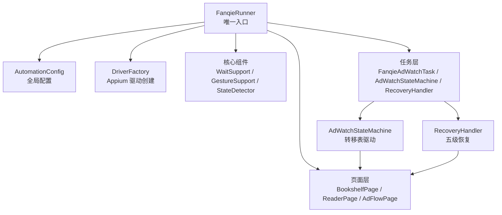
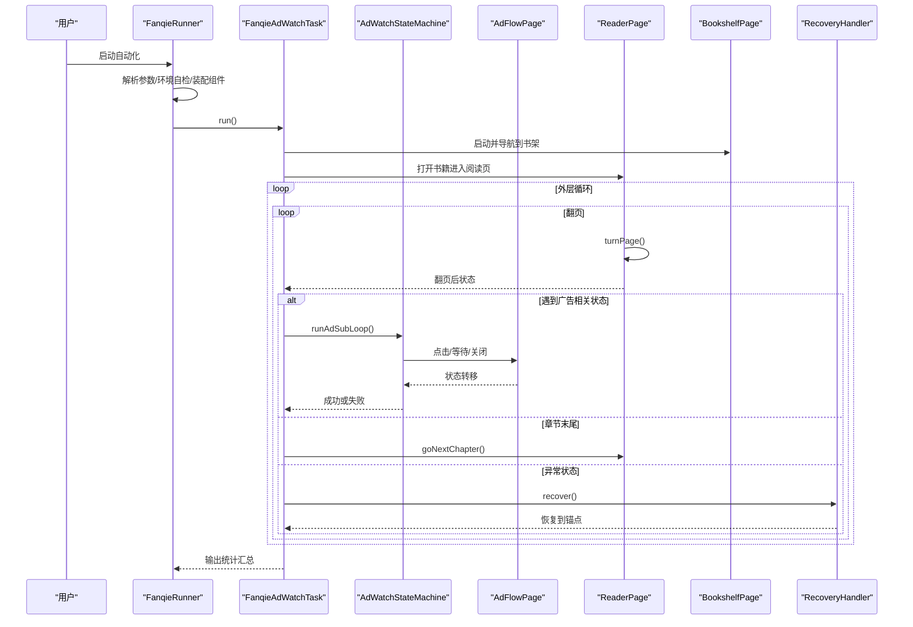
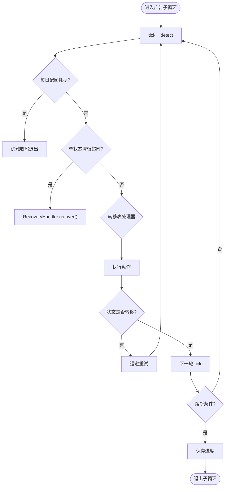
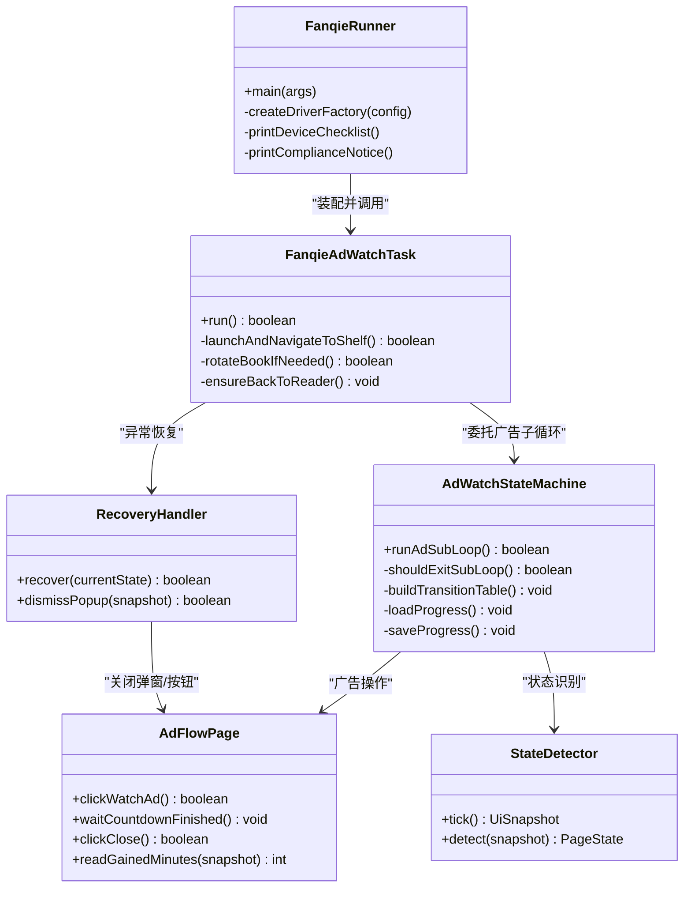

# 项目介绍

<cite>
**本文引用的文件**
- [pom.xml](file://automation/pom.xml)
- [FanqieRunner.java](file://automation/src/main/java/com/fanqie/auto/FanqieRunner.java)
- [AutomationConfig.java](file://automation/src/main/java/com/fanqie/auto/config/AutomationConfig.java)
- [FanqieAdWatchTask.java](file://automation/src/main/java/com/fanqie/auto/task/FanqieAdWatchTask.java)
- [AdWatchStateMachine.java](file://automation/src/main/java/com/fanqie/auto/task/AdWatchStateMachine.java)
- [AdFlowPage.java](file://automation/src/main/java/com/fanqie/auto/page/AdFlowPage.java)
- [StateDetector.java](file://automation/src/main/java/com/fanqie/auto/core/StateDetector.java)
- [RecoveryHandler.java](file://automation/src/main/java/com/fanqie/auto/task/RecoveryHandler.java)
</cite>

## 目录
1. [引言](#引言)
2. [项目结构](#项目结构)
3. [核心组件](#核心组件)
4. [架构总览](#架构总览)
5. [关键流程与状态机](#关键流程与状态机)
6. [依赖关系分析](#依赖关系分析)
7. [性能与稳定性特性](#性能与稳定性特性)
8. [适用场景与价值主张](#适用场景与价值主张)
9. [故障排查指南](#故障排查指南)
10. [结论](#结论)

## 引言
本项目是一个面向“番茄免费小说”的 UI 自动化测试工具，专注于自动化处理“看视频领免广告时长”的广告观看流程。其核心价值在于：
- 自动识别并处理各种广告状态（开屏广告、确认弹窗、视频播放、关闭按钮就绪、奖励发放等）
- 智能管理页面跳转（书架→阅读页→广告流程→返回阅读页）
- 提供完善的错误恢复机制（弹窗关闭、逐级 back、重启 App、重建 session）
- 通过配置化与断点续跑能力，提升长任务运行的可观测性与可恢复性

该工具基于 Appium 2 + Java Client，采用状态机驱动与转移表设计，确保对运营文案变化、设备差异、网络波动等不确定性具备强鲁棒性。

## 项目结构
项目采用分层组织方式：
- 配置层：全局参数、定位器、超时阈值等集中管理
- 核心层：驱动工厂、环境自检、手势支持、等待与快照、状态检测
- 页面层：书架、阅读器、广告流程等页面操作封装
- 任务层：主任务编排、广告状态机、恢复处理器
- 入口与运行：统一入口 FanqieRunner，负责装配与生命周期管理

**图表来源**
- [FanqieRunner.java:41-238](file://automation/src/main/java/com/fanqie/auto/FanqieRunner.java#L41-L238)
- [AutomationConfig.java:18-306](file://automation/src/main/java/com/fanqie/auto/config/AutomationConfig.java#L18-L306)
- [FanqieAdWatchTask.java:99-314](file://automation/src/main/java/com/fanqie/auto/task/FanqieAdWatchTask.java#L99-L314)
- [AdWatchStateMachine.java:173-312](file://automation/src/main/java/com/fanqie/auto/task/AdWatchStateMachine.java#L173-L312)
- [RecoveryHandler.java:100-253](file://automation/src/main/java/com/fanqie/auto/task/RecoveryHandler.java#L100-L253)

**章节来源**
- [pom.xml:1-176](file://automation/pom.xml#L1-L176)
- [FanqieRunner.java:41-238](file://automation/src/main/java/com/fanqie/auto/FanqieRunner.java#L41-L238)

## 核心组件
- 全局配置 AutomationConfig：集中管理 Appium、时序、流程、阅读策略等所有可调参数，并提供类型安全的 getter，避免魔法数字
- 状态检测 StateDetector：高性能 UI 快照与状态识别，按优先级匹配 resource-id、text、content-desc、几何特征，保证低延迟与高准确率
- 广告流程 AdFlowPage：高风险区域的高可靠点击与等待实现，包含四级兜底关闭策略与奖励分钟数提取
- 任务编排 FanqieAdWatchTask：启动 App、导航到书架、打开书籍、翻页循环、广告子循环、多书轮换、熔断保护
- 状态机 AdWatchStateMachine：以转移表驱动的状态流转，四重熔断、幂等动作、退避重试、进度持久化
- 恢复处理器 RecoveryHandler：五级恢复策略，从弹窗关闭到重建 session，保障任意失败都能回到已知锚点

**章节来源**
- [AutomationConfig.java:18-306](file://automation/src/main/java/com/fanqie/auto/config/AutomationConfig.java#L18-L306)
- [StateDetector.java:12-461](file://automation/src/main/java/com/fanqie/auto/core/StateDetector.java#L12-L461)
- [AdFlowPage.java:21-430](file://automation/src/main/java/com/fanqie/auto/page/AdFlowPage.java#L21-L430)
- [FanqieAdWatchTask.java:20-625](file://automation/src/main/java/com/fanqie/auto/task/FanqieAdWatchTask.java#L20-L625)
- [AdWatchStateMachine.java:40-803](file://automation/src/main/java/com/fanqie/auto/task/AdWatchStateMachine.java#L40-L803)
- [RecoveryHandler.java:23-345](file://automation/src/main/java/com/fanqie/auto/task/RecoveryHandler.java#L23-L345)

## 架构总览
系统以 FanqieRunner 为唯一入口，完成参数解析、环境自检、组件装配、心跳保活与优雅退出。核心数据流围绕“UI 快照 → 状态识别 → 状态机决策 → 页面动作 → 结果校验”闭环展开，配合 RecoveryHandler 在异常路径上快速恢复。

**图表来源**
- [FanqieRunner.java:147-221](file://automation/src/main/java/com/fanqie/auto/FanqieRunner.java#L147-L221)
- [FanqieAdWatchTask.java:99-314](file://automation/src/main/java/com/fanqie/auto/task/FanqieAdWatchTask.java#L99-L314)
- [AdWatchStateMachine.java:173-312](file://automation/src/main/java/com/fanqie/auto/task/AdWatchStateMachine.java#L173-L312)
- [AdFlowPage.java:116-262](file://automation/src/main/java/com/fanqie/auto/page/AdFlowPage.java#L116-L262)

## 关键流程与状态机
### 广告观看状态机
状态机以转移表驱动，每个 PageState 对应一个处理器，执行前重新 detect() 保证幂等，执行后校验是否发生预期转移；未转移则退避重试，连续失败触发恢复。四重熔断包括：目标分钟达成、单入口轮次上限、全局轮次上限、墙钟时间预算耗尽。

**图表来源**
- [AdWatchStateMachine.java:173-312](file://automation/src/main/java/com/fanqie/auto/task/AdWatchStateMachine.java#L173-L312)
- [AdWatchStateMachine.java:355-394](file://automation/src/main/java/com/fanqie/auto/task/AdWatchStateMachine.java#L355-L394)
- [AdWatchStateMachine.java:655-669](file://automation/src/main/java/com/fanqie/auto/task/AdWatchStateMachine.java#L655-L669)

### 页面跳转与恢复
任务层负责宏观流程：冷启 App、导航书架、选书进入阅读页、翻页循环中遇广告进入状态机、章节末尾跳转下一章、异常状态交由恢复处理器。恢复处理器提供五级恢复：弹窗关闭、逐级 back、重启 App、导航书架、重建 session，并在失败时落盘诊断快照。

**章节来源**
- [FanqieAdWatchTask.java:322-623](file://automation/src/main/java/com/fanqie/auto/task/FanqieAdWatchTask.java#L322-L623)
- [RecoveryHandler.java:100-253](file://automation/src/main/java/com/fanqie/auto/task/RecoveryHandler.java#L100-L253)

## 依赖关系分析
- FanqieRunner 依赖 AutomationConfig、DriverFactory、RunLogger、GestureSupport、StateDetector、WaitSupport、各 Page 与 Task 组件
- FanqieAdWatchTask 组合 BookshelfPage、ReaderPage、AdFlowPage、AdWatchStateMachine、RecoveryHandler
- AdWatchStateMachine 依赖 AdFlowPage、ReaderPage、BookshelfPage、RecoveryHandler，并通过 StateDetector 获取 UI 快照
- RecoveryHandler 依赖 GestureSupport、WaitSupport、DriverFactory、DriverRegistry，用于恢复与 session 重建

**图表来源**
- [FanqieRunner.java:41-238](file://automation/src/main/java/com/fanqie/auto/FanqieRunner.java#L41-L238)
- [FanqieAdWatchTask.java:99-314](file://automation/src/main/java/com/fanqie/auto/task/FanqieAdWatchTask.java#L99-L314)
- [AdWatchStateMachine.java:173-312](file://automation/src/main/java/com/fanqie/auto/task/AdWatchStateMachine.java#L173-L312)
- [AdFlowPage.java:76-262](file://automation/src/main/java/com/fanqie/auto/page/AdFlowPage.java#L76-L262)
- [StateDetector.java:97-170](file://automation/src/main/java/com/fanqie/auto/core/StateDetector.java#L97-L170)
- [RecoveryHandler.java:100-253](file://automation/src/main/java/com/fanqie/auto/task/RecoveryHandler.java#L100-L253)

**章节来源**
- [FanqieRunner.java:41-238](file://automation/src/main/java/com/fanqie/auto/FanqieRunner.java#L41-L238)
- [FanqieAdWatchTask.java:99-314](file://automation/src/main/java/com/fanqie/auto/task/FanqieAdWatchTask.java#L99-L314)
- [AdWatchStateMachine.java:173-312](file://automation/src/main/java/com/fanqie/auto/task/AdWatchStateMachine.java#L173-L312)
- [AdFlowPage.java:76-262](file://automation/src/main/java/com/fanqie/auto/page/AdFlowPage.java#L76-L262)
- [StateDetector.java:97-170](file://automation/src/main/java/com/fanqie/auto/core/StateDetector.java#L97-L170)
- [RecoveryHandler.java:100-253](file://automation/src/main/java/com/fanqie/auto/task/RecoveryHandler.java#L100-L253)

## 性能与稳定性特性
- 高性能状态识别：StateDetector 每次 tick 仅一次 getPageSource()，内存内多级匹配，避免 RPC 风暴
- 屏幕尺寸缓存与自愈：避免横屏/折叠屏旋转导致比例判定失真
- 幂等动作与退避重试：状态机在执行动作前后均 detect()，未转移则指数退避重试
- 四重熔断：目标分钟、单入口轮次、全局轮次、墙钟时间预算，防止无限空转
- 五级恢复：弹窗关闭、逐级 back、重启 App、导航书架、重建 session，失败落盘诊断
- 断点续跑：进度持久化（earnedMinutes、totalAdRounds、usedBooks），支持中断后继续
- 中文编码与日志：UTF-8 编译与运行，SLF4J 简单实现，心跳与耗时上报

**章节来源**
- [StateDetector.java:97-170](file://automation/src/main/java/com/fanqie/auto/core/StateDetector.java#L97-L170)
- [AdWatchStateMachine.java:355-394](file://automation/src/main/java/com/fanqie/auto/task/AdWatchStateMachine.java#L355-L394)
- [AdWatchStateMachine.java:679-734](file://automation/src/main/java/com/fanqie/auto/task/AdWatchStateMachine.java#L679-L734)
- [RecoveryHandler.java:100-253](file://automation/src/main/java/com/fanqie/auto/task/RecoveryHandler.java#L100-L253)
- [pom.xml:15-28](file://automation/pom.xml#L15-L28)

## 适用场景与价值主张
- 提高测试效率：自动化完成“书架→阅读→广告→奖励”的完整链路，减少人工重复操作
- 降低人为失误：状态机与恢复机制确保在文案变更、弹窗干扰、网络抖动等情况下仍能稳定推进
- 保证测试稳定性：幂等动作、退避重试、熔断保护、断点续跑，适合长时间运行（1-3 小时）
- 可观测与可维护：心跳日志、状态识别耗时、XML 大小、错误分类，便于问题定位与调优
- 合规提示：自动化领取广告激励时长可能违反平台用户协议，建议使用小号验证，避免主力账号长跑

**章节来源**
- [FanqieRunner.java:294-307](file://automation/src/main/java/com/fanqie/auto/FanqieRunner.java#L294-L307)
- [FanqieAdWatchTask.java:307-314](file://automation/src/main/java/com/fanqie/auto/task/FanqieAdWatchTask.java#L307-L314)
- [AdWatchStateMachine.java:40-61](file://automation/src/main/java/com/fanqie/auto/task/AdWatchStateMachine.java#L40-L61)

## 故障排查指南
- 环境自检失败：检查 ADB 连接、开发者选项、USB 调试、监控安装弹窗授权、充电与唤醒设置
- 无法进入阅读页：确认书架 Tab 切换成功，排除短剧/视频误开，必要时回首页重新点书架
- 广告关闭失败：AdFlowPage 提供 L1→L2→L3→L4 全链路兜底，若仍失败将尝试 back/restartApp
- 状态卡死：检查单状态滞留熔断与连续错误计数，必要时触发 RecoveryHandler 五级恢复
- 会话异常：连续失败达到上限后重建 session，刷新所有组件 driver 引用，避免 NoSuchSessionException
- 进度丢失：检查 progress.properties 是否存在与可读，确认 lastUpdateDate 是否为当天

**章节来源**
- [FanqieRunner.java:96-114](file://automation/src/main/java/com/fanqie/auto/FanqieRunner.java#L96-L114)
- [FanqieAdWatchTask.java:322-396](file://automation/src/main/java/com/fanqie/auto/task/FanqieAdWatchTask.java#L322-L396)
- [AdFlowPage.java:180-262](file://automation/src/main/java/com/fanqie/auto/page/AdFlowPage.java#L180-L262)
- [RecoveryHandler.java:212-253](file://automation/src/main/java/com/fanqie/auto/task/RecoveryHandler.java#L212-L253)
- [AdWatchStateMachine.java:679-734](file://automation/src/main/java/com/fanqie/auto/task/AdWatchStateMachine.java#L679-L734)

## 结论
本项目以状态机为核心，结合高性能状态识别、完善恢复机制与断点续跑能力，实现了番茄免费小说“看视频领免广告时长”流程的自动化与稳定化。通过配置化与可观测性设计，既提升了测试效率，又保障了长任务运行的可靠性与可维护性。建议在合规前提下使用小号进行验证与持续优化。