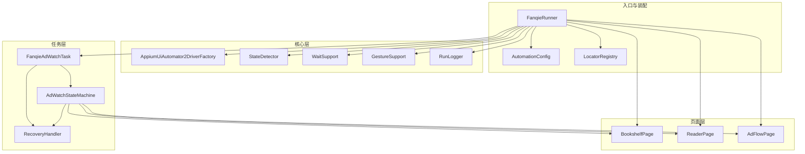
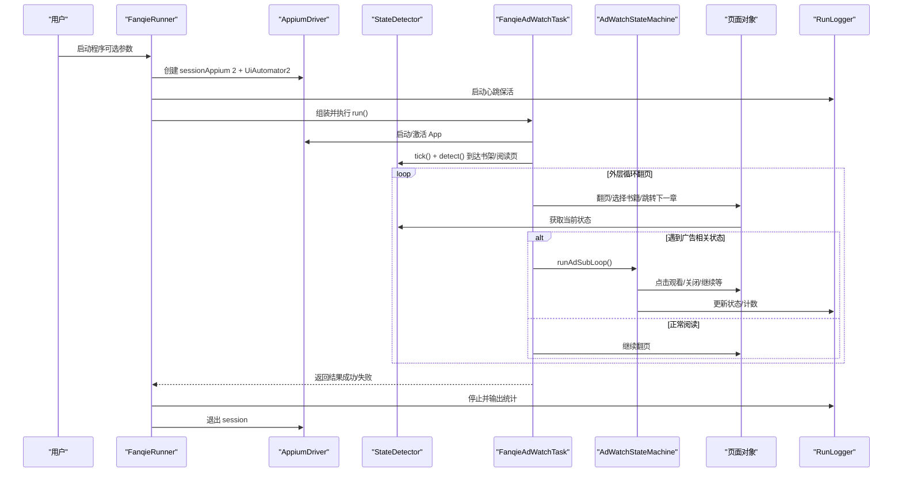
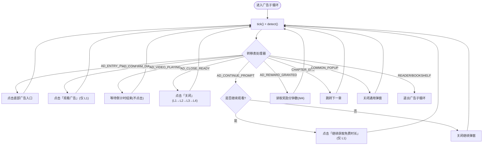
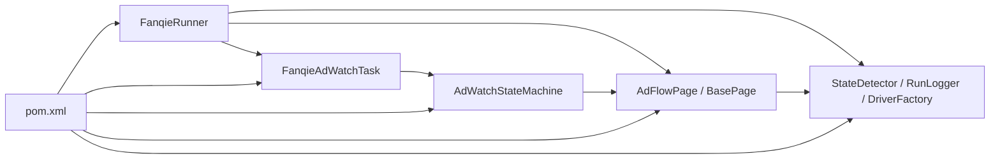

# 项目概述

<cite>
**本文引用的文件**
- [pom.xml](file://automation/pom.xml)
- [FanqieRunner.java](file://automation/src/main/java/com/fanqie/auto/FanqieRunner.java)
- [AutomationConfig.java](file://automation/src/main/java/com/fanqie/auto/config/AutomationConfig.java)
- [LocatorRegistry.java](file://automation/src/main/java/com/fanqie/auto/config/LocatorRegistry.java)
- [AppiumUiAutomator2DriverFactory.java](file://automation/src/main/java/com/fanqie/auto/core/AppiumUiAutomator2DriverFactory.java)
- [StateDetector.java](file://automation/src/main/java/com/fanqie/auto/core/StateDetector.java)
- [RunLogger.java](file://automation/src/main/java/com/fanqie/auto/core/RunLogger.java)
- [BasePage.java](file://automation/src/main/java/com/fanqie/auto/page/BasePage.java)
- [AdFlowPage.java](file://automation/src/main/java/com/fanqie/auto/page/AdFlowPage.java)
- [FanqieAdWatchTask.java](file://automation/src/main/java/com/fanqie/auto/task/FanqieAdWatchTask.java)
- [AdWatchStateMachine.java](file://automation/src/main/java/com/fanqie/auto/task/AdWatchStateMachine.java)
</cite>

## 目录
1. [简介](#简介)
2. [项目结构](#项目结构)
3. [核心组件](#核心组件)
4. [架构总览](#架构总览)
5. [详细组件分析](#详细组件分析)
6. [依赖关系分析](#依赖关系分析)
7. [性能与稳定性特性](#性能与稳定性特性)
8. [快速开始指南](#快速开始指南)
9. [故障排查指南](#故障排查指南)
10. [结论](#结论)

## 简介
本项目是一个基于 Appium 2 + Java Client 的番茄免费小说 UI 自动化测试工具，专注于自动化处理“看视频领免广告时长”的广告观看流程。项目以状态机驱动、四级定位降级链、智能恢复与断点续跑为核心能力，提供长任务可观测性（心跳日志、截图/XML快照）、错误恢复、墙钟熔断与每日配额识别等工程化保障，适用于在真实设备上稳定、可重复地执行番茄小说广告领取任务。

主要技术栈与特性：
- 技术栈：Java 11、Appium 2（UiAutomator2）、Selenium 4、SLF4J、JUnit 5（单元测试）
- 核心特性：
  - 智能状态管理：基于 PageState 的状态机与转移表驱动
  - 四级定位降级链：语义属性 → 几何推断 → 时序兜底 → 系统兜底
  - 错误恢复与自愈：RecoveryHandler 多级恢复策略
  - 断点续跑：进度持久化（分钟数、轮次、已用书籍集合）
  - 可观测性：心跳保活、运行统计汇总、异常分布、截图/XML快照
  - 安全与合规：误点防护、墙钟熔断、每日配额识别优雅收尾

适用场景：
- 在 Android 真机上自动完成番茄小说广告观看流程，累计免广告时长
- 需要稳定、可观测、可中断续跑的长时自动化任务
- 对运营文案漂移、UI 变化具备较强鲁棒性的自动化方案

**章节来源**
- [pom.xml:12-28](file://automation/pom.xml#L12-L28)
- [FanqieRunner.java:25-36](file://automation/src/main/java/com/fanqie/auto/FanqieRunner.java#L25-L36)

## 项目结构
项目采用分层模块化组织：
- config：全局配置与定位器注册表
- core：驱动工厂、状态检测、等待支持、手势、日志、快照等基础设施
- page：页面对象封装（书架、阅读器、广告流程）
- task：业务编排（广告观看任务、状态机、恢复处理器）
- resources/test：离线测试用例与 fixtures

**图表来源**
- [FanqieRunner.java:120-201](file://automation/src/main/java/com/fanqie/auto/FanqieRunner.java#L120-L201)
- [AppiumUiAutomator2DriverFactory.java:15-32](file://automation/src/main/java/com/fanqie/auto/core/AppiumUiAutomator2DriverFactory.java#L15-L32)
- [StateDetector.java:12-28](file://automation/src/main/java/com/fanqie/auto/core/StateDetector.java#L12-L28)
- [BasePage.java:18-39](file://automation/src/main/java/com/fanqie/auto/page/BasePage.java#L18-L39)
- [AdWatchStateMachine.java:40-61](file://automation/src/main/java/com/fanqie/auto/task/AdWatchStateMachine.java#L40-L61)

**章节来源**
- [FanqieRunner.java:120-201](file://automation/src/main/java/com/fanqie/auto/FanqieRunner.java#L120-L201)
- [pom.xml:50-83](file://automation/pom.xml#L50-L83)

## 核心组件
- FanqieRunner：唯一 main() 入口，负责参数解析、环境自检、组件装配、Dry-run 模式、ShutdownHook 优雅退出、合规提示与设备核对清单输出
- AutomationConfig：集中式配置加载器，提供类型安全的 getter，覆盖 Appium、时序、流程、阅读翻页策略与验证调试项
- LocatorRegistry：管理所有逻辑控件的定位策略（primaryBy + fallbackBys + boundsHint + allowGeometryFallback），并维护中文候选集
- AppiumUiAutomator2DriverFactory：标准 Appium 2 + UiAutomator2 驱动创建与健康检查，关键设计包括不设置 appActivity/app、立即隐式等待为 0、华为/鸿蒙适配与诊断信息
- StateDetector：高性能状态识别器，tick() 缓存 UI 树快照，detect() 纯内存匹配，优先级从高到低：resource-id → text → content-desc → APP_LAUNCHING → 几何特征 → UNKNOWN
- BasePage：四级定位降级链实现（L1 语义属性 → L2 几何推断 → L3 时序兜底 → L4 系统兜底），含 boundsHint 裁决与点击节点回溯
- AdFlowPage：广告流程页面对象，严格限制高风险操作（如观看广告、继续获取时长）仅使用 L1，关闭按钮允许全链路兜底；提供奖励分钟数提取
- FanqieAdWatchTask：业务编排，启动 App、导航到书架、打开书籍进入阅读页、外层循环翻页与广告子循环、多本书轮换、章节跳转与异常恢复
- AdWatchStateMachine：转移表驱动的状态机，四重熔断（目标分钟、单入口轮次、全局轮次、单状态滞留），断点续跑（progress.properties），每日配额耗尽识别与优雅收尾
- RunLogger：运行日志器，心跳保活、状态转移记录、截图/XML快照落盘、最终统计汇总

**章节来源**
- [FanqieRunner.java:41-239](file://automation/src/main/java/com/fanqie/auto/FanqieRunner.java#L41-L239)
- [AutomationConfig.java:18-306](file://automation/src/main/java/com/fanqie/auto/config/AutomationConfig.java#L18-L306)
- [LocatorRegistry.java:16-300](file://automation/src/main/java/com/fanqie/auto/config/LocatorRegistry.java#L16-L300)
- [AppiumUiAutomator2DriverFactory.java:15-210](file://automation/src/main/java/com/fanqie/auto/core/AppiumUiAutomator2DriverFactory.java#L15-L210)
- [StateDetector.java:12-461](file://automation/src/main/java/com/fanqie/auto/core/StateDetector.java#L12-L461)
- [BasePage.java:18-516](file://automation/src/main/java/com/fanqie/auto/page/BasePage.java#L18-L516)
- [AdFlowPage.java:21-430](file://automation/src/main/java/com/fanqie/auto/page/AdFlowPage.java#L21-L430)
- [FanqieAdWatchTask.java:20-625](file://automation/src/main/java/com/fanqie/auto/task/FanqieAdWatchTask.java#L20-L625)
- [AdWatchStateMachine.java:40-803](file://automation/src/main/java/com/fanqie/auto/task/AdWatchStateMachine.java#L40-L803)
- [RunLogger.java:31-374](file://automation/src/main/java/com/fanqie/auto/core/RunLogger.java#L31-L374)

## 架构总览
整体架构围绕“任务编排 → 状态机 → 页面对象 → 驱动交互”展开，辅以配置、定位器、等待、手势、日志等横切能力。

**图表来源**
- [FanqieRunner.java:120-239](file://automation/src/main/java/com/fanqie/auto/FanqieRunner.java#L120-L239)
- [FanqieAdWatchTask.java:99-314](file://automation/src/main/java/com/fanqie/auto/task/FanqieAdWatchTask.java#L99-L314)
- [AdWatchStateMachine.java:173-312](file://automation/src/main/java/com/fanqie/auto/task/AdWatchStateMachine.java#L173-L312)
- [AdFlowPage.java:180-262](file://automation/src/main/java/com/fanqie/auto/page/AdFlowPage.java#L180-L262)
- [RunLogger.java:150-197](file://automation/src/main/java/com/fanqie/auto/core/RunLogger.java#L150-L197)

## 详细组件分析

### 入口与装配：FanqieRunner
- 职责：命令行参数解析（--doctor/--dry-run/--config/--cycles/--pages/--reset-progress）、环境自检、组件装配、Dry-run 模式、ShutdownHook 优雅退出、合规提示与设备核对清单
- 关键点：
  - 通过 createDriverFactory(config) 动态选择驱动工厂（当前 uiautomator2）
  - 注册 DriverAware 组件到 DriverRegistry，便于 session 重建后统一刷新引用
  - Dry-run 模式下委托 DryRunProbe 只探测不点击
  - try-finally 保证 logger.stop() 与 driver.quit() 幂等执行

**章节来源**
- [FanqieRunner.java:41-239](file://automation/src/main/java/com/fanqie/auto/FanqieRunner.java#L41-L239)
- [FanqieRunner.java:258-268](file://automation/src/main/java/com/fanqie/auto/FanqieRunner.java#L258-L268)

### 配置与定位器：AutomationConfig 与 LocatorRegistry
- AutomationConfig：集中加载 automation.properties，提供类型安全 getter，涵盖 Appium、时序、流程、阅读翻页策略与验证调试项；支持外部配置文件覆盖
- LocatorRegistry：管理各逻辑控件的 LocatorSpec（primaryBy + fallbackBys + boundsHint + allowGeometryFallback），维护中文候选集并打印核验；ad.watch/ad.continue 禁止几何兜底以防误点浪费配额，ad.close 允许几何兜底

**章节来源**
- [AutomationConfig.java:18-306](file://automation/src/main/java/com/fanqie/auto/config/AutomationConfig.java#L18-L306)
- [LocatorRegistry.java:16-300](file://automation/src/main/java/com/fanqie/auto/config/LocatorRegistry.java#L16-L300)

### 驱动与状态检测：AppiumUiAutomator2DriverFactory 与 StateDetector
- AppiumUiAutomator2DriverFactory：构建 UiAutomator2Options，不设置 appActivity/app，立即 implicitlyWait=0，华为/鸿蒙适配（ignoreHiddenApiPolicyError、suppressKillServer），健康检查与诊断信息输出
- StateDetector：tick() 缓存 UI 树快照，detect() 纯内存匹配，优先级 resource-id → text → content-desc → APP_LAUNCHING → 几何特征 → UNKNOWN；屏幕尺寸缓存与自愈；E1/E3 可观测性指标上报

**章节来源**
- [AppiumUiAutomator2DriverFactory.java:15-210](file://automation/src/main/java/com/fanqie/auto/core/AppiumUiAutomator2DriverFactory.java#L15-L210)
- [StateDetector.java:12-461](file://automation/src/main/java/com/fanqie/auto/core/StateDetector.java#L12-L461)

### 页面对象与四级定位：BasePage 与 AdFlowPage
- BasePage：实现四级定位降级链（L1 语义属性 → L2 几何推断 → L3 时序兜底 → L4 系统兜底），boundsHint 裁决与点击节点回溯；误点防护（allowGeometryFallback）
- AdFlowPage：广告流程高风险区，严格限制高风险操作仅使用 L1；关闭按钮允许全链路兜底；waitCountdownFinished() 不做任何点击，仅心跳轮询；readGainedMinutes() M4 修复避免高估

**章节来源**
- [BasePage.java:18-516](file://automation/src/main/java/com/fanqie/auto/page/BasePage.java#L18-L516)
- [AdFlowPage.java:21-430](file://automation/src/main/java/com/fanqie/auto/page/AdFlowPage.java#L21-L430)

### 任务编排与状态机：FanqieAdWatchTask 与 AdWatchStateMachine
- FanqieAdWatchTask：启动 App、导航到书架、打开书籍进入阅读页、外层循环翻页与广告子循环、多本书轮换、章节跳转与异常恢复；墙钟熔断与每日配额识别
- AdWatchStateMachine：转移表驱动，四重熔断（目标分钟、单入口轮次、全局轮次、单状态滞留），断点续跑（progress.properties），每日配额耗尽识别与优雅收尾；M3 奖励计数幂等（roundId + lastCountedRoundId）

**图表来源**
- [AdWatchStateMachine.java:398-653](file://automation/src/main/java/com/fanqie/auto/task/AdWatchStateMachine.java#L398-L653)
- [AdFlowPage.java:76-101](file://automation/src/main/java/com/fanqie/auto/page/AdFlowPage.java#L76-L101)
- [AdFlowPage.java:180-262](file://automation/src/main/java/com/fanqie/auto/page/AdFlowPage.java#L180-L262)
- [AdFlowPage.java:317-363](file://automation/src/main/java/com/fanqie/auto/page/AdFlowPage.java#L317-L363)

**章节来源**
- [FanqieAdWatchTask.java:99-625](file://automation/src/main/java/com/fanqie/auto/task/FanqieAdWatchTask.java#L99-L625)
- [AdWatchStateMachine.java:173-803](file://automation/src/main/java/com/fanqie/auto/task/AdWatchStateMachine.java#L173-L803)

## 依赖关系分析
- Maven 依赖：Appium Java Client 9.5.0、Selenium BOM 4.34.0、SLF4J Simple、JUnit 5（test scope）
- 运行时依赖：Appium Server（默认 http://127.0.0.1:4723）、Android 设备（UiAutomator2）
- 模块耦合：
  - FanqieRunner 依赖所有核心组件进行装配
  - Task 层依赖 Page 层与 StateMachine
  - StateMachine 依赖 Page 层与 RecoveryHandler
  - Page 层依赖 LocatorRegistry、GestureSupport、RunLogger、StateDetector
  - Core 层提供跨模块能力（驱动、等待、手势、日志、快照）

**图表来源**
- [pom.xml:50-83](file://automation/pom.xml#L50-L83)
- [FanqieRunner.java:120-201](file://automation/src/main/java/com/fanqie/auto/FanqieRunner.java#L120-L201)

**章节来源**
- [pom.xml:50-83](file://automation/pom.xml#L50-L83)
- [FanqieRunner.java:120-201](file://automation/src/main/java/com/fanqie/auto/FanqieRunner.java#L120-L201)

## 性能与稳定性特性
- 性能优化：
  - StateDetector.tick() 缓存 UI 树快照，避免重复 RPC；屏幕尺寸缓存与自愈
  - 立即 implicitlyWait=0，全部等待走显式 WebDriverWait，避免阻塞
  - 视频播放期间稀疏轮询（pollIntervalMs * 4），降低 CPU/RPC 压力
  - 禁用 resource-id 自动补全以提升定位速度
- 稳定性保障：
  - 四级定位降级链与误点防护（allowGeometryFallback）
  - 状态机四重熔断与退避重试（指数退避）
  - 错误恢复五级策略（RecoveryHandler）
  - 断点续跑（progress.properties）与墙钟熔断
  - 心跳保活与 session 健康检查
  - 每日配额耗尽识别与优雅收尾

[本节为通用性能讨论，无需特定文件分析]

## 快速开始指南
- 前置条件：
  - 安装 JDK 11、Node.js（用于 Appium 2）、Android SDK/ADB
  - 启动 Appium Server（默认 http://127.0.0.1:4723）
  - 连接 Android 设备并开启 USB 调试与“仅充电模式下允许 ADB 调试”
- 编译与运行：
  - 在项目根目录执行：mvn clean package
  - 直接运行入口类：mvn exec:java -Dexec.mainClass="com.fanqie.auto.FanqieRunner"
  - 或生成 fat-jar 后独立运行：java -jar target/fanqie-automation-1.0.0.jar
- 常用参数：
  - --doctor：仅环境自检，不创建 session
  - --dry-run：只连接并 dump UI 树，不执行任何点击
  - --config <path>：使用外部配置文件覆盖默认值
  - --cycles <N>：覆盖 flow.outer.cycles
  - --pages <N>：覆盖 flow.pages.per.cycle
  - --reset-progress：清除 progress.properties 中的累计进度，从零开始
- 配置说明：
  - 默认配置文件位于 classpath 的 automation.properties，可通过 --config 指定外部路径覆盖
  - 定位器候选集位于 locators.properties，注意 UTF-8 编码以避免中文乱码
- 示例：
  - 仅环境自检：mvn exec:java -Dexec.mainClass="com.fanqie.auto.FanqieRunner" --doctor
  - Dry-run 模式：mvn exec:java -Dexec.mainClass="com.fanqie.auto.FanqieRunner" --dry-run
  - 自定义配置：mvn exec:java -Dexec.mainClass="com.fanqie.auto.FanqieRunner" --config ./my-config.properties

**章节来源**
- [FanqieRunner.java:241-249](file://automation/src/main/java/com/fanqie/auto/FanqieRunner.java#L241-L249)
- [AutomationConfig.java:25-42](file://automation/src/main/java/com/fanqie/auto/config/AutomationConfig.java#L25-L42)
- [LocatorRegistry.java:67-93](file://automation/src/main/java/com/fanqie/auto/config/LocatorRegistry.java#L67-L93)
- [pom.xml:127-135](file://automation/pom.xml#L127-L135)

## 故障排查指南
- Session 创建失败：
  - 检查手机是否有待确认的 APK 安装弹窗（华为“监控 ADB 安装应用”）
  - 确认已开启“仅充电模式下允许 ADB 调试”、“USB 调试”、“授权本电脑”
  - 验证 Appium Server 是否启动且 /status 返回 ready
  - 使用 adb devices -l 检查设备识别
- 中文乱码：
  - 确保 properties 文件使用 UTF-8 编码，LocatorRegistry 与 AutomationConfig 均使用 InputStreamReader(UTF_8) 加载
- 状态识别异常：
  - 查看 RunLogger 心跳日志中的 getPageSource 耗时与 XML 大小，警惕 XML 膨胀预警
  - 检查 StateDetector 的优先级匹配顺序，必要时调整候选集或正则
- 广告流程卡死：
  - 确认 AdFlowPage.clickClose() 是否启用全链路兜底（L1→L2→L3→L4）
  - 检查 AdWatchStateMachine 的四重熔断与退避重试是否生效
- 断点续跑问题：
  - 检查 progress.properties 的日期字段（lastUpdateDate），跨天会清空 usedBooks 集合
  - 使用 --reset-progress 清除进度重新开始

**章节来源**
- [AppiumUiAutomator2DriverFactory.java:184-208](file://automation/src/main/java/com/fanqie/auto/core/AppiumUiAutomator2DriverFactory.java#L184-L208)
- [LocatorRegistry.java:67-93](file://automation/src/main/java/com/fanqie/auto/config/LocatorRegistry.java#L67-L93)
- [RunLogger.java:188-197](file://automation/src/main/java/com/fanqie/auto/core/RunLogger.java#L188-L197)
- [AdWatchStateMachine.java:679-734](file://automation/src/main/java/com/fanqie/auto/task/AdWatchStateMachine.java#L679-L734)

## 结论
本项目以状态机驱动与四级定位降级链为核心，结合智能恢复、断点续跑、可观测性与合规提示，构建了面向番茄小说广告观看流程的高鲁棒性自动化解决方案。通过配置化与模块化设计，项目具备良好的可扩展性与可维护性，适用于真实设备上的长时自动化任务。建议在生产环境中结合心跳日志与快照进行持续监控，并根据实际运营文案与 UI 变化及时调整候选集与正则。

[本节为总结性内容，无需特定文件分析]