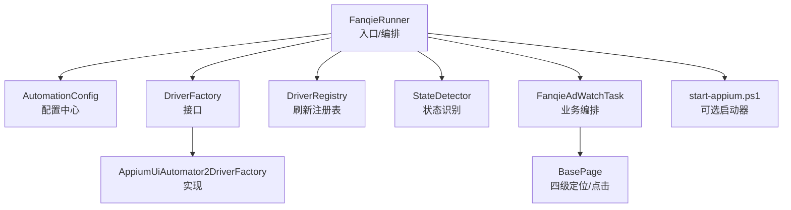
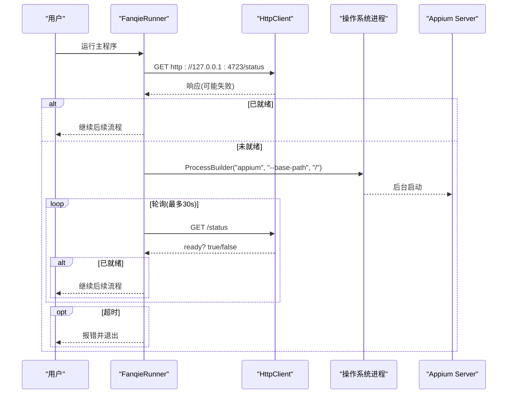
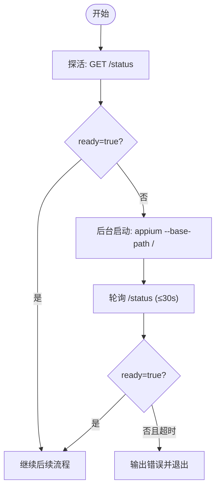
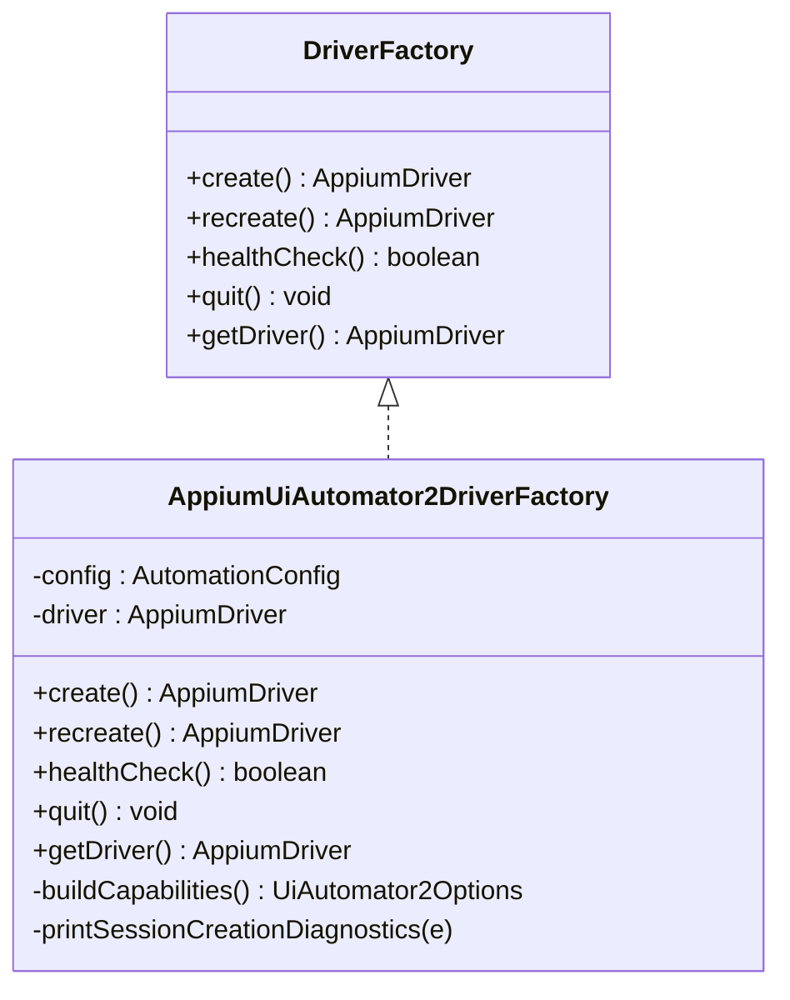
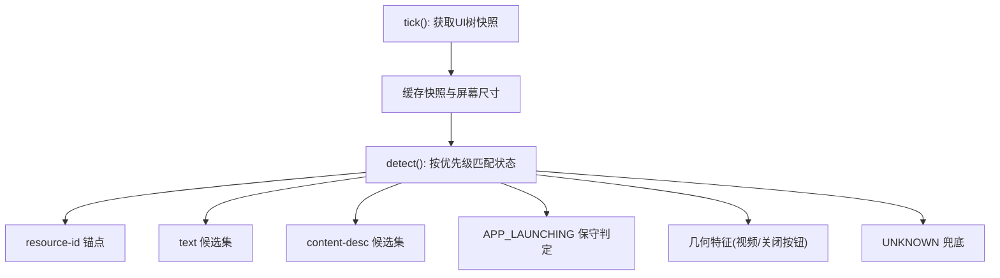
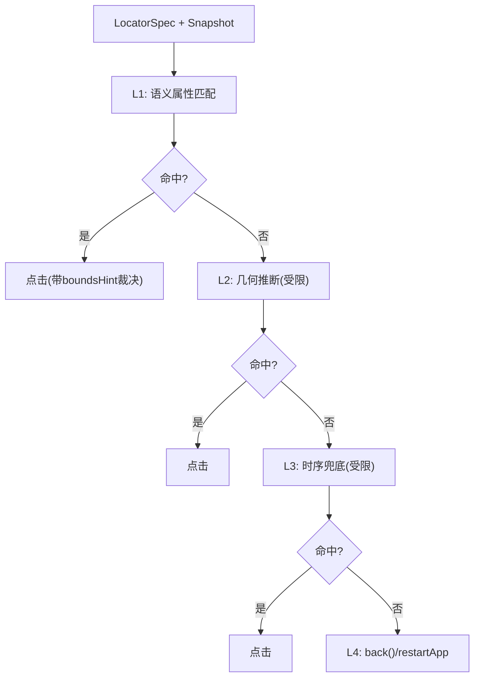
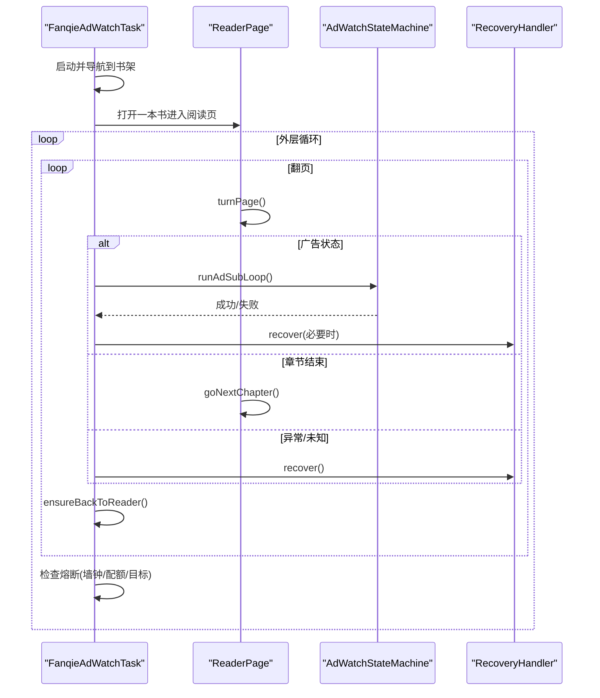
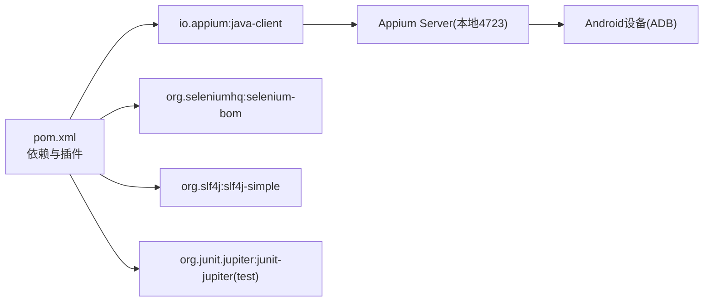

# Appium服务器管理

<cite>
**本文引用的文件**
- [pom.xml](file://automation/pom.xml)
- [FanqieRunner.java](file://automation/src/main/java/com/fanqie/auto/FanqieRunner.java)
- [AutomationConfig.java](file://automation/src/main/java/com/fanqie/auto/config/AutomationConfig.java)
- [DriverFactory.java](file://automation/src/main/java/com/fanqie/auto/core/DriverFactory.java)
- [AppiumUiAutomator2DriverFactory.java](file://automation/src/main/java/com/fanqie/auto/core/AppiumUiAutomator2DriverFactory.java)
- [DriverRegistry.java](file://automation/src/main/java/com/fanqie/auto/core/DriverRegistry.java)
- [StateDetector.java](file://automation/src/main/java/com/fanqie/auto/core/StateDetector.java)
- [BasePage.java](file://automation/src/main/java/com/fanqie/auto/page/BasePage.java)
- [FanqieAdWatchTask.java](file://automation/src/main/java/com/fanqie/auto/task/FanqieAdWatchTask.java)
- [start-appium.ps1](file://automation/start-appium.ps1)
</cite>

## 目录
1. [简介](#简介)
2. [项目结构](#项目结构)
3. [核心组件](#核心组件)
4. [架构总览](#架构总览)
5. [详细组件分析](#详细组件分析)
6. [依赖关系分析](#依赖关系分析)
7. [性能考量](#性能考量)
8. [故障排查指南](#故障排查指南)
9. [结论](#结论)
10. [附录](#附录)

## 简介
本项目是一个基于 Appium 2 + Java Client 的番茄免费小说「看视频领免广告时长」UI 自动化工程。其核心目标之一是“在运行主程序时自动确保 Appium Server 已启动并就绪”，从而让用户无需手动执行脚本即可一键运行自动化任务。同时，项目通过分层抽象与健壮的恢复机制，保障长任务稳定运行、会话异常可自愈、日志与快照可追踪。

## 项目结构
- 入口与编排：FanqieRunner 负责参数解析、环境自检、Appium Server 探活与拉起、组件装配与任务调度。
- 配置中心：AutomationConfig 集中管理所有超时、轮次、阈值等配置，支持外部覆盖。
- 驱动工厂：DriverFactory 接口与 AppiumUiAutomator2DriverFactory 实现，封装 session 创建、重建、健康检查与退出。
- 状态识别：StateDetector 基于 UI 树快照进行高性能状态判定，支撑页面流转与广告流程。
- 页面对象：BasePage 提供四级定位降级链（语义属性→几何推断→时序兜底→系统兜底），统一点击与交互。
- 任务编排：FanqieAdWatchTask 组织翻页、广告子循环、书籍轮换与熔断策略。
- 辅助工具：start-appium.ps1 提供幂等的 PowerShell 启动器，便于手动或 CI 场景使用。

**图表来源**
- [FanqieRunner.java:46-246](file://automation/src/main/java/com/fanqie/auto/FanqieRunner.java#L46-L246)
- [DriverFactory.java:17-54](file://automation/src/main/java/com/fanqie/auto/core/DriverFactory.java#L17-L54)
- [AppiumUiAutomator2DriverFactory.java:44-119](file://automation/src/main/java/com/fanqie/auto/core/AppiumUiAutomator2DriverFactory.java#L44-L119)
- [DriverRegistry.java:19-56](file://automation/src/main/java/com/fanqie/auto/core/DriverRegistry.java#L19-L56)
- [StateDetector.java:102-194](file://automation/src/main/java/com/fanqie/auto/core/StateDetector.java#L102-L194)
- [BasePage.java:84-250](file://automation/src/main/java/com/fanqie/auto/page/BasePage.java#L84-L250)
- [FanqieAdWatchTask.java:99-314](file://automation/src/main/java/com/fanqie/auto/task/FanqieAdWatchTask.java#L99-L314)
- [start-appium.ps1:22-116](file://automation/start-appium.ps1#L22-L116)

**章节来源**
- [pom.xml:1-176](file://automation/pom.xml#L1-L176)
- [FanqieRunner.java:46-246](file://automation/src/main/java/com/fanqie/auto/FanqieRunner.java#L46-L246)

## 核心组件
- FanqieRunner：唯一 main() 入口，负责参数解析、环境自检、Appium Server 自动启动、组件装配、ShutdownHook 优雅关闭、Dry-run 模式与合规提示。
- AutomationConfig：集中化配置加载与类型化 Getter，支持 classpath 默认值与外部 properties 覆盖。
- DriverFactory / AppiumUiAutomator2DriverFactory：抽象并实现 Appium session 生命周期管理，包含能力构建、隐式等待置零、健康检查、优雅退出与中文诊断输出。
- StateDetector：高性能状态识别，单次 getPageSource 构造快照，内存匹配优先级规则，屏幕尺寸缓存与自愈。
- BasePage：四级定位降级链与点击实现，误点防护与时序兜底，boundsHint 裁决。
- FanqieAdWatchTask：任务编排，含启动导航、翻页循环、广告子循环、书籍轮换、熔断与收尾统计。
- start-appium.ps1：幂等启动器，端口探测、进程启动、就绪轮询与结果输出。

**章节来源**
- [FanqieRunner.java:46-246](file://automation/src/main/java/com/fanqie/auto/FanqieRunner.java#L46-L246)
- [AutomationConfig.java:18-306](file://automation/src/main/java/com/fanqie/auto/config/AutomationConfig.java#L18-L306)
- [DriverFactory.java:17-54](file://automation/src/main/java/com/fanqie/auto/core/DriverFactory.java#L17-L54)
- [AppiumUiAutomator2DriverFactory.java:44-211](file://automation/src/main/java/com/fanqie/auto/core/AppiumUiAutomator2DriverFactory.java#L44-L211)
- [StateDetector.java:102-485](file://automation/src/main/java/com/fanqie/auto/core/StateDetector.java#L102-L485)
- [BasePage.java:84-250](file://automation/src/main/java/com/fanqie/auto/page/BasePage.java#L84-L250)
- [FanqieAdWatchTask.java:99-314](file://automation/src/main/java/com/fanqie/auto/task/FanqieAdWatchTask.java#L99-L314)
- [start-appium.ps1:22-116](file://automation/start-appium.ps1#L22-L116)

## 架构总览
本项目的“Appium 服务器管理”由两部分构成：
- 运行时自动启动：FanqieRunner 在启动阶段通过 HTTP GET /status 探活，若未运行则后台启动 appium --base-path /，并轮询至 ready:true 或超时。
- 可选脚本启动：start-appium.ps1 提供幂等启动逻辑，适合手动或 CI 场景，避免重复实例。

**图表来源**
- [FanqieRunner.java:311-379](file://automation/src/main/java/com/fanqie/auto/FanqieRunner.java#L311-L379)
- [start-appium.ps1:22-116](file://automation/start-appium.ps1#L22-L116)

## 详细组件分析

### Appium 服务器自动启动流程
- 探活：通过 HttpClient 向 http://127.0.0.1:4723/status 发起 GET 请求，判断返回体是否包含 "ready":true。
- 启动：若未运行，使用 ProcessBuilder 以后台方式启动 appium --base-path /，并将 stdout/stderr 重定向到临时目录日志文件。
- 轮询：每 1 秒轮询一次 /status，直至 ready 或达到 30 秒超时。
- 错误处理：启动失败或超时均给出明确提示，必要时引导用户手动执行命令或检查安装。

**图表来源**
- [FanqieRunner.java:311-379](file://automation/src/main/java/com/fanqie/auto/FanqieRunner.java#L311-L379)

**章节来源**
- [FanqieRunner.java:311-379](file://automation/src/main/java/com/fanqie/auto/FanqieRunner.java#L311-L379)

### 驱动工厂与会话管理
- 接口设计：DriverFactory 定义 create/recreate/healthCheck/quit/getDriver，屏蔽底层差异，为未来扩展（如鸿蒙 HDC）预留位置。
- 实现要点：
  - 不设置 appActivity/app，改用运行时激活包名；noReset=true 保护用户数据。
  - 立即设置 implicitlyWait=0，避免阻塞短轮询。
  - 健康检查使用轻量级 getSize() 捕获 NoSuchSessionException/InvalidSessionIdException。
  - quit() 捕获 Throwable 保证幂等退出。
  - 构建 UiAutomator2Options 时注入华为/鸿蒙相关能力与超时配置。

**图表来源**
- [DriverFactory.java:17-54](file://automation/src/main/java/com/fanqie/auto/core/DriverFactory.java#L17-L54)
- [AppiumUiAutomator2DriverFactory.java:44-211](file://automation/src/main/java/com/fanqie/auto/core/AppiumUiAutomator2DriverFactory.java#L44-L211)

**章节来源**
- [DriverFactory.java:17-54](file://automation/src/main/java/com/fanqie/auto/core/DriverFactory.java#L17-L54)
- [AppiumUiAutomator2DriverFactory.java:44-211](file://automation/src/main/java/com/fanqie/auto/core/AppiumUiAutomator2DriverFactory.java#L44-L211)

### 状态识别与页面流转
- 快照获取：tick() 仅调用一次 getPageSource()，构造 UiSnapshot，并在同一 tick 内复用，避免重复 RPC。
- 匹配优先级：resource-id → text 候选集 → content-desc 候选集 → APP_LAUNCHING 保守判定 → 几何特征 → UNKNOWN。
- 屏幕尺寸缓存：首次获取后缓存，检测节点越界时自愈重取，避免横屏/折叠屏旋转导致比例失真。
- 关键判定：SPLASH_AD 排他前置条件（全屏大面积 + 无右上角关闭 clickable），AD_VIDEO_PLAYING 与 AD_CLOSE_READY 的几何区分。

**图表来源**
- [StateDetector.java:102-194](file://automation/src/main/java/com/fanqie/auto/core/StateDetector.java#L102-L194)
- [StateDetector.java:207-485](file://automation/src/main/java/com/fanqie/auto/core/StateDetector.java#L207-L485)

**章节来源**
- [StateDetector.java:102-485](file://automation/src/main/java/com/fanqie/auto/core/StateDetector.java#L102-L485)

### 四级定位与点击策略
- L1 语义属性匹配：text 候选集 → content-desc 候选集 → resource-id（精确/包含），命中多个时用 boundsHint 裁决。
- L2 结构化几何推断：在指定区域查找 clickable=true 且 areaRatio < 0.15 的节点，需允许 allowGeometryFallback。
- L3 时序兜底：等待达到 adVideoTimeoutMs 后强制执行 L2 几何点击，受 allowGeometryFallback 约束。
- L4 系统兜底：navigate().back() 强制退出，再失败则重启 App。

**图表来源**
- [BasePage.java:84-250](file://automation/src/main/java/com/fanqie/auto/page/BasePage.java#L84-L250)

**章节来源**
- [BasePage.java:84-250](file://automation/src/main/java/com/fanqie/auto/page/BasePage.java#L84-L250)

### 任务编排与熔断
- 启动导航：冷启 App 并等待到达书架或中间状态，必要时切换书架 Tab。
- 翻页循环：外层循环控制轮次，内层翻页后根据状态进入广告子循环或下一章。
- 广告子循环：遇到广告相关状态交由 AdWatchStateMachine 处理，结束后确认回到阅读页家族。
- 书籍轮换：当单本书广告轮次达上限且全局目标未达成时，回书架换下一本未用书籍。
- 熔断保护：墙钟时间预算耗尽、每日配额耗尽、目标分钟数达成即优雅收尾。

**图表来源**
- [FanqieAdWatchTask.java:99-314](file://automation/src/main/java/com/fanqie/auto/task/FanqieAdWatchTask.java#L99-L314)

**章节来源**
- [FanqieAdWatchTask.java:99-314](file://automation/src/main/java/com/fanqie/auto/task/FanqieAdWatchTask.java#L99-L314)

## 依赖关系分析
- 构建与依赖：Maven 管理依赖，锁定 Selenium BOM 版本，Appium Java Client 与 SLF4J 简单实现用于日志。
- 插件：Surefire 3.x 支持 JUnit 5，exec-maven-plugin 直接运行入口类，shade 插件打包 fat-jar 并合并 SPI 资源。
- 运行时依赖：Appium Server 作为后端服务，Android 设备通过 ADB 连接，Java 客户端通过 HTTP 协议通信。

**图表来源**
- [pom.xml:38-83](file://automation/pom.xml#L38-L83)
- [pom.xml:100-173](file://automation/pom.xml#L100-L173)

**章节来源**
- [pom.xml:1-176](file://automation/pom.xml#L1-L176)

## 性能考量
- 状态识别性能：tick() 仅一次 getPageSource()，内存匹配避免多次 RPC；屏幕尺寸缓存减少 getSize() 调用。
- 隐式等待置零：DriverFactory 创建后立即设置 implicitlyWait=0，确保短轮询不被阻塞。
- 超时与重试：配置化超时（新命令超时、UIA2 启动/安装超时、广告视频超时等），结合重试与恢复机制提升鲁棒性。
- 长任务保护：墙钟时间预算、每日配额、目标分钟数等多重熔断，防止无限期占用设备。

[本节为通用性能讨论，不直接分析具体文件]

## 故障排查指南
- Appium 启动失败：
  - 检查端口 4723 是否被占用，查看 /status 是否返回 ready。
  - 确认 appium 命令可用，必要时手动执行 appium --base-path /。
  - 查看临时目录日志 appium-stdout.log 与 appium-stderr.log。
- Session 创建失败：
  - 参考中文诊断信息逐项排查：APK 安装弹窗、USB 调试、仅充电模式下允许 ADB 调试、设备授权、adb 识别等。
- 状态识别异常：
  - 检查 UI 快照是否解析失败或为空，确认屏幕尺寸缓存是否失效并重取。
  - 关注 SPLASH_AD 与 AD_CLOSE_READY 的误判，核对文本候选集与几何特征。
- 点击失败：
  - 确认 LocatorSpec 的 allowGeometryFallback 标志，必要时启用 L2/L3 几何兜底。
  - 若仍失败，尝试 L4 系统兜底（back/restart）。

**章节来源**
- [FanqieRunner.java:311-379](file://automation/src/main/java/com/fanqie/auto/FanqieRunner.java#L311-L379)
- [AppiumUiAutomator2DriverFactory.java:185-211](file://automation/src/main/java/com/fanqie/auto/core/AppiumUiAutomator2DriverFactory.java#L185-L211)
- [StateDetector.java:102-194](file://automation/src/main/java/com/fanqie/auto/core/StateDetector.java#L102-L194)
- [BasePage.java:150-250](file://automation/src/main/java/com/fanqie/auto/page/BasePage.java#L150-L250)

## 结论
本项目将“Appium 服务器管理”深度集成到主程序启动流程中，实现了开箱即用的自动化体验。通过分层抽象、健壮的状态识别与四级定位策略，以及多重熔断与恢复机制，保障了长任务的稳定性与可维护性。配合可选的 PowerShell 启动器，既满足开发者便捷需求，也适配 CI/CD 场景。

[本节为总结性内容，不直接分析具体文件]

## 附录
- 命令行参数：--doctor、--dry-run、--config、--cycles、--pages、--reset-progress。
- 配置文件：automation.properties（classpath 默认）与外部覆盖路径。
- 日志与快照：RunLogger 心跳与快照落盘，便于问题回溯。

[本节为补充说明，不直接分析具体文件]