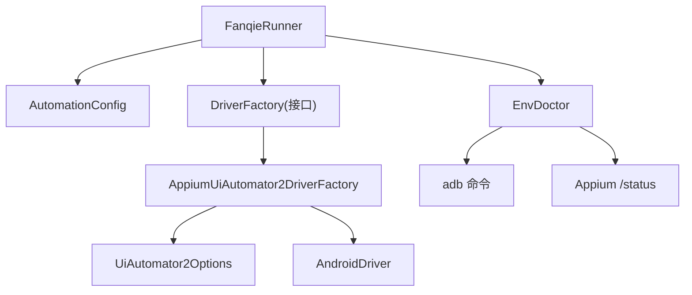
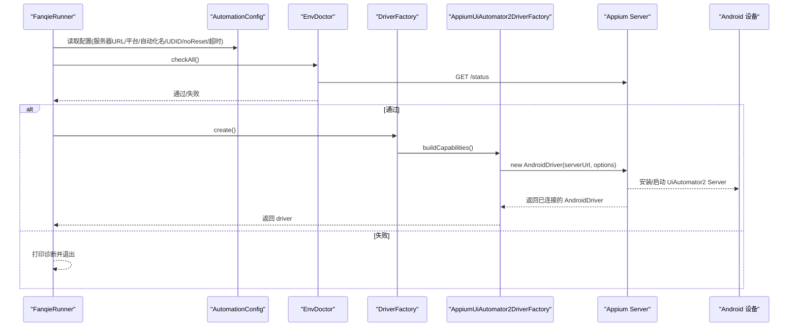
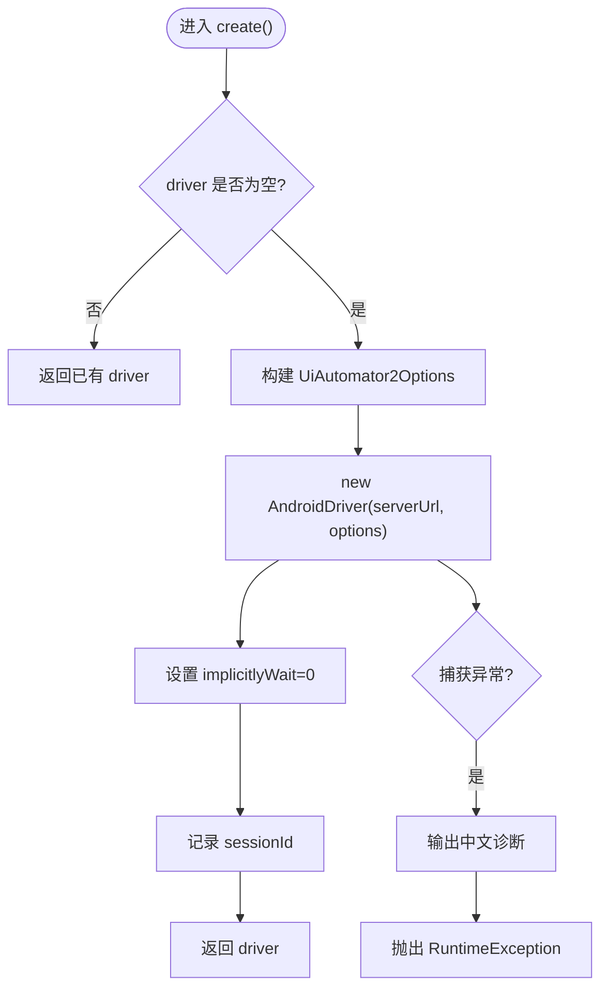
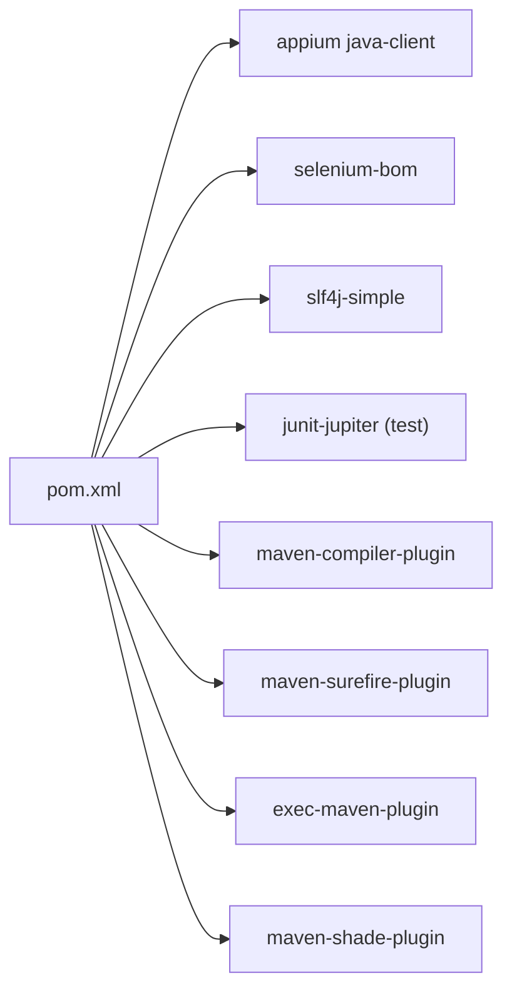

# Appium驱动实现

<cite>
**本文引用的文件**
- [AppiumUiAutomator2DriverFactory.java](file://automation/src/main/java/com/fanqie/auto/core/AppiumUiAutomator2DriverFactory.java)
- [DriverFactory.java](file://automation/src/main/java/com/fanqie/auto/core/DriverFactory.java)
- [AutomationConfig.java](file://automation/src/main/java/com/fanqie/auto/config/AutomationConfig.java)
- [EnvDoctor.java](file://automation/src/main/java/com/fanqie/auto/core/EnvDoctor.java)
- [FanqieRunner.java](file://automation/src/main/java/com/fanqie/auto/FanqieRunner.java)
- [pom.xml](file://automation/pom.xml)
</cite>

## 目录
1. [简介](#简介)
2. [项目结构](#项目结构)
3. [核心组件](#核心组件)
4. [架构总览](#架构总览)
5. [详细组件分析](#详细组件分析)
6. [依赖关系分析](#依赖关系分析)
7. [性能考量](#性能考量)
8. [故障排除指南](#故障排除指南)
9. [结论](#结论)
10. [附录：配置示例与最佳实践](#附录配置示例与最佳实践)

## 简介
本文件聚焦于基于 UiAutomator2 的 Appium 驱动创建流程，围绕 AppiumUiAutomator2DriverFactory 的实现展开，系统说明设备连接配置、会话初始化过程、错误处理机制、noReset 参数的作用与重要性、心跳检测原理（windowSize 探测与异常捕获策略），并提供完整的配置示例与故障排除指南。目标是帮助读者快速理解并稳定运行该自动化框架。

## 项目结构
本项目采用分层设计：
- 配置层：AutomationConfig 负责统一加载和提供所有运行时参数（包括 Appium 地址、平台名、自动化名称、设备 UDID、noReset、超时等）。
- 驱动抽象层：DriverFactory 接口定义驱动生命周期方法；AppiumUiAutomator2DriverFactory 是 UiAutomator2 的具体实现。
- 环境诊断层：EnvDoctor 在 session 创建前执行环境自检（adb、Appium Server、应用安装状态等）。
- 入口编排层：FanqieRunner 装配各组件、启动任务、管理生命周期与优雅退出。
- 构建与依赖：pom.xml 锁定关键依赖版本，确保可重复构建与运行。

图表来源
- [FanqieRunner.java:120-129](file://automation/src/main/java/com/fanqie/auto/FanqieRunner.java#L120-L129)
- [AppiumUiAutomator2DriverFactory.java:44-76](file://automation/src/main/java/com/fanqie/auto/core/AppiumUiAutomator2DriverFactory.java#L44-L76)
- [EnvDoctor.java:48-71](file://automation/src/main/java/com/fanqie/auto/core/EnvDoctor.java#L48-L71)

章节来源
- [FanqieRunner.java:41-129](file://automation/src/main/java/com/fanqie/auto/FanqieRunner.java#L41-L129)
- [AutomationConfig.java:112-178](file://automation/src/main/java/com/fanqie/auto/config/AutomationConfig.java#L112-L178)
- [pom.xml:15-28](file://automation/pom.xml#L15-L28)

## 核心组件
- AppiumUiAutomator2DriverFactory：封装 UiAutomator2 驱动的创建、重建、健康检查、退出等生命周期操作；严格禁用 reset/uninstall/clear 类行为，保证用户数据不丢失；设置隐式等待为 0，避免阻塞短轮询；对 session 创建失败输出中文诊断。
- DriverFactory：抽象驱动工厂接口，便于未来扩展其他驱动实现（如鸿蒙 Hdc 路线），上层零感知替换。
- AutomationConfig：集中化配置中心，提供 Appium 相关能力项（平台、自动化名称、UDID、noReset、超时、是否跳过安装等）以及时序与流程参数。
- EnvDoctor：启动前环境自检，覆盖 adb、设备在线状态、Appium Server 就绪、应用安装情况等，给出逐项处置指引。
- FanqieRunner：主入口，装配配置、诊断、驱动、日志、页面与任务组件，注册 ShutdownHook 保障优雅退出，启动心跳保活。

章节来源
- [AppiumUiAutomator2DriverFactory.java:15-33](file://automation/src/main/java/com/fanqie/auto/core/AppiumUiAutomator2DriverFactory.java#L15-L33)
- [DriverFactory.java:5-16](file://automation/src/main/java/com/fanqie/auto/core/DriverFactory.java#L5-L16)
- [AutomationConfig.java:10-17](file://automation/src/main/java/com/fanqie/auto/config/AutomationConfig.java#L10-L17)
- [EnvDoctor.java:19-28](file://automation/src/main/java/com/fanqie/auto/core/EnvDoctor.java#L19-L28)
- [FanqieRunner.java:25-36](file://automation/src/main/java/com/fanqie/auto/FanqieRunner.java#L25-L36)

## 架构总览
下图展示了从入口到驱动创建的完整调用链，以及环境自检与配置注入的关键路径。

图表来源
- [FanqieRunner.java:101-129](file://automation/src/main/java/com/fanqie/auto/FanqieRunner.java#L101-L129)
- [EnvDoctor.java:142-176](file://automation/src/main/java/com/fanqie/auto/core/EnvDoctor.java#L142-L176)
- [AppiumUiAutomator2DriverFactory.java:44-76](file://automation/src/main/java/com/fanqie/auto/core/AppiumUiAutomator2DriverFactory.java#L44-L76)

## 详细组件分析

### AppiumUiAutomator2DriverFactory：驱动创建与健康检查
- 创建流程
  - 若已有 driver 实例则直接复用，避免重复创建。
  - 解析配置中的 Appium 服务器 URL，构建 UiAutomator2Options。
  - 新建 AndroidDriver 建立 session。
  - 立即设置隐式等待为 0，确保后续查找走显式等待，避免阻塞短轮询。
  - 记录 sessionId 并返回 driver。
- 重建流程
  - 先安全退出旧 session，再重新创建新 session。
- 健康检查（心跳）
  - 使用 driver.manage().window().getSize() 作为轻量探活命令。
  - 捕获 NoSuchSessionException 与 WebDriverException（含 InvalidSessionIdException）以判断 session 是否有效。
- 退出流程
  - 幂等的 quit：关闭 session 并置空引用，异常仅告警不影响退出。
- 能力项构建要点
  - 平台名、自动化名称、设备 UDID（留空自动选择）。
  - noReset=true：保护用户数据，保留登录态与书架数据。
  - newCommandTimeout：配合心跳保活，防止长静默期断连。
  - 华为/鸿蒙适配：自动授权、忽略隐藏 API 策略错误、抑制杀死 adb server。
  - 性能优化：禁用 resource-id 自动补全、延长 uia2 server 启动与安装超时。
  - 屏幕常亮、跳过安装/初始化开关。
  - 明确不设置 appActivity/app，改用运行时激活应用。
- 错误处理
  - 捕获 session 创建异常，输出结构化中文诊断信息，包含常见失败原因与排查步骤。

图表来源
- [AppiumUiAutomator2DriverFactory.java:44-76](file://automation/src/main/java/com/fanqie/auto/core/AppiumUiAutomator2DriverFactory.java#L44-L76)
- [AppiumUiAutomator2DriverFactory.java:120-178](file://automation/src/main/java/com/fanqie/auto/core/AppiumUiAutomator2DriverFactory.java#L120-L178)
- [AppiumUiAutomator2DriverFactory.java:180-208](file://automation/src/main/java/com/fanqie/auto/core/AppiumUiAutomator2DriverFactory.java#L180-L208)

章节来源
- [AppiumUiAutomator2DriverFactory.java:44-118](file://automation/src/main/java/com/fanqie/auto/core/AppiumUiAutomator2DriverFactory.java#L44-L118)
- [AppiumUiAutomator2DriverFactory.java:120-208](file://automation/src/main/java/com/fanqie/auto/core/AppiumUiAutomator2DriverFactory.java#L120-L208)

### DriverFactory：抽象与可扩展性
- 定义 create/recreate/healthCheck/quit/getDriver 五个核心方法。
- 设计目的：将驱动创建细节与上层业务解耦，未来可无缝替换为其他驱动实现（例如鸿蒙 Hdc 路线），上层无需改动。

章节来源
- [DriverFactory.java:5-54](file://automation/src/main/java/com/fanqie/auto/core/DriverFactory.java#L5-L54)

### AutomationConfig：配置中心
- 提供 Appium 相关能力项：服务器地址、平台名、自动化名称、设备 UDID、noReset、newCommandTimeout、uia2 启动/安装超时、是否跳过安装/初始化、是否保持屏幕常亮等。
- 提供时序与流程参数：轮询间隔、状态检测超时、动作超时、应用启动超时、广告视频超时、最大停留时间、心跳间隔、页面循环次数、最大奖励轮次、目标免费分钟数、墙钟熔断时长、外层循环次数、最大连续错误次数、恢复重试次数等。
- 提供阅读页翻页策略与验证开关。
- 支持从 classpath 默认配置文件加载，并可被外部 properties 覆盖。

章节来源
- [AutomationConfig.java:112-178](file://automation/src/main/java/com/fanqie/auto/config/AutomationConfig.java#L112-L178)
- [AutomationConfig.java:180-260](file://automation/src/main/java/com/fanqie/auto/config/AutomationConfig.java#L180-L260)
- [AutomationConfig.java:262-305](file://automation/src/main/java/com/fanqie/auto/config/AutomationConfig.java#L262-L305)

### EnvDoctor：环境自检
- 检查 ANDROID_HOME/ANDROID_SDK_ROOT、adb 版本、设备列表与状态、Appium Server 是否 ready、目标应用是否已安装。
- 任一硬性检查失败会输出完整清单并返回 false，供 Runner 以非零码退出。
- 对外部命令执行进行超时控制与输出流消费，避免 Windows 下缓冲区死锁。

章节来源
- [EnvDoctor.java:48-71](file://automation/src/main/java/com/fanqie/auto/core/EnvDoctor.java#L48-L71)
- [EnvDoctor.java:75-194](file://automation/src/main/java/com/fanqie/auto/core/EnvDoctor.java#L75-L194)
- [EnvDoctor.java:218-265](file://automation/src/main/java/com/fanqie/auto/core/EnvDoctor.java#L218-L265)

### FanqieRunner：编排与生命周期
- 解析命令行参数（doctor/dry-run/reset-progress/config/cycles/pages）。
- 装配配置、定位器、环境自检、驱动工厂、日志、手势、状态检测、等待支持、页面与任务组件。
- 注册 ShutdownHook 与 finally 块，确保 logger.stop() 与 driver.quit() 幂等执行，防止 session 泄漏。
- 启动心跳保活（RunLogger），并在 dry-run 模式下仅探测 UI 树而不执行点击。

章节来源
- [FanqieRunner.java:41-129](file://automation/src/main/java/com/fanqie/auto/FanqieRunner.java#L41-L129)
- [FanqieRunner.java:144-238](file://automation/src/main/java/com/fanqie/auto/FanqieRunner.java#L144-L238)

## 依赖关系分析
- 运行时依赖
  - Appium Java Client（java-client）用于与 Appium Server 通信。
  - Selenium BOM 锁定版本，确保兼容性。
  - SLF4J Simple 实现日志输出。
  - JUnit Jupiter 用于单元测试（test scope）。
- 构建与打包
  - Maven Compiler 强制 release=11 与 UTF-8 编码。
  - Surefire 3.x 支持 JUnit Platform。
  - Exec Maven Plugin 支持直接运行入口类。
  - Shade 插件生成 fat-jar，合并 SPI 资源，便于长任务脱离 IDE 运行。

图表来源
- [pom.xml:15-28](file://automation/pom.xml#L15-L28)
- [pom.xml:50-83](file://automation/pom.xml#L50-L83)
- [pom.xml:100-176](file://automation/pom.xml#L100-L176)

章节来源
- [pom.xml:15-83](file://automation/pom.xml#L15-L83)
- [pom.xml:100-176](file://automation/pom.xml#L100-L176)

## 性能考量
- 隐式等待清零：创建 driver 后立即设置 implicitlyWait=0，避免未命中查找阻塞短轮询，提升整体响应速度。
- 心跳保活：通过 windowSize 轻量命令定期探活，结合 newCommandTimeout 延长会话空闲容忍度，降低长静默期（如广告播放）导致的断连风险。
- 启动与安装超时放宽：针对华为/鸿蒙设备首启慢与弹窗场景，延长 uia2 server 启动与安装超时，减少首次运行失败率。
- 禁用不必要的自动补全：disableIdLocatorAutocompletion 减少定位开销，提升稳定性与速度。
- 进程外命令超时与流消费：EnvDoctor 中对外部命令执行设置超时并分别消费 stdout/stderr，避免 Windows 下死锁。

[本节为通用性能讨论，不直接分析具体文件]

## 故障排除指南
- Session 创建失败
  - 现象：创建 AndroidDriver 时抛异常。
  - 处理：查看 AppiumUiAutomator2DriverFactory 输出的中文诊断，逐项核对手机侧设置（开发者选项、USB 调试、仅充电模式允许 ADB、授权弹窗、监控 ADB 安装应用、数据线等）。
  - 参考：[AppiumUiAutomator2DriverFactory.java:180-208](file://automation/src/main/java/com/fanqie/auto/core/AppiumUiAutomator2DriverFactory.java#L180-L208)
- 设备不可用或离线
  - 现象：adb devices 无设备或状态异常。
  - 处理：确认 USB 调试开启、仅充电模式允许 ADB 调试、设备授权、数据线正确；必要时重启 adb server。
  - 参考：[EnvDoctor.java:104-140](file://automation/src/main/java/com/fanqie/auto/core/EnvDoctor.java#L104-L140)
- Appium Server 未就绪
  - 现象：/status 请求失败或 ready 不为 true。
  - 处理：确认 Node.js 与 Appium 已安装并启动；检查 driver 列表；确保 base-path 配置一致。
  - 参考：[EnvDoctor.java:142-176](file://automation/src/main/java/com/fanqie/auto/core/EnvDoctor.java#L142-L176)
- 应用未安装或包名错误
  - 现象：pm list packages 未找到目标包。
  - 处理：安装目标应用或修正包名配置。
  - 参考：[EnvDoctor.java:178-194](file://automation/src/main/java/com/fanqie/auto/core/EnvDoctor.java#L178-L194)
- 心跳失效导致任务中断
  - 现象：长时间无操作后 session 断开。
  - 处理：调大 newCommandTimeout；确保心跳线程正常运行；检查设备电量与锁屏策略。
  - 参考：[AutomationConfig.java:137-139](file://automation/src/main/java/com/fanqie/auto/config/AutomationConfig.java#L137-L139)
- 华为/鸿蒙特殊问题
  - 现象：隐藏 API 拦截、adb server 被杀、首装慢。
  - 处理：启用 ignoreHiddenApiPolicyError、suppressKillServer；延长 uia2 启动/安装超时；临时关闭“监控 ADB 安装应用”。
  - 参考：[AppiumUiAutomator2DriverFactory.java:145-158](file://automation/src/main/java/com/fanqie/auto/core/AppiumUiAutomator2DriverFactory.java#L145-L158)

章节来源
- [AppiumUiAutomator2DriverFactory.java:180-208](file://automation/src/main/java/com/fanqie/auto/core/AppiumUiAutomator2DriverFactory.java#L180-L208)
- [EnvDoctor.java:104-194](file://automation/src/main/java/com/fanqie/auto/core/EnvDoctor.java#L104-L194)
- [AutomationConfig.java:137-158](file://automation/src/main/java/com/fanqie/auto/config/AutomationConfig.java#L137-L158)

## 结论
AppiumUiAutomator2DriverFactory 通过严格的配置与健壮的错误处理，提供了稳定可靠的 UiAutomator2 驱动创建与管理能力。结合 EnvDoctor 的环境自检、AutomationConfig 的统一配置、以及 FanqieRunner 的生命周期编排，整个系统在复杂设备环境下仍能保持高可用性与可维护性。noReset 参数与心跳机制共同保障了长任务的用户状态与连接稳定性。

[本节为总结性内容，不直接分析具体文件]

## 附录：配置示例与最佳实践
- 基础 Appium 配置
  - appium.server.url：Appium 服务器地址（默认 http://127.0.0.1:4723）。
  - appium.platform.name：平台名（Android）。
  - appium.automation.name：自动化名称（UiAutomator2）。
  - appium.device.udid：设备序列号（留空自动选择）。
  - appium.app.package：目标应用包名。
  - 参考：[AutomationConfig.java:112-131](file://automation/src/main/java/com/fanqie/auto/config/AutomationConfig.java#L112-L131)
- 数据保护与会话保活
  - appium.no.reset：建议设为 true，保留登录态与书架数据。
  - appium.new.command.timeout.sec：建议设置为较大值（如 1800），配合心跳保活。
  - 参考：[AutomationConfig.java:133-139](file://automation/src/main/java/com/fanqie/auto/config/AutomationConfig.java#L133-L139)
- 华为/鸿蒙适配
  - appium.uiautomator2.server.launch.timeout.ms：建议 60000 或更高。
  - appium.uiautomator2.server.install.timeout.ms：建议 120000 或更高。
  - 参考：[AutomationConfig.java:141-152](file://automation/src/main/java/com/fanqie/auto/config/AutomationConfig.java#L141-L152)
- 性能与体验
  - appium.skip.server.installation：首轮成功后可设为 true 加速。
  - appium.skip.device.initialization：按需启用。
  - appium.keep.screen.on：建议 true，避免长任务锁屏。
  - 参考：[AutomationConfig.java:154-164](file://automation/src/main/java/com/fanqie/auto/config/AutomationConfig.java#L154-L164)
- 时序与流程
  - timing.poll.interval.ms：短轮询间隔（默认 250ms）。
  - timing.state.detect.timeout.ms：状态检测超时。
  - timing.action.timeout.ms：动作超时。
  - timing.ad.video.timeout.ms：广告视频超时。
  - timing.max.wall.clock.ms：墙钟熔断保护（默认 3 小时）。
  - 参考：[AutomationConfig.java:180-248](file://automation/src/main/java/com/fanqie/auto/config/AutomationConfig.java#L180-L248)
- 运行与调试
  - --doctor：仅执行环境自检。
  - --dry-run：只连接并 dump UI 树，不执行点击。
  - --config <path>：使用外部配置文件覆盖默认值。
  - --cycles/--pages：覆盖循环与页面数量。
  - --reset-progress：清除累计进度从零开始。
  - 参考：[FanqieRunner.java:48-87](file://automation/src/main/java/com/fanqie/auto/FanqieRunner.java#L48-L87)

章节来源
- [AutomationConfig.java:112-248](file://automation/src/main/java/com/fanqie/auto/config/AutomationConfig.java#L112-L248)
- [FanqieRunner.java:48-87](file://automation/src/main/java/com/fanqie/auto/FanqieRunner.java#L48-L87)