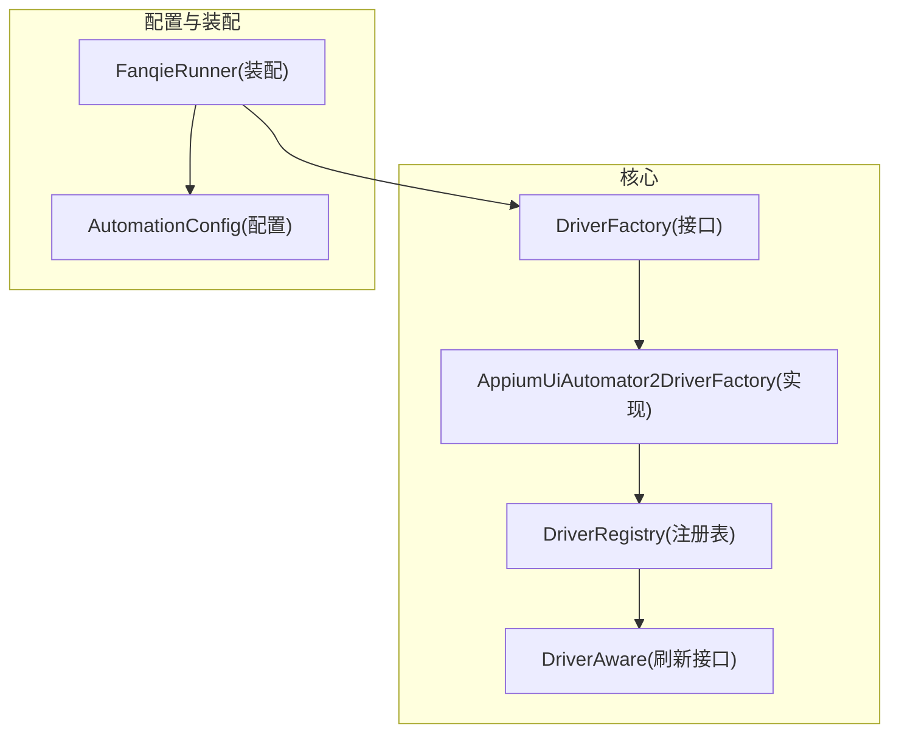
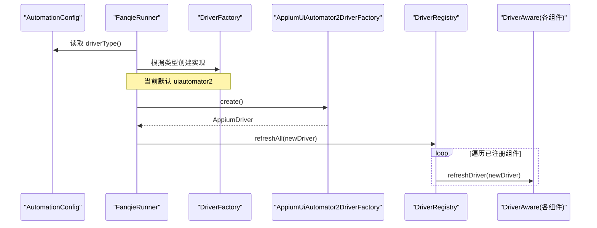
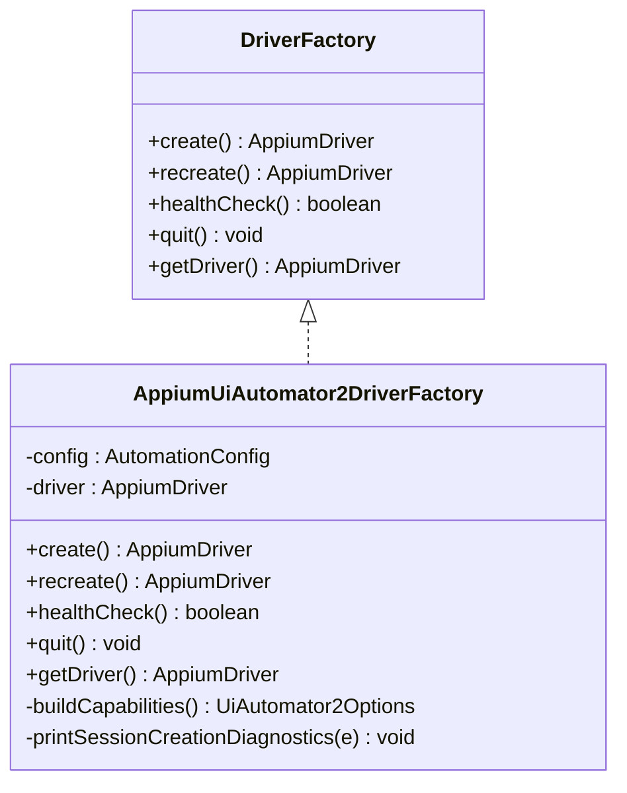
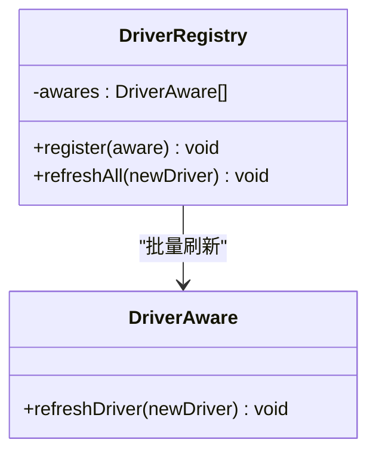
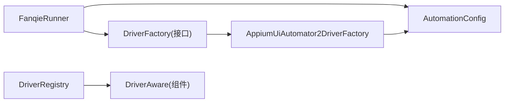

# 驱动工厂模式

<cite>
**本文引用的文件**
- [DriverFactory.java](file://automation/src/main/java/com/fanqie/auto/core/DriverFactory.java)
- [AppiumUiAutomator2DriverFactory.java](file://automation/src/main/java/com/fanqie/auto/core/AppiumUiAutomator2DriverFactory.java)
- [DriverRegistry.java](file://automation/src/main/java/com/fanqie/auto/core/DriverRegistry.java)
- [DriverAware.java](file://automation/src/main/java/com/fanqie/auto/core/DriverAware.java)
- [AutomationConfig.java](file://automation/src/main/java/com/fanqie/auto/config/AutomationConfig.java)
- [FanqieRunner.java](file://automation/src/main/java/com/fanqie/auto/FanqieRunner.java)
- [DriverRegistryTest.java](file://automation/src/test/java/com/fanqie/auto/core/DriverRegistryTest.java)
</cite>

## 目录
1. [简介](#简介)
2. [项目结构](#项目结构)
3. [核心组件](#核心组件)
4. [架构总览](#架构总览)
5. [详细组件分析](#详细组件分析)
6. [依赖关系分析](#依赖关系分析)
7. [性能考量](#性能考量)
8. [故障排查指南](#故障排查指南)
9. [结论](#结论)
10. [附录：使用示例与测试实践](#附录使用示例与测试实践)

## 简介
本文件围绕“驱动工厂模式”展开，聚焦 DriverFactory 接口的设计动机、扩展性考虑以及四个核心方法 create()、recreate()、healthCheck()、quit() 的职责与使用场景。通过“接口 + 实现”的分层抽象，系统能够以最小改动支持多平台适配（例如为鸿蒙 NEXT 新增 HdcUiTestDriverFactory），同时保持上层业务代码零感知。文档还给出在业务代码中如何获取和管理驱动实例的示例，并说明该模式在测试中的优势（Mock/Stub 的使用方式）。

## 项目结构
自动化模块的核心位于 automation/src/main/java/com/fanqie/auto/core 包下，围绕 DriverFactory 形成如下关键层次：
- 抽象层：DriverFactory 定义驱动生命周期与探活能力；DriverAware 定义“可被刷新 driver 引用”的能力。
- 实现层：AppiumUiAutomator2DriverFactory 提供标准 Appium 2 + UiAutomator2 的具体实现。
- 协调层：DriverRegistry 集中管理所有 DriverAware 组件，并在 session 重建后批量刷新引用。
- 配置层：AutomationConfig 提供运行时参数（如是否 noReset、超时等）和驱动类型选择。
- 装配层：FanqieRunner 根据配置选择具体 DriverFactory 实现，完成启动装配。

图表来源
- [DriverFactory.java:17-54](file://automation/src/main/java/com/fanqie/auto/core/DriverFactory.java#L17-L54)
- [AppiumUiAutomator2DriverFactory.java:33-118](file://automation/src/main/java/com/fanqie/auto/core/AppiumUiAutomator2DriverFactory.java#L33-L118)
- [DriverRegistry.java:19-56](file://automation/src/main/java/com/fanqie/auto/core/DriverRegistry.java#L19-L56)
- [DriverAware.java:12-20](file://automation/src/main/java/com/fanqie/auto/core/DriverAware.java#L12-L20)
- [AutomationConfig.java:166-178](file://automation/src/main/java/com/fanqie/auto/config/AutomationConfig.java#L166-L178)
- [FanqieRunner.java:250-268](file://automation/src/main/java/com/fanqie/auto/FanqieRunner.java#L250-L268)

章节来源
- [DriverFactory.java:17-54](file://automation/src/main/java/com/fanqie/auto/core/DriverFactory.java#L17-L54)
- [AppiumUiAutomator2DriverFactory.java:33-118](file://automation/src/main/java/com/fanqie/auto/core/AppiumUiAutomator2DriverFactory.java#L33-L118)
- [DriverRegistry.java:19-56](file://automation/src/main/java/com/fanqie/auto/core/DriverRegistry.java#L19-L56)
- [DriverAware.java:12-20](file://automation/src/main/java/com/fanqie/auto/core/DriverAware.java#L12-L20)
- [AutomationConfig.java:166-178](file://automation/src/main/java/com/fanqie/auto/config/AutomationConfig.java#L166-L178)
- [FanqieRunner.java:250-268](file://automation/src/main/java/com/fanqie/auto/FanqieRunner.java#L250-L268)

## 核心组件
- DriverFactory：定义驱动的生命周期与探活能力，是扩展多平台的唯一入口点。
- AppiumUiAutomator2DriverFactory：当前唯一实现，封装 Appium 2 + UiAutomator2 的创建、重建、健康检查与退出逻辑，并内置中文诊断输出。
- DriverRegistry：集中管理实现了 DriverAware 的组件，在 recreate 成功后统一刷新其内部 driver 引用，避免旧引用导致的异常。
- DriverAware：声明“可刷新 driver 引用”的契约，供需要持有 AppiumDriver 的组件实现。
- AutomationConfig：集中管理运行参数（包括驱动类型、超时、noReset 等），为工厂提供配置。
- FanqieRunner：按配置装配具体 DriverFactory 实现，屏蔽上层对实现的感知。

章节来源
- [DriverFactory.java:17-54](file://automation/src/main/java/com/fanqie/auto/core/DriverFactory.java#L17-L54)
- [AppiumUiAutomator2DriverFactory.java:33-118](file://automation/src/main/java/com/fanqie/auto/core/AppiumUiAutomator2DriverFactory.java#L33-L118)
- [DriverRegistry.java:19-56](file://automation/src/main/java/com/fanqie/auto/core/DriverRegistry.java#L19-L56)
- [DriverAware.java:12-20](file://automation/src/main/java/com/fanqie/auto/core/DriverAware.java#L12-L20)
- [AutomationConfig.java:166-178](file://automation/src/main/java/com/fanqie/auto/config/AutomationConfig.java#L166-L178)
- [FanqieRunner.java:250-268](file://automation/src/main/java/com/fanqie/auto/FanqieRunner.java#L250-L268)

## 架构总览
下图展示了从配置到驱动创建的完整流程，以及 session 重建时的刷新链路。

图表来源
- [AutomationConfig.java:166-178](file://automation/src/main/java/com/fanqie/auto/config/AutomationConfig.java#L166-L178)
- [FanqieRunner.java:250-268](file://automation/src/main/java/com/fanqie/auto/FanqieRunner.java#L250-L268)
- [AppiumUiAutomator2DriverFactory.java:44-76](file://automation/src/main/java/com/fanqie/auto/core/AppiumUiAutomator2DriverFactory.java#L44-L76)
- [DriverRegistry.java:43-55](file://automation/src/main/java/com/fanqie/auto/core/DriverRegistry.java#L43-L55)

## 详细组件分析

### DriverFactory 接口设计
- 设计理念：将“如何创建/销毁/探活驱动”的细节下沉到实现层，上层仅依赖稳定接口，便于替换不同平台实现（如未来为鸿蒙 NEXT 新增 HdcUiTestDriverFactory）。
- 四个核心方法职责：
  - create()：创建新的 Appium session，首次调用会执行完整的初始化流程（安装 UiAutomator2 Server 等）。失败时抛出运行时异常，内部已捕获并输出中文诊断。
  - recreate()：先安全退出当前 session，再重新创建，用于会话断开后的恢复，配合 noReset=true 保证书架与登录态不丢失。
  - healthCheck()：低成本探活，通过轻量命令探测当前 session 是否仍然有效，返回布尔值。
  - quit()：优雅退出当前 session，幂等设计，多次调用安全。
- 附加能力：getDriver() 暴露当前 driver 实例（可能为空）。

章节来源
- [DriverFactory.java:17-54](file://automation/src/main/java/com/fanqie/auto/core/DriverFactory.java#L17-L54)

### AppiumUiAutomator2DriverFactory 实现
- 关键设计决策：
  - 不设置 appActivity/app，改用运行时激活应用，避免权限拒绝问题。
  - 绝不卸载/清理/重置应用，noReset=true 保护用户数据。
  - 创建后立即设置隐式等待为零，确保短轮询不被阻塞。
  - 会话创建失败时输出定向中文诊断，降低排障成本。
- 能力映射：
  - create()：构建 capabilities，连接 Appium Server，创建 AndroidDriver，设置隐式等待为零。
  - recreate()：先 quit() 再 create()。
  - healthCheck()：调用轻量窗口尺寸命令探测会话有效性，捕获 NoSuchSessionException/WebDriverException。
  - quit()：关闭会话并置空内部 driver 引用，异常被记录但不中断流程。
  - getDriver()：返回当前 driver 引用。

图表来源
- [DriverFactory.java:17-54](file://automation/src/main/java/com/fanqie/auto/core/DriverFactory.java#L17-L54)
- [AppiumUiAutomator2DriverFactory.java:33-210](file://automation/src/main/java/com/fanqie/auto/core/AppiumUiAutomator2DriverFactory.java#L33-L210)

章节来源
- [AppiumUiAutomator2DriverFactory.java:33-210](file://automation/src/main/java/com/fanqie/auto/core/AppiumUiAutomator2DriverFactory.java#L33-L210)

### DriverRegistry 与 DriverAware 协作
- DriverAware：声明 refreshDriver(newDriver) 方法，供需要持有 AppiumDriver 的组件实现，以便在 session 重建后统一刷新引用。
- DriverRegistry：维护一组 DriverAware 组件，提供 register() 与 refreshAll(newDriver) 方法。refreshAll 会逐个调用组件的 refreshDriver，单个组件失败不影响其他组件。

图表来源
- [DriverAware.java:12-20](file://automation/src/main/java/com/fanqie/auto/core/DriverAware.java#L12-L20)
- [DriverRegistry.java:19-56](file://automation/src/main/java/com/fanqie/auto/core/DriverRegistry.java#L19-L56)

章节来源
- [DriverAware.java:12-20](file://automation/src/main/java/com/fanqie/auto/core/DriverAware.java#L12-L20)
- [DriverRegistry.java:19-56](file://automation/src/main/java/com/fanqie/auto/core/DriverRegistry.java#L19-L56)

### 配置与装配
- AutomationConfig.driverType()：决定装配哪个 DriverFactory 实现，当前默认 uiautomator2，预留 harmony_hdc 等未来值。
- FanqieRunner.createDriverFactory()：根据 driverType() 选择具体实现，未知值回退到 uiautomator2，保证稳定性。

章节来源
- [AutomationConfig.java:166-178](file://automation/src/main/java/com/fanqie/auto/config/AutomationConfig.java#L166-L178)
- [FanqieRunner.java:250-268](file://automation/src/main/java/com/fanqie/auto/FanqieRunner.java#L250-L268)

## 依赖关系分析
- 低耦合：上层仅依赖 DriverFactory 接口，不关心具体实现细节；新增平台只需新增实现类并更新装配逻辑。
- 高内聚：每个实现类封装自身平台相关的 capabilities 与错误诊断；DriverRegistry 专注刷新传播，职责清晰。
- 外部依赖：Appium Java Client、Selenium 异常类型；日志框架用于诊断与监控。

图表来源
- [FanqieRunner.java:250-268](file://automation/src/main/java/com/fanqie/auto/FanqieRunner.java#L250-L268)
- [AutomationConfig.java:166-178](file://automation/src/main/java/com/fanqie/auto/config/AutomationConfig.java#L166-L178)
- [AppiumUiAutomator2DriverFactory.java:33-118](file://automation/src/main/java/com/fanqie/auto/core/AppiumUiAutomator2DriverFactory.java#L33-L118)
- [DriverRegistry.java:19-56](file://automation/src/main/java/com/fanqie/auto/core/DriverRegistry.java#L19-L56)

章节来源
- [FanqieRunner.java:250-268](file://automation/src/main/java/com/fanqie/auto/FanqieRunner.java#L250-L268)
- [AutomationConfig.java:166-178](file://automation/src/main/java/com/fanqie/auto/config/AutomationConfig.java#L166-L178)
- [AppiumUiAutomator2DriverFactory.java:33-118](file://automation/src/main/java/com/fanqie/auto/core/AppiumUiAutomator2DriverFactory.java#L33-L118)
- [DriverRegistry.java:19-56](file://automation/src/main/java/com/fanqie/auto/core/DriverRegistry.java#L19-L56)

## 性能考量
- 隐式等待归零：创建 driver 后立即设置隐式等待为零，避免未命中查找阻塞长轮询，保障 250ms 短轮询节奏。
- 心跳保活：通过 healthCheck() 定期探测会话有效性，结合较长的 newCommandTimeout 减少因静默期断连的概率。
- 跳过不必要初始化：skipServerInstallation/skipDeviceInitialization 可在首轮成功后加速后续启动。
- 批量刷新：DriverRegistry.refreshAll() 一次性刷新所有组件，减少重复操作与潜在竞态。

[本节为通用性能讨论，不直接分析具体文件]

## 故障排查指南
- 会话创建失败：AppiumUiAutomator2DriverFactory 会在异常路径输出结构化中文诊断，覆盖常见华为/鸿蒙设备问题（ADB 调试、授权弹窗、Appium Server 状态等）。
- 会话断开：通过 healthCheck() 检测无效会话，上层可触发 recreate() 恢复。
- 组件刷新失败：DriverRegistry 对单个组件刷新异常进行隔离，不影响其他组件刷新。

章节来源
- [AppiumUiAutomator2DriverFactory.java:180-208](file://automation/src/main/java/com/fanqie/auto/core/AppiumUiAutomator2DriverFactory.java#L180-L208)
- [DriverRegistry.java:43-55](file://automation/src/main/java/com/fanqie/auto/core/DriverRegistry.java#L43-L55)

## 结论
DriverFactory 通过“接口 + 实现”的分层抽象，将驱动创建、重建、探活与退出的复杂细节封装在实现层，使上层业务代码无需关心底层平台差异。配合 DriverRegistry 与 DriverAware，系统在 session 重建时能安全、一致地刷新所有组件的 driver 引用。当前实现基于 Appium 2 + UiAutomator2，同时为鸿蒙 NEXT 等未来平台预留了扩展点，仅需新增实现类并调整装配逻辑即可无缝切换，真正达成“上层零感知”的目标。

[本节为总结性内容，不直接分析具体文件]

## 附录：使用示例与测试实践

### 在业务代码中使用工厂获取与管理驱动实例
- 装配阶段：由 FanqieRunner 根据 AutomationConfig.driverType() 选择具体 DriverFactory 实现，注入到上层组件。
- 会话生命周期：
  - 首次启动调用 create() 建立会话。
  - 运行过程中周期性调用 healthCheck() 探活，若失败则调用 recreate() 恢复。
  - 任务结束或异常退出时调用 quit() 释放资源。
- 组件刷新：在 recreate() 成功后，通过 DriverRegistry.refreshAll(newDriver) 将新 driver 引用广播给所有 DriverAware 组件。

章节来源
- [FanqieRunner.java:250-268](file://automation/src/main/java/com/fanqie/auto/FanqieRunner.java#L250-L268)
- [AppiumUiAutomator2DriverFactory.java:44-118](file://automation/src/main/java/com/fanqie/auto/core/AppiumUiAutomator2DriverFactory.java#L44-L118)
- [DriverRegistry.java:43-55](file://automation/src/main/java/com/fanqie/auto/core/DriverRegistry.java#L43-L55)

### 多平台适配（以鸿蒙 NEXT 为例）
- 新增实现：新增 HdcUiTestDriverFactory 实现 DriverFactory 接口，封装基于 HDC 的驱动创建与探活逻辑。
- 装配变更：在 FanqieRunner.createDriverFactory() 中增加 case "harmony_hdc"，由 AutomationConfig.driverType() 控制切换。
- 上层零感知：StateDetector / PageState / LocatorRegistry / AdWatchStateMachine / RunLogger 等五层完全复用，无需修改。

章节来源
- [AutomationConfig.java:166-178](file://automation/src/main/java/com/fanqie/auto/config/AutomationConfig.java#L166-L178)
- [FanqieRunner.java:250-268](file://automation/src/main/java/com/fanqie/auto/FanqieRunner.java#L250-L268)

### 测试中的优势：Mock 与 Stub
- 解耦真实设备：测试中可通过 Mock 或 Stub 实现 DriverFactory，避免连接真机与启动 Appium，提升测试速度与稳定性。
- 验证刷新一致性：DriverRegistryTest 通过自定义 DriverAware 替身，验证 refreshAll 正确回调且异常隔离。
- 典型做法：
  - 使用 Stub 模拟 create()/recreate()/healthCheck()/quit() 的行为，返回可控结果。
  - 使用 Mock 验证方法调用次数与顺序，确保业务流程符合预期。
  - 针对 DriverAware 的刷新逻辑，构造多个组件并验证刷新传播的正确性与健壮性。

章节来源
- [DriverRegistryTest.java:1-143](file://automation/src/test/java/com/fanqie/auto/core/DriverRegistryTest.java#L1-L143)