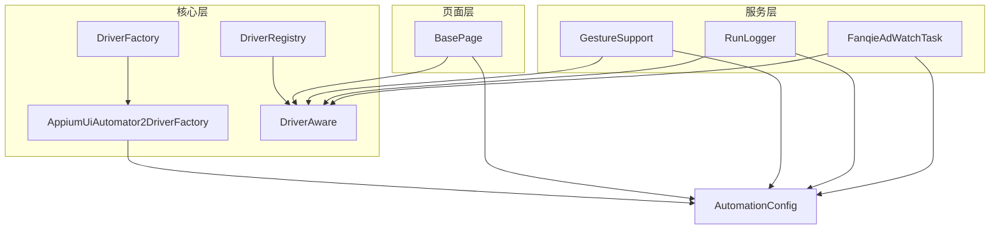
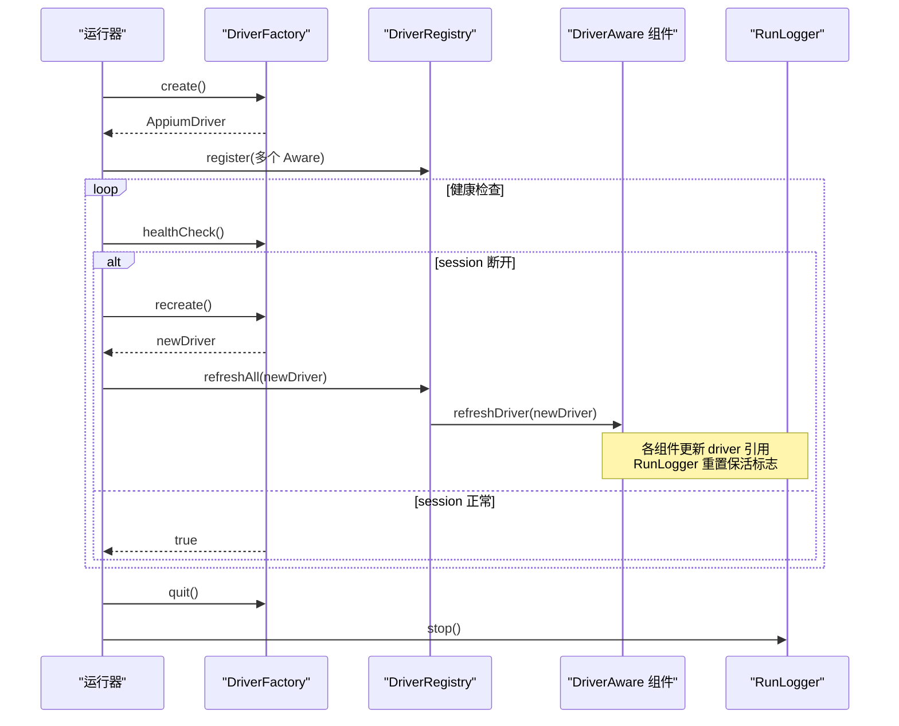
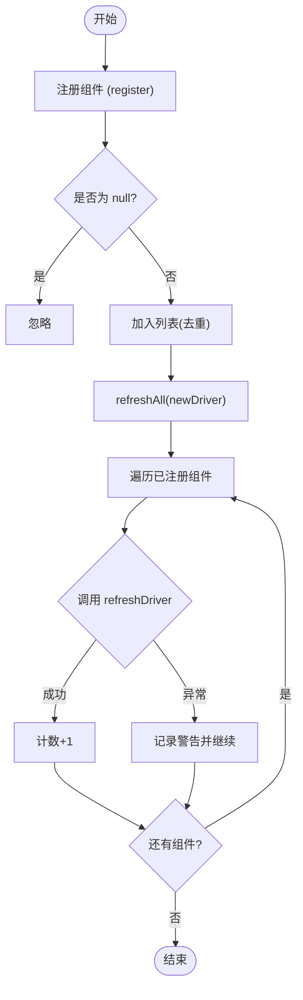
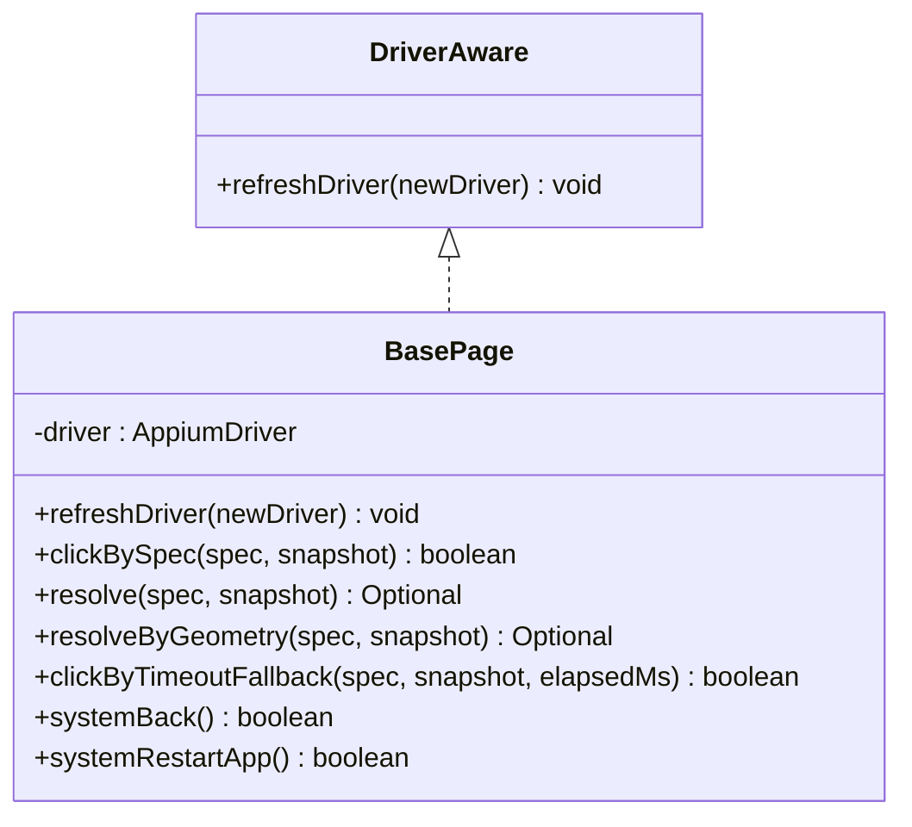
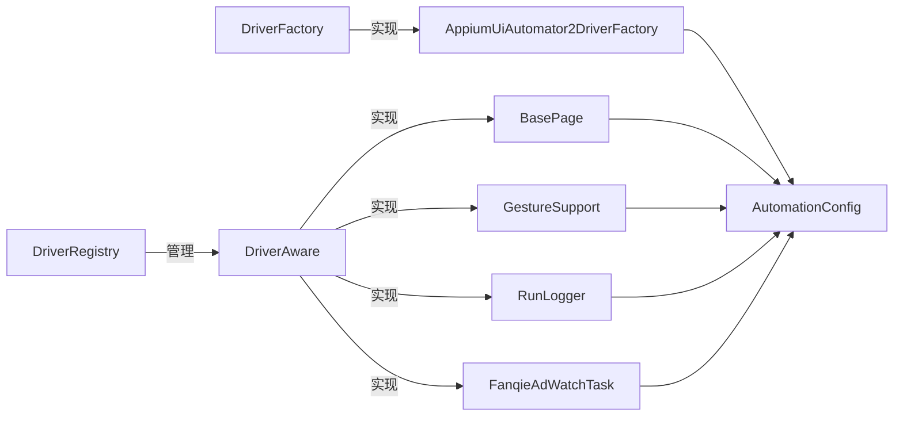

# 驱动感知接口

<cite>
**本文引用的文件**
- [DriverAware.java](file://automation/src/main/java/com/fanqie/auto/core/DriverAware.java)
- [DriverRegistry.java](file://automation/src/main/java/com/fanqie/auto/core/DriverRegistry.java)
- [DriverFactory.java](file://automation/src/main/java/com/fanqie/auto/core/DriverFactory.java)
- [AppiumUiAutomator2DriverFactory.java](file://automation/src/main/java/com/fanqie/auto/core/AppiumUiAutomator2DriverFactory.java)
- [BasePage.java](file://automation/src/main/java/com/fanqie/auto/page/BasePage.java)
- [GestureSupport.java](file://automation/src/main/java/com/fanqie/auto/core/GestureSupport.java)
- [RunLogger.java](file://automation/src/main/java/com/fanqie/auto/core/RunLogger.java)
- [FanqieAdWatchTask.java](file://automation/src/main/java/com/fanqie/auto/task/FanqieAdWatchTask.java)
- [AutomationConfig.java](file://automation/src/main/java/com/fanqie/auto/config/AutomationConfig.java)
- [DriverRegistryTest.java](file://automation/src/test/java/com/fanqie/auto/core/DriverRegistryTest.java)
</cite>

## 目录
1. [简介](#简介)
2. [项目结构](#项目结构)
3. [核心组件](#核心组件)
4. [架构总览](#架构总览)
5. [详细组件分析](#详细组件分析)
6. [依赖关系分析](#依赖关系分析)
7. [性能考量](#性能考量)
8. [故障排查指南](#故障排查指南)
9. [结论](#结论)
10. [附录：实现示例与最佳实践](#附录实现示例与最佳实践)

## 简介
本文件围绕 DriverAware 接口及其在自动化框架中的“驱动感知”设计模式展开，系统性说明：
- 刷新机制：session 重建后如何统一、安全地更新各组件持有的 driver 引用，避免 NoSuchSessionException。
- 解耦方式：通过接口 + 注册表将“驱动生命周期管理”与“业务组件”解耦。
- 生命周期：初始化、更新（refreshDriver）、清理（quit）的完整流程。
- 多线程安全：CopyOnWriteArrayList、volatile、原子变量等保障并发安全。
- 实现示例：页面组件与服务如何接入 DriverAware，以及测试验证要点。

## 项目结构
该自动化工程采用分层组织：
- core：驱动工厂、驱动注册表、通用能力（手势、等待、日志、快照等）。
- page：页面对象基类与具体页面，承载定位与点击策略。
- task：任务编排与状态机，串联业务流程。
- config：全局配置加载器。
- test：单元测试覆盖关键路径，如 DriverRegistry 的刷新一致性。

图表来源
- [DriverFactory.java:17-54](file://automation/src/main/java/com/fanqie/auto/core/DriverFactory.java#L17-L54)
- [AppiumUiAutomator2DriverFactory.java:33-118](file://automation/src/main/java/com/fanqie/auto/core/AppiumUiAutomator2DriverFactory.java#L33-L118)
- [DriverRegistry.java:19-56](file://automation/src/main/java/com/fanqie/auto/core/DriverRegistry.java#L19-L56)
- [DriverAware.java:12-20](file://automation/src/main/java/com/fanqie/auto/core/DriverAware.java#L12-L20)
- [BasePage.java:40-73](file://automation/src/main/java/com/fanqie/auto/page/BasePage.java#L40-L73)
- [GestureSupport.java:26-50](file://automation/src/main/java/com/fanqie/auto/core/GestureSupport.java#L26-L50)
- [RunLogger.java:46-142](file://automation/src/main/java/com/fanqie/auto/core/RunLogger.java#L46-L142)
- [FanqieAdWatchTask.java:42-86](file://automation/src/main/java/com/fanqie/auto/task/FanqieAdWatchTask.java#L42-L86)
- [AutomationConfig.java:166-178](file://automation/src/main/java/com/fanqie/auto/config/AutomationConfig.java#L166-L178)

章节来源
- [DriverAware.java:12-20](file://automation/src/main/java/com/fanqie/auto/core/DriverAware.java#L12-L20)
- [DriverRegistry.java:19-56](file://automation/src/main/java/com/fanqie/auto/core/DriverRegistry.java#L19-L56)
- [DriverFactory.java:17-54](file://automation/src/main/java/com/fanqie/auto/core/DriverFactory.java#L17-L54)
- [AppiumUiAutomator2DriverFactory.java:33-118](file://automation/src/main/java/com/fanqie/auto/core/AppiumUiAutomator2DriverFactory.java#L33-L118)
- [BasePage.java:40-73](file://automation/src/main/java/com/fanqie/auto/page/BasePage.java#L40-L73)
- [GestureSupport.java:26-50](file://automation/src/main/java/com/fanqie/auto/core/GestureSupport.java#L26-L50)
- [RunLogger.java:46-142](file://automation/src/main/java/com/fanqie/auto/core/RunLogger.java#L46-L142)
- [FanqieAdWatchTask.java:42-86](file://automation/src/main/java/com/fanqie/auto/task/FanqieAdWatchTask.java#L42-L86)
- [AutomationConfig.java:166-178](file://automation/src/main/java/com/fanqie/auto/config/AutomationConfig.java#L166-L178)

## 核心组件
- DriverAware：定义 refreshDriver(newDriver) 回调契约，所有持有 AppiumDriver 字段的组件都应实现，以便在 session 重建后统一刷新引用。
- DriverRegistry：集中管理实现了 DriverAware 的组件集合，提供 register 与 refreshAll，确保批量、线程安全地传播新 driver 引用。
- DriverFactory：抽象驱动创建/重建/健康检查/退出的唯一入口；当前实现为 AppiumUiAutomator2DriverFactory。
- BasePage：页面对象基类，实现 DriverAware，刷新内部 driver 引用，并封装四级定位与点击策略。
- GestureSupport：手势操作封装，实现 DriverAware，刷新时失效屏幕尺寸缓存，避免横屏/旋转导致比例坐标失真。
- RunLogger：运行日志与保活心跳，实现 DriverAware，session 重建后重置保活标志，保证后续心跳继续工作。
- FanqieAdWatchTask：业务编排任务，实现 DriverAware，刷新自身持有的 driver 引用以维持任务执行。

章节来源
- [DriverAware.java:12-20](file://automation/src/main/java/com/fanqie/auto/core/DriverAware.java#L12-L20)
- [DriverRegistry.java:19-56](file://automation/src/main/java/com/fanqie/auto/core/DriverRegistry.java#L19-L56)
- [DriverFactory.java:17-54](file://automation/src/main/java/com/fanqie/auto/core/DriverFactory.java#L17-L54)
- [BasePage.java:40-73](file://automation/src/main/java/com/fanqie/auto/page/BasePage.java#L40-L73)
- [GestureSupport.java:26-50](file://automation/src/main/java/com/fanqie/auto/core/GestureSupport.java#L26-L50)
- [RunLogger.java:46-142](file://automation/src/main/java/com/fanqie/auto/core/RunLogger.java#L46-L142)
- [FanqieAdWatchTask.java:42-86](file://automation/src/main/java/com/fanqie/auto/task/FanqieAdWatchTask.java#L42-L86)

## 架构总览
DriverAware 的核心价值在于“驱动生命周期与业务逻辑解耦”。整体流程如下：
- 创建阶段：DriverFactory.create() 创建 Appium session，返回 driver。
- 注册阶段：各组件（BasePage、GestureSupport、RunLogger、FanqieAdWatchTask 等）实现 DriverAware 并注册到 DriverRegistry。
- 使用阶段：业务逻辑通过各组件方法间接使用 driver。
- 健康检查：DriverFactory.healthCheck() 定期探测 session 是否有效。
- 重建阶段：当 healthCheck 失败或需要恢复时，DriverFactory.recreate() 销毁旧 session 并创建新 session。
- 刷新阶段：recreate 成功后，调用 DriverRegistry.refreshAll(newDriver)，批量通知所有 DriverAware 组件更新其 driver 引用。
- 退出阶段：DriverFactory.quit() 优雅关闭 session，RunLogger.stop() 停止心跳并输出统计。

图表来源
- [DriverFactory.java:17-54](file://automation/src/main/java/com/fanqie/auto/core/DriverFactory.java#L17-L54)
- [AppiumUiAutomator2DriverFactory.java:44-118](file://automation/src/main/java/com/fanqie/auto/core/AppiumUiAutomator2DriverFactory.java#L44-L118)
- [DriverRegistry.java:19-56](file://automation/src/main/java/com/fanqie/auto/core/DriverRegistry.java#L19-L56)
- [RunLogger.java:132-142](file://automation/src/main/java/com/fanqie/auto/core/RunLogger.java#L132-L142)

## 详细组件分析

### DriverAware 接口与刷新契约
- 职责：定义 refreshDriver(AppiumDriver) 回调，用于 session 重建后统一更新组件内部的 driver 引用。
- 设计动机：避免直接持有旧 driver 导致的 NoSuchSessionException；通过接口约束，使上层无需关心具体刷新细节。
- 关键点：newDriver 不应为 null；实现应幂等且健壮，避免异常扩散。

章节来源
- [DriverAware.java:12-20](file://automation/src/main/java/com/fanqie/auto/core/DriverAware.java#L12-L20)

### DriverRegistry 注册表与批量刷新
- 职责：维护 DriverAware 列表，提供 register 与 refreshAll。
- 线程安全：内部使用 CopyOnWriteArrayList，保证注册与遍历的并发安全。
- 容错：单个组件刷新失败不影响其余组件（try-catch 隔离），并记录成功数。
- 去重：register(null) 安全忽略，重复注册同一实例只保留一份。

图表来源
- [DriverRegistry.java:23-56](file://automation/src/main/java/com/fanqie/auto/core/DriverRegistry.java#L23-L56)

章节来源
- [DriverRegistry.java:19-56](file://automation/src/main/java/com/fanqie/auto/core/DriverRegistry.java#L19-L56)
- [DriverRegistryTest.java:45-141](file://automation/src/test/java/com/fanqie/auto/core/DriverRegistryTest.java#L45-L141)

### DriverFactory 与 Appium 会话管理
- 职责：唯一负责创建/销毁/重建 Appium session，并提供健康检查与获取当前 driver。
- 关键决策：
  - 不设置 appActivity/app，改用运行时 mobile: activateApp 激活应用，避免权限拒绝。
  - 创建后立即设置 implicitlyWait=0，避免隐式等待破坏短轮询设计。
  - noReset=true 保护用户数据与登录态。
  - 健康检查使用轻量命令（getWindowSize），捕获 NoSuchSessionException/InvalidSessionIdException。
- 重建流程：recreate() 先 quit() 再 create()，确保资源释放与新 session 建立。

章节来源
- [DriverFactory.java:17-54](file://automation/src/main/java/com/fanqie/auto/core/DriverFactory.java#L17-L54)
- [AppiumUiAutomator2DriverFactory.java:44-118](file://automation/src/main/java/com/fanqie/auto/core/AppiumUiAutomator2DriverFactory.java#L44-L118)

### BasePage 页面基类与 DriverAware 集成
- 职责：实现 DriverAware，刷新内部 driver 引用；封装四级定位与点击策略（语义匹配、几何推断、时序兜底、系统兜底）。
- 刷新行为：refreshDriver(newDriver) 仅在新 driver 非空时替换内部 driver。
- 定位策略：
  - L1：text/content-desc/resource-id 三通道匹配，结合 boundsHint 裁决。
  - L2：结构化几何推断，受 allowGeometryFallback 约束，防止误点。
  - L3：时序兜底，达到阈值后强制执行 L2。
  - L4：系统 back() 或重启 App。

图表来源
- [DriverAware.java:12-20](file://automation/src/main/java/com/fanqie/auto/core/DriverAware.java#L12-L20)
- [BasePage.java:40-73](file://automation/src/main/java/com/fanqie/auto/page/BasePage.java#L40-L73)

章节来源
- [BasePage.java:40-73](file://automation/src/main/java/com/fanqie/auto/page/BasePage.java#L40-L73)

### GestureSupport 手势支持与会话刷新
- 职责：封装手势操作（点击、滑动、翻页、应用启停），实现 DriverAware。
- 刷新行为：refreshDriver(newDriver) 更新 driver 并失效屏幕尺寸缓存，避免横屏/旋转导致比例坐标失真。
- 关键设计：
  - 所有坐标由运行时屏幕尺寸按比例计算，不写死绝对像素。
  - 使用 mobile: clickGesture/swipeGesture 提升稳定性。
  - 应用启停使用 mobile: activateApp/terminateApp，避免硬编码 Activity。

章节来源
- [GestureSupport.java:26-50](file://automation/src/main/java/com/fanqie/auto/core/GestureSupport.java#L26-L50)
- [GestureSupport.java:56-67](file://automation/src/main/java/com/fanqie/auto/core/GestureSupport.java#L56-L67)
- [GestureSupport.java:106-123](file://automation/src/main/java/com/fanqie/auto/core/GestureSupport.java#L106-L123)
- [GestureSupport.java:167-178](file://automation/src/main/java/com/fanqie/auto/core/GestureSupport.java#L167-L178)
- [GestureSupport.java:189-226](file://automation/src/main/java/com/fanqie/auto/core/GestureSupport.java#L189-L226)

### RunLogger 日志与心跳保活
- 职责：运行日志落盘、截图与 XML 快照保存、心跳保活调度、最终统计输出。
- 刷新行为：refreshDriver(newDriver) 更新 driver 并重置 sessionAlive 标志，确保心跳继续工作。
- 心跳机制：独立 daemon 线程每 heartbeat.interval.sec 秒执行轻量保活（getWindowSize），捕获异常并标记 session 断开。
- 生命周期：start() 启动心跳，stop() 停止心跳并输出统计，幂等安全。

章节来源
- [RunLogger.java:46-142](file://automation/src/main/java/com/fanqie/auto/core/RunLogger.java#L46-L142)
- [RunLogger.java:150-197](file://automation/src/main/java/com/fanqie/auto/core/RunLogger.java#L150-L197)
- [RunLogger.java:239-261](file://automation/src/main/java/com/fanqie/auto/core/RunLogger.java#L239-L261)
- [RunLogger.java:284-345](file://automation/src/main/java/com/fanqie/auto/core/RunLogger.java#L284-L345)

### FanqieAdWatchTask 任务编排与 DriverAware 集成
- 职责：业务编排任务，实现 DriverAware，刷新自身持有的 driver 引用。
- 流程：启动 App → 导航书架 → 打开书籍 → 翻页循环 → 广告子循环 → 收尾统计。
- 刷新行为：refreshDriver(newDriver) 更新 driver，确保任务在 session 重建后继续执行。

章节来源
- [FanqieAdWatchTask.java:42-86](file://automation/src/main/java/com/fanqie/auto/task/FanqieAdWatchTask.java#L42-L86)
- [FanqieAdWatchTask.java:99-314](file://automation/src/main/java/com/fanqie/auto/task/FanqieAdWatchTask.java#L99-L314)

## 依赖关系分析
- DriverAware 被多个组件实现，形成松耦合的刷新契约。
- DriverRegistry 作为中心协调者，依赖 DriverAware 列表进行批量刷新。
- DriverFactory 与 AppiumUiAutomator2DriverFactory 负责驱动生命周期，与配置 AutomationConfig 紧密耦合。
- BasePage、GestureSupport、RunLogger、FanqieAdWatchTask 均依赖 AutomationConfig 获取超时、策略等参数。

图表来源
- [DriverAware.java:12-20](file://automation/src/main/java/com/fanqie/auto/core/DriverAware.java#L12-L20)
- [BasePage.java:40-73](file://automation/src/main/java/com/fanqie/auto/page/BasePage.java#L40-L73)
- [GestureSupport.java:26-50](file://automation/src/main/java/com/fanqie/auto/core/GestureSupport.java#L26-L50)
- [RunLogger.java:46-142](file://automation/src/main/java/com/fanqie/auto/core/RunLogger.java#L46-L142)
- [FanqieAdWatchTask.java:42-86](file://automation/src/main/java/com/fanqie/auto/task/FanqieAdWatchTask.java#L42-L86)
- [DriverFactory.java:17-54](file://automation/src/main/java/com/fanqie/auto/core/DriverFactory.java#L17-L54)
- [AppiumUiAutomator2DriverFactory.java:33-118](file://automation/src/main/java/com/fanqie/auto/core/AppiumUiAutomator2DriverFactory.java#L33-L118)
- [AutomationConfig.java:166-178](file://automation/src/main/java/com/fanqie/auto/config/AutomationConfig.java#L166-L178)

章节来源
- [DriverRegistry.java:19-56](file://automation/src/main/java/com/fanqie/auto/core/DriverRegistry.java#L19-L56)
- [DriverFactory.java:17-54](file://automation/src/main/java/com/fanqie/auto/core/DriverFactory.java#L17-L54)
- [AppiumUiAutomator2DriverFactory.java:33-118](file://automation/src/main/java/com/fanqie/auto/core/AppiumUiAutomator2DriverFactory.java#L33-L118)
- [AutomationConfig.java:166-178](file://automation/src/main/java/com/fanqie/auto/config/AutomationConfig.java#L166-L178)

## 性能考量
- 短轮询友好：DriverFactory 创建后立即设置 implicitlyWait=0，避免隐式等待阻塞。
- 轻量健康检查：使用 getWindowSize() 作为心跳，降低开销。
- 屏幕尺寸缓存：GestureSupport 缓存屏幕尺寸，减少 RPC 次数；刷新时失效缓存，避免横屏/旋转导致失真。
- 批量刷新隔离：DriverRegistry.refreshAll 对每个组件 try-catch 隔离异常，避免单点失败影响整体。
- 幂等退出：DriverFactory.quit() 与 RunLogger.stop() 均为幂等，防止重复调用引发异常。

[本节为通用性能讨论，不直接分析具体文件]

## 故障排查指南
- Session 创建失败：查看 AppiumUiAutomator2DriverFactory.printSessionCreationDiagnostics 输出的诊断信息，逐项排查设备连接、ADB 授权、Appium Server 状态等。
- Session 断开：DriverFactory.healthCheck() 捕获 NoSuchSessionException/InvalidSessionIdException，触发 recreate 流程；RunLogger 心跳线程捕获异常并标记 sessionAlive=false。
- 刷新失败：DriverRegistry.refreshAll 记录警告日志，确认具体组件实现是否正确处理 null 与异常。
- 屏幕坐标异常：检查 GestureSupport 是否在 refreshDriver 中失效了屏幕尺寸缓存。
- 任务中断：确认 FanqieAdWatchTask.refreshDriver 是否更新了 driver 引用，确保任务继续执行。

章节来源
- [AppiumUiAutomator2DriverFactory.java:184-208](file://automation/src/main/java/com/fanqie/auto/core/AppiumUiAutomator2DriverFactory.java#L184-L208)
- [DriverFactory.java:85-100](file://automation/src/main/java/com/fanqie/auto/core/DriverFactory.java#L85-L100)
- [RunLogger.java:162-197](file://automation/src/main/java/com/fanqie/auto/core/RunLogger.java#L162-L197)
- [DriverRegistry.java:43-56](file://automation/src/main/java/com/fanqie/auto/core/DriverRegistry.java#L43-L56)
- [GestureSupport.java:41-50](file://automation/src/main/java/com/fanqie/auto/core/GestureSupport.java#L41-L50)
- [FanqieAdWatchTask.java:83-86](file://automation/src/main/java/com/fanqie/auto/task/FanqieAdWatchTask.java#L83-L86)

## 结论
DriverAware 接口通过统一的刷新契约，将驱动生命周期管理与业务组件解耦，配合 DriverRegistry 的批量刷新机制，确保了 session 重建后的引用一致性与系统稳定性。结合 DriverFactory 的健康检查与重建流程，以及 RunLogger 的心跳保活，整个系统在长任务场景下具备高鲁棒性。实现上遵循幂等、容错、线程安全的最佳实践，便于扩展与维护。

[本节为总结性内容，不直接分析具体文件]

## 附录：实现示例与最佳实践

### 如何实现一个可感知的页面组件或服务
- 步骤 1：实现 DriverAware 接口，提供 refreshDriver(newDriver) 方法，更新内部 driver 引用。
- 步骤 2：在构造或初始化时，将自身注册到 DriverRegistry.register(this)。
- 步骤 3：在业务逻辑中使用 driver 时，确保通过 DriverAware 刷新后的新引用。
- 步骤 4：在组件内部做好异常处理，避免刷新过程抛出未捕获异常。

章节来源
- [DriverAware.java:12-20](file://automation/src/main/java/com/fanqie/auto/core/DriverAware.java#L12-L20)
- [DriverRegistry.java:25-35](file://automation/src/main/java/com/fanqie/auto/core/DriverRegistry.java#L25-L35)
- [BasePage.java:40-73](file://automation/src/main/java/com/fanqie/auto/page/BasePage.java#L40-L73)
- [GestureSupport.java:26-50](file://automation/src/main/java/com/fanqie/auto/core/GestureSupport.java#L26-L50)
- [RunLogger.java:46-142](file://automation/src/main/java/com/fanqie/auto/core/RunLogger.java#L46-L142)
- [FanqieAdWatchTask.java:42-86](file://automation/src/main/java/com/fanqie/auto/task/FanqieAdWatchTask.java#L42-L86)

### 多线程环境下的安全考虑与最佳实践
- 使用 volatile 修饰 driver 引用，确保多线程可见性（BasePage、GestureSupport、RunLogger、FanqieAdWatchTask）。
- DriverRegistry 使用 CopyOnWriteArrayList，保证注册与遍历的并发安全。
- RunLogger 使用原子变量（AtomicInteger、AtomicLong、AtomicBoolean）管理计数器与状态，避免竞态条件。
- 心跳线程内部捕获所有异常，防止异常杀死调度线程。
- 幂等操作：DriverFactory.quit() 与 RunLogger.stop() 支持多次调用，避免重复清理引发异常。

章节来源
- [BasePage.java:55-73](file://automation/src/main/java/com/fanqie/auto/page/BasePage.java#L55-L73)
- [GestureSupport.java:30-50](file://automation/src/main/java/com/fanqie/auto/core/GestureSupport.java#L30-L50)
- [RunLogger.java:54-85](file://automation/src/main/java/com/fanqie/auto/core/RunLogger.java#L54-L85)
- [FanqieAdWatchTask.java:46-86](file://automation/src/main/java/com/fanqie/auto/task/FanqieAdWatchTask.java#L46-L86)
- [DriverRegistry.java:23-56](file://automation/src/main/java/com/fanqie/auto/core/DriverRegistry.java#L23-L56)

### 测试验证要点
- DriverRegistryTest 验证：
  - refreshAll 后每个已注册组件都恰好收到一次刷新回调。
  - refreshDriver 入参与 refreshAll 入参为同一引用。
  - register(null) 安全忽略。
  - 重复注册同一实例只保留一份。
  - 单个组件刷新抛异常不影响其余组件。
  - 空注册表 refreshAll 不抛异常。
  - 多组件批量注册后刷新，收集到的调用记录数与注册数一致。

章节来源
- [DriverRegistryTest.java:45-141](file://automation/src/test/java/com/fanqie/auto/core/DriverRegistryTest.java#L45-L141)