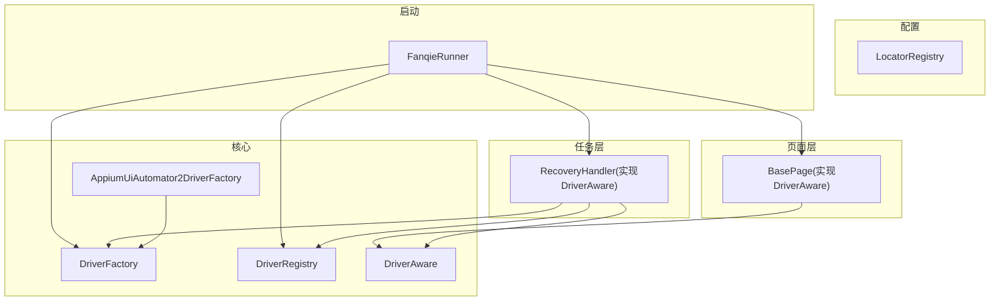
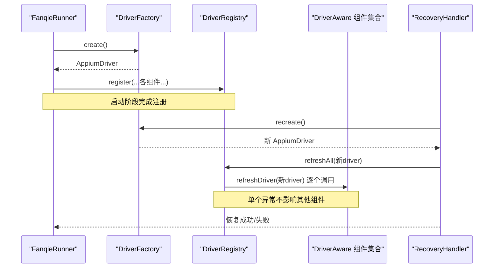
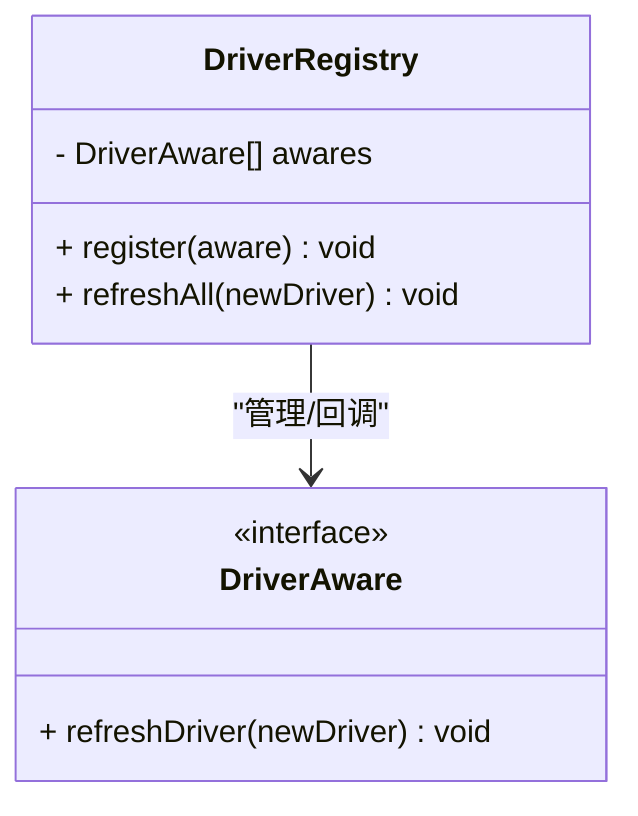
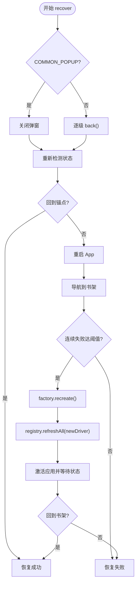
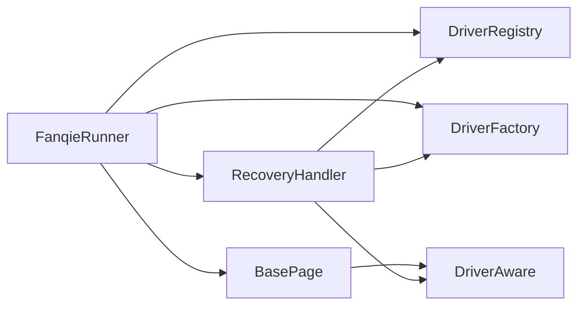

# 驱动注册表

<cite>
**本文引用的文件**
- [DriverRegistry.java](file://automation/src/main/java/com/fanqie/auto/core/DriverRegistry.java)
- [DriverAware.java](file://automation/src/main/java/com/fanqie/auto/core/DriverAware.java)
- [DriverFactory.java](file://automation/src/main/java/com/fanqie/auto/core/DriverFactory.java)
- [AppiumUiAutomator2DriverFactory.java](file://automation/src/main/java/com/fanqie/auto/core/AppiumUiAutomator2DriverFactory.java)
- [BasePage.java](file://automation/src/main/java/com/fanqie/auto/page/BasePage.java)
- [RecoveryHandler.java](file://automation/src/main/java/com/fanqie/auto/task/RecoveryHandler.java)
- [FanqieRunner.java](file://automation/src/main/java/com/fanqie/auto/FanqieRunner.java)
- [WaitSupport.java](file://automation/src/main/java/com/fanqie/auto/core/WaitSupport.java)
- [StateDetector.java](file://automation/src/main/java/com/fanqie/auto/core/StateDetector.java)
- [LocatorRegistry.java](file://automation/src/main/java/com/fanqie/auto/config/LocatorRegistry.java)
- [DriverRegistryTest.java](file://automation/src/test/java/com/fanqie/auto/core/DriverRegistryTest.java)
</cite>

## 目录
1. [简介](#简介)
2. [项目结构](#项目结构)
3. [核心组件](#核心组件)
4. [架构总览](#架构总览)
5. [详细组件分析](#详细组件分析)
6. [依赖关系分析](#依赖关系分析)
7. [性能与并发特性](#性能与并发特性)
8. [故障排查指南](#故障排查指南)
9. [结论](#结论)
10. [附录：使用示例](#附录使用示例)

## 简介
本文件围绕“驱动注册表”模式，系统性说明如何在自动化测试中统一管理多个 DriverAware 组件的生命周期，确保在 Appium session 重建后所有持有 driver 引用的一致性与线程安全。重点包括：
- DriverRegistry 如何集中管理实现了 DriverAware 的组件
- 驱动的注册、查找（遍历）与销毁机制
- 线程安全与并发访问控制策略
- 与工厂模式的协作关系（DriverFactory）
- 复杂应用中多驱动实例的管理方式
- 实际使用示例与最佳实践

## 项目结构
该自动化工程采用分层组织：
- core：核心能力（DriverFactory、DriverRegistry、DriverAware、状态检测、等待支持等）
- page：页面对象（继承 BasePage，实现 DriverAware）
- task：任务编排与自愈（RecoveryHandler、状态机等）
- config：定位器与配置（LocatorRegistry、AutomationConfig）
- 启动入口：FanqieRunner 负责装配与生命周期管理

图表来源
- [FanqieRunner.java:147-201](file://automation/src/main/java/com/fanqie/auto/FanqieRunner.java#L147-L201)
- [RecoveryHandler.java:44-81](file://automation/src/main/java/com/fanqie/auto/task/RecoveryHandler.java#L44-L81)
- [BasePage.java:40-73](file://automation/src/main/java/com/fanqie/auto/page/BasePage.java#L40-L73)
- [DriverFactory.java:17-54](file://automation/src/main/java/com/fanqie/auto/core/DriverFactory.java#L17-L54)
- [AppiumUiAutomator2DriverFactory.java:33-118](file://automation/src/main/java/com/fanqie/auto/core/AppiumUiAutomator2DriverFactory.java#L33-L118)

章节来源
- [FanqieRunner.java:147-201](file://automation/src/main/java/com/fanqie/auto/FanqieRunner.java#L147-L201)
- [DriverFactory.java:17-54](file://automation/src/main/java/com/fanqie/auto/core/DriverFactory.java#L17-L54)
- [AppiumUiAutomator2DriverFactory.java:33-118](file://automation/src/main/java/com/fanqie/auto/core/AppiumUiAutomator2DriverFactory.java#L33-L118)

## 核心组件
- DriverAware：定义刷新接口，所有持有 AppiumDriver 的组件都应实现它，以便在 session 重建时统一更新引用。
- DriverRegistry：维护 DriverAware 集合，提供注册与批量刷新能力；内部使用 CopyOnWriteArrayList 保证并发安全。
- DriverFactory：抽象驱动创建/重建/健康检查/退出；当前实现为 AppiumUiAutomator2DriverFactory。
- RecoveryHandler：自愈处理器，在连续失败达到阈值时触发 session 重建，并通过 DriverRegistry 刷新所有组件。
- BasePage：页面对象基类，实现 DriverAware，刷新自身持有的 driver 引用。
- FanqieRunner：应用启动装配点，创建并注册所有 DriverAware 组件到 DriverRegistry。

章节来源
- [DriverAware.java:12-20](file://automation/src/main/java/com/fanqie/auto/core/DriverAware.java#L12-L20)
- [DriverRegistry.java:19-56](file://automation/src/main/java/com/fanqie/auto/core/DriverRegistry.java#L19-L56)
- [DriverFactory.java:17-54](file://automation/src/main/java/com/fanqie/auto/core/DriverFactory.java#L17-L54)
- [AppiumUiAutomator2DriverFactory.java:33-118](file://automation/src/main/java/com/fanqie/auto/core/AppiumUiAutomator2DriverFactory.java#L33-L118)
- [BasePage.java:40-73](file://automation/src/main/java/com/fanqie/auto/page/BasePage.java#L40-L73)
- [RecoveryHandler.java:44-81](file://automation/src/main/java/com/fanqie/auto/task/RecoveryHandler.java#L44-L81)
- [FanqieRunner.java:147-201](file://automation/src/main/java/com/fanqie/auto/FanqieRunner.java#L147-L201)

## 架构总览
驱动注册表模式将“驱动生命周期管理”与“业务组件”解耦：
- 工厂负责创建/重建/销毁驱动
- 注册表负责通知所有组件更新驱动引用
- 自愈流程在必要时触发重建，并借助注册表保证一致性

图表来源
- [FanqieRunner.java:147-201](file://automation/src/main/java/com/fanqie/auto/FanqieRunner.java#L147-L201)
- [RecoveryHandler.java:212-244](file://automation/src/main/java/com/fanqie/auto/task/RecoveryHandler.java#L212-L244)
- [DriverRegistry.java:43-55](file://automation/src/main/java/com/fanqie/auto/core/DriverRegistry.java#L43-L55)
- [DriverFactory.java:28-34](file://automation/src/main/java/com/fanqie/auto/core/DriverFactory.java#L28-L34)

## 详细组件分析

### DriverRegistry：驱动刷新注册表
职责
- 维护 DriverAware 列表，提供注册与批量刷新
- 保证线程安全：使用 CopyOnWriteArrayList
- 隔离异常：单个组件刷新失败不影响其余组件

关键行为
- register：null 安全、去重注册
- refreshAll：遍历调用 refreshDriver，记录成功数与日志

并发与一致性
- 读多写少场景下，CopyOnWriteArrayList 避免锁竞争
- 遍历期间新增/删除不会导致 ConcurrentModificationException

图表来源
- [DriverRegistry.java:19-56](file://automation/src/main/java/com/fanqie/auto/core/DriverRegistry.java#L19-L56)
- [DriverAware.java:12-20](file://automation/src/main/java/com/fanqie/auto/core/DriverAware.java#L12-L20)

章节来源
- [DriverRegistry.java:19-56](file://automation/src/main/java/com/fanqie/auto/core/DriverRegistry.java#L19-L56)
- [DriverRegistryTest.java:45-141](file://automation/src/test/java/com/fanqie/auto/core/DriverRegistryTest.java#L45-L141)

### DriverAware：驱动感知接口
作用
- 定义统一的刷新方法，使任意持有 driver 的组件都能被注册表通知更新
- 典型实现：BasePage、WaitSupport、StateDetector、RecoveryHandler 等

设计要点
- 刷新方法应幂等且健壮，能处理 null 或无效 driver
- 建议对内部 driver 字段加 volatile 或使用原子更新，避免可见性问题

章节来源
- [DriverAware.java:12-20](file://automation/src/main/java/com/fanqie/auto/core/DriverAware.java#L12-L20)
- [BasePage.java:70-73](file://automation/src/main/java/com/fanqie/auto/page/BasePage.java#L70-L73)
- [WaitSupport.java:40-43](file://automation/src/main/java/com/fanqie/auto/core/WaitSupport.java#L40-L43)
- [StateDetector.java:29-35](file://automation/src/main/java/com/fanqie/auto/core/StateDetector.java#L29-L35)
- [RecoveryHandler.java:78-81](file://automation/src/main/java/com/fanqie/auto/task/RecoveryHandler.java#L78-L81)

### DriverFactory 与 AppiumUiAutomator2DriverFactory：驱动工厂
职责
- 抽象驱动创建、重建、健康检查、退出
- 当前实现封装 Appium UiAutomator2 的会话创建、超时、诊断输出等

关键点
- create：首次创建会话，设置隐式等待为零，避免阻塞短轮询
- recreate：先 quit 再 create，用于会话断开后的恢复
- healthCheck：轻量心跳探测，捕获 NoSuchSessionException/InvalidSessionIdException
- quit：优雅关闭，幂等

章节来源
- [DriverFactory.java:17-54](file://automation/src/main/java/com/fanqie/auto/core/DriverFactory.java#L17-L54)
- [AppiumUiAutomator2DriverFactory.java:33-118](file://automation/src/main/java/com/fanqie/auto/core/AppiumUiAutomator2DriverFactory.java#L33-L118)

### RecoveryHandler：自愈与驱动重建协调者
职责
- 多级恢复策略，最终在连续失败时触发 session 重建
- 重建成功后通过 DriverRegistry 刷新所有组件的 driver 引用

关键流程
- 连续失败计数达到阈值 → factory.recreate() → registry.refreshAll(newDriver)
- 重建后尝试回到书架锚点，继续执行任务

图表来源
- [RecoveryHandler.java:100-253](file://automation/src/main/java/com/fanqie/auto/task/RecoveryHandler.java#L100-L253)
- [DriverRegistry.java:43-55](file://automation/src/main/java/com/fanqie/auto/core/DriverRegistry.java#L43-L55)
- [DriverFactory.java:28-34](file://automation/src/main/java/com/fanqie/auto/core/DriverFactory.java#L28-L34)

章节来源
- [RecoveryHandler.java:100-253](file://automation/src/main/java/com/fanqie/auto/task/RecoveryHandler.java#L100-L253)

### BasePage：页面对象基类
职责
- 实现 DriverAware，刷新自身 driver 引用
- 提供四级定位降级链与点击逻辑，支撑广告关闭、书架导航等

刷新策略
- refreshDriver：当 newDriver 非空时替换内部 driver 字段

章节来源
- [BasePage.java:40-73](file://automation/src/main/java/com/fanqie/auto/page/BasePage.java#L40-L73)

### FanqieRunner：装配与生命周期管理
职责
- 创建并注册所有 DriverAware 组件到 DriverRegistry
- 注入 RecoveryHandler 并传递 registry，使其能在重建后刷新引用

装配顺序
- 创建 GestureSupport、StateDetector、WaitSupport、RunLogger
- 创建 DriverRegistry 并注册上述组件
- 创建 Page 层对象并注册
- 创建 Task 层对象并注册

章节来源
- [FanqieRunner.java:147-201](file://automation/src/main/java/com/fanqie/auto/FanqieRunner.java#L147-L201)

## 依赖关系分析
- DriverRegistry 依赖 DriverAware 接口，不关心具体实现
- RecoveryHandler 依赖 DriverFactory 与 DriverRegistry，形成“自愈→重建→刷新”的闭环
- BasePage、WaitSupport、StateDetector 等作为 DriverAware 的具体实现，被注册表统一管理
- LocatorRegistry 提供定位策略，与 DriverRegistry 无直接耦合，但通过页面层间接参与 UI 操作

图表来源
- [FanqieRunner.java:147-201](file://automation/src/main/java/com/fanqie/auto/FanqieRunner.java#L147-L201)
- [RecoveryHandler.java:44-81](file://automation/src/main/java/com/fanqie/auto/task/RecoveryHandler.java#L44-L81)
- [BasePage.java:40-73](file://automation/src/main/java/com/fanqie/auto/page/BasePage.java#L40-L73)

章节来源
- [FanqieRunner.java:147-201](file://automation/src/main/java/com/fanqie/auto/FanqieRunner.java#L147-L201)
- [RecoveryHandler.java:44-81](file://automation/src/main/java/com/fanqie/auto/task/RecoveryHandler.java#L44-L81)

## 性能与并发特性
- 注册表使用 CopyOnWriteArrayList，适合读多写少的场景，避免遍历时加锁
- refreshAll 对每个组件 try-catch 隔离异常，保障整体刷新鲁棒性
- 工厂的健康检查使用轻量命令减少开销
- 页面层定位基于内存快照，避免重复 RPC，提升稳定性与性能

[本节为通用性能讨论，不直接分析具体文件]

## 故障排查指南
常见问题与建议
- 旧 driver 引用导致 NoSuchSessionException：确保在 session 重建后调用 registry.refreshAll(newDriver)
- 组件刷新失败影响整体：注册表已做异常隔离，检查对应组件的 refreshDriver 实现是否抛出未捕获异常
- 重复注册导致多次刷新：register 已做去重，确认传入的是同一实例
- 空注册表刷新：refreshAll 对空集合安全，无需额外判断
- 健康检查失败：检查设备连接、Appium Server 状态、权限与超时配置

章节来源
- [DriverRegistry.java:43-55](file://automation/src/main/java/com/fanqie/auto/core/DriverRegistry.java#L43-L55)
- [DriverRegistryTest.java:45-141](file://automation/src/test/java/com/fanqie/auto/core/DriverRegistryTest.java#L45-L141)
- [AppiumUiAutomator2DriverFactory.java:86-100](file://automation/src/main/java/com/fanqie/auto/core/AppiumUiAutomator2DriverFactory.java#L86-L100)

## 结论
驱动注册表模式通过 DriverAware 接口与 DriverRegistry 的组合，实现了驱动生命周期的集中管理与一致更新。配合 DriverFactory 的工厂抽象与 RecoveryHandler 的自愈流程，系统在复杂场景中能够稳定地管理多个驱动相关组件，确保 session 重建后所有组件引用的一致性，同时具备线程安全与异常隔离能力。

[本节为总结性内容，不直接分析具体文件]

## 附录：使用示例
以下示例展示如何正确注册和使用驱动组件，以及如何在会话重建后刷新引用。

- 启动装配与注册
  - 在应用启动时创建 DriverRegistry，并将所有实现 DriverAware 的组件注册进去
  - 参考路径：[FanqieRunner.java:147-201](file://automation/src/main/java/com/fanqie/auto/FanqieRunner.java#L147-L201)

- 实现 DriverAware
  - 任何持有 AppiumDriver 字段的组件都应实现 refreshDriver，并在 newDriver 非空时更新内部引用
  - 参考路径：
    - [BasePage.java:70-73](file://automation/src/main/java/com/fanqie/auto/page/BasePage.java#L70-L73)
    - [WaitSupport.java:40-43](file://automation/src/main/java/com/fanqie/auto/core/WaitSupport.java#L40-L43)
    - [StateDetector.java:29-35](file://automation/src/main/java/com/fanqie/auto/core/StateDetector.java#L29-L35)
    - [RecoveryHandler.java:78-81](file://automation/src/main/java/com/fanqie/auto/task/RecoveryHandler.java#L78-L81)

- 会话重建与刷新
  - 在连续失败达到阈值时，调用 factory.recreate() 获取新 driver，然后调用 registry.refreshAll(newDriver)
  - 参考路径：[RecoveryHandler.java:212-244](file://automation/src/main/java/com/fanqie/auto/task/RecoveryHandler.java#L212-L244)

- 单元测试验证
  - 验证注册与刷新的一致性、异常隔离、空注册表安全等
  - 参考路径：[DriverRegistryTest.java:45-141](file://automation/src/test/java/com/fanqie/auto/core/DriverRegistryTest.java#L45-L141)

章节来源
- [FanqieRunner.java:147-201](file://automation/src/main/java/com/fanqie/auto/FanqieRunner.java#L147-L201)
- [RecoveryHandler.java:212-244](file://automation/src/main/java/com/fanqie/auto/task/RecoveryHandler.java#L212-L244)
- [DriverRegistryTest.java:45-141](file://automation/src/test/java/com/fanqie/auto/core/DriverRegistryTest.java#L45-L141)