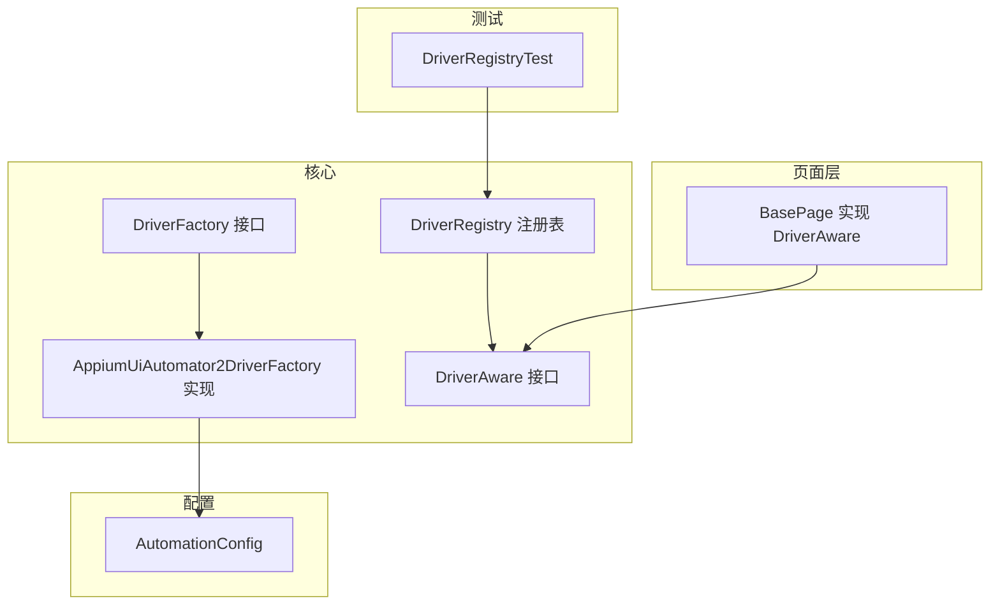
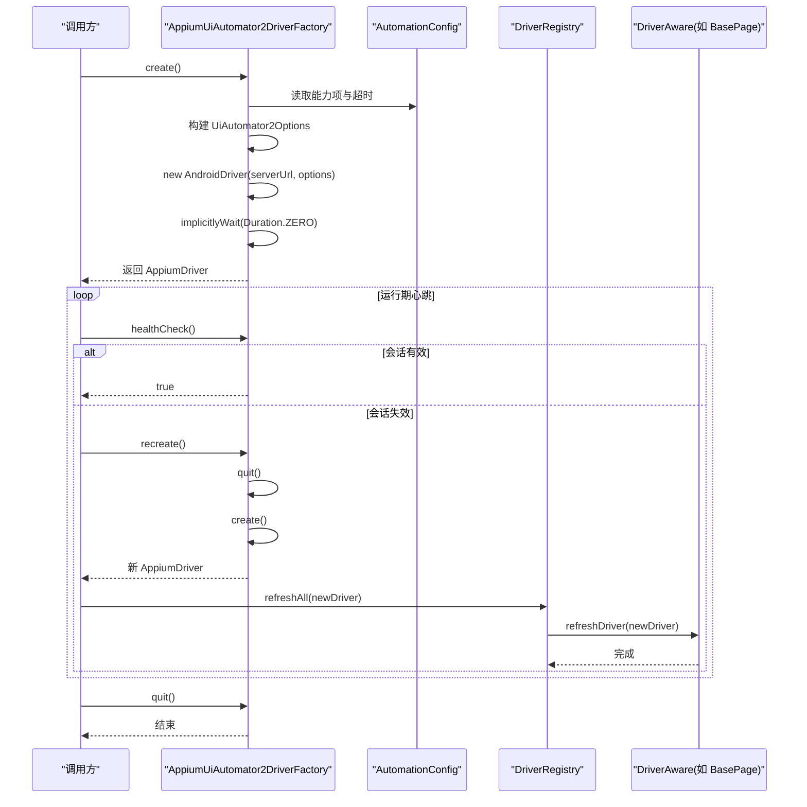
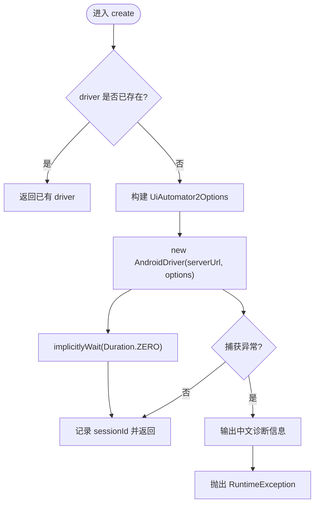
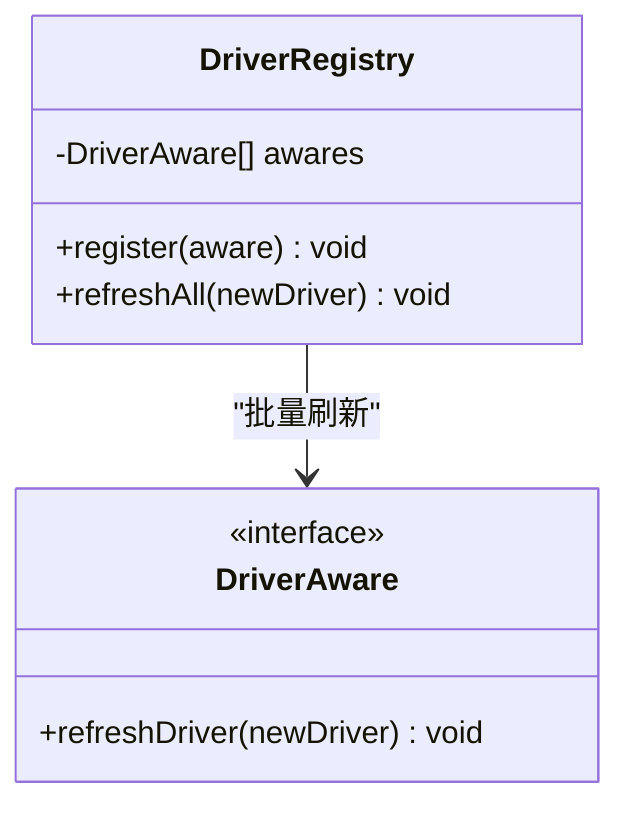
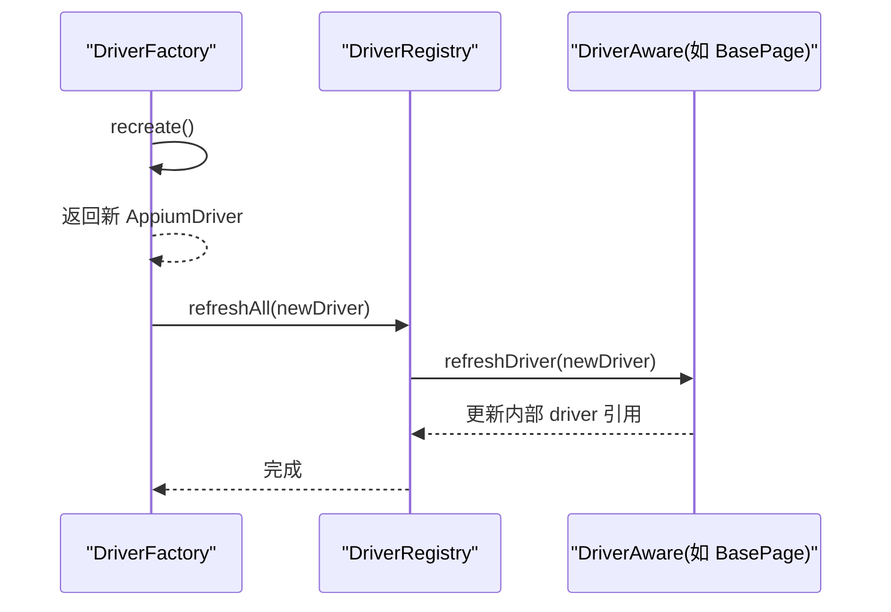
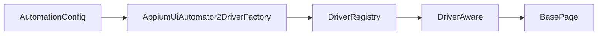

# 驱动管理

<cite>
**本文引用的文件**
- [DriverFactory.java](file://automation/src/main/java/com/fanqie/auto/core/DriverFactory.java)
- [AppiumUiAutomator2DriverFactory.java](file://automation/src/main/java/com/fanqie/auto/core/AppiumUiAutomator2DriverFactory.java)
- [DriverRegistry.java](file://automation/src/main/java/com/fanqie/auto/core/DriverRegistry.java)
- [DriverAware.java](file://automation/src/main/java/com/fanqie/auto/core/DriverAware.java)
- [AutomationConfig.java](file://automation/src/main/java/com/fanqie/auto/config/AutomationConfig.java)
- [BasePage.java](file://automation/src/main/java/com/fanqie/auto/page/BasePage.java)
- [DriverRegistryTest.java](file://automation/src/test/java/com/fanqie/auto/core/DriverRegistryTest.java)
</cite>

## 目录
1. [简介](#简介)
2. [项目结构](#项目结构)
3. [核心组件](#核心组件)
4. [架构总览](#架构总览)
5. [详细组件分析](#详细组件分析)
6. [依赖关系分析](#依赖关系分析)
7. [性能考量](#性能考量)
8. [故障排查指南](#故障排查指南)
9. [结论](#结论)
10. [附录：扩展新驱动类型开发指南](#附录：扩展新驱动类型开发指南)

## 简介
本模块围绕“驱动管理”展开，目标是统一创建、维护与刷新 Appium 会话，并通过注册表模式将多个持有 Driver 的组件（如页面对象）与底层驱动解耦。核心设计包括：
- DriverFactory 接口：抽象驱动工厂，屏蔽具体驱动实现差异，便于未来扩展其他平台或驱动协议。
- AppiumUiAutomator2DriverFactory：当前唯一实现，负责设备连接、会话创建、健康检查、重建与退出。
- DriverRegistry + DriverAware：通过注册表模式集中管理所有需要感知 Driver 变化的组件，在 session 重建后批量刷新引用，避免旧引用导致的异常。
- 配置中心 AutomationConfig：集中管理超时、设备、能力项等参数，保证行为可配置且可观测。

该设计确保上层业务（页面、状态机、日志等）对底层驱动细节零感知，提升可测试性、可维护性与可扩展性。

## 项目结构
驱动管理相关代码集中在 core 包中，配合 page 层的 BasePage 作为 DriverAware 的典型实现；配置集中在 config 包；测试覆盖注册表的正确性与健壮性。

图表来源
- [DriverFactory.java:1-55](file://automation/src/main/java/com/fanqie/auto/core/DriverFactory.java#L1-L55)
- [AppiumUiAutomator2DriverFactory.java:1-210](file://automation/src/main/java/com/fanqie/auto/core/AppiumUiAutomator2DriverFactory.java#L1-L210)
- [DriverRegistry.java:1-57](file://automation/src/main/java/com/fanqie/auto/core/DriverRegistry.java#L1-L57)
- [DriverAware.java:1-21](file://automation/src/main/java/com/fanqie/auto/core/DriverAware.java#L1-L21)
- [BasePage.java:1-516](file://automation/src/main/java/com/fanqie/auto/page/BasePage.java#L1-L516)
- [AutomationConfig.java:1-306](file://automation/src/main/java/com/fanqie/auto/config/AutomationConfig.java#L1-L306)
- [DriverRegistryTest.java:1-143](file://automation/src/test/java/com/fanqie/auto/core/DriverRegistryTest.java#L1-L143)

章节来源
- [DriverFactory.java:1-55](file://automation/src/main/java/com/fanqie/auto/core/DriverFactory.java#L1-L55)
- [AppiumUiAutomator2DriverFactory.java:1-210](file://automation/src/main/java/com/fanqie/auto/core/AppiumUiAutomator2DriverFactory.java#L1-L210)
- [DriverRegistry.java:1-57](file://automation/src/main/java/com/fanqie/auto/core/DriverRegistry.java#L1-L57)
- [DriverAware.java:1-21](file://automation/src/main/java/com/fanqie/auto/core/DriverAware.java#L1-L21)
- [BasePage.java:1-516](file://automation/src/main/java/com/fanqie/auto/page/BasePage.java#L1-L516)
- [AutomationConfig.java:1-306](file://automation/src/main/java/com/fanqie/auto/config/AutomationConfig.java#L1-L306)
- [DriverRegistryTest.java:1-143](file://automation/src/test/java/com/fanqie/auto/core/DriverRegistryTest.java#L1-L143)

## 核心组件
- DriverFactory：定义 create/recreate/healthCheck/quit/getDriver 的统一契约，屏蔽不同驱动实现的差异。
- AppiumUiAutomator2DriverFactory：基于 Appium 2 + UiAutomator2 的具体实现，负责构建 capabilities、创建 AndroidDriver、设置隐式等待为 0、健康检查、优雅退出与诊断输出。
- DriverRegistry：线程安全的注册表，集中管理实现了 DriverAware 的组件，并在 session 重建后批量刷新其 driver 引用。
- DriverAware：声明 refreshDriver(AppiumDriver) 回调，供注册表在重建后通知各组件更新内部 driver 引用。
- BasePage：典型 DriverAware 实现，持有 volatile AppiumDriver 字段，通过 refreshDriver 安全替换引用，避免 stale element 与 NoSuchSessionException。
- AutomationConfig：集中提供 Appium 服务器地址、平台、自动化名称、设备 UDID、noReset、超时、华为/鸿蒙适配开关等配置。

章节来源
- [DriverFactory.java:1-55](file://automation/src/main/java/com/fanqie/auto/core/DriverFactory.java#L1-L55)
- [AppiumUiAutomator2DriverFactory.java:1-210](file://automation/src/main/java/com/fanqie/auto/core/AppiumUiAutomator2DriverFactory.java#L1-L210)
- [DriverRegistry.java:1-57](file://automation/src/main/java/com/fanqie/auto/core/DriverRegistry.java#L1-L57)
- [DriverAware.java:1-21](file://automation/src/main/java/com/fanqie/auto/core/DriverAware.java#L1-L21)
- [BasePage.java:1-516](file://automation/src/main/java/com/fanqie/auto/page/BasePage.java#L1-L516)
- [AutomationConfig.java:1-306](file://automation/src/main/java/com/fanqie/auto/config/AutomationConfig.java#L1-L306)

## 架构总览
驱动管理的整体流程如下：
- 启动时根据配置选择并实例化 DriverFactory（当前为 AppiumUiAutomator2DriverFactory）。
- 首次调用 create() 建立 Appium session，立即设置隐式等待为 0，确保后续短轮询不被阻塞。
- 运行过程中定期 healthCheck() 探测会话有效性；若失败则触发 recreate() 重建会话。
- 重建成功后，DriverRegistry.refreshAll(newDriver) 批量通知所有 DriverAware 组件更新 driver 引用。
- 退出时 quit() 关闭 session，释放资源。

图表来源
- [AppiumUiAutomator2DriverFactory.java:44-118](file://automation/src/main/java/com/fanqie/auto/core/AppiumUiAutomator2DriverFactory.java#L44-L118)
- [DriverRegistry.java:30-55](file://automation/src/main/java/com/fanqie/auto/core/DriverRegistry.java#L30-L55)
- [AutomationConfig.java:112-178](file://automation/src/main/java/com/fanqie/auto/config/AutomationConfig.java#L112-L178)

## 详细组件分析

### DriverFactory 接口设计
- 职责边界：仅关注驱动的创建、重建、健康检查、退出与获取当前实例。
- 扩展点：通过接口隔离，未来新增 HdcUiTestDriverFactory 等实现时无需改动上层逻辑。
- 关键方法：
  - create：首次创建 session，包含完整初始化流程。
  - recreate：先退出再创建，用于断连恢复。
  - healthCheck：轻量探活，捕获会话异常。
  - quit：幂等退出，清理资源。
  - getDriver：暴露当前驱动实例（可能为 null）。

章节来源
- [DriverFactory.java:1-55](file://automation/src/main/java/com/fanqie/auto/core/DriverFactory.java#L1-L55)

### AppiumUiAutomator2DriverFactory 工作机制
- 设备连接与会话创建：
  - 从 AutomationConfig 读取 serverUrl、platformName、automationName、udid、noReset、newCommandTimeout 等。
  - 构建 UiAutomator2Options，开启自动授权、忽略隐藏 API 策略、抑制杀死 adb server 等能力，优化首启与安装超时。
  - 不设置 appActivity/app，改用运行时激活应用，规避权限问题。
  - 创建 AndroidDriver 后立即设置隐式等待为 0，保障短轮询不被阻塞。
- 健康检查：
  - 使用 window.getSize() 进行轻量探测，捕获 NoSuchSessionException/WebDriverException 判定会话失效。
- 重建与退出：
  - recreate() 先 quit() 再 create()，保证资源释放与重新建立。
  - quit() 捕获异常并置空 driver，确保幂等。
- 错误处理与诊断：
  - 捕获创建异常，输出中文诊断信息，涵盖 APK 安装弹窗、USB 调试、ADB 授权、Appium Server 状态等常见原因。

图表来源
- [AppiumUiAutomator2DriverFactory.java:44-76](file://automation/src/main/java/com/fanqie/auto/core/AppiumUiAutomator2DriverFactory.java#L44-L76)
- [AppiumUiAutomator2DriverFactory.java:120-178](file://automation/src/main/java/com/fanqie/auto/core/AppiumUiAutomator2DriverFactory.java#L120-L178)
- [AppiumUiAutomator2DriverFactory.java:180-208](file://automation/src/main/java/com/fanqie/auto/core/AppiumUiAutomator2DriverFactory.java#L180-L208)

章节来源
- [AppiumUiAutomator2DriverFactory.java:1-210](file://automation/src/main/java/com/fanqie/auto/core/AppiumUiAutomator2DriverFactory.java#L1-L210)
- [AutomationConfig.java:112-178](file://automation/src/main/java/com/fanqie/auto/config/AutomationConfig.java#L112-L178)

### DriverRegistry 注册表模式
- 目标：统一管理所有 DriverAware 组件，在 session 重建后批量刷新 driver 引用，避免旧引用导致异常。
- 线程安全：内部使用 CopyOnWriteArrayList，保证注册与遍历的并发安全。
- 容错：单个组件刷新失败不影响其余组件，记录警告并继续。
- 去重：register(null) 安全忽略，重复注册同一实例只保留一份。

图表来源
- [DriverRegistry.java:19-55](file://automation/src/main/java/com/fanqie/auto/core/DriverRegistry.java#L19-L55)
- [DriverAware.java:12-19](file://automation/src/main/java/com/fanqie/auto/core/DriverAware.java#L12-L19)

章节来源
- [DriverRegistry.java:1-57](file://automation/src/main/java/com/fanqie/auto/core/DriverRegistry.java#L1-L57)
- [DriverRegistryTest.java:1-143](file://automation/src/test/java/com/fanqie/auto/core/DriverRegistryTest.java#L1-L143)

### DriverAware 接口与刷新机制
- 作用：声明刷新 driver 引用的标准回调，使组件能够感知 session 重建事件。
- 刷新时机：由 DriverRegistry.refreshAll(newDriver) 在 recreate() 成功后统一触发。
- 安全性：BasePage 等实现中对 newDriver 判空，避免无效赋值；volatile 字段保证可见性。

图表来源
- [AppiumUiAutomator2DriverFactory.java:78-83](file://automation/src/main/java/com/fanqie/auto/core/AppiumUiAutomator2DriverFactory.java#L78-L83)
- [DriverRegistry.java:43-55](file://automation/src/main/java/com/fanqie/auto/core/DriverRegistry.java#L43-L55)
- [BasePage.java:70-73](file://automation/src/main/java/com/fanqie/auto/page/BasePage.java#L70-L73)

章节来源
- [DriverAware.java:1-21](file://automation/src/main/java/com/fanqie/auto/core/DriverAware.java#L1-L21)
- [BasePage.java:55-73](file://automation/src/main/java/com/fanqie/auto/page/BasePage.java#L55-L73)

### BasePage 中的 DriverAware 实践
- 持有 volatile AppiumDriver driver，确保多线程可见性。
- 实现 refreshDriver(newDriver) 安全替换引用，避免 stale element。
- 结合四级定位降级链（语义匹配、几何推断、时序兜底、系统兜底），在不依赖固定坐标的情况下稳定点击控件。

章节来源
- [BasePage.java:40-73](file://automation/src/main/java/com/fanqie/auto/page/BasePage.java#L40-L73)
- [BasePage.java:77-250](file://automation/src/main/java/com/fanqie/auto/page/BasePage.java#L77-L250)

## 依赖关系分析
- AppiumUiAutomator2DriverFactory 依赖 AutomationConfig 获取能力项与超时配置。
- DriverRegistry 依赖 DriverAware 接口，以多态方式批量刷新组件。
- BasePage 实现 DriverAware，持有 AppiumDriver 并通过刷新机制保持引用一致。
- 测试 DriverRegistryTest 验证注册表的一致性、透传性与容错性。

图表来源
- [AppiumUiAutomator2DriverFactory.java:1-42](file://automation/src/main/java/com/fanqie/auto/core/AppiumUiAutomator2DriverFactory.java#L1-L42)
- [DriverRegistry.java:19-55](file://automation/src/main/java/com/fanqie/auto/core/DriverRegistry.java#L19-L55)
- [BasePage.java:40-73](file://automation/src/main/java/com/fanqie/auto/page/BasePage.java#L40-L73)

章节来源
- [AppiumUiAutomator2DriverFactory.java:1-210](file://automation/src/main/java/com/fanqie/auto/core/AppiumUiAutomator2DriverFactory.java#L1-L210)
- [DriverRegistry.java:1-57](file://automation/src/main/java/com/fanqie/auto/core/DriverRegistry.java#L1-L57)
- [BasePage.java:1-516](file://automation/src/main/java/com/fanqie/auto/page/BasePage.java#L1-L516)
- [DriverRegistryTest.java:1-143](file://automation/src/test/java/com/fanqie/auto/core/DriverRegistryTest.java#L1-L143)

## 性能考量
- 隐式等待设置为 0：避免未命中查找阻塞，保障 250ms 短轮询设计不被破坏。
- 新命令超时配置：默认 1800s，配合心跳保活，防止长任务（如广告视频静默期）断连。
- 跳过不必要的初始化：skipServerInstallation/skipDeviceInitialization 可加速后续执行。
- 华为/鸿蒙优化：autoGrantPermissions、ignoreHiddenApiPolicyError、suppressKillServer、延长 uia2 安装/启动超时，提升首启稳定性。
- 窗口大小探测作为心跳：getWindowSize() 是最轻量的命令之一，降低健康检查开销。

[本节为通用性能建议，不直接分析具体文件]

## 故障排查指南
- Session 创建失败：
  - 检查手机是否有待确认的 APK 安装弹窗（华为「监控 ADB 安装应用」）。
  - 确认「仅充电模式下允许 ADB 调试」已开启。
  - 确认 USB 调试已开启，且已授权本机。
  - 确认 Appium Server 已启动并可访问 /status。
  - 确认 adb devices 能识别设备。
- 会话断开：
  - 健康检查失败时触发 recreate()，随后 DriverRegistry.refreshAll(newDriver) 刷新所有组件引用。
  - 若个别组件刷新失败，会记录警告但不影响其他组件。
- 页面操作异常：
  - 四级定位降级链可缓解自绘控件无属性问题；必要时启用 L2/L3 几何与时序兜底。
  - 若仍失败，尝试 L4 系统兜底（back 或重启应用）。

章节来源
- [AppiumUiAutomator2DriverFactory.java:180-208](file://automation/src/main/java/com/fanqie/auto/core/AppiumUiAutomator2DriverFactory.java#L180-L208)
- [DriverRegistry.java:43-55](file://automation/src/main/java/com/fanqie/auto/core/DriverRegistry.java#L43-L55)
- [BasePage.java:221-250](file://automation/src/main/java/com/fanqie/auto/page/BasePage.java#L221-L250)

## 结论
驱动管理模块通过 DriverFactory 抽象、AppiumUiAutomator2DriverFactory 实现、DriverRegistry 注册表与 DriverAware 刷新机制，构建了高内聚、低耦合的驱动生命周期管理体系。它确保了：
- 设备连接与会话创建的标准化与可配置化。
- 会话断线后的自动恢复与引用一致性。
- 多组件对驱动变化的统一感知与容错处理。
- 面向未来的扩展能力（如鸿蒙 NEXT 驱动替换）。

[本节为总结性内容，不直接分析具体文件]

## 附录：扩展新驱动类型开发指南
目标：在不改动上层业务的前提下，新增一种新的驱动类型（例如 HarmonyOS NEXT 的 HdcUiTestDriverFactory）。

步骤：
1. 新建实现类：
   - 实现 DriverFactory 接口，提供 create/recreate/healthCheck/quit/getDriver 的具体逻辑。
   - 参考 AppiumUiAutomator2DriverFactory 的能力构建与健康检查模式。
2. 接入配置：
   - 在 AutomationConfig.driverType() 中支持新的驱动类型标识（如 "harmony_hdc"）。
   - 在装配层根据 driverType 选择对应 DriverFactory 实现。
3. 注册刷新：
   - 确保所有持有 AppiumDriver 的组件实现 DriverAware，并在 DriverRegistry 中注册。
   - 在新驱动的重建流程中，调用 DriverRegistry.refreshAll(newDriver) 刷新引用。
4. 测试验证：
   - 编写单元测试模拟会话创建与重建，验证 refreshAll 的调用次数与参数透传。
   - 参考 DriverRegistryTest 的断言方式，验证一致性、隔离性与空注册表安全。

示例要点（路径引用）：
- 接口契约：见 [DriverFactory.java:18-53](file://automation/src/main/java/com/fanqie/auto/core/DriverFactory.java#L18-L53)
- 能力构建与超时：见 [AppiumUiAutomator2DriverFactory.java:120-178](file://automation/src/main/java/com/fanqie/auto/core/AppiumUiAutomator2DriverFactory.java#L120-L178)
- 健康检查与重建：见 [AppiumUiAutomator2DriverFactory.java:78-118](file://automation/src/main/java/com/fanqie/auto/core/AppiumUiAutomator2DriverFactory.java#L78-L118)
- 注册表刷新：见 [DriverRegistry.java:43-55](file://automation/src/main/java/com/fanqie/auto/core/DriverRegistry.java#L43-L55)
- 组件刷新实现：见 [BasePage.java:70-73](file://automation/src/main/java/com/fanqie/auto/page/BasePage.java#L70-L73)
- 配置驱动类型：见 [AutomationConfig.java:166-178](file://automation/src/main/java/com/fanqie/auto/config/AutomationConfig.java#L166-L178)
- 测试用例参考：见 [DriverRegistryTest.java:45-141](file://automation/src/test/java/com/fanqie/auto/core/DriverRegistryTest.java#L45-L141)

章节来源
- [DriverFactory.java:18-53](file://automation/src/main/java/com/fanqie/auto/core/DriverFactory.java#L18-L53)
- [AppiumUiAutomator2DriverFactory.java:78-178](file://automation/src/main/java/com/fanqie/auto/core/AppiumUiAutomator2DriverFactory.java#L78-L178)
- [DriverRegistry.java:43-55](file://automation/src/main/java/com/fanqie/auto/core/DriverRegistry.java#L43-L55)
- [BasePage.java:70-73](file://automation/src/main/java/com/fanqie/auto/page/BasePage.java#L70-L73)
- [AutomationConfig.java:166-178](file://automation/src/main/java/com/fanqie/auto/config/AutomationConfig.java#L166-L178)
- [DriverRegistryTest.java:45-141](file://automation/src/test/java/com/fanqie/auto/core/DriverRegistryTest.java#L45-L141)